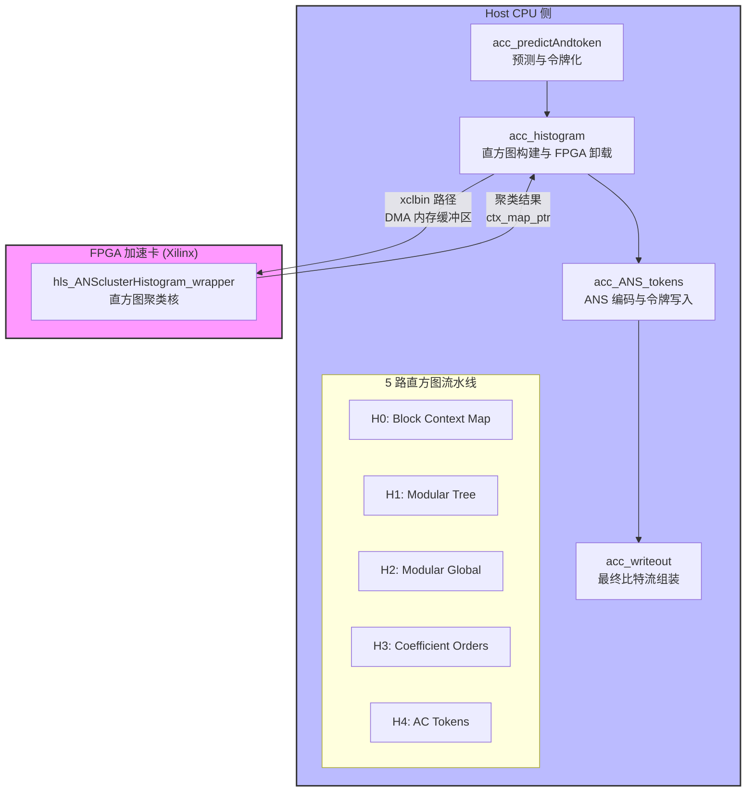

# host_acc_cluster_histogram 模块深度解析

## 一句话概括

这是一个**JPEG XL 编码器 Phase 3 的硬件加速核心**，负责将 CPU 构建的直方图数据卸载到 FPGA 进行高速聚类（Clustering），并协调 5 路并行的熵编码流水线，最终将 ANS 编码后的比特流写入输出缓冲区。你可以把它想象成一座**连接软件编码逻辑与 FPGA 加速引擎的跨海大桥**——它既要理解 JPEG XL 的复杂编码语义（系数顺序、模块化树、AC 令牌），又要处理 FPGA 的底层内存对齐、DMA 传输和 bitstream 加载。

---

## 架构全景图



### 关键数据流

1. **输入阶段** (`acc_predictAndtoken`): 从 `LossyFrameEncoder` 中提取量化后的 AC 系数、系数顺序（Coefficient Orders）和模块化帧数据，生成初始令牌流（Tokens）。

2. **直方图构建与硬件卸载** (`acc_histogram`): 在 CPU 侧构建 5 组直方图（`histograms_` 数组），每组包含多个上下文（Context）的频次统计。随后通过 `hls_ANSclusterHistogram_wrapper` 将这些数据卸载到 FPGA——这是本模块的**核心加速点**。

3. **ANS 编码** (`acc_ANS_tokens`): 使用 FPGA 返回的聚类后直方图（`clustered_histograms`）和上下文映射（`ctx_map_ptr`），通过 `StoreEntropyCodesNew` 和 `WriteTokens` 执行实际的 ANS 熵编码。

4. **输出组装** (`acc_writeout`): 将所有编码后的比特流（DC 组、AC 组、全局信息）按照 JPEG XL 的 TOC（Table of Contents）格式组装到最终的 `BitWriter` 中。

---

## 核心组件深度剖析

### 1. `acc_histogram` —— 硬件加速的 orchestrator

这是整个模块最复杂的函数，长度超过 800 行。它的核心职责是**准备数据、调用 FPGA、处理结果**。

#### 内存布局与 DMA 友好性

代码中为 5 组直方图分配了巨大的连续内存块：

```cpp
// 为每组直方图分配 4096 * 40 个 int32_t 的缓冲区
histograms_ptr[i] = (int32_t*)malloc(4096 * 40 * sizeof(int32_t));
memset(histograms_ptr[i], 0, 4096 * 40 * sizeof(int32_t));
```

**设计意图**：4096 是最大直方图数量，40 是每个直方图的最大符号数。这种**扁平化、连续的内存布局**对 FPGA DMA 传输极其友好——FPGA 可以直接通过物理地址顺序读取，无需处理复杂的指针间接寻址。

#### 硬件接口契约

```cpp
#ifndef HLS_TEST
  hls_ANSclusterHistogram_wrapper(
    xclbinPath,  // FPGA bitstream 路径
    config,      // 35 个 uint32_t 的配置数组
    histograms_ptr[0], histo_totalcnt_ptr[0], ...  // 5 组 DMA 缓冲区
  );
#else
  acc_ANSclusterHistogram(...);  // 纯软件仿真版本
#endif
```

**关键设计决策**：
- **双模式编译**：`HLS_TEST` 宏控制是链接真实的 FPGA 驱动（Xilinx XRT）还是使用纯软件仿真。这使得模块可以在没有硬件的情况下进行功能验证。
- **配置数组契约**：`config[0-4]` 是 5 组直方图的数量，`config[5-9]` 是非空直方图数量，`config[10-14]` 是最大索引等。这种**裸数组契约**要求调用者和 FPGA 核开发者严格同步文档。

### 2. `acc_predictAndtoken` —— 编码语义的提取器

这个函数处理 JPEG XL 中最复杂的编码细节之一：**系数顺序（Coefficient Orders）的编码**。

#### Move-to-Front 与 Lehmer 编码

```cpp
// 将系数顺序转换为 Lehmer 编码，然后 Tokenize
void acc_EncodeCoeffOrder(...) {
    // 1. 应用自然系数顺序的 LUT 转换
    for (size_t i = 0; i < size; ++i) {
        order_zigzag[i] = natural_coeff_order_lut[order[i]];
    }
    // 2. 使用 Lehmer 编码（排列编码）压缩
    acc_TokenizePermutation(order_zigzag, llf, size, tokens);
}
```

**设计洞察**：JPEG XL 允许自定义 AC 系数的扫描顺序（用于优化特定图像的压缩率）。直接存储排列（permutation）需要 $O(n \log n)$ 比特，但通过**Lehmer 编码**（将排列转换为 Lehmer 码）和**Move-to-Front 变换**（对符号进行局部性压缩），可以大幅减少开销。这段代码体现了 JPEG XL 标准对压缩率的极致追求。

### 3. `acc_ANS_tokens` —— 熵编码的调度器

这个函数管理 5 路并行的熵编码流水线。每一路对应不同的编码层（Layer）：

- **Layer 0 (kLayerAC)**: Block Context Map
- **Layer 1 (kLayerModularTree)**: 模块化树
- **Layer 2 (kLayerModularGlobal)**: 模块化全局数据
- **Layer 3 (kLayerOrder)**: 系数顺序
- **Layer 4 (kLayerACTokens)**: AC 令牌

**设计模式**：代码中大量使用**条件编译和硬编码的 Part ID**（如 `update_part(10)`, `update_part(20)` 等）。这些 Part ID 对应 FPGA 缓冲区中的特定偏移，用于**零拷贝（Zero-Copy）DMA 传输**——CPU 和 FPGA 通过共享内存缓冲区直接交换数据，无需额外的内存拷贝。

---

## 设计决策与权衡

### 1. 硬件加速 vs 软件灵活性

**选择**：将直方图聚类（Histogram Clustering）卸载到 FPGA，但保留 Token 生成和最终比特流组装在 CPU。

**理由**：
- **计算密度**：直方图聚类涉及对大量频次数据进行相似性计算和 K-Means 风格的聚类，计算密度高，适合 FPGA 的并行 LUT 和 DSP 资源。
- **控制流复杂性**：Token 生成涉及复杂的条件逻辑和 JPEG XL 标准特有的边界情况，用 C++ 在 CPU 上实现更易维护。
- **数据局部性**：直方图数据是聚合后的统计信息（通常只有数千个整数），通过 PCIe 传输到 FPGA 的延迟可以接受；而原始像素数据量太大，不适合往返传输。

**权衡**：引入了对外部硬件（Xilinx FPGA 和 XRT 运行时）的硬依赖，编译和部署复杂度显著增加。

### 2. 扁平化内存 vs 面向对象结构

**选择**：使用裸 `malloc` 分配巨大的连续缓冲区（`4096 * 40 * int32_t`），而不是 `std::vector<std::vector<int>>`。

**理由**：
- **DMA 兼容性**：FPGA 的 DMA 引擎通常需要物理连续的内存页和简单的基地址+长度描述符。嵌套的 `std::vector` 会导致堆上的碎片化内存，无法直接用于 DMA。
- **缓存行对齐**：使用 `hwy::AllocateAligned` 确保 SIMD 友好的对齐（尽管这里主要是为了硬件接口）。

**权衡**：丧失了 C++ 的 RAII 内存安全和边界检查。代码中充斥着裸指针运算和手动 `memset`，极易出现内存泄漏（实际上代码中确实没有看到 `free` 调用，可能是短期运行程序，或者是内存泄漏隐患）或缓冲区溢出。

### 3. 宏控制的硬件抽象

**选择**：使用 `HLS_TEST` 宏来切换真实 FPGA 驱动和软件仿真实现。

**理由**：
- **可测试性**：允许在没有 FPGA 硬件的 x86 服务器上进行功能验证和调试。
- **开发效率**：软件仿真通常比硬件综合+部署快几个数量级，便于快速迭代算法。

**权衡**：代码中充斥着 `#ifndef HLS_TEST` 的条件编译块，导致阅读和维护困难。两种模式的接口必须保持严格一致，否则会出现"在仿真中工作，在硬件中崩溃"的棘手问题。

---

## 给新贡献者的实战指南

### 1. 内存管理雷区

**危险模式**：
```cpp
// 在 acc_histogram 中分配的内存，在函数结束后仍被使用
histograms_ptr[i] = (int32_t*)malloc(4096 * 40 * sizeof(int32_t));
// ... 传递给 FPGA ...
// 函数返回，但 pointers 被存储在 enc_state_ 或其他地方
```

**正确做法**：
- 确认这些缓冲区是"Fire-and-forget"（程序结束前不释放）还是有明确的生命周期。如果是后者，必须使用 `std::unique_ptr<int32_t[], decltype(&free)>` 或类似的 RAII 包装器。
- **永远不要**将裸指针从栈上变量传递给 FPGA DMA，必须使用页锁定的（pinned）内存。

### 2. FPGA 硬件调试

如果你遇到 `hls_ANSclusterHistogram_wrapper` 返回错误或不正确的结果：

1. **检查 XRT 环境**：确保 `xclbinPath` 指向的 bitstream 与当前代码版本匹配。FPGA 逻辑和主机代码是紧耦合的。

2. **验证 DMA 缓冲区**：使用 `xbutil` 或类似的 Xilinx 工具检查 DMA 传输前后的内存内容是否一致。由于缓存一致性问题，主机缓存中的数据可能尚未刷新到 FPGA 可见的内存。

3. **启用 HLS 测试模式**：定义 `HLS_TEST` 宏，使用纯软件路径验证算法逻辑。如果软件模式通过但硬件失败，问题很可能在接口契约（Config 数组解析、缓冲区大小计算）。

### 3. 配置数组的隐式契约

`config` 数组（35 个 uint32_t）是主机与 FPGA 核之间的**二进制契约**：

```cpp
config[0-4]   = 每组直方图的数量 (numHisto)
config[5-9]   = 非空直方图数量
config[10-14] = 最大索引 (largest_idx)
config[15-19] = 聚类后直方图数量 (numHisto_clusd)
config[20-24] = 聚类后内部直方图大小
config[25-29] = do_once 标志
```

**警告**：修改主机代码中的任何索引逻辑（如 `histograms_[i].size()`）而不同步更新 FPGA 核的解析逻辑，将导致**静默的数据损坏**或硬件挂起。

### 4. 小图像优化路径

注意代码中大量出现的 `is_small_image` 检查：

```cpp
const bool is_small_image = frame_dim.num_groups == 1 && num_passes == 1;
```

当处理单组、单通道的小图像时，模块会切换到一个简化的内存布局（使用 `update_part(80)` 而非 `update_part(20)` 等）。这是为了**避免 FPGA 启动开销超过收益**的情况。如果你在调试时发现小图像和大图像的行为不一致，检查这些路径的差异。

---

## 参考文献

- **父模块**: [host_acceleration_timing_and_phase_profiling](codec_acceleration_and_demos-jxl_and_pik_encoder_acceleration-host_acceleration_timing_and_phase_profiling.md) - 提供高层级的 Phase 3 调度框架
- **同级模块**: [host_acc_tokInit_histogram](codec_acceleration_and_demos-jxl_and_pik_encoder_acceleration-host_acceleration_timing_and_phase_profiling-phase3_histogram_host_timing-host_acc_tokInit_histogram.md) - 处理初始直方图生成的替代路径
- **外部依赖**: 
  - **Xilinx XRT**: 用于 `xclbin` 加载和 DMA 传输
  - **JPEG XL Reference Software**: `lib/jxl` 中的 `EntropyEncodingData`, `HistogramParams`, `WriteTokens` 等
- **硬件对应**: `hls_cluster_histogram`（在 `HLS_TEST` 模式下使用的软件仿真版本）