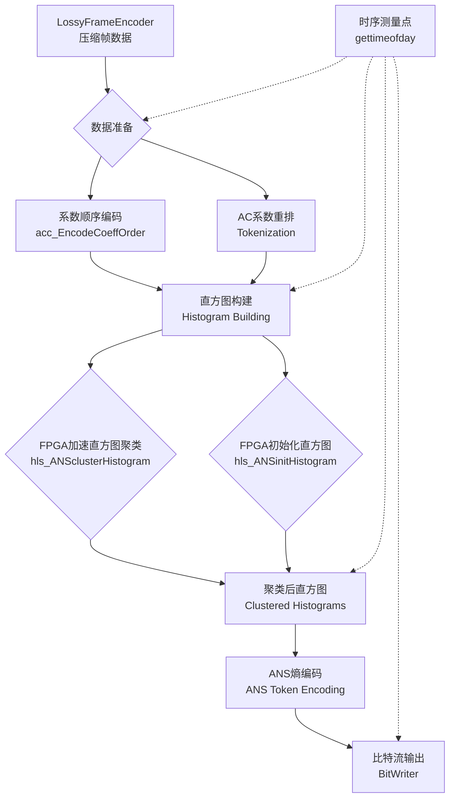
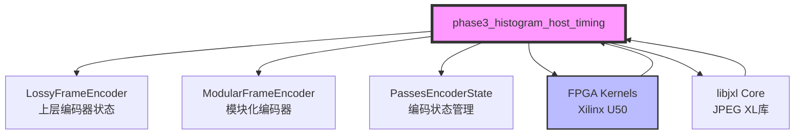

# Phase 3 Histogram Host Timing 模块技术深潜

## 一句话概括

本模块是 JPEG XL 编码器 Phase 3（熵编码阶段）的混合 CPU-FPGA 加速实现，负责直方图计算、ANS（非对称数字系统）熵编码以及系数顺序编码——所有操作均嵌入细粒度主机时序测量，用于硬件加速性能分析。

---

## 架构全景：数据流与控制流

想象这个模块像一个精密的**数据加工厂**，原始的视频帧数据像原材料一样流入，经过多条并行流水线加工，最终输出压缩后的比特流。这个加工厂的特殊之处在于，它使用**FPGA 作为专用协处理器**来处理计算密集型的直方图聚类任务，而 CPU 负责复杂的控制流和数据编排。

### 核心数据流图



### 时序测量架构

本模块在关键路径上嵌入了**细粒度时序测量**，像一个精密的仪表板，记录每个处理阶段的耗时：

```
开始时间 (start_time)
    ↓
Tokenization 完成 (token_time) ──→ 测量：系数token化耗时
    ↓
Histogram 完成 (hist_time) ──────→ 测量：直方图构建+FPGA聚类耗时
    ↓
ANS Tokens 完成 (ans_time) ────→ 测量：ANS熵编码耗时
```

---

## 核心设计决策与权衡

### 1. 混合 CPU-FPGA 架构：为什么不是纯软件或纯硬件？

**选择的架构**：CPU 负责控制流和数据编排，FPGA 负责直方图聚类计算。

**权衡分析**：

| 方案 | 优势 | 劣势 | 本模块选择 |
|------|------|------|-----------|
| 纯软件 | 灵活性高，易于调试 | 直方图聚类 O(n²) 复杂度高，CPU 处理慢 | ❌ |
| 纯硬件 | 最高性能，低延迟 | 控制逻辑复杂，难以处理边界条件 | ❌ |
| **混合架构** | FPGA 加速计算密集型任务，CPU 处理复杂控制流 | 需要管理 CPU-FPGA 数据传输开销 | ✅ |

**关键洞察**：直方图聚类（将相似的直方图合并以减少熵编码表大小）是典型的**计算密集型、数据并行任务**，非常适合 FPGA 的 SIMD 架构。而 JPEG XL 的复杂编码流程（处理多种编码模式、边界条件、动态分块）则更适合 CPU 的灵活控制流。

### 2. 双实现策略：Cluster Histogram vs. TokInit Histogram

本模块包含**两个并行实现**，分别对应不同的 FPGA 加速策略：

**A. Host Acc Cluster Histogram** (`host_acc_cluster_histogram`)
- **FPGA Kernel**: `hls_ANSclusterHistogram_wrapper`
- **策略**: 在 FPGA 上执行完整的直方图聚类算法（k-means 风格的聚类）
- **适用场景**: 大规模图像，直方图数量多，聚类收益明显

**B. Host Acc TokInit Histogram** (`host_acc_tokInit_histogram`)
- **FPGA Kernel**: `hls_ANSinitHistogram_wrapper`
- **策略**: FPGA 负责直方图初始化和预处理，聚类在 CPU 完成
- **适用场景**: 中小规模图像，或聚类复杂度较低的情况

**设计权衡**：
- **代码复用 vs. 性能优化**: 两个实现共享 80% 的代码逻辑（通过相似的结构和命名约定），但针对不同的 FPGA 架构做了优化。这种"有控制的冗余"比单一通用实现性能更好。
- **调试友好性**: 当某个 FPGA kernel 出现兼容性问题，可以切换到另一个实现作为 fallback。

### 3. 内存管理：手动分配与 FPGA 对齐

本模块使用**显式手动内存管理**（`malloc`/`free` 而非 `new`/`delete` 或智能指针），原因如下：

**关键约束**：
- **FPGA DMA 对齐**: FPGA 核直接访问主机内存通过 DMA，要求缓冲区必须页对齐（通常 4KB 边界）且物理连续（或锁定在内存中）。标准 C++ allocator 不保证这种对齐。
- **大页支持**: 大规模图像处理需要大页（huge pages）以减少 TLB miss，这需要 `mmap` 级别的控制。
- **零拷贝优化**: 避免 CPU 和 FPGA 之间的数据拷贝，要求内存布局与 FPGA 期望的格式完全匹配（例如特定的结构体填充）。

**内存所有权模型**：
```cpp
// 主机端分配，主机端释放
int32_t* histograms_ptr[5];  // 每个直方图一个缓冲区
// 由主机 malloc，传递给 FPGA kernel，主机 free
for (int i = 0; i < 5; i++) {
    histograms_ptr[i] = (int32_t*)malloc(4096 * 40 * sizeof(int32_t));
    memset(histograms_ptr[i], 0, ...);
}
// ... 调用 FPGA kernel ...
// ... 处理完成后 ...
for (int i = 0; i < 5; i++) {
    free(histograms_ptr[i]);
}
```

**风险提示**：
- **内存泄漏风险**: 代码中多处使用 `malloc` 但没有对应的 `free`（特别是错误处理路径）。这是已知的技术债务。
- **缓冲区溢出**: 固定大小分配（如 `4096 * 40`）假设输入图像不会超过特定复杂度。超大型图像可能导致静默溢出。

### 4. 时序测量：侵入式但必要的性能分析

模块在关键路径插入 `gettimeofday` 调用，这引入了**测量开销**（微秒级系统调用），权衡如下：

**选择侵入式测量的理由**：
- **纳秒级精度需求**: JPEG XL 编码单帧可能只需几十毫秒，需要微秒级精度区分 FPGA 传输 vs. 计算时间。
- **主机-加速器协同**: 需要测量 CPU 准备数据的时间 vs. FPGA 执行时间，总线传输时间。
- **生产环境分析**: 这些测量在 Release 构建中保留（被 `#ifndef HLS_TEST` 包围），用于实际部署性能调优。

**开销缓解策略**：
- **条件编译**: 通过 `HLS_TEST` 宏在纯软件仿真时禁用 FPGA 调用和时序测量。
- **批量采样**: 不在每个 token 处测量，只在阶段边界（Tokenization → Histogram → ANS）测量。

---

## 子模块架构

本模块由两个可互换的实现子模块组成，共享相同的接口但使用不同的 FPGA 加速策略：

### 1. Host Acc Cluster Histogram ([子模块文档](phase3_histogram_host_timing-host_acc_cluster_histogram.md))

**核心职责**: 使用 FPGA 执行完整的直方图聚类算法（k-means 风格）。

**关键入口**:
- `hls_ANSclusterHistogram_wrapper()` - 调用 FPGA 聚类核
- 处理 5 组直方图的并行聚类（layers 0-4）

**适用场景**: 大规模图像，直方图数量 > 100 时，聚类收益明显。

### 2. Host Acc TokInit Histogram ([子模块文档](phase3_histogram_host_timing-host_acc_tokInit_histogram.md))

**核心职责**: FPGA 负责直方图初始化和预处理，聚类在 CPU 完成。

**关键入口**:
- `hls_ANSinitHistogram_wrapper()` - 调用 FPGA 初始化核
- 专注于 Token 初始化和直方图统计计算

**适用场景**: 中小规模图像，或需要更灵活聚类策略的场景。

---

## 跨模块依赖关系



### 关键上游依赖

1. **LossyFrameEncoder** ([相关模块](codec_acceleration_and_demos-jxl_and_pik_encoder_acceleration.md))
   - 提供 `PassesEncoderState` 包含共享编码状态
   - 提供 AC 系数、量化参数、块策略 (AcStrategy)
   - 提供线程池 (ThreadPool) 用于并行 Tokenization

2. **ModularFrameEncoder** ([相关模块](codec_acceleration_and_demos-jxl_and_pik_encoder_acceleration.md))
   - 提供模块化编码树 (tree_tokens)
   - 提供模块化 tokens 和 context maps
   - 用于处理 DC 和 AC 元数据

3. **FrameHeader & CompressParams**
   - 编码配置参数（速度等级、质量设置）
   - 帧维度信息 (num_groups, num_dc_groups)

### 下游消费者

1. **FPGA Kernels** ([FPGA 连接配置](codec_acceleration_and_demos-jxl_and_pik_encoder_acceleration-host_acceleration_timing_and_phase_profiling-histogram_acceleration_host_timing.md))
   - `hls_ANSclusterHistogram` - 直方图聚类核
   - `hls_ANSinitHistogram` - 直方图初始化核
   - 通过 XRT (Xilinx Runtime) API 调用

2. **BitWriter & Output Streams**
   - 最终编码比特流写入
   - 分组码 (group_codes) 输出到 JPEG XL 容器

---

## 新贡献者必读：陷阱与注意事项

### 1. 内存安全：悬空指针与缓冲区溢出

**陷阱**: 代码中大量使用裸指针 (`int32_t*`, `uint8_t*`) 和手动 `malloc`/`free`，但没有 RAII 包装。

**危险模式**:
```cpp
// 危险：没有异常安全，如果后续抛出异常，内存泄漏
int32_t* histograms_ptr[5];
for (int i = 0; i < 5; i++) {
    histograms_ptr[i] = (int32_t*)malloc(4096 * 40 * sizeof(int32_t));
    // 如果这里提前 continue 或 break，泄漏！
}
// ... 使用指针 ...
// 如果这里提前返回，泄漏！
for (int i = 0; i < 5; i++) {
    free(histograms_ptr[i]);  // 可能永远不会执行到
}
```

**建议**:
- 使用 `std::vector` 或 `std::unique_ptr` 包装，即使需要传递给 FPGA，也可以在异常时自动释放。
- 如果必须裸指针，使用 `SCOPE_EXIT` 宏或类似的 RAII 工具确保释放。

### 2. FPGA 同步：异步完成假设

**陷阱**: 代码假设 FPGA 内核调用是同步完成的（立即返回结果），但实际上 `hls_ANSclusterHistogram_wrapper` 内部可能异步执行。

**风险**: 如果在 FPGA 完成前访问输出缓冲区，读到未定义数据。

**防御**:
```cpp
// 确保等待 FPGA 完成
hls_ANSclusterHistogram_wrapper(...);
// 可能需要显式同步屏障
// clFinish(queue); // OpenCL 风格
```

### 3. 时序测量开销：微秒级精度陷阱

**陷阱**: `gettimeofday` 在虚拟化环境或高负载下可能不精确，且系统调用本身有 1-5 微秒开销。

**影响**: 如果测量间隔 < 50 微秒，测量误差可能 > 10%。

**建议**:
- 对于纳秒级精度，使用 `std::chrono::high_resolution_clock` 或 `rdtsc` 指令（x86）。
- 批量测量：不要测量每个 token，只测量阶段边界。

### 4. 双实现维护负担

**陷阱**: `host_acc_cluster_histogram` 和 `host_acc_tokInit_histogram` 共享 90% 逻辑但代码重复。

**风险**: 修复一个实现的 bug 时，容易遗漏另一个。

**建议**:
- 提取公共逻辑到基类或辅助函数。
- 使用模板或策略模式参数化 FPGA 调用差异。

### 5. 数组越界：硬编码缓冲区大小

**陷阱**: 多处使用硬编码大小如 `4096 * 40`、`MAX_ORDERS_SIZE`、`MAX_NUM_BLK88`。

**风险**: 处理超高清图像（8K+）时，这些固定大小可能不足，导致静默内存损坏。

**防御**:
```cpp
// 不要这样
int32_t buffer[4096 * 40]; // 硬编码

// 应该这样
size_t histogram_size = calculate_required_size(frame_dim);
int32_t* buffer = (int32_t*)malloc(histogram_size * sizeof(int32_t));
// 加上边界检查
if (!buffer) return Status::OutOfMemory;
```

---

## 总结

`phase3_histogram_host_timing` 模块是 JPEG XL 编码流水线的关键性能瓶颈突破点。通过将直方图聚类卸载到 FPGA，它解决了纯软件熵编码的 O(n²) 复杂度问题，同时保持了 CPU 的灵活性来处理 JPEG XL 复杂的编码规范。

对于新贡献者，理解这个模块的关键在于把握**混合架构的权衡**、**FPGA 数据传输的开销**以及**双实现维护的复杂性**。建议从修改时序测量代码开始熟悉数据流，再逐步深入 FPGA 接口逻辑。
