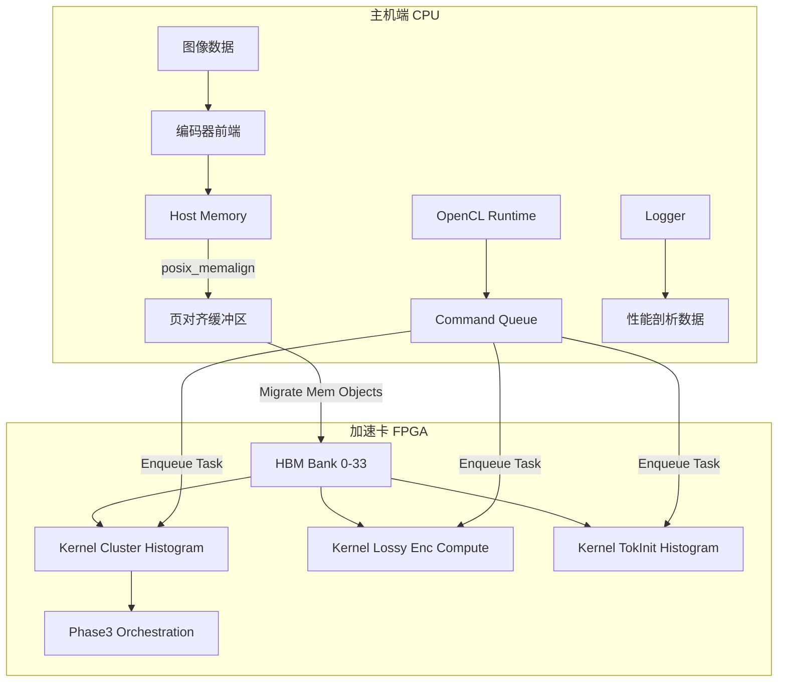

# Host Acceleration Timing and Phase Profiling 模块

## 概述：FPGA 加速的任务控制中心

想象你正在指挥一个高度自动化的工厂，其中 CPU 是调度中心，而 FPGA 是极速生产线。`host_acceleration_timing_and_phase_profiling` 模块就是这个工厂的**控制室**——它不仅负责将原材料（图像数据）运送到生产线（FPGA 内核），还精确记录每个环节的时间消耗，确保整个编码流程如时钟般精准运转。

在 JPEG XL 编码器的架构中，该模块承担着**异构计算编排器**的角色。它桥接了高层编码逻辑与底层 FPGA 加速实现，通过 OpenCL 运行时管理设备内存、调度内核执行，并提供纳秒级精度的性能剖析。没有这一层，高级的熵编码加速（如 ANS 直方图聚类、Token 初始化）将无法与主机端的无损编码流程无缝协作。

## 架构全景：数据流与控制流



### 核心组件职责

该模块包含五个紧密协作的子系统，分别对应 JPEG XL 编码流程中的关键加速环节：

| 子系统 | 核心文件 | 职责描述 |
|--------|----------|----------|
| **直方图聚类主机时序** | `host_cluster_histogram.cpp` | 管理 ANS 直方图聚类内核的生命周期，包括 5 组并行直方图流的内存分配、HBM 银行绑定和结果回传 |
| **有损编码计算主机时序** | `host_lossy_enc_compute.cpp` |  orchestrates 有损编码的预处理计算，包括 opsin 转换、量化场计算和 DC 系数处理 |
| **Token 初始化直方图主机时序** | `host_tokinit_histogram.cpp` | 处理 Token 流的初始化直方图构建，管理 AC 系数排序、策略选择和上下文映射的 FPGA 加速 |
| **Phase3 直方图聚类编排** | `acc_phase3.cpp` (cluster) | 高阶编排逻辑，协调 5 组直方图的聚类决策、上下文图编码和熵编码数据结构的最终构建 |
| **Phase3 Token 初始化编排** | `acc_phase3.cpp` (tokInit) | 类似的高阶编排，专注于 Token 初始化阶段的完整数据流，包括系数排序和策略编码的 FPGA 加速集成 |

## 设计哲学与权衡

### 为什么使用显式 OpenCL 而非更高层抽象？

本模块直接基于 Xilinx OpenCL 扩展（`xcl2.hpp`）编程，而非使用 OpenVINO、TensorRT 或更高层的 C++ 封装（如 SYCL）。这一选择反映了以下工程权衡：

**控制力 vs 可移植性**：该模块需要精确控制内存银行分配（`XCL_BANK(0)` 到 `XCL_BANK(33)`）以最大化 HBM 带宽利用率。高层抽象通常会隐藏这些硬件细节，导致内存争用和性能下降。

**确定性 vs 灵活性**：JPEG XL 编码对延迟敏感，需要可预测的执行时间。直接使用 OpenCL 的 `enqueueMigrateMemObjects` + `enqueueTask` + `finish` 模式提供了明确的同步点，便于精确测量 H2D 传输、内核执行和 D2H 传输的耗时。

### 内存管理：为什么坚持 `posix_memalign`？

代码中大量使用 `posix_memalign(&ptr, 4096, ...)` 而非 C++ 智能指针或 `std::vector`，这是 FPGA DMA 的硬性要求：

- **页对齐**：FPGA 的 DMA 引擎通常要求内存缓冲区至少按页（4KB）对齐，以确保散集列表（scatter-gather list）的效率。
- **零拷贝**：通过 `CL_MEM_USE_HOST_PTR` 标志，OpenCL 缓冲区直接映射这些对齐的主机内存，避免额外的数据拷贝。
- **所有权明确**：虽然代码使用原始指针，但生命周期是严格受限的（函数作用域内 `malloc`，结束前 `free`），且不存在跨函数边界的指针传递。

### 同步执行 vs 异步流水线

当前所有内核启动都使用 `q.finish()` 进行硬同步，这牺牲了流水线重叠（overlap）的机会：

```cpp
q.enqueueMigrateMemObjects(ob_in, 0, nullptr, &events_write[0]);
q.enqueueTask(cluster_kernel[0], &events_write, &events_kernel[0]);
q.enqueueMigrateMemObjects(ob_out, 1, &events_kernel, &events_read[0]);
q.finish();  // 硬同步点
```

**权衡考量**：这种设计优先保障**确定性**和**可测量性**。对于开发阶段的性能剖析，硬同步确保了我们精确测量的是单个内核的端到端延迟，而非被其他并发执行混淆的统计时间。在生产环境中，这些 `finish()` 调用可以被事件链（event chaining）和依赖图替代，以构建流水线。

## 性能剖析：时间的精确解剖

该模块内置了纳秒级精度的时间测量能力，其测量维度覆盖了整个异构计算的完整生命周期：

### 测量维度矩阵

| 测量点 | 技术实现 | 时间精度 | 关键指标 |
|--------|----------|----------|----------|
| **端到端 (E2E)** | `gettimeofday()` | 微秒 | 用户感知延迟 |
| **H2D 传输** | `CL_PROFILING_COMMAND_START/END` | 纳秒 | PCIe 带宽利用率 |
| **内核执行** | `CL_PROFILING_COMMAND_START/END` | 纳秒 | FPGA 核心频率效率 |
| **D2H 传输** | `CL_PROFILING_COMMAND_START/END` | 纳秒 | 下行链路瓶颈识别 |

### 测量机制详解

代码通过 OpenCL 事件（`cl::Event`）对象捕获精确的时间戳：

```cpp
std::vector<cl::Event> events_write(1);
std::vector<cl::Event> events_kernel(1);
std::vector<cl::Event> events_read(1);

// 迁移内存对象，记录写入事件
q.enqueueMigrateMemObjects(ob_in, 0, nullptr, &events_write[0]);
// 执行内核，依赖写入完成
q.enqueueTask(cluster_kernel[0], &events_write, &events_kernel[0]);
// 读回结果，依赖内核完成
q.enqueueMigrateMemObjects(ob_out, 1, &events_kernel, &events_read[0]);
q.finish();

// 提取纳秒级时间戳
unsigned long timeStart, timeEnd;
events_write[0].getProfilingInfo(CL_PROFILING_COMMAND_START, &timeStart);
events_write[0].getProfilingInfo(CL_PROFILING_COMMAND_END, &timeEnd);
exec_time0 = (timeEnd - timeStart) / 1000.0;  // 转换为微秒
```

**设计亮点**：通过 `CL_QUEUE_PROFILING_ENABLE` 标志启用的命令队列，结合事件依赖链（`&events_write` 作为 `enqueueTask` 的依赖），确保了时间戳捕获的精确性和因果关系的一致性。

## 跨模块依赖与交互

本模块处于整个 JPEG XL FPGA 加速子系统的中心位置，其上下游依赖关系如下：

### 上游依赖（输入来源）

1. **[上层编码流程控制](../codec_acceleration_and_demos-jxl_and_pik_encoder_acceleration.md)**：接收经过预处理的图像数据（opsin 转换后）和编码参数（`CompressParams`、`FrameHeader`）。

2. **[熵编码核心库](internal_entropy_encoding.md)**（隐含依赖）：代码中大量使用了 `EntropyEncodingData`、`Histogram`、`Token` 等类型，这些定义来自熵编码基础库。

### 下游依赖（输出去向）

1. **[FPGA 内核实现](kernel_implementation.md)**（隐含）：本模块通过 OpenCL 调用的内核（如 `JxlEnc_ans_clusterHistogram`、`JxlEnc_lossy_enc_compute`）由独立的 HLS/Vitis 工程实现，本模块仅负责主机端控制。

2. **[Xilinx 运行时库](xrt_dependencies.md)**：依赖 `xcl2` 工具库进行设备发现、二进制加载，以及 `xf_utils_sw::Logger` 进行运行时日志记录。

### 同级模块协作

- **[Phase3 编排子系统](phase3_histogram_host_timing.md)**：本模块中的 Phase3 组件与直方图聚类、Token 初始化组件紧密协作，形成完整的熵编码加速流水线。

## 新贡献者须知：陷阱与最佳实践

### 常见陷阱

1. **HBM 银行分配越界**  
   代码中定义了 `XCL_BANK0` 到 `XCL_BANK33` 共 34 个内存银行。新贡献者在添加新缓冲区时，若复用已有银行索引，可能导致内存带宽争用；若使用越界索引（>=34），则会在运行时触发 `CL_INVALID_VALUE` 错误。

2. **对齐要求疏忽**  
   所有通过 `posix_memalign(&ptr, 4096, ...)` 分配的内存必须在使用完毕后显式 `free()`。遗漏释放会导致主机内存泄漏；更隐蔽的是，若缓冲区通过 `CL_MEM_USE_HOST_PTR` 映射到 OpenCL，在内核执行期间释放主机内存将导致未定义行为。

3. **事件对象生命周期**  
   `cl::Event` 对象在 `enqueueMigrateMemObjects` 或 `enqueueTask` 调用时被填充，但必须确保在调用 `getProfilingInfo` 时，对应的命令已完成执行（通过 `q.finish()` 或事件等待）。在事件就绪前查询会导致空指针或未定义数据。

### 扩展指南

若需添加新的 FPGA 加速内核支持，请遵循以下模式：

```cpp
// 1. 定义扩展指针结构，指定 HBM 银行
cl_mem_ext_ptr_t ext_ptr = {XCL_BANK(N), host_ptr, 0};

// 2. 创建缓冲区，使用主机指针零拷贝
cl::Buffer buffer(context, 
    CL_MEM_EXT_PTR_XILINX | CL_MEM_USE_HOST_PTR | CL_MEM_READ_WRITE,
    size_bytes, &ext_ptr);

// 3. 设置内核参数
kernel.setArg(0, buffer);

// 4. 记录事件并执行
cl::Event event;
q.enqueueTask(kernel, nullptr, &event);
q.finish();

// 5. 提取性能数据
event.getProfilingInfo(CL_PROFILING_COMMAND_START, &start);
event.getProfilingInfo(CL_PROFILING_COMMAND_END, &end);
```

## 子模块导航

本模块由以下五个紧密协作的子模块构成，分别负责特定的 FPGA 加速控制任务：

- **[histogram_acceleration_host_timing](codec_acceleration_and_demos-jxl_and_pik_encoder_acceleration-host_acceleration_timing_and_phase_profiling-histogram_acceleration_host_timing.md)**：ANS 直方图聚类与 Token 初始化内核的主机控制器，管理 5 组并行直方图流的内存分配与执行时序。

- **[lossy_encode_compute_host_timing](codec_acceleration_and_demos-jxl_and_pik_encoder_acceleration-host_acceleration_timing_and_phase_profiling-lossy_encode_compute_host_timing.md)**：有损编码预处理内核的控制器，协调 opsin 转换、量化场计算等计算密集型任务的 FPGA 加速。

- **[phase3_histogram_host_timing](codec_acceleration_and_demos-jxl_and_pik_encoder_acceleration-host_acceleration_timing_and_phase_profiling-phase3_histogram_host_timing.md)**：Phase3 编排逻辑，协调 5 组直方图的聚类决策、上下文图编码和熵编码数据结构的最终构建，包含聚类和 Token 初始化两个变体。
