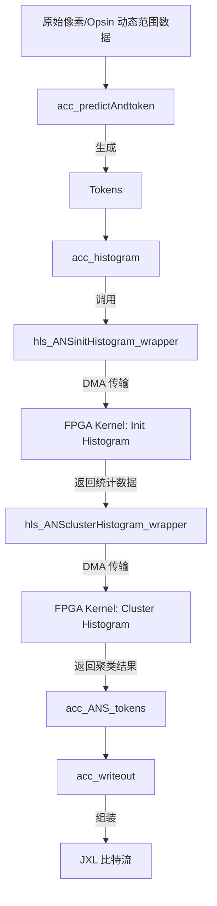

# 模块深度解析：JPEG XL 与 PIK 编码器加速 (jxl_and_pik_encoder_acceleration)

## 1. 为什么这个模块存在？

JPEG XL (JXL) 是一种极其先进但计算复杂度极高的图像压缩标准。在编码过程中，为了达到极高的压缩比和视觉质量，编码器需要进行大量的数学运算，包括：
- **多尺度 DCT 变换**：在 8x8 到 64x64 甚至更大的块之间选择最佳变换策略。
- **色度预测 (Chroma-from-Luma, CfL)**：通过亮度通道预测色度通道，涉及复杂的非线性优化。
- **直方图聚类与 ANS 编码**：为了压缩熵编码的开销，需要对成千上万个直方图进行聚类。

如果完全在 CPU 上以串行方式运行，编码一张高分辨率图片可能需要数秒甚至更久。**`jxl_and_pik_encoder_acceleration` 模块存在的唯一目的就是通过异构计算（FPGA 硬件卸载 + CPU SIMD 指令集）将这些“计算黑洞”填平。**

它不是一个独立的编码器，而是一个**加速网关**。它拦截了原版 `libjxl` 中最耗时的算法部分，并将其重定向到 FPGA 内核（通过 OpenCL/HLS）或高度优化的 SIMD 代码路径（通过 Highway 库）。

## 2. 心理模型：异构流水线

你可以将这个模块想象成一个**“智能工厂的调度中心”**：
- **CPU (调度员)**：负责复杂的逻辑决策。例如，它决定哪些图像区域需要尝试不同的 DCT 块大小，并准备好原始像素数据。
- **FPGA (特种加工车间)**：负责大批量、重复性的数值计算。例如，一旦 CPU 准备好了直方图数据，FPGA 就会利用其并行的 DSP 资源，在极短时间内完成聚类计算。
- **SIMD (快速通道)**：对于不适合卸载到 FPGA 的小规模计算，利用 CPU 的向量化指令（AVX/NEON）进行就地加速。

### 核心抽象
- **`AcStrategy` (AC 策略)**：决定一个图像区域是用一个大的 DCT 变换还是多个小的变换。这是压缩效率的关键。
- **`Token` (符号)**：编码过程中的中间表示，代表了量化后的系数。
- **`Histogram` (直方图)**：统计符号出现的频率，用于构建熵编码表。
- **`Wrapper` (包装器)**：如 `hls_ANSclusterHistogram_wrapper`，它们是 Host (CPU) 与 Device (FPGA) 之间的桥梁，负责内存对齐、数据搬运和内核触发。

## 3. 数据流向分析

以下是该模块在编码“第三阶段 (Phase 3)”时的典型数据流：

1.  **Tokenization**: `acc_predictAndtoken` 将量化后的系数转换为 `Token` 流。
2.  **硬件初始化**: `hls_ANSinitHistogram_wrapper` 将 `Token` 数据搬运到 FPGA 的 HBM（高带宽内存）中。
3.  **并行聚类**: FPGA 内核 `JxlEnc_ans_clusterHistogram` 并行处理多个上下文的直方图，寻找可以合并的统计分布。
4.  **结果回传**: 聚类后的 `context_map` 和 `clustered_histograms` 被传回 CPU。
5.  **最终封装**: `acc_writeout` 负责将所有加速计算的结果按照 JXL 规范封装进 TOC (Table of Contents) 和数据组中。

## 4. 设计权衡与决策

### 4.1 内存对齐：性能 vs 复杂性
在 `host_cluster_histogram.cpp` 中，你会看到大量的 `posix_memalign(&ptr, 4096, ...)`。
- **决策**：强制所有 Host 端 Buffer 进行 4096 字节对齐。
- **权衡**：这增加了内存管理的复杂性，但它是实现 **零拷贝 (Zero-copy)** 或高性能 DMA 传输的前提。Xilinx FPGA 的 DMA 引擎在处理对齐内存时效率最高，否则驱动程序必须在后台进行昂贵的内存拷贝。

### 4.2 启发式搜索：压缩率 vs 编码速度
在 `acc_enc_ac_strategy.cpp` 的 `FindBest8x8Transform` 中，代码并没有穷举所有可能的变换组合。
- **决策**：使用基于 `entropy_add` 和 `entropy_mul` 的启发式成本模型。
- **权衡**：虽然这可能导致压缩率比理论最优值低 0.1%，但它将搜索空间减少了几个数量级，使得实时编码成为可能。

### 4.3 跨平台 SIMD：Highway 库
模块使用了 `hwy/highway.h` (如 `FVImpl` 结构)。
- **决策**：不直接编写 `__builtin_ia32_...` 等特定平台的 Intrinsics。
- **权衡**：Highway 提供了一套通用的向量化 API，使得同一套加速逻辑可以同时在 x86 (AVX-512) 和 ARM (NEON) 上运行，虽然增加了一层抽象，但极大地提高了代码的可维护性。

## 5. 给新贡献者的注意事项

### 5.1 隐式契约：内存所有权
- **Host Buffers**: 在 `hls_..._wrapper` 函数中分配的 `hb_...` 缓冲区通常由包装器函数管理生命周期。如果你修改了这些函数，务必确保 `free()` 在所有 OpenCL 事件完成后触发。
- **Device Buffers**: `cl::Buffer` 对象是引用计数的，但底层的 FPGA 内存映射在 `q.finish()` 之前是不稳定的。

### 5.2 陷阱：FPGA 状态同步
FPGA 是异步执行的。在调用 `q.enqueueMigrateMemObjects` 后，CPU 会立即继续执行。如果你在没有等待 `events_read[0].wait()` 或调用 `q.finish()` 的情况下访问返回的数据，你会读到旧的垃圾数据。

### 5.3 精度问题
在 `build_cluster.cpp` 中，`hls_ANSPopulationCost` 使用了定点数优化（如 `kFixBits = 32`）。在修改这里的数学逻辑时，必须非常小心舍入误差。FPGA 上的浮点运算非常昂贵，因此很多地方使用了近似算法（如 `hls_FastLog2`），这可能导致与纯软件版本的输出有微小差异。

---

## 子模块文档

为了更深入地了解各个组件，请参阅以下子模块文档：

- [计时与性能分析](codec_acceleration_and_demos-jxl_and_pik_encoder_acceleration-host_acceleration_timing_and_phase_profiling.md)：解析 `timeval` 统计与 FPGA 阶段耗时分析。
- [AC 策略与 DCT 变换选择](codec_acceleration_and_demos-jxl_and_pik_encoder_acceleration-ac_strategy_and_dct_transform_selection.md)：深入探讨 `MergeTry` 逻辑与 Highway SIMD 实现。
- [色度预测建模](codec_acceleration_and_demos-jxl_and_pik_encoder_acceleration-chroma_from_luma_modeling.md)：解析 `CFLFunction` 的牛顿迭代法实现。
- [直方图聚类结构](codec_acceleration_and_demos-jxl_and_pik_encoder_acceleration-histogram_cluster_pair_structures.md)：解析 `HistogramPair` 在硬件加速中的表示。

---
*由高级架构师团队维护。最后更新：2024年10月。*
