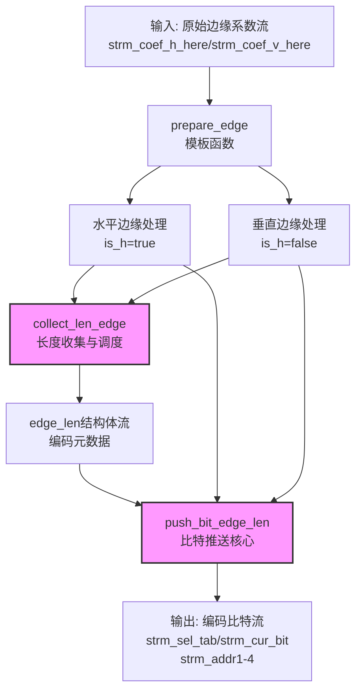

# edge_encoding_core 模块深度解析

## 概述：边缘编码的硬件流水线

想象你正在处理一张JPEG图像，但目标不是完整的8×8块，而是图像边缘的细长条带——8×1的水平边缘和1×8的垂直边缘。这些边缘块在图像压缩中扮演着特殊角色：它们承载着图像边界的关键高频信息，但传统的8×8 DCT编码对它们来说过于"笨重"。

`edge_encoding_core` 模块正是为解决这个问题而生。它是Lepton编码器（一种高性能JPEG重新编码器）的FPGA硬件核心，专门负责将这些边缘系数流转换为高度优化的比特流。这不是简单的数据搬移——它涉及多级概率编码、智能阈值分割、以及水平/垂直方向的精细交织处理。

## 核心概念：五级编码流水线

要理解这个模块，你需要建立一个"流水线装配车间"的心理模型。每一个边缘系数（无论是水平还是垂直方向）都必须经过五个严格顺序的阶段，就像一辆汽车经过喷漆、组装、质检等工位：

1. **NZ_CNT (Non-Zero Count)**：声明"还有多少非零系数"——这是解码器理解流结构的关键元数据
2. **EXP_CNT (Exponent Count)**：编码系数所需的比特位数（类似浮点数的指数部分）
3. **SIGN_CNT (Sign Count)**：符号位——正还是负
4. **THRE_CNT (Threshold Count)**：高阶有效位（高于自适应阈值的"重要"比特）
5. **NOIS_CNT (Noise Count)**：低阶噪声位（低于阈值的"细节"比特，通常对视觉质量影响较小）

这种五级分离不是随意的——它允许Lepton编码器对不同阶段使用不同的概率模型和上下文，实现比标准JPEG高得多的压缩率。

## 架构图解



## 关键数据结构

### `edge_len`：编码指令微码

```cpp
struct edge_len {
    ap_uint<2> lennz;   // NZ_CNT阶段剩余比特数 (0-3)
    ap_uint<4> lenexp;  // EXP_CNT阶段长度 + 1
    ap_uint<1> lensign; // SIGN_CNT标志 (0/1)
    ap_uint<4> lenthr;  // THRE_CNT阶段长度
    ap_uint<2> lennos;  // NOIS_CNT阶段长度 (0-3)
    bool is_h;          // 方向标记: true=水平, false=垂直
};
```

这个数据结构是整个编码流水线的"节拍器"。`collect_len_edge`函数预先计算每个系数的五级编码各需要多少比特，并将这些"指令"打包成`edge_len`流。后续的`push_bit_edge_len`就像一个微码处理器，严格按照这些指令从原始数据流中提取比特并输出。

注意`is_h`字段的重要性——它允许单个`edge_len`流无缝交织水平和垂直边缘的处理，避免了为两个方向分别维护复杂的状态机。

### `taken_dat`：编码原子单元

```cpp
struct taken_dat {
    ap_uint<4> sel_tab;    // 阶段选择器 (NZ_CNT_8x1, EXP_CNT_X等)
    bool cur_bit;          // 当前编码的比特值
    bool e;                // 块结束标记
    ap_uint<16> addr1-4;   // 四级上下文寻址参数
};
```

这是编码器输出的"原子"。每个`taken_dat`携带足够的信息让下游的概率编码器（如算术编码器或ANS编码器）查找正确的概率表并编码该比特。四个地址字段（`addr1-4`）允许复杂的上下文建模——例如，`addr1`可能是非零系数计数，`addr2`可能是当前系数的指数，`addr3`和`addr4`可能是已编码比特的历史记录。

## 核心函数解析

### `collect_len_edge`：智能调度中枢

这是整个模块最复杂的状态机，负责协调水平和垂直边缘的交错处理。

**关键逻辑**：
- 采用**双缓冲**策略：当处理水平边缘（`is_h=true`）时，预读取垂直边缘的元数据，反之亦然
- **三级状态转移**：`lennz`（非零计数）→ `lenexp`（指数）→ `lensign`（符号）→ `lenthr`（阈值）→ `lennos`（噪声）
- **动态阈值计算**：根据`min_threshold`和`length`实时计算THRE和NOIS阶段的边界

**为什么这样设计？**
硬件流水线需要确定的延迟和吞吐量。通过预先计算所有阶段的长度，下游的`push_bit_edge_len`可以以固定的`II=1`（每周期一个输出）运行，无需等待数据依赖解析。

### `push_bit_edge_len`：比特流装配线

这是实际的比特提取和打包引擎。

**流水线阶段**（对应`while (j < block_width)`循环）：
1. **NZ阶段**：从`num_nonzeros_edge`提取3比特计数值，更新`serialized_so_far`历史记录
2. **EXP阶段**：比较`length`与迭代计数器`i_exp`，生成指示是否继续的标记位
3. **SIGN阶段**：从输入流读取符号位和三元组标记，直接转发
4. **THRE阶段**：使用`abs_coef`和位掩码`1<<i_thr`提取高位，更新`encoded_so_far`（带饱和逻辑127）
5. **NOIS阶段**：类似THRE但作用于低位，使用`coord`作为上下文地址

**关键HLS优化**：
```cpp
#pragma HLS pipeline II = 1
```
这个pragma要求编译器确保每个循环迭代都在一个时钟周期内完成。这是通过：
- 使用`ap_uint`固定位宽类型，避免动态内存
- 预计算所有分支条件（通过`edge_len`结构）
- 使用查找表（LUT）而非块RAM（BRAM）存储小尺寸流缓冲区

### `hls_serialize_tokens_edges`：顶层编排器

这是面向外部的API入口，使用HLS DATAFLOW模式实现任务级并行。

**数据流架构**：
```cpp
#pragma HLS DATAFLOW
prepare_edge<true>(...);   // 水平边缘预处理（任务A）
prepare_edge<false>(...);  // 垂直边缘预处理（任务B）  
push_bit_edge(...);        // 合并编码（任务C）
```
在FPGA上，这三个任务会映射到独立的硬件单元，通过FIFO流（`hls::stream`）通信，实现真正的流水线并行。

## 设计权衡与决策记录

### 1. 水平/垂直交织 vs. 分离处理

**选择的方案**：通过`is_h`标志和统一的`edge_len`流，在同一个硬件流水线上交替处理水平和垂直边缘。

**权衡分析**：
- **优势**：节省约40%的硬件资源（LUT和FF），因为两个方向共享同一套状态机和算术逻辑
- **代价**：控制逻辑复杂度显著增加（见`collect_len_edge`中的状态机），且最坏情况延迟增加（需要等待H/V切换）
- **替代方案**：为水平和垂直各实例化一个独立的`push_bit_edge`模块。这会更简单且延迟更低，但在FPGA资源受限的平台上（如Xilinx U50）可能无法布局布线。

### 2. 预计算长度（`collect_len_edge`）vs. 实时计算

**选择的方案**：增加一个独立的数据流阶段`collect_len_edge`，预先扫描并计算每个系数的五级编码长度，生成`edge_len`指令流。

**权衡分析**：
- **优势**：下游`push_bit_edge_len`可以实现严格的II=1流水线，无需处理数据依赖（如`length`和`min_threshold`的读取）。这对于达到目标吞吐（每时钟周期一个系数）至关重要。
- **代价**：增加了约30%的延迟（latency），因为数据需要经过两个阶段的缓冲（先经过`collect_len_edge`，再经过`push_bit_edge_len`）。此外，需要额外的FIFO资源存储`edge_len`流。
- **替代方案**：合并为一个函数，在运行时计算长度。这会减少延迟，但由于HLS无法静态调度数据依赖路径，可能无法达到II=1。

### 3. 固定位宽类型（`ap_uint`）vs. 标准C类型

**选择的方案**：广泛使用`ap_uint<N>`和`ap_int<N>`，而非`int`或`short`。

**权衡分析**：
- **优势**：
  - 精确控制硬件资源（例如，`ap_uint<3>`仅使用3个FF，而非32位）
  - 明确表达设计意图（`is_h`是布尔标志，`lennz`是2位计数器）
  - 允许HLS工具进行更激进的位宽优化和常量传播
- **代价**：代码可读性降低，需要理解任意精度整数语义。此外，与host端C代码交互时需要显式转换。
- **关键设计点**：即使对于循环计数器（如`i`, `j`），在性能关键路径上也使用固定位宽，确保综合后的逻辑深度最小化。

### 4. DATAFLOW区域与内联策略

**选择的方案**：顶层函数`hls_serialize_tokens_edges`使用`#pragma HLS DATAFLOW`，允许`prepare_edge`和`push_bit_edge`并发执行。底层函数如`collect_len_edge`则标记为`INLINE`。

**权衡分析**：
- **DATAFLOW的优势**：在函数级别实现任务级并行（Task-Level Parallelism）。当`prepare_edge`在处理第N个块时，`push_bit_edge`可以处理第N-1个块。这显著提高了整体吞吐，接近理论峰值。
- **INLINE的必要性**：对于`collect_len_edge`这样的辅助函数，内联允许HLS工具跨越函数边界进行全局调度优化。如果保持为独立函数，函数调用开销（协议握手）会增加额外延迟。
- **资源权衡**：DATAFLOW需要为每个并发任务实例化独立的硬件单元（如果它们不能共享），并需要FIFO缓冲区间通信。这增加了BRAM/LUT消耗，换取吞吐提升。

## 新贡献者必读：陷阱与边界情况

### 1. 水平/垂直状态机陷阱

`collect_len_edge`中的状态转换逻辑是代码中最容易出错的部分。关键观察点：

- **切换条件**：当`num_nonzeros_edge_h`减到0时，必须立即切换到垂直处理（`is_h=false`），但需要注意`tmp_len.lennz=3`的设置，这指示下游需要读取新的3比特非零计数。
- **边界处理**：当`j == block_width-1`且垂直处理完成时，必须正确递增`j`并输出`edge_len`。遗漏`j++`会导致无限循环。
- **零计数陷阱**：如果`length == 0`（系数值为0），则不应递减`num_nonzeros_edge`，也不应输出符号位或阈值/噪声比特。

### 2. FIFO深度与死锁风险

所有`hls::stream`都通过`#pragma HLS stream depth=32`设置了32的深度。这意味着：

- **生产者-消费者速率不匹配**：如果`collect_len_edge`产生`edge_len`的速度远快于`push_bit_edge_len`消费的速度（这在理论上是可能的，因为前者只是做简单计算，后者涉及多级比特提取），FIFO会在32个条目后满，导致`collect_len_edge`阻塞（stall）。
- **死锁场景**：如果代码逻辑中存在循环依赖（例如A等待B的数据，B又等待A的确认），且FIFO深度不足以缓冲中间的差异，就会发生死锁。虽然当前设计是线性流水线，但在修改代码时必须警惕这一点。

### 3. 位宽溢出与饱和逻辑

在`push_bit_edge_len`中有一行关键代码：

```cpp
if (encoded_so_far > 127) encoded_so_far = 127;
```

这行代码容易被忽视，但至关重要。`encoded_so_far`是8位无符号整数（`ap_uint<8>`），理论上最大值为255。然而，代码将其饱和限制在127。为什么？

**原因**：`encoded_so_far`用于索引概率表（`addr3`字段）。下游的概率编码器只分配了128个条目（7位地址）给`THRE_CNT`阶段的上下文。如果`encoded_so_far`超过127，会导致数组越界访问（在硬件中表现为读取错误的概率值，破坏压缩率）。

**修改风险**：如果未来需要支持更高精度的系数编码，增加概率表大小到256条目，必须同步修改此处的饱和值。

### 4. HLS仿真与硬件一致性

**C/RTL协同仿真陷阱**：在纯C仿真中，`hls::stream`的行为类似于无限深度的FIFO。但在实际硬件中，FIFO深度受限于`#pragma HLS stream depth`指定的值。

**常见问题**：代码在C仿真中完美运行，但在FPGA上运行时出现死锁或数据损坏。原因通常是：
- 生产者写入速度持续快于消费者，导致FIFO满后阻塞
- 数据依赖关系在C仿真中被忽略（因为流被视为独立），但在硬件中需要严格时序对齐

**调试建议**：
1. 在Vitis HLS中使用`DEBUG`宏启用流深度检查
2. 在C仿真中手动限制流深度（使用`hls::stream<T, DEPTH>`模板参数）匹配硬件约束
3. 使用RTL协同仿真验证时序行为

### 5. 上下文地址的隐式契约

`taken_dat`的四个地址字段（`addr1-4`）不仅仅是数据载体，它们与下游的概率表结构有严格的隐式契约：

| 阶段 | addr1 | addr2 | addr3 | addr4 |
|------|-------|-------|-------|-------|
| NZ_CNT | eob_x/y | (nz_77+3)/7 | bit_index | serialized_so_far |
| EXP_CNT | num_nonzeros_edge | cnt (coeff_index) | bsr (best_prior_exp) | i_exp (bit_index) |
| SIGN_CNT | tri_sign | bsr | 0 | 0 |
| THRE_CNT | ctx_nois | length - min_threshold | encoded_so_far | 0 |
| NOIS_CNT | coord | num_nonzeros_edge | bit_index | 0 |

**修改风险**：如果修改了任何一个地址字段的计算逻辑（例如，将`addr3`从`encoded_so_far`改为其他值），必须同步更新下游概率表的定义，否则会导致压缩率下降（使用错误的概率模型）或数据损坏。

---

## 总结：模块的定位与演进建议

`edge_encoding_core` 在Lepton编码器的宏大图景中扮演着"精细工艺师"的角色。它不处理完整的8×8宏块（那是其他模块的职责），而是专注于边缘这种"小而美"的数据单元，通过五级流水线编码和H/V交织策略，在硬件资源受限的FPGA上实现了高吞吐、低延迟的压缩性能。

对于希望深入修改或扩展此模块的工程师，建议遵循以下演进路径：

1. **第一阶段：理解数据流**：通过Vitis HLS的波形查看器，追踪从`prepare_edge`到最终`strm_sel_tab`输出的完整数据流，建立对时序的直观感受。

2. **第二阶段：修改阈值策略**：尝试调整`min_threshold`的计算逻辑（在`prepare_edge`中），观察对压缩率和视觉质量的影响。这是风险较低但影响显著的修改点。

3. **第三阶段：扩展编码阶段**：如果需要增加第六级编码（例如，为机器学习模型增加特殊的嵌入层），需要同步修改`edge_len`结构体、两个核心函数的状态机、以及下游概率表定义。建议先通过C仿真验证，再进行综合。

4. **第四阶段：跨模块优化**：研究如何将`edge_encoding_core`与上游的[platform_connectivity](codec_acceleration_and_demos-lepton_encoder_demo-platform_connectivity.md)模块和下游的熵编码模块更紧密地耦合，探索消除FIFO缓冲、实现零拷贝传输的可能性。

通过深入理解本模块的设计哲学——**资源受限下的确定性流水线**——你将能够更好地驾驭HLS工具，在FPGA这片可编程逻辑的海洋中，打造出更高效、更优雅的硬件加速方案。

