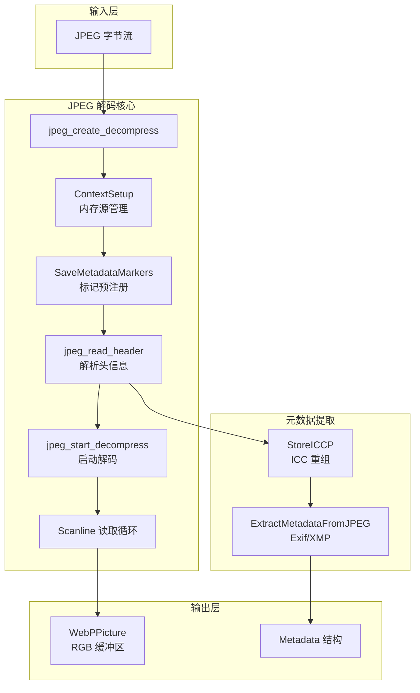

# JPEG 解码与 ICC 上下文模块 (jpeg_decode_and_icc_context)

## 一句话概述

这个模块是 WebP 编码管线中的"JPEG 入口网关"——它将 JPEG 字节流解码为原始 RGB 图像，同时完整提取 ICC 色彩配置文件和元数据（Exif/XMP），确保从源图像到 WebP 输出的色彩保真度和元数据完整性。

---

## 问题空间与设计动机

### 我们试图解决什么？

在现代图像处理管线中，JPEG 仍然是最广泛的输入格式之一。然而，将 JPEG 转换为 WebP 并非简单的像素拷贝——**色彩管理**和**元数据保留**是两个关键挑战：

1. **ICC 配置文件的碎片化存储**：JPEG 标准允许将 ICC 配置文件分割存储在多个 APP2 标记段中（最多 255 段），每段带有序列号。重建完整的配置文件需要按序重组这些片段。

2. **元数据的多样化标记**：Exif 数据存储在 APP1 标记中，XMP 可能使用不同的 APP1 签名。解析器需要识别多种签名模式。

3. **错误恢复与资源管理**：libjpeg 使用 setjmp/longjmp 进行错误处理，这与现代 C 代码的异常安全理念相冲突。必须确保在任何错误路径下都能正确释放已分配的内存。

### 为什么选择这种设计？

替代方案包括：

- **直接使用 libjpeg 的默认接口**：这要求调用者手动处理所有标记解析和 ICC 重组，代码重复且容易出错。
- **延迟加载元数据**：只在需要时才解析标记，但这会要求两次遍历 JPEG 数据或缓存整个文件。
- **YUV 直通**：避免 RGB 转换以减少内存拷贝，但 WebP 编码器通常期望 RGB 输入，且这会失去对颜色空间转换的控制。

当前模块采用**预取元数据 + RGB 解压缩**的策略，平衡了简单性和完整性。

---

## 心智模型：如何理解这个模块

把这个模块想象成一个**"海关检查站"**：

```
┌─────────────────────────────────────────────────────────────┐
│                    JPEG 字节流 (入境货物)                      │
└──────────────┬──────────────────────────────────────────────┘
               │
               ▼
┌─────────────────────────────────────────────────────────────┐
│  海关检查站 (本模块)                                          │
│  ├─ 查验包裹 (解析 JPEG 标记)                                  │
│  ├─ 重组 ICC 配置文件 (拼装分段货物)                           │
│  ├─ 提取元数据 (Exif/XMP 报关单)                              │
│  └─ 解码像素数据 (货物开箱)                                    │
└──────────────┬──────────────────────────────────────────────┘
               │
               ▼
┌─────────────────────────────────────────────────────────────┐
│  WebPPicture + Metadata (清关完成的货物)                       │
└─────────────────────────────────────────────────────────────┘
```

**关键抽象**：

1. **JPEGReadContext**：封装输入源管理，允许 libjpeg 从内存缓冲区而非文件读取数据。
2. **ICCPSegment**：表示 ICC 配置文件的一个分段，用于重组算法。
3. **Metadata/MetadataPayload**：统一的元数据容器，支持 Exif、XMP 和 ICC 配置文件。
4. **错误处理边界**：`my_error_mgr` 结构将 libjpeg 的 longjmp 错误转换为可管理的异常路径。

---

## 架构与数据流

### 总体架构图



### 关键数据流路径

#### 1. 像素数据流（主路径）

```
JPEG 字节流
    │
    ▼
┌─────────────────┐
│ ContextSetup()  │ ◄── 设置内存源管理器
│                 │     让 libjpeg 从内存读取
└────────┬────────┘
         │
         ▼
┌─────────────────┐
│ jpeg_read_header│ ◄── 解析 SOI/SOF 等标记
└────────┬────────┘
         │
         ▼
┌─────────────────┐
│jpeg_start_      │ ◄── 分配内部缓冲区
│decompress      │
└────────┬────────┘
         │
         ▼
┌─────────────────┐     ┌─────────────────┐
│ jpeg_read_      │────►│ RGB 行缓冲区    │───► WebPPicture
│ scanlines       │循环 │ (malloc'd)      │     ImportRGB
└─────────────────┘     └─────────────────┘
```

**关键设计点**：
- **内存源管理**：`JPEGReadContext` 结构封装了 `jpeg_source_mgr`，将文件 I/O 重定向到内存缓冲区。这使得模块可以处理已经加载到内存中的 JPEG 数据，而不需要临时文件。
- **RGB 强制输出**：通过设置 `dinfo.out_color_space = JCS_RGB`，确保无论输入 JPEG 使用什么颜色空间（YCbCr、CMYK、灰度），输出始终是 3 通道 RGB，简化了后续处理。

#### 2. ICC 配置文件提取流（复杂路径）

```
JPEG APP2 标记列表
    │
    ├──► [APP2: ICC_PROFILE\0<seq><count>...] ──┐
    ├──► [APP2: ICC_PROFILE\0<seq><count>...]   │ 重组算法
    ├──► [APP2: ICC_PROFILE\0<seq><count>...]   │ (StoreICCP)
    │                                           │
    ▼                                           ▼
ICCP 分段数组 (ICCPSegment[255])          排序与验证
    │                                           │
    ├── 分段 1 (seq=1, data=...)               ├── 检查连续性
    ├── 分段 3 (seq=3, data=...)               ├── 检查重复
    ├── 分段 2 (seq=2, data=...)               └── 检查计数匹配
    │                                           │
    ▼                                           ▼
qsort(CompareICCPSegments)              合并到单个缓冲区
    │                                           │
    ├── 分段 1 ────────────────────────────────┐
    ├── 分段 2 ────────────────────────────────┼──► malloc(total_size)
    └── 分段 3 ────────────────────────────────┘      memcpy 串联
                                                        │
                                                        ▼
                                              MetadataPayload.iccp
                                              (bytes, size)
```

**关键算法**：ICC 配置文件分段重组

ICC.1:2010-12 规范允许将大型 ICC 配置文件分割存储在多个 JPEG APP2 标记中。每个标记包含：
- 12 字节签名：`ICC_PROFILE\0`
- 1 字节序列号（1-255）
- 1 字节总段数
- 实际数据段

重组算法需要处理：
1. **乱序到达**：文件中的标记顺序不一定与序列号一致 → 使用 `qsort` 按序列号排序
2. **缺失检测**：验证最大序列号等于实际计数 → 检测丢段
3. **重复检测**：确保同一序列号只出现一次
4. **计数一致性**：所有标记的总段数字段必须一致

#### 3. 通用元数据提取流

```
JPEG 标记扫描 (jpeg_save_markers 预注册)
    │
    ├──► APP1: "Exif\0\0" ────────► Exif 元数据
    │                                (TIFF 头 + IFD 结构)
    │
    ├──► APP1: "http://ns.adobe.com/xap/1.0/" ────► XMP 元数据
    │                                (RDF/XML 格式)
    │
    └──► APP2: ICC_PROFILE ────────► ICC 配置文件
                                     (通过 StoreICCP 处理)

所有提取的元数据存入统一的 Metadata 结构：
┌─────────────────────────────────────┐
│ struct Metadata                     │
│   MetadataPayload exif    ────────┐ │
│   MetadataPayload xmp     ────────┼─┼──► (bytes, size)
│   MetadataPayload iccp    ────────┘ │
└─────────────────────────────────────┘
```

---

## 核心组件详解

### 1. JPEGReadContext - 内存源适配器

```c
typedef struct {
    struct jpeg_source_mgr pub;  // libjpeg 要求的虚表结构
    const uint8_t* data;           // 输入缓冲区指针
    size_t data_size;              // 缓冲区大小
} JPEGReadContext;
```

**设计意图**：libjpeg 默认使用文件 I/O（`fread`），但在这个 pipeline 中，JPEG 数据已经以内存缓冲区的形式存在（可能从网络接收或已加载到内存）。`JPEGReadContext` 通过填充 `jpeg_source_mgr` 的四个回调函数（`init_source`, `fill_input_buffer`, `skip_input_data`, `resync_to_restart`, `term_source`），将文件流重定向到内存缓冲区。

**关键回调**：
- `ContextInit`：初始化读取指针到缓冲区起始位置
- `ContextFill`：理论上不会被调用（因为数据已全部在内存），如果触发则视为错误
- `ContextSkip`：实现 `fseek` 等效功能，用于跳过 JPEG 标记

**内存契约**：调用者必须确保 `data` 指针在 `ReadJPEG` 执行期间保持有效（通常由上层调用者管理输入缓冲区的生命周期）。

### 2. ICCPSegment & StoreICCP - 分段重组引擎

```c
typedef struct {
    const uint8_t* data;
    size_t data_length;
    int seq;  // 序列号 1-255
} ICCPSegment;

static int StoreICCP(j_decompress_ptr dinfo, MetadataPayload* const iccp);
```

**设计意图**：ICC 配置文件可能很大（超过 64KB，JPEG 单个标记的负载上限），因此规范允许分段存储。`StoreICCP` 实现了完整的重组状态机：

**状态机逻辑**：
1. **扫描阶段**：遍历 `dinfo->marker_list`，识别所有 `JPEG_APP2` 且以 `ICC_PROFILE\\0` 开头的标记
2. **提取阶段**：从每个标记解析 `seq`（序列号）和 `count`（总段数）
3. **验证阶段**：
   - 检查段计数一致性（所有标记的 `count` 字段必须相同）
   - 检查序列号不重复
   - 检查无零值（段大小、序列号、计数都不能为零）
4. **连续性检查**：验证 `seq_max == actual_count`（最大序列号等于实际段数），检测丢段
5. **排序阶段**：使用 `qsort` 按序列号排序 `ICCPSegment` 数组
6. **合并阶段**：分配 `total_size` 字节缓冲区，将所有段按序拷贝拼接

**关键验证点**：
```c
// 连续性检查 - 检测缺失段
if (seq_max != actual_count) {
    fprintf(stderr, "[ICCP] Discontinuous segments!\n");
    return 0;
}

// 计数一致性检查
if (expected_count != actual_count) {
    fprintf(stderr, "[ICCP] Segment count mismatch!\n");
    return 0;
}
```

**内存所有权**：`iccp->bytes` 由 `malloc` 分配，调用者负责使用 `MetadataFree()` 释放。

### 3. 错误处理架构 - setjmp/longjmp 封装

```c
struct my_error_mgr {
    struct jpeg_error_mgr pub;
    jmp_buf setjmp_buffer;
};

static void my_error_exit(j_common_ptr dinfo) {
    struct my_error_mgr* myerr = (struct my_error_mgr*)dinfo->err;
    dinfo->err->output_message(dinfo);
    longjmp(myerr->setjmp_buffer, 1);
}
```

**设计挑战**：libjpeg 使用 C 语言层面的异常机制——当遇到错误（如格式损坏、内存不足）时，调用 `error_exit` 回调，然后期望回调执行 `longjmp` 跳转到恢复点。

**我们的封装策略**：
1. **注册自定义错误处理器**：将 `jerr.pub.error_exit` 设置为 `my_error_exit`
2. **建立跳转锚点**：使用 `setjmp(jerr.setjmp_buffer)` 设置恢复点，返回值为 0 表示首次执行，非零表示从错误恢复
3. **清理与恢复**：在 `Error:` 标签处执行统一的资源释放（`MetadataFree`, `jpeg_destroy_decompress`）

**关键代码模式**：
```c
if (setjmp(jerr.setjmp_buffer)) {
Error:
    MetadataFree(metadata);
    jpeg_destroy_decompress((j_decompress_ptr)&dinfo);
    goto End;
}

// ... 正常执行路径 ...

if (something_failed) {
    goto Error;  // 触发统一清理
}
```

### 4. Metadata 结构 - 统一容器

```c
// 来自 metadata.h
struct Metadata {
    MetadataPayload exif;
    MetadataPayload xmp;
    MetadataPayload iccp;
};

struct MetadataPayload {
    uint8_t* bytes;
    size_t size;
};
```

**设计意图**：提供统一的内存管理接口。`MetadataCopy` 负责分配和拷贝，`MetadataFree` 负责释放所有子字段。

**生命周期**：
1. 调用者传入指向 `Metadata` 结构的指针（可为 NULL，表示不关心元数据）
2. `ExtractMetadataFromJPEG` 填充各个 `MetadataPayload`
3. 无论成功或失败，错误处理路径调用 `MetadataFree` 清理
4. 如果成功，调用者最终负责调用 `MetadataFree`

---

## 设计权衡与决策

### 1. RGB 强制输出 vs YUV 直通

**选择的方案**：强制 RGB 输出（`dinfo.out_color_space = JCS_RGB`）

**权衡分析**：
- **YUV 直通的优势**：避免颜色空间转换，零拷贝直通到 WebP 编码器（如果它支持 YUV 输入）
- **YUV 直通的劣势**：
  - WebP 编码器期望的 YUV 格式可能与 JPEG 内部表示不同（采样率、平面 vs 打包）
  - 需要处理多种 YUV 子采样模式（4:2:0、4:2:2、4:4:4）
  - 失去对色彩管理的控制（ICC 配置文件转换）

**决策理由**：RGB 作为中间格式是图像处理的通用语言。它增加了内存带宽（3 字节/像素），但极大地简化了与下游组件的接口契约。

### 2. Eager vs Lazy 元数据提取

**选择的方案**：Eager（在解码过程中立即提取所有元数据）

**权衡分析**：
- **Lazy 的优势**：如果最终输出不需要元数据，可以跳过昂贵的解析过程
- **Lazy 的劣势**：
  - 需要两次遍历 JPEG 文件（或缓存整个文件），因为 `jpeg_read_scanlines` 会消耗输入
  - 增加代码复杂度（需要保存标记位置或重新打开文件）

**决策理由**：在 WebP 转换场景中，保留元数据（尤其是 ICC 配置文件）是常见需求。Eager 策略简化了控制流，避免了复杂的 "标记回放" 机制。

### 3. setjmp/longjmp vs 返回码错误处理

**选择的方案**：使用 libjpeg 的 setjmp/longjmp 机制，但仔细封装以确保资源安全

**权衡分析**：
- **返回码的优势**：更现代的 C 错误处理，易于理解，与大多数库一致
- **返回码的劣势**：libjpeg 内部深度使用 `ERREXIT` 宏触发错误，无法通过返回码传递，必须使用 longjmp

**决策理由**：与 libjpeg 深度集成意味着我们必须接受其错误处理模型。我们的策略是：
1. 在模块边界处使用 `setjmp` 建立 "防火墙"
2. 确保所有已分配资源在 `Error:` 标签处统一清理
3. 对外暴露干净的返回码接口（`int ReadJPEG(...)` 返回 0/1）

---

## 新贡献者必读：陷阱与最佳实践

### 1. ICC 配置文件处理的边界情况

**陷阱 1：缺失段检测**
```c
// 错误的理解：认为 seq_max == expected_count 就够了
// 正确的逻辑：seq_max == actual_count
if (seq_max != actual_count) {
    // 即使 expected_count 匹配，也可能有缺失段
    // 例如：seq=1, seq=3 存在，seq=2 缺失
    // actual_count=2, seq_max=3 → 错误
}
```

**陷阱 2：空段处理**
```c
// 规范不允许空段，但恶意构造的文件可能有
if (segment_size == 0 || count == 0 || seq == 0) {
    // 必须拒绝，否则会导致后续计算错误
}
```

### 2. setjmp/longjmp 的资源泄漏陷阱

**致命模式**：
```c
// 危险：在 setjmp 和 longjmp 之间分配资源，但没有在 Error 标签释放
rgb = malloc(stride * height);  // ← 如果在 setjmp 之后分配

if (setjmp(jerr.setjmp_buffer)) {
Error:
    // rgb 泄漏了！因为它在 setjmp 之后分配，且不在清理路径中
    jpeg_destroy_decompress(&dinfo);
    return 0;
}
```

**安全模式**：
```c
// 正确：所有资源在 Error 标签都有对应的释放逻辑
uint8_t* volatile rgb = NULL;  // volatile 防止 longjmp 后的优化问题

if (setjmp(jerr.setjmp_buffer)) {
Error:
    free(rgb);  // 安全：即使 rgb 为 NULL，free(NULL) 也是合法的
    MetadataFree(metadata);
    jpeg_destroy_decompress(&dinfo);
    return 0;
}

rgb = malloc(...);  // 现在安全了，因为 Error 标签会释放它
```

### 3. Metadata 生命周期契约

**调用者责任**：
```c
Metadata metadata;
memset(&metadata, 0, sizeof(metadata));  // 必须清零！

if (ReadJPEG(data, size, &pic, &metadata)) {
    // 成功，可以使用 metadata.exif/xmp/iccp
    // ... 使用元数据 ...
    
    // 最终必须释放
    MetadataFree(&metadata);
} else {
    // 即使失败，ReadJPEG 内部已经调用了 MetadataFree
    // 调用者不需要（也不应该）再次释放
}
```

**关键规则**：
1. 传入前必须 `memset` 为零，否则 `MetadataFree` 可能试图释放野指针
2. 如果 `ReadJPEG` 返回失败，`metadata` 内容未定义，不应使用
3. 无论成功与否，都不应直接 `free(metadata.exif.bytes)`，而应使用 `MetadataFree(&metadata)`

### 4. 颜色空间转换注意事项

**隐藏假设**：
```c
dinfo.out_color_space = JCS_RGB;
dinfo.do_fancy_upsampling = TRUE;
```

- `JCS_RGB` 强制输出 3 字节/像素的 RGB 格式，无论输入是灰度、YCbCr 还是 CMYK
- `do_fancy_upsampling = TRUE` 启用高质量的色度上采样（如果输入是 4:2:0 或 4:2:2）

**潜在问题**：
- 如果输入是 CMYK（印刷色彩模式），libjpeg 会执行 CMYK→RGB 转换，这可能不是你想要的（可能需要保留 CMYK 进行特定的色彩管理）
- 对于灰度输入，`JCS_RGB` 会将灰度值复制到 R、G、B 三个通道，造成 3 倍内存浪费

### 5. 线程安全警告

**现状**：此模块**不是线程安全的**。

```c
// 危险：多个线程并发调用 ReadJPEG
// libjpeg 的静态错误处理表（jerror.h 中的 msg_table）不是线程安全的
// 即使使用不同的 j_decompress_struct 实例，错误处理也可能冲突
```

**如果需要并发**：
1. 确保所有 `ReadJPEG` 调用都串行化（使用互斥锁）
2. 或者，如果 libjpeg 是 libjpeg-turbo 版本，确保编译时启用了线程支持（但仍需谨慎）

---

## 依赖关系与模块边界

### 上游依赖（我们依赖谁）

| 依赖 | 用途 | 接口稳定性 |
|------|------|-----------|
| **libjpeg** (`jpeglib.h`) | JPEG 解码核心 | 高，成熟标准 |
| **libwebp** (`webp/encode.h`) | WebP 编码器接口 | 中，Google 维护 |
| `example_util.h` | 可能包含辅助函数 | 低，内部工具 |
| `metadata.h` | `Metadata` 结构定义 | 中，项目内部 |

### 下游依赖（谁依赖我们）

此模块是 [webp_encoder_host_pipeline](codec_acceleration_and_demos-webp_encoder_host_pipeline.md) 的一部分，为 WebP 编码演示程序提供 JPEG 输入支持。

**调用模式**：
```c
// 上层调用者（可能是 webpenc.c 中的 main 函数）
uint8_t* jpeg_data = ReadFile(input_path);
WebPPicture pic;
Metadata metadata;
memset(&metadata, 0, sizeof(metadata));

if (ReadJPEG(jpeg_data, file_size, &pic, &metadata)) {
    // 继续编码为 WebP
    WebPEncode(...);
    MetadataFree(&metadata);
}
```

---

## 总结

`jpeg_decode_and_icc_context` 模块是 WebP 工具链中处理 JPEG 输入的关键适配器。它的核心价值在于：

1. **封装 libjpeg 的复杂性**：提供干净的 C 接口，隐藏 setjmp/longjmp 和资源管理细节
2. **完整的 ICC 配置文件支持**：实现了标准中定义的分段重组算法，确保色彩配置不丢失
3. **元数据完整性**：同时处理 Exif、XMP 和 ICC，提供统一的数据结构

**对于新贡献者**，理解此模块的关键在于掌握：
- libjpeg 的内存源管理机制
- ICC 分段重组的状态机逻辑
- setjmp/longjmp 下的资源安全模式
- Metadata 结构的生命周期契约
