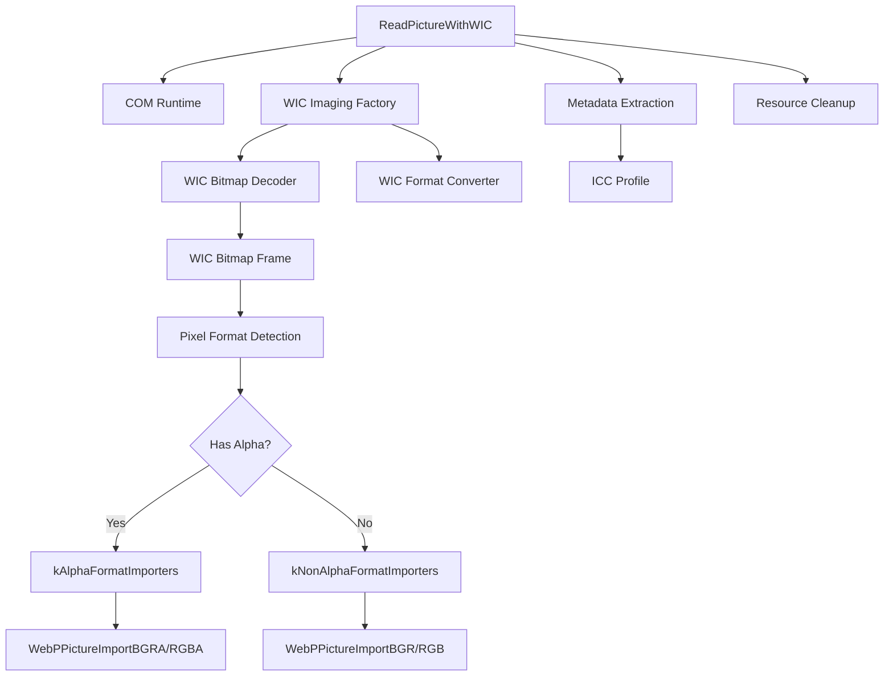

# wic_decode_backend_types 模块深度解析

## 概述：Windows 图像解码的"适配器层"

想象你正在开发一个图像处理流水线，需要支持几十种不同的输入格式（BMP、PNG、TIFF、JPEG 等）。如果为每种格式都写解析器，代码量会爆炸。Windows 提供了 [Windows Imaging Component (WIC)](https://docs.microsoft.com/en-us/windows/win32/wic/-wic-about-windows-imaging-codec) 这个"万能解码器"——它像一个格式无关的抽象层，能把各种图像统一成标准接口。

**`wic_decode_backend_types` 就是这个抽象层的"适配器"** —— 它把 WIC 的 COM 接口包装成 WebP 编码器能理解的简单 C 接口。没有它，WebP 编码器就得自己处理 Windows 特有的 COM 编程模型。

这个模块的存在体现了重要的**分层架构思想**：上层（WebP 编码逻辑）只关心"给我像素数据"，下层（WIC 解码）只关心"从文件提取像素"。中间的适配层负责**翻译数据格式、管理资源生命周期、处理平台特有错误**。

---

## 核心问题：这个模块解决了什么？

### 问题空间：多格式输入的"N×M 复杂度陷阱"

在图像处理领域，输入格式多样性是永恒的痛点。假设你的流水线需要支持 $N$ 种输入格式，输出到 $M$ 种处理后端，理论上需要 $N \times M$ 个转换适配器。

**Windows Imaging Component (WIC) 的出现解决了"N 端"的问题** —— 它提供了一个统一的 COM 接口来读取几乎所有常见图像格式。但 WIC 是 Windows 特有的、基于 COM 的复杂 API，直接使用它会让代码被 Windows 特有的编程模式污染。

### 解决方案：适配器模式（Adapter Pattern）

`wic_decode_backend_types` 就是这个问题的答案。它实现了**适配器模式**，把 WIC 的复杂 COM 接口转换成简单的 C 函数接口：

| 层面 | 职责 | 技术特征 |
|------|------|----------|
| **上层（调用方）** | WebP 编码器 | 纯 C 接口，平台无关 |
| **适配层（本模块）** | 翻译与协调 | 管理 COM 对象、像素格式转换、元数据提取 |
| **下层（被调用方）** | WIC 解码器 | COM 接口，Windows 特有 |

这种分层带来了关键好处：

1. **可移植性隔离**：只有适配层需要处理 Windows COM 编程，上层代码保持平台中立
2. **统一抽象**：无论底层是 WIC、libpng、libjpeg 还是其他解码器，上层看到的都是相同的 `ReadPictureWithWIC` 接口
3. **资源管理集中**：COM 对象的生命周期管理（`IUnknown_Release`）集中在适配层，避免泄漏

---

## 核心抽象：理解这个模块的"心智模型"

### 类比：海关检查与格式转换

想象 `wic_decode_backend_types` 是一个**国际机场的海关检查站**：

1. **输入端（各种航班）**：不同格式的图像文件（BMP、PNG、TIFF）像来自不同国家的航班，载有各自的"货物格式"
2. **海关检查（WIC 解码）**：WIC 像海关官员，能把各种外国货物（不同像素格式）转换成标准形式进行检查
3. **格式转换（像素转换器）**：如果需要，货物会被重新打包（`IWICFormatConverter`）成目标国接受的格式
4. **输出端（WebP 编码器）**：最终，标准化的货物被放行给国内物流系统（WebP 编码器）

这个类比帮助理解模块中的几个关键角色：

| 组件 | 海关类比 | 实际职责 |
|------|----------|----------|
| `IWICImagingFactory` | 海关管理局 | 创建所有 WIC 对象的工厂 |
| `IWICBitmapDecoder` | 航班调度员 | 从文件流创建解码器，识别容器格式 |
| `IWICBitmapFrameDecode` | 货物检查员 | 访问图像帧，获取原始像素格式 |
| `IWICFormatConverter` | 重新打包员 | 在不同像素格式间转换 |
| `WICFormatImporter` | 进口规格表 | 定义目标像素格式与 WebP 导入函数的映射 |

### 核心数据结构

#### `WICFormatImporter` —— 像素格式路由表

```c
typedef struct WICFormatImporter {
    const GUID* pixel_format;    // 目标 WIC 像素格式 GUID
    int bytes_per_pixel;         // 每像素字节数（用于缓冲区计算）
    int (*import)(WebPPicture* const, const uint8_t* const, int);  // WebP 导入函数
} WICFormatImporter;
```

这个结构体体现了**策略模式（Strategy Pattern）**的思想：它把"像素格式规格"和"实际导入逻辑"绑定在一起。通过数组形式组织（`kAlphaFormatImporters` 和 `kNonAlphaFormatImporters`），代码可以遍历尝试不同的格式，直到找到 WIC 能转换的目标格式。

关键洞察：**这不是简单的配置表，而是可执行的策略规格**。`import` 函数字段让这个结构体直接参与数据转换流程，而不是仅仅描述元数据。

#### `Metadata` —— 元数据载荷

虽然具体定义在本代码片段中未展开，但从使用方式可以看出它是一个**聚合容器**，用于承载从图像中提取的 ICC 色彩配置文件等元数据。`ExtractMetadata` 和 `ExtractICCP` 函数负责填充这个结构体。

### 像素格式处理哲学

WIC 支持数十种像素格式，但 WebP 编码器只理解有限的几种。模块采用**"能力协商"策略**：

1. **探测阶段**：先获取源图像的原始像素格式（`IWICBitmapFrameDecode_GetPixelFormat`）
2. **能力查询**：遍历目标格式列表，询问 WIC 是否能从源格式转换到目标格式（`IWICFormatConverter_CanConvert`）
3. **首次适配**：使用第一个成功匹配的格式（类似"最佳 effort"策略）
4. **强制执行**：使用 `IWICFormatConverter_Initialize` 实际执行转换

这种设计体现了**实用主义哲学**：不追求理论上完美的格式匹配，而是确保在绝大多数情况下"能工作"。

---

## 数据流与控制流：端到端分析

### 主入口：`ReadPictureWithWIC`

这是模块的唯一公开接口。详细的数据流已在上方描述，这里总结关键阶段：

| 阶段 | 关键操作 | 错误处理策略 |
|------|----------|--------------|
| **COM 初始化** | `CoInitialize`, `CoCreateInstance` | 检查 `REGDB_E_CLASSNOTREG` 给出友好提示 |
| **流创建** | `OpenInputStream` | 支持文件路径和 stdin (`"-")` |
| **解码器创建** | `CreateDecoderFromStream` | 利用 WIC 自动识别容器格式 |
| **帧获取** | `GetFrame(0)` | 目前只处理单帧图像 |
| **Alpha 检测** | `HasAlpha` | 考虑调色板 Alpha 和直接 Alpha 格式 |
| **格式转换** | `CanConvert` + `Initialize` | 遍历尝试多种目标格式 |
| **像素复制** | `CopyPixels` | 分配缓冲区，复制到内存 |
| **WebP 导入** | `WebPPictureImport*` | 调用对应的导入函数 |
| **元数据提取** | `ExtractMetadata` | 可选，提取 ICC 配置 |
| **清理** | `IUnknown_Release` | 逆序释放所有 COM 对象 |

### 依赖关系图



---

## 关键设计决策与权衡

### 1. 平台抽象策略：适配器 vs 重写

**决策**：使用 WIC 作为 Windows 平台的统一解码后端，而不是为每种格式集成开源库。

**权衡分析**：

| 维度 | WIC 适配器 | 独立库集成 |
|------|-----------|-----------|
| **代码体积** | 小 | 大 |
| **格式支持** | 依赖 Windows 版本 | 可精确控制 |
| **跨平台** | Windows 专属 | 可移植 |
| **维护成本** | 低 | 高 |
| **性能** | 可能硬件加速 | 纯软件 |

**设计意图**：拥抱 Windows 平台优势。WIC 作为一等公民，可利用 GPU 硬件加速、自动安全更新、系统级 ICC 色彩管理。

### 2. 错误处理策略：HRESULT 与 C 风格错误码的混合

**决策**：内部使用 Windows COM 的 `HRESULT` 错误码，但最终返回 C 风格的 `int`。

**分层设计**：
- **WIC 层**：`HRESULT` 获取丰富错误信息
- **适配层**：`IFS` 宏传播错误，打印调试信息
- **接口层**：简单 `int` 返回值，符合 WebP 约定

### 3. 像素格式策略：预定义路由表 vs 动态协商

**决策**：使用硬编码的 `WICFormatImporter` 数组定义支持的像素格式转换路径。

**策略体现**：
- 优先 BGRA（Windows 原生倾向）
- 回退 RGBA（通用格式）
- Alpha 和非 Alpha 格式明确分离

### 4. Alpha 通道处理策略：智能检测 vs 强制指定

**决策**：通过 `keep_alpha` 参数允许调用者控制是否保留 Alpha，但内部通过 `HasAlpha` 函数智能检测图像是否真的包含 Alpha 数据。

**复杂度处理**：
- **直接 Alpha 格式**：`32bppRGBA` / `32bppBGRA` 等直接包含 Alpha 通道
- **调色板 Alpha**：索引色图像（1/2/4/8bppIndexed）需要通过 `IWICPalette::HasAlpha` 检测
- **两级检测**：容器级调色板 vs 帧级调色板

---

## C/C++ 关键实现细节

### 1. 内存所有权模型

**缓冲区分配策略**：

```c
// 像素缓冲区由本模块分配，调用者（通过 WebPPicture）间接使用
stride = importer->bytes_per_pixel * width * sizeof(*rgb);
rgb = (BYTE*)malloc(stride * height);

// 数据通过 import 函数复制到 WebPPicture 内部缓冲区
ok = importer->import(pic, rgb, stride);

// 缓冲区在本模块内释放
free(rgb);
```

**所有权规则**：
- `rgb` 缓冲区：`ReadPictureWithWIC` 分配 → `ReadPictureWithWIC` 释放（函数作用域）
- `pic` 结构：调用者传入，本模块填充但不拥有
- COM 接口指针：通过 `IUnknown_Release` 释放，谁获取谁释放

### 2. 错误处理与资源清理

**IFS 宏的设计**：

```c
#define IFS(fn)                                                         \
    do {                                                                \
        if (SUCCEEDED(hr)) {                                            \
            hr = (fn);                                                  \
            if (FAILED(hr)) fprintf(stderr, #fn " failed %08lx\n", hr); \
        }                                                               \
    } while (0)
```

**关键设计点**：
- 使用 `do { } while (0)` 包裹，确保宏在 `if-else` 中正确工作
- 短路求值：一旦 `hr` 失败，后续 `IFS` 调用变成空操作
- 自动字符串化：`#fn` 在错误信息中显示失败的函数名
- 十六进制错误码：`%08lx` 显示完整的 HRESULT 值，便于调试

### 3. 条件编译策略

**HAVE_WINCODEC_H 宏的使用**：

```c
#ifdef HAVE_WINCODEC_H
// 完整实现...
#else  // !HAVE_WINCODEC_H
int ReadPictureWithWIC(...) {
    // Stub 实现，返回错误
    fprintf(stderr, "WIC support not compiled. ...\n");
    return 0;
}
#endif
```

**设计意图**：
- 在非 Windows 平台或没有 WIC 头文件的环境中，代码仍然能编译通过
- 提供清晰的运行时错误信息，指导用户如何启用 WIC 支持
- 避免使用 `#error` 预处理器指令，保持代码的宽容性

---

## 新贡献者必读：陷阱与最佳实践

### 1. 常见错误模式

#### COM 初始化陷阱

```c
// 错误：忘记 CoInitialize
// 在某些环境中 CoCreateInstance 会失败

// 正确：确保线程已初始化 COM
IFS(CoInitialize(NULL));
// ... 使用 WIC ...
CoUninitialize();  // 清理
```

**注意**：`ReadPictureWithWIC` 内部调用 `CoInitialize`，但最佳实践是调用者负责 COM 公寓的初始化和清理，以避免多次初始化问题。

#### 字符串与路径编码

```c
// 警告：WIC 使用 Windows 宽字符 API
// ReadPictureWithWIC 接受 const char*，但内部转换为 ANSI
// 非 ASCII 文件名可能出现问题

// 更好的做法：使用宽字符版本（如果可用）
// 或确保路径是 UTF-8 并在内部转换为 UTF-16
```

#### Alpha 检测的微妙之处

```c
// 陷阱：假设 32bpp 格式一定有 Alpha
// 实际上需要检查 HasAlpha() 的结果

// 陷阱：忽略调色板 Alpha
// 8bppIndexed 图像可能通过调色板有 Alpha
```

### 2. 调试技巧

#### 启用详细错误输出

`IFS` 宏会在 `stderr` 上打印失败的函数名和 HRESULT。确保在调试时捕获 `stderr`。

```bash
./webpenc.exe input.png -o output.webp 2>debug.log
```

#### 检查 WIC 版本支持

不同的 Windows 版本支持的 WIC 像素格式不同。如果遇到 `E_FAIL` 或 `WINCODEC_ERR_UNSUPPORTEDPIXELFORMAT`，可能需要更新目标格式表。

#### 使用 WIC 诊断工具

Windows SDK 提供 `WICExplorer` 等工具，可以查看图像的原始像素格式和 WIC 转换能力。

### 3. 扩展指南

#### 添加新的目标像素格式

1. 在 `kAlphaFormatImporters` 或 `kNonAlphaFormatImporters` 中添加新条目：

```c
static const WICFormatImporter kAlphaFormatImporters[] = {
    {&GUID_WICPixelFormat32bppBGRA_, 4, WebPPictureImportBGRA},
    {&GUID_WICPixelFormat32bppRGBA_, 4, WebPPictureImportRGBA},
    // 新增：64bpp 格式支持
    {&GUID_WICPixelFormat64bppRGBA_, 8, WebPPictureImportRGBA64},
    {NULL, 0, NULL},
};
```

2. 确保 WebP 库有对应的导入函数（`WebPPictureImportRGBA64` 等）。

#### 支持多帧图像

当前实现只处理 `GetFrame(0)`。要支持多帧（如 GIF、TIFF）：

1. 修改 `ReadPictureWithWIC` 接受帧索引参数
2. 遍历所有帧，分别解码
3. 注意内存管理：每帧都需要独立的 `WebPPicture`

#### 提取更多元数据

当前只提取 ICC 配置文件。可以扩展 `ExtractMetadata` 支持：

- EXIF 数据（拍摄参数、GPS）
- XMP 元数据（版权、描述）
- 缩略图预览

需要查阅 WIC 文档，使用 `IWICMetadataQueryReader` 等接口。

---

## 跨模块依赖关系

### 父模块关系

```
[webp_encoder_host_pipeline]
    └── [other_image_decode_backends]
            ├── [png_decode_backend_types]
            ├── [tiff_decode_backend_types]
            └── [wic_decode_backend_types] (current)
```

**与兄弟模块的关系**：
- [`png_decode_backend_types`](codec_acceleration_and_demos-webp_encoder_host_pipeline-other_image_decode_backends-png_decode_backend_types.md)：独立的 PNG 解码实现，不依赖 Windows WIC
- [`tiff_decode_backend_types`](codec_acceleration_and_demos-webp_encoder_host_pipeline-other_image_decode_backends-tiff_decode_backend_types.md)：独立的 TIFF 解码实现

这些后端的关系是**互斥或互补**：在 Windows 平台上，WIC 可以替代专门的 PNG/TIFF 解码器；但在跨平台场景下，独立的解码器仍然是必要的。

### 上游依赖（被谁调用）

搜索代码库中的 `ReadPictureWithWIC` 调用点：

```c
// 在 webpenc 等示例程序中调用
WebPPicture pic;
Metadata metadata;
ReadPictureWithWIC(input_file, &pic, keep_alpha, &metadata);
```

上层调用者通常是：
- 命令行编码工具（`cwebp.exe` 的 Windows 版本）
- 需要读取多种输入格式的图像处理应用

### 下游依赖（调用谁）

**核心外部依赖**：

| 依赖 | 类型 | 用途 |
|------|------|------|
| `WebPPicture*` | WebP 库结构体 | 存储解码后的像素数据 |
| `WebPPictureImport*` | WebP 库函数 | 将原始像素数据导入 WebP 结构 |
| `IWICImagingFactory` | Windows COM 接口 | WIC 对象的工厂 |
| `IWICBitmapDecoder` | Windows COM 接口 | 解码图像容器 |
| `IWICFormatConverter` | Windows COM 接口 | 像素格式转换 |
| `ExUtilReadFile` | WebP 示例工具 | 从文件或 stdin 读取数据 |

---

## 总结：设计意图回顾

`wic_decode_backend_types` 模块体现了几个重要的软件工程设计原则：

### 1. 单一职责原则（SRP）

模块只做一件事：**把 WIC 解码的图像数据转换成 WebP 能处理的格式**。它不关心图像编码，不关心文件 I/O（除了必要的流创建），也不关心平台之外的解码方案。

### 2. 开闭原则（OCP）

模块对扩展是开放的（可以添加新的 `WICFormatImporter` 条目支持更多像素格式），对修改是封闭的（不需要改变核心解码流程就能扩展格式支持）。

### 3. 依赖倒置原则（DIP）

上层（WebP 编码逻辑）依赖于抽象（`ReadPictureWithWIC` 的简单 C 接口），而不是依赖于具体实现（WIC 的 COM 接口）。适配层负责把具体实现转换成抽象接口。

### 4. 实用主义优于完美主义

代码中没有过度工程化的抽象层，没有插件系统，没有复杂的配置机制。它就是一个简单的**函数 -> 结构体 -> 函数指针表**的三层结构，足以解决实际问题。

---

## 延伸阅读

- [Windows Imaging Component (WIC) 官方文档](https://docs.microsoft.com/en-us/windows/win32/wic/-wic-about-windows-imaging-codec)
- [WebP 编码器 API 参考](https://developers.google.com/speed/webp/docs/api)
- [适配器模式 (Adapter Pattern) - GoF 设计模式](https://en.wikipedia.org/wiki/Adapter_pattern)
- [COM 编程指南 - Microsoft Learn](https://learn.microsoft.com/en-us/windows/win32/com/component-object-model--com--portal)

---

*本文档由代码分析自动生成，基于 `codec/L2/demos/webpEnc/host/wicdec.c` 和 `codec/L2/demos/webpEnc/host/wicdec.h` 的源代码分析。*
