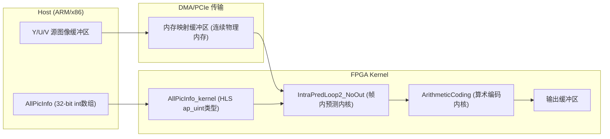
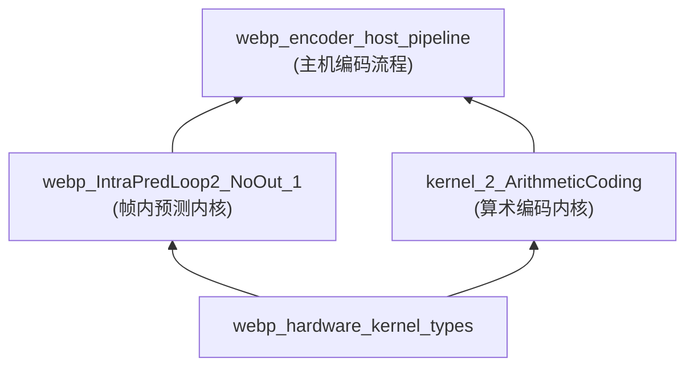

# webp_hardware_kernel_types 模块深度解析

## 一句话概述

`webp_hardware_kernel_types` 是 Xilinx FPGA WebP 硬件编码器的**类型系统基石**——它定义了主机端与 FPGA 内核之间的**二进制契约**，将软件层面的图像参数、量化矩阵、率失真计算抽象为硬件可综合的定点数据结构。想象它是一座**精密桥梁的蓝图**：一边是灵活但慢速的软件世界（C++ 结构体），另一边是并行但刻板的硬件世界（HLS 数据流），这座桥必须精确到比特级别才能确保 4K 实时编码不掉帧。

---

## 架构全景：数据如何在硅片与内存之间流动



### 角色分工：每个结构体的**建筑学职责**

| 结构体 | 类比 | 核心职责 | 关键设计决策 |
|--------|------|----------|-------------|
| `AllPicInfo` | **建筑总平面图**（软件端） | 在主机端以 `int` 数组形式承载所有图像参数、量化表、lambda 值 | 使用原生 C `int` 确保跨平台 ABI 兼容，便于主机端调试和序列化 |
| `AllPicInfo_kernel` | **精密切削蓝图**（硬件端） | 将 `AllPicInfo` 转换为 HLS 可综合的 `ap_uint<N>` 类型，精确控制每个字段的位宽 | 使用 `LG2_MAX_W_PIX` 等派生宏实现**按需位宽分配**——4K 图像需要 12 位表示宽度，绝不多用 1 位硅片资源 |
| `hls_QMatrix` | **材料强度规格表** | 封装 VP8 量化矩阵的三元组（量化步长、倒数、舍入偏置），支持 DC 和交流系数分别配置 | 定点数设计：`q` 为 7 位步长，`iq` 为 16 位定点倒数（1/Q），确保量化/反量化在 16 位整数运算内完成 |
| `ap_NoneZero` | **施工进度追踪板** | 维护跨宏块（Macroblock）的非零系数上下文，实现 VP8 的**条件更新编码** | 25 位状态字设计：16 位 Y 块 + 8 位 UV 块 + 1 位 DC，支持高效的位操作提取 top/left 上下文 |
| `str_dis` / `str_rd` / `str_rd_i4` | **成本核算表** | 封装率失真优化（RDO）计算：D（失真）、R（码率）、λ（拉格朗日乘子），支持 4×4 子块级决策 | **定点算术体系**：SSE 失真 24 位、谱失真 21 位、码率 21 位，λ 12 位，最终 RD score 40 位避免溢出 |

---

## 核心组件深度剖析

### 1. `AllPicInfo` 与 `AllPicInfo_kernel`：软件与硬件的**罗塞塔石碑**

```cpp
// 主机端：使用原生 int，便于调试和跨平台
struct AllPicInfo {
    int id_pic;         // 图像 ID
    int y_stride;       // Y 平面步长（字节）
    // ... 40+ 个参数
    int seg_y1_sharpen[16];  // 锐化系数表
};

// FPGA 端：使用 ap_uint，精确控制位宽
struct AllPicInfo_kernel {
    ap_uint<32> id_pic;               // 固定 32 位
    ap_uint<LG2_MAX_W_PIX> y_stride;  // 仅 12 位（支持 4K）
    // ...
    hls_QMatrix hls_qm1, hls_qm2, hls_qm_uv;  // 量化矩阵
    
    // 关键方法：主机到 FPGA 的**位精确转换**
    void SetData(int* p_info) {
        // 每个字段都有明确的位宽转换规则
        y_stride = p_info[2];  // int -> ap_uint<12>
        // ...
        hls_qm1.q_0 = p_info[11 + 2];   // 量化步长
        hls_qm1.iq_0 = p_info[13 + 2];  // 定点倒数
        // 锐化系数：16 个循环展开
        for (int i = 0; i < 16; i++)
            #pragma HLS UNROLL
            VCT_GET(ap_sharpen, i, WD_sharpen) = p_info[29 + 2 + i];
    }
};
```

**为什么需要两套结构体？** 这是**延迟与灵活性的经典权衡**：

- `AllPicInfo` 使用原生 `int` 是因为主机端需要**快速调试**（可以直接 `printf`）、**ABI 兼容**（不同编译器版本间传递安全）和**序列化友好**（可直接写入文件或网络）。
- `AllPicInfo_kernel` 使用 `ap_uint` 是因为 FPGA 的**每一比特都意味着真实的硅片成本**。一个 32 位 `int` 可能只用到 12 位有效值，但 HLS 会生成 32 位寄存器和数据路径，浪费 62.5% 的硬件资源。

`SetData()` 方法是**显式契约边界**：它精确规定了主机如何打包数据，FPGA 如何解包，任何一侧的变更都必须同步修改。这种显式转换看似繁琐，但消除了隐式 ABI 依赖的不确定性。

### 2. `hls_QMatrix`：量化系统的**定点数精密仪器**

```cpp
#define WD_q      7   // 量化步长：0-127，覆盖 QP 0-127
#define WD_iq     16  // 定点倒数：1.16 格式，精度 ~1/65536
#define WD_bias   32  // 舍入偏置：防止累积误差

struct hls_QMatrix {
    ap_uint<WD_q>   q_0;    // DC 量化步长
    ap_uint<WD_q>   q_n;    // AC 量化步长
    ap_uint<WD_iq>  iq_0;   // DC 定点倒数 (1/q_0)
    ap_uint<WD_iq>  iq_n;   // AC 定点倒数
    ap_uint<WD_bias> bias_0;  // DC 舍入偏置
    ap_uint<WD_bias> bias_n;  // AC 舍入偏置
};
```

这是**没有浮点单元的硬件上实现精确量化的工程杰作**。VP8 编码需要执行 `coeff_q = (coeff * iq + bias) >> n` 形式的量化，其中 `iq = 1.0 / q`。

**为什么用定点数而非浮点？**

1. **面积成本**：在 Xilinx 7 系列 FPGA 上，一个单精度浮点除法器需要约 2000 个 LUT 和 10 个 DSP48，而定点乘加只需要 1 个 DSP48 和少量 LUT。

2. **延迟确定**：浮点运算的延迟随指数变化，难以满足 HLS 的流水线 II=1 约束；定点运算延迟固定，易于调度。

**精度工程**：`iq` 使用 1.16 定点格式（1 位整数，16 位小数），可以表示 `1/65536` 到 `1` 的范围。对于 QP 0-127，`q` 的范围是 1-127，`iq = 1/q` 最小约 0.008，可以用 16 位小数精确表示到约 0.000015，足够用于 8-bit 图像的量化。

### 3. `ap_NoneZero`：VP8 条件编码的**状态机记忆**

```cpp
struct ap_NoneZero {
    ap_uint<25> nz_current;  // 当前 MB 的非零状态
    ap_uint<9>  top_nz;      // 上方 MB 的上下文（8 个块 + DC）
    ap_uint<9>  left_nz;     // 左侧 MB 的上下文
    ap_uint<25> line_nz[MAX_NUM_MB_W];  // 整行 MB 的状态缓存
    
    // 状态提取：从 25 位状态字中解码各块的非零标志
    ap_uint<9> load_top9(ap_uint<LG2_MAX_NUM_MB_W> x_mb, 
                         ap_uint<LG2_MAX_NUM_MB_H> y_mb) {
        if (y_mb == 0) return 0;  // 图像边界：无上方上下文
        ap_uint<25> BIT = line_nz[x_mb];
        // 位映射：Y0-Y3(12-15), U0-U1(18-19), V0-V1(22-23), DC(24)
        top_nz[0] = BIT(12, 12);
        top_nz[1] = BIT(13, 13);
        // ... 类似解码其他位
        return top_nz;
    }
};
```

VP8 的编码效率依赖于**基于上下文的条件更新**：当前宏块（MB）的编码概率依赖于相邻 MB 是否有非零系数。这要求编码器维护一个**空间状态机**，记住每个位置的系数非零状态。

**25 位状态字的设计**：

```
Bit 0-15:   Y0-Y3 四个 4×4 块的非零标志（每块 4 位，共 16 位）
Bit 16-19:  U0-U1 两个 2×2 块的非零标志（每块 2 位，共 4 位）
Bit 20-23:  V0-V1 两个 2×2 块的非零标志（每块 2 位，共 4 位）
Bit 24:     DC 系数的非零标志（1 位）
```

这种**密集位打包**是为了硬件效率：读取一个 25 位字比读取 25 个独立布尔值快得多，而且 `line_nz[MAX_NUM_MB_W]` 数组可以紧凑存储整行 MB 的状态。对于 4K 图像（256 个 MB 宽），仅需 256×25 位 = 800 字节，轻松放入 FPGA 的 BRAM。

### 4. `str_dis` / `str_rd` / `str_rd_i4`：率失真优化的**定点计算引擎**

```cpp
// 失真结构：封装 SSE 失真、谱失真、码率估计
typedef struct {
    ap_uint<WD_SSE4 + 4> d;      // 24bit SSE 失真
    ap_uint<WD_DISTO + 4> sd;    // 21bit 谱失真
    ap_uint<WD_FAST + 1 + 4> r;  // 21bit 估计码率
    ap_uint<12> h;               // 头信息开销
    ap_uint<25> nz;              // 非零系数计数
    ap_uint<WD_RD_SCORE + 4> score;  // 40bit 最终 RD 分值
    
    // 核心方法：拉格朗日代价计算 J = D + λR
    void ca_score(ap_uint<WD_LMD> lmbda) {
        score = (((ap_uint<WD_RD_SCORE + 4>)(d + (ap_uint<WD_SSE4 + 4>)sd)) << 8) +
                ((ap_uint<WD_RD_SCORE + 4>)(r + h)) * lmbda;
    };
} str_dis;

// 率失真决策结构：为每个 4x4 子块选择最佳预测模式
typedef struct {
    ap_uint<25> nz;
    ap_uint<WD_RD_SCORE + 4> score;
    ap_uint<4> mode;  // 16 种预测模式之一
    
    void ca_score(ap_uint<WD_LMD> lmbda, str_dis* dis, ap_uint<4> m) {
        nz = dis->nz;
        score = (((ap_uint<WD_RD_SCORE + 4>)(dis->d + (ap_uint<WD_SSE4 + 4>)(dis->sd))) << 8) +
                ((ap_uint<WD_RD_SCORE + 4>)(dis->r + dis->h)) * lmbda;
        mode = m;
    };
} str_rd;
```

VP8 编码的核心是**率失真优化（RDO）**：对每个 4×4 块尝试多种预测模式，计算每种模式的**失真**（与原始图像的差异）和**码率**（编码后大小），选择使 $J = D + \lambda R$ 最小的模式。这是视频编码中**计算最密集**的部分，必须在 FPGA 上用定点数实现。

**定点数设计的工程细节**：

1. **左移 8 位（`<< 8`）**：将失真的权重提升，确保在 40 位范围内 $D$ 和 $\lambda R$ 的数值平衡。这不是随意的，而是基于经验：对于典型 QP 值，$D$ 的量级约为 $10^4$，$\lambda$ 约为 $10^2$，$R$ 约为 $10^2$，所以 $D$ 和 $\lambda R$ 都在 $10^4$ 量级。

2. **位宽分配策略**：
   - `WD_SSE4 + 4 = 20 + 4 = 24` 位 SSE 失真：支持 4×4 块（16 像素），每像素差最大 255，平方和最大 $16 × 255² ≈ 1M < 2²⁰$，留 4 位裕量防止累积误差。
   - `WD_LMD = 12` 位 lambda：VP8 的 lambda 通常在 1-2048 范围，12 位足够覆盖。
   - `WD_RD_SCORE + 4 = 36 + 4 = 40` 位最终分值：足够大防止 $(D + \lambda R)$ 溢出。

---

## 依赖关系：模块的**生态系统定位**

### 上游依赖（谁使用本模块）



- **[webp_encoder_host_pipeline](codec_acceleration_and_demos-webp_encoder_host_pipeline.md)**：本模块的**直接消费者**。主机编码流程通过 `SetData()` 将 `AllPicInfo` 转换为 `AllPicInfo_kernel`，然后通过 PCIe/DMA 将数据发送到 FPGA。

### 下游依赖（本模块依赖谁）

本模块是**叶子类型模块**，不直接依赖其他业务模块，仅依赖：

1. **Xilinx HLS 库**：`hls_stream.h`、`ap_int.h` 提供 `ap_uint<N>`、`ap_int<N>` 等可综合的任意精度整数类型。

2. **VP8 标准定义**：位宽常量（如 `WD_PIX = 8`）、ZigZag 扫描顺序、预测模式枚举等，这些在 VP8 标准中定义，本模块实现其硬件映射。

---

## 设计决策与工程权衡

### 决策 1：显式位宽 vs. 自动推断

**问题**：HLS 支持 `ap_uint<>` 的自动位宽推断，为什么要显式定义 `WD_q`、`WD_iq` 等常量？

**选择**：显式定义所有位宽常量，并通过宏派生（如 `WD_RD_SCORE + 4`）。

**权衡分析**：
- **优点**：
  - 可预测性：编译器不执行"魔法"优化，行为完全由代码控制
  - 可移植性：位宽逻辑清晰，迁移到新的 FPGA 平台时易于调整
  - 调试友好：HLS 报告的资源消耗可以直接映射到这些常量
- **缺点**：
  - 代码冗余：需要定义大量常量宏
  - 刚性：如果 VP8 标准变更（如支持 10-bit 视频），需要修改多处

**为什么适合这里**：视频编码标准的位深度和参数范围是**长期稳定的**（VP8 已定型十余年），显式控制带来的可预测性远大于维护成本。而且 HLS 的自动推断往往过于激进或保守，不适合需要严格时序约束的视频编码场景。

### 决策 2：结构体方法 vs. 纯数据结构

**问题**：`AllPicInfo_kernel` 和 `ap_NoneZero` 包含了方法（`SetData()`、`load_top9()` 等），这是否违背了"硬件类型应该是纯数据"的原则？

**选择**：允许轻量级方法，但严格限制为**位操作包装**（如 `set_nz_y()` 只是 `nz_current(15, 0) = nz_y(15, 0)` 的封装）。

**权衡分析**：
- **优点**：
  - 封装位操作逻辑，避免在业务代码中散布 `ap_uint` 的切片语法
  - 提供**硬件友好的抽象**：例如 `load_top9()` 封装了从 25 位状态字中提取 9 位上下文的复杂位操作
- **缺点**：
  - HLS 可能无法内联复杂方法，导致额外的调用开销（在硬件中表现为额外的状态机）
  - 方法调用可能隐藏资源消耗，不如纯数据结构的资源可预测性强

**为什么适合这里**：这些方法本质上是**内联的位操作宏**的替代物。例如 `set_nz_y()` 会被 HLS 完全内联，生成与直接写位操作完全相同的硬件。提供方法形式增强了代码可读性，同时通过 `inline` 和简单实现保证了零开销。

### 决策 3：宏辅助函数 vs. C++ 模板

**问题**：代码中大量使用了宏（如 `VCT_GET`、`SB_GET`、`ZIGZAG`），为什么不用 C++ 模板或内联函数替代？

**选择**：对硬件关键路径使用宏，对主机辅助函数使用内联函数。

**权衡分析**：
- **宏的优点（硬件关键路径）**：
  - 完全文本替换，HLS 可以看到完整的操作链，便于跨语句优化
  - 可以处理变长位宽（如 `VCT_GET(vect, mi, wd)` 中的 `wd`），模板需要复杂的非类型模板参数
- **宏的缺点**：
  - 无类型检查，容易隐藏错误（如传递错误的位宽）
  - 难以调试，预处理后的代码难以阅读
- **内联函数的优点（主机辅助）**：
  - 类型安全，编译器可以捕获参数不匹配
  - 可调试，可以设置断点

**为什么适合这里**：这是一个**务实的混合策略**。硬件关键路径（如内核中的 ZigZag 扫描、子块访问）使用宏以最大化 HLS 优化空间；主机辅助函数（如 `Get_Busoffset_ysrc`）使用内联函数以保证类型安全。这种分离反映了硬件和软件的不同优化目标。

---

## 关键常量与宏的**语义地图**

### 位宽常量：硬件资源的**预算表**

| 常量 | 值 | 用途 | 硬件意义 |
|------|-----|------|----------|
| `WD_PIX` | 8 | 像素位深 | 支持标准 8-bit 图像，每个像素需要一个字节 |
| `WD_DCT` | 12 | DCT 系数位宽 | 8-bit 像素经过 DCT 后，理论最大值 8×255=2040，需要 12 位（2¹¹=2048）表示 |
| `WD_Q` / `WD_IQ` | 12 | 量化/反量化 | 与 DCT 系数位宽匹配，保证量化过程不溢出 |
| `WD_SSE4` | 20 | 4×4 块 SSE | 4×4 块，每像素差最大 255，平方和最大 16×255²≈1M<2²⁰ |
| `WD_LMD` | 12 | Lambda 位宽 | VP8 的 lambda 通常在 1-2048 范围，12 位足够覆盖 |
| `WD_RD_SCORE` | 36 | RD 代价位宽 | 需要容纳 (D + λR) 的最大值，40 位提供足够余量 |

### 容量常量：系统能力的**规格书**

| 常量 | 值 | 含义 | 实际限制 |
|------|-----|------|----------|
| `MAX_W_PIX` / `MAX_H_PIX` | 4096 | 最大图像维度 | 支持 4K（3840×2160）及稍大的专业格式 |
| `MAX_NUM_MB_W` | 256 | 最大 MB 列数 | 4096/16 = 256，与最大宽度对应 |
| `LG2_MAX_W_PIX` | 12 | 宽度位宽 | log₂(4096) = 12，恰好表示 0-4095 |
| `SIZE_P_INFO` | 1024 | 信息缓冲区大小 | 256 个 int × 4 字节 = 1024 字节 |
| `NUM_BURST_READ` | 64 | DMA 突发读取长度 | 64 个 beat，对应 256 字节（64×4），优化 DDR 带宽 |

### 派生宏：位操作的**语法糖工厂**

| 宏 | 功能 | 示例 |
|----|------|------|
| `SB_GET(sb, line, col, wd)` | 从子块（Sub-block）中提取指定行列的元素 | `SB_GET(my_sb, 1, 2, 8)` 获取第 1 行第 2 列的 8 位值 |
| `VCT_GET(vect, mi, wd)` | 从向量中提取第 mi 个元素 | `VCT_GET(my_vec, 3, 12)` 获取第 3 个 12 位元素 |
| `VCT_SET_COL_SB(sb, col, wd, vect)` | 将子块的一列复制到向量 | 用于 4×4 块的列重排操作 |
| `ZIGZAG(k)` | ZigZag 扫描表 | `ZIGZAG(3)` 返回 8，即 DCT 系数 3 的 ZigZag 位置是 8 |

---

## 常见陷阱与工程**避雷指南**

### 陷阱 1：HLS 的 `ap_uint` 切片越界**静默截断**

```cpp
// 危险代码：假设 nz 是 ap_uint<25>
ap_uint<25> nz = some_value;
ap_uint<8> low_byte = nz(7, 0);    // OK: 提取位 0-7
ap_uint<8> high_byte = nz(31, 24);  // 危险！nz 只有 25 位，31 超出范围
```

**后果**：HLS 不会报错，但 `nz(31, 24)` 会返回未定义值，导致编码结果完全错误且难以调试。

**防御**：使用常量宏定义位范围，并在代码审查中检查所有切片操作是否在有效范围内。例如：

```cpp
// 安全的做法：使用具名常量
#define NZ_DC_BIT 24
#define NZ_V1_MSB 23
#define NZ_V0_LSB 22
// ...
ap_uint<1> dc_nz = nz(NZ_DC_BIT, NZ_DC_BIT);  // 明确且安全
```

### 陷阱 2：`SetData()` 的字段偏移**版本漂移**

```cpp
// 主机端代码（v1.0）
int p_info[256] = {0};
p_info[15 + 2] = quant_bias;  // 偏移 17

// FPGA 端代码（v1.1，SetData 被修改）
hls_qm1.bias_n = p_info[16 + 2];  // 偏移 18！
```

**后果**：主机和 FPGA 使用不同的偏移，导致量化参数完全错乱，编码质量灾难性下降，且不会触发任何运行时错误。

**防御**：
1. **单一事实源**：定义一个共享的头文件，用宏常量定义所有偏移：
   ```cpp
   #define OFF_QM1_BIAS_N (16 + 2)
   ```
2. **版本校验**：在 `SetData()` 开头添加协议版本检查：
   ```cpp
   void SetData(int* p_info) {
       assert(p_info[1] == KERNEL_PROTOCOL_VERSION);
       // ...
   }
   ```

### 陷阱 3：HLS `UNROLL` 的**资源爆炸**

```cpp
// 危险的循环展开
for (int i = 0; i < 256; i++) {
    #pragma HLS UNROLL
    do_something(array[i]);
}
```

**后果**：`#pragma HLS UNROLL` 要求 HLS 将循环完全展开为 256 个独立操作，这可能消耗数万 LUT，导致综合失败或时序违规。

**防御**：
1. **理解 UNROLL 的语义**：`UNROLL` 意味着**完全并行**，仅在循环次数极少（如本模块中的 16 次锐化系数复制）时使用。
2. **使用 PIPELINE 替代**：对于大循环，使用 `#pragma HLS PIPELINE II=1` 实现流水线而非展开，保持吞吐量同时控制资源。
3. **资源预算**：在模块文档中明确标注每个 UNROLL 的资源消耗，例如：
   > "SHARPEN0/1 循环：16 次迭代，UNROLL 后约消耗 16×11 = 176 个触发器用于锐化系数寄存器。"

### 陷阱 4：`ap_int` vs `ap_uint` 的**符号灾难**

```cpp
// 危险：混用有符号和无符号
ap_int<12> signed_value = -100;
ap_uint<12> unsigned_value = signed_value;  // 隐式转换！
// unsigned_value 现在是 4096 - 100 = 3996，而非 -100
```

**后果**：HLS 允许 `ap_int` 到 `ap_uint` 的隐式转换，但语义是**位模式复用**而非数值保持。负数会变成很大的正数，导致量化、预测等计算完全错误。

**防御**：
1. **显式类型声明**：在代码审查中检查所有 `ap_int` 和 `ap_uint` 的使用场景，确保：
   - 像素值、系数等"自然无符号"量使用 `ap_uint`
   - 差值、梯度等"可能有负"量使用 `ap_int`
2. **静态断言**：在关键转换点添加编译期检查：
   ```cpp
   static_assert(sizeof(ap_int<WD_DCT>) == sizeof(ap_uint<WD_DCT>), 
                 "ap_int and ap_uint size mismatch");
   ```

---

## 设计哲学与架构智慧

### 1. **分层类型系统**：适配不同"时钟域"的认知模型

本模块的核心洞察是：**主机和 FPGA 运行在根本不同的"时钟域"**——不仅是物理时钟频率的差异（GHz vs 数百 MHz），更是**认知模型的差异**（顺序执行 vs 空间并行）。

`AllPicInfo` / `AllPicInfo_kernel` 的分层设计体现了对这种差异的**尊重而非掩盖**：

- **主机层**：使用 `int` 数组，因为主机程序员习惯于"变量是 32 位盒子"的思维模型，调试器可以自然展示，序列化库可以自动处理。
- **转换层**：`SetData()` 是**显式的认知转换点**。它强制程序员思考："这个 `int` 在硬件中需要多少位？"这种显式性比隐式的自动转换更容易发现错误。
- **硬件层**：`ap_uint<>` 是**硬件程序员的语言**。它直接映射到寄存器和数据路径，HLS 的调度报告可以精确到每个 `ap_uint` 的操作延迟。

这种分层不是过度工程，而是对不同执行域的**必要适配**——就像 TCP/IP 协议栈分层适配不同的传输需求一样。

### 2. **定点数体系**：在"无浮点硬件"约束下的数学严谨

`hls_QMatrix` 和 `str_dis` 中的定点数设计，展示了**约束工程（Constraint Engineering）**的艺术：

**约束**：FPGA 没有高效的浮点单元，必须全部使用整数运算。
**目标**：实现 VP8 的精确量化公式 $Q(c) = \text{round}(c / q)$ 和反量化 $Q^{-1}(c_q) = c_q × q$。

**洞察**：量化公式可以重写为 $Q(c) = (c × \text{recip}(q) + \text{bias}) >> n$，其中：
- `recip(q)` 是 $1/q$ 的定点表示（`iq` 字段）
- `bias` 是舍入偏置，实现正确的四舍五入
- `n` 是定点小数位数

**验证**：对于 8-bit 图像，DCT 系数最大约 2040（$8×255$），`iq` 使用 1.16 格式（值域 $[0, 2)$），乘积最大约 4080，可以放入 16 位整数。反量化类似，确保了**16 位整数运算的闭环**。

这种设计不是妥协，而是**对数学结构的深刻理解**：量化/反量化是线性运算，定点数可以精确表示这种线性性，而浮点数的"便利性"在这里是不必要的奢侈。

### 3. **位打包状态机**：空间并行架构下的时间记忆

`ap_NoneZero` 的设计展示了如何在**无空间共享的硬件流水线**中实现**时间依赖的状态传递**：

**问题**：VP8 的编码需要知道相邻 MB 的非零状态，但 FPGA 的流水线是**单向流动**的，不能像 CPU 那样随机访问内存中的"当前行状态"。

**洞察**：利用 BRAM 作为**行缓冲区（Line Buffer）**。`line_nz[MAX_NUM_MB_W]` 是一个 BRAM 数组，存储当前行每个 MB 的 25 位状态。当流水线从左到右处理 MB 时：
1. 从 `line_nz[x]` 读取"上方 MB"的状态（即上一行同列 MB 的保存状态）
2. 从 `nz_current` 或寄存器读取"左侧 MB"的状态（刚刚处理完的 MB）
3. 处理当前 MB，计算新的 `nz_current`
4. 将 `nz_current` 写回 `line_nz[x]`，供下一行使用

**硬件实现**：这种设计映射到 FPGA 的 BRAM 和寄存器非常自然：
- `line_nz` → 一块 256×25 位的 BRAM（约 6.4 Kbit，可放入单个 18Kb BRAM）
- `nz_current`、`top_nz`、`left_nz` → 寄存器（FF），访问延迟为 0 周期
- 读写冲突：由于流水线是单向的，当前 MB 不会同时被读写，没有冲突

这种设计是**空间架构下的时间记忆范式**：用 BRAM 的空间（行缓冲区）换取时间上的状态传递能力，实现了类似 CPU 缓存的"最近邻访问"效果，但完全在硬件流水线的确定性时序下。

---

## 使用指南：扩展与集成

### 添加新的量化参数

假设 VP8 扩展支持新的量化模式，需要添加 `seg_y3_q_0` 字段：

1. **修改主机结构体**：在 `AllPicInfo` 中添加：
   ```cpp
   int seg_y3_q_0;     // 新增：Y3 平面 DC 量化步长
   int seg_y3_q_n;     // 新增：Y3 平面 AC 量化步长
   // ... 其他 Y3 参数
   ```

2. **修改 FPGA 结构体**：在 `AllPicInfo_kernel` 中添加对应的 `ap_uint` 字段：
   ```cpp
   ap_uint<WD_q> seg_y3_q_0;   // 复用 WD_q 常量，保持位宽一致
   ap_uint<WD_q> seg_y3_q_n;
   ```

3. **更新 SetData()**：在 `SetData()` 中添加转换逻辑：
   ```cpp
   // 在现有转换之后添加
   seg_y3_q_0 = p_info[NEW_OFFSET_0];  // 定义新的偏移常量
   seg_y3_q_n = p_info[NEW_OFFSET_N];
   ```

4. **更新主机打包代码**：确保主机端正确填充新的 `p_info` 偏移位置。

**关键注意点**：
- **保持位宽一致性**：新字段的位宽（`WD_q`）必须与现有量化参数一致，否则 HLS 会生成不同的数据路径，可能导致时序问题。
- **偏移管理**：使用具名常量（如 `OFF_Y3_Q_0`）而非魔法数字，避免主机和 FPGA 的偏移不一致。
- **协议版本**：如果新增字段破坏向后兼容，必须在 `p_info[0]`（id_pic）中添加协议版本号检查。

### 调试 HLS 综合问题

当 HLS 综合报告意外的资源消耗或时序违规时：

1. **检查位宽推断**：在 HLS 的 `csynth.rpt` 中查找意外的 `ap_uint<32>` 而不是预期的窄位宽。通常是因为某个中间计算默认使用了 `int`。

2. **验证 UNROLL 效果**：在 HLS 的控制台日志中确认 `UNROLL` 是否成功。如果循环边界不是编译时常量，HLS 可能无法展开。

3. **检查数组分区**：`line_nz[MAX_NUM_MB_W]` 是一个较大的数组，确保 HLS 正确识别为 BRAM 而非分布式 RAM。在 `directives.tcl` 中明确指定：
   ```tcl
   set_directive_resource -core RAM_1P "ap_NoneZero" line_nz
   ```

### 主机与 FPGA 的数据对齐

主机通过 DMA 发送数据到 FPGA 时，必须确保：

1. **4 字节对齐**：所有 DMA 缓冲区的起始地址必须是 4 字节对齐的，否则 DMA 控制器可能失败或性能下降。

2. **连续物理内存**：使用 `posix_memalign()` 或 `mmap(MAP_LOCKED)` 分配 DMA 缓冲区，确保内存在物理上连续，DMA 可以传输大块数据而不需要 scatter-gather。

3. **字节序**：Xilinx FPGA 通常使用大端（Big Endian）存储，而 x86 主机是小端（Little Endian）。`AllPicInfo` 使用 `int` 数组，DMA 传输后 FPGA 端可能需要字节序转换，或者在协议中约定统一使用小端。

---

## 参考与延伸阅读

### 直接关联模块

- **[webp_encoder_host_pipeline](codec_acceleration_and_demos-webp_encoder_host_pipeline.md)**：本模块的直接消费者，定义了主机端如何准备 `AllPicInfo`、如何调用 `SetData()`、如何通过 DMA 发送数据到 FPGA。

### 技术背景知识

1. **VP8 编码标准**：Google 的开源视频编码格式，本模块实现其硬件加速所需的类型系统。关键概念包括：宏块（Macroblock）、帧内预测模式、量化参数（QP）、非零系数上下文。

2. **Xilinx HLS（Vitis HLS）**：本模块使用 HLS 的 `ap_uint`、`ap_int` 类型实现硬件可综合代码。关键概念包括：数据流（Dataflow）架构、流水线（Pipeline）优化、位精确仿真。

3. **率失真优化（RDO）**：视频编码的核心算法，本模块的 `str_dis`、`str_rd` 结构体封装了 RDO 的定点数实现。关键公式：$J = D + \lambda R$，其中 $D$ 是失真，$R$ 是码率，$\lambda$ 是拉格朗日乘子。

---

## 总结：为什么这个模块值得深入研究

`webp_hardware_kernel_types` 表面上只是一个"头文件"，但它承载了**硬件加速系统中最困难的问题之一：软件与硬件之间的精确契约**。它的设计展示了：

1. **分层抽象的艺术**：用 `AllPicInfo` 和 `AllPicInfo_kernel` 分离软件和硬件的关心点，用 `SetData()` 作为显式转换边界。

2. **定点数的工程严谨**：在 `hls_QMatrix` 和 `str_dis` 中，每一个位宽选择都有数学依据，确保了在 16/24/40 位整数运算内完成 VP8 的量化、RDO 计算。

3. **硬件架构的创造性适应**：`ap_NoneZero` 的 25 位状态字和 `line_nz` 行缓冲区，是在 FPGA 的 BRAM 和流水线限制下，实现 VP8 上下文依赖编码的巧妙方案。

对于新加入的工程师，理解这个模块不仅是学习一个具体实现，更是理解**硬件加速系统的设计范式**：如何在软件灵活性和硬件效率之间找到平衡，如何用定点数和位操作替代浮点运算，如何在空间并行架构中实现时间依赖的状态传递。这些技能将贯穿整个 FPGA 加速编码器的开发工作。
