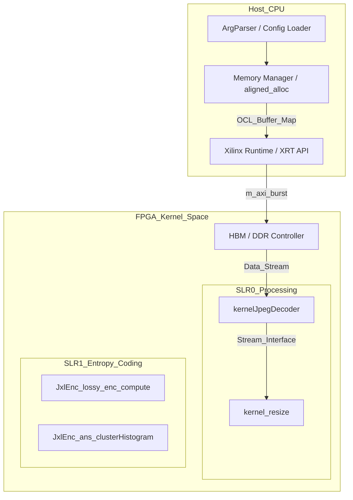

# 模块深度解析：codec_acceleration_and_demos

## 1. 它解决了什么问题？

在现代数据中心和边缘计算场景中，图像处理（如 JPEG 解码、WebP 编码、JXL 压缩）面临着**计算吞吐量**与**功耗**的严峻挑战。

传统的软件实现（Pure CPU）在处理 4K/8K 图像或高并发请求时，瓶颈通常出现在：
1.  **变换域计算**：如离散余弦变换（DCT）和反变换（IDCT），涉及大量的浮点或定点乘加运算。
2.  **熵编码/解码**：如 Huffman 编码、ANS（非对称数值系统）或算术编码，这些过程具有极强的**数据依赖性**，难以在 CPU 上实现高效的 SIMD 并行。
3.  **像素级预处理**：如图像缩放（Resize）和颜色空间转换。

`codec_acceleration_and_demos` 模块通过 **FPGA 硬件流水线** 将这些高耗能、高延迟的阶段从 CPU 卸载（Offload）到加速卡上，从而在保持画质的同时，成倍提高处理吞吐量并降低延迟。

## 2. 心理模型：流式生产线工厂

理解该模块的最佳方式是将其视为一个**“流式生产线工厂”**：

*   **Host（主机端）** 负责“行政管理”：分配内存、搬运原始物料（原始图片数据）、下达加工指令（启动 Kernel），以及最后的质量检验（校验结果）。它主要使用 OpenCL 或 XRT API 管理设备寿命周期。
*   **Kernel（硬件内核）** 是“专用流水线”：每条流水线（如 JPEG 核心或 JXL 核心）都针对特定算法进行了硬化处理。它们通过硬件连线实现数据流（Dataflow）处理，不依赖通用 CPU 的分支预测和指令调度。
*   **Buffer Management（缓冲区管理）** 是“传送带”：利用 AXI Burst 传输和对齐内存（Aligned Memory），在主机和 FPGA 之间高效传递数据。

## 3. 架构总览与数据流

本模块采用了典型的 **Host-Kernel 异构架构**，主要基于 Xilinx Vitis 流程实现。

### 架构组件图

### 数据流分析
1.  **加载阶段**：Host 调用 `posix_memalign` 分配对齐缓冲区，并将原始编码数据（如 `.jpg`）读入该缓冲区。
2.  **迁移阶段**：通过 OpenCL 命令队列（`cl::CommandQueue`）将数据搬运至 FPGA 的存储器（DDR 或 HBM）。
3.  **计算流水线**：
    *   在 JPEG 示例中，`kernelJpegDecoder` 读取 JPEG 比特流，执行 Huffman 解码和 IDCT，输出 MCU 格式的 YUV 数据。
    *   在 JXL 编码中，`acc_lossy_enc_compute` 阶段会并行处理色彩空间变换和策略选择。
4.  **回传阶段**：处理完成后，结果被写回 FPGA 存储，并同步回 Host 内存供应用层进一步处理（如 `rebuild_raw_yuv`）。

## 4. 关键设计决策与权衡

### A. 存储分层：HBM vs DDR (平台适配)
在 `conn_u50_u280.cfg` 和 `conn_u200.cfg` 中，你可以看到针对不同硬件平台的定制化设计：
*   **HBM (U50/U280)**：通过将不同端口映射到不同的 HBM 伪通道（Pseudo-channel），实现了高并发的数据块访问。
*   **DDR (U200)**：由于 DDR 通道有限，设计者通过 `sp` 命令显式隔离了输入和输出端口的物理库，避免总线仲裁冲突。

### B. 硬件串行化与位处理
在 `XAcc_edges.cpp` 中，设计者将边缘编码逻辑转换为高度流水线化的状态机。
*   **决策**：放弃了软件常用的复杂递归，转而使用 `hls::stream` 来连接不同的处理级。
*   **权衡**：增加了逻辑资源占用，但实现了 `II=1` 的吞吐率，完全消除了 CPU 分支预测失败的性能抖动。

### C. 浮点精度与硬件面积
在 `acc_dct-inl.h` 中，使用了 `hwy` 库封装的 SIMD 操作，并在硬件中对应了 DSP 单元。
*   **权衡**：在加速器中大量使用 32 位浮点而非 64 位。对于图像编码，32 位精度足以满足视觉无损要求，且能节省近一倍的硬件面积和功耗。

### D. 计算任务的“非平衡”划分 (Partitioning)
在 JXL 和 WebP 的设计中，并非所有逻辑都在硬件中实现。
*   **决策**：例如在 JXL 中，直方图聚类（Clustering）这种涉及高度动态内存分配和复杂拓扑分析的逻辑被保留在 Host 端（由 `acc_phase3.cpp` 调度）。
*   **理由**：FPGA 擅长处理**结构化、流水线化**的计算。而启发式搜索和动态规划类算法在 FPGA 上会消耗极高的布线资源且主频极低。本模块选择了“Host 控制逻辑 + Kernel 计算密集”的混合模式，这是在灵活性与绝对性能之间的最佳博弈点。

## 5. 给新贡献者的避坑指南

1.  **内存对齐 (Memory Alignment)**：
    所有传递给 FPGA 的缓冲区必须按 4KB 对齐（`aligned_alloc`）。非对齐的内存会导致 DMA 控制器报错或吞吐量下降 80% 以上。
2.  **异步队列同步**：
    模块默认开启了 `CL_QUEUE_OUT_OF_ORDER_EXEC_MODE_ENABLE`。请务必检查 `cl::Event` 的链接关系。如果忘记在两个 Kernel 间传递 Event，会导致竞争风险。
3.  **AXI Burst 性能**：
    在 HLS 内核中，避免在循环内部进行零碎的 `m_axi` 读写。务必使用局部数组（BRAM/URAM）作为缓存，并使用 `memcpy` 或流水线读取来触发 Burst 传输。
4.  **SLR 物理布局**：
    加速器被强制约束在特定的 SLR（如 `SLR0`）。在扩展新功能时，如果逻辑资源溢出，物理布局失败通常是由于 SLR 间的连线过于拥挤。

---

## 6. 子模块索引

本模块的功能由以下部分共同构建：

*   [**jpeg_and_resize_demos**](codec_acceleration_and_demos-jpeg_and_resize_demos.md)：涵盖 JPEG 解码核心配置、主机端时序测量及图像缩放演示。
*   [**jxl_and_pik_encoder_acceleration**](codec_acceleration_and_demos-jxl_and_pik_encoder_acceleration.md)：JPEG XL 编码的硬加速方案，包含 AC 策略选择、色度转换建模及 ANS 直方图聚类。
*   [**lepton_encoder_demo**](codec_acceleration_and_demos-lepton_encoder_demo.md)：展示了 Lepton 算法中边缘编码（Edge Encoding）的硬件化实现及其物理连接。
*   [**webp_encoder_host_pipeline**](codec_acceleration_and_demos-webp_encoder_host_pipeline.md)：WebP 编码的主机驱动流水线，集成了多种后端解码器（PNG, TIFF, WIC）和复杂的容器打包（Mux）逻辑。
*   [**webp_hardware_kernel_types**](codec_acceleration_and_demos-webp_hardware_kernel_types.md)：定义了 WebP 硬件内核使用的各种结构体、量化矩阵及帧信息契约。

---
*建议：如果你是第一次接触此代码库，请先通读 [webp_hardware_kernel_types](codec_acceleration_and_demos-webp_hardware_kernel_types.md) 以理解硬件层面的数据表示。*