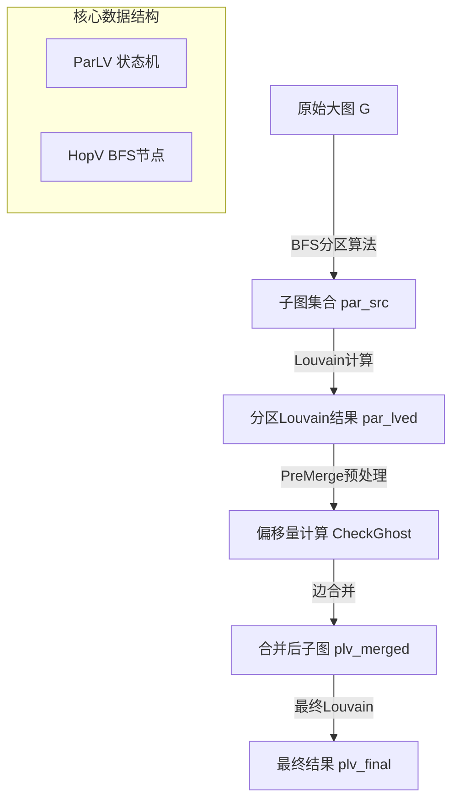

# Partition Graph State Structures 技术深度解析

## 30秒快速理解

想象你要把一幅巨大的城市地图（图）切成若干小块，以便多个团队（FPGA/加速器）同时分析每个区域的社区结构（Louvain算法）。但切割时会产生**边界点**——这些点虽然在A块中，却与B块中的邻居相连。**Partition Graph State Structures** 就是这个"地图切割与缝合工具包"的核心引擎：它负责将超大图切割成适配硬件内存的子图，管理跨分区的"幽灵顶点"（Ghost Vertices），在分布式Louvain计算后重新缝合结果，最终输出全局社区划分。

---

## 架构全景：数据流与组件角色



### 核心抽象：状态驱动的图手术

本模块采用**状态机模式**管理图的分区-计算-合并生命周期。`ParLV`（Partitioned Louvain）类是 orchestrator（编排器），它维护一组布尔状态标志（`st_Partitioned`, `st_ParLved`, `st_Merged` 等），确保操作按严格顺序执行——你不能合并尚未计算的分区，也不能在预处理前进行Ghost检测。

### 数据流详解

1. **输入阶段**：原始图 `graphNew*` 通过 `partition()` 或 `BFS_par_general_4TG()` 被切割为 `num_par` 个子图，存储在 `par_src[]` 数组中。每个子图是 `GLV`（Graph Louvain Value）对象，封装了子图结构、社区映射 `C`、模块度 `Q` 等。

2. **分布式计算阶段**：每个子图被分发到不同FPGA设备执行Louvain算法（在 [louvain_modularity_execution_and_orchestration](community_detection_louvain_partitioning-louvain_modularity_execution_and_orchestration.md) 中实现），结果存储在 `par_lved[]` 中。

3. **预处理阶段**：`PreMerge()` 计算各分区的顶点偏移量（`off_lved[]`）、检查Ghost顶点映射（`CheckGhost()`），为合并做准备。这是关键的"缝合准备"步骤——就像在做手术缝合前，需要精确标记每块组织的对应关系。

4. **合并阶段**：`MergingPar2()` 将分区边列表合并为统一图，处理本地-本地边（`MergingPar2_ll`）、本地-Ghost边（`MergingPar2_gh`），最终生成 `plv_merged`。

---

## 核心组件深度剖析

### 1. HopV 结构体 —— BFS的前沿哨兵

```cpp
struct HopV {
    long v;   // 顶点全局ID
    int hop;  // 从分区种子顶点的跳数（BFS深度）
};
```

**设计意图**：在BFS分区算法中，我们需要记录每个顶点被发现时的"距离"（跳数）。这不仅是标记访问状态，更是控制分区平衡的关键——`MAX_PAR_VERTEX` 限制每个分区的本地顶点数，而 `max_hop` 限制BFS搜索深度，防止某个分区过度生长。

**内存与性能**：`HopV` 被存储在 `std::queue<HopV>` 中，这是BFS的标准队列结构。每个分区维护独立队列 `q_par[p]`，实现并行分区生长。

### 2. ParLV 类 —— 分区状态 orchestrator

`ParLV`（Partitioned Louvain）是本模块的中枢神经系统。它不仅是数据容器，更是严格执行**状态协议**的协调器。

#### 状态机设计

```cpp
// ParLV 维护的布尔状态标志
bool st_Partitioned;   // 是否已完成图分区
bool st_ParLved;       // 是否已完成分区Louvain计算
bool st_PreMerged;     // 是否已完成PreMerge预处理
bool st_Merged;        // 是否已完成图合并
bool st_FinalLved;     // 是否已完成最终Louvain计算
bool st_Merged_ll;     // 本地-本地边是否已合并
bool st_Merged_gh;     // Ghost边是否已合并
```

**为什么需要状态机？**

在分布式图计算中，操作顺序错误会导致灾难性后果（例如，在分区前尝试合并）。状态机强制实施**happens-before**关系。例如，`PreMerge()` 开头会检查 `if (st_PreMerged == true) return;`，避免重复计算；而 `MergingPar2()` 要求 `st_PreMerged` 为真，否则断言失败。

#### 核心数据成员

```cpp
// 分区数组（核心数据）
GLV* par_src[MAX_PARTITION];     // 原始分区子图（输入）
GLV* par_lved[MAX_PARTITION];    // 分区Louvain结果（中间结果）

// 合并后结果
GLV* plv_src;       // 原始大图（指向输入）
GLV* plv_merged;    // 合并后图（MergingPar2结果）
GLV* plv_final;     // 最终结果（最终Louvain后）

// 偏移量表（关键映射结构）
long off_src[MAX_PARTITION+1];   // 各分区在原始图中的顶点偏移
long off_lved[MAX_PARTITION+1];  // 各分区在Louvain结果中的顶点偏移

// Ghost顶点管理
long NV_gh;              // Ghost顶点总数
long* p_v_new[MAX_PARTITION];  // 各分区Ghost顶点的新ID映射表
unordered_map<long, long> m_v_gh;  // 全局Ghost顶点映射表

// 边列表（合并阶段使用）
edge* elist;        // 合并后的边列表（本地-本地 + Ghost边）
long* M_v;          // 顶点映射表（合并阶段）
long NEll, NEgl, NEgg, NEself;  // 各类边计数器

// 缩放因子（用于编码顶点ID）
int scl_NV, scl_NE, scl_NVl, scl_NElg;  
long max_NV, max_NE, max_NVl, max_NElg;

// 时间统计
timesParType timesPar;  // 各阶段时间统计

// 配置参数
int num_par;        // 分区数
int num_dev;        // 设备数
int kernelMode;     // 内核模式（MD_FAST等）
bool isPrun;        // 是否启用Ghost剪枝
int th_prun;        // 剪枝阈值
bool use_bfs;       // 是否使用BFS分区（vs随机分区）

// BFS分区特定数据
bfs_selected* bfs_adjacent;  // BFS邻接表（用于Ghost查找）
```

#### 关键方法解析

**分区方法：`partition()` vs `BFS_par_general_4TG()`**

模块提供两种分区策略：

1. **简单分区** (`partition()`): 按顶点ID范围均匀切割（`vsize = glv_src->NV / num_par`）。优点是简单快速，缺点是可能切割大量边，产生过多Ghost顶点。

2. **BFS分区** (`BFS_par_general_4TG()`): 从多个种子顶点同时启动BFS，让各分区像"墨水扩散"般自然生长，直到达到 `MAX_PAR_VERTEX` 限制。这种方法最小化分区边割，显著减少Ghost顶点数量，是生产环境的默认选择。

**Ghost顶点处理：`CheckGhost()` 与 `FindC_nhop`**

Ghost顶点是跨分区边的一端。`CheckGhost()` 遍历所有分区的Ghost顶点，通过 `FindC_nhop` 或 `FindC_nhop_bfs` 查找其"归属社区"：

- 算法从Ghost顶点的负ID（`m_g < 0`）解码出原始顶点ID
- 通过 `off_src[]` 定位所属分区
- 在社区映射 `C[]` 中查找对应社区
- 若社区仍是Ghost（`m_lved_new < 0`），递归追踪直到找到真实社区或达到 `2*num_par` 上限

**合并算法：`MergingPar2()`**

这是分区计算后的"缝合手术"，分为两个阶段：

1. **本地-本地边合并** (`MergingPar2_ll`): 合并各分区内部的边，通过 `off_lved[]` 偏移量将本地社区ID转换为全局ID。

2. **Ghost边合并** (`MergingPar2_gh`): 处理涉及Ghost顶点的边。这是复杂部分：Ghost顶点在多个分区中可能有不同ID，需要通过 `p_v_new[][]` 映射表统一为全局ID。

### 3. 时间统计与报告

`timesParType` 结构体记录了全流程各阶段耗时：

- `timePar_all`: 分区时间
- `timeLv_all`: 各分区Louvain计算时间（按设备分解为 `timeLv_dev[]`）
- `timePre`: PreMerge预处理时间
- `timeMerge`: 合并时间
- `timeFinal`: 最终Louvain优化时间

`PrintTimeRpt()` 函数以矩阵形式输出各分区在各设备上的E2E时间，便于性能调优。

---

## 依赖关系与数据契约

### 向上依赖（本模块调用谁）

| 依赖模块 | 用途 | 关键API/数据结构 |
|---------|------|----------------|
| [louvain_modularity_execution_and_orchestration](community_detection_louvain_partitioning-louvain_modularity_execution_and_orchestration.md) | 在分区上执行实际Louvain计算 | `louvainModularity()` |
| [partition_phase_timing_and_metrics](community_detection_louvain_partitioning-partition_phase_timing_and_metrics.md) | 时间统计结构定义 | `timesParType` |
| `graphNew` / `GLV` | 基础图数据结构 | `graphNew*`, `GLV*` |
| `defs.hpp` | 全局常量（`MAX_PARTITION`, `MD_FAST`等） | `MAX_PARTITION` |

### 向下依赖（谁调用本模块）

| 调用者 | 用途 | 调用点 |
|-------|------|--------|
| [host_application](community_detection_louvain_partitioning-host_application.md) | 端到端分区Louvain流程 | `ParLV::partition()`, `ParLV::MergingPar2()` |
| [fpga_kernel_connectivity_profiles](community_detection_louvain_partitioning-fpga_kernel_connectivity_profiles.md) | 准备FPGA可加载的分区数据 | `SaveGLVBin()`, `xai_save_partition()` |
| TigerGraph/外部图数据库 | 图数据导入分区 | `BFS_par_general_4TG()` |

### 数据契约

**GLV 对象契约**：
- `GLV->G` 必须包含有效的 `edgeListPtrs`（CSR偏移数组）和 `edgeList`（边数组）
- `GLV->C[]` 存储每个顶点的社区ID，长度等于 `G->numVertices`
- `GLV->M[]` 存储模块度计算中的质量值，对Ghost顶点使用负值编码（`-(v+1)`）

**偏移量数组契约**：
- `off_src[p]` 和 `off_lved[p]` 必须严格单调递增，且 `off_*[0] = 0`
- `off_src[p+1] - off_src[p]` 等于分区 `p` 在原始图中的顶点数

**Ghost顶点编码契约**：
- Ghost顶点的全局ID为负值：`-global_v - 1`
- 通过 `FindParIdx(e_org)` 可根据全局ID定位所属分区

---

## 使用模式与代码示例

### 典型使用流程：端到端分区Louvain

```cpp
#include "ParLV.hpp"
#include "partitionLouvain.hpp"

// 1. 初始化原始大图（假设已从文件加载）
graphNew* G = loadGraphFromFile("social_network.el");
GLV* glv_src = new GLV(0);  // ID=0
glv_src->SetByOhterG(G);

// 2. 初始化ParLV状态机
ParLV parlv;
parlv.Init(MD_FAST, glv_src, 4, 2);  // 4分区，2设备，快速模式

// 3. 执行BFS分区（vs 简单范围分区）
int id_counter = 1;
parlv.partition(glv_src, id_counter, 4, 100000, 1);  // th_maxGhost=1启用剪枝

// 4. 分发到FPGA执行Louvain（在其他模块实现）
for(int p=0; p<parlv.num_par; p++) {
    // 序列化 parlv.par_src[p] 发送到FPGA
    // 接收结果存入 parlv.par_lved[p]
}
parlv.st_ParLved = true;  // 标记状态

// 5. PreMerge预处理（计算偏移量，检查Ghost）
parlv.PreMerge();

// 6. 合并分区结果
int final_id = 100;
GLV* glv_merged = parlv.MergingPar2(final_id);

// 7. 在合并图上执行最终Louvain优化
// louvainModularity(glv_merged, ...);

// 8. 保存结果
SaveGLVBin("final_community.par", glv_merged, false);

// 9. 清理（手动内存管理！）
parlv.CleanTmpGlv();  // 删除 par_src, par_lved, plv_merged
```

### 分区文件I/O：保存与加载

```cpp
// 保存单个分区到二进制文件（高性能，零拷贝）
GLV* glv_partition = parlv.par_src[0];
SaveGLVBin("partition_000.par", glv_partition, false);

// 批量保存所有分区
SaveGLVBinBatch(parlv.par_src, parlv.num_par, "./partitions/", false);

// 仅保存社区映射（用于增量更新）
SaveGLVBin_OnlyC("community_only.par", glv_partition, false);
```

### Ghost顶点追踪调试

```cpp
// 启用调试打印（编译时定义 DBG_PAR_PRINT）
#define DBG_PAR_PRINT

// 检查特定Ghost顶点的归属
long ghost_m = -100;  // 负ID表示Ghost
long community = parlv.FindC_nhop(ghost_m);
printf("Ghost %ld belongs to community %ld\n", ghost_m, community);

// 打印完整分区状态（可视化调试）
parlv.PrintSelf();  // 输出彩色格式化的分区列表
```

---

## 内存模型与所有权管理

### 指针所有权表

| 指针成员 | 类型 | 所有者 | 分配点 | 释放点 | 备注 |
|---------|------|--------|--------|--------|------|
| `par_src[p]` | `GLV*` | `ParLV` | `partition()` 或外部传入 | `CleanTmpGlv()` | 数组每个元素需单独delete |
| `par_lved[p]` | `GLV*` | `ParLV` | FPGA计算后传入 | `CleanTmpGlv()` | 生命周期与par_src类似 |
| `plv_merged` | `GLV*` | `ParLV` | `MergingPar2()` | `CleanTmpGlv()` | 合并后的大图 |
| `elist` | `edge*` | `ParLV` | `PreMerge()` | `~ParLV()` | 合并边列表，malloc分配 |
| `M_v` | `long*` | `ParLV` | `PreMerge()` | `~ParLV()` | 顶点映射表 |
| `p_v_new[p]` | `long*` | `ParLV` | `CheckGhost()` | 未明确（需补充） | Ghost顶点ID映射 |
| `bfs_adjacent` | `bfs_selected*` | 外部/ParLV | `BFS_par_general_4TG()` | 外部管理 | BFS分区邻接表 |

### 内存管理关键规则

1. **GLV对象所有权**：`ParLV` 通过 `par_src` 和 `par_lved` 持有 `GLV*` 指针，但并不总是拥有它们。如果 `GLV` 由外部（如host application）创建并通过 `Init(mode, src, ...)` 传入，外部仍保有所有权；如果由 `partition()` 内部创建，则 `ParLV` 拥有所有权。

2. **显式清理协议**：必须使用 `CleanTmpGlv()` 在 `ParLV` 生命周期结束前清理临时 `GLV` 对象，否则内存泄漏。

3. **原始指针风险**：`elist` 和 `M_v` 是裸指针，依赖 `PreMerge()` 分配、`~ParLV()` 释放。如果 `PreMerge()` 未被调用（状态机未推进），析构时会尝试释放未初始化指针 → **未定义行为**。

4. **BFS邻接表所有权**：`bfs_adjacent` 通常由外部（如TigerGraph连接器）分配，通过 `BFS_par_general_4TG` 传入 `ParLV` 使用，但不转移所有权。`ParLV` 不应尝试释放它。

---

## 边缘情况与潜在陷阱

### 1. 分区溢出：MAX_PARTITION 限制

```cpp
if (num_par >= MAX_PARTITION) {
    printf("ERROR: wrong number of partition %d which should be small than %d!\n", 
           num_par, MAX_PARTITION);
    return -1;
}
```

**陷阱**：`MAX_PARTITION` 是编译时常量（通常在 `defs.hpp` 中定义，如64或128）。尝试分区数超过此值会导致硬错误。对于超大规模图（需要数百分区），必须重新编译增加 `MAX_PARTITION`。

**缓解**：生产环境应在配置阶段检查 `num_par` 上限，而非运行时才发现。

### 2. Ghost顶点循环依赖：FindC_nhop 无限循环风险

```cpp
long ParLV::FindC_nhop(long m_g) {
    // ...
    do {
        // ...
        if (m_lved_new == m_g) {
            return m_g;  // 自环检测
        }
        // ...
    } while (cnt < 2 * num_par);
    return m_g;  // 超过跳数上限
}
```

**陷阱**：如果Ghost顶点形成环形依赖（A的Ghost指向B，B的Ghost指向A），`FindC_nhop` 可能无限循环。

**防护机制**：
1. 自环检测：`if (m_lved_new == m_g) return m_g;` 立即返回
2. 跳数上限：`cnt < 2 * num_par` 确保最多遍历所有分区两次后强制返回

**风险**：如果 `num_par` 极大（如1000），`2*num_par=2000` 次循环在性能敏感路径可能成为瓶颈。

### 3. 内存分配失败：裸malloc无检查

```cpp
// ParLV.cpp 多处存在：
long* tmp_M_v[num_par];
for (int p = 0; p < num_par; p++) {
    tmp_M_v[p] = (long*)malloc(sizeof(long) * (G->numVertices));
    // 无NULL检查！
}
```

**陷阱**：对于数十亿顶点的大图，`malloc` 可能返回NULL（或Linux的OOM killer介入），代码未检查即使用会导致 **段错误**。

**缓解**：应在分配后立即检查：
```cpp
if (!tmp_M_v[p]) {
    fprintf(stderr, "FATAL: malloc failed for tmp_M_v[%d]\n", p);
    exit(EXIT_FAILURE);  // 或清理已分配资源后返回错误码
}
```

### 4. 状态机违反：调用顺序错误导致未定义行为

```cpp
// 错误示例：在PreMerge前调用MergingPar2
ParLV parlv;
parlv.Init(MD_FAST, glv_src, 4, 2);
parlv.partition(glv_src, id, 4, 100000, 1);
// ... 执行Louvain计算填充 par_lved ...
// parlv.PreMerge();  // 忘记调用！
GLV* merged = parlv.MergingPar2(final_id);  // 危险！
```

**后果**：`MergingPar2()` 依赖 `PreMerge()` 计算的偏移量（`off_lved[]`, `NV_gh`）和分配的 `elist`、`M_v` 缓冲区。如果未调用 `PreMerge()`：
- `off_lved[]` 未初始化，ID转换完全错误
- `elist` 和 `M_v` 为野指针，写入导致 **段错误** 或 **静默内存破坏**

**防御性编程建议**：在关键方法开头添加状态断言：
```cpp
GLV* ParLV::MergingPar2(int& id_glv) {
    assert(st_PreMerged && "PreMerge() must be called before MergingPar2()");
    assert(elist && "elist not allocated - PreMerge() not called?");
    // ... 正常逻辑
}
```

### 5. BFS分区中的死循环风险

如果 `MAX_PAR_VERTEX` 设置过小（如小于单个连通分量大小），且图是连通图，BFS队列永远不会空，导致 **无限循环**。

**缓解**：应添加紧急退出条件，如循环次数超过 `NV_all * 2` 时强制退出。

---

## C++ 技术细节补充

### 裸指针与malloc的强制对齐

模块大量使用 `malloc` 而非 `new`，原因包括：
1. **C兼容性**：需与Xilinx FPGA驱动（C接口）共享内存
2. **对齐控制**：`malloc` 通常返回16字节对齐内存，满足SSE/AVX要求
3. **性能**：`new` 可能带异常处理开销

### const正确性与接口契约

模块在 `const` 正确性上表现**不一致**，这是遗留代码的典型特征。例如 `ParLV::PrintSelf()` 未标记为 `const`，尽管它只读取不写入。

### 异常安全与错误处理

模块采用**混合错误处理策略**：C风格返回码用于可恢复错误，断言用于不变式检查。由于不使用C++异常，模块提供**基本保证**（Basic Guarantee）而非强保证（Strong Guarantee）。
