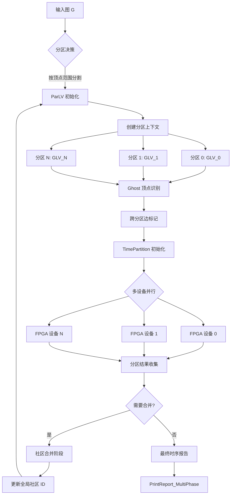
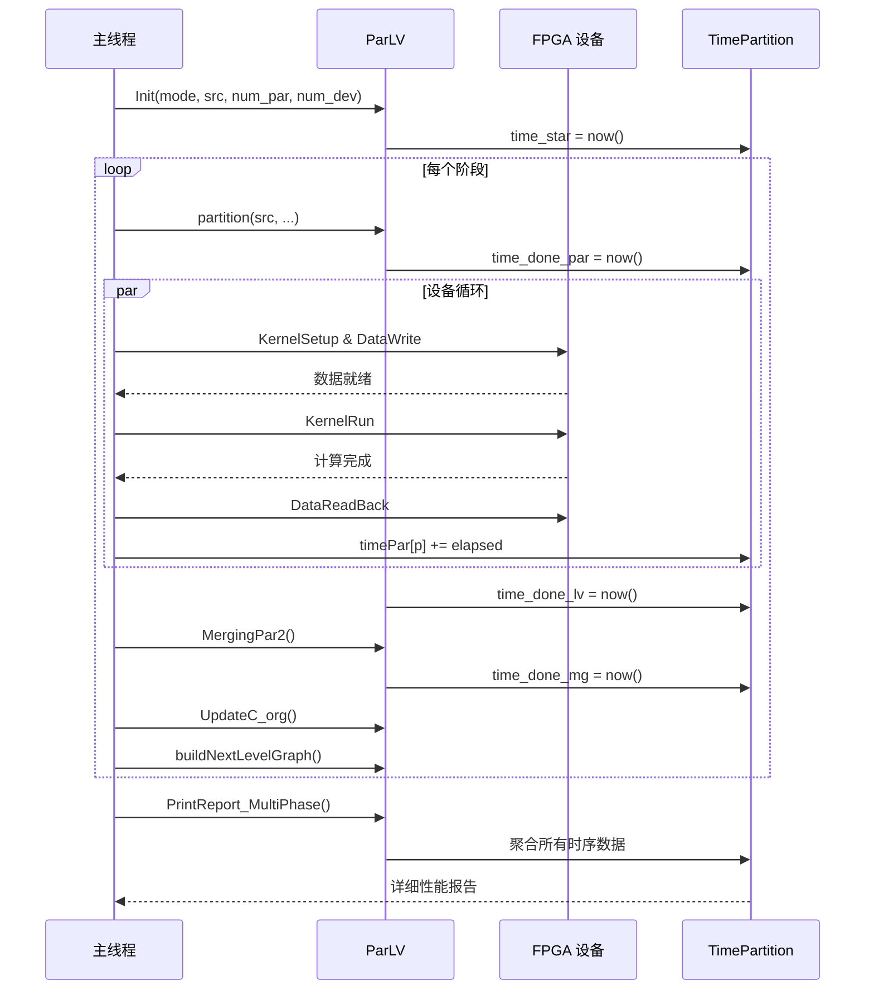
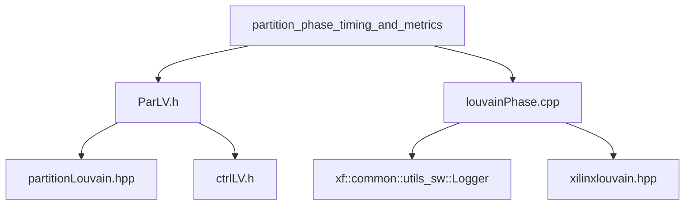

# 分区阶段时序与指标模块 (Partition Phase Timing and Metrics)

## 一句话概括

本模块是 **Louvain 社区检测算法的分布式 FPGA 加速 orchestrator（编排器）** —— 它将超大规模图数据分割成可放入 FPGA 片上内存的碎片，调度多设备并行计算，并以前所未有的粒度采集性能指标，回答"时间究竟花在哪里"这一关键问题。

---

## 为什么需要这个模块？

### 问题空间：当图大到放不进一块 FPGA

Louvain 算法是社区检测的黄金标准，但面对十亿级边的大型图时，单个 FPGA 的片上内存（通常只有几十 MB）显得捉襟见肘。这时我们面临选择：

| 方案 | 优点 | 缺点 |
|------|------|------|
| **纯 CPU 实现** | 内存几乎无限，实现简单 | 速度慢，无法利用 FPGA 并行性 |
| **CPU+FPGA 异构** | 平衡灵活性与性能 | 数据搬运开销大，需要精细调度 |
| **多 FPGA 分布式** | 线性扩展，处理超大规模图 | 分区复杂，需要处理跨分区边（Ghost Vertices） |

本模块实现了 **第三种方案的多设备调度与性能剖析层** —— 它不是为了替代底层的 Louvain 计算核，而是让多个 FPGA 设备能够协同工作，并提供显微镜级别的性能数据。

### 非显而易见的挑战

1. **分区边界处的社区归属问题**：当一条边连接的两个顶点位于不同 FPGA 分区时，如何确保它们被正确识别为同一社区？这需要"Ghost Vertices"（幽灵顶点）机制。

2. **FPGA 内存限制的硬性约束**：FPGA 片上内存是固定的，超过即无法运行，不像 CPU 可以使用 swap。分区必须严格遵守容量限制。

3. **时序测量的精度与开销**：使用 `omp_get_wtime()` 可以获得微秒级精度，但频繁调用本身会带来开销。如何在"观测到真实性能"与"引入额外开销"之间取得平衡？

4. **多设备间的负载均衡**：不同分区的图密度可能差异巨大，如何确保多个 FPGA 不会"一闲一忙"？

---

## 核心概念与心智模型

把本模块想象成 **"分布式编译系统的 build orchestrator"**：

| 类比对象 | 编译系统 | 本模块 (Louvain Partitioning) |
|---------|---------|------------------------------|
| **输入** | 源代码文件 | 完整图数据 |
| **分割策略** | 按目录/模块分割 | 按顶点范围分割（考虑负载均衡） |
| **分布式节点** | 编译服务器集群 | FPGA 设备集群 |
| **依赖处理** | 头文件依赖 | Ghost Vertices（跨分区边） |
| **成果合并** | 链接阶段 | 合并各分区社区结果 |
| **性能分析** | 编译时间分解 (-ftime-trace) | `TimePartition` 多维时序采集 |

### 三大核心抽象

#### 1. **ParLV —— 分区执行上下文 (Partitioned Louvain Context)**

想象一个 **"分布式任务管理器"**，它持有：
- **状态机标志** (`st_Partitioned`, `st_ParLved`, `st_Merged` 等) —— 追踪当前执行到哪个阶段
- **分区数组** (`par_src[MAX_PARTITION]`, `par_lved[MAX_PARTITION]`) —— 指向各分区的 GLV (Graph Louvain View)
- **Ghost 顶点映射** (`m_v_gh`, `NV_gh`, `NVl`) —— 管理跨分区边的端点
- **时序收集器** (`timesPar`) —— 详细的性能指标

**关键洞察**：`ParLV` 不直接执行计算，它是 **"资源编排者"** —— 它知道哪些分区在哪些设备上运行，何时收集结果，何时进入下一阶段。

#### 2. **TimePartition —— 多维时序采集结构**

想象一个 **"高性能分析器的采样缓冲区"**，但它是在代码中显式维护的：

```cpp
struct TimePartition {
    double time_star;      // 整个流程开始
    double time_done_par;  // 分区完成
    double time_done_lv;   // Louvain 计算完成
    double time_done_pre;  // 预处理完成
    double time_done_mg;   // 合并完成
    double time_done_fnl;  // 最终处理完成
    
    // 细粒度数组：每个分区/设备的时间
    double timePar[MAX_PARTITION];     // 每个分区的处理时间
    double timeLv[MAX_PARTITION];      // 每个分区的 Louvain 时间
    double timeLv_dev[MAX_DEVICE];     // 每个设备的时间
    
    // 汇总统计
    double timeAll;  // 总时间
};
```

**关键洞察**：这不是简单的 "开始-结束" 计时，而是 **"多维分层采样"** —— 你可以看到：
- 哪个分区是瓶颈？（`timePar[i]` 对比）
- 哪个设备最忙？（`timeLv_dev[d]` 对比）
- 阶段间的流水线效率？（`time_done_par` vs `time_done_lv`）

#### 3. **Ghost Vertices —— 跨分区一致性机制**

想象 **"跨国公司的远程员工"** —— 他们 physically 位于分公司 A，但为分公司 B 的项目工作。在图分区中：

- **Local Vertices** (`NVl`): 真正属于本分区的顶点，存储完整数据
- **Ghost Vertices** (`NV_gh`): 属于其他分区，但与本分区顶点有边相连的"镜像"顶点
- **逻辑视图** (`NV = NVl + NV_gh`): 分区算法看到的完整视图

**关键洞察**：Ghost vertices 是解决 **"分布式一致性"** 问题的经典方案。当一个顶点可能属于社区 C1（基于其在本分区的邻居）同时也可能属于 C2（基于其在另一分区的邻居）时，Ghost 机制允许算法看到跨分区的边信息，从而做出全局一致的社区分配。

---

## 架构与数据流

### 高层架构图



### 详细数据流：单次迭代

让我们追踪一个分区的完整生命周期：

#### Phase 1: 初始化与分区

```cpp
// 1. 创建分区上下文
ParLV parlv;
parlv.Init(mode, glv_src, num_partitions, num_devices);

// 2. 执行分区算法
parlv.partition(glv_src, id_glv, num, th_size, th_maxGhost);
//    - 按顶点 ID 范围分割
//    - 识别跨分区边
//    - 创建 Ghost 顶点映射 m_v_gh

// 3. 记录时序
parlv.timesPar.time_star = omp_get_wtime();
```

**关键数据结构变化**：
- `glv_src` (原始大图) → `par_src[MAX_PARTITION]` (分区视图)
- `NV` (总顶点数) 分解为 `NVl` (本地) + `NV_gh` (幽灵)

#### Phase 2: 多设备并行执行

```cpp
// 并行启动多线程，每个线程控制一个 FPGA 设备
#pragma omp parallel for
for (int dev = 0; dev < num_devices; dev++) {
    for (int p = dev; p < num_partitions; p += num_devices) {
        // 1. 设置 FPGA 内核参数
        PhaseLoop_UsingFPGA_1_KernelSetup(...);
        
        // 2. 数据传输 H2D (Host to Device)
        PhaseLoop_UsingFPGA_2_DataWriteTo(...);
        
        // 3. 启动 FPGA 计算
        PhaseLoop_UsingFPGA_3_KernelRun(...);
        
        // 4. 结果传回 D2H (Device to Host)
        PhaseLoop_UsingFPGA_4_DataReadBack(...);
        
        // 5. 同步等待完成
        PhaseLoop_UsingFPGA_5_KernelFinish(...);
        
        // 6. 记录本分区时序
        parlv.timesPar.timePar[p] = ...;
    }
    // 记录本设备时序
    parlv.timesPar.timeLv_dev[dev] = ...;
}
```

**数据流细节**：
- **H2D 传输**：`offsets`, `indices`, `weights`, `colors`, `config` 等缓冲区
- **D2H 传输**：`cidPrev` (社区 ID 结果), `config0/1` (迭代次数和模块度)
- **同步点**：`q.finish()` 确保所有设备完成当前阶段

#### Phase 3: 结果合并与下一阶段准备

```cpp
// 1. 合并各分区结果
parlv.MergingPar2(numClusters);
//    - 处理 Ghost 顶点的社区归属冲突
//    - 重新编号社区 ID 保证连续性

// 2. 更新原始图的社区映射
PhaseLoop_UpdatingC_org(phase, NV_orig, NV_iter, C_iter, C_orig);
//    - 将本次迭代发现的社区映射回原始图顶点

// 3. 构建下一阶段的粗化图
buildNextLevelGraphOpt(G_curr, G_next, C_curr, numClusters, numThreads);
//    - 将每个社区压缩为单个顶点
//    - 统计社区间的边权重

// 4. 记录阶段完成时序
parlv.timesPar.time_done_mg = omp_get_wtime();

// 5. 检查收敛条件
if ((currMod - prevMod) <= opts_threshold || phase > MAX_NUM_PHASE) {
    isItrStop = true;
}
```

**数据结构转换**：
- `par_lved[p]->C` (各分区的社区 ID) → `C_orig` (原始图的全局社区映射)
- `G_curr` (当前阶段图) → `G_next` (下一阶段粗化图，顶点数 = 当前社区数)

### 时序采集数据流



---

## 关键设计决策与权衡

### 1. 分区策略：范围分区 vs 图划分

**选择**：基于顶点 ID 范围的连续分区（而非 METIS 等图划分算法）

**权衡分析**：
- **优势**：
  - 实现简单，O(1) 即可确定顶点所属分区
  - 易于保证各分区的顶点数均衡
  - Ghost 顶点识别简单（检查边端点是否在同一范围）
- **代价**：
  - 可能产生大量跨分区边（若图具有幂律分布，热点顶点的边会跨越多个分区）
  - 不感知图的拓扑结构，可能导致某些分区的边数远多于其他分区

**非显而易见之处**：代码通过 `th_maxGhost` 参数限制 Ghost 顶点数量，当跨分区边过多时，会触发重新分区或拒绝分区，这是一种"防御性编程"策略。

### 2. Ghost Vertices：内存开销 vs 计算一致性

**选择**：显式维护 Ghost 顶点映射（`m_v_gh` map 和 `NV_gh` 计数）

**权衡分析**：
- **优势**：
  - 保证社区检测的全局一致性：Ghost 顶点使得每个分区都能看到完整的邻居信息
  - 支持跨分区社区的合并（通过 `MergingPar2_ll` 和 `MergingPar2_gh`）
- **代价**：
  - 内存开销：Ghost 顶点需要复制存储（虽然通常只存 ID 和少量元数据）
  - 同步复杂度：需要维护 Ghost 顶点与原始顶点的映射一致性
  - 额外的合并阶段：需要专门处理 Ghost 顶点的社区归属冲突

**关键实现细节**：代码通过 `FindGhostInLocalC` 和 `FindParIdx` 等函数维护 Ghost 映射，并在 `MergingPar2` 阶段通过两阶段合并（local-to-local 和 ghost-to-global）解决冲突。

### 3. 时序采集：粗粒度 vs 细粒度

**选择**：多维度分层计时（`TimePartition` 结构中的 20+ 个时间字段）

**权衡分析**：
- **优势**：
  - 精确定位性能瓶颈：可以区分是数据传输慢、计算慢还是合并慢
  - 支持多设备对比：可以识别哪个 FPGA 设备是瓶颈
  - 支持调优决策：基于数据决定是增加分区数还是更换 FPGA 设备
- **代价**：
  - 代码侵入性：需要在关键路径插入大量 `omp_get_wtime()` 调用
  - 测量开销：频繁的系统调用会引入微秒级的误差
  - 数据量膨胀：对于长周期运行的算法，会产生大量的时间戳数据

**非显而易见之处**：代码在 `PrintReport_MultiPhase` 和 `PrintReport_MultiPhase_2` 中实现了两级报告机制 —— 第一级给用户提供汇总视图，第二级给开发者提供细粒度分解，这是一种"渐进式披露"的设计。

### 4. 内存管理：RAII vs 手动管理

**选择**：混合策略 —— 核心结构使用手动管理，临时缓冲区使用 RAII

**权衡分析**：
- **ParLV 类**：使用手动 `new`/`delete`（通过 `Init` 和析构函数），因为需要在运行时根据分区数动态分配数组（如 `par_src[MAX_PARTITION]`）
- **FPGA 缓冲区**：使用 `cl::Buffer` 和 OpenCL 的引用计数机制，利用 RAII 避免内存泄漏
- **时序数据**：`TimePartition` 作为值类型嵌入 `ParLV`，利用编译器生成的析构函数

**关键风险点**：
- `par_src` 和 `par_lved` 是指针数组，每个元素指向的 `GLV` 对象由谁拥有？（答案是：ParLV 拥有，需要在析构时 `delete` 或调用 `CleanTmpGlv`）
- Ghost 顶点映射 `m_v_gh` 是 `std::map`，它的内存管理是自动的，但与 C 风格数组 `p_v_new` 的交互需要小心

### 5. 错误处理：静默继续 vs 快速失败

**选择**：快速失败（`assert` + 错误打印）策略

**代码证据**：
```cpp
assert(NV_orig < MAXNV);
assert(NE_orig < MAXNE);
// ...
if (id_dev >= d_num) {
    printf("\033[1;31;40mERROR\033[0m: id_dev(%d) >= d_num(%d)\n", id_dev, d_num);
    return;
}
```

**权衡分析**：
- **优势**：在 FPGA 开发环境中，硬件错误通常是不可恢复的（如内存越界会直接导致内核崩溃），快速失败可以立即暴露问题
- **代价**：生产环境中的健壮性不足，没有重试机制或优雅降级

**非显而易见之处**：代码中混合使用了 `assert`（编译时可通过 `NDEBUG` 关闭）和运行时检查，这是一种"防御性编程"策略 —— 在开发和测试阶段捕获所有错误，在发布阶段关闭高开销的检查。

---

## 代码剖析：关键路径详解

### ParLV 类生命周期

```cpp
// 1. 构造与初始化
ParLV parlv;  // 默认构造，状态为 "未初始化"

// 2. 参数化初始化
parlv.Init(mode_flow, glv_src, num_par, num_dev, isPrun, th_prun);
// 内部状态转换：
// - 分配 par_src[MAX_PARTITION] 数组
// - 设置状态标志 st_Partitioned = false 等
// - 初始化 timesPar 结构（清零所有时间字段）

// 3. 执行分区
parlv.partition(glv_src, id_glv, num, th_size, th_maxGhost);
// 内部操作：
// - 调用 par_general() 创建各分区 GLV
// - 识别 Ghost 顶点，填充 m_v_gh 映射
// - 记录时间：timesPar.time_done_par = now()
// - 设置 st_Partitioned = true

// 4. 多阶段 Louvain 执行循环
while (!isItrStop) {
    // 4a. 在各 FPGA 上执行 Louvain（通过 runLouvainWithFPGA_demo_par_core）
    for each partition p on device d:
        parlv.timesPar.timeLv[p] = elapsed_time;
    parlv.timesPar.time_done_lv = now();
    
    // 4b. 合并结果
    parlv.MergingPar2(numClusters);
    // - 处理 Ghost 顶点的社区归属
    // - 重新编号社区 ID
    parlv.timesPar.time_done_mg = now();
    
    // 4c. 构建下一阶段图
    PhaseLoop_UpdatingC_org(...);  // 更新原始图社区映射
    buildNextLevelGraphOpt(...);   // 构建粗化图
    
    // 4d. 检查收敛
    if (converged) isItrStop = true;
}

// 5. 输出时序报告
parlv.PrintTime();  // 或 PrintTime2()
// 内部操作：
// - 聚合 timesPar 中的所有时间字段
// - 计算统计量（总时间、平均值、最大值）
// - 打印格式化报告

// 6. 清理资源
parlv.~ParLV();  // 析构
// - 删除所有 par_src[i] 和 par_lved[i] 指向的 GLV 对象
// - 释放 elist, M_v 等缓冲区
// - 清理 m_v_gh 等映射
```

### 时序采集的关键路径

```cpp
// 在 louvainPhase.cpp 中，时序采集贯穿整个执行流程

// 1. 最外层计时：整个流程
void runLouvainWithFPGA_demo_par_core(...) {
    double timePrePre = omp_get_wtime();
    // ... 初始化代码 ...
    timePrePre = omp_get_wtime() - timePrePre;
    
    double totTimeAll = omp_get_wtime();
    // ... 主循环 ...
    totTimeAll = omp_get_wtime() - totTimeAll;
}

// 2. 阶段级计时：每个 Louvain 阶段
while (!isItrStop) {
    eachTimePhase[phase - 1] = omp_get_wtime();
    
    // 2a. FPGA 计算阶段
    eachTimeE2E_2[phase - 1] = omp_get_wtime();
    ConsumingOnePhase(pglv_iter, ..., eachItrs[phase - 1], ...);
    eachTimeE2E_2[phase - 1] = omp_get_wtime() - eachTimeE2E_2[phase - 1];
    
    // 2b. 后处理阶段
    eachTimeReGraph[phase - 1] = PhaseLoop_CommPostProcessing(...);
    
    eachTimePhase[phase - 1] = omp_get_wtime() - eachTimePhase[phase - 1];
}

// 3. FPGA 内核级计时（通过 OpenCL Profiling）
void PhaseLoop_UsingFPGA_Post(...) {
    unsigned long timeStart, timeEnd;
    kernel_evt1[0][0].getProfilingInfo(CL_PROFILING_COMMAND_START, &timeStart);
    kernel_evt1[0][0].getProfilingInfo(CL_PROFILING_COMMAND_END, &timeEnd);
    unsigned long exec_time0 = (timeEnd - timeStart) / 1000.0;  // 微秒级精度
}

// 4. 细粒度分解计时（在 PrintReport_MultiPhase_2 中展示）
void PrintReport_MultiPhase_2(...) {
    // 展示：InitBuff + ReadBuff + ReGraph + Feature 的分解
    printf("Total time for Init buff_host  : %lf = ...", totTimeInitBuff);
    printf("Total time for Read buff_host  : %lf = ...", totTimeReadBuff);
    // ...
}
```

**时序数据的层次结构**：

```
Level 0: 全流程时间 (totTimeAll)
    └── Level 1: 阶段时间 (eachTimePhase[phase])
            ├── Level 2a: FPGA 执行 (eachTimeE2E_2[phase])
            │       ├── Level 3: 内核执行 (exec_time0 from OpenCL profiling)
            │       ├── Level 3: 数据 H2D (InitBuff)
            │       └── Level 3: 数据 D2H (ReadBuff)
            ├── Level 2b: 图重建 (eachTimeReGraph[phase])
            │       ├── Level 3: 社区重编号 (renumberClustersContiguously)
            │       ├── Level 3: 社区映射更新 (UpdatingC_org)
            │       └── Level 3: 粗化图构建 (buildNextLevelGraphOpt)
            └── Level 2c: 特征提取 (eachTimeFeature[phase])
```

---

## 关键陷阱与避坑指南

### 1. 内存所有权陷阱

**陷阱**：`ParLV` 持有 `GLV*` 指针数组，但这些指针指向的对象生命周期由谁管理？

```cpp
// 危险代码示例
ParLV parlv;
parlv.Init(mode, glv_src, num_par, num_dev);
parlv.partition(glv_src, ...);  // 内部分配 par_src[i] = new GLV(...)

// ... 执行计算 ...

// 忘记调用清理，直接析构
goto error_exit;  // 早期退出路径

// 正确的清理方式
parlv.CleanTmpGlv();  // 或者依赖 ~ParLV()，但要确保路径正确
```

**避坑建议**：
- 始终使用 **RAII 包装** 或确保在每条退出路径都调用清理
- `ParLV` 的析构函数会调用 `CleanTmpGlv()`，但要确保对象正常析构（不被提前 `free`）
- 使用智能指针（如果项目允许 C++11）或自定义 ScopeGuard

### 2. Ghost 顶点映射失效

**陷阱**：`m_v_gh` 是 `std::map<long, long>`，但如果在分区后修改了原始图的顶点 ID，映射会无声失效。

```cpp
// 危险操作
parlv.partition(glv_src, ...);  // 建立 m_v_gh 映射

// 某处代码意外修改了顶点 ID
renumberVertices(glv_src);  // 顶点 ID 改变，但 m_v_gh 未更新

// 后续使用 Ghost 顶点时，映射指向错误的顶点
long ghost_comm = parlv.FindGhostInLocalC(m_v_gh[old_id]);  // 错误！
```

**避坑建议**：
- 将 `GLV` 和 `ParLV` 设计为 **不可变视图**（Immutable Views）
- 在分区后冻结图结构，任何修改都抛出异常或返回新的对象
- 使用版本号机制：`GLV` 包含 `structure_version`，`ParLV` 记录创建时的版本，不匹配时报错

### 3. 时序测量污染

**陷阱**：`omp_get_wtime()` 本身是低开销的，但在高频调用场景下，测量代码本身成为瓶颈。

```cpp
// 过度测量导致性能失真
for (int iter = 0; iter < num_iterations; iter++) {
    double t1 = omp_get_wtime();  // 每次迭代都计时
    
    // 实际计算工作（可能只有几微秒）
    computeKernel(...);
    
    double t2 = omp_get_wtime();
    times[iter] = t2 - t1;  // 存储时间（缓存污染）
    
    // 累积统计（分支预测失败风险）
    total_time += times[iter];
}
// 结果：测量开销占总时间的 20%+，数据失真
```

**避坑建议**：
- **采样而非普查**：每 N 次迭代测量一次，或使用硬件 PMU（Performance Monitoring Unit）计数器
- **批量后处理**：先记录原始时间戳到环形缓冲区，计算完成后再统一处理
- **条件编译**：在 Release 模式下通过宏完全移除测量代码

```cpp
#ifdef ENABLE_PROFILING
    #define PROFILE_START(name) double _t_##name = omp_get_wtime();
    #define PROFILE_END(name) times.name += omp_get_wtime() - _t_##name;
#else
    #define PROFILE_START(name)
    #define PROFILE_END(name)
#endif
```

### 4. FPGA 缓冲区容量溢出

**陷阱**：FPGA 的片上内存是固定的，如果分区后的边数超过 `MAXNV` 宏定义，会导致缓冲区溢出。

```cpp
// 危险：假设 MAXNV 足够大
long NE_mem = NE_max * 2;
long NE_mem_1 = NE_mem < (MAXNV) ? NE_mem : (MAXNV);  // 截断！
long NE_mem_2 = NE_mem - NE_mem_1;  // 如果 NE_mem > MAXNV，这部分不为零

// 分配缓冲区
buff_host.indices = aligned_alloc<int>(NE_mem_1);
buff_host.indices2 = aligned_alloc<int>(NE_mem_2);  // 可能为 0 或很大

// 填充数据时，如果实际边数超过 NE_mem_1 + NE_mem_2，数组越界
for (int j = adj1; j < adj2; j++) {
    if (cnt_e < NE1) {
        buff_host.indices[j] = ...;  // 安全
    } else {
        buff_host.indices2[j - NE1] = ...;  // 如果 j - NE1 >= NE_mem_2，越界！
    }
    cnt_e++;
}
```

**避坑建议**：
- **前置检查**：在分区后立即验证各分区的边数，超过阈值时触发重新分区（使用更细粒度的分区策略）
- **动态扩容检测**：在 `UsingFPGA_MapHostClBuff` 中检查 `NE_mem` 与 `MAXNV` 的关系，预留足够的安全边界
- **优雅降级**：当单个分区过大时，自动将该分区拆分为子分区串行处理（而非并行），保证正确性优先于性能

```cpp
// 改进的容量检查
if (NE_mem > MAXNV * MAX_PARTITION_RATIO) {
    fprintf(stderr, "ERROR: Partition %d has %ld edges, exceeding capacity %ld\n", 
            p, NE_mem, (long)(MAXNV * MAX_PARTITION_RATIO));
    // 选项 1：尝试重新分区（更细的粒度）
    // 选项 2：标记为需要串行处理
    // 选项 3：直接 abort
    abort();
}
```

### 5. 多线程并发数据竞争

**陷阱**：OpenMP 并行循环中访问共享的 `ParLV` 成员，可能导致数据竞争。

```cpp
// 危险：多线程同时更新 ParLV 的共享成员
ParLV parlv;
#pragma omp parallel for
for (int p = 0; p < num_par; p++) {
    int dev = p % num_dev;
    
    // 数据竞争：多个线程同时读写 timesPar.timePar[p]
    // 虽然索引不同，但 timePar 数组是共享的
    double t1 = omp_get_wtime();
    
    // 执行 FPGA 计算...
    runFPGA(...);
    
    parlv.timesPar.timePar[p] = omp_get_wtime() - t1;  // 安全：每个 p 唯一
    
    // 危险：多个线程同时累加 timePar_all
    parlv.timesPar.timePar_all += parlv.timesPar.timePar[p];  // 数据竞争！
}
```

**避坑建议**：
- **私有化累加**：使用 OpenMP 的 `reduction` 子句或手动私有化
- **原子操作**：对共享累加变量使用 `#pragma omp atomic`
- **事后归约**：先收集到线程本地数组，循环结束后再串行归约

```cpp
// 改进方案 1：OpenMP reduction
#pragma omp parallel for reduction(+:total_time)
for (int p = 0; p < num_par; p++) {
    // ... 计算 ...
    parlv.timesPar.timePar[p] = local_time;
    total_time += local_time;  // reduction 保证线程安全
}
parlv.timesPar.timePar_all = total_time;

// 改进方案 2：手动私有化
double local_times[MAX_PARTITION] = {0};
#pragma omp parallel for
for (int p = 0; p < num_par; p++) {
    // ... 计算 ...
    local_times[p] = local_time;
}
// 串行归约
for (int p = 0; p < num_par; p++) {
    parlv.timesPar.timePar[p] = local_times[p];
    parlv.timesPar.timePar_all += local_times[p];
}
```

---

## 子模块导航

本模块的核心功能分布在以下文件中：

| 文件 | 职责 | 核心类/函数 | 详细文档 |
|------|------|-------------|----------|
| `ParLV.h` | 分区数据结构与编排逻辑 | `ParLV` 类, `TimePartition` 结构, `partition()`, `MergingPar2()` | [ParLV 编排器详解](graph_analytics_and_partitioning-community_detection_louvain_partitioning-partition_phase_timing_and_metrics-parlv_orchestration.md) |
| `louvainPhase.cpp` | 阶段执行与时序采集 | `PrintReport_MultiPhase()`, `PhaseLoop_CommPostProcessing()`, `runLouvainWithFPGA_demo_par_core()` | [阶段执行与时序详解](graph_analytics_and_partitioning-community_detection_louvain_partitioning-partition_phase_timing_and_metrics-phase_timing_execution.md) |

### 依赖关系



### 相关模块

- **上游数据流**：`partition_graph_state_structures` —— 提供 GLV (Graph Louvain View) 数据结构
- **下游控制流**：`louvain_modularity_execution_and_orchestration` —— 调用本模块执行实际计算
- **同级支撑**：`fpga_kernel_connectivity_profiles` —— 提供 FPGA 内核与主机通信的配置参数

---

## 总结：给新加入开发者的建议

### 如何开始阅读代码

1. **从高层函数入手**：先阅读 `runLouvainWithFPGA_demo_par_core()` 的框架，理解主循环结构
2. **理解数据流**：追踪一个分区从创建 (`parlv.partition`) 到销毁 (`~ParLV`) 的完整生命周期
3. **关注状态转换**：`ParLV` 的布尔标志（`st_Partitioned`, `st_ParLved` 等）构成了状态机，理解这些状态何时转换

### 如何调试问题

1. **启用详细时序**：调用 `PrintTime2()` 而非 `PrintTime()` 获取第二级详细分解
2. **检查分区质量**：验证 `NVl` 和 `NV_gh` 的比例，若 Ghost 顶点过多 (>50%)，考虑调整分区策略
3. **验证内存边界**：在 `UsingFPGA_MapHostClBuff` 前后打印 `NE_mem` 和 `MAXNV`，确保不会溢出

### 如何扩展功能

1. **添加新的时序指标**：在 `TimePartition` 结构中添加字段，在关键路径插入计时代码，最后更新 `PrintReport_MultiPhase_2`
2. **支持新的分区策略**：继承/修改 `ParLV::partition` 方法，实现 METIS 或其他图划分算法
3. **集成新的 FPGA 内核**：修改 `PhaseLoop_UsingFPGA_1_KernelSetup`，适配新的内核参数接口

### 最重要的一个建议

**永远不要在没有 Ghost 顶点映射的情况下修改分区逻辑**。Ghost 顶点机制是分布式一致性的核心，任何对 `NVl`、`NV_gh` 或 `m_v_gh` 的修改都必须与 `FindGhostInLocalC` 和 `MergingPar2_gh` 保持一致，否则会导致社区检测结果不正确且极难调试。

---

*文档版本: 1.0*
*最后更新: 2024*
*维护者: Graph Analytics Team*
