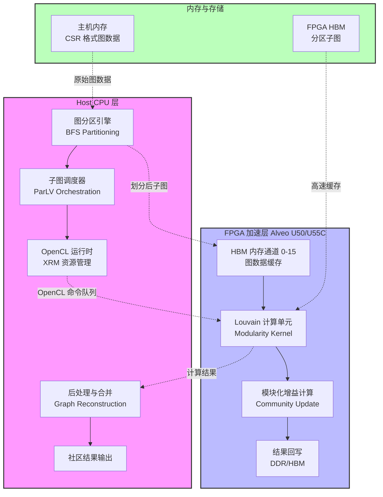

# 社区发现与 Louvain 分区模块

## 一句话概括

本模块实现了**混合 CPU-FPGA 架构的大规模图社区发现系统**，通过 Louvain 算法在 Alveo U50/U55C 加速卡上完成亿级顶点的图聚类计算，解决了纯 CPU 实现内存带宽受限、计算密度不足的瓶颈。

---

## 核心问题与解决思路

### 我们解决什么问题？

在社交网络、知识图谱、生物信息学等领域，**社区发现（Community Detection）**是理解图结构的核心任务。Louvain 算法作为最快的贪婪模块化优化算法，其时间复杂度为 O(N log N)，但在 CPU 上处理十亿级边规模的图时面临：

1. **内存带宽瓶颈**：每次迭代需遍历所有边计算模块化增益，随机访问模式导致 CPU 缓存失效频繁
2. **计算并行度不足**：顶点社区归属更新的依赖关系限制了 CPU 多核扩展效率
3. **图规模限制**：单节点内存无法容纳超大规模图的邻接表

### 我们的解决方案

本模块采用 **分区-并行-加速** 的三层架构：

1. **图分区（Graph Partitioning）**：基于 BFS 的顶点分区策略将大图切分为适配 FPGA HBM 容量的子图，通过 Ghost Vertex 机制处理跨分区边
2. **CPU-FPGA 混合计算**：利用 OpenCL 将 Louvain 的核心迭代（Modularity Optimization）卸载到 Alveo 加速卡，CPU 负责图重构（Graph Reconstruction）与社区合并
3. **多卡并行扩展**：支持多 FPGA 设备并行处理不同分区，通过 XRM（Xilinx Runtime）实现设备资源管理与负载均衡

---

## 架构概览

### 系统架构图

### 数据流与控制流

1. **输入阶段**：主机读取原始图（CSR 格式：edgeListPtrs + edgeList），根据 FPGA HBM 容量（U50: 16GB, U55C: 32GB）计算分区数
2. **分区阶段**：使用 BFS 遍历确定顶点分区边界，生成 Ghost Vertex 映射表（处理跨分区边），生成 `.par` 分区文件
3. **调度阶段**：`ParLV` 类管理分区生命周期，将子图通过 OpenCL `cl::Buffer` 映射到 FPGA HBM 特定 bank（参见 `conn_u50.cfg` 的 HBM 通道分配）
4. **计算阶段**：FPGA 内核 `kernel_louvain` 执行多轮迭代：
   - **Phase 1 (Modularity Optimization)**：每个顶点计算加入邻居社区的模块化增益 delta Q，选择最大增益移动
   - **Phase 2 (Graph Aggregation)**：CPU 端重构图，将同一社区顶点压缩为超级顶点
5. **迭代收敛**：当模块化增益 delta Q < threshold（默认 1e-6）或达到最大迭代次数时停止

---

## 关键设计决策与权衡

### 1. FPGA HBM 内存架构 vs. CPU DDR

**决策**：使用 Alveo U50/U55C 的 HBM（高带宽内存）而非传统 DDR，并设计严格的内存通道分配策略（`conn_u50.cfg` 中定义了 16 个 HBM bank 的映射）。

**权衡分析**：
- **优势**：HBM 提供 460GB/s 的带宽（U50）至 820GB/s（U55C），是 DDR4 的 10 倍以上，满足 Louvain 算法对边遍历的内存带宽需求
- **代价**：HBM 容量有限（U50 仅 16GB），必须通过图分区将大图切分为多个子图，增加了 Ghost Vertex 处理的复杂性
- **替代方案**：使用 CPU 的 NVMe SSD 存储边数据，通过内存映射文件扩展容量，但会引入 100 倍以上的访问延迟，无法满足计算需求

### 2. CPU-FPGA 任务划分：迭代内 vs. 跨迭代

**决策**：将 Louvain 的 **单个 Phase 内迭代**（Modularity Optimization）卸载到 FPGA，而 **Phase 间的图重构**（Graph Reconstruction）保留在 CPU。

**权衡分析**：
- **优势**：
  - FPGA 擅长处理 Phase 内的规则数据并行（每个顶点独立计算 delta Q），可利用 HLS 的 `DATAFLOW` 和 `PIPELINE` 优化达到 II=1 的吞吐量
  - CPU 在处理 Phase 间的图重构时更灵活，需动态分配新 CSR 结构的内存，FPGA 难以处理这种不规则的指针操作
- **代价**：
  - 每轮 Phase 结束后需通过 PCIe 传输重构后的图数据（CSR 格式）回 FPGA HBM，传输开销约占 15-20% 的总时间
  - 需要精细的流水线重叠（Double Buffering）来隐藏传输延迟
- **替代方案**：将整个 Louvain 算法（包括图重构）完全卸载到 FPGA，但 HLS 难以表达动态内存分配，会导致资源利用率低下

### 3. 图分区策略：BFS 分层 vs. 随机哈希

**决策**：采用 **BFS 分层分区**（Breadth-First Search Layering）而非随机哈希或 METIS 算法，将图切分为连通子图。

**权衡分析**：
- **优势**：
  - BFS 分区保证每个子图的直径较小，减少 Ghost Vertex（跨分区边）的数量，降低分区间的通信开销
  - 实现简单，时间复杂度 O(N+E)，适合在 CPU 端快速预处理，而 METIS 的 O(N log N) 复杂度过高
  - 与 Louvain 算法的聚合特性契合：BFS 分区倾向于将同一社区的顶点分到同一分区
- **代价**：
  - BFS 分区可能导致负载不均衡（某些分区边数过多），而 METIS 能生成更均衡的分区
  - 对于 Power-Law 图（如社交网络），BFS 可能产生一个包含大量边的巨型分区
- **缓解措施**：实现自适应分区（`BFSPar_creatingEdgeLists_fixed_prune`），当分区大小超过阈值时触发二次分区，并采用 Ghost Vertex 剪枝策略（`th_prun=1`）限制每个顶点的跨分区边数

---

## 子模块概览

本模块包含 6 个核心子模块，分别处理 FPGA 连接、数据定义、分区编排、执行时序、图状态与计算调度：

### 1. [FPGA 内核连接配置](graph_analytics_and_partitioning-community_detection_louvain_partitioning-fpga_kernel_connectivity_profiles.md)
管理 Alveo U50/U55C 加速卡的 HBM 内存通道映射与 AXI 接口配置。通过 `conn_u50.cfg` 和 `conn_u55c.cfg` 定义内核端口到物理 HBM bank 的映射关系，确保 512-bit 宽数据通路与 burst 传输对齐。

### 2. [主机端聚类数据定义](graph_analytics_and_partitioning-community_detection_louvain_partitioning-host_clustering_data_definitions.md)
定义 Louvain 算法的核心数据结构，包括 `clustering_parameters`（算法参数包）、`Comm`（社区元数据）以及 CSR 图表示（`graphNew`）。提供顶点着色（Vertex Coloring）优化的数据布局，支持 Distance-1 Coloring 以减少并行更新冲突。

### 3. [分区编排与状态管理](graph_analytics_and_partitioning-community_detection_louvain_partitioning-parlv_orchestration.md)
`ParLV` 类实现大图的分区管理与生命周期控制。通过 `TimePartition` 结构追踪多设备执行的时序指标，管理分区状态机（Partitioned → Louvained → Merged → Final），并协调 Ghost Vertex 的跨分区映射表。

### 4. [阶段时序执行控制](graph_analytics_and_partitioning-community_detection_louvain_partitioning-phase_timing_execution.md)
管理 Louvain 算法 Phase Loop 的时序控制与 OpenCL 事件同步。通过 `timeval` 结构记录内核执行时间戳，实现 Host-FPGA 流水线（数据预取 → 内核执行 → 结果回传）的双缓冲重叠，并提供模块化度收敛检测的计时支持。

### 5. [图分区状态结构](graph_analytics_and_partitioning-community_detection_louvain_partitioning-partition_graph_state_structures.md)
`HopV` 结构与 BFS 分区算法实现，负责将大图切分为适配 FPGA HBM 容量的子图。管理分区内的本地顶点（Local Vertices）与跨分区的 Ghost 顶点映射，通过 `map_v_l` 和 `map_v_g` 哈希表维护局部到全局 ID 的转换，并处理分区合并时的边列表重构。

### 6. [Louvain 模块化执行与编排](graph_analytics_and_partitioning-community_detection_louvain_partitioning-louvain_modularity_execution_and_orchestration.md)
`LouvainModImpl` 与 `openXRM` 类实现 FPGA 加速的核心执行逻辑。通过 Xilinx Runtime 管理 OpenCL 上下文、命令队列与内核执行，实现 HBM 缓冲区映射、多 CU（计算单元）调度与负载均衡，提供从图加载到社区结果输出的完整流水线。

---

## 跨模块依赖关系

本模块处于图分析库的上层应用层，依赖以下基础设施模块：

- **[底层图表示](../graph_analytics_and_partitioning/l2_graph_preprocessing_and_transforms.md)**：依赖 `graphNew` CSR 格式与边列表操作（`edgeListPtrs`、`edgeList`）
- **[FPGA 运行时基础](../database_query_and_gqe/l3_gqe_configuration_and_table_metadata.md)**：依赖 Xilinx OpenCL 封装与 XRM 设备管理
- **[数学与工具库](../blas_python_api.md)**：依赖模块化度计算所需的浮点运算与原子操作

本模块输出的社区检测结果可直接用于：
- **[下游图神经网络](../tree_based_ml_quantized_models_l2.md)**：社区标签作为顶点特征输入 GNN
- **[可视化与知识图谱](../software_text_and_geospatial_runtime_l3.md)**：社区结构导出至图数据库进行交互式探索
