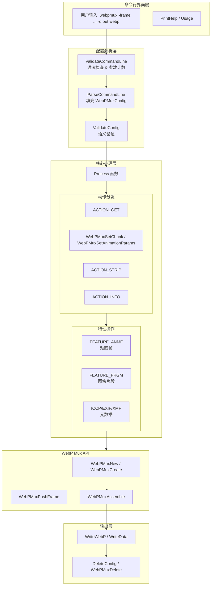

# container_mux_and_feature_selection 技术深度解析

## 架构概览



## 概述：这个模块解决什么问题

**webpmux** 是一个命令行工具，用于操作 WebP 容器文件——你可以把它想象成 WebP 图像的"瑞士军刀"。它解决了图像处理流水线中一个关键但常被忽视的问题：**如何在不重新编码图像数据的前提下，创建动画、嵌入元数据、提取特定帧或片段**。

想象一下，你有几十张静态 WebP 图片，想做成一个动画 GIF 那样的循环播放。最直接的方法是写代码加载每张图，然后用图像处理库把它们拼接起来。但这意味着**重新编码**——损失质量、消耗大量 CPU、产生大文件。webpmux 的思路完全不同：WebP 容器格式本身支持存储多个帧（用于动画）或片段（用于平铺大图像），以及 ICC 色彩配置文件、EXIF 相机信息、XMP 元数据等辅助数据。webpmux 只是操作这些容器的"结构"，而不触碰图像编码数据本身。

**核心设计洞察**：把"容器结构操作"和"图像编解码"分离。前者是轻量级的元数据操作，后者是重量级的信号处理。webpmux 专注于前者，让后者保持原样。

---

## 心智模型：理解代码的抽象层次

理解 webpmux 的关键是掌握三个层次的抽象，就像处理一份多语言档案：

### 1. 命令行界面层（用户交互）

这是最外层。用户输入类似这样的命令：

```bash
webpmux -frame frame1.webp +100+10+10 \
        -frame frame2.webp +100+25+25+1 \
        -loop 10 -bgcolor 128,255,255,255 \
        -o out_animation.webp
```

这里的关键概念是**动作（Action）**和**特性（Feature）**：
- **动作**：你要做什么？`-set`（设置）、`-get`（获取）、`-strip`（剥离）、`-info`（查看信息）、或者隐式的创建动画（通过 `-frame`）
- **特性**：操作的对象是什么？`icc`（ICC 配置文件）、`exif`（EXIF 元数据）、`xmp`（XMP 元数据）、`frame`（动画帧）、`frgm`（图像片段）

### 2. 配置对象层（内部表示）

命令行参数被解析后，转换成内部的 **WebPMuxConfig** 结构。这是整个工具的核心数据结构，就像一张工作单：

```c
typedef struct {
    ActionType action_type_;    // 要执行什么动作？
    const char* input_;         // 输入文件名
    const char* output_;        // 输出文件名
    Feature feature_;           // 操作哪个特性
} WebPMuxConfig;
```

**Feature** 结构则描述了具体操作什么：

```c
typedef struct {
    FeatureType type_;          // ICCP/EXIF/XMP/ANMF/FRGM
    FeatureArg* args_;          // 该特性的参数数组
    int arg_count_;             // 参数数量
} Feature;
```

想象一个动画创建任务：`-frame` 可能被调用多次，每次都是一个 **FeatureArg**，包含文件名（`filename_`）、参数（`params_`，如 `+100+10+10` 表示持续时间和偏移），以及子类型（`subtype_`，标明这是帧数据、循环次数还是背景色）。

### 3. WebP Mux API 层（底层操作）

最底层是 Google libwebp 库提供的 **WebPMux** API。Config 层最终调用这些函数来实际操作 WebP 容器：

- `WebPMuxCreate()` / `WebPMuxNew()`：从现有数据创建或新建一个 mux 对象
- `WebPMuxSetImage()`：设置主图像
- `WebPMuxPushFrame()`：添加动画帧或片段
- `WebPMuxSetAnimationParams()`：设置动画参数（循环、背景色）
- `WebPMuxSetChunk()` / `WebPMuxGetChunk()` / `WebPMuxDeleteChunk()`：操作 ICC/EXIF/XMP 数据块
- `WebPMuxAssemble()`：将所有组件组装成最终的 WebP 文件数据

**关键洞察**：WebPMuxConfig 层是"声明式"的——它描述"想要什么结果"；WebPMux API 层是"命令式"的——它执行"如何达成结果"。中间通过 Process() 函数进行转换。

---

## 数据流全景：从命令行到输出文件

让我们追踪一个典型场景的数据流：创建一个包含两帧的动画 WebP。

### 输入

```bash
webpmux -frame frame1.webp +100+10+10 \
        -frame frame2.webp +100+25+25+1 \
        -loop 10 \
        -o out.webp
```

### 阶段一：命令行解析（InitializeConfig → ValidateCommandLine + ParseCommandLine）

1. **ValidateCommandLine**：进行语法检查
   - 检查冲突选项：不能同时有 `-get` 和 `-set`
   - 计数帧参数：发现 2 个 `-frame`，1 个 `-loop`
   - 推断 `num_feature_args = 3`（2 帧 + 1 个循环参数）

2. **内存分配**：根据 `num_feature_args` 分配 `FeatureArg` 数组（3 个元素）

3. **ParseCommandLine**：填充 Config 结构
   - 遇到 `-frame`：设置 `action_type_ = ACTION_SET`，`feature_.type_ = FEATURE_ANMF`
   - 第一个 `-frame`：填充 `args_[0]`：`filename_ = "frame1.webp"`，`params_ = "+100+10+10"`，`subtype_ = SUBTYPE_ANMF`
   - 第二个 `-frame`：填充 `args_[1]`：类似地填充 frame2 数据
   - 遇到 `-loop`：填充 `args_[2]`：`params_ = "10"`，`subtype_ = SUBTYPE_LOOP`
   - 遇到 `-o`：设置 `output_ = "out.webp"`

4. **ValidateConfig**：语义验证
   - 检查是否有动作类型（有，ACTION_SET）
   - 检查是否有特性类型（有，FEATURE_ANMF）
   - 检查输出文件是否指定（有）
   - 注意：对于 ACTION_SET + FEATURE_ANMF，输入文件可以为 NULL（因为是创建新动画，不是修改现有文件）

### 阶段二：处理（Process 函数）

Config 准备好后，进入 `Process(&config)`：

1. **动作分发**：`switch (config->action_type_)` 进入 `ACTION_SET` 分支

2. **特性类型分发**：`switch (feature->type_)` 进入 `FEATURE_ANMF` 分支

3. **创建新的 Mux 对象**：
   ```c
   mux = WebPMuxNew();  // 创建空的 mux 对象
   ```

4. **初始化动画参数**：
   ```c
   WebPMuxAnimParams params = {0xFFFFFFFF, 0};  // 默认白色背景，无限循环
   ```

5. **遍历所有 FeatureArg**：
   - **args_[0]**：`SUBTYPE_ANMF`
     - 读取文件 `frame1.webp` 到 `frame.bitstream`
     - 解析 `+100+10+10` → `duration=100ms`, `x_offset=10`, `y_offset=10`
     - 调用 `WebPMuxPushFrame(mux, &frame, 1)` 添加第一帧
   - **args_[1]**：`SUBTYPE_ANMF`
     - 类似处理 frame2，解析 `+100+25+25+1`
     - 额外参数 `+1` 表示 `dispose_method=1`（绘制下一帧前清空画布）
     - 添加第二帧
   - **args_[2]**：`SUBTYPE_LOOP`
     - 解析 `params_.loop_count = 10`

6. **设置动画参数**：
   ```c
   WebPMuxSetAnimationParams(mux, &params);
   ```

7. **组装并写入输出**：
   ```c
   ok = WriteWebP(mux, config->output_);
   ```
   内部调用 `WebPMuxAssemble()` 生成最终的 WebP 数据，然后写入文件。

### 阶段三：清理

1. **Process 返回**：`WebPMuxDelete(mux)` 释放 mux 对象
2. **main 函数**：`DeleteConfig(&config)` 释放 `FeatureArg` 数组内存

---

## 内存所有权模型与生命周期管理

在 C 语言中，内存管理是理解代码的关键。webpmux 采用了相对简单的所有权模型：

### 核心原则：调用者分配，调用者释放

绝大多数情况下，谁分配内存，谁就负责释放。但存在一些关键的**所有权转移**时刻。

### 关键数据结构的生命周期

#### 1. WebPMuxConfig（栈分配，main 作用域）

```c
int main(int argc, const char* argv[]) {
    WebPMuxConfig config;  // 栈分配
    int ok = InitializeConfig(..., &config);
    // ...
    DeleteConfig(&config);  // 清理内部堆分配
    return !ok;
}
```

- **分配**：栈上自动分配
- **所有权**：main 函数拥有
- **清理**：`DeleteConfig()` 释放内部的 `args_` 数组（堆分配）

#### 2. FeatureArg 数组（堆分配）

```c
// 在 InitializeConfig 中
config->feature_.args_ = (FeatureArg*)calloc(num_feature_args, sizeof(*config->feature_.args_));

// 在 DeleteConfig 中
free(config->feature_.args_);
```

- **分配**：`calloc` 在堆上
- **所有权**：WebPMuxConfig 拥有
- **清理**：`DeleteConfig()` 时释放

#### 3. WebPData（所有权转移的关键）

这是**最重要的所有权转移场景**：

```c
// 读取文件数据
static int ReadFileToWebPData(const char* filename, WebPData* webp_data) {
    const uint8_t* data;
    size_t size;
    if (!ExUtilReadFile(filename, &data, &size)) return 0;
    webp_data->bytes = data;  // data 由 ExUtilReadFile 分配
    webp_data->size = size;
    return 1;
}

// 使用场景 1：将数据推入 Mux（所有权转移）
err = WebPMuxPushFrame(mux, &frame, 1);
WebPDataClear(&frame.bitstream);  // 清除我们的引用，但数据已被 mux 复制

// 使用场景 2：设置图像数据
err = WebPMuxSetImage(mux_single, &info.bitstream, 1);
// bitstream 数据被复制到 mux_single 中

// 使用场景 3：简单清理
static int CreateMux(const char* filename, WebPMux** mux) {
    WebPData bitstream;
    if (!ReadFileToWebPData(filename, &bitstream)) return 0;
    *mux = WebPMuxCreate(&bitstream, 1);  // 复制数据
    free((void*)bitstream.bytes);  // 立即释放原始数据
    // ...
}
```

**所有权规则**：

1. `ExUtilReadFile` 分配内存 → 调用者负责释放
2. `WebPMuxCreate(&bitstream, 1)` → 第二个参数 `1` 表示"复制数据"，mux 拥有自己的副本
3. `WebPMuxPushFrame(mux, &frame, 1)` → 第三个参数 `1` 表示"复制 bitstream"，mux 复制数据
4. `WebPDataClear(&frame.bitstream)` → 释放我们持有的引用（如果 mux 复制了，这只是释放临时引用）

#### 4. WebPMux 对象（库管理）

```c
WebPMux* mux = WebPMuxNew();  // 创建空 mux
// ... 操作 ...
WebPMuxDelete(mux);  // 释放 mux 及其内部所有数据
```

**重要**：`WebPMuxDelete` 会释放 mux 内部所有的帧、片段、元数据块。你不需要（也不应该）手动释放通过 `WebPMuxPushFrame` 等方式添加的数据。

### 内存管理总结表

| 资源 | 分配者 | 所有者 | 释放方式 | 关键注意事项 |
|------|--------|--------|----------|--------------|
| `FeatureArg` 数组 | `InitializeConfig` | `WebPMuxConfig` | `DeleteConfig` 中的 `free` | 仅释放数组本身，不释放指针成员 |
| `WebPData.bytes` (文件读取) | `ExUtilReadFile` | 调用者 | `free()` | 必须在适当时候释放，防止泄漏 |
| `WebPMux` 对象 | `WebPMuxNew` / `WebPMuxCreate` | 调用者 | `WebPMuxDelete` | 删除时会释放内部所有数据 |
| 推入 Mux 的数据 | `WebPMuxPushFrame` 等内部复制 | `WebPMux` | `WebPMuxDelete` 间接释放 | 复制参数 `1` 表示深拷贝 |

---

## 错误处理策略

webpmux 使用了典型的 C 语言错误处理模式：**错误码返回 + 集中清理**。这是一种"保守"但可靠的模式，适合系统级工具。

### 错误分类

代码中定义了两类错误：

1. **解析时错误**（`ok = 0`，跳转到标签如 `ErrParse`、`ErrValidate`）
   - 命令行语法错误（重复选项、缺少参数等）
   - 语义错误（未指定动作、缺少输入文件等）

2. **运行时错误**（`WebPMuxError err`，使用 `RETURN_IF_ERROR` 宏）
   - 文件 I/O 错误
   - WebP 库 API 调用失败
   - 无效的 WebP 数据

### 错误处理宏

代码定义了一套宏来处理错误，这是最值得仔细理解的部分：

```c
// 简单的错误返回（用于 WebPMuxError 类型的错误）
#define RETURN_IF_ERROR(ERR_MSG)  \
    if (err != WEBP_MUX_OK) {     \
        fprintf(stderr, ERR_MSG); \
        return err;               \
    }

// 带格式化参数的错误返回
#define RETURN_IF_ERROR3(ERR_MSG, FORMAT_STR1, FORMAT_STR2) \
    if (err != WEBP_MUX_OK) {                               \
        fprintf(stderr, ERR_MSG, FORMAT_STR1, FORMAT_STR2); \
        return err;                                         \
    }

// 使用 goto 的错误处理（用于需要清理资源的场景）
#define ERROR_GOTO1(ERR_MSG, LABEL) \
    do {                            \
        fprintf(stderr, ERR_MSG);   \
        ok = 0;                     \
        goto LABEL;                 \
    } while (0)
```

### 错误处理模式对比

| 场景 | 使用宏/模式 | 原因 |
|------|-------------|------|
| 简单的 API 错误 | `RETURN_IF_ERROR` | 直接返回错误码，无需清理 |
| 需要格式化的错误 | `RETURN_IF_ERROR3` | 包含上下文信息（如文件名、行号） |
| 需要资源清理的场景 | `ERROR_GOTO1/2/3` + `goto` | 统一跳转到清理代码块 |
| 致命错误 | `assert()` | 表示编程错误，不应发生 |

### 错误传播链

```
用户输入
    ↓
命令行解析 (InitializeConfig)
    ↓ 发现语法/语义错误
    → 打印帮助，返回 0
    ↓ 成功
Process 函数
    ↓ 根据 action_type 分发
    ACTION_SET/ACTION_GET/ACTION_STRIP/ACTION_INFO
    ↓ 调用 WebPMux* API
    ↓ API 返回错误码
    → 转换为错误消息，跳转到清理标签
    ↓ 成功
写入输出文件
    ↓
清理资源，返回状态
```

### 设计权衡：为什么选择 goto 而不是异常或嵌套 if

1. **C 语言限制**：没有异常机制，无法使用 RAII
2. **资源清理需求**：多处错误点需要统一释放已分配内存
3. **代码可读性**：集中清理逻辑比分散在每个错误点更清晰
4. **性能考虑**：goto 是零开销，异常处理通常有额外开销

对比方案：

```c
// 方案 A：嵌套 if（深度缩进，难以维护）
if (ok) {
    ptr1 = malloc(...);
    if (ptr1) {
        ptr2 = malloc(...);
        if (ptr2) {
            // ... 实际逻辑 ...
            free(ptr2);
        }
        free(ptr1);
    }
}

// 方案 B：goto（webpmux 采用的方式）
ptr1 = malloc(...);
if (!ptr1) ERROR_GOTO1("OOM", Err);

ptr2 = malloc(...);
if (!ptr2) ERROR_GOTO1("OOM", Err);

// ... 实际逻辑 ...

Err:
    free(ptr2);
    free(ptr1);
    return ok;
```

显然方案 B 更易读、更易维护。

---

## 关键组件深度解析

### WebPMuxConfig：配置中央枢纽

```c
typedef struct {
    ActionType action_type_;    // NIL_ACTION, ACTION_GET, ACTION_SET, ACTION_STRIP, ACTION_INFO
    const char* input_;         // 输入文件路径（可能为 NULL）
    const char* output_;        // 输出文件路径（可能为 NULL）
    Feature feature_;           // 具体操作哪个特性
} WebPMuxConfig;
```

**设计意图**：
- **单一职责**：Config 只存储"要做什么"，不存储"怎么做"
- **不可变性**：解析完成后 Config 不再修改（除了初始化时的填充）
- **所有权边界**：`input_` 和 `output_` 是指向 `argv` 的借用指针（不拥有内存），`feature_` 内部的 `args_` 是拥有的堆内存

**为什么使用借用指针**：`argv` 的生命周期贯穿整个程序，所以 Config 可以直接指向这些字符串，无需复制。这是一种性能优化，但带来了约束：Config 不能比 `main` 的 `argv` 活得更长（实际上它们同生共死，所以安全）。

### Feature 与 FeatureArg：描述操作的递归结构

```c
typedef struct {
    FeatureType type_;          // FEATURE_EXIF, FEATURE_XMP, FEATURE_ICCP, FEATURE_ANMF, FEATURE_FRGM
    FeatureArg* args_;          // 参数数组
    int arg_count_;             // 参数数量
} Feature;

typedef struct {
    FeatureSubType subtype_;    // SUBTYPE_ANMF, SUBTYPE_LOOP, SUBTYPE_BGCOLOR
    const char* filename_;      // 对于帧/片段：源文件路径
    const char* params_;        // 参数字符串（如 "+100+10+10"）
} FeatureArg;
```

**关键设计决策**：

1. **为什么用数组而不是链表**：帧和片段操作天然是有序列表，数组提供更好的缓存局部性和更简单的内存管理

2. **为什么分离 `type_` 和 `subtype_`**：
   - `type_` 决定处理逻辑的大分支（`switch (feature->type_)`）
   - `subtype_` 在同一个 `type_` 内进一步区分（如动画中的帧 vs 循环参数 vs 背景色）
   
   这种分层让代码结构更清晰，避免深层嵌套的条件判断。

3. **`filename_` 和 `params_` 的含义取决于上下文**：
   - 对于 `SUBTYPE_ANMF`：`filename_` 是帧的源文件，`params_` 是 `+duration+x_offset+y_offset[+dispose_method]`
   - 对于 `SUBTYPE_LOOP`：`filename_` 为 NULL，`params_` 是循环次数字符串
   - 对于 `SUBTYPE_BGCOLOR`：`filename_` 为 NULL，`params_` 是 `A,R,G,B` 格式字符串

   这种"多态"使用方式减少了结构体字段数量，但要求代码在使用时清楚当前上下文。代码通过 `switch (subtype_)` 来确保正确的解释。

### 核心处理函数：Process

`Process` 是整个工具的引擎，它将 Config 转换为实际的 WebP 操作：

```c
static int Process(const WebPMuxConfig* config) {
    WebPMux* mux = NULL;
    WebPData chunk;
    WebPMuxError err = WEBP_MUX_OK;
    int ok = 1;
    const Feature* const feature = &config->feature_;

    switch (config->action_type_) {
        case ACTION_GET:      /* ... */
        case ACTION_SET:      /* ... */
        case ACTION_STRIP:    /* ... */
        case ACTION_INFO:     /* ... */
    }
    // ...
}
```

**架构设计**：

1. **双重分发（Double Dispatch）**：先按 `action_type_` 分发，再按 `feature->type_` 分发。这种两层结构比单层巨型 switch 更清晰。

2. **延迟创建 mux 对象**：
   - `ACTION_GET`、`ACTION_STRIP`、`ACTION_INFO`：调用 `CreateMux()` 从现有文件加载
   - `ACTION_SET` + `FEATURE_ANMF/FRGM`：调用 `WebPMuxNew()` 创建全新的空 mux
   - `ACTION_SET` + `FEATURE_ICCP/EXIF/XMP`：从现有文件加载并修改

3. **统一清理**：所有代码路径最终都跳转到 `Err2` 标签执行 `WebPMuxDelete(mux)`。即使 `mux` 为 NULL（如早期错误），`WebPMuxDelete(NULL)` 也是安全的（库保证）。

### 辅助函数：模块化复杂操作

#### CreateMux：从文件创建 Mux 对象

```c
static int CreateMux(const char* const filename, WebPMux** mux) {
    WebPData bitstream;
    assert(mux != NULL);
    if (!ReadFileToWebPData(filename, &bitstream)) return 0;
    *mux = WebPMuxCreate(&bitstream, 1);  // 1 = copy data
    free((void*)bitstream.bytes);  // 释放原始数据（mux 已复制）
    if (*mux != NULL) return 1;
    fprintf(stderr, "Failed to create mux object from file %s.\n", filename);
    return 0;
}
```

**关键设计**：
- `WebPMuxCreate(&bitstream, 1)` 的第二个参数 `1` 表示"复制数据"。这意味着 mux 会分配自己的内存并复制 `bitstream.bytes` 的内容。
- 因此，函数立即 `free((void*)bitstream.bytes)`。此时 mux 已经有了自己的独立副本。
- 这种设计确保了清晰的内存边界：函数负责释放它分配的 `bitstream` 内存，而 mux 管理自己的内部数据。

#### ReadFileToWebPData：读取文件到 WebPData

```c
static int ReadFileToWebPData(const char* const filename, WebPData* const webp_data) {
    const uint8_t* data;
    size_t size;
    if (!ExUtilReadFile(filename, &data, &size)) return 0;
    webp_data->bytes = data;
    webp_data->size = size;
    return 1;
}
```

**注意**：这里 `ExUtilReadFile` 分配了 `data` 的内存，但 `ReadFileToWebPData` 只是将其指针存入 `webp_data`，并不释放。这意味着**调用者最终必须释放 `webp_data->bytes`**。

这是典型的 C 语言模式：所有权沿着调用链向上传递，直到某个高层函数统一处理。

#### WriteWebP：组装并写入 WebP 文件

```c
static int WriteWebP(WebPMux* const mux, const char* filename) {
    int ok;
    WebPData webp_data;
    const WebPMuxError err = WebPMuxAssemble(mux, &webp_data);
    if (err != WEBP_MUX_OK) {
        fprintf(stderr, "Error (%s) assembling the WebP file.\n", ErrorString(err));
        return 0;
    }
    ok = WriteData(filename, &webp_data);
    WebPDataClear(&webp_data);  // 释放 WebPMuxAssemble 分配的数据
    return ok;
}
```

**关键设计**：
- `WebPMuxAssemble` 分配了 `webp_data.bytes` 的内存来存储最终的 WebP 文件数据
- `WriteData` 将数据写入文件（如果写入 stdout，则特殊处理）
- **必须调用 `WebPDataClear`**：释放 `WebPMuxAssemble` 分配的内存

这展示了 WebP 库的设计约定：如果函数填充了 `WebPData` 结构，它负责分配 `bytes`，调用者负责释放。

---

## 设计权衡与决策分析

### 1. 为什么用纯 C 而不是 C++？

**观察到的选择**：代码是标准 C（C89/C90 兼容），没有使用 C++ 特性。

**可能的权衡**：

| 维度 | C 的优势 | C++ 可能的优势 |
|------|----------|----------------|
| 兼容性 | 几乎所有平台都有 C 编译器 | 需要 C++ 运行时 |
| 与 libwebp 集成 | libwebp 是 C 库，自然兼容 | 需要 extern "C" 包装 |
| 构建复杂度 | 简单 Makefile 即可 | 可能需要更复杂的构建系统 |
| 代码安全性 | 手动内存管理，容易出错 | RAII、智能指针减少泄漏风险 |
| 抽象能力 | 有限的类型安全 | 模板、类层次提供更强大的抽象 |

**推断的设计决策**：作为 libwebp 的示例工具和配套工具，保持与库相同的语言（C）降低了维护成本，确保了最大可移植性，并允许直接包含 libwebp 的头文件而无需任何适配层。对于命令行工具的规模（约 1000 行），C++ 的额外复杂性可能不值得。

### 2. 为什么使用 goto 进行错误处理？

**观察到的模式**：函数如 `Process`、`ParseCommandLine`、`DisplayInfo` 都使用了 `goto` 跳转到清理代码。

**典型模式**：

```c
int SomeFunction() {
    void* resource1 = NULL;
    void* resource2 = NULL;
    int ok = 1;
    
    resource1 = Allocate1();
    if (!resource1) ERROR_GOTO1("Failed 1", Err);
    
    resource2 = Allocate2();
    if (!resource2) ERROR_GOTO1("Failed 2", Err);
    
    // ... 正常逻辑 ...
    
Err:
    Free(resource2);  // 安全：如果为 NULL，无操作
    Free(resource1);
    return ok;
}
```

**与其他 C 错误处理模式的对比**：

| 模式 | 优点 | 缺点 | webpmux 的选择 |
|------|------|------|----------------|
| 深层嵌套 if | 结构清晰，无 goto | 缩进过深，"箭头代码" | 未采用 |
| 提前返回 | 简单直接 | 每个返回点都要清理资源 | 未采用（多处需清理） |
| goto 集中清理 | 单一清理点，无重复 | 被某些风格指南禁止 | **采用** |
| setjmp/longjmp | 可跨函数跳转 | 复杂，可能跳过析构/清理 | 未采用 |

**为什么 webpmux 的选择合理**：

1. **C 语言约束**：没有析构函数，必须手动管理内存
2. **多处资源**：一个函数可能分配多个资源（文件句柄、内存块、库对象），都需在错误时释放
3. **单一出口原则**：维护者只需看一个标签（如 `Err2`）就知道所有错误路径的最终清理逻辑
4. **行业实践**：Linux 内核、Python 解释器、libwebp 本身都大量使用这种模式

**阅读代码时的关键技巧**：看到 `ERROR_GOTO*` 宏时，立即找对应的标签（通常是 `Err`、`Err2`、`ErrParse` 等），了解哪些资源需要在该点清理。

### 3. 为什么选择命令行参数的这种解析策略？

**观察到的解析流程**：

1. `ValidateCommandLine`：第一遍扫描，统计参数数量，检查互斥选项
2. 分配 `FeatureArg` 数组
3. `ParseCommandLine`：第二遍扫描，填充详细数据
4. `ValidateConfig`：语义验证（如 ACTION_SET + FEATURE_ANMF 时输入文件可选）

**为什么不一次性解析？**

| 阶段 | 解决的问题 |
|------|-----------|
| ValidateCommandLine（语法预检查） | 在分配内存前发现错误，避免泄漏；统计需要的数组大小 |
| ParseCommandLine（详细填充） | 有确定的数组容量，可以安全填充；处理复杂的参数依赖关系 |
| ValidateConfig（语义检查） | 上下文相关的验证（如某些组合下输入文件可选）|

**关键设计洞察**：这是一个**两阶段解析**模式：
- **阶段 1（验证）**：快速失败，避免不必要的资源分配
- **阶段 2（解析）**：在确定资源需求后，分配并填充

这与编译器的前端设计类似：先词法/语法分析，再语义分析。

---

## 扩展与定制指南

### 如何添加新的动作类型

假设你想添加 `ACTION_MERGE` 来合并多个 WebP 文件：

1. **在枚举中添加新动作**：
```c
typedef enum { 
    NIL_ACTION = 0, 
    ACTION_GET, 
    ACTION_SET, 
    ACTION_STRIP, 
    ACTION_INFO, 
    ACTION_HELP,
    ACTION_MERGE  // 新增
} ActionType;
```

2. **在命令行解析中添加识别**：
```c
else if (!strcmp(argv[i], "-merge")) {
    if (ACTION_IS_NIL) {
        config->action_type_ = ACTION_MERGE;
    } else {
        ERROR_GOTO1("ERROR: Multiple actions specified.\n", ErrParse);
    }
    ++i;
}
```

3. **在 Process 函数中实现逻辑**：
```c
case ACTION_MERGE: {
    // 实现合并逻辑
    // 创建新的 mux
    // 循环读取输入文件，合并帧
    // 写入输出
    break;
}
```

### 如何添加新的元数据特性

假设 WebP 规范新增了一个 `AUDI`（音频）块：

1. **在枚举中添加**：
```c
typedef enum {
    // ... 已有值 ...
    FEATURE_AUDI,  // 新增
    LAST_FEATURE
} FeatureType;
```

2. **更新 FourCC 和描述数组**：
```c
static const char* const kFourccList[LAST_FEATURE] = {
    NULL, "EXIF", "XMP ", "ICCP", "ANMF", "FRGM", "AUDI"  // 新增
};

static const char* const kDescriptions[LAST_FEATURE] = {
    NULL, "EXIF metadata", "XMP metadata", 
    "ICC profile", "Animation frame", "Image fragment", "Audio data"  // 新增
};
```

3. **在命令行解析中添加识别**（类似 `icc`/`exif`/`xmp` 的处理）

4. **在 Process 函数的各个 action 中添加处理逻辑**

### 常见陷阱与注意事项

1. **奇数偏移警告**：
```c
static void WarnAboutOddOffset(const WebPMuxFrameInfo* const info) {
    if ((info->x_offset | info->y_offset) & 1) {
        fprintf(stderr, "Warning: odd offsets will be snapped to even values...");
    }
}
```
**原因**：WebP 格式在内部使用 2x2 块处理，奇数偏移会在编码时被取整到偶数。工具警告用户这种隐式转换。

2. **内存所有权混淆**：
```c
// 错误示范
WebPData data = ReadSomeData();
WebPMuxSetChunk(mux, "EXIF", &data, 0);  // 0 = 不复制！
WebPDataClear(&data);  // 危险：mux 和 data 共享内存
// mux 稍后使用 data.bytes 时，已经是悬空指针
```

**正确做法**：使用 `WebPMuxSetChunk(mux, "EXIF", &data, 1)` 让 mux 复制数据，或确保 data 的生命周期覆盖 mux 的使用期。

3. **输入文件可选性陷阱**：
```c
// 在 ValidateConfig 中
if (config->input_ == NULL) {
    if (config->action_type_ != ACTION_SET) {
        ERROR_GOTO1("ERROR: No input file specified.\n", ErrValidate2);
    } else if (feature->type_ != FEATURE_ANMF && feature->type_ != FEATURE_FRGM) {
        ERROR_GOTO1("ERROR: No input file specified.\n", ErrValidate2);
    }
}
```
**规则**：
- `ACTION_GET`、`ACTION_STRIP`、`ACTION_INFO` **必须有**输入文件
- `ACTION_SET` + `FEATURE_ICCP/EXIF/XMP` **必须有**输入文件（修改现有文件）
- `ACTION_SET` + `FEATURE_ANMF/FRGM` **可以没有**输入文件（创建全新动画/片段文件）

---

## 与周边模块的关系

### 依赖的模块/库

```
container_mux_and_feature_selection (webpmux.c)
    │
    ├── libwebp (核心编解码库)
    │   ├── webp/mux.h      (WebP Mux API)
    │   ├── webp/decode.h   (WebP 解码)
    │   └── webp/types.h    (基础类型定义)
    │
    └── example_util (示例工具库)
        └── ExUtilReadFile  (跨平台文件读取)
```

### 被谁依赖

webpmux 是一个**终端工具**，通常不被其他代码模块依赖。它是构建系统的产物，用户直接执行。但在某些场景下：

1. **测试框架**：自动化测试可能调用 webpmux 来准备测试数据
2. **批处理脚本**：图像处理工作流可能调用 webpmux 来组装动画
3. **CI/CD 管道**：构建系统可能使用 webpmux 来生成演示用的动画文件

---

## 总结与关键要点

### 核心设计哲学

1. **关注点分离**：将命令行解析、配置验证、实际处理清晰分层
2. **保守的内存管理**：显式分配/释放，清晰的所有权转移规则
3. **失败快速**：在早期阶段（验证）就发现错误，避免资源浪费
4. **统一的错误处理**：goto 模式确保所有错误路径都有适当的清理

### 新贡献者应该记住的三件事

1. **内存所有权是显式的**：当你看到 `WebPData` 或指针时，问自己：谁分配了这块内存？谁负责释放？是借用还是转移？

2. **错误处理有两层**：解析错误使用 `ok = 0` + `ERROR_GOTO*`，API 错误使用 `WebPMuxError` + `RETURN_IF_ERROR`。不要混淆。

3. **输入文件的可选性是有规则的**：不是总是需要输入文件，也不是从来不需要。修改现有元数据时需要，创建新动画时不需要。检查 `ValidateConfig` 的逻辑。

### 扩展代码的正确姿势

如果你要添加新功能：

1. **先在枚举中添加值**：`ActionType`、`FeatureType` 等
2. **更新静态查找表**：`kFourccList`、`kDescriptions` 等
3. **添加命令行解析**：在 `ParseCommandLine` 中识别新选项
4. **添加验证逻辑**：在 `ValidateConfig` 中检查新组合的合法性
5. **实现处理逻辑**：在 `Process` 函数的适当 case 中实现功能
6. **更新帮助文本**：在 `PrintHelp` 中添加新选项的文档

---

**参考链接**：
- [webp_encoder_host_pipeline](webp_encoder_host_pipeline.md) - 上游编码器模块
- [jpeg_and_resize_demos](jpeg_and_resize_demos.md) - 相关图像处理示例
- [shared_metadata_and_timing_utilities](shared_metadata_and_timing_utilities.md) - 共享的元数据工具
