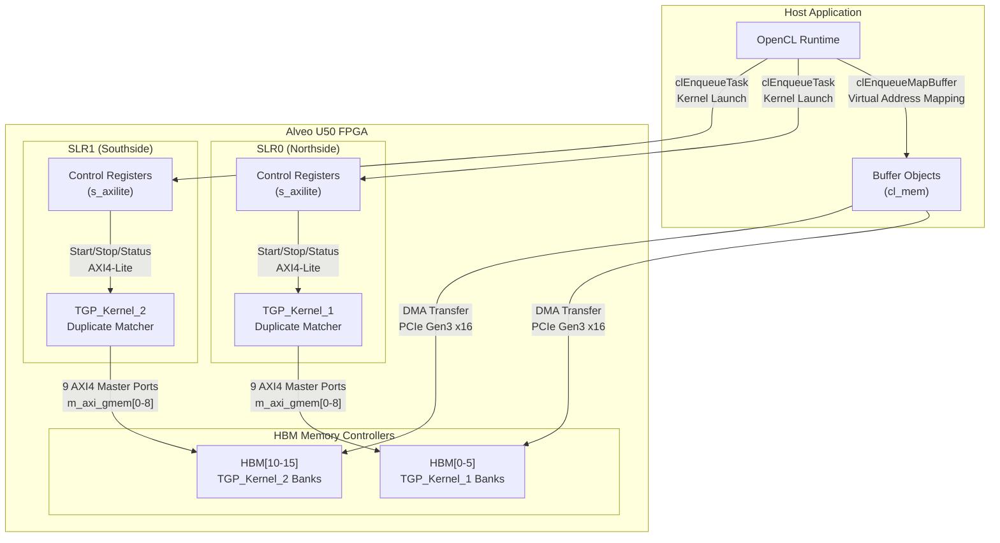

# Kernel Connectivity Configuration for U50 (Duplicate Text Match Demo)

## The Problem This Module Solves

Imagine you're designing a high-performance text processing pipeline that needs to find duplicate strings across massive datasets—think log deduplication, plagiarism detection, or genome sequence matching. You've written a brilliant FPGA kernel (`TGP_Kernel`) that can compare text segments at hardware speed, but now you face a different challenge: **how do you wire this kernel into a real FPGA card so it can actually access memory, communicate with the host, and run at peak performance?**

This configuration file solves exactly that "last mile" problem. It defines how two instances of the Text Group Processing Kernel (`TGP_Kernel`) connect to the Xilinx Alveo U50 card's High Bandwidth Memory (HBM) banks, how they're distributed across the FPGA's Super Logic Regions (SLRs), and how they present themselves to the host runtime.

Without this file, your kernel is just a piece of intellectual property (IP) in a vacuum—it has no path to data, no physical location on the die, and no way for the host to address it. With this file, the Vitis compiler can generate a complete bitstream that places your kernel logic precisely where it needs to be, wires it to the correct memory controllers, and exposes the right control interfaces.

## Mental Model: The FPGA as a City

Think of the Alveo U50 FPGA as a bustling metropolitan area divided into two boroughs (Super Logic Regions, or SLRs): **Northside (SLR0)** and **Southside (SLR1)**. These boroughs are connected by bridges (inter-die connections), but crossing those bridges takes time—you want to minimize traffic between them.

Now imagine **parking garages** (HBM banks) scattered throughout the city. There are 32 parking garages numbered 0-31, each with valet service (memory controllers) that can fetch or store data extremely quickly. However, each parking garage is affiliated with a specific borough—while you can technically drive from Northside to a Southside garage, it's much faster to use the ones in your own borough.

Your **kernel instances** are like two identical restaurants (TGP_Kernel_1 and TGP_Kernel_2) that process food orders (text data). Each restaurant needs access to multiple parking garages to fetch ingredients and store results:

- **Restaurant 1 (TGP_Kernel_1)** is located in **Northside (SLR0)**. It has 9 valet contracts (m_axi_gmem0 through m_axi_gmem8) with parking garages HBM[0] through HBM[5]. Notice that gmem5-gmem8 all share HBM[4]—this is like having multiple service entrances to the same garage, useful when different kitchen stations need independent access.

- **Restaurant 2 (TGP_Kernel_2)** is located in **Southside (SLR1)**. It also has 9 valet contracts with parking garages HBM[10] through HBM[15], similarly structured with gmem5-gmem8 sharing HBM[14].

The **nk=TGP_Kernel:2:TGP_Kernel_1.TGP_Kernel_2** line is like registering your business name with the city—you're saying "I have one franchise concept called TGP_Kernel, I'm opening 2 locations, and their business licenses will be TGP_Kernel_1 and TGP_Kernel_2."

When the host application wants to place an order, it looks up "TGP_Kernel_1" or "TGP_Kernel_2" in the city registry (the xclbin metadata), finds their address (base address on the AXI-Lite control bus), and sends instructions to their control registers.

## Architecture and Data Flow



### Data Flow Walkthrough

The data flow through this system follows a specific choreography optimized for high-throughput text duplicate detection:

**1. Host Memory Preparation Phase**

Before any kernel runs, the host application allocates buffer objects (`cl_mem`) and populates them with text data—likely document fragments, string hashes, or n-grams to be compared. These buffers are allocated in specific HBM banks (0-5 for Kernel 1, 10-15 for Kernel 2) using Vitis memory extension flags (e.g., `CL_MEM_EXT_PTR_XILINX` with `flags` specifying HBM bank).

**2. Kernel Launch and Control**

When the host calls `clEnqueueTask` for TGP_Kernel_1, the OpenCL runtime:
- Looks up the kernel name in the xclbin metadata (registered via `nk=` directive)
- Finds its control register base address (mapped via `s_axilite` interface, implied by standard Vitis kernel linking)
- Writes the `START` bit to the control register

The kernel immediately begins executing its hardware state machine.

**3. Memory Access Patterns**

TGP_Kernel_1, residing in SLR0, initiates memory transactions through its 9 AXI4 master interfaces:

- **m_axi_gmem0 → HBM[0]**: Likely primary input buffer (text data)
- **m_axi_gmem1 → HBM[1]**: Secondary input (hash tables or reference data)
- **m_axi_gmem2 → HBM[2]**: Tertiary input (dictionary or bloom filter)
- **m_axi_gmem3 → HBM[3]**: Output buffer (match results)
- **m_axi_gmem4 → HBM[4]**: Auxiliary output or scratch
- **m_axi_gmem5-8 → HBM[4]**: Multiple access channels to the same HBM bank for parallel read/write streams

The critical insight in this mapping is that **m_axi_gmem5, 6, 7, and 8 all connect to HBM[4]**. This isn't redundancy—it's **bank channel parallelism**. The TGP_Kernel likely has multiple internal compute pipelines (perhaps 4 parallel match units) that each need independent access to a shared structure (like a hash bucket or frequency table). By mapping four AXI interfaces to the same HBM bank, the kernel can issue four concurrent read or write transactions to different addresses within that bank, saturating the HBM controller's command bandwidth.

**4. Parallel Execution of Kernel 2**

Simultaneously, TGP_Kernel_2 in SLR1 operates on its own HBM banks (10-15) with identical connectivity. The host likely partitions the input dataset and enqueues both kernels concurrently. Because SLR0 and SLR1 are separate die in the U50 (which uses stacked silicon interconnect, SSI), they have independent HBM controllers and can operate at full bandwidth without resource contention.

**5. Completion and Result Retrieval**

When kernels complete (detected via polling `DONE` bit in control registers or interrupt), the host issues `clEnqueueMigrateMemObjects` to DMA results from HBM back to host memory for further processing (sorting matches, aggregating statistics, etc.).

## Component Deep-Dive: Configuration Directives

### The `[connectivity]` Section

This header indicates the file uses Vitis Linker (v++ -l) connectivity syntax. The linker reads this file during the linking phase (`-l` or `--link`) when building the xclbin.

### Memory Mapping Directives (`sp=`)

**Syntax:** `sp=<kernel_instance>.<port_name>:<memory_bank>`

The `sp` (slave port) directive binds a kernel's AXI master interface to a specific hardware memory resource.

**TGP_Kernel_1 Analysis:**
```cfg
sp=TGP_Kernel_1.m_axi_gmem0:HBM[0]
sp=TGP_Kernel_1.m_axi_gmem1:HBM[1]
sp=TGP_Kernel_1.m_axi_gmem2:HBM[2]
sp=TGP_Kernel_1.m_axi_gmem3:HBM[3]
sp=TGP_Kernel_1.m_axi_gmem4:HBM[4]
sp=TGP_Kernel_1.m_axi_gmem5:HBM[4]
sp=TGP_Kernel_1.m_axi_gmem6:HBM[4]
sp=TGP_Kernel_1.m_axi_gmem7:HBM[4]
sp=TGP_Kernel_1.m_axi_gmem8:HBM[5]
```

This mapping reveals the kernel's internal architecture. The TGP_Kernel likely implements a **9-port memory architecture** with specific banking strategies:

1. **Dedicated Data Ports (0-4, 8)**: Ports 0-4 and 8 each get exclusive HBM banks (0-4 and 5). These likely correspond to:
   - Port 0: Input document stream
   - Port 1: Hash table or signature index
   - Port 2: N-gram or token lookup table
   - Port 3: Output match buffer
   - Port 4: Scratch workspace or frequency histogram
   - Port 8: Secondary output or statistics aggregation

2. **Shared Bank Parallel Access (5-8 → HBM[4])**: Ports 5, 6, 7, and 8 all map to HBM[4]. This is the key parallelism strategy: four independent AXI interfaces allow four concurrent transactions to different addresses in the same bank. For a duplicate text matcher, this enables:
   - Parallel hash bucket reads during signature comparison
   - Concurrent frequency counter updates
   - Multiple stream buffers for different text segments

### SLR Assignment Directives (`slr=`)

**Syntax:** `slr=<kernel_instance>:<slr_id>`

The `slr` directive assigns a kernel instance to a specific Super Logic Region (SLR) on the FPGA die.

```cfg
slr=TGP_Kernel_1:SLR0
slr=TGP_Kernel_2:SLR1
```

The U50 uses Xilinx's Stacked Silicon Interconnect (SSI) technology, stacking multiple FPGA die (SLRs) in the same package. SLR0 and SLR1 are physically separate silicon die with independent HBM controllers and cross-SLR routing. By placing TGP_Kernel_1 in SLR0 and TGP_Kernel_2 in SLR1, the design achieves:

- **Resource Isolation**: Each kernel gets its own dedicated LUTs, FFs, BRAMs, and DSPs without resource contention
- **HBM Bandwidth Isolation**: Each SLR has independent HBM access paths (though they share the physical HBM die, the controllers are per-SLR)
- **Parallel Execution**: Both kernels can run simultaneously at full clock speed without cross-SLR communication latency (unless explicitly designed)

### Kernel Replication Directive (`nk=`)

**Syntax:** `nk=<base_kernel_name>:<num_instances>:<instance_name_1>.<instance_name_2>.<...>`

The `nk` (number of kernels) directive replicates a kernel RTL design multiple times with specific instance names.

```cfg
nk=TGP_Kernel:2:TGP_Kernel_1.TGP_Kernel_2
```

This directive tells the Vitis linker:
1. Take the compiled RTL for `TGP_Kernel` (from the kernel source files)
2. Instantiate it twice in the design
3. Name the first instance `TGP_Kernel_1` and the second `TGP_Kernel_2`
4. Apply all subsequent `sp=` and `slr=` directives to these specific instance names

This replication enables data parallelism—both kernels run the same algorithm on different data partitions, effectively doubling throughput (assuming the host can feed them fast enough via PCIe).

## Design Decisions and Tradeoffs

### HBM Bank Strategy: Isolation vs. Channel Parallelism

The most striking feature of this connectivity configuration is the asymmetric HBM mapping—9 ports mapped to 6 HBM banks for each kernel, with 4 ports sharing one bank. This reveals a careful balance between two competing requirements:

**1. Data Stream Isolation (Dedicated Banks 0-3, 5, 10-13, 15)**

For the primary input and output streams (likely gmem0 for input, gmem3 for output), dedicated HBM banks ensure:
- **Predictable Latency**: No arbitration conflicts with other kernel activities
- **Maximum Bandwidth**: Full HBM channel bandwidth (~14 GB/s per pseudo-channel) available to the stream
- **No Bank Contention**: Input data fetching never stalls waiting for scratchpad or hash table accesses

**2. Concurrent Hash/Index Access (Shared Bank 4, 14)**

For the duplicate text matching algorithm, the kernel likely maintains:
- A frequency hash table (counting n-gram occurrences)
- A signature index (Bloom filter or hash set of seen documents)
- Multiple parallel comparison pipelines

Mapping 4 AXI ports (gmem5-8) to the same HBM bank (4 or 14) enables:
- **Parallel Hash Bucket Access**: Four independent pipelines can read from different hash buckets simultaneously
- **Concurrent Counter Updates**: Multiple frequency counters can be incremented without serialization (HBM supports atomic operations)
- **Sustained Throughput**: While each individual access has HBM latency (~100ns), four concurrent requests keep the memory pipeline full, achieving effective bandwidth close to the theoretical maximum

**Tradeoff Analysis:**

This configuration sacrifices bank isolation for the hash table in exchange for query parallelism. An alternative design might map gmem5-8 to separate HBM banks (6-9), but this would:
- Increase HBM bank fragmentation (leaving less flexibility for other kernels)
- Not actually improve performance if the hash table is the bottleneck (you're limited by hash computation, not memory bandwidth)
- Complicate the host code (needing 4 separate buffer allocations instead of 1 with 4 access channels)

The chosen design is optimal when hash table access is the dominant operation and requires concurrent multi-port access.

### SLR Placement: Locality vs. Die Capacity

Placing TGP_Kernel_1 in SLR0 and TGP_Kernel_2 in SLR1 represents a **die-per-kernel strategy** rather than colocating both kernels in the same SLR. This decision reflects several considerations:

**Advantages of Cross-SLR Placement:**

1. **Resource Headroom**: Each SLR on the U50 has significant but finite resources (LUTs, FFs, BRAM, URAM, DSP). By distributing kernels across SLRs, we avoid resource contention that could prevent timing closure or limit kernel size.

2. **HBM Controller Affinity**: Each SLR has dedicated HBM controllers. Placing Kernel 1 in SLR0 with its HBM banks (0-5) and Kernel 2 in SLR1 with its HBM banks (10-15) ensures each kernel talks to "local" HBM controllers, minimizing cross-SLR routing delay.

3. **Independent Clock Domains**: While both kernels likely run at the same clock frequency, separating them into different SLRs allows for more flexible timing closure—each SLR's timing is independent, and cross-SLR signals are handled by dedicated synchronizing circuits.

**Costs of Cross-SLR Placement:**

1. **SLR Crossing Latency**: Any communication between Kernel 1 and Kernel 2 (if they need to synchronize or share results) must cross the SLR boundary, incurring ~2-4ns additional latency. This configuration implies these kernels are completely independent (embarrassingly parallel), so no cross-kernel communication is expected during execution.

2. **Inter-SLR Routing Resources**: While not a concern for independent kernels, the physical wires crossing between SLRs are limited. If many signals needed to cross, this could become a routing bottleneck. Here, only the AXI-Lite control interfaces (low-bandwidth) and possibly some clock/reset signals cross SLRs.

**Design Rationale:**

The cross-SLR placement is optimal for **data-parallel throughput scaling**. When processing large text datasets, you can partition the data, assign half to Kernel 1 and half to Kernel 2, and run both simultaneously without interference. This effectively doubles throughput compared to a single kernel, limited only by the PCIe bandwidth feeding data to the card and the host's ability to manage two concurrent kernel executions.

### Kernel Replication: Throughput vs. Resource Efficiency

The `nk=TGP_Kernel:2:TGP_Kernel_1.TGP_Kernel_2` directive explicitly chooses **spatial replication** over temporal multiplexing. This is a fundamental design decision with significant implications:

**Alternative: Single Kernel with Double Execution**
An alternative design could instantiate only one TGP_Kernel, run it on the first half of the data, wait for completion, then run it on the second half. This would use half the FPGA resources but take (approximately) twice as long.

**Chosen: Dual Kernel with Parallel Execution**
The chosen design instantiates two identical kernels, each processing half the data concurrently. This uses twice the FPGA resources (spread across two SLRs) but achieves (approximately) double the throughput.

**Why Spatial Replication Wins Here:**

1. **Kernel Launch Overhead**: Each `clEnqueueTask` has latency (~10-50 microseconds for PCIe round-trip, context switching, and command queue processing). Running one kernel twice incurs this overhead twice. Running two kernels in parallel incurs it once for both, effectively halving the per-dataset launch overhead.

2. **Pipeline Fill Latency**: TGP_Kernel likely has deep pipelines (hundreds of stages) for text processing. Filling and draining the pipeline takes time. With a single kernel, you pay this cost twice (once per dataset half). With dual kernels, both pipelines fill once and run continuously on their respective data streams.

3. **Resource Utilization Sweet Spot**: The U50 is a large FPGA with substantial resources. Using only one SLR leaves the other underutilized. By placing one kernel per SLR, the design achieves balanced resource utilization across the entire device, maximizing the value extracted from the hardware.

4. **PCIe Bandwidth Matching**: The U50 connects to the host via PCIe Gen3 x16, providing ~15.75 GB/s theoretical bandwidth. A single TGP_Kernel, if it's memory-bound (likely for text processing with hash table lookups), might saturate ~8-10 GB/s. Running two kernels in parallel can consume the full PCIe bandwidth, achieving system-level balance where neither the FPGA nor the PCIe link is the bottleneck.

**Tradeoff Summary:**

The choice of dual kernels over single kernel reuse represents a classic **throughput vs. resource utilization** tradeoff. In high-performance computing contexts where the goal is to minimize total time-to-solution for large datasets, maximizing throughput (by using more resources in parallel) is usually the correct choice. The "wasted" resources (the second SLR sitting idle in the single-kernel scenario) represent a higher opportunity cost than the "used" resources in the dual-kernel scenario.

## Usage and Examples

### Building the xclbin with Connectivity Configuration

To use this configuration file when building the FPGA bitstream:

```bash
# Compile the kernel RTL/HLS to .xo (object) file
v++ -c -k TGP_Kernel \
    --platform xilinx_u50_gen3x16_xdma_5_202210_1 \
    -o TGP_Kernel.xo \
    src/tgp_kernel.cpp

# Link the object file using the connectivity configuration
v++ -l \
    --platform xilinx_u50_gen3x16_xdma_5_202210_1 \
    --connectivity.sp TGP_Kernel_1.m_axi_gmem0:HBM[0] \
    --connectivity.sp TGP_Kernel_1.m_axi_gmem1:HBM[1] \
    # ... (all sp= directives) \
    --connectivity.slr TGP_Kernel_1:SLR0 \
    --connectivity.slr TGP_Kernel_2:SLR1 \
    --connectivity.nk TGP_Kernel:2:TGP_Kernel_1.TGP_Kernel_2 \
    -o TGP_Kernel.xclbin \
    TGP_Kernel.xo
```

Or, more conveniently, using a configuration file:

```bash
v++ -l \
    --platform xilinx_u50_gen3x16_xdma_5_202210_1 \
    --config conn_u50.cfg \
    -o TGP_Kernel.xclbin \
    TGP_Kernel.xo
```

### Host Code: Buffer Allocation in Specific HBM Banks

To use the HBM banks specified in the connectivity configuration, the host application must allocate buffers with explicit bank assignments:

```cpp
#include <CL/cl.h>
#include <CL/cl_ext_xilinx.h>  // For Xilinx-specific extensions

// Helper to create a buffer in a specific HBM bank
cl_mem createHBMBuffer(cl_context context, cl_mem_flags flags, 
                       size_t size, int hbmBank) {
    cl_mem_ext_ptr_t extPtr;
    extPtr.obj = nullptr;
    extPtr.param = 0;
    // Xilinx-specific flag to specify HBM bank
    extPtr.flags = hbmBank | XCL_MEM_TOPOLOGY;
    
    return clCreateBuffer(context, flags | CL_MEM_EXT_PTR_XILINX, 
                          size, &extPtr, nullptr);
}

// Usage for TGP_Kernel_1 (HBM banks 0-5)
cl_mem inputBuf = createHBMBuffer(context, CL_MEM_READ_ONLY, 
                                   inputSize, 0);  // HBM[0]
cl_mem hashTableBuf = createHBMBuffer(context, CL_MEM_READ_ONLY, 
                                       hashTableSize, 1);  // HBM[1]
cl_mem outputBuf = createHBMBuffer(context, CL_MEM_WRITE_ONLY, 
                                    outputSize, 3);  // HBM[3]
cl_mem scratchBuf = createHBMBuffer(context, CL_MEM_READ_WRITE, 
                                   scratchSize, 4);  // HBM[4]
// gmem5-8 also use HBM[4] - these are accessed internally by the kernel
// for parallel hash table operations, no separate host buffers needed

// Set kernel arguments
clSetKernelArg(kernel1, 0, sizeof(cl_mem), &inputBuf);
clSetKernelArg(kernel1, 1, sizeof(cl_mem), &hashTableBuf);
// ... set other arguments for gmem2-8

// Enqueue data migration to HBM
clEnqueueMigrateMemObjects(queue, 1, &inputBuf, 0, 0, nullptr, nullptr);
clEnqueueMigrateMemObjects(queue, 1, &hashTableBuf, 0, 0, nullptr, nullptr);

// Launch kernel
clEnqueueTask(queue, kernel1, 0, nullptr, nullptr);

// Retrieve results
clEnqueueMigrateMemObjects(queue, 1, &outputBuf, CL_MIGRATE_MEM_OBJECT_HOST, 
                            0, nullptr, nullptr);
clFinish(queue);
```

## Edge Cases, Gotchas, and Operational Considerations

### HBM Bank Contention and Performance Pitfalls

**The Silent Performance Killer:** The most insidious issue with this configuration is **HBM bank contention** when the host code doesn't properly align with the connectivity specification.

If the host allocates a buffer in HBM[6] but passes it to a kernel port mapped to HBM[4], the Vitis runtime won't error out—instead, the DMA engine will silently route the data through a crossbar, potentially adding latency and reducing effective bandwidth. The kernel will still run, but performance may drop 30-50% with no obvious indication why.

**Detection:**
- Use `xbutil` (or the newer `xbutil2`/`xrt`) to query actual memory topology usage after kernel execution
- Profile with Vitis Analyzer to check for unexpected memory migration times
- Compare achieved bandwidth against theoretical (HBM provides ~460 GB/s aggregate, but per-kernel you should see ~50-80 GB/s with good access patterns)

**Prevention:**
- Always use `CL_MEM_EXT_PTR_XILINX` with explicit bank flags matching the connectivity config
- Create a host-side header that `#define`s HBM bank numbers matching the connectivity file, then use those macros:
  ```cpp
  // config.h - generated from connectivity analysis
  #define K1_GMEM0_BANK 0
  #define K1_GMEM1_BANK 1
  // ... etc
  ```

### SLR Crossing and Timing Closure

**The Timing Hazard:** While TGP_Kernel_1 and TGP_Kernel_2 are isolated in separate SLRs, any signal crossing between SLRs must be carefully managed. The current configuration has minimal cross-SLR traffic (only AXI-Lite control interfaces), which is good.

However, if you modify the design to add:
- A global reset signal distributed to both kernels
- An interrupt aggregator collecting completion signals
- A shared timestamp counter for profiling

These signals would cross SLRs and could become timing critical paths. The SLR crossing adds ~1-2ns delay, which at 300 MHz (3.33ns period) consumes a significant portion of the timing budget.

**Mitigation:**
- Keep kernel-to-kernel communication off-chip (through HBM) rather than direct logic connections
- Use `xf::cv::PLIO` or `hls::stream` with appropriate FIFO depths if direct kernel communication is absolutely necessary
- Place any global signals (reset, clock enable) on dedicated low-skew global clock networks

### Bank 4/14 Saturation and Head-of-Line Blocking

**The Concurrency Trap:** The design maps 4 AXI ports (gmem5-8) to a single HBM bank (4 or 14). While HBM supports multiple pseudo-channels and has internal banking, there's a subtle issue: **head-of-line blocking**.

If all 4 ports issue read requests to the same HBM row (or even the same bank group), the HBM controller will serialize them to avoid row buffer conflicts. The later requests stall behind the earlier ones, reducing the effective parallelism from 4x to 1x for that transaction burst.

**Optimization Strategies:**
- **Address Interleaving**: Design the kernel so that gmem5-8 access different regions of the allocated buffer, ideally spaced by at least 2KB (one HBM row size) to ensure they map to different row buffers
- **Access Pattern Coordination**: If the kernel knows which data each port will access, it can schedule gmem5 access slightly ahead of gmem6, gmem7, gmem8 to stagger the requests and avoid collision at the HBM controller
- **Request Buffering**: Add small FIFOs (8-16 entries) in front of each AXI interface in the kernel RTL to absorb short-term backpressure from HBM without stalling the compute pipelines

### PCIe Bandwidth Imbalance

**The System Bottleneck:** With two TGP_Kernels each potentially consuming 50-80 GB/s of HBM bandwidth, the aggregate is 100-160 GB/s. However, the PCIe Gen3 x16 interface to the host provides only ~15.75 GB/s (~16 GB/s with overhead) of theoretical bandwidth, and typically ~12-14 GB/s in practice.

This creates a **massive bandwidth imbalance**: the kernels can process data 6-10x faster than the host can supply it. This is actually good—it means the kernels are never starved for compute, and the system is limited only by data movement from host to device.

However, it creates operational constraints:
- **Batch Processing is Required**: You cannot stream data through the kernels in real-time; you must batch large chunks (hundreds of MB to several GB) to amortize the PCIe transfer overhead
- **Double Buffering is Essential**: While the kernels process batch N, the host should be DMA-ing batch N+1 to HBM, and retrieving batch N-1 results
- **Compute vs. Transfer Overlap**: Ideally, the kernels should run concurrently with PCIe transfers, but since both kernels may saturate HBM bandwidth, careful scheduling is needed to avoid HBM contention between DMA engines and kernel AXI ports

## References

This configuration file works in conjunction with several related modules:

- **[host_predicate_logic](data_analytics-L2-demos-text-dup_match-host_predicate_logic.md)** and **[host_application](data_analytics-L2-demos-text-dup_match-host_application.md)**: These modules implement the host-side runtime that calls the kernels configured in this file. They manage buffer allocation in the specific HBM banks defined here, enqueue kernel execution, and handle data partitioning between TGP_Kernel_1 and TGP_Kernel_2.

- **TGP_Kernel RTL/HLS Source**: The actual kernel implementation (not shown in the provided code) defines the 9 AXI master interfaces (m_axi_gmem0-8) referenced in this configuration. The internal structure of that kernel—how it uses the 4 shared ports (gmem5-8) for parallel hash table access, for example—is what makes this specific connectivity mapping optimal.

- **Xilinx U50 Platform**: The target platform (`xilinx_u50_gen3x16_xdma_5_202210_1` or similar) provides the physical HBM banks (0-31), SLRs (0-1), and PCIe infrastructure that this configuration maps onto. The platform's XSA (Xilinx Shell Archive) defines the available resources and their connectivity.
