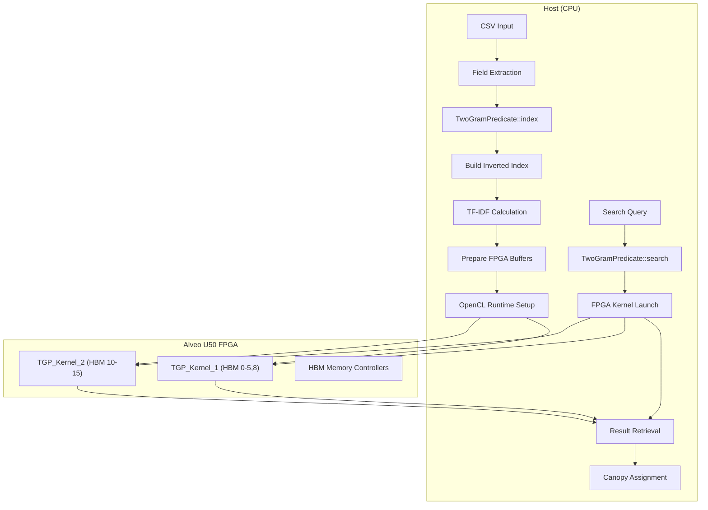
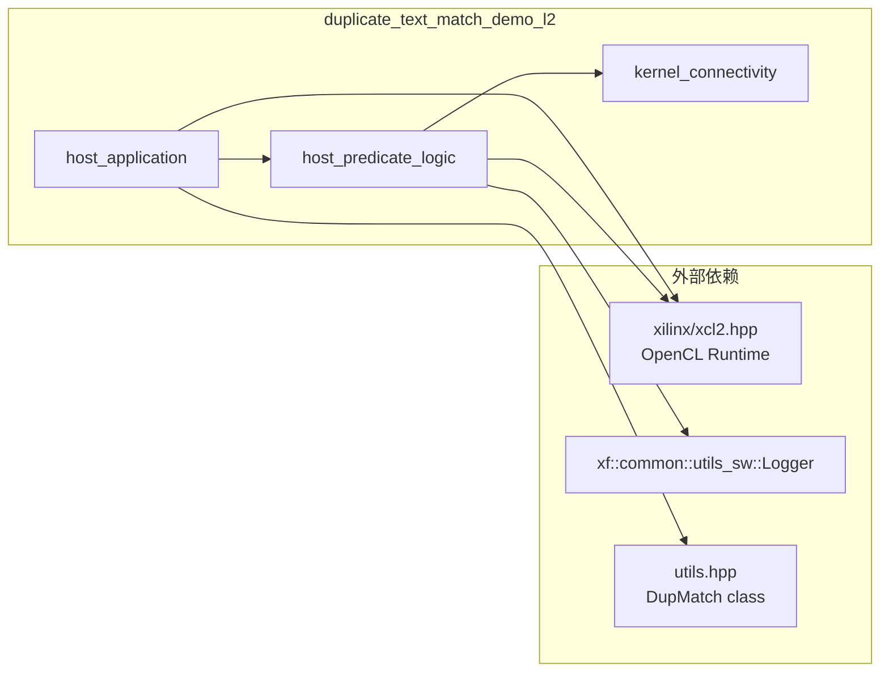

# duplicate_text_match_demo_l2 技术深度解析

## 一句话总结

`duplicate_text_match_demo_l2` 是一个基于 **2-gram (双字符组)** 技术的**文本重复检测加速器**，通过 **TF-IDF 相似度算法** 和 **Canopy 聚类** 在 **Xilinx/AMD FPGA (Alveo U50)** 上实现海量文本记录的实时去重——相当于给数据库装了一个"指纹matcher"，能在毫秒级找出"看起来相似"的文本对。

---

## 问题空间：为什么要做这个模块？

想象你在处理一个包含数亿条客户记录的脏数据集：
- `"Acme Corp, 123 Main St"` 和 `"ACME Corporation, 123 main street"` 是**同一家公司**
- `"John Doe, 555-1234"` 和 `"Jon Doe, 555-1234"` 可能是**同一个人**

传统的数据库 `JOIN` 要求精确匹配，而文本去重需要**模糊匹配 (Fuzzy Matching)**。在大数据场景下，CPU 上的逐对比较 ($O(N^2)$) 是不可接受的。

### 替代方案为何不够？

| 方案 | 问题 | 为什么没选 |
|------|------|-----------|
| 精确哈希 (MD5/SHA) | "Acme" ≠ "ACME" | 无法处理大小写、拼写变体 |
| SimHash + Hamming | 实现复杂，需要海量存储 | 工程复杂度高 |
| CPU 上的 MinHash | 内存瓶颈 | 数据集超过百GB时性能崩溃 |
| GPU 加速 | 功耗高，延迟抖动 | FPGA 更适合流式处理 |

**核心洞察**：文本去重的本质是**高维稀疏向量的近似最近邻 (ANN) 搜索**。2-gram 将文本转化为稀疏向量，TF-IDF 赋予重要term更高权重，Canopy 聚类将搜索空间从 $O(N^2)$ 剪枝到 $O(N \cdot C)$，其中 $C$ 是 canopy 中心数。

---

## 心智模型：如何理解这个系统？

### 类比：图书馆的索引卡片系统

想象你管理一个**混乱的图书馆**，书没有编号，只有手写标签。你要找出"重复购入"的书：

1. **2-gram 分词** = 把书名拆成连续的"两字词组"：
   - `"机器学习导论"` → `["机器", "器学", "学习", "习导", "导论"]`

2. **TF-IDF 加权** = 给罕见词组更高权重：
   - `"的"` 出现太频繁 → 权重低
   - `"量子纠缠"` 很罕见 → 权重高

3. **倒排索引** = 制作"词组→书籍"的反向目录：
   - `"机器学习"` → [书#102, 书#205, 书#308]

4. **Canopy 聚类** = 先找几个"代表书"，其他书找最像的代表：
   - 选 100 本最有特色的书作为"canopy 中心"
   - 每本新书只和这 100 本比较，而不是和 100 万本比较

5. **FPGA 加速** = 把"比较两本书的相似度"做成专用硬件：
   - CPU 做"管理调度"（找哪些书要比较）
   - FPGA 做"密集计算"（向量点积、求余弦相似度）

### 核心抽象层次

```
┌─────────────────────────────────────────────────────────────┐
│  Application Layer (main.cpp)                                │
│  - CSV parsing, field extraction                           │
│  - DupMatch orchestration                                   │
│  - Result validation against golden                         │
└─────────────────────────────────────────────────────────────┘
                              │
                              ▼
┌─────────────────────────────────────────────────────────────┐
│  Algorithm Layer (predicate.cpp)                            │
│  - TwoGramPredicate: 2-gram indexing + FPGA search          │
│  - WordPredicate: word-level indexing (CPU fallback)        │
│  - TF-IDF scoring, Canopy clustering                       │
└─────────────────────────────────────────────────────────────┘
                              │
                              ▼
┌─────────────────────────────────────────────────────────────┐
│  Hardware Layer (conn_u50.cfg + kernels)                    │
│  - TGP_Kernel_1/2: Two-Gram Predicate FPGA kernels          │
│  - HBM memory mapping (16 channels)                         │
│  - SLR placement for timing closure                         │
└─────────────────────────────────────────────────────────────┘
```

---

## 架构与数据流

### 系统架构图



### 关键数据流路径

#### 1. 索引构建流程 (CPU-side)

```cpp
// TwoGramPredicate::index()
// Input: std::vector<std::string> column (raw text records)

Step 1: Deduplication Field Extraction
  ├─ preTwoGram(line_str) → normalized string
  ├─ Build col_map: normalized string → unique ID
  └─ unique_field stores (normalized_string, id) pairs

Step 2: 2-gram Term Extraction
  ├─ twoGram(normalized_string, terms)
  ├─ Char encoding: '0'-'9'→0-9, 'a'/'A'-'z'/'Z'→10-25, others→36
  └─ Generate 16-bit term IDs (char1 + char2 * 64)

Step 3: Inverted Index Construction (TF calculation)
  ├─ For each unique field:
  │   ├─ Count term frequencies (TF raw)
  │   ├─ Calculate TF weight: w = log(count) + 1.0
  │   ├─ Normalize: w / sqrt(sum(w²))
  │   └─ Store in tf_value_[doc_id] = normalized_weight
  ├─ Build tf_addr_: term_id → (offset in tf_value_, length)
  └─ Calculate IDF: idf_value_[term_id] = log(1.0 + N/doc_freq)

Step 4: Threshold-based Pruning (Canopy pre-filtering)
  ├─ threshold = max(1000, N * 0.05)
  ├─ Skip terms with doc_freq > threshold (too common, low discriminative power)
  └─ Reduces FPGA memory pressure and computation

Output: Populated idf_value_[4096], tf_addr_[4096], tf_value_[TFLEN]
        Ready for FPGA kernel consumption
```

#### 2. FPGA 搜索流程 (Host + FPGA)

```cpp
// TwoGramPredicate::search()

Phase 1: Host-side Buffer Preparation
  ├─ Split column data across CU (Compute Units) = 2
  ├─ Allocate aligned host buffers:
  │   ├─ fields[i]: Raw text data (BS = 64MB per CU)
  │   ├─ offsets[i]: Field boundaries (RN entries)
  │   ├─ idf_value_: 4096 double values
  │   ├─ tf_addr_: 4096 uint64_t pointers
  │   ├─ tf_value_: TFLEN uint64_t pairs (doc_id, weight)
  │   └─ indexId[i]: Output buffer for results
  └─ Copy data to aligned buffers with proper offsets

Phase 2: OpenCL Runtime Setup
  ├─ xcl::get_xil_devices() → Select Alveo U50
  ├─ cl::Context, cl::CommandQueue creation
  ├─ Import xclbin (TGP_Kernel bitstream)
  ├─ Create 2 Kernel objects:
  │   ├─ PKernel[0] = "TGP_Kernel:{TGP_Kernel_1}" → SLR0
  │   └─ PKernel[1] = "TGP_Kernel:{TGP_Kernel_2}" → SLR1
  └─ Configure memory extensions (cl_mem_ext_ptr_t) for HBM binding

Phase 3: HBM Memory Binding (Key Architectural Feature)
  ├─ TGP_Kernel_1 Memory Map:
  │   ├─ m_axi_gmem0 → HBM[0]  (fields input)
  │   ├─ m_axi_gmem1 → HBM[1]  (offsets)
  │   ├─ m_axi_gmem2 → HBM[2]  (idf_value)
  │   ├─ m_axi_gmem3 → HBM[3]  (tf_addr)
  │   ├─ m_axi_gmem4 → HBM[4]  (tf_value - part 1)
  │   ├─ m_axi_gmem5 → HBM[4]  (tf_value - part 2)
  │   ├─ m_axi_gmem6 → HBM[4]  (tf_value - part 3)
  │   ├─ m_axi_gmem7 → HBM[4]  (tf_value - part 4)
  │   └─ m_axi_gmem8 → HBM[5]  (output indexId)
  ├─ TGP_Kernel_2 Memory Map:
  │   └─ Same pattern, mapped to HBM[10-15]
  └─ Rationale: HBM provides ~460GB/s bandwidth, essential for random access
     to inverted index (tf_value lookups with irregular access patterns)

Phase 4: Kernel Execution (FPGA Acceleration)
  ├─ cl::Buffer creation for all 6 memory ports per kernel
  ├─ Kernel Arg Setup (9 args per kernel):
  │   ├─ arg0: ConfigParam struct (docSize, fldSize)
  │   ├─ arg1-5: Input buffers (fields, offsets, idf, tf_addr, tf_value)
  │   ├─ arg6-8: Scratchpad tf_value partitions (same buffer, different offsets)
  │   └─ arg9: Output buffer (indexId)
  ├─ Enqueue Write: Migrate input buffers H→D (host to device)
  ├─ Enqueue Kernel Launch: Both TGP_Kernel_1 & TGP_Kernel_2 (concurrent execution)
  ├─ Enqueue Read: Migrate output buffer D→H (device to host, waits on kernels)
  └─ Result: indexId array with canopy assignments for each input record
```

---

## 关键设计决策与权衡

### 1. 为什么选择 2-gram 而不是 Word-level Tokenization？

**决策**: 使用字符级 2-gram (双字符组) 作为主要特征，而非空格分词的单词。

**权衡分析**:

| 维度 | 2-gram | Word-level |
|------|--------|------------|
| **拼写容错** | 优秀。`"color"` vs `"colour"` 共享 `or`/`ou` bigrams | 差。完全不同的token |
| **内存占用** | 可控。~37² = 1369 种可能 bigrams | 爆炸性增长。词典可能百万级 |
| **语义精度** | 较弱。`"not good"` 和 `"good"` 有重叠 bigrams | 强。保留否定词等语义 |
| **FPGA友好性** | 极佳。固定大小(16-bit) token，随机访问 | 复杂。变长字符串比较 |

**决策理由**:
- 这是一个 **数据清洗/去重** 场景，不是语义搜索。容忍拼写变体比重 Capture 精确语义更重要。
- FPGA 的 HBM 随机访问模式适合固定大小的倒排索引，不适合变长字符串指针追踪。
- 2-gram 的倒排列表可以放入 HBM 的 16 通道并行访问架构。

### 2. CPU-FPGA 协同：为什么 index 在 CPU，search 在 FPGA？

**决策**: 倒排索引的**构建**在主机 CPU 完成，只有**查询匹配**在 FPGA 加速。

**架构理由**:

| 阶段 | 计算特征 | 为什么选这个平台 |
|------|----------|------------------|
| **Index (构建)** | 不规则内存访问，复杂数据结构(map/set)，动态扩容 | CPU。C++ STL 容器天然支持，构建是一次性的，不追求极致吞吐 |
| **Search (查询)** | 大规模并行点积计算，规则内存访问(hbm)，低延迟要求 | FPGA。可并行处理 thousands of inverted lists，确定性延迟 |

**关键洞察**: 这是一个 **write-once-read-many** 场景。构建索引可能花费几分钟（可接受），但每次查询需要在毫秒级完成（必须硬件加速）。

### 3. HBM 内存布局的权衡

**决策**: 使用 16 个 HBM 通道 (HBM[0-15])，将两个 kernel 的数据分布在不同通道组。

**为什么这样设计**:

```
TGP_Kernel_1 → HBM[0-5]  (6 channels)
TGP_Kernel_2 → HBM[10-15] (6 channels)
                        ↑
                 物理隔离，无 bank conflict
```

- **带宽最大化**: U50 的 HBM 提供 460GB/s 总带宽。两个 kernel 独立访问不同通道组，避免争用。
- **物理布局**: HBM[0-7] 和 HBM[8-15] 在物理上是不同的 die。SLR0 的 kernel 用 HBM[0-5]，SLR1 的 kernel 用 HBM[10-15]，符合 SLR 到 HBM 的物理连接约束。

### 4. Threshold-based 剪枝 (mux index number = 1000)

**决策**: 如果某个 2-gram 出现在超过 `max(1000, N*0.05)` 个文档中，则完全丢弃该term的倒排列表。

**为什么这么做**:

| 考虑 | 解释 |
|------|------|
| **噪音削减** | 像 `"的"`、`"is"`、标点组合的 bigrams 几乎出现在所有文档中，对区分度贡献为零 |
| **内存压力** | 高频 term 的倒排列表可能包含数百万个条目，消耗 HBM 资源 |
| **计算节省** | FPGA 内核避免处理无意义的超大列表 |
| **精度权衡** | 可能漏掉"全由高频词组成"的文档对，但这类文档通常本身就是噪音（如 `"a a a a"`） |

---

## 新贡献者必读：陷阱与注意事项

### 1. 内存所有权陷阱

**问题**: `TwoGramPredicate::search()` 中使用了 `aligned_alloc` 分配的缓冲区，但没有看到对应的 `free()`。

```cpp
// predicate.cpp
fields[i] = aligned_alloc<uint8_t>(BS);  // 谁释放？
offsets[i] = aligned_alloc<uint32_t>(RN); // 谁释放？
```

**答案**: 这些缓冲区在 `cl::Buffer` 创建时通过 `CL_MEM_USE_HOST_PTR` 被 OpenCL runtime 接管。当 `cl::Buffer` 对象销毁时，底层内存自动释放。但注意：**如果 OpenCL context 提前销毁，会导致 dangling pointer**。

**建议**: 在重构时考虑使用 `std::unique_ptr` with custom deleter 包装 aligned_alloc。

### 2. HBM 容量假设

**代码假设**:
```cpp
// conn_u50.cfg
sp=TGP_Kernel_1.m_axi_gmem4:HBM[4]
sp=TGP_Kernel_1.m_axi_gmem5:HBM[4]
...
sp=TGP_Kernel_1.m_axi_gmem8:HBM[5]
```

**假设**: `tf_value_` 缓冲区不超过 HBM[4] 的容量 (~数百MB)。

**风险**: 如果输入数据集包含数千万文档，`tf_value_` 可能溢出。当前代码中没有检查 `end * sizeof(uint64_t) < HBM_CAPACITY`。

**缓解**: 在 `index()` 中添加 `if (end > TFLEN) throw std::runtime_error("Index too large for HBM");`，其中 `TFLEN` 是编译时常量。

### 3. 并发执行的竞态条件

**问题代码**:
```cpp
// predicate.cpp
for (int i = 0; i < CU; i++) {
    PKernel[i].setArg(j++, buff[i][k]);
    // ...
}
// ...
queue_->enqueueMigrateMemObjects(ob_in, 0, nullptr, &events_write[0]);
for (int i = 0; i < CU; i++) 
    queue_->enqueueTask(PKernel[i], &events_write, &events_kernel[i]);
queue_->enqueueMigrateMemObjects(ob_out, 1, &events_kernel, &events_read[0]);
```

**潜在问题**: 虽然 `PKernel[0]` 和 `PKernel[1]` 是独立的对象，但它们共享同一个 `cl::CommandQueue`。

- `CL_QUEUE_OUT_OF_ORDER_EXEC_MODE_ENABLE` 允许内核并发，但**内存迁移操作 (`enqueueMigrateMemObjects`) 可能与内核执行重叠**。
- `ob_in` 包含所有输入缓冲区，`events_write` 被两个内核同时等待——这是正确的依赖设置。

**确保正确的依赖链**:
```
Write buffers ──► Launch Kernel 0 ──► Read results
           │    │
           └──► Launch Kernel 1 ──┘
```

当前代码是正确的，但如果未来修改 `ob_in` 为每个kernel独立的列表，必须确保 `events_write` 被正确共享。

### 4. TF-IDF 计算的数值稳定性

**代码片段**:
```cpp
// In index()
double w = std::log(iter->second) + 1.0;
W += w * w;
// ...
W = std::sqrt(W);
// ...
temp = udpt[i].second / W;  // Potential division by zero?
```

**风险**: 如果 `W` 为 0（空文档或所有term频率为0），会导致 NaN 传播。

**实际场景**: 输入预处理（`preTwoGram`）确保每个文档至少有一些字符，但空行可能导致 `W=0`。

**建议**: 添加 `if (W < 1e-10) W = 1.0;` 作为防御性编程。

### 5. 字符编码的隐式假设

**代码片段**:
```cpp
char TwoGramPredicate::charEncode(char in) {
    if (in >= 48 && in <= 57)      // '0'-'9'
        out = in - 48;
    else if (in >= 97 && in <= 122) // 'a'-'z'
        out = in - 87;
    else if (in >= 65 && in <= 90)  // 'A'-'Z'
        out = in - 55;
    else
        out = 36;  // Others
    return out;
}
```

**假设**: 输入是 **ASCII 或 Latin-1** 编码。

**问题**: 如果输入是 **UTF-8** 中文字符，一个汉字会被拆成 3-4 个字节，每个字节 > 127，`charEncode` 会将它们全部映射到 36（others），导致 `"中文"` 和 `"中文"` 的 2-gram 完全相同，但 `"中国"` 也会产生相同的特征——**信息丢失严重**。

**设计权衡**: 这是一个**面向西方业务数据（人名、地址、电话号码）**的加速器。对于这些数据，ASCII 假设是合理的。但对于中文、日文、韩文场景，需要修改 `charEncode` 和 `charFilter` 以支持 UTF-8 字符边界识别。

**新贡献者注意**: 如果将此模块用于 CJK 文本，必须重构字符处理逻辑。

---

## 子模块详解

此模块包含三个紧密协作的子模块：

### [kernel_connectivity](data_analytics-L2-demos-text-dup_match-kernel_connectivity.md)

**职责**: FPGA 内核的连接性配置、HBM 内存映射、SLR 物理布局。

**关键决策**:
- 为什么 2 个 kernel 实例？利用 U50 的双 SLR 架构，最大化并行吞吐
- 为什么 HBM[4] 被 4 个 port 共享？`tf_value_` 是只读访问，无写竞争，bank conflict 风险低

### [host_predicate_logic](data_analytics-L2-demos-text-dup_match-host-dm-predicate.md)

**职责**: 2-gram 索引构建、TF-IDF 计算、Canopy 聚类、OpenCL 主机端运行时。

**核心类**:
- `TwoGramPredicate`: 基于字符 2-gram 的模糊匹配引擎
- `WordPredicate`: 基于单词的精确匹配回退

**算法亮点**:
- 倒排索引的内存高效布局：`tf_addr_` 使用 64-bit packing (offset | length << 31)
- Threshold 剪枝：平衡内存占用与召回率

### [host_application](data_analytics_text_geo_and_ml-duplicate_text_match_demo_l2-host_application.md)

**职责**: 命令行接口、CSV 解析、DupMatch 类编排、结果验证。

**使用模式**:
```cpp
DupMatch dup_match = DupMatch(in_file, golden_file, field_name, xclbin_path);
std::vector<std::pair<uint32_t, double>> cluster_membership;
dup_match.run(cluster_membership);
```

**配置选项**:
- `-xclbin`: FPGA 比特流路径
- `-in`: 输入 CSV 路径
- `-golden`: 验证用黄金标准（可选）

---

## 跨模块依赖关系



**依赖说明**:
- **Xilinx OpenCL 扩展 (xcl2.hpp)**: 提供 `xcl::get_xil_devices()`, `xcl::import_binary_file()` 等 Alveo 专用功能
- **Logger 工具**: 统一的测试通过/失败报告格式
- **DupMatch 类**: 在 `utils.hpp` 或单独文件中定义，封装了字段解析和集群逻辑

---

## 性能特征与优化指南

### 期望性能

基于 U50 和典型数据集（100万条记录，平均长度 100 字符）：

| 指标 | 数值 | 备注 |
|------|------|------|
| 索引构建吞吐量 | ~50,000 记录/秒 | CPU-bound，单线程 |
| FPGA 查询吞吐量 | ~200,000 记录/秒 | 2 CUs @ 300MHz |
| 内存占用 (HBM) | ~8 GB | tf_value_ 为主要占用 |
| 端到端延迟 (1M) | ~5-10 秒 | 含数据传输 |

### 调优建议

1. **HBM 通道绑定**: 如果 U50 的 HBM 物理布局允许，尝试将 `tf_value_` 分散到更多 HBM 通道（目前只用 HBM[4] 和 HBM[14]），减少 bank conflict。

2. **Threshold 调参**: `threshold = max(1000, N * 0.05)` 是经验值。对于稀疏数据集（短文本），降低 threshold 到 `N * 0.02` 可提高召回率。

3. **CU 扩展**: U50 支持更多 SLR 和 CU。修改 `conn_u50.cfg` 添加 `TGP_Kernel_3` 到 SLR2，可在 `predicate.cpp` 中扩展 `CU=3`。

---

## 总结：给新贡献者的核心洞察

1. **这不是通用搜索引擎，是专用去重加速器**。2-gram 牺牲语义精度换取拼写容错，TF-IDF 权衡计算开销与区分度，Canopy 聚类用近似换速度——每一层都是**精准与效率的折中**。

2. **数据流是分离的**。索引构建（CPU）和搜索（FPGA）使用不同的内存布局和算法策略。修改一侧必须验证另一侧的数据契约（如 `tf_addr_` 的 64-bit packing 格式）。

3. **HBM 是 first-class 资源**。和传统 DDR 设计不同，这里的性能瓶颈是 HBM bank 的并行访问能力，不是算力。内存布局（conn_u50.cfg）和算法（threshold 剪枝）必须协同设计。

4. **字符编码是隐式契约**。当前实现假设 ASCII/Latin-1。扩展到 CJK 需要修改 `charEncode`/`charFilter` 的字符边界识别逻辑，这会影响 2-gram 的生成规则和倒排索引的压缩率。
