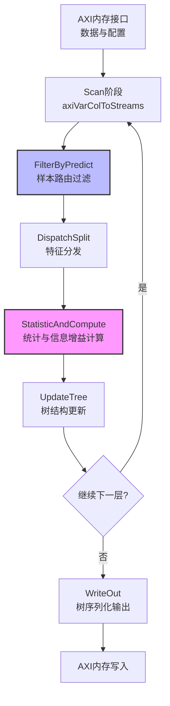

# 量化随机森林分类树模块 (classification_rf_trees_quantize)

## 概述

想象你正在建造一座高速收费站，需要让数千辆车同时通过，每辆车都要根据车牌、车型、载重等多个维度被快速分流到不同车道。传统的CPU做法是让一个工作人员依次检查每辆车，而在FPGA这个"硬件收费站"中，我们建造了多条并行的流水线，让数据像水流一样持续流过不同的处理单元。

这个模块正是实现了这样的**硬件加速决策树训练引擎**。它使用Xilinx HLS（高层次综合）技术，将随机森林中的决策树训练过程转化为硬件电路。与软件实现不同，这里每一条指令都对应着真实的硬件逻辑门和寄存器。模块名称中的"quantize"（量化）是其核心特性——它使用8位无符号整数索引来代表分裂阈值，而非完整的32位浮点数，这大幅降低了内存带宽需求和计算复杂度，使得在FPGA有限的资源内能够并行处理更多数据。

## 架构设计

### 系统架构图



### 核心数据流

整个训练过程采用**广度优先（Breadth-First）**的策略逐层构建决策树，而非传统的深度优先递归。这种设计是为了最大化硬件并行度——同一层的所有节点可以共享数据扫描逻辑，同时处理多个候选分裂点。

数据流的核心是**三级流水线**:

1. **扫描与过滤阶段 (Scan + FilterByPredict)**: 数据从外部DDR内存通过AXI总线流入，被转换为内部流式格式。`FilterByPredict`像一个智能筛子，根据当前树结构将样本路由到对应的叶节点候选区域。只有落在当前处理节点范围内的样本才会被传递到下一阶段。

2. **分发与统计阶段 (DispatchSplit + StatisticAndCompute)**: 这是计算最密集的部分。`DispatchSplit`将样本的特征值分发到对应的分裂候选维度。`StatisticAndCompute`维护着一个巨大的计数矩阵`num_in_cur_nfs_cat`，记录每个（节点，分裂点，类别）组合的出现频次。基于这些统计量，它并行计算所有候选分裂的信息增益（使用Gini不纯度或熵），找出最优分裂特征和阈值。

3. **更新与序列化阶段 (UpdateTree + WriteOut)**: `UpdateTree`根据计算出的最佳分裂参数更新树结构，生成新的左右子节点。当整棵树构建完成后，`WriteOut`将分散在各层的节点数据重新组织，压缩成连续的AXI流写入外部内存。

### 关键组件详解

#### Node 结构体

```cpp
struct Node {
    ap_uint<72> nodeInfo;    // 节点元信息：包含子节点指针、特征ID、叶节点标记
    ap_uint<64> threshold;   // 分裂阈值：低8位为量化值，高8位为浮点索引
};
```

`Node`是树的基本构建块，设计为紧凑的位域结构以适应FPGA的URAM（UltraRAM）资源。`nodeInfo`采用自定义编码：最高位表示是否为叶节点，中间字段存储左右子节点在下一层的索引，低位存储分裂特征ID。

#### predict 函数

```cpp
template <typename MType, unsigned WD, unsigned MAX_FEAS, 
          unsigned MAX_TREE_DEPTH, unsigned dupnum>
void predict(ap_uint<WD> onesample[dupnum][MAX_FEAS],
             struct Node nodes[MAX_TREE_DEPTH][MAX_NODES_NUM], ...)
```

这是一个纯组合逻辑函数（标记为`#pragma HLS inline`），用于在训练过程中将样本路由到当前处理的叶节点。它沿着树的路径逐层比较特征值与阈值，本质上是一个小型状态机。输入样本被复制多份（`dupnum`）以支持并行访问不同特征。

#### statisticAndCompute 函数

这是模块中最复杂的计算核心，实现了**直方图统计与信息增益计算**的融合。其关键设计包括：

1. **URAM-backed 直方图**: 使用`num_in_cur_nfs_cat[MAX_SPLITS+1][PARA_NUM*MAX_CAT_NUM]`数组存储统计量，绑定到URAM（`bind_storage type = ram_2p impl = uram`），提供高带宽、大容量的片上存储。

2. **8-Entry 局部缓存**: 使用`cache_nid_cid[8]`和`cache_elem[8]`实现最近最少使用（LRU）缓存，减少对URAM的随机访问。因为样本通常按节点聚集，时间局部性很高。

3. **并行增益计算**: 在统计完成后，使用三重嵌套循环并行计算所有（节点，分裂点）组合的信息增益。采用`cyclic factor = 2`的数组分区策略平衡资源与并行度。

4. **早停与约束检查**: 集成叶节点大小检查、纯度检查、深度限制等停止条件，避免无效计算。

#### decisionTreeFlow 函数

这是**数据流架构**的 orchestrator，使用`#pragma HLS dataflow`启动任务级并行（Task-Level Parallelism）。它将整个训练流程分解为5个并行的数据流进程：

1. `Scan`: 从AXI读取数据并解析为列流
2. `FilterByPredict`: 根据当前树结构过滤样本
3. `DispatchSplit`: 分发特征到分裂计算单元
4. `Count` (statisticAndCompute): 计算统计量和最佳分裂
5. `Update` (隐含在control flow中): 更新树结构

这些进程通过`hls::stream`进行通信，形成流水线。当`Scan`读取第N批数据时，`FilterByPredict`处理第N-1批，`Count`计算第N-2批的统计，实现吞吐率最大化。

## 依赖关系与接口

### 上游依赖（调用本模块）

本模块位于`data_analytics_text_geo_and_ml` -> `tree_based_ml_quantized_models_l2`层级，通常由更高层的随机森林封装器调用。在典型的使用流程中：

1. **数据准备层**: 外部系统（如Python脚本或C++主机代码）将训练数据转换为AXI兼容的格式（512位对齐的`ap_uint<512>`数组），包含样本特征、标签和配置头。

2. **配置解析**: `readConfig`函数解析数据头部，提取类别数、样本数、特征数、分裂点数量等超参数，以及量化的分裂阈值表。

3. **树构建循环**: 外部控制器（未在此模块中）可能重复调用`DecisionTreeQT_*`函数来构建多棵树（随机森林），每次使用不同的数据子采样或特征子集（通过`featureSubsets`传入）。

### 下游依赖（本模块调用）

本模块依赖以下外部组件提供基础功能：

1. **[decision_tree_quantize](../classification_decision_tree_quantize/README.md)**: 提供量化相关的类型定义和基础操作，如`Paras`结构体、量化/反量化转换函数。

2. **[decision_tree_train](../classification_decision_tree_train/README.md)**: 提供训练相关的共享定义，如`Node`结构体、INVALID_NODEID常量、树遍历算法。

3. **[table_sample](../../common/table_sample.md)**: 提供数据采样和表格处理的基础工具，用于特征子集生成和数据预处理。

4. **[axi_to_stream](../../../../../utils_hw/xf_utils_hw/axi_to_stream.md)**: 关键的数据搬运工具，提供`axiToStream`和`axiVarColToStreams`函数，将AXI总线数据转换为HLS流（`hls::stream`），实现高效的内存到流转换。

5. **HLS标准库**: 大量使用`hls::stream`、`ap_uint`、`ap_fixed`等HLS特定的数据类型和库函数。

### 数据契约与接口规范

#### 输入数据布局 (AXI接口)

输入`data`数组是一个连续的512位字数组，布局如下：

| 偏移 (512-bit words) | 内容 | 格式 |
|---------------------|------|------|
| 0 | **配置头** | samples_num[29:0], features_num[39:32], numClass[71:64], para_splits[127:96] |
| 1 | **超参数** | cretiea[31:0], maxBins[63:32], max_tree_depth[95:64], min_leaf_size[127:96], min_info_gain[159:128], max_leaf_cat_per[191:160] |
| 2-... | **各特征分裂数** | 每个字节表示一个特征的分裂点数量 |
| ... | **量化分裂阈值** | 连续的TWD位宽值，表示各特征各分裂点的量化阈值索引 |
| +30 | **特征子集配置** | 后续由readFeaSubets读取的特征选择掩码 |
| data_header_len (1024) | **样本数据开始** | 实际的训练样本特征和标签数据，按列存储 |

**关键约束**：
- 数据必须以64字节（512位）对齐
- 样本数据采用列式存储而非行式存储，以优化特征扫描时的内存带宽
- 类别标签必须位于最后一列

#### 输出数据布局 (Tree结构)

输出`tree`数组存储序列化后的决策树节点：

| 字段偏移 (bits) | 内容 | 说明 |
|----------------|------|------|
| 0-31 | nodes_num | 总节点数 |
| 256*i + 71..0 (i为偶数) | nodeInfo | 第i个节点的元信息（子节点指针、特征ID、叶标记） |
| 256*i + 255..192 | threshold | 第i个节点的分裂阈值（64位浮点） |

**节点编码细节 (nodeInfo)**:
- bit 0: 是否为叶节点 (1=叶节点)
- bits 8-15: 如果是叶节点，存储类别ID；否则存储分裂特征ID
- bits 32-71: 左子节点索引（右子节点为索引+1）

#### 类型与常量定义

```cpp
// 关键模板参数 (实例化时确定)
MAX_FEAS_ = 128;        // 最大特征数
MAX_SPLITS_ = 256;      // 最大分裂点数
MAX_CAT_NUM_ = 16;      // 最大类别数
MAX_TREE_DEPTH_ = 16;   // 最大树深度
PARA_NUM_ = 4;          // 并行处理的节点数

// 核心类型
using DataType = float;                    // 浮点阈值类型
using ap_uint<W> = unsigned int;          // W位无符号整数 (HLS类型)
struct Node { ap_uint<72> nodeInfo; ap_uint<64> threshold; };
```

## 设计权衡与决策

### 1. 广度优先 vs 深度优先构建

**决策**: 采用广度优先（逐层）构建策略，而非传统的递归深度优先。

**理由**: 
- **硬件并行性**: 同一层的节点可以共享数据扫描逻辑，同时计算多个节点的统计量。`PARA_NUM`参数允许同时处理多个兄弟节点。
- **内存局部性**: 层内节点的样本访问模式相似，有利于数据复用和缓存命中。
- **流式处理**: 深度优先需要维护复杂的调用栈状态，而广度优先天然适合HLS的`dataflow`架构，各阶段通过FIFO连接形成流水线。

**代价**: 需要额外的内存来存储整层的节点状态（`nodes`数组使用URAM），且必须等待整层所有节点处理完成后才能进入下一层，增加了延迟但提高了吞吐。

### 2. 量化阈值 (Quantized Splits)

**决策**: 使用8位无符号整数(`ap_uint<8>`)索引表示分裂阈值，而非直接存储32位浮点数。

**理由**:
- **内存带宽**: 训练过程中需要频繁比较特征值与阈值。使用8位索引可将特征值与阈值的比较转化为查找表操作，大幅减少内存访问带宽。
- **资源节省**: FPGA的DSP48资源有限，整数比较比浮点比较节省逻辑资源。
- **精度可控**: 通过`TType`（通常是float）存储实际阈值值，在最终输出时反量化，保证模型精度。

**实现细节**:
- `splits_uint8[MAX_SPLITS]`存储量化后的阈值索引
- `splits_float[MAX_SPLITS]`存储对应的实际浮点值，仅用于最终输出和调试
- 比较时，特征值先量化为相同离散空间中的索引，然后执行整数比较

**代价**: 量化引入了离散化误差，可能降低单棵树的精度，但随机森林通过集成学习可以补偿这一损失。

### 3. 数据流架构 (Dataflow Architecture)

**决策**: 使用`#pragma HLS dataflow`构建细粒度流水线，而非单函数顺序执行。

**理由**:
- **吞吐率最大化**: 当Scan阶段读取第N个数据块时，FilterByPredict处理第N-1块，StatisticAndCompute计算第N-2块的统计，形成三级流水线，理论吞吐率提升3倍。
- **资源平衡**: 各阶段可以独立优化。计算密集的StatisticAndCompute可以使用更多DSP和URAM，而I/O密集的Scan阶段优化内存接口。
- **死锁避免**: HLS自动插入必要的FIFO缓冲（通过`#pragma HLS stream`指定深度），协调各阶段速度差异。

**流水线阶段说明**:
```cpp
// Stage 1: 内存 -> 流
Scan: axiVarColToStreams(data, ..., dstrm_batch, estrm_batch);

// Stage 2: 流过滤
FilterByPredict(dstrm_batch, estrm_batch, ..., dstrm_batch_disp, nstrm_disp);

// Stage 3: 特征分发
DispatchSplit(dstrm_batch_disp, nstrm_disp, ..., dstrm, nstrm, estrm);

// Stage 4: 统计计算
Count: statisticAndCompute(dstrm, nstrm, estrm, ..., ifstop, max_classes, ...);
```

**约束**: 各阶段必须通过FIFO流通信，不能随机访问共享内存。这要求算法设计必须流式友好，不能依赖随机访问历史数据。

### 4. 内存架构优化 (URAM vs BRAM)

**决策**: 大量使用`bind_storage type = ram_2p impl = uram`将关键数组映射到URAM（UltraRAM），而非BRAM。

**理由**:
- **容量**: 现代FPGA（如Alveo U50/U200）的URAM总容量远大于BRAM（例如XCU50有640个URAM，每个4K×72bit = 288Kb，总计180Mb BRAM等效）。决策树训练需要存储大量中间统计量（`num_in_cur_nfs_cat`数组大小为`MAX_SPLITS × PARA_NUM × MAX_CAT_NUM`），URAM是唯一可行的片上存储方案。
- **双端口访问**: `ram_2p`（true dual-port）允许同时读写，支持数据流架构中 producer-consumer 模式的高并发访问。
- **功耗与面积**: URAM比BRAM更面积高效，适合大容量、中等带宽的存储需求。

**关键URAM数组**:
- `num_in_cur_nfs_cat[MAX_SPLITS+1][PARA_NUM*MAX_CAT_NUM]`: 存储各分裂点、各类别的样本计数，是信息增益计算的基础。
- `clklogclk`/`crklogcrk`: 存储中间计算结果，避免重复计算对数。
- `nodes[MAX_TREE_DEPTH][MAX_NODES_NUM]`: 存储树结构，分层存储以优化访问模式。

**代价**: URAM数量有限且分布固定，过度使用可能导致布局布线拥塞。代码中通过`array_partition`和`cyclic`分布策略确保URAM并行访问效率。

### 5. 任务级并行 (PARA_NUM)

**决策**: 引入`PARA_NUM`模板参数，允许同时并行处理多个树节点（或同一层内的多个样本批次）。

**理由**:
- **节点级并行**: 在决策树的一层中，不同节点的样本统计是独立的。通过`PARA_NUM=4`，可以同时计算4个候选节点的最佳分裂，理论加速比接近4倍。
- **资源复用**: 计算单元的逻辑资源（DSP、LUT）被时分复用，但通过`unroll`和`array_partition`指令，HLS可以复制硬件实例实现真并行。
- **负载均衡**: 当树的一层节点数少于`PARA_NUM`时，通过`e_nodeid = (e_nodeid_ < e_nodeid) ? e_nodeid_ : e_nodeid`动态调整实际处理的节点数，避免无效计算。

**实现细节**:
```cpp
for (int j = 0; j < layer_nodes_num[tree_dp]; j += PARA_NUM_) {
    unsigned e_nodeid = s_nodeid + PARA_NUM_;
    e_nodeid = (e_nodeid_ < e_nodeid) ? e_nodeid_ : e_nodeid; // 边界处理
    
    // 并行处理 s_nodeid 到 e_nodeid 的节点
    decisionTreeFun(...);
    s_nodeid = s_nodeid + PARA_NUM_;
}
```

**代价**: `PARA_NUM`的增加直接导致URAM和DSP使用量线性增长（因为每个并行单元需要独立的统计数组`num_in_cur_nfs_cat`）。必须在并行度与FPGA资源之间权衡，通常设置为2、4或8。

## 使用指南与注意事项

### 典型调用流程

```cpp
// 1. 准备数据缓冲区 (512位对齐)
ap_uint<512> data[DATASIZE];  // 包含配置头和样本数据
ap_uint<512> tree[TREE_SIZE]; // 输出缓冲区

// 2. 填充配置 (前30个512-bit words)
// word 0: samples_num | features_num | numClass | para_splits
// word 1: cretiea | maxBins | max_tree_depth | min_leaf_size | min_info_gain | max_leaf_cat_per
// words 2+: numSplits per feature, then quantized splits, then feature subsets

// 3. 调用决策树训练核函数
DecisionTreeQT_0(data, tree);

// 4. 解析输出树结构
// tree[0].range(31,0) = total nodes
// tree[1..] = serialized Node structures (256-bit each, 2 nodes per 512-bit word)
```

### 关键约束与前置条件

1. **内存对齐**: 输入`data`和输出`tree`指针必须64字节（512位）对齐。未对齐访问将导致总线错误或性能灾难性下降。

2. **量化参数一致性**: `splits_uint8`（量化索引）和`splits_float`（实际浮点值）必须一一对应，且`numSplits`数组准确描述每个特征的分裂点数量。任何不匹配将导致错误的分裂决策。

3. **资源限制**: 
   - `MAX_TREE_DEPTH`、`MAX_NODES_NUM`、`MAX_SPLITS`等模板参数必须在编译时确定，且受限于目标FPGA的URAM/BRAM总量。
   - `PARA_NUM`（并行度）增加会线性消耗DSP和LUT资源，需综合后检查资源利用率（通常目标<80%以留出布线余量）。

4. **数据范围**: 
   - `samples_num`必须小于2^30（约10亿），由`ap_uint<30>`类型限制。
   - `features_num`必须小于256（2^8），由`ap_uint<8>`限制。
   - `numClass`必须小于256。

### 常见陷阱与调试建议

1. **HLS综合失败 - 时序违例**: 
   - **症状**: 综合报告提示关键路径延迟过大（>时钟周期）。
   - **根因**: `statisticAndCompute`中的`compute_gain_loop_gainratio`三层嵌套循环可能产生复杂的乘法器链（`l_cat_k * l_cat_k`）。
   - **解决**: 减少`PARA_NUM`或降低目标频率；使用`#pragma HLS pipeline II=2`允许2周期间隔而非1周期。

2. **仿真结果与软件实现不一致**:
   - **症状**: FPGA输出的树结构与CPU实现的决策树不同，准确率差异大。
   - **根因1**: **浮点精度陷阱**。`statisticAndCompute`中使用`double`计算`cretia`（信息增益），而硬件可能使用不同精度或运算顺序。
   - **根因2**: **量化映射错误**。`splits_float`到`splits_uint8`的映射在主机端和FPGA端不一致，导致比较阈值偏差。
   - **调试**: 启用`#ifndef __SYNTHESIS__`块中的`printf`语句，对比硬件仿真与软件参考实现每一步的统计量（`num_in_cur_nfs_cat`）和增益值。

3. **死锁（Deadlock）在Dataflow中**:
   - **症状**: 仿真或硬件执行时挂起，无输出。
   - **根因**: `hls::stream`深度设置不当。如果生产速率持续大于消费速率，且stream深度不足以缓冲波动，将导致背压传播至源头，最终填满所有缓冲区并死锁。
   - **解决**: 增加关键stream的深度（`#pragma HLS stream variable = dstrm_batch depth = 256`），确保深度大于数据突发（burst）大小。

4. **资源利用率爆炸（URAM超额）**:
   - **症状**: 综合报告URAM利用率>100%，或布局布线失败。
   - **根因**: `num_in_cur_nfs_cat`数组过大。其大小为`(MAX_SPLITS+1) * PARA_NUM * MAX_CAT_NUM * 4 bytes`（32位整数）。若`MAX_SPLITS=256, PARA_NUM=8, MAX_CAT_NUM=16`，则大小为`257*8*16*4=131KB`，每个URAM为288Kb(36KB)，需要约4个URAM。但如果MAX_SPLITS增加到1024，资源需求线性增长。
   - **解决**: 减小`MAX_SPLITS`或`PARA_NUM`；使用`ap_uint<20>`替代`int`存储计数（如果样本数<2^20）以减少位宽；启用URAM的乒乓缓冲（double buffering）复用资源。

## 性能优化指南

### 针对Alveo U50/U280的调优建议

1. **HBM内存使用**: 如果目标平台是高带宽存储器（HBM）设备，修改接口pragma以使用HBM端口而非标准DDR：
   ```cpp
   #pragma HLS INTERFACE m_axi port = data bundle = gmem0_0 
       num_read_outstanding = 32 max_read_burst_length = 64
   ```
   增加`num_read_outstanding`以利用HBM的高并发能力。

2. **数据类型优化**: 如果特征值为整数（如图像像素0-255），将`WD`（数据宽度）从32位改为8位或16位，可以翻倍有效内存带宽，并允许更宽的数据路径并行处理（`_WAxi/WD`增加）。

3. **自定义指令集**: 对于Zynq或Versal设备，可以通过`#pragma HLS bind_op`绑定特定的DSP实现，或使用`#pragma HLS inline region`强制内联关键循环以允许跨循环优化。

### 吞吐量与延迟权衡

- **高吞吐（推荐）**: 保持`dataflow`架构，接受较高的初始延迟（填充流水线时间），换取每周期处理一个样本的持续吞吐。适用于大数据集离线训练。
  
- **低延迟（在线学习）**: 如果需要在FPGA上实现实时增量学习，需重构代码移除`dataflow`，使用`pipeline II=1`的单循环设计，并减少`MAX_SPLITS`和`PARA_NUM`以降低逻辑深度。但会显著降低吞吐能力。

## 参考文献与延伸阅读

- [Decision Tree Quantize 模块](../classification_decision_tree_quantize/README.md) - 量化类型定义与基础操作
- [Decision Tree Train 模块](../classification_decision_tree_train/README.md) - 训练算法与树结构定义
- [Table Sample 工具](../../common/table_sample.md) - 数据采样与预处理
- [AXI to Stream 转换器](../../../../../utils_hw/xf_utils_hw/axi_to_stream.md) - 内存接口适配层
- **Xilinx HLS文档**: 了解`ap_uint`、`hls::stream`、`dataflow`、`array_partition`等关键pragma的详细语义与约束。
