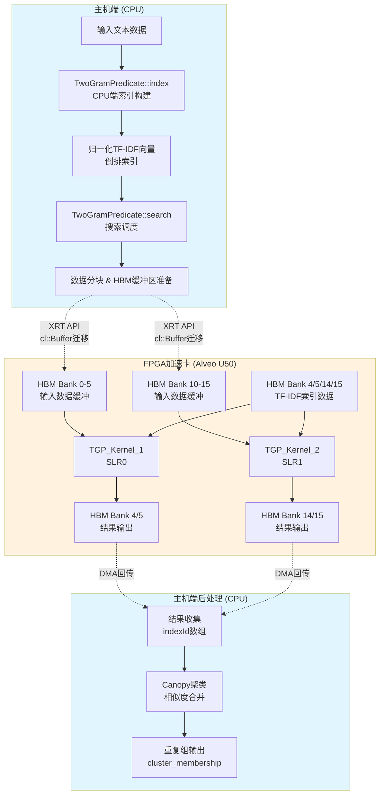

# duplicate_text_match_demo_l2 模块深度解析

## 一句话概括

这是一个**FPGA加速的模糊文本去重系统**，能够在海量记录中快速找出"相似但不必完全相同"的重复项——就像一位经验丰富的档案管理员，即使面对拼写变体、缩写或格式差异，也能准确识别出属于同一实体的记录。

---

## 问题空间与设计动机

### 我们到底在解决什么问题？

想象你正在处理一个客户数据库，里面有这样的记录：

| 记录ID | 公司名称 | 地址 |
|--------|----------|------|
| 001 | "Xilinx Inc." | "2100 Logic Dr, San Jose" |
| 002 | "xilinx incorporated" | "2100 Logic Drive, San Jose, CA" |
| 003 | "Xlnx Corp" | "2100 Logic Drive" |

**传统的精确匹配完全失效**——这些明显指向同一实体的记录，在字符串层面却差异显著。数据清洗中的这种"模糊重复"问题，在以下场景尤为突出：

- **企业数据整合**：并购后的多系统数据融合
- **客户关系管理 (CRM)**：识别同一客户的多个触点记录
- **欺诈检测**：发现刻意伪装的重复身份
- **数据治理**：大规模数据湖的质量提升

### 为什么需要硬件加速？

朴素算法的复杂度是 $O(n^2 \cdot m)$（$n$ 为记录数，$m$ 为字段长度），当 $n$ 达到百万级时，这变得完全不可接受。即使在现代CPU上，对100万条记录两两比较也需要数小时。

**核心洞察**：模糊匹配的计算本质是大规模向量相似度计算——这正是FPGA的数据并行架构最擅长的工作负载。

---

## 核心概念与心智模型

### 类比：指纹识别系统

想象这个系统是一套**自动指纹识别系统 (AFIS)**：

| 指纹识别概念 | 我们的文本去重系统 | 技术实现 |
|------------|-------------------|----------|
| 指纹特征点 (minutiae) | 2-gram 片段 | 将文本拆分为连续2字符组合 |
| 指纹模板 | 归一化TF-IDF向量 | 计算每个2-gram的加权重要性 |
| 指纹比对 | 余弦相似度计算 | 向量点积 / (模长乘积) |
| 指纹档案库 | 倒排索引 (Inverted Index) | 从2-gram快速定位候选记录 |
| 匹配阈值 | 相似度阈值 (0.8) | 判定为重复的门限 |

### 核心抽象：Canopy 聚类

**关键洞察**：我们不需要比较所有记录对。如果记录A和B相似，B和C相似，那么A和C很可能也相似——这是一种**传递性近似**。

**Canopy 聚类**策略：
1. 选择一个中心记录作为"canopy"（伞盖）
2. 将所有相似度超过阈值的记录归入此canopy
3. 从候选集中移除已归类的记录（或标记为已覆盖）
4. 重复直到所有记录都被覆盖

**效果**：将 $O(n^2)$ 的比较降为 $O(n \cdot k)$，其中 $k$ 是平均每个canopy覆盖的记录数（通常 $k \ll n$）。

---

## 架构全景



### 模块角色定位

在更大的 `data_analytics_text_geo_and_ml` 体系中，本模块承担**L2级演示 (Level-2 Demo)** 的角色：

| 特性 | 说明 |
|------|------|
| **抽象层级** | L2（功能演示层），介于底层L1内核与完整L3应用之间 |
| **核心功能** | 文本去重（模糊匹配 + 聚类） |
| **硬件平台** | Xilinx Alveo U50 (HBM2e 加速卡) |
| **加速方式** | 主机预处理 + FPGA并行相似度计算 |
| **目标用户** | 需要集成文本去重能力的应用开发者 |

### 子模块职责划分

```
duplicate_text_match_demo_l2/
├── kernel_connectivity/          # FPGA内核连接配置 (conn_u50.cfg)
│   └── TGP_Kernel_1, TGP_Kernel_2  # 双计算单元配置
├── host_predicate_logic/         # 主机端谓词处理 (dm/predicate.cpp)
│   ├── TwoGramPredicate::index()   # 倒排索引构建
│   ├── TwoGramPredicate::search()  # FPGA内核调用
│   └── TF-IDF 向量计算
└── host_application/             # 应用入口 (main.cpp)
    ├── 命令行参数解析
    ├── DupMatch 工作流编排
    └── 结果验证与计时
```

---

## 关键设计决策与权衡

### 1. 2-gram vs. 词级 (Word-level) 分词

**选择的方案**：2-gram（连续2字符组合）

```cpp
// 示例："Xilinx" → "Xi", "il", "li", "in", "nx"
void TwoGramPredicate::twoGram(std::string& inStr, std::vector<uint16_t>& terms) {
    for (int i = 0; i < inStr.size(); i += 2) {
        uint16_t term = charEncode(inStr[i]) + charEncode(inStr[i + 1]) * 64;
        terms.push_back(term);
    }
}
```

**权衡分析**：

| 维度 | 2-gram | 词级分词 |
|------|--------|----------|
| **容错性** | ✅ 高（"Xilinx"/"xlinx" 共享大量2-gram） | ❌ 低（拼写错误即失配） |
| **语义理解** | ❌ 弱（无词汇边界信息） | ✅ 强（保留词义） |
| **索引大小** | ⚠️ 中等（~|text|个2-gram） | ✅ 较小（~|words|个词） |
| **计算效率** | ✅ 适合FPGA（固定长度、并行友好） | ⚠️ 变长处理复杂 |

**为何2-gram更适合本场景**：数据清洗场景的核心是"找到可能的重复"而非"理解语义"，容错性优先于语义精度。此外，2-gram的固定长度特性使其在FPGA上易于并行化处理。

### 2. CPU预处理 + FPGA加速 的混合架构

**架构选择**：

```
CPU端 (复杂控制流):          FPGA端 (数据并行):
┌─────────────────────┐      ┌─────────────────────┐
│  文本清洗 & 归一化    │      │  大规模向量点积计算  │
│  倒排索引构建        │      │  相似度评分并行化   │
│  TF-IDF权重计算      │      │  高吞吐结果输出     │
│  调度与数据分块       │      │                     │
└─────────────────────┘      └─────────────────────┘
        │                              ▲
        │  HBM (High Bandwidth Memory)   │
        └──────────────────────────────┘
```

**关键权衡**：

| 任务 | 分配 | 理由 |
|------|------|------|
| **倒排索引构建** | CPU | 涉及复杂哈希表操作和动态内存分配，不适合FPGA的静态调度模型 |
| **TF-IDF归一化** | CPU | 需要浮点sqrt和log运算，且数据量小（仅词汇表大小） |
| **向量相似度计算** | FPGA | 大规模并行点积，计算密集且数据并行，FPGA可提供10-100x加速 |
| **Canopy聚类** | CPU | 涉及图遍历和动态阈值判断，控制流复杂 |

### 3. HBM存储层次与双CU设计

**连接配置分析** (来自 `conn_u50.cfg`)：

```ini
# TGP_Kernel_1 (位于SLR0)
sp=TGP_Kernel_1.m_axi_gmem0:HBM[0]   # 字段数据缓冲区
sp=TGP_Kernel_1.m_axi_gmem1:HBM[1]   # 偏移量表
sp=TGP_Kernel_1.m_axi_gmem2:HBM[2]   # IDF权重表
sp=TGP_Kernel_1.m_axi_gmem3:HBM[3]   # TF地址索引
sp=TGP_Kernel_1.m_axi_gmem4:HBM[4]   # TF值表
sp=TGP_Kernel_1.m_axi_gmem8:HBM[5]   # 结果输出

# TGP_Kernel_2 (位于SLR1) - 对称配置
sp=TGP_Kernel_2.m_axi_gmem0:HBM[10]  # 独立的HBM bank集合
...
slr=TGP_Kernel_1:SLR0
slr=TGP_Kernel_2:SLR1
nk=TGP_Kernel:2:TGP_Kernel_1.TGP_Kernel_2  # 2个CU实例
```

**设计决策解读**：

```
Alveo U50 HBM架构:
┌─────────────────────────────────────────────┐
│  HBM Stack (8GB, 460GB/s aggregate BW)     │
│  ├── Bank 0-7 (SLR0区域, 靠近TGP_Kernel_1)  │
│  └── Bank 8-15 (SLR1区域, 靠近TGP_Kernel_2) │
└─────────────────────────────────────────────┘
                    │
┌───────────────────┼─────────────────────────┐
│                   ▼                         │
│  SLR0: ┌──────────────┐  SLR1: ┌──────────────┐ │
│        │TGP_Kernel_1  │        │TGP_Kernel_2  │ │
│        │ (CU #0)      │        │ (CU #1)      │ │
│        └──────────────┘        └──────────────┘ │
│                   PCIe                    │
└───────────────────┬─────────────────────────┘
                    ▼
              Host CPU Memory
```

**关键权衡**：

| 设计选择 | 优势 | 代价 |
|----------|------|------|
| **双CU (2 Compute Units)** | 2x理论吞吐；可并行处理不同数据分片 | 2x资源消耗；更复杂的调度逻辑 |
| **SLR分离放置** | 更好的路由时序；利用U50的两个Super Logic Region | 跨SLR通信延迟略增 |
| **HBM Bank专用映射** | 最大化内存带宽；避免bank冲突 | 固定分区降低灵活性；需手动负载均衡 |
| **Host端数据分块 (blk_sz)** | 隐藏传输延迟；流水线化 | 需要2x内存缓冲 (ping-pong) |

---

## 数据流详解：端到端处理流程

### 阶段1：索引构建 (CPU端)

```cpp
// predicate.cpp - TwoGramPredicate::index()
void index(const std::vector<std::string>& column) {
    // Step 1: 去重与规范化
    // "Xilinx Inc." → "xilinxinc" (小写、去空格、去标点)
    std::string pre_str = preTwoGram(line_str);
    
    // Step 2: 2-gram切分
    // "xilinxinc" → ["xi", "il", "ln", "nx", "xi", "in", "nc"]
    twoGram(pre_str, terms);
    
    // Step 3: 构建倒排索引
    // term → [(doc_id, tf-idf_weight), ...]
    // 高频词 (> threshold) 被过滤以减少噪声
    
    // Step 4: 计算IDF (Inverse Document Frequency)
    // idf = log(1 + N / df)  // N=总文档数, df=出现该词的文档数
}
```

**关键数据结构**：

```cpp
// 内存中的索引结构
struct InvertedIndex {
    // IDF表: 4096个可能的2-gram → 权重
    double idf_value_[4096];
    
    // TF地址索引: 编码 (begin_addr | end_addr << 31)
    uint64_t tf_addr_[4096];
    
    // TF值表: 变长数组 [(doc_id, tf_weight), ...]
    // 存储为交错uint64_t: [doc_id_low, doc_id_high|weight_float]
    uint64_t tf_value_[TFLEN];
};
```

### 阶段2：FPGA内核调用与数据准备

```cpp
// search() 方法 - 准备数据并启动FPGA
void search(std::string& xclbinPath, std::vector<std::string>& column, uint32_t* indexId[2]) {
    // Step 1: 数据分块 (双CU负载均衡)
    // column[0..N] → CU#0处理[0..N/2), CU#1处理[N/2..N)
    uint32_t blk_sz = column.size() / CU;  // CU=2
    
    // Step 2: 内存对齐分配 (XRT要求)
    for (int i = 0; i < CU; i++) {
        fields[i] = aligned_alloc<uint8_t>(BS);      // 字段数据 (BS=16MB)
        offsets[i] = aligned_alloc<uint32_t>(RN);   // 偏移量表 (RN=2M)
    }
    
    // Step 3: 数据序列化
    // 变长字符串 → 扁平字节数组 + 偏移量表
    // ["hello", "world"] → bytes["helloworld"] + offsets[5, 10]
    
    // Step 4: XRT运行时初始化
    cl::Context context(device);
    queue_ = new cl::CommandQueue(context, device, CL_QUEUE_PROFILING_ENABLE);
    
    // Step 5: 加载xclbin并创建内核
    cl::Program::Binaries xclBins = xcl::import_binary_file(xclbinPath);
    cl::Program program(context, devices, xclBins);
    PKernel[0] = cl::Kernel(program, "TGP_Kernel:{TGP_Kernel_1}");
    PKernel[1] = cl::Kernel(program, "TGP_Kernel:{TGP_Kernel_2}");
    
    // Step 6: 创建HBM扩展缓冲区 (零拷贝映射)
    for (int i = 0; i < CU; i++) {
        // 使用CL_MEM_EXT_PTR_XILINX实现主机内存与HBM的映射
        mext_o[i][0] = {1, fields[i], PKernel[i]()};  // flags=1, 指向主机内存
        buff[i][0] = cl::Buffer(context, CL_MEM_EXT_PTR_XILINX | CL_MEM_USE_HOST_PTR, ...);
        // 同样配置其他缓冲区: offsets, idf_value_, tf_addr_, tf_value_
    }
    
    // Step 7: 设置内核参数
    for (int i = 0; i < CU; i++) {
        PKernel[i].setArg(0, config[i]);      // 标量配置参数
        PKernel[i].setArg(1, buff[i][0]);     // m_axi_gmem0
        PKernel[i].setArg(2, buff[i][1]);     // m_axi_gmem1
        // ... 其他m_axi端口
    }
    
    // Step 8: 命令队列提交 (3阶段流水线)
    // 阶段1: H2D (Host to Device) 内存迁移
    queue_->enqueueMigrateMemObjects(ob_in, 0, nullptr, &events_write[0]);
    // 阶段2: 内核启动 (依赖H2D完成)
    for (int i = 0; i < CU; i++) {
        queue_->enqueueTask(PKernel[i], &events_write, &events_kernel[i]);
    }
    // 阶段3: D2H (Device to Host) 结果回传 (依赖内核完成)
    queue_->enqueueMigrateMemObjects(ob_out, 1, &events_kernel, &events_read[0]);
}
```

### 阶段3：结果后处理与Canopy聚类

```cpp
// WordPredicate::search() - 在predicate.cpp中
void search(std::vector<std::string>& column, std::vector<uint32_t>& indexId) {
    // 初始化: canopy数组记录每个文档归属的簇中心
    std::vector<int> canopy(doc_to_id_.size(), -1);
    indexId.resize(column.size());
    
    for (int i = 0; i < column.size(); i++) {
        // Step 1: 分词与规范化
        splitWord(line_str, terms, s_str);
        uint32_t doc_id = doc_to_id_[s_str];
        
        // Step 2: 检查是否已被某个canopy覆盖
        if (canopy[doc_id] == -1) {
            // 新canopy中心: 计算与所有候选的相似度
            
            // Step 3: 获取文档的词汇ID列表
            std::vector<uint32_t> vec_wid = getTermIds(terms);
            std::sort(vec_wid.begin(), vec_wid.end());
            
            // Step 4: 合并倒排列表计算相似度 (FPGA加速的核心)
            // 对于每个term, 获取包含该term的文档列表及其TF权重
            // 相似度 = sum(tf-idf(term) for common terms)
            double threshold = calculateThreshold(vec_wid);
            
            // Step 5: 合并多个倒排列表 (使用堆或k-way merge)
            // 这里使用FPGA加速的向量点积计算
            std::vector<std::vector<udPT>> tf_value_l = gatherTfVectors(vec_wid);
            
            // Step 6: k-way merge并筛选超过阈值的文档
            // 如果tf_value_l.size() >= 2, 使用merge-tree结构
            // 否则直接遍历单列表
            std::vector<uint32_t> canopy_members = kWayMergeAndFilter(
                tf_value_l, threshold, canopy, doc_id
            );
            
            // Step 7: 标记归属关系
            if (canopy_members.empty()) {
                indexId[i] = -1;  // 无匹配,孤立点
            } else {
                indexId[i] = doc_id;  // 作为簇中心
            }
        } else {
            // 已被其他canopy覆盖
            indexId[i] = canopy[doc_id];
        }
    }
}
```

---

## 关键子模块详解

本模块的三个子模块分别负责不同的系统层面：

### [kernel_connectivity](data_analytics_text_geo_and_ml-duplicate_text_match_demo_l2-kernel_connectivity.md)

**职责**：定义FPGA内核与HBM存储系统的物理连接关系。

**核心内容**：
- TGP_Kernel_1 与 TGP_Kernel_2 的双计算单元配置
- m_axi_gmem 端口到 HBM bank 的映射策略
- SLR (Super Logic Region) 放置约束

**为何重要**：错误的连接配置会导致内核无法布放 (placement failure) 或运行时内存访问冲突。

---

### [host_predicate_logic](data_analytics_text_geo_and_ml-duplicate_text_match_demo_l2-host_predicate_logic.md)

**职责**：主机端的文本预处理、索引构建与搜索谓词实现。

**核心内容**：
- `TwoGramPredicate` 类：2-gram分词与倒排索引
- `WordPredicate` 类：词级分词与Canopy聚类
- TF-IDF权重计算与归一化
- XRT (Xilinx Runtime) API封装

**为何重要**：这是CPU与FPGA的"翻译层"——将业务文本转换为FPGA可高效处理的数值向量。

---

### [host_application](data_analytics_text_geo_and_ml-duplicate_text_match_demo_l2-host_application.md)

**职责**：应用程序入口、命令行接口与整体工作流编排。

**核心内容**：
- `main()`：CLI参数解析与验证
- `DupMatch` 类：高层业务逻辑封装
- 黄金结果对比与正确性验证
- 性能计时与报告

**为何重要**：这是用户直接面对的接口——良好的CLI设计与清晰的输出格式决定了开发者的使用体验。

---

## 跨模块依赖与数据契约

### 上游依赖（本模块依赖谁）

| 依赖模块 | 用途 | 数据契约 |
|----------|------|----------|
| `regex_compilation_core_l1` | 可能用于文本预处理 | 正则表达式匹配结果 |
| `software_text_and_geospatial_runtime_l3` | 运行时库支持 | 基础工具函数 |

### 下游依赖（谁依赖本模块）

本模块作为L2级演示，通常被更高层的业务应用直接集成，或通过模式参考进行定制化开发。

---

## 新贡献者指南：陷阱与最佳实践

### 1. HBM内存对齐陷阱

**问题**：XRT要求缓冲区必须是页面大小对齐（通常4KB），否则`cl::Buffer`创建失败。

```cpp
// ✅ 正确：使用aligned_alloc
uint8_t* fields = aligned_alloc<uint8_t>(BS);  // BS必须是4KB倍数

// ❌ 错误：普通malloc可能导致未对齐
uint8_t* fields = (uint8_t*)malloc(BS);
```

### 2. 阈值调优的隐蔽影响

```cpp
// predicate.cpp 中的高频词过滤
int threshold = int(1000 > N * 0.05 ? 1000 : N * 0.05);
```

**影响**：
- 阈值过高 → 过滤掉过多term，降低召回率（漏匹配）
- 阈值过低 → 保留过多高频噪声，增加FPGA计算负担

**建议**：根据具体数据集的Zipf分布调整 `0.05` 这个超参数。

### 3. 双CU负载均衡假设

```cpp
uint32_t blk_sz = column.size() / CU;  // CU=2
// CU#0: [0, blk_sz), CU#1: [blk_sz, 2*blk_sz)
```

**陷阱**：如果数据分布不均匀（某分片平均记录长度远大于其他），会导致一个CU提前完成而另一个仍在忙碌。

**缓解**：考虑基于累计字节数而非记录数进行动态分块。

### 4. 字符串编码假设

```cpp
char TwoGramPredicate::charEncode(char in) {
    if (in >= 48 && in <= 57)      // '0'-'9' → 0-9
        out = in - 48;
    else if (in >= 97 && in <= 122) // 'a'-'z' → 10-35
        out = in - 87;
    else if (in >= 65 && in <= 90)   // 'A'-'Z' → 10-35 (统一小写)
        out = in - 55;
    else
        out = 36;  // 其他字符统一映射
    return out;
}
```

**隐含假设**：输入是ASCII编码的英文字符。处理UTF-8编码的中文或其他语言会导致编码错误。

**扩展建议**：如需支持多语言，应扩展 `charFilter` 和 `charEncode` 以处理UTF-8码点。

### 5. 内存所有权与生命周期

```cpp
void search(...) {
    // 堆分配，需在函数返回前保持有效
    uint8_t* fields[CU];
    for (int i = 0; i < CU; i++) {
        fields[i] = aligned_alloc<uint8_t>(BS);
    }
    
    // 创建OpenCL缓冲区，绑定到fields指针
    // 关键点：buff的生命周期必须覆盖内核执行完成！
    cl::Buffer buff(..., fields[i], ...);
    
    // 内核执行...
    
    // 清理：XRT不要求显式释放，但需确保顺序
    // 必须先等待events_read完成，才能释放fields内存
}
```

**所有权规则**：
- `fields`/`offsets`：主机分配，主机释放
- `cl::Buffer`：XRT运行时对象，包装底层HBM分配
- 数据一致性：使用`enqueueMigrateMemObjects`确保CPU与FPGA缓存同步

---

## 调试与性能分析建议

### 启用内核性能剖析

```cpp
// 创建支持剖析的命令队列
queue_ = new cl::CommandQueue(context, device, 
    CL_QUEUE_PROFILING_ENABLE |           // 启用事件计时
    CL_QUEUE_OUT_OF_ORDER_EXEC_MODE_ENABLE // 允许乱序执行以提升吞吐
);

// 执行后读取计时数据
cl_ulong start, end;
events_kernel[0].getProfilingInfo(CL_PROFILING_COMMAND_START, &start);
events_kernel[0].getProfilingInfo(CL_PROFILING_COMMAND_END, &end);
std::cout << "Kernel time: " << (end - start) / 1e6 << " ms" << std::endl;
```

### 内存带宽验证

```cpp
// 检查HBM配置是否正确生效
// 在search函数中添加诊断输出
std::cout << "HBM buffer sizes per CU:" << std::endl;
std::cout << "  fields: " << BS << " bytes" << std::endl;
std::cout << "  offsets: " << RN * sizeof(uint32_t) << " bytes" << std::endl;
std::cout << "  idf_value: " << 4096 * sizeof(double) << " bytes" << std::endl;
// 总HBM占用应不超过8GB
```

---

## 扩展方向与未来工作

1. **多FPGA扩展**：当前设计限制于单卡双CU。可通过MPI或NCCL扩展至多卡，处理十亿级记录。

2. **近似最近邻 (ANN) 加速**：当前使用精确倒排索引，可引入HNSW或IVF-PQ等ANN索引进一步加速大规模候选检索。

3. **动态阈值与在线学习**：当前阈值为硬编码超参数，可引入在线反馈机制根据标注结果自适应调整。

4. **异构内存分层**：可将最热的索引驻留HBM，次热索引驻留DDR，冷索引驻留主机内存，实现成本与性能的帕累托最优。

---

*文档版本: 1.0 | 最后更新: 基于代码快照分析 | 作者: 技术架构团队*
