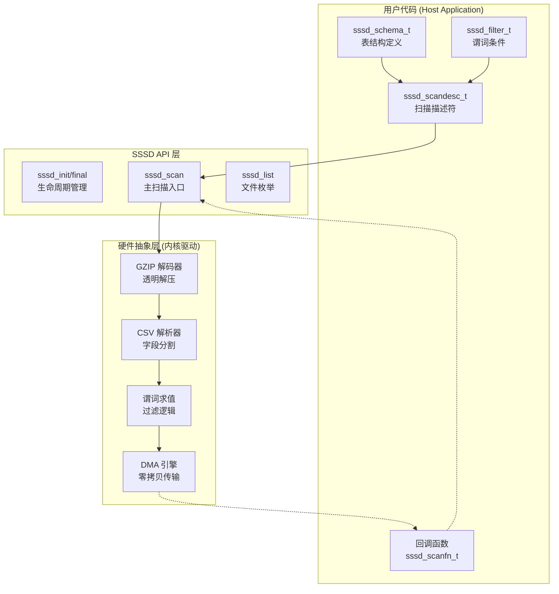

# gunzip_csv_sssd_api_types_l3 模块技术深潜

## 概述：硬件加速的数据扫描引擎

想象一下，你需要在一个装满文件柜的仓库里查找特定信息。传统的做法是：你走到每个柜子前，拿出文件，阅读内容，判断是否匹配，然后放回去。这个过程缓慢且耗费体力。现在想象这个仓库配备了一套自动化机械臂系统——你只需描述你要找什么（"找到所有2023年的发票，金额大于1000元"），机械臂就会飞速扫描文件，只把匹配的结果递到你面前。

**`gunzip_csv_sssd_api_types_l3`** 正是这样一个"机械臂系统"的编程接口。它位于 Xilinx 数据中心加速卡（Alveo/Versal）的软件栈中，提供了一个 C 语言 API，允许用户以声明式的方式（"描述你想要什么"）让底层 FPGA 硬件高效地扫描、过滤和解压 CSV 数据文件。它的核心设计哲学是**将复杂性下沉到硬件**：用户只需构建一个"扫描描述符"（query plan），剩下的数据流控制、GZIP 解压、CSV 解析、谓词过滤都由加速卡在流水线中并行完成。

---

## 架构与数据流

### 组件关系图



### 核心抽象：从 Query 到 Hardware Pipeline

理解这个模块的关键在于把握三层抽象之间的映射关系：

**1. 声明层（What）**: `sssd_scandesc_t` 结构体扮演了 SQL 查询的等价物。它包含：
   - **投影（Projection）**: `natt` 和 `att` 数组指定了用户需要哪些列（类似于 `SELECT col1, col3`）
   - **过滤（Selection）**: `nfilter` 和 `filter` 数组定义了谓词条件（类似于 `WHERE amount > 1000`）
   - **模式（Schema）**: 内嵌的 `sssd_schema_t` 提供了列名到数据类型的映射，这是硬件正确解析二进制表示的前提

**2. 控制层（How）**: `sssd_scan()` 函数是整个系统的入口点。它的责任是将声明层转化为硬件控制指令：
   - 根据文件扩展名（`.gz`）决定是否启用 GZIP 解码管道
   - 将 `sssd_scandesc_t` 序列化为硬件寄存器配置
   - 启动 DMA 传输，将文件数据从 SSD/NVMe 经 PCIe 送到 FPGA 片上内存
   - 管理回调机制：每当硬件完成一行数据的处理并通过所有过滤条件，它会通过中断通知主机，触发用户提供的 `sssd_scanfn_t` 回调

**3. 数据层（Raw Bits）**: 这是硬件实际处理的形式。模块定义了一系列紧凑的结构体（`sssd_numeric_t`, `sssd_date_t`, `sssd_timestamp_t`）来精确控制内存布局：
   - `sssd_numeric_t` 使用 56-bit 尾数 + 8-bit 指数的组合，提供定点小数的高精度表示，避免了 IEEE-754 浮点数的精度损失
   - `sssd_timestamp_t` 将时间拆解为独立的字段（年、月、日、秒、微秒、时区），使硬件可以并行比较各个分量而不需要做昂贵的字符串解析

---

## 核心组件深潜

### 类型系统：`sssd_dtype_t` 与异构数据处理

```c
enum sssd_dtype_t {
    SSSD_DTYPE_INVALID = 0,
    SSSD_DTYPE_BOOL = 1,    /* 8-bit int */
    SSSD_DTYPE_INT = 2,     /* 64-bit int */
    SSSD_DTYPE_FLOAT = 6,   /* 64-bit double */
    SSSD_DTYPE_NUMERIC = 7, /* 64-bit struct */
    SSSD_DTYPE_STRING = 8,
    SSSD_DTYPE_DATE = 9,      // YYYY-MM-DD
    SSSD_DTYPE_TIMESTAMP = 10 // YYYY-MM-DDThhmmss.usec+hh:mm
};
```

这个枚举定义了 SSSD 能够处理的所有数据类型。值得注意的是它**没有使用 C 语言的原生类型直接表示数据**，而是引入了中间抽象层。这背后的设计决策是**硬件对齐**：FPGA 在处理数据时需要明确的位宽和布局。例如：

- `SSSD_DTYPE_NUMERIC` 不是简单的 `double`，而是自定义的 `sssd_numeric_t`（56-bit 尾数 + 8-bit 指数）。这提供了比 IEEE-754 更高的精度（更多有效数字），对于金融或科学计算场景至关重要。
- `SSSD_DTYPE_TIMESTAMP` 被拆分为 `sssd_timestamp_t` 结构体而非存储为 Unix 时间戳整数，这是因为硬件并行比较器可以直接对年、月、日字段做并行比较，避免了软件层面的解码开销。

**使用注意**: 类型标签 `dtype` 必须与数据的实际 C 结构体严格匹配。在 `sssd_filter_t` 中，如果 `dtype` 是 `SSSD_DTYPE_NUMERIC` 但用户填充了 `arg_value.cmp_d`（double），硬件解释比特模式时会产生完全错误的结果。

### 复合数据结构：日期、时间与高精度数值

#### `sssd_date_t` 与 `sssd_timestamp_t`

```c
typedef struct sssd_date_t sssd_date_t;
struct sssd_date_t {
    int32_t year;
    int16_t month;
    int16_t day;
};

typedef struct sssd_timestamp_t sssd_timestamp_t;
struct sssd_timestamp_t {
    int32_t year;
    int16_t month;
    int16_t day;
    int32_t sec;   /* covers hour/minute/second */
    int32_t usec;
    int16_t zsec;  /* covers offset hour:minute */
};
```

这两个结构体的设计体现了**空间换时间**和**并行友好**的思想：

1. **字段分离**: 传统的 Unix 时间戳使用 64-bit 整数表示秒数，虽然存储紧凑，但进行"查找2023年所有记录"这类操作时，需要先解码年份。而分离字段允许硬件直接对 `year` 字段做 32-bit 比较。
2. **对齐与填充**: `sssd_date_t` 实际占用 8 bytes（4 + 2 + 2），自然对齐到 64-bit 边界，适合 DMA 传输。`sssd_timestamp_t` 将时间秒数和微秒数分开，也是因为 FPGA 流水线可以并行计算秒级和微秒级的范围谓词。

#### `sssd_numeric_t`: 定点小数的高精度方案

```c
typedef struct sssd_numeric_t sssd_numeric_t;
struct sssd_numeric_t {
    int64_t significand : 56;
    int exponent : 8;
};
```

这是模块中最精妙的设计之一。它使用**定点表示法（fixed-point）**替代了 IEEE-754 浮点数，解决了财务计算中的精度问题：

- **56-bit 尾数（Significand）**: 提供约 16-17 位十进制有效数字（log₁₀(2⁵⁶) ≈ 16.8）。相比之下，`double` 有 53-bit 尾数（约 15-16 位十进制）。这额外的 1-2 位精度在金融累加场景（如计算总交易额）中可以避免舍入误差累积。
- **8-bit 指数（Exponent）**: 支持数量级从 10⁻³⁸ 到 10³⁸ 的范围，足够覆盖绝大多数商业数据。
- **定点语义**: 与浮点数的 `significand × 2^exponent` 不同，这里的语义更接近 `significand × 10^exponent`（定点小数），尽管具体实现取决于硬件解释。关键是它保证了十进制小数（如 0.1）可以被精确表示，而 IEEE-754 只能近似表示。

**使用注意**: 因为使用了位域（bit-field），`sssd_numeric_t` 的内存布局是编译器相关的，但在 FPGA 加速卡的固定工具链（Xilinx Vitis）中，这是可预测且稳定的。

### 变长数据与模式定义

#### `sssd_string_t`: 柔性数组与零拷贝陷阱

```c
typedef struct sssd_string_t sssd_string_t;
struct sssd_string_t {
    int32_t len;
    char byte[];
};
```

这是一个**柔性数组成员（Flexible Array Member, FAM）**结构体，C99 引入的特性。它允许结构体末尾有一个未指定大小的数组，实际大小由运行时分配决定。

**内存布局与分配**:
```c
// 假设要存储字符串 "Hello"
int len = 5;
sssd_string_t *s = malloc(sizeof(sssd_string_t) + len);
s->len = len;
memcpy(s->byte, "Hello", len);
```

**关键风险 - 内存所有权**: 在 `sssd_scanfn_t` 回调中，`sssd_string_t` 指针指向的是硬件 DMA 缓冲区的内存。这个缓冲区是循环使用的！如果用户在回调中只是保存了指针而没有做 `memcpy`，当硬件写入下一行数据时，之前保存的指针就会指向无效或已更改的数据。

**正确用法**:
```c
int process_row(const int64_t value[], const bool isnull[], int32_t hash, void* context) {
    // 假设第4列是字符串
    sssd_string_t* str_ptr = (sssd_string_t*)value[4];
    
    // 错误：直接保存指针，数据可能被覆盖
    // context->saved_string = str_ptr;
    
    // 正确：复制数据到应用内存
    context->saved_string = malloc(sizeof(sssd_string_t) + str_ptr->len);
    memcpy(context->saved_string, str_ptr, sizeof(sssd_string_t) + str_ptr->len);
    
    return 0; // 继续扫描
}
```

#### `sssd_schema_t`: 自描述的 CSV 解析契约

```c
typedef struct sssd_schema_t sssd_schema_t;
struct sssd_schema_t {
    int32_t natt;           // 属性（列）数量
    char** aname;           // 列名数组
    sssd_dtype_t* dtype;    // 每列的数据类型数组

    char* ftype;            // 文件格式，如 "csv"
    
    union {
        struct {
            char header;    // 是否有标题行
            char delim;     // 分隔符，0 默认为逗号
            char quote;     // 引号字符，0 默认为双引号
            char escape;    // 转义字符，0 默认为双引号
            char* nullstr;  // 表示 NULL 的字符串，默认为空串
        } csv;
        // 未来可扩展其他格式
    } u;
};
```

这个结构体是**自描述（Self-describing）数据**的典型例子。它不仅仅定义了数据的模式（Schema），还包含了**解析协议**（如何读取数据）。

**关键设计决策 - 格式内嵌**: 不同于传统数据库将模式存储在系统目录（System Catalog）中，SSSD 将解析参数（CSV 的分隔符、引号规则）直接内嵌在 API 结构中。这是因为 SSSD 面向的是**文件系统**而非数据库管理系统——它直接读取原始 CSV/压缩文件，没有外部元数据服务。

**联合体（union）的扩展性**: 使用 `union` 包裹格式特定选项（目前只有 `csv`），为将来支持 Parquet、ORC 等二进制格式预留了空间，同时保持 C 结构体的扁平内存布局（硬件 DMA 友好）。

---

## 查询执行核心：扫描描述符与过滤系统

### `sssd_scandesc_t`：声明式查询计划的 C 表达

```c
typedef struct sssd_scandesc_t sssd_scandesc_t;
struct sssd_scandesc_t {
    sssd_schema_t schema;   // 输入数据的模式定义

    // 投影（Projection）：指定输出哪些列
    int32_t natt;           // 投影列数
    int32_t* att;           // 投影列索引数组

    // 选择（Selection/Filter）：谓词过滤条件
    // 注意：当前为简单列表，未来可扩展为表达式树
    int32_t nfilter;        // 过滤条件数量
    sssd_filter_t** filter; // 过滤条件指针数组

    // 哈希分布：用于 Join 或分桶
    int32_t nhashatt;       // 哈希列数
    int32_t* hashatt;       // 哈希列索引数组
};
```

如果你熟悉数据库查询优化器，你会立刻认出这是一个**物理查询计划（Physical Query Plan）**的 C 结构体表示。它实现了关系代数的三个核心操作：

1. **σ (选择/Selection)**: `nfilter` 和 `filter` 数组实现了 `WHERE` 子句。当前实现是**合取范式（CNF）**的简化形式——所有 filter 必须同时满足（AND 关系）。注释中提到的 "tree for more sophisticated filters" 暗示未来可能支持 OR、NOT 和嵌套条件。

2. **π (投影/Projection)**: `natt` 和 `att` 数组实现了 `SELECT col1, col3` 的列裁剪。这不仅减少了数据传输量，更重要的是允许硬件**早期物化（Early Materialization）**——在过滤阶段只解压和解析需要的列。

3. **哈希分布**: `nhashatt` 和 `hashatt` 是为 **shuffle 阶段**准备的。在分布式查询或哈希连接（Hash Join）场景下，硬件可以根据这些列计算哈希值，将行路由到不同的处理单元或分区。

### `sssd_filter_t`：谓词求值的强类型约束

```c
typedef struct sssd_filter_t sssd_filter_t;
struct sssd_filter_t {
    int att;                // 要比较的列索引
    sssd_dtype_t dtype;     // 该列的数据类型（运行期类型标签）
    sssd_cmp_t cmp;         // 比较算子（>, >=, <, <=, ==, !=, IS NULL）
    
    bool arg_isnull;        // 比较值是否为 NULL
    union {
        bool cmp_b;         // SSSD_DTYPE_BOOL
        int64_t cmp_i64;    // SSSD_DTYPE_INT
        double cmp_d;       // SSSD_DTYPE_FLOAT
        sssd_numeric_t cmp_n; // SSSD_DTYPE_NUMERIC
        sssd_string_t cmp_s;  // SSSD_DTYPE_STRING
        sssd_date_t cmp_date; // SSSD_DTYPE_DATE
        sssd_timestamp_t cmp_tm; // SSSD_DTYPE_TIMESTAMP
    } arg_value;            // 要比较的值
};
```

这个结构体展示了 **tagged union（标签联合体）** 模式在 C 中的经典应用。它解决了硬件加速场景下的一个核心问题：**如何在保持类型安全的同时实现零开销抽象**。

**类型安全机制**: `dtype` 字段作为**显式类型标签（Explicit Type Tag）**，告诉硬件（以及阅读代码的人）应该使用 `arg_value` 联合体的哪个成员。这与 C++ 的 `std::variant` 或函数式语言的代数数据类型（ADT）概念相同，只是手动实现。

**为什么不用 void***: 理论上 `arg_value` 可以是一个 `void*`，指向任意类型的内存。但这会带来**间接寻址开销**（需要一次额外的内存读取）和**缓存不友好**（指针解引用可能导致缓存未命中）。在 FPGA 加速卡的环境下，主机内存和 FPGA 片上内存之间的延迟极高，**值语义（Value Semantics）**比**引用语义（Reference Semantics）**性能高出数量级。

**比较算子的复杂性**: `sssd_cmp_t` 枚举包含了 `SSSD_ISNULL` 和 `SSSD_NOT`，这暗示了**三值逻辑（Three-Valued Logic, 3VL）**的支持——SQL 中的 NULL 表示"未知"，与任何值的比较都返回 UNKNOWN（而非 TRUE 或 FALSE）。注释中的 "??? How to use" 表明在编写此头文件时，`SSSD_NOT` 和 `SSSD_ISNULL` 的具体硬件实现逻辑尚未完全确定，可能是为未来支持 `IS NOT NULL` 或布尔逻辑 NOT 预留的扩展点。

---

## 依赖关系与生态系统

### 上游调用者（Who calls this?）

SSSD API 是一个**L3 层接口**（根据模块名中的 `L3`），位于高层应用逻辑和底层硬件驱动之间。典型的上游调用者包括：

1. **TPC-DS/TPC-H 基准测试框架**: 模块树中的 `database_query_and_gqe` 模块包含 L3 层的 GQE（Generic Query Engine）。SSSD API 提供了数据摄取（Ingestion）层，负责从原始 CSV/GZIP 文件读取数据，转换为 GQE 内部行格式（Arrow-like 或自定义列存格式）。
   
2. **数据分析应用**: 类似 Pandas DataFrame 的 C++ 实现或 Spark Executor 的本地任务，需要扫描特定数据集（如 "读取 /mnt/ssd1/sales_2023.csv.gz 中所有 quantity > 100 的记录"）。这些应用将 SQL 或 DSL 查询编译为 `sssd_scandesc_t` 配置。

3. **ETL 流水线**: 在数据湖（Data Lake）架构中，SSSD 作为 Extract 阶段的高效实现，将未压缩或压缩的原始文件转换为清洗后的格式（如 Parquet），供下游 Hive 或 Presto 查询。

### 下游依赖（What does this call?）

SSSD API 本身是一个**声明式接口**，它不直接实现 CSV 解析或 GZIP 解压缩的逻辑——这些是底层硬件内核（Kernel）的职责。从模块树结构可以推断其依赖关系：

1. **数据压缩内核 (`data_compression_gzip_system`)**: 
   - `gzip_app_kernel_connectivity` 和 `gzip_hbm_kernel_connectivity` 定义了 GZIP 解码器的接口和内存连接性。
   - SSSD API 在 `sssd_scan()` 内部，当检测到 `.gz` 文件时，会配置并启动这些内核。数据流路径是：SSD → PCIe DMA → GZIP Kernel → CSV Parser Kernel。

2. **数据搬运运行时 (`data_mover_runtime`)**:
   - 模块树中的 `data_mover_runtime` 负责主机（Host）与设备（Device）之间的内存映射、DMA 描述符管理和零拷贝缓冲区管理。
   - SSSD API 依赖它来分配物理连续的 DMA 缓冲区，用于存储解压后的行数据，这些缓冲区的地址会被传递给用户的 `sssd_scanfn_t` 回调。

3. **硬件抽象层（隐含依赖）**:
   - 虽然模块树未明确展示，但 L3 层 API 通常依赖于 L1/L2 的驱动中间件（如 XRT - Xilinx Runtime），用于 FPGA 比特流管理、内核启动 (`clEnqueueTask` 或等价物) 和缓冲区同步 (`clEnqueueMigrateMemObjects`)。

### 数据契约与版本兼容性

SSSD API 作为 L3 层，承载了**跨版本兼容性**的压力：

- **结构体 ABI 稳定性**: 所有结构体（`sssd_date_t`, `sssd_numeric_t` 等）都使用固定宽度类型（`int32_t`, `int64_t`）而非 `int` 或 `long`，确保 32-bit 和 64-bit 主机之间 ABI 兼容。
- **版本协商**: 虽然头文件未展示版本号字段，但生产级实现通常会在 `sssd_init()` 时进行硬件/软件版本匹配，防止旧软件驱动新硬件（或反之）导致的比特位解释错误（例如 `sssd_numeric_t` 的指数部分被错误映射）。

---

## 参考与关联模块

- **[GZIP 系统模块](data_compression_gzip_system-gzip_app_kernel_connectivity.md)**: SSSD 的透明解压功能依赖于该模块提供的硬件 GZIP 内核。
- **[数据搬运运行时](data_mover_runtime.md)**: SSSD 通过此模块管理主机与 FPGA 之间的 DMA 传输和内存映射。
- **[数据库查询引擎 (GQE)](database_query_and_gqe-l3_gqe_execution_threading_and_queues.md)**: SSSD 通常是 GQE 的数据源，为 L3 层查询执行提供原始数据扫描能力。
- **[文本处理运行时](data_analytics_text_geo_and_ml-software_text_and_geospatial_runtime_l3.md)**: 对于超出 SSSD 基本过滤能力的复杂文本处理（如正则匹配），数据会流转至此模块进行软件级处理。

---

**文档版本**: 基于 SSSD API 头文件 v2022.1
