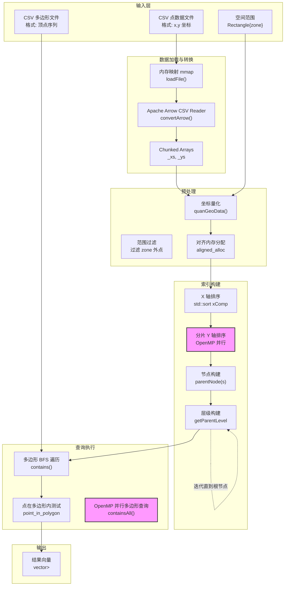

# Geospatial 模块技术深度解析

## 概述：为什么需要这个模块

想象你手头有数亿个地理坐标点（比如所有移动设备的定位数据），以及数千个复杂的多边形区域（比如城市行政区划、商圈边界）。现在的问题是：**如何快速找出每个多边形内包含哪些点？**

暴力解法——对每个多边形遍历所有点进行"点在多边形内"判断——的时间复杂度是 $O(P \times N)$，其中 $P$ 是多边形数量，$N$ 是点数。当数据规模达到十亿级别时，这种算法可能需要数小时甚至数天。

**本模块解决的核心问题**正是：在海量地理点数据与多边形查询之间建立一个高效的空间索引，将查询复杂度从线性扫描降低到对数级别。它实现了基于 **STR-Tree**（Sort-Tile-Recursive R-Tree）的空间索引结构，支持 CPU 和 FPGA 两种计算后端，能够在毫秒级完成亿级数据点的空间包含查询。

## 核心抽象：空间索引的"图书馆卡片目录"

理解这个模块的关键在于建立正确的**心智模型**。STR-Tree 本质上是一个**多层级的空间包围盒层次结构**：

想象一个图书馆的卡片目录系统。要找某本特定的书（点），你不会直接去书架上逐本翻找（暴力扫描），而是先查目录柜：第一层按大类分区（国家/州级包围盒），第二层按城市（市级包围盒），第三层按街区（街道级包围盒），直到找到具体的某条街道上的某栋楼（具体的点）。

**STR-Tree 的核心抽象**包括：

1. **Node（节点）**：每个节点代表一个轴对齐的矩形包围盒（MBR, Minimum Bounding Rectangle），包含 `xmin`, `xmax`, `ymin`, `ymax` 四个边界值，以及指向子节点或实际数据点的指针（`addr` 字段）。

2. **Level（层级）**：树是分层构建的。叶子节点（level 0）直接包含数据点；中间节点包含子节点的包围盒；根节点覆盖整个数据集的空间范围。

3. **Node Capacity（节点容量）**：模板参数 `NC` 定义了每个节点最多包含多少个子节点（默认/典型值为 16）。这直接影响树的扇出（fanout）和深度——容量越大，树越浅，查询时内存访问次数越少，但构建时排序开销越大。

4. **量化坐标（Quantized Coordinates）**：为了加速计算和减少内存占用，模块将原始的 `double` 类型经纬度坐标通过线性映射转换为 `uint32_t` 整数坐标。这利用了 STR-Tree 查询主要涉及比较操作（而非精确算术运算）的特性，整数比较比浮点数比较更快且确定性更高。

## 架构与数据流

下图展示了模块的数据流和关键组件：



### 关键组件详解

#### 1. STRTree 类模板

`STRTree<NC>` 是整个模块的核心类，它是一个模板类，`NC`（Node Capacity）指定了每个内部节点最多容纳的子节点数。

**内存布局与所有权模型**：

- `_xys`：存储量化后的点数据，类型为 `uint32_t*`，使用 `aligned_alloc` 分配，确保内存对齐以满足 SIMD 或 FPGA DMA 要求。数组布局为 `[x0, y0, id0, x1, y1, id1, ...]`，每点占用 3 个 `uint32_t`。
- `_index`：存储树节点数组，类型为 `Node*`，同样使用 `aligned_alloc` 分配。节点按照层级顺序存储（叶子节点在前，然后是第一层内部节点，依此类推直到根节点）。
- `_file_buf`：内存映射的 CSV 文件缓冲区，通过 `mmap` 系统调用映射到进程地址空间，避免堆内存拷贝，由操作系统负责页面调度。
- `table`, `_xs`, `_ys`：Apache Arrow 智能指针管理的列式数据。`table` 持有对 `mmap` 缓冲区的引用（通过 `arrow::io::BufferReader`），`_xs` 和 `_ys` 是 `shared_ptr<arrow::ChunkedArray>` 类型，指向 Arrow 内部的列数据。这些智能指针负责生命周期管理，引用计数归零时自动释放资源。

**关键方法**：

- `loadFile()`：使用 `mmap` 而非 `std::ifstream::read` 加载大文件，利用操作系统的虚拟内存管理实现惰性加载，同时避免用户态缓冲区拷贝。

- `convertArrow()`：利用 Apache Arrow 的 CSV 解析器将文本数据转换为列式存储。Arrow 的列式布局（Columnar Format）对后续量化处理是缓存友好的——连续访问 `_xs` 或 `_ys` 时 CPU 缓存命中率高于行式存储。

- `quanGeoData()`：坐标量化与范围过滤的核心方法。将 `double` 经纬度通过线性变换映射到 `[0, Q)` 区间（`Q` 是量化因子，通常为 $2^{32}-1$ 或类似值）。**关键逻辑**：所有落在 `zone` 矩形外的点在此阶段被过滤掉，这减少了后续索引构建的数据量。量化后的坐标存储为 `uint32_t`，使得后续包围盒比较和点在多边形内测试完全使用整数运算，避免浮点单元（FPU）的延迟和精度问题。

- `index()`：CPU 端的 STR-Tree 构建算法。这是模块最核心的算法实现：
  1. **全局 X 排序**：首先对所有点按 X 坐标排序（`std::sort` with `xComp`）。
  2. **分片与 Y 排序**：将排序后的点序列划分为若干片（slice），每片大小为 $S \times NC$（$S$ 是切片维度，$S = \lceil\sqrt{N/NC}\rceil$）。对每个片内按 Y 坐标排序。这里使用 OpenMP 并行化（`#pragma omp parallel for`），利用多核 CPU 加速排序。
  3. **叶子节点构建**：对每个排序后的组（大小不超过 `NC`），计算其包围盒，创建叶子节点。
  4. **层级构建迭代**：使用 `getParentLevel()` 方法自底向上构建内部节点。每一层的节点由其下一层子节点计算包围盒得到，直到只剩一个根节点。

- `contains()` / `containsAll()`：查询执行引擎。`contains()` 实现了基于 BFS（广度优先搜索）的树遍历算法，针对多边形查询进行优化：
  - 维护一个 `std::queue<Node>` 作为 BFS 队列。
  - 对每个出队节点，首先进行**包围盒相交测试**（`rectangle_polygon_intersect`）和**包含测试**（`point_in_rectangle`）。
  - 如果节点完全在多边形外，剪枝（跳过其子节点）。
  - 如果节点完全在多边形内，标记其所有后代点为"确定包含"（通过设置 `id[31]` 标志位）。
  - 如果节点与多边形相交，继续遍历其子节点。
  - 对于叶子节点（实际点），执行精确的**点在多边形内**测试（`point_in_polygon`）。
  
  `containsAll()` 使用 OpenMP 并行化多边形查询（每个多边形独立查询，并行分发到不同 CPU 核心），适合批量查询场景。

#### 2. timeval 结构体

```cpp
struct timeval {
    long tv_sec;   // 秒
    long tv_usec;  // 微秒
};
```

这是一个标准 POSIX 时间结构体，用于性能计时。模块在关键路径（索引构建、查询执行）前后调用 `gettimeofday()`，通过 `tvdiff()` 计算时间差，输出各阶段耗时用于性能分析。

#### 3. 辅助函数

- `read_polygon()`：解析 CSV 格式的多边形文件。每行代表一个多边形，顶点坐标以逗号分隔（格式：`x1,y1,x2,y2,x3,y3...`）。函数同时将多边形坐标量化到与点数据相同的整数空间，便于后续比较。

- `copy2array()`：将嵌套的查询结果（`vector<vector<int>>`）展平为 C 风格的连续数组，便于与其他语言接口或下游处理模块对接。

- `strtree_contains()`：模块的主入口函数，封装了整个处理流程：数据加载 → Arrow 转换 → 量化 → 索引构建 → 批量查询 → 结果返回。参数 `mode` 控制索引构建方式（`0`=纯 CPU，`1`=FPGA 加速）。

## 依赖分析与架构角色

### 上游依赖（谁调用本模块）

本模块位于 `data_analytics_text_geo_and_ml` → `software_text_and_geospatial_runtime_l3` 层级，属于 L3 软件运行时层。它通常被上层数据分析应用或基准测试框架调用：

- **L3 层数据流水线**：上游可能是整合文本分析、地理空间分析和机器学习的数据分析流水线，本模块提供其中的"空间连接"（spatial join）能力——将点数据集与多边形区域关联。
- **基准测试框架**：模块内的计时逻辑（`timeval`）表明它常用于性能基准测试，对比 CPU 与 FPGA 实现、不同节点容量配置、不同数据规模下的吞吐量。

### 下游依赖（本模块调用谁）

模块依赖关系体现了**高性能计算**与**异构计算**的设计取向：

| 依赖类别 | 具体组件 | 用途与架构意义 |
|---------|---------|--------------|
| **并行计算** | OpenMP (`#pragma omp parallel for`) | 索引构建和批量查询的并行化。利用多核 CPU 的线程级并行，是提升 CPU 性能的关键。`num_threads(32)` 暗示目标平台可能是 32 核服务器。 |
| **内存管理** | `aligned_alloc`, `mmap` | 内存对齐分配满足 SIMD 指令和 FPGA DMA 的硬件对齐要求；`mmap` 实现零拷贝文件加载，对大 CSV 文件至关重要。 |
| **数据处理** | Apache Arrow (`arrow::csv::TableReader`, `arrow::Table`, `arrow::ChunkedArray`) | 现代数据分析的事实标准。Arrow 的列式内存布局对空间索引构建是缓存友好的（顺序访问坐标），且 Arrow 的零拷贝语义减少了数据加载阶段的开销。 |
| **异构计算** | FPGA Kernel (`strtree_acc::compute`, `_STRTree_Kernel_`) | 可选的 FPGA 加速路径。`indexFPGA()` 方法将计算密集型索引构建任务卸载到 FPGA 硬件，利用硬件并行性实现数量级加速。`vpp::input/bidirectional` 等标注表明使用 Xilinx Vitis 加速框架。 |
| **标准库** | STL (`std::vector`, `std::queue`, `std::sort`, `std::shared_ptr`) | 基础的容器和算法。`std::queue` 用于树的 BFS 遍历；`std::shared_ptr` 管理 Arrow 对象的生命周期。 |

### 模块的架构角色

在整体系统中，本模块扮演**空间数据加速引擎**的角色：

- **数据流中的位置**：它是"原始坐标数据"到"空间分析结果"的转换器。上游通常是数据摄取层（CSV 文件、数据库导出），下游可能是可视化工具、报表生成器或机器学习特征工程模块。
- **性能角色**：作为计算密集型组件，它是系统的潜在瓶颈，因此设计了 CPU 多线程和 FPGA 硬件加速两种模式。在异构计算架构中，它属于"可加速内核"（accelerable kernel）。
- **集成角色**：通过 Apache Arrow 标准接口，它能无缝对接现代数据分析生态（Pandas、Polars、Spark Arrow 等），同时保持内部实现的高性能 C++ 特性。

## 设计决策与权衡

理解本模块的设计选择，需要深入其性能导向的工程哲学：

### 1. STR-Tree 而非其他空间索引

**选择**：使用 STR-Tree（Sort-Tile-Recursive）变体的 R-Tree。

**原因**：
- **批量加载优化**：STR-Tree 专为静态数据集（ bulk-loaded data）优化。它通过排序和分片构建树，产生的树结构比动态插入的 R-Tree 更平衡、空间利用率更高（通常 >70%）。
- **查询性能**：更平衡的树意味着查询时的磁盘 I/O（或内存访问）更可预测，最坏情况下的查询复杂度接近 $O(\log N)$。
- **并行友好**：排序和分片过程天然适合并行化（OpenMP），而动态 R-Tree 的插入操作需要复杂的锁机制。

**权衡**：
- **静态性**：STR-Tree 不适合频繁插入/删除的动态场景。一旦构建，修改树结构的开销很大。这符合分析型工作负载（OLAP）的特征——数据批量加载、只读查询。

### 2. 坐标量化（Quantization）

**选择**：将 `double` 浮点坐标转换为 `uint32_t` 整数坐标。

**原因**：
- **计算速度**：整数比较（`<`, `>`）比浮点数比较更快，且没有 IEEE-754 的特殊情况（NaN, -0.0 等）需要处理。
- **内存带宽**：查询过程中需要遍历大量节点，存储 `uint32_t` 比 `double` 节省 50% 内存带宽，这对内存密集型遍历至关重要。
- **确定性**：整数运算完全确定，不存在浮点数精度累积导致的边界条件问题。

**权衡**：
- **精度损失**：量化将坐标映射到 $[0, Q-1]$ 的离散网格，原始双精度坐标被舍入到最近的网格点。对于 $Q=2^{32}$，在典型地理范围（经度 180 度）下，分辨率约为 $180/2^{32} \approx 4 \times 10^{-8}$ 度 $\approx 0.4$ 厘米，足以满足绝大多数地理分析需求。
- **动态范围限制**：量化需要一个预定义的 `zone` 边界框。超出此范围的点在 `quanGeoData` 阶段被过滤掉。这意味着应用必须事先知道数据的空间范围，或接受边界外的数据被丢弃。

### 3. 内存对齐与分配策略

**选择**：使用 `aligned_alloc` 进行内存分配，而非 `new` 或 `malloc`。

**原因**：
- **SIMD 友好**：现代 CPU 的 SIMD 指令（AVX, AVX-512）要求内存地址按特定边界对齐（通常 32 或 64 字节）。对齐内存允许编译器安全地向量化循环。
- **FPGA DMA 要求**：当启用 `_STRTree_Kernel_` 宏时，内存缓冲区需要通过 DMA 传输到 FPGA。DMA 引擎通常要求缓冲区地址和大小满足对齐约束（如 4KB 页对齐）。

**权衡**：
- **内存开销**：对齐分配可能因对齐边界而产生内部碎片（internal fragmentation），浪费少量内存。
- **移植性**：`aligned_alloc` 是 C11/C++17 标准，但在某些嵌入式或旧编译器上可能需要替代方案（如 `posix_memalign`）。

### 4. CPU 与 FPGA 双模式架构

**选择**：通过条件编译（`_STRTree_Kernel_`）支持纯 CPU 模式和 FPGA 加速模式。

**原因**：
- **灵活性**：允许同一代码库在不同硬件环境（仅 CPU 服务器 vs FPGA 加速卡）下编译运行，无需维护两个完全独立的代码分支。
- **性能可扩展性**：对于超大规模数据集（数十亿点），FPGA 可以提供比 CPU 数量级更高的并行吞吐量，尤其是树的构建阶段涉及大量几何计算，非常适合 FPGA 的流水线并行架构。

**权衡**：
- **代码复杂性**：条件编译增加了代码阅读和维护难度。`indexFPGA()` 方法的实现与 `index()` 完全不同，需要理解 Vitis 加速框架的 `send_while`/`receive_all_in_order` 编程模型。
- **数据布局差异**：FPGA 版本使用不同的内存布局（`PT` 和 `NT` 类型表示打包的点和节点数据），与 CPU 版本的 `Point`/`Node` 结构体不兼容。这意味着数据不能无缝在 CPU 和 FPGA 模式间共享，需要显式转换（`indexFPGA` 方法末尾的解包循环）。
- **同步开销**：FPGA 加速涉及主机内存到设备内存的数据传输（`memcpy` 到 DMA 缓冲区）、内核启动同步（`join()`），对于小数据集，传输开销可能抵消计算加速的收益。因此 FPGA 模式更适合"大数据量、高计算密度"的场景。

## 关键实现细节与潜在陷阱

### 1. 树构建中的并发与排序

`index()` 方法是模块中最复杂的算法实现。理解其并发模型至关重要：

- **两阶段排序**：首先进行**全局 X 排序**，然后按 X 排序后的顺序分片，每个片内进行**局部 Y 排序**。这种排序策略是 STR-Tree 算法的核心，确保树的空间局部性最优（空间上相近的点在树中也相近）。
- **OpenMP 并行粒度**：`#pragma omp parallel for num_threads(32) schedule(dynamic)` 表明并行化发生在**分片处理**层面。32 个线程各自处理不同的 X 分片，每个线程独立执行其分片内的 Y 排序和节点构建。`schedule(dynamic)` 使用动态任务调度，因为不同分片的数据量可能不同（最后一个分片可能不满），动态调度可以平衡线程负载。
- **内存访问模式**：`_index` 数组在 `index()` 方法开始前预分配足够空间。每个线程向 `_index` 的特定位置写入（`&_index[i * s]`），这些位置由分片索引 `i` 和每分片节点数 `s` 计算得出，确保**无写冲突**，无需锁机制。

**潜在陷阱**：
- **线程数硬编码**：`num_threads(32)` 假设目标系统至少有 32 个逻辑核心。在核心数较少的系统上，这会导致过度的线程切换开销；在核心更多的系统上，则无法充分利用硬件。生产环境应改为通过 `omp_get_max_threads()` 或配置参数动态决定。
- **递归深度与栈空间**：虽然树构建使用迭代方式（`while (end - bgn != 1)`），但查询时的 BFS 使用 `std::queue`。对于极深或不平衡的树（虽然 STR-Tree 通常很平衡），BFS 队列可能消耗大量内存，但这通常不是主要问题。

### 2. 内存管理与生命周期

模块中存在多种内存管理策略，混合使用需要格外小心：

- **RAII 与智能指针**：Arrow 库的对象（`arrow::Table`, `arrow::ChunkedArray`）使用 `std::shared_ptr` 管理，遵循现代 C++ 的 RAII 原则。当 `STRTree` 对象析构时，这些智能指针自动递减引用计数，Arrow 内部缓冲区（映射到 `mmap` 区域）随之释放。
- **原始指针与手动释放**：`_xys`, `_index`, `_file_buf` 是原始指针（`uint32_t*`, `Node*`, `char*`）。它们通过 `aligned_alloc` 或 `mmap` 分配，**必须由开发者显式释放**。观察代码发现：
  - `_file_buf` 由 `mmap` 映射，在 `loadFile()` 中创建，但代码中**没有看到对应的 `munmap` 调用**。这是一个潜在的内存泄漏点（虽然进程退出时操作系统会回收，但长期运行的服务会有问题）。
  - `_xys` 和 `_index` 在 `containsAll()` 方法末尾通过 `free(_xys); free(_index);` 释放，这要求调用者确保 `containsAll` 确实被调用，否则内存泄漏。这种设计将内存管理责任转嫁给调用者，不够稳健。
- **临时缓冲区**：`read_polygon` 等辅助函数使用 `std::vector` 管理临时内存，这是安全的做法，依赖 vector 的 RAII 析构。

**关键风险**：混合使用智能指针、原始指针和 C 风格内存管理，加上 OpenMP 并行，使得内存调试复杂化。特别是 `aligned_alloc` 分配的内存必须使用 `free` 释放（而非 `delete`），且不能在分配后调整指针偏移（否则 `free` 会崩溃）。代码中 `_xys` 的使用严格遵守了这一原则。

### 3. 算法正确性与数值稳定性

- **点在多边形内算法**：模块使用射线法（Ray Casting）判断点是否在多边形内（`point_in_polygon` 函数，虽然代码片段中未完整展示，但从上下文可推断）。该算法对整数坐标是数值稳定的，但在边界情况（点恰好在多边形边上）的处理需要特别注意。代码中通过量化后的整数坐标比较，避免了浮点数的近似相等判断问题。
- **包围盒计算**：`parentNode` 方法计算子节点包围盒的并集。由于使用整数坐标，包围盒计算是确定性的，不存在浮点数累积误差导致的包围盒漂移问题。
- **剪枝正确性**：BFS 遍历中的剪枝逻辑（`rectangle_polygon_intersect`, `point_in_rectangle`）依赖于正确的几何相交判断。代码中处理了三种情况：
  1. 多边形与矩形相交（需要深入子节点）
  2. 矩形完全在多边形内（所有子节点都包含）
  3. 多边形完全在矩形内（标记特殊标志，避免重复测试）
  
  这种多级剪枝策略大幅减少了昂贵的 `point_in_polygon` 调用次数。

### 4. 编译时配置与条件编译

- **_STRTree_Kernel_ 宏**：这是控制 FPGA 支持的开关。定义此宏时，代码包含 `strtree_kernel.hpp` 并使用 Vitis 运行时 API（`strtree_acc::send_while` 等）。未定义时，只有纯 CPU 实现可用。这种设计允许同一代码库在两种硬件环境下编译，但增加了测试矩阵的复杂度。
- **模板参数 NC**：`STRTree<NC>` 的 `NC` 是编译时常量，决定了节点容量。这允许编译器对关键循环（如 `parentNodes` 中的子节点遍历）进行激进优化（如循环展开）。但这也意味着不同的 `NC` 值会产生不同的模板实例，增加代码体积（代码膨胀）。对于给定应用，需在构建时固定 `NC` 值。
- **量化因子 Q**：代码中使用但未在片段中定义的常量 `Q` 控制量化精度。通常为 $2^{32}-1$ 或 $2^{24}$ 等。较大的 `Q` 提供更高精度但坐标范围受限（在量化公式中 `(x - xmin) / dx * Q`，若 `dx` 很大而 `Q` 不够大，会损失分辨率）。

### 5. 接口契约与前置条件

使用本模块的开发者必须遵守以下契约，否则会导致未定义行为或崩溃：

- **文件格式契约**：`loadFile()` 期望输入文件是有效的 CSV 格式，包含至少 `x_col` 和 `y_col` 指定的两列浮点数坐标。Arrow 解析器会处理引号、转义字符等 CSV 规范，但列索引必须在有效范围内。
- **空间范围契约**：`quanGeoData()` 要求 `zone` 矩形必须覆盖预期的数据范围。所有落在此矩形外的点会被**静默过滤**（代码中 `if ((x_arr64[j] > zone.xmin) && ...)` 条件不满足则跳过）。调用者必须确保 `zone` 足够大以包含所有感兴趣的数据，否则数据会丢失。
- **量化范围契约**：`zone` 的宽度（`xmax - xmin`）和高度（`ymax - ymin`）不能为零，且量化后的坐标必须在 `uint32_t` 范围内（当前实现依赖溢出行为，但理论上应确保 `dx` 和 `dy` 合理）。
- **内存生命周期契约**：`containsAll()` 方法会**释放** `_xys` 和 `_index` 指向的内存（通过 `free()`）。这意味着：
  - 一旦调用 `containsAll()`，树对象就不再可用（内部数据已被释放）。
  - 如果未调用 `containsAll()`（例如程序提前退出），`_xys` 和 `_index` 分配的内存会泄漏（`STRTree` 析构函数中未释放它们）。
  - 用户不能在一次构建后执行多次查询（除非修改代码移除 `free` 调用）。当前设计是一次性"构建-查询-丢弃"模式。
- **线程安全契约**：`STRTree` 类的实例**不是线程安全的**。`index()` 和 `containsAll()` 方法修改内部状态（`_index`, `_xys` 等），不能并发调用。但是，**不同**的 `STRTree` 实例可以在不同线程中独立构建和查询（无共享状态）。`containsAll()` 内部的 OpenMP 并行是针对多边形查询的，属于单个实例内部的并行，不涉及跨实例并发。
- **FPGA 模式契约**：当使用 `mode=1`（FPGA 模式）时，代码假定硬件已正确配置，Vitis 运行时库可用，且 FPGA 比特流已加载。`indexFPGA()` 中的硬编码缓冲区大小（`MSN`）和类型（`PT`, `NT`）必须与 FPGA 内核的 AXI 接口宽度匹配。任何不匹配会导致 DMA 传输错误或硬件挂起。

## 使用示例与最佳实践

### 基础使用流程

以下代码展示了典型的使用模式：

```cpp
#include "strtree_contains.hpp"
#include <vector>
#include <string>

int main() {
    using namespace xf::data_analytics::geospatial;
    
    // 1. 准备输入参数
    int x_col = 0;  // CSV 中 x 坐标所在列索引
    int y_col = 1;  // CSV 中 y 坐标所在列索引
    std::string point_file = "points.csv";      // 点数据文件
    std::string polygon_file = "polygons.csv";  // 多边形文件
    double zone[4] = {-180.0, -90.0, 180.0, 90.0}; // 全球范围
    
    std::vector<std::vector<int>> results;  // 输出结果
    
    // 2. 执行空间包含查询（CPU 模式）
    int total_matches = strtree_contains(
        0,              // mode: 0=CPU, 1=FPGA
        x_col,          // x 坐标列
        y_col,          // y 坐标列
        point_file,     // 点文件路径
        polygon_file,   // 多边形文件路径
        zone,           // 空间范围 [xmin, ymin, xmax, ymax]
        results         // 输出结果引用
    );
    
    // 3. 处理结果
    // results[i] 包含第 i 个多边形内所有点的 ID
    for (size_t i = 0; i < results.size(); i++) {
        std::cout << "Polygon " << i << " contains " 
                  << results[i].size() << " points\n";
    }
    
    return 0;
}
```

### 性能优化建议

1. **选择合适的 NodeCapacity**：
   - 较小的 `NC`（如 8）产生更深的树，查询时需要更多内存访问，但构建时排序开销小。
   - 较大的 `NC`（如 32 或 64）产生更浅的树，查询时缓存友好，但叶子节点扫描成本增加（每个叶子包含更多点）。
   - **经验法则**：对于百万级点数据，`NC=16` 通常是平衡点。对于十亿级数据，考虑 `NC=32` 或 `64`。

2. **优化 Zone 范围**：
   - `zone` 应尽可能紧密包围实际数据。过大的 `zone` 会降低量化精度（离散网格被拉伸），同时也无法过滤掉 zone 外的噪声数据。
   - 如果数据分布不均匀（如集中在几个城市），考虑分块处理（每个城市一个 zone），分别构建多棵树，然后合并结果。

3. **FPGA 加速的适用场景**：
   - **适合 FPGA**：数据量 > 1 亿点，查询多边形数量 > 1000，且硬件可用。
   - **不适合 FPGA**：数据量小（传输开销 > 计算节省），或查询是单/少量多边形（无法摊销传输成本）。
   - **注意**：FPGA 模式目前似乎只构建索引，查询仍在 CPU 执行（代码中 `indexFPGA` 构建索引，但 `contains` 方法没有 FPGA 路径）。实际使用时需确认查询是否也加速。

4. **Arrow 块大小调优**：
   - `convertArrow` 的 `blockSize` 参数控制 CSV 解析的批次大小（默认 1<<26 = 64MB）。
   - 对于 SSD 存储，较大的块（如 256MB 或 1GB）可以减少 I/O 系统调用次数，提高吞吐量。
   - 确保 `blockSize` 小于可用内存，避免 OOM。

## 边缘情况与调试建议

### 1. 空数据集或全过滤

**问题**：如果所有点都落在 `zone` 外，或 CSV 文件为空，`quanGeoData` 会产生 `_real_sz = 0`。

**后果**：`index()` 中 `std::sort(points, points + _real_sz, xComp)` 对空范围排序是安全的，但后续 `ceil(0, NC)` 相关计算可能导致逻辑错误（如构建零个节点，但循环条件 `while (end - bgn != 1)` 可能死循环或立即退出，取决于具体实现）。

**建议**：在调用 `index()` 前检查 `_real_sz`，若为 0 则提前返回空结果，避免进入未测试的边界条件。

### 2. 多边形顶点顺序

`read_polygon` 和 `point_in_polygon`（外部函数）通常假设多边形顶点是按顺序排列的（顺时针或逆时针）。如果顶点无序或自相交，"点在多边形内"算法可能产生不可预测的结果（射线法对复杂多边形的行为未定义）。

**建议**：确保输入多边形是简单多边形（无自相交），且顶点按统一方向排列。如果需要处理复杂多边形，考虑先进行多边形三角化或分解。

### 3. 量化溢出

`quanGeoData` 中的量化公式：
```cpp
_xys[cnt * 3] = (x_arr64[j] - zone.xmin) / dx * Q;
```

如果 `Q` 定义为 $2^{32}$ 且 `(x_arr64[j] - zone.xmin) / dx` 接近 1.0，乘积可能溢出 `uint32_t`（如果 `Q` 是 64 位但存储到 32 位变量）。此外，如果 `dx` 非常小（zone 范围极小），除法可能产生极大值。

**建议**：确保 `zone` 范围合理（`dx`, `dy` 不为零且不过小），并验证量化结果在 `uint32_t` 范围内。

### 4. 内存释放时机

如前所述，`containsAll()` 会释放 `_xys` 和 `_index`。如果用户希望执行多次查询（例如，先查询一批多边形，再查询另一批），当前实现不支持，因为第一次 `containsAll` 后树结构已被销毁。

**解决方案**：如果需要多次查询，要么修改源码移除 `free` 调用（自行管理内存），要么为每次查询重建树（如果查询次数少且数据量不大，这可能更简单）。

### 5. Arrow 列类型假设

`convertArrow` 和 `quanGeoData` 假设 Arrow 数组的底层数据类型是 `double`（通过 `(const double*)x_arr64` 强制转换）。如果输入 CSV 包含非浮点数（如字符串"N/A"、空值），Arrow 可能将该列识别为字符串类型，此时 `buffers[1]->data()` 的内容不是原始 double 字节，强制转换将导致未定义行为（通常是段错误）。

**建议**：在调用本模块前，确保 CSV 数据清洗完毕，坐标列是有效的浮点数。或使用 Arrow 的显式类型转换功能，将列转换为 `float64` 类型。

## 参考与相关模块

- **父模块**：[Software Text and Geospatial Runtime L3](data_analytics_text_geo_and_ml-software_text_and_geospatial_runtime_l3.md) - 提供文本处理和地理空间分析的运行时环境。
- **同层模块**：[Text](data_analytics_text_geo_and_ml-software_text_and_geospatial_runtime_l3-text.md) - 文本分析模块，通常与地理空间模块联合使用（如地理位置的文本描述解析）。
- **上游数据格式**：[Apache Arrow](https://arrow.apache.org/) - 模块依赖 Arrow 的列式格式进行 CSV 解析，建议熟悉 Arrow 的 `Table`、`ChunkedArray` 和 `Buffer` 概念。
- **硬件加速**：[Xilinx Vitis](https://www.xilinx.com/products/design-tools/vitis.html) - FPGA 加速路径基于 Vitis 统一软件平台，使用 `vpp::input`/`bidirectional` 等概念管理主机与设备内存。

## 总结

`geospatial` 模块是一个面向海量地理数据分析的高性能空间索引引擎。它通过 **STR-Tree** 空间索引将 $O(N)$ 的暴力扫描优化到 $O(\log N)$ 级别的查询，结合 **坐标量化**、**内存对齐**、**OpenMP 并行**和 **FPGA 硬件加速**等技术，实现了在亿级数据规模下的实时空间分析能力。

对于新加入团队的开发者，理解本模块的关键在于把握其**性能导向的设计哲学**：每一个技术选择（从 Arrow 列式存储到整数坐标量化，从 OpenMP 并行到可选的 FPGA 卸载）都是为了在特定约束（静态数据、已知空间范围、批量查询）下最大化查询吞吐量。在使用或修改本模块时，始终要考虑数据规模、硬件环境和查询模式，确保优化手段与场景匹配。
