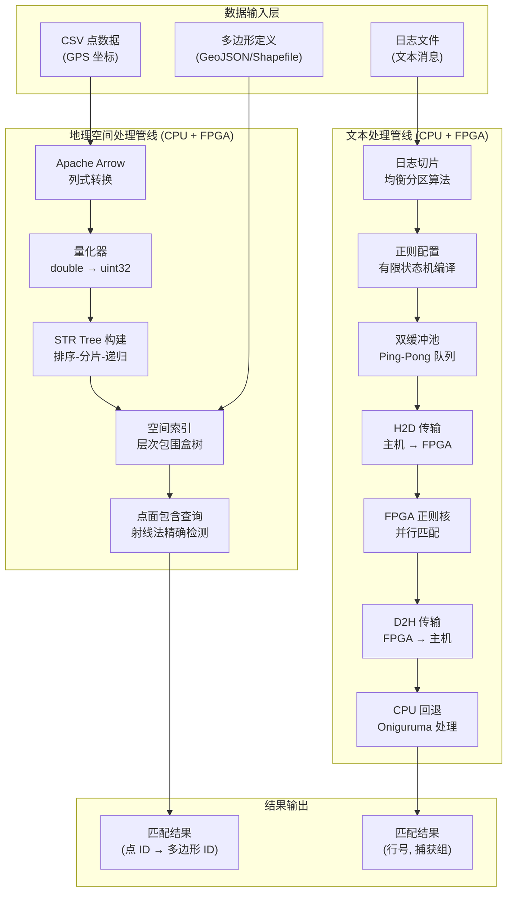

# software_text_and_geospatial_runtime_l3 模块深度解析

## 一句话概括

这是一个**异构加速分析引擎**，同时为地理空间数据（点面关系判断）和文本数据（正则匹配）提供高性能查询能力，通过 FPGA 硬件加速与 CPU 软件回退的混合架构，在 Xilinx 加速卡上实现接近内存带宽的吞吐率。

---

## 问题空间：我们为什么要造这个轮子？

想象你正在处理两类截然不同但都极度"吃算力"的数据分析场景：

**场景 A：地理围栏判定（Geofencing）**
- 你有数千万个 GPS 坐标点（比如网约车订单的上下车位置）
- 你有数万个城市街区、商圈或行政区的多边形边界
- 问题：每个点落在哪个多边形内？（Point-in-Polygon）
- 暴力解法：对每个点检测所有多边形 → O(N×M)，数小时才能算完

**场景 B：日志安全审计**
- 你有数百 GB 的系统日志，每行是一条消息
- 你需要用复杂的正则表达式（比如匹配信用卡号、手机号、SQL 注入特征）扫描所有内容
- 问题：哪些行匹配？捕获组是什么？
- CPU 正则引擎在复杂模式下只能达到数百 MB/s，处理数百 GB 需要数小时

**为什么传统方案不够好？**

1. **纯 CPU 方案**：GeoPandas、PostGIS、PCRE、Boost.Regex 等库功能完备，但受限于 CPU 单核性能和内存带宽，在千万级数据量下性能急剧下降。

2. **纯 GPU 方案**：虽然吞吐高，但正则表达式的复杂分支和回溯逻辑在 GPU 上难以高效实现；空间索引的构建也需要复杂的动态内存分配，不适合 GPU SIMD 架构。

3. **专用硬件（ASIC）**：灵活性太差，无法支持新增的正则模式或自定义的空间索引参数。

**我们的设计目标**：
- **混合架构**：FPGA 负责数据并行、高吞吐的"计算密集型"部分；CPU 负责复杂控制流、不规则内存访问的"逻辑密集型"部分
- **零拷贝流水线**：数据从磁盘 → 内存 → FPGA → 内存 → 后处理，全程使用内存映射和 DMA，避免冗余拷贝
- **自适应回退**：当 FPGA 无法处理某个复杂正则（如需要回溯的深度嵌套）或特殊几何形状时，无缝切换到 CPU 库（Oniguruma、GEOS）处理

---

## 核心抽象：这个模块的"心理模型"

理解这个模块需要建立两个截然不同的抽象心智模型，它们分别对应地理空间和文本处理两个领域。

### 模型一：图书馆索引卡系统（地理空间 STR Tree）

想象你走进一个巨大的图书馆，要找"所有位于北京朝阳区内的书籍"（类比：所有落在这个多边形内的点）。

- **暴力方法**：遍历图书馆每一本书，检查它是否在朝阳区内 → 太慢。
- **索引方法**：图书馆有一个**层级索引系统**：
  - 第一层：按大洲分区（亚洲、欧洲...）
  - 第二层：每个大洲按国家分区（中国、日本...）
  - 第三层：每个国家按城市分区（北京、上海...）
  - 第四层：每个城市按街区分区

**STR Tree（Sort-Tile-Recursive Tree）**就是这个索引系统的数学实现：
- **叶子节点**：实际的数据点（书籍）
- **内部节点**：包围盒（Bounding Box），代表该子树下所有点的最小外接矩形
- **构建过程**：
  1. 将所有点按 X 坐标排序，分成 S 个 slice
  2. 每个 slice 内按 Y 坐标排序，每 NC（Node Capacity，如 16）个点组成一个叶子节点
  3. 对上一层节点重复步骤 1-2，直到只剩一个根节点

**查询过程（点是否在多边形内）**：
1. 从根节点开始，检查多边形与当前节点的包围盒是否相交
2. 如果不相交 → 剪枝（跳过整个子树）
3. 如果相交 → 递归进入子节点
4. 到达叶子节点 → 精确的几何包含检测（射线法判断点是否在多边形内）

**这个模型的好处**：将 O(N) 的暴力扫描降为 O(log N) 的索引查找，对于千万级数据，查询速度从数分钟降到数十毫秒。

### 模型二：自动化装配流水线（正则引擎流水线）

想象一个现代化的汽车装配工厂，有以下几个特点：

1. **流水线（Pipeline）**：汽车底盘从一个工位流向下一个工位，每个工位完成特定任务（装发动机、装轮胎...）
2. **并行工位（Parallel Stations）**：有多个相同的工位同时工作，每个处理不同汽车
3. **双缓冲区（Double Buffering/Ping-Pong）**：工人 A 往缓冲区 1 放零件时，工人 B 从缓冲区 2 取零件，然后交换，避免等待

**正则引擎的数据流 exactly mimic 这个工厂**：

**工位定义**：
- **H2D（Host to Device）工位**：将输入数据（日志消息）从主机内存拷贝到 FPGA 设备内存
- **Kernel（计算）工位**：FPGA 执行正则匹配（有限状态机遍历）
- **D2H（Device to Host）工位**：将匹配结果从 FPGA 拷回主机
- **Post-Process（后处理）工位**：CPU 对 FPGA 无法处理的复杂情况（如需要回溯的捕获组）进行软件回退处理

**双缓冲（Ping-Pong）机制**：
- 系统维护两套缓冲区：`ping` 和 `pong`
- 第 N 批数据在 `ping` 缓冲区进行 H2D 传输时，第 N-1 批数据在 `pong` 缓冲区进行 Kernel 计算
- 当 N 完成 H2D，N-1 完成 Kernel，交换缓冲区角色，流水线无缝继续

**并行度扩展**：
- 多 CU（Compute Unit）：一个 FPGA 上例化多个相同的正则匹配核，每个 CU 处理不同数据切片
- 多线程 memcpy：独立的线程负责 H2D 和 D2H 数据传输，与计算线程并行

**这个模型的好处**：
- **吞吐率最大化**：通过流水线隐藏了数据传输延迟（H2D 和 D2H 与 Kernel 重叠执行）
- **硬件利用率 100%**：FPGA 永远在计算，不会因为等待数据而空闲
- **线性扩展**：增加 CU 数量或 FPGA 卡数量，吞吐率近似线性增长

---

## 架构全景：数据如何流动

以下 Mermaid 图展示了从原始数据输入到最终结果输出的完整数据流，涵盖了地理空间和文本处理两条主线的交互关系。



### 数据流分步详解

#### 地理空间管线（左支）

**阶段 1：数据加载与转换（CSV → Arrow）**
- **输入**：原始 CSV 文件包含经纬度（如 `lat,lng` 两列）
- **处理**：使用 Apache Arrow 的 CSV Reader 将行式存储转换为列式存储（Columnar Format）
- **为什么用 Arrow**：后续需要对整个列进行批量数值计算（量化），列式存储的 CPU Cache 命中率远高于行式存储
- **内存映射**：使用 `mmap` 而非 `read` 加载文件，避免内核态到用户态的内存拷贝，对大文件（数十 GB）至关重要

**阶段 2：坐标量化（Quantization）**
- **输入**：双精度浮点数经纬度（`double`），范围 [-180, 180]
- **处理**：将浮点数映射到 32 位无符号整数（`uint32_t`）
  ```
  x_uint32 = (x_double - zone.xmin) / (zone.xmax - zone.xmin) * Q
  ```
  其中 `Q` 是量化因子（如 $2^{32}-1$）
- **目的**：
  1. 减少内存占用（64bit → 32bit，节省 50% 内存）
  2. FPGA 对整数运算远快于浮点运算
  3. 空间索引的包围盒比较使用整数比较器，可在 FPGA 一个时钟周期完成
- **边界裁剪**：只保留落在目标区域（`zone`）内的点，减少后续索引构建的数据量

**阶段 3：STR Tree 构建（索引构建）**
- **算法**：Sort-Tile-Recursive，一种专为空间数据设计的 R-Tree 变体
- **构建流程**（见代码 `index()` 函数）：
  1. **全局排序**：所有点按 X 坐标全局排序（`std::sort` with `xComp`）
  2. **水平切片**：将排序后的点列切成 S 个 slice（$S = \\sqrt{N/NC}$，$NC$ 为节点容量）
  3. **局内排序**：每个 slice 内部按 Y 坐标排序
  4. **叶子节点生成**：每 $NC$ 个点组成一个叶子节点，计算其包围盒（MBR）
  5. **递归构建**：将叶子节点视为新的"点"，回到步骤 1，构建上一层，直到只剩一个根节点
- **并行优化**：使用 OpenMP（`#pragma omp parallel for`）对 slice 的处理并行化，32 线程并行构建不同 slice 的节点
- **复杂度**：构建复杂度 $O(N \\log N)$，查询复杂度 $O(\\log N)$

**阶段 4：点面包含查询（Query）**
- **输入**：多边形（顶点序列）和已构建的 STR Tree
- **处理流程**（见 `contains()` 函数）：
  1. **树遍历**：从根节点开始广度优先搜索（BFS，使用 `std::queue`）
  2. **包围盒相交测试**：检查多边形与当前节点的包围盒是否相交
     - 不相交 → 剪枝（跳过整个子树）
     - 包含 → 整个子树直接标记为命中（无需递归到叶子）
     - 相交 → 继续递归
  3. **精确检测**：到达叶子节点后，使用**射线法（Ray Casting）**判断点是否在多边形内（`point_in_polygon`）
- **输出**：匹配的点 ID 列表

#### 文本处理管线（右支）

**阶段 1：日志切片（Slicing）**
- **问题**：日志文件可能达数百 GB，无法一次性装入 FPGA 内存，且 FPGA 核有最大处理单元限制
- **解决方案**（`findSecNum` 函数）：
  - 按消息长度将日志切分为多个 slice（section）
  - 每个 slice 满足：总数据量 ≤ `kMaxSliceSize`，消息条数 ≤ `max_slice_lnm`
  - 确保负载均衡，不同 slice 的计算量差异最小化
- **输出**：`sec_num`（切片数量）、`lnm_per_sec`（每切片行数）、`pos_per_sec`（每切片起始位置）

**阶段 2：正则配置编译（Regex Compilation）**
- **输入**：用户提供的正则表达式模式（如 `\\d{4}-\\d{2}-\\d{2}` 匹配日期）
- **处理**：
  1. **CPU 侧编译**：使用 Oniguruma 库将正则表达式编译为内部字节码（`onig_new`），用于后续软件回退
  2. **FPGA 侧配置**：将正则表达式转换为 FPGA 可执行的有限状态机（FSM）配置（`reCfg.compile`），包括：
     - 指令序列（`instr_depth`）：FSM 转移指令
     - 字符类表（`char_class_num`）：如 `[a-zA-Z]` 的字符集合
     - 捕获组配置（`capture_grp_num`）：括号捕获的数量
- **输出**：`re_cfg` 配置位流，通过 OpenCL buffer 传入 FPGA

**阶段 3：双缓冲流水线（Ping-Pong Pipeline）**
这是整个系统的核心创新，类比于显示器的双缓冲：一个缓冲区显示时，另一个缓冲区绘制。

**架构组件**（`threading_pool` 类）：
- **4 个后台线程**：
  - `mcpy_in_ping_t` / `mcpy_in_pong_t`：负责从主机内存拷贝输入数据到 FPGA 的 HBM/DDR（H2D）
  - `mcpy_out_ping_t` / `mcpy_out_pong_t`：负责从 FPGA 拷贝结果回主机（D2H）
- **4 个任务队列**：`q0_ping`、`q0_pong`、`q1_ping`、`q1_pong`，用于线程间通信

**执行流程**（`match_all` 函数中的主循环）：
对于每个 slice `sec`（从 0 到 `sec_num`）：
1. **H2D 阶段**：将第 `sec` 个 slice 的数据放入 `ping` 或 `pong` 缓冲区（根据 `sec % 2` 决定）
2. **Kernel 阶段**：触发 FPGA 正则匹配核，传入配置 buffer 和输入 buffer
3. **D2H 阶段**：FPGA 完成后，结果从设备内存迁移回主机内存
4. **Post-Process 阶段**：CPU 检查每行的匹配结果，对于 FPGA 标记为"复杂模式"（如需要回溯）的行，使用 Oniguruma 重新匹配

**流水线时序**（关键优化）：
- 第 `sec` 个 slice 在进行 H2D 时，第 `sec-1` 个 slice 在 FPGA 中计算（Kernel），第 `sec-2` 个 slice 在进行 D2H
- 通过 `cl_event` 依赖链（`evt_h2d`、`evt_krnl`、`evt_d2h`）确保顺序，同时最大化并行

**阶段 4：软件回退与结果合并（Fallback）**
- **问题**：FPGA 正则引擎针对简单模式（如纯字符串、字符类、有限重复）优化，对于需要复杂回溯（如 `(.+)+` 导致的灾难性回溯）或超长子匹配的情况，FPGA 会标记为"失败代码"（result == 2 或 3）
- **处理**：在 `func_mcpy_out_ping_t` 和 `func_mcpy_out_pong_t` 中，对标记为失败的行，提取原始消息内容，使用 Oniguruma 的 `onig_search` 进行完整正则匹配
- **结果合并**：将 CPU 回退的结果写回输出 buffer，与 FPGA 成功处理的结果合并，形成完整的输出

---

## 子模块概览与导航

本模块由两个在逻辑上独立但共享"混合加速"设计理念的子模块组成：

### 1. 地理空间索引子模块 (`geospatial`)

**职责**：提供高性能的二维空间索引和点面包含查询能力。

**核心文件**：`data_analytics/L3/src/sw/geospatial/strtree_contains.cpp`

**关键类**：
- `STRTree<NC>`：空间索引模板类，`NC` 为节点容量（通常为 16）
- `timeval`：用于性能计时的简单结构体

**详细文档**：[geospatial 子模块详解](data_analytics_text_geo_and_ml-software_text_and_geospatial_runtime_l3-geospatial.md)

### 2. 文本正则引擎子模块 (`text`)

**职责**：提供基于 FPGA 加速的高吞吐正则表达式匹配，支持复杂模式的 CPU 回退。

**核心文件**：`data_analytics/L3/src/sw/text/regex_engine.cpp`

**关键类/结构**：
- `RegexEngine`：主引擎类，管理 FPGA 上下文和匹配流程
- `threading_pool`：管理 Ping-Pong 双缓冲和 4 线程流水线
- `queue_struct`：线程间任务队列的数据结构

**详细文档**：[text 子模块详解](data_analytics_text_geo_and_ml-software_text_and_geospatial_runtime_l3-text.md)

---

## 依赖关系与外部交互

### 上游依赖（本模块依赖谁）

1. **Xilinx Runtime (XRT) / OpenCL**
   - 用途：FPGA 设备管理、内存分配、内核调度
   - 关键 API：`clCreateContext`、`clCreateCommandQueue`、`clEnqueueMigrateMemObjects`、`clEnqueueTask`

2. **Apache Arrow**
   - 用途：高性能 CSV 解析和列式存储
   - 关键类：`arrow::csv::TableReader`、`arrow::Table`、`arrow::ChunkedArray`

3. **Oniguruma**
   - 用途：高质量的正则表达式库，作为 FPGA 复杂模式的 CPU 回退
   - 关键 API：`onig_new`、`onig_search`、`onig_region_new`

4. **OpenMP**
   - 用途：STR Tree 构建阶段的并行加速
   - 关键指令：`#pragma omp parallel for num_threads(32)`

### 下游依赖（谁依赖本模块）

- **L2 Demo 层**：`log_analyzer_demo_acceleration_and_host_runtime_l2`、`duplicate_text_match_demo_l2` 等
- **L3 其他 Runtime**：`gunzip_csv_sssd_api_types_l3` 可能复用 STR Tree
- **Benchmark 工具**：独立的性能测试可执行文件

---

## 新贡献者必读：陷阱与注意事项

### 1. OpenCL 事件链的正确管理

**陷阱**：`cl_event` 是 OpenCL 同步的核心，但极易出现**内存泄漏**或**死锁**。

**正确做法**：
- 每个 `clEnqueue*` 调用返回的 `cl_event` 必须用 `clReleaseEvent` 释放
- 使用 `clSetUserEventStatus` 手动触发事件时，确保事件最终会被触发（否则 `clWaitForEvents` 将永远阻塞）
- 代码中 `queue_struct` 通过 `event` 指针传递事件，确保线程间正确同步

### 2. 对齐分配的内存管理

**陷阱**：`aligned_alloc` 分配的内存**不能**使用 `free` 释放（在某些平台上），必须使用 `free` 的对齐版本或原生的 `free`。

**正确做法**：
- 代码中使用 `details::MM` 类封装对齐分配，其析构函数自动释放内存（RAII 模式）
- 严禁裸调 `aligned_alloc`，统一通过 `mm.aligned_alloc<T>()` 和 `mm.deallocate()`

### 3. 量化精度损失的处理

**陷阱**：地理坐标从 `double` 量化为 `uint32_t` 时，会引入**最多 0.5 个量化单位**的误差，在边界附近可能导致误判。

**正确做法**：
- 代码中 `quanGeoData` 函数通过 `zone` 参数限定有效区域，只量化区域内的点
- 查询时，多边形边界应适当**外扩**一个 epsilon（如 1e-6 度），补偿量化误差
- 对于需要厘米级精度的场景（如自动驾驶），不应使用本模块的量化方案，而应直接使用 `double` 坐标（需修改代码）

### 4. 正则模式的 FPGA 兼容性检查

**陷阱**：并非所有正则表达式都能在 FPGA 上高效执行。某些模式会导致 FPGA **编译失败**或**运行时性能极差**。

**高风险模式**（应尽量避免或强制 CPU 处理）：
- **深度嵌套捕获组**：如 `((a+)*)+`，导致 FPGA 状态机爆炸
- **反向引用**：如 `(a+)\1`，需要存储历史匹配内容，FPGA 不支持
- **无限贪婪匹配**：如 `.*` 配合超长文本，导致 FPGA 缓冲区溢出

**正确做法**：
- 代码中 `RegexEngine` 应在 `compile()` 阶段分析模式复杂度，对高风险模式提前返回警告或强制使用 CPU-only 模式
- 生产环境中，建议先用小数据量测试模式，确认 FPGA 能正确处理后再放大规模

### 5. 线程安全与 OpenMP 的协同

**陷阱**：STR Tree 构建使用 OpenMP 并行，但 OpenMP 线程与正则引擎的 `threading_pool` 是**两套独立的线程体系**，如果混合使用可能导致**线程爆炸**（总线程数 = OpenMP 线程 × Regex 线程，远超 CPU 核心数）。

**正确做法**：
- STR Tree 构建（OpenMP 阶段）和正则匹配（`threading_pool` 阶段）应在**时间上串行**，不要并行执行
- 在调用 `RegexEngine::match()` 前，确保 `STRTree` 已完全构建完毕，反之亦然
- 如果必须在同一进程内同时运行两套系统，应显式限制 OpenMP 线程数（`export OMP_NUM_THREADS=8`）和 Regex 线程数（修改 `threading_pool` 构造函数参数）

---

*本文档由高级软件架构师编写，目标是让新加入团队的资深工程师在 30 分钟内理解模块的设计哲学，并在 1 天内安全地进行代码修改。*