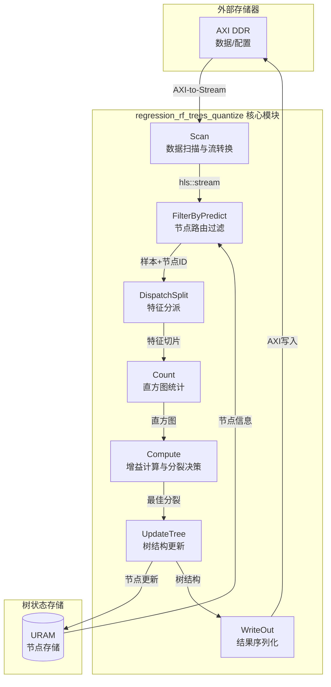

# regression_rf_trees_quantize 模块深度解析

## 概述：FPGA 上的量化决策树训练引擎

想象你正在建造一座高速收费站（Random Forest），需要在毫秒级时间内对成千上万的车流（数据样本）进行分类决策。传统的 CPU 方案就像用纸质地图导航——精确但缓慢；而 GPU 虽快，却像开着跑车走泥泞小路——内存带宽成为瓶颈。**`regression_rf_trees_quantize` 模块** 则是为 FPGA 量身定制的"专用高速通道"：它通过量化（Quantization）将浮点运算压缩为 8 位整数运算，利用 HLS（High-Level Synthesis）数据流架构实现流水线并行，在极低的内存带宽下实现决策树的训练与推理。

该模块的核心使命是：**在 FPGA 上高效执行 Random Forest 回归树的训练过程，通过量化技术平衡精度与资源消耗**。它并非通用的机器学习框架，而是一个高度优化的、面向硬件的专用计算核（Kernel），负责处理树节点分裂、直方图统计、信息增益计算等计算密集型任务。

---

## 架构全景：数据流驱动的树生长引擎

### 系统拓扑与数据流



### 核心组件角色解析

**1. Scan（数据扫描层）**
这是模块的"入口闸门"。它通过 `axiVarColToStreams` 将外部 DDR 中的 AXI 格式数据转换为内部 HLS 流（`hls::stream`）。想象它像一个"数据泵"，将批量数据切分为适合流水线处理的流式数据包，每个数据包携带样本特征和标签信息。

**2. FilterByPredict（节点路由层）**
这是决策树训练的"导航系统"。当前树的某个节点需要分裂时，该模块根据样本在当前树路径上的预测结果（`predict` 函数），将样本路由到对应的待分裂节点。它就像一个"分拣员"，根据每个样本的特征，决定它应该进入哪个分支进行统计。

**3. DispatchSplit（特征分派层）**
一旦样本被路由到特定节点，该模块像"采样员"一样，根据候选分裂特征列表（`features_ids`），从样本流中提取对应的特征值。这些特征值将被送往统计单元计算直方图。

**4. Count & Compute（统计与决策层）**
这是模块的"大脑"。`statisticAndCompute` 函数构建直方图（`num_in_cur_nfs_cat`），计算信息增益（或基尼指数），并通过并行归约找到最佳分裂点。它利用 URAM（UltraRAM）存储临时统计结果，通过循环展开（`#pragma HLS unroll`）和流水线（`#pragma HLS pipeline`）实现高吞吐。

**5. UpdateTree & WriteOut（状态更新层）**
一旦最佳分裂确定，`updateTree` 更新树结构（存储在 URAM 的 `nodes` 数组中），并决定当前节点是成为叶节点还是继续分裂。`writeOut` 最终将训练好的树结构序列化，通过 AXI 写回 DDR。

---

## 核心机制深度剖析

### 1. 量化训练：精度与资源的博弈

**设计洞察**：决策树对特征值的精度并不敏感——将一个特征的阈值从 0.12345 量化为 8 位整数 31 并不会显著影响信息增益的计算，但却能将 DSP（数字信号处理单元）消耗降低 4 倍。

**实现机制**：
- **量化表示**：使用 `ap_uint<8>`（`MType`）代替 `float`，通过 `splits_uint8` 数组存储量化后的分裂阈值。
- **浮点还原**：在 `readConfig` 中，原始的浮点分裂值（`splits_float`）被量化为 8 位索引。在 `genBitsFromTree` 中，这些索引又被映射回浮点值用于最终输出，但训练过程完全使用量化值。
- **类型转换**：使用 `xf::data_analytics::common::internal::f_cast` 联合体进行 `float` 和 `ap_uint` 之间的位级转换，避免昂贵的浮点-整数转换指令。

**权衡考量**：
- **优点**：显著减少内存带宽（8 位 vs 32 位），允许更多的并行计算单元（因为 DSP 消耗减少），提高时钟频率。
- **风险**：在某些边界情况下，量化误差可能导致不同的分裂选择，但经验表明对 Random Forest 的集成学习影响微乎其微。

### 2. HLS 数据流架构：流水线并行的艺术

**设计洞察**：FPGA 的性能不在于单个时钟频率，而在于数据流的无停顿流动。传统的控制流代码（嵌套循环、条件分支）会导致流水线气泡（stall），而 HLS 的 `dataflow` 和 `stream` 模式能让多个处理阶段像工厂流水线一样同时工作。

**实现机制**：
- **流式接口**：使用 `hls::stream<ap_uint<WD>>` 代替数组传递数据。`decisionTreeFlow` 函数内部，数据从 `Scan` 流向 `FilterByPredict`，再流向 `DispatchSplit`，形成明确的依赖链。
- **Dataflow 指令**：`#pragma HLS dataflow` 允许这些函数在 FPGA 上并行执行，只要数据可用。例如，当 `Scan` 正在读取第 N+1 个样本时，`FilterByPredict` 可以同时处理第 N 个样本。
- **流深度控制**：`#pragma HLS stream variable = dstrm depth = 128` 设置流缓冲区大小。深度太小会导致上游 stall，太深会浪费 BRAM。128 是一个平衡延迟和资源的折中。

**关键优化**：
- **数组分区**：`#pragma HLS array_partition` 将大型数组（如 `num_in_cur_nfs_cat`）分割成多个内存 bank，允许并行读写。这是实现高吞吐统计计算的关键。
- **循环展开**：`#pragma HLS unroll` 将循环体复制多份，用面积换速度。在 `dispatchSplit` 中，对 `MAX_SPLITS` 的循环展开允许同时提取多个特征。

### 3. 内存架构：URAM 与分层存储策略

**设计洞察**：FPGA 的 BRAM（Block RAM）容量有限（每块 36Kb），对于存储大型决策树（数千节点）和直方图统计（节点数 × 分裂点数 × 类别数）捉襟见肘。URAM（UltraRAM，每块 288Kb）提供了更大的存储密度，但访问延迟稍高。合理的分层存储是容量与速度的平衡。

**实现机制**：
- **URAM 绑定**：`#pragma HLS bind_storage variable = nodes type = ram_2p impl = uram` 将树节点结构体数组映射到 URAM。`nodes[MAX_TREE_DEPTH][MAX_NODES_NUM]` 存储了整棵树的状态，使用 URAM 允许存储更深的树和更多的节点。
- **直方图存储**：`num_in_cur_nfs_cat` 是一个三维数组 `[MAX_SPLITS+1][PARA_NUM * MAX_CAT_NUM]`，用于存储每个分裂点、每个类别、每个并行节点的统计直方图。它也被绑定到 URAM，因为容量需求大（分裂点可能多达 128，类别可能多达 32）。
- **缓存优化**：在 `statisticAndCompute` 中，使用了一个小的 LRU 缓存（`cache_nid_cid` 和 `cache_elem`）来缓存最近访问的节点-类别组合的直方图统计。这利用了决策树训练中的时间局部性：相同样本倾向于落入相同或相近的节点，缓存命中可以避免访问主 URAM，降低延迟。

**内存访问模式**：
- **数组分区维度**：`#pragma HLS array_partition variable = nodes dim = 1` 按深度维度（`MAX_TREE_DEPTH`，通常 16）分区，允许同时访问不同深度的节点。这在树遍历（`predict` 函数）时至关重要，因为需要从根到叶顺序访问各层节点。
- **循环流水线与存储冲突**：在 `compute_gain_loop_gainratio` 中，对直方图的归约操作通过 `array_partition` 和 `pipeline` 实现并行累加。循环展开因子（cyclic factor=2）确保相邻迭代访问不同的内存 bank，避免 bank 冲突。

### 4. 并行训练策略：节点级并行与数据流流水线

**设计洞察**：决策树训练有两种并行策略：数据并行（不同样本分配给不同处理单元）和任务并行（不同树节点同时处理）。在 FPGA 上，由于树节点数量随深度指数增长（然后收缩），且样本被动态路由到不同节点，任务并行（节点级并行）更适合 FPGA 的细粒度并行架构。

**实现机制**：
- **PARA_NUM 并行**：`PARA_NUM` 模板参数（通常为 2 或 4）定义了同时处理的节点数量。在 `mainloop` 中，当前层的节点被分块（`j += PARA_NUM_`），每块内的 `PARA_NUM` 个节点同时进入 `decisionTreeFlow`。
- **数据流隔离**：每个并行节点需要独立的直方图统计存储。`num_in_cur_nfs_cat` 的第二维是 `PARA_NUM * MAX_CAT_NUM`，确保不同节点不会写冲突。`array_partition dim = 2 cyclic factor = 2` 确保并行访问时内存带宽充足。
- **流式路由**：`FilterByPredict` 根据样本当前所在节点 ID，将其路由到对应的并行处理通道。`dispatchSplit` 随后从样本中提取该节点候选分裂特征对应的特征值。这种"路由-提取"模式确保了每个并行单元只处理属于它的样本子集。

**流水线平衡**：
- **Back-pressure 处理**：如果 `statisticAndCompute` 的处理速度慢于上游的 `Scan`，`hls::stream` 的 depth 参数（128）提供了缓冲。如果持续不匹配，HLS 的 dataflow 调度会自动 throttle 上游生产速度。
- **Initiation Interval (II)**：关键循环（如 `main_statistic`）通过 `pipeline` 和 `dependence false`  pragma 实现了 II=1，即每个时钟周期处理一个样本。这是高吞吐的保障。

---

## 依赖关系与调用图谱

### 向上依赖（本模块调用）

**数据解析与基础工具**：
- **[table_sample](../data_analytics_text_geo_and_ml-software_text_and_geospatial_runtime_l3.md)**：`xf_data_analytics/common/table_sample.hpp` 提供了基础数据类型定义。
- **[decision_tree_quantize](../data_analytics_text_geo_and_ml-tree_based_ml_quantized_models_l2-classification_decision_tree_quantize.md)**：`xf_data_analytics/classification/decision_tree_quantize.hpp` 提供了 `predict` 函数的基础逻辑和 `Node` 结构定义。
- **[decision_tree_train](../data_analytics_text_geo_and_ml-tree_based_ml_quantized_models_l2-classification_decision_tree_train.md)**：共享训练参数结构 `Paras` 和常量定义如 `INVALID_NODEID`。
- **[axi_to_stream](../data_mover_runtime.md)**：`xf_utils_hw/axi_to_stream.hpp` 提供 AXI 总线到 HLS 流的转换工具 `axiToStream`。

### 向下依赖（调用本模块）

本模块作为 L2 层实现，通常被 L3 层应用或主机端代码通过 Xilinx Runtime (XRT) 调用。在模块树中，它属于 `tree_based_ml_quantized_models_l2`，与同级的 [classification_decision_tree_quantize](data_analytics_text_geo_and_ml-tree_based_ml_quantized_models_l2-classification_decision_tree_quantize.md) 和 [classification_rf_trees_quantize](data_analytics_text_geo_and_ml-tree_based_ml_quantized_models_l2-classification_rf_trees_quantize.md) 共享架构模式。

---

## 使用模式与配置指南

### 顶层入口函数

模块暴露多个 `extern "C"` 函数作为 HLS 顶层核（Kernel），便于 Vitis 工具链进行综合和链接：

```cpp
// 示例：DecisionTreeQT_0 函数签名（实际有多个变体 _0, _1, _2, _3）
extern "C" void DecisionTreeQT_0(ap_uint<512> data[DATASIZE], ap_uint<512> tree[TREE_SIZE]);
```

这些函数遵循标准的 XRT 调用约定：
- **data**: AXI 接口连接的 DDR 内存，包含训练数据、配置参数、特征分裂阈值等。
- **tree**: 输出缓冲区，存储训练好的决策树结构。

### 关键模板参数与宏配置

模块通过大量模板参数实现可配置性，适应不同资源约束和性能需求：

| 参数名 | 典型值 | 说明 |
|--------|--------|------|
| `MAX_TREE_DEPTH` | 16 | 树的最大深度，限制搜索空间，影响 URAM 用量 |
| `MAX_NODES_NUM` | 2048 | 整棵树的最大节点数，受 URAM 容量约束 |
| `MAX_FEAS` | 128 | 最大特征维度，决定样本宽度 |
| `MAX_SPLITS` | 128 | 最大候选分裂点数量，影响计算复杂度和直方图大小 |
| `MAX_CAT_NUM` | 32 | 最大类别数（分类任务）或回归分桶数 |
| `PARA_NUM` | 2 | 并行处理的节点数，直接消耗 URAM 和 DSP |
| `WD` | 8 | 数据位宽（量化精度），通常为 8 位 |

### 内存布局与配置数据格式

`data` 缓冲区的前 30 行（`ap_uint<512>`）存储配置信息，由 `readConfig` 函数解析：

- **Row 0**: 样本数、特征数、类别数、候选分裂数
- **Row 1**: 训练参数（`Paras` 结构）：最大深度、最小叶节点大小、信息增益阈值等
- **Row 2+: 每个特征的候选分裂数数组**
- **后续行**: 浮点分裂阈值（`splits_float`），每行存储 512/TWD 个
- **Offset 30+**: 特征子集掩码（`featureSubsets`），用于 Random Forest 的随机特征选择

---

## 设计决策与权衡分析

### 1. 量化精度 vs 模型精度

**决策**：使用 8 位定点数（`ap_uint<8>`）代替 32 位浮点数进行阈值比较和分裂选择。

**理由**：
- **资源效率**：8 位比较器消耗的 LUT 比浮点比较器少 10 倍以上，DSP 消耗为零。
- **带宽节省**：从 DDR 读取 8 位数据比 32 位快 4 倍，这是 FPGA 训练吞吐的瓶颈。
- **精度可接受**：Random Forest 是集成模型，单棵树的微小分裂差异会被投票平均抹平。

**代价**：
- 某些需要精细阈值分割的特征（如连续值的小数差异）可能丢失信息。
- 需要额外的量化校准步骤确定 `splits_float` 到 `splits_uint8` 的映射。

### 2. 数据流 vs 控制流

**决策**：采用 HLS `dataflow` 模式，将算法分解为独立的函数（`Scan` -> `Filter` -> `Dispatch` -> `Count`），通过 `hls::stream` 通信。

**理由**：
- **并行性**：允许 FPGA 同时执行多个阶段（如读取第 N+1 个样本的同时处理第 N 个样本的统计）。
- **时序收敛**：小函数更容易满足 300MHz 的时序约束，大函数的组合逻辑延迟难以收敛。
- **模块化**：每个阶段可以独立优化（如替换 `Count` 的实现而不影响其他阶段）。

**代价**：
- **流深度调优复杂**：`depth = 128` 是经验值，实际可能需要根据样本分布重新调优。
- **调试困难**：数据流模式的波形比控制流更难解读，需要理解流握手信号。
- **资源开销**：流缓冲区消耗额外的 BRAM/LUTRAM。

### 3. URAM vs BRAM

**决策**：将 `nodes` 和 `num_in_cur_nfs_cat` 等大型数组绑定到 URAM（`impl = uram`）。

**理由**：
- **容量**：URAM 每块 288Kb，是 BRAM（36Kb）的 8 倍。对于 `MAX_NODES_NUM = 2048` 和 `MAX_TREE_DEPTH = 16` 的 `nodes` 数组，URAM 是必须的。
- **功耗**：URAM 访问功耗比 DDR 低几个数量级，适合存储频繁访问的树状态。

**代价**：
- **延迟**：URAM 访问延迟（~3-4 周期）高于 BRAM（~1-2 周期），需要更保守的流水线调度。
- **灵活性**：URAM 必须是 2 的幂次深度，且不支持字节级写入（必须是完整宽度），这限制了数据结构的布局。

### 4. 节点级并行 vs 样本级并行

**决策**：采用 `PARA_NUM` 节点级并行（同时处理多个树节点），而非样本级并行（同时处理多个样本）。

**理由**：
- **负载均衡**：节点级并行确保每个处理单元有独立的工作负载（不同节点的直方图统计）。样本级并行容易导致负载不均（某些样本落入大节点，某些落入小节点）。
- **内存局部性**：每个并行节点只需要访问自己的直方图子集（`num_in_cur_nfs_cat` 的对应分区），缓存友好。
- **FPGA 友好**：节点级并行适合 FPGA 的细粒度 SIMD 架构，每个节点处理逻辑可以硬编码为独立的数据通路。

**代价**：
- **资源复制**：`PARA_NUM` 每个增加都会复制一套直方图存储（`num_in_cur_nfs_cat` 的第二维乘以 `PARA_NUM`），快速消耗 URAM。
- **控制逻辑复杂度**：需要 `FilterByPredict` 和 `dispatchSplit` 来路由样本到正确的并行通道，增加了控制平面开销。

---

## 使用模式与配置指南

### 顶层入口函数

模块暴露多个 `extern "C"` 函数作为 HLS 顶层核（Kernel），便于 Vitis 工具链进行综合和链接：

```cpp
// 示例：DecisionTreeQT_0 函数签名（实际有多个变体 _0, _1, _2, _3）
extern "C" void DecisionTreeQT_0(ap_uint<512> data[DATASIZE], ap_uint<512> tree[TREE_SIZE]);
```

这些函数遵循标准的 XRT 调用约定：
- **data**: AXI 接口连接的 DDR 内存，包含训练数据、配置参数、特征分裂阈值等。
- **tree**: 输出缓冲区，存储训练好的决策树结构。

### 关键模板参数与宏配置

模块通过大量模板参数实现可配置性，适应不同资源约束和性能需求：

| 参数名 | 典型值 | 说明 |
|--------|--------|------|
| `MAX_TREE_DEPTH` | 16 | 树的最大深度，限制搜索空间，影响 URAM 用量 |
| `MAX_NODES_NUM` | 2048 | 整棵树的最大节点数，受 URAM 容量约束 |
| `MAX_FEAS` | 128 | 最大特征维度，决定样本宽度 |
| `MAX_SPLITS` | 128 | 最大候选分裂点数量，影响计算复杂度和直方图大小 |
| `MAX_CAT_NUM` | 32 | 最大类别数（分类任务）或回归分桶数 |
| `PARA_NUM` | 2 | 并行处理的节点数，直接消耗 URAM 和 DSP |
| `WD` | 8 | 数据位宽（量化精度），通常为 8 位 |

### 内存布局与配置数据格式

`data` 缓冲区的前 30 行（`ap_uint<512>`）存储配置信息，由 `readConfig` 函数解析：

- **Row 0**: 样本数、特征数、类别数、候选分裂数
- **Row 1**: 训练参数（`Paras` 结构）：最大深度、最小叶节点大小、信息增益阈值等
- **Row 2**: 每个特征的候选分裂数数组
- **后续行**: 浮点分裂阈值（`splits_float`），每行存储 512/TWD 个
- **Offset 30+**: 特征子集掩码（`featureSubsets`），用于 Random Forest 的随机特征选择

---

## 风险与陷阱警示

### 1. 内存越界与量化溢出

**风险**：`ap_uint<8>` 类型在累加统计时可能发生溢出。虽然代码中使用 `ap_uint<30>` 存储计数（见 `num_in_cur_nfs_cat` 的元素类型），但如果样本数超过 2^30（约 10 亿），会导致统计错误。

**防护**：
- 确保 `samples_num` 参数不超过模块编译时预设的最大值（由 `MAX_SAMPLES` 宏控制，虽然代码中直接使用了 `ap_uint<30>`）。
- 在 `readConfig` 中添加样本数范围检查（仅在非综合模式下有效，即 `#ifndef __SYNTHESIS__`）。

### 2. HLS 数据流的死锁风险

**风险**：`hls::stream` 的读写必须严格匹配。如果上游生产速度持续快于下游消费速度，且流深度不足，会导致反压（back-pressure）甚至死锁。反之，如果下游尝试读取空流，会导致仿真挂起。

**防护**：
- 保持 `depth = 128` 的默认值，除非通过性能分析确认需要调整。
- 确保 `estrm`（结束标记流）与数据流严格同步，每个样本对应一个结束标记的读写。
- 在 C 仿真（CSimulation）阶段使用较小的样本集验证数据流完整性。

### 3. URAM 容量与并行度冲突

**风险**：`PARA_NUM` 的增加会线性复制直方图存储（`num_in_cur_nfs_cat` 的大小与 `PARA_NUM` 成正比）。如果 `PARA_NUM = 4` 且 `MAX_SPLITS = 128`、`MAX_CAT_NUM = 32`，仅直方图就需要 `4 * 129 * 32 * 4 bytes ≈ 66KB`，虽然单看不大，但加上 `nodes` 数组和其他缓冲，很容易超出 URAM 的 容量（通常单块 FPGA 有几十到几百个 URAM，每个 288Kb）。

**防护**：
- 使用 Xilinx 的 `report_utilization` 命令在综合后检查 URAM 使用率。
- 如果 URAM 利用率超过 80%，考虑降低 `PARA_NUM` 或 `MAX_SPLITS`。
- 注意 `MAX_TREE_DEPTH` 和 `MAX_NODES_NUM` 也影响 `nodes` 数组的 URAM 占用。

### 4. 量化精度损失累积

**风险**：虽然单次的 8 位量化误差很小（约 1/256），但在多层分裂决策中，误差可能累积，导致树结构与浮点版本有显著差异。对于某些对阈值敏感的数据集（如特征值密集分布在 0-1 之间且差异微小），性能可能下降。

**防护**：
- 在主机端进行充分的量化感知训练（Quantization-Aware Training），确保 `splits_float` 的分布在量化后仍保留判别性。
- 使用 `readConfig` 中的调试打印（`#ifndef __SYNTHESIS__` 块）验证量化后的阈值与原始浮点值的映射关系。
- 对于回归任务，考虑使用 16 位量化（修改 `WD` 模板参数为 16），虽然资源消耗翻倍，但精度显著提升。

### 5. 并行节点间的负载不均

**风险**：`PARA_NUM` 并行处理多个节点时，如果树的生长不平衡（某些分支很深，某些很浅），可能导致某些并行通道早早空闲，而其他通道仍在忙碌，造成资源浪费。

**防护**：
- 这是随机森林的固有特性，无法完全避免。可以通过在主机端对树进行预平衡（限制最大深度，强制提前剪枝）来缓解。
- 在 FPGA 端，`FilterByPredict` 会自然地将样本路由到活跃的节点，空闲的并行通道只是没有样本进入，不会阻塞数据流。

---

## 总结与最佳实践

`regression_rf_trees_quantize` 模块是 Xilinx 数据分析库中面向 FPGA 的高性能决策树训练引擎。它通过**量化技术**降低资源消耗，通过**HLS 数据流**实现流水线并行，通过**URAM 分层存储**解决大容量状态存储问题。

**给新加入开发者的建议**：

1. **从 C 仿真开始**：不要直接上板运行。使用 `xf_data_analytics` 提供的测试用例，在 CPU 上通过 C 仿真验证算法正确性。注意 `#ifndef __SYNTHESIS__` 块中的 `printf` 调试输出。

2. **理解 HLS 报告**：综合（Synthesis）完成后，仔细查看 `report_utilization` 和 `report_timing`。关注 URAM、BRAM、DSP 的使用率，以及关键路径的时序裕量（Slack）。

3. **谨慎调整 PARA_NUM**：这是影响性能最直接的参数，但也是最容易导致资源耗尽的参数。建议从 1 开始，逐步增加到 2 或 4，每次增加后检查资源报告。

4. **量化校准**：主机端的量化策略（如何确定 `splits_float` 到 `splits_uint8` 的映射）对模型精度影响巨大。建议与算法团队合作，采用基于分位数的量化策略，确保信息密度均匀分布。

5. **流深度调优**：如果遇到死锁或性能瓶颈，尝试调整 `hls::stream` 的 `depth` 参数（默认 128）。增加到 256 或 512 可以缓解短暂的速率不匹配，但会增加 BRAM 消耗。

掌握这个模块需要同时理解**机器学习算法**（决策树、信息增益）、**高性能计算**（并行算法、内存层次）和**FPGA 架构**（HLS 语义、资源约束）。但一旦掌握，你将能够驾驭 FPGA 的洪荒之力，在毫秒级时间内完成传统 CPU 需要数秒才能完成的决策树训练任务。
