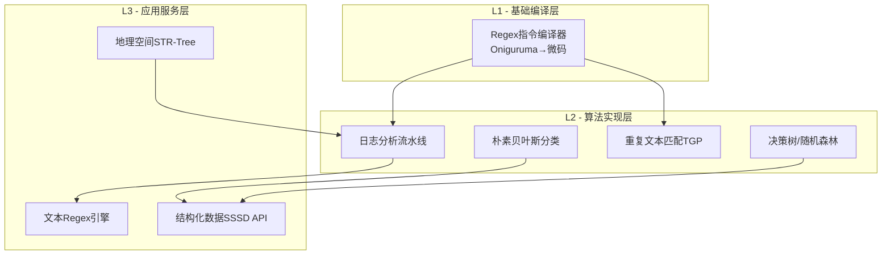
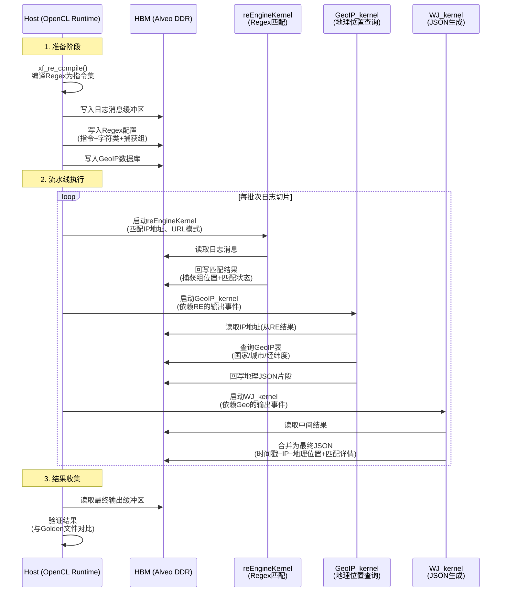

# data_analytics_text_geo_and_ml 模块技术深度解析

## 一句话概括

这是一个为**FPGA加速的数据分析流水线**提供核心能力的模块，专注于三大领域：**文本处理**（正则匹配、去重、分类）、**地理空间查询**（R-Tree索引、点包含检测）、以及**机器学习**（决策树/随机森林训练与推理）。它将复杂的算法拆解为可重配置的硬件核（HLS Kernel），并通过分层软件栈（L1/L2/L3）提供从底层指令编译到高阶API的完整工具链。

---

## 核心问题：这个模块解决了什么？

在大数据时代，**CPU处理文本、地理和ML任务的性能瓶颈**日益凸显。该模块瞄准以下痛点：

1. **正则表达式性能悬崖**：传统CPU regex引擎在复杂模式（如日志分析中的多模式匹配）下吞吐量急剧下降。本模块通过**指令集编译**（将Oniguruma解析树转为FPGA微码）实现确定性低延迟匹配。

2. **地理空间索引的内存墙**：海量POI（兴趣点）的点包含查询（Point-in-Polygon）在CPU上受限于随机内存访问。通过**STR-Tree的FPGA实现**和**流水线化遍历**，将不规则树遍历转化为突发内存访问模式。

3. **ML训练的数据移动开销**：决策树训练需要反复扫描特征直方图。模块采用**量化算术**（8-bit/16-bit定点数）和**特征并行直方图计算**，将计算密度提升至适合FPGA DSP块的级别。

---

## 心智模型：如何理解这个模块的架构？

想象一个**"数据炼金术工厂"**，原料（原始文本、坐标、CSV记录）从左侧进入，经过不同车间（Kernel）的精炼，最终从右侧产出高价值信息（匹配结果、分类标签、地理围栏触发）。

### 三层架构（L1/L2/L3）

**L1（基础编译层）**：如同LLVM将C++转为机器码，L1将**高级正则表达式编译为FPGA微指令**。它使用Oniguruma库解析复杂模式（包括捕获组、字符类、贪婪/惰性量词），生成`xf_instruction`指令流。这是整个模块的"编译器前端"。

**L2（算法实现层）**：这一层包含**可独立部署的HLS Kernel**，每个实现特定算法：
- **朴素贝叶斯**（`naiveBayesTrain_kernel`）：文本分类的训练与推理
- **决策树/随机森林**：使用量化算术（`DecisionTreeQT`）实现高吞吐训练
- **重复文本匹配**（`TGP_Kernel`）：基于2-gram倒排索引的近似去重
- **日志分析流水线**：多阶段流水线（Regex→GeoIP→JSON解析），展示如何将简单Kernel组合为复杂工作流

**L3（应用服务层）**：提供**面向领域的高级API**，隐藏底层Kernel细节：
- **Regex引擎**：封装指令编译、设备内存管理、多批次流水线
- **地理空间STR-Tree**：提供`contains()`查询接口，自动处理FPGA内存布局与树遍历
- **SSSD API**：类PostgreSQL的类型系统（`sssd_string_t`、`sssd_numeric_t`），用于结构化数据分析

---

## 数据流：关键操作的端到端追踪

以**日志分析流水线**（`log_analyzer`）为例，展示数据如何流经整个系统：

**关键观察点**：

1. **事件驱动流水线**：`reEngineKernel`→`GeoIP_kernel`→`WJ_kernel`通过OpenCL事件链串联。每个Kernel的启动依赖前驱的完成事件，实现**软件流水线**（类似CPU的指令流水线，但在粗粒度Kernel级别）。

2. **内存带宽分层**：频繁访问的日志消息和GeoIP数据库驻留在HBM（高带宽内存），而配置参数通过DDR传输。代码中显式使用`CL_MEM_EXT_PTR_XILINX`和内存拓扑绑定（`XCL_BANK`）来优化NUMA访问。

3. **编译时 vs 运行时**：Regex模式在主机端通过`xf_re_compile`（基于Oniguruma）**一次性编译为FPGA指令**，随后多次复用。这分摊了编译开销，适合批量日志处理场景。

---

## 设计权衡：关键决策与取舍

### 1. 指令集架构（ISA）vs 硬连线状态机

**选择**：为Regex引擎实现**可编程指令集**（`xf_instruction`），而非为每个模式生成专用电路。

**权衡分析**：
- **灵活性**：ISA允许在运行时加载新Regex模式（通过`xf_re_compile`重新编译），无需重新综合FPGA比特流。这对于需要支持用户自定义查询的日志分析服务至关重要。
- **面积效率**：专用电路（每个字符一个状态）对固定模式面积更小、更快，但无法共享资源。ISA方案通过时间复用（多周期指令）换取空间，适合多租户云场景。
- **复杂度代价**：必须维护Oniguruma解析器与FPGA微架构的语义一致性。代码中`st_table_entry`、`NameEntry`等结构处理捕获组和命名引用，增加了主机端编译器的复杂度。

### 2. 量化算术 vs 浮点精度

**选择**：在决策树和随机森林中使用**定点量化**（`ap_uint<8>`、量化阈值），而非IEEE-754浮点。

**权衡分析**：
- **DSP效率**：FPGA的DSP48 slice针对定点乘法优化。`decision_tree_quantize.cpp`中的`Node`结构使用`ap_uint<8>`存储分裂阈值，允许单周期比较和分支，而浮点比较需要多周期且消耗更多DSP。
- **内存带宽**：量化模型尺寸缩小4-8倍（vs float32），允许将整个决策森林存入片上URAM（UltraRAM），避免昂贵的DDR访问。代码中`#pragma HLS bind_storage variable = nodes type = ram_2p impl = uram`显式请求URAM。
- **精度损失**：量化引入的误差需要在训练流程中通过感知量化（quantization-aware training）补偿。模块假设输入数据已预量化（`splits_uint8` vs `splits_float`分离存储），将训练复杂性转移给上游工具链。

### 3. 软件流水线 vs 数据流架构

**选择**：在日志分析等复杂工作流中，使用**主机端OpenCL事件链**（软件流水线）而非单一Kernel内的`#pragma HLS DATAFLOW`。

**权衡分析**：
- **灵活性**：`log_analyzer`组合了3个异构Kernel（Regex、GeoIP、JSON生成），每个有不同的最优II（Initiation Interval）和内存访问模式。分离Kernel允许独立优化和复用（如GeoIP Kernel可用于其他管道），而单Kernel DATAFLOW会固化这些阶段。
- **内存隔离**：每个Kernel有独立的HBM bank分配（`conn_u200.cfg`中`sp=reEngineKernel_1.cfg_buff:DDR[0]`等）。分离Kernel避免Axi总线争用，而DATAFLOW共享内存端口可能导致II恶化。
- **延迟代价**：跨Kernel事件同步引入主机端调度延迟（~10-100μs）。代码通过`threading_pool`和`queue_struct`批量提交（每批次处理数百消息）来摊销此开销，但极低延迟场景（<1ms端到端）仍受限于OpenCL运行时。

### 4. 主机端预处理 vs 设备端计算

**选择**：在重复文本匹配（`dup_match`）中，将**2-gram倒排索引构建**保留在主机CPU，仅将相似度计算 offload 到FPGA。

**权衡分析**：
- **数据局部性**：`TwoGramPredicate::index()`构建的`idf_value_`、`tf_addr_`等结构涉及复杂指针追逐（`std::map`、`std::vector`）和动态内存分配，不适合FPGA顺序内存访问模型。主机端C++标准容器提供优化过的哈希和排序，构建速度更快。
- **问题规模**：倒排索引大小与去重数据集规模成线性关系，但索引构建是**一次性**的（或低频更新），而相似度计算是**重复性**的（每个新文档查询）。Amdahl定律指出应加速重复部分，因此FPGA核（`TGP_Kernel`）专注高吞吐相似度计算，主机维护静态索引。
- **一致性复杂性**：若索引在FPGA上，更新索引（插入新文档）需要部分重配置或复杂的事务内存，增加设计复杂度。主机端维护允许使用成熟的数据库/搜索引擎技术管理索引。

---

## 新贡献者指南：陷阱与边界情况

### 1. 内存对齐与Xilinx扩展指针

**陷阱**：`test_nb.cpp`和`log_analyzer.cpp`中频繁使用`aligned_alloc`和`cl_mem_ext_ptr_t`。未对齐的内存会导致DMA传输失败或性能骤降。

**必须遵守的契约**：
- 所有用于FPGA DMA的缓冲区必须通过`aligned_alloc<ap_uint<512>>(size)`分配，确保**64字节（512-bit）对齐**。
- 使用`cl_mem_ext_ptr_t`时，必须设置`flags = XCL_MEM_TOPOLOGY | bank_id`（如`XCL_BANK0`），否则内存可能绑定到错误的HBM bank，导致带宽争用。
- **生命周期管理**：`cl::Buffer`对象必须在主机端保持存活，直到所有依赖的OpenCL事件完成。过早释放会导致FPGA访问已释放的主机内存（SEGV）。

### 2. Regex指令缓存与重编译开销

**陷阱**：`xf_re_compile`基于Oniguruma，编译复杂Regex（含大量捕获组或反向引用）可能消耗**数十毫秒**。若在热路径中每次查询都重新编译，将抵消FPGA加速收益。

**边界情况**：
- **捕获组限制**：`xf_instruction`使用`ap_uint<8>`存储`mode_len`，最多支持255个字符类和有限数量的捕获组（`cpgp_nm`）。超出此范围的模式会导致`XF_UNSUPPORTED_OPCODE`。
- **动态缓冲区溢出**：`xf_re_compile.c`中的`dyn_buff`使用固定增量（128）重新分配。编译极复杂模式时，若未检查`size`上限，可能导致主机内存耗尽。
- **命名捕获组解析**：代码遍历`reg->name_table`（`st_table`）提取捕获组名称。若输入模式包含无效UTF-8序列或超长名称（`name_len`），`memcpy`到`cpgp_name_val`可能溢出。

### 3. HLS DATAFLOW的死锁与依赖

**陷阱**：`decision_tree_quantize.cpp`和`rf_trees_quantize.cpp`大量使用`#pragma HLS DATAFLOW`和`hls::stream`。并发阶段间的依赖管理不当会导致**仿真死锁**或**硬件挂起**。

**关键约束**：
- **流深度匹配**：`hls::stream`的`depth`参数必须匹配生产者-消费者速率差。如`dstrm_batch`（读取AXI）与`nstrm_disp`（节点ID）深度不足时，若生产者突发写入快于消费者，将阻塞DATAFLOW。
- **数组分区粒度**：`#pragma HLS array_partition variable = nodes dim = 1`将`nodes[MAX_TREE_DEPTH][MAX_NODES_NUM]`按深度维度完全分区。这允许并行访问不同树层，但**指数级增加寄存器压力**。若`MAX_TREE_DEPTH=16`且`MAX_NODES_NUM=1024`，将实例化16个独立存储，可能超出BRAM容量。
- **依赖假循环**：`statisticAndCompute`中的`num_in_cur_nfs_cat`是跨迭代的累积数组。`#pragma HLS dependence variable = num_in_cur_nfs_cat inter false`断言无跨迭代依赖，但这是**危险的**：若`n_cid`（节点-类别ID）在连续迭代中重复，将产生读-写冲突。必须确保输入数据的分区保证`n_cid`唯一性，否则硬件行为未定义。

### 4. 量化数值精度与溢出

**陷阱**：树模型使用`ap_uint<8>`存储分裂阈值和特征索引。从浮点训练数据量化时，**精度损失可能导致决策边界偏移**。

**数值边界**：
- **分裂阈值范围**：`MType`（量化后）为8-bit无符号整数（0-255）。若原始浮点特征值范围超出`[min, max]`且未正确缩放，量化将饱和（clamp到0或255），导致所有样本落入同一分支，树退化为叶子。
- **增益计算溢出**：`clklogclk`和`crklogcrk`累积`l_cat_k * l_cat_k`（类别计数的平方）。若`MAX_CAT_NUM=32`且样本数>2^16，平方项可能溢出64-bit整数。`num_in_cur_nfs_cat`是32-bit有符号整数，若直方图bin计数超过2^31-1，将回绕为负数，导致增益计算错误。
- **浮点比较陷阱**：`predict`函数中`feature_val <= threshold`使用量化后的定点数比较。若训练时和推理时的量化缩放因子不一致（如训练用`scale=1.0/256`，推理用`scale=1.0/255`），比较逻辑将系统性偏差。

---

## 子模块文档索引

本模块的详细子模块文档已委派生成，可通过以下链接访问：

1. **[L1 Regex编译核心](regex_compilation_core_l1.md)** - 基于Oniguruma的正则表达式到FPGA指令集编译器，包含动态缓冲区管理、捕获组解析和指令编码格式。

2. **[L2 朴素贝叶斯基准流水线](naive_bayes_benchmark_pipeline_l2.md)** - 文本分类的硬件加速实现，涵盖HBM/DDR内存配置、CSR格式数据加载和OpenCL主机 orchestration。

3. **[L2 重复文本匹配演示](duplicate_text_match_demo_l2.md)** - 基于2-gram倒排索引的近似去重系统，包含TGP Kernel的ping-pong缓冲策略和主机端相似度计算。

4. **[L2 日志分析加速与主机运行时](log_analyzer_demo_acceleration_and_host_runtime_l2.md)** - 复杂多阶段流水线（Regex→GeoIP→JSON），展示事件驱动架构、线程池调度和HLS DATAFLOW死锁避免。

5. **[L2 基于树的ML量化模型](tree_based_ml_quantized_models_l2.md)** - 决策树与随机森林的HLS实现，深入分析量化数值精度、数组分区策略、直方图计算依赖和BRAM/URAM资源分配。

6. **[L3 Gunzip CSV SSSD API类型](gunzip_csv_sssd_api_types_l3.md)** - 结构化数据分析的类型系统，定义`sssd_string_t`、`sssd_numeric_t`等跨主机-FPGA边界的二进制兼容格式。

7. **[L3 软件文本与地理空间运行时](software_text_and_geospatial_runtime_l3.md)** - 包含STR-Tree空间索引的FPGA卸载逻辑、点包含查询的数值稳定性处理，以及Regex引擎的主机端多线程调度。

---

## 跨模块依赖关系

本模块在系统中与以下模块存在关键依赖：

- **[codec_acceleration_and_demos](codec_acceleration_and_demos.md)** - 当处理图像或压缩日志（如JPEG/PNG元数据提取、Gunzip解压CSV）时，本模块的分析核依赖codec模块的解压Kernel进行预处理。在`gunzip_csv`子模块中，解压后的数据直接流入`sssd_scan` API。

- **[database_query_and_gqe](database_query_and_gqe.md)** - 本模块的决策树/随机森林可作为GQE（Gigabit Query Engine）的**用户定义函数（UDF）**。`sssd_scandesc_t`中的`filter`和`hashatt`定义与GQE的表扫描算子共享内存布局，允许在FPGA上直接执行"SELECT * FROM table WHERE ml_classifier(feature) > 0.9"。

- **[graph_analytics_and_partitioning](graph_analytics_and_partitioning.md)** - 地理空间STR-Tree的R-Tree变种与图分析模块的**空间索引**（如用于位置感知的图遍历）共享底层内核逻辑。`strtree_contains`中的矩形交集代码与图模块的`op_louvain`社区检测中的空间分区存在可复用的HLS原语。

- **[data_mover_runtime](data_mover_runtime.md)** - 本模块所有Kernel都依赖`data_mover`的XDMA内核进行主机-设备数据传输。`regex_engine.cpp`中的`threading_pool`通过OpenCL事件对象与data_mover的零拷贝API协调，确保`clEnqueueMigrateMemObjects`与Kernel执行重叠。

---

## 快速开始：新贡献者检查清单

若你要修改此模块，请按以下顺序验证：

1. **[ ] 内存对齐检查**：所有`malloc`/`new`替换为`aligned_alloc<ap_uint<512>>`，并验证`cl_mem_ext_ptr_t`的`obj`指针与`cl::Buffer`生命周期匹配。

2. **[ ] Regex编译缓存**：确认`xf_re_compile`的调用不在热循环内。若必须动态编译，实现编译结果LRU缓存（参考`log_analyzer`的`reCfg`对象复用）。

3. **[ ] HLS DATAFLOW死锁测试**：在`decision_tree_quantize.cpp`等DATAFLOW区域插入`#ifndef __SYNTHESIS__`的`printf`断言，验证所有`hls::stream`的读写配对。使用Vitis仿真器检测潜在死锁（当`depth`参数不足时）。

4. **[ ] 量化数值范围检查**：在`decision_tree_train`中，验证`feature_val`的量化缩放因子与训练脚本一致。使用`assert(feature_val <= 255)`捕获溢出。

5. **[ ] OpenCL事件泄漏检查**：在`regex_engine.cpp`的`threading_pool`析构中，确认所有`cl_event`已调用`clReleaseEvent`。使用`CL_QUEUE_PROFILING_ENABLE`时，事件引用计数错误会导致主机内存泄漏。

6. **[ ] 跨平台内存配置验证**：若修改`conn_u200.cfg`或`conn_u50.cfg`的`sp=`（AXI端口绑定），在U50（HBM）和U200（DDR）上分别验证。HBM需要`CL_MEM_EXT_PTR_XILINX`显式指定bank，DDR通常使用默认分配。

7. **[ ] 数值稳定性回归测试**：在`strtree_contains`中，修改量化参数`Q`（默认4096）后，运行地理围栏测试验证点包含判定未因整数溢出而翻转。使用`strtree_contains.timeval`结构记录精度损失。
