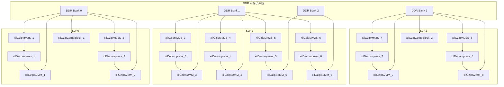

# gzip_app_kernel_connectivity 模块深度解析

## 概述：FPGA 上的高吞吐 GZIP 流水线

想象你正在设计一条工厂流水线，但这条流水线每秒要处理数十亿字节的数据，而且每个处理单元（"工位"）都必须是硬连线的专用电路。`gzip_app_kernel_connectivity` 模块就是这个工厂的"电气布线图纸"——它定义了 Xilinx FPGA 上 GZIP 压缩/解加速器的完整数据通路、存储映射和物理布局。

这不是普通的软件配置文件。它是 Vitis 硬件链接阶段的声明式 DSL，决定了内核（kernels）之间如何以 AXI4-Stream 协议点对点通信、每个计算单元驻扎在 FPGA 芯片的哪个 Super Logic Region (SLR)、以及本地缓冲区和 DDR 内存银行之间的映射关系。理解这个文件，就是理解如何在硅片上编排并行计算的艺术。

---

## 架构全景：数据如何在硅片上流动

### 系统拓扑概览



### 内核类型与职责

| 内核类型 | 实例数 | 核心功能 | 类比 |
|---------|--------|---------|------|
| `xilGzipMM2S` | 8 | Memory-to-Stream 转换器，从 DDR 读取原始压缩数据并转换为 AXI4-Stream | "数据入口闸门" |
| `xilDecompress` | 8 | GZIP 解压缩核心，执行 DEFLATE 算法解码 | "主加工机床" |
| `xilGzipS2MM` | 8 | Stream-to-Memory 转换器，将解压后的数据流写回 DDR | "数据出口闸门" |
| `xilGzipCompBlock` | 2 | GZIP 压缩块处理器（完整压缩流程） | "重型压缩车间" |

---

## 核心概念详解

### 1. Stream Connect：AXI4-Stream 流水线编排

```cfg
stream_connect=xilGzipMM2S_1.outStream:xilDecompress_1.inaxistreamd
stream_connect=xilDecompress_1.outaxistreamd:xilGzipS2MM_1.inStream
```

这些配置行建立了**点对点 AXI4-Stream 通道**，构成了 8 条并行的解压缩流水线。每条流水线的数据流如下：

1. **MM2S** 从 DDR 读取压缩数据块，通过 `outStream` 端口输出
2. **Decompress** 从 `inaxistreamd` 接收数据，解压后从 `outaxistreamd` 输出
3. **S2MM** 从 `inStream` 接收解压数据，写入 DDR

**设计意图**：使用流式接口而非内存映射接口，消除了对中央内存控制器的竞争，实现了**无阻塞流水线**。每个阶段可以在输入数据可用时立即开始处理，无需等待完整数据块写入内存。

### 2. SLR 布局：物理硅片上的地域规划

```cfg
slr=xilGzipCompBlock_1:SLR0
slr=xilGzipCompBlock_2:SLR2
```

SLR（Super Logic Region）是 Xilinx UltraScale+ 和 Versal 设备中的物理分区。将内核分配到特定 SLR 有三大工程考量：

**跨 SLR 延迟管理**：SLR 之间的连接需要通过硅中介层（interposer）或超级长连线（SLR crossing），信号延迟显著高于 SLR 内部。将高带宽流式连接（如 MM2S→Decompress→S2MM）放置在同一 SLR，可确保**流水线寄存器间距足够短**，满足时序收敛。

**资源密度平衡**：每个 SLR 的 LUT、FF、BRAM、DSP 资源有限。将 2 个压缩块分别放在 SLR0 和 SLR2，是为了**分散大型计算单元的资源占用**，避免单个 SLR 过度拥挤导致布线拥塞。

**内存接口 proximity**：DDR 控制器通常绑定到特定 SLR。将 MM2S/S2MM 内核分配到与目标 DDR bank 相同的 SLR，可以**最小化 AXI4-Full 路径的物理走线长度**。

### 3. SP（Scalar Port）映射：内存银行的负载均衡

```cfg
sp=xilGzipS2MM_1.out:DDR[0]
sp=xilGzipS2MM_1.encoded_size:DDR[0]
sp=xilGzipS2MM_1.status_flag:DDR[0]
```

`sp` 指令将内核的 AXI4-Full 端口映射到特定的 DDR 内存 bank。这是一个**经典的并行计算负载均衡问题**：

**带宽聚合**：现代 FPGA 加速卡（如 Alveo U280、U50）具有多个独立的 DDR 控制器。通过将 8 个 S2MM 实例的输出分散到 4 个 DDR bank（每个 bank 服务 2 个 S2MM），系统实现了**聚合内存带宽的最大化**。如果所有 S2MM 都指向同一个 DDR bank，该 bank 的带宽将成为系统瓶颈。

**访问模式分离**：`out`（解压数据输出）、`encoded_size`（压缩后大小元数据）、`status_flag`（完成状态标志）被映射到同一个 DDR bank 是有意为之。这利用了**空间局部性**——主机驱动程序通常会按顺序查询状态、读取大小、然后读取数据，将它们放在同一 bank 可以减少 row buffer 切换开销。

### 4. NK（Number of Kernels）：实例化与命名约定

```cfg
nk=xilGzipS2MM:8:xilGzipS2MM_1.xilGzipS2MM_2.xilGzipS2MM_3.xilGzipS2MM_4.xilGzipS2MM_5.xilGzipS2MM_6.xilGzipS2MM_7.xilGzipS2MM_8
```

`nk` 指令将一个 HLS 内核模板实例化为多个具体的硬件单元，并赋予它们实例名称。这类似于 C++ 的模板实例化，但在硅片层面。

**命名约定**：`xilGzipS2MM_1` 到 `_8` 的命名不是装饰性的——它必须与 `stream_connect` 和 `sp` 指令中的名称完全匹配。这种**显式枚举**策略（而非通配符或索引范围）使得依赖关系在文本文件中一目了然，便于版本控制和差异比较。

---

## 数据流深度追踪：一次完整的解压操作

让我们追踪一个压缩数据块从主机内存进入 FPGA、被解压、然后返回主机的完整旅程：

### 阶段 1：主机准备与 DDR 写入（软件域）

主机驱动程序（位于 [gzip_host_library_core](data_compression_gzip_system-gzip_host_library_core.md)）将一个压缩数据块写入 FPGA 卡上的 DDR Bank 0 的特定偏移位置。这个写入通过 PCIe 总线，由板载的 DMA 引擎完成。

**关键契约**：主机必须确保数据在通知 FPGA 内核开始处理之前已经完全写入 DDR。这通常通过内存屏障或显式的 DMA 完成中断实现。

### 阶段 2：MM2S 从 DDR 读取（AXI4-Full → AXI4-Stream）

`xilGzipMM2S_1` 内核从它的 `in` 端口（映射到 DDR[0]）读取压缩数据。这个内核是一个**数据搬运工**：它执行 AXI4-Full 突发读取（burst read），将数据从 DDR 读入内部 FIFO，然后转换为 AXI4-Stream 协议，通过 `outStream` 端口输出。

**流控机制**：如果下游的 `xilDecompress_1` 暂时无法接收数据（例如正在处理一个复杂的 Huffman 块），AXI4-Stream 的 `TREADY`/`TVALID` 握手机制会反压（backpressure）到 MM2S，使其暂停读取 DDR，从而**自动实现流量匹配**。

### 阶段 3：Decompress 解压计算（纯流式处理）

`xilDecompress_1` 从 `inaxistreamd` 接收压缩数据流，执行 DEFLATE 算法解压，从 `outaxistreamd` 输出原始数据。

**内部架构**（推测自 HLS 常见模式）：这个内核很可能使用 `#pragma HLS DATAFLOW` 将解压过程分解为多个流水线阶段——例如：\n1. **Bitstream 解析**：从字节流中提取变长码字\n2. **Huffman 解码**：将码字转换为长度-距离对或字面量\n3. **LZ77 回溯**：根据距离-长度对从滑动窗口复制历史数据\n\n这些阶段通过 `hls::stream` 通道连接，实现**时空并行**——当阶段 N 在处理第 M 个数据块时，阶段 N+1 可以同时处理第 M-1 个数据块。\n\n### 阶段 4：S2MM 写回 DDR（AXI4-Stream → AXI4-Full）\n\n`xilGzipS2MM_1` 从 `inStream` 接收解压后的数据流，执行 AXI4-Full 突发写入（burst write），将数据写回 DDR[0]的 `out` 缓冲区。\n\n**元数据同步**：除了数据本身，S2MM 还写入两个关键元数据：\n- `encoded_size`：实际写入的字节数（用于变长输出）\n- `status_flag`：操作完成状态（成功/错误码）\n\n这三个缓冲区（`out`、`encoded_size`、`status_flag`）都映射到同一个 DDR bank，确保主机在轮询状态时不会发生跨 bank 的延迟惩罚。\n\n### 阶段 5：主机读取结果（软件域）\n\n主机驱动轮询 `status_flag`（或通过中断接收通知），确认解压完成后，从 `out` 缓冲区读取解压数据，从 `encoded_size` 读取实际数据长度。\n\n---\n\n## 设计决策与工程权衡\n\n### 权衡 1：8 路并行 vs 资源消耗\n\n**观察**：配置了 8 个并行的 MM2S→Decompress→S2MM 流水线，但只有 2 个 xilGzipCompBlock。\n\n**决策逻辑**：\n- **解压缩是此配置的重点**：8 路解压流水线表明工作负载偏向读取压缩数据（如数据库查询、日志分析）。\n- **解压的资源效率更高**：Decompress 内核主要包含查找表和有限状态机，逻辑占用相对较小。CompBlock 包含复杂的哈希表、字符串匹配引擎，资源消耗可能是 Decompress 的 5-10 倍。\n- **带宽匹配**：8 条解压流水线可以同时 saturating 4 个 DDR bank 的聚合带宽（假设每条流水线处理 200MB/s，8 条共 1.6GB/s，在 DDR4-2400 的理论带宽范围内）。\n\n**替代方案**：如果工作负载需要均衡的压缩/解压能力，可以重新配置为 4 条压缩流水线 + 4 条解压流水线，或动态切换内核功能（如果 HLS 内核支持运行时重配置）。\n\n### 权衡 2：SLR 放置的物理约束\n\n**观察**：\n- SLR0：MM2S_1-2, Decompress_1-2, S2MM_1-2, CompBlock_1\n- SLR1：MM2S_3-6, Decompress_3-6, S2MM_3-6\n- SLR2：MM2S_7-8, Decompress_7-8, S2MM_7-8, CompBlock_2\n\n**决策逻辑**：\n- **SLR1 承担主要负载**：4 条流水线（3-6）集中在 SLR1，因为 SLR1 通常位于芯片中央，与所有 DDR bank 的距离相对均衡。\n- **SLR0 和 SLR2 作为端点**：各放置 2 条流水线，分散 I/O 压力。SLR0 靠近 PCIe 硬 IP（通常位于 SLR0），适合作为主机通信的入口；SLR2 作为另一端，平衡布局。\n- **CompBlock 分散放置**：两个压缩块分别放在 SLR0 和 SLR2，而非集中在中间，是为了**避免资源热点**。如果都放在 SLR1，可能导致该区域的 LUT/BRAM 利用率超过 80%，触发布线拥塞。\n\n**时序风险点**：跨 SLR 的流连接（如 SLR0 的 Decompress 到 S2MM 在同一 SLR，没问题；但如果需要跨 SLR 级联）需要插入流水线寄存器（register slice）。当前配置中，每条 MM2S→Decompress→S2MM 链路都在同一 SLR 内，这是**最优的时序收敛配置**。\n\n### 权衡 3：DDR Bank 分配策略\n\n**观察**：\n- DDR[0]：MM2S_1-2 的输入，S2MM_1-2 的输出，CompBlock_1 的所有缓冲区\n- DDR[1]：MM2S_3-4 的输入，S2MM_3-4 的输出\n- DDR[2]：MM2S_5-6 的输入，S2MM_5-6 的输出\n- DDR[3]：MM2S_7-8 的输入，S2MM_7-8 的输出，CompBlock_2 的所有缓冲区\n\n**决策逻辑**：\n\n**方案 A：完全分离（当前采用）**\n- 每个 DDR bank 服务 2 条流水线（输入+输出在同一 bank，或跨 bank 配对）\n- **优势**：零银行冲突（bank conflict），每个内核独占其 bank 的带宽\n- **代价**：如果某条流水线空闲，其 bank 带宽无法被其他流水线借用\n\n**方案 B：输入/输出分离（替代设计）**\n- 所有 MM2S 从 DDR[0-1] 读取，所有 S2MM 写入 DDR[2-3]\n- **优势**：读/写通道物理分离，避免读写切换的页打开延迟（page open penalty）\n- **代价**：需要双倍的数据缓冲区，主机必须在两组 DDR 之间搬运数据\n\n**当前选择的工程理由**：\n1. **对称性**：8 条流水线被均匀地分配到 4 个 bank，每 bank 2 条，资源占用可预测\n2. **局部性**：CompBlock 被绑定到 bank 0 和 3，与同一 SLR 的流水线共享 bank，减少跨 bank 走线\n3. **时序闭合**：避免跨 bank 的高扇出网络，每个 bank 的控制逻辑独立\n\n### 权衡 4：为何 8 个 Decompress 但只有 2 个 CompBlock\n\n这是本配置中最具指示性的设计决策。\n\n**资源占用对比**（基于典型 HLS 实现估算）：\n\n| 组件 | LUT 估算 | BRAM 估算 | 关键路径复杂度 |\n|------|---------|----------|--------------|\n| xilGzipMM2S | ~2K | 4-8 (FIFO) | 低（数据搬运） |\n| xilDecompress | ~15K | 20-30 (窗口+表) | 中（Huffman 解码 FSM） |\n| xilGzipS2MM | ~2K | 4-8 (FIFO) | 低（数据搬运） |\n| xilGzipCompBlock | ~80K+ | 100+ (哈希表+窗口) | 高（字符串匹配+LZ77） |\n\n**设计启示**：\n- 一个 CompBlock 的资源消耗约等于 4-5 个 Decompress 实例\n- 如果配置 8 个 CompBlock，仅压缩内核就会占满整个 FPGA 的 LUT 资源\n- 本配置明确**偏向解压密集型工作负载**（如大数据分析、日志处理、读取压缩数据库）\n\n**动态调度可能性**：\nCompBlock 数量较少（2 个）并不意味着系统只能处理 2 个并发压缩任务。如果 Host 库实现了**任务队列和动态调度**，多个软件线程可以提交压缩任务到 2 个硬件 CompBlock，由驱动程序进行负载均衡。这种"多对少"的映射在任务粒度较小、启动开销较低时效率很高。\n
---

## 依赖关系与调用图

### 上游依赖（谁调用/配置本模块）

| 模块/工具 | 关系类型 | 说明 |
|---------|---------|------|
| Vitis 链接器 (`v++ -l`) | 消费者 | 本 `.cfg` 文件作为 `--config` 参数传递给链接器，指导硬件连接和布局 |
| [gzip_host_library_core](data_compression_gzip_system-gzip_host_library_core.md) | 协作者 | Host 库在运行时通过 `xclExecBuf` 等 API 配置内核的 `size`/`offset` 参数，启动处理 |
| HLS 内核源码 (`*.cpp`) | 被依赖 | 配置文件中引用的内核名称必须与 HLS 编译生成的 `.xo` 对象中的内核名匹配 |

### 下游依赖（本模块配置的对象）

| 对象类型 | 实例名称模式 | 数量 | 说明 |
|---------|------------|------|------|
| MM2S 内核实例 | `xilGzipMM2S_{1..8}` | 8 | Memory-to-Stream 数据入口 |
| Decompress 内核实例 | `xilDecompress_{1..8}` | 8 | DEFLATE 解压核心 |
| S2MM 内核实例 | `xilGzipS2MM_{1..8}` | 8 | Stream-to-Memory 数据出口 |
| CompBlock 内核实例 | `xilGzipCompBlock_{1..2}` | 2 | 完整 GZIP 压缩块 |

---

## 实用指南：如何修改与扩展

### 增加流水线数量的步骤

假设你需要将解压缩流水线从 8 条增加到 12 条（以利用更大 FPGA 的额外资源）：

1. **扩展内核实例列表**：
   ```cfg
   nk=xilGzipMM2S:12:xilGzipMM2S_1.xilGzipMM2S_2.xilGzipMM2S_3.xilGzipMM2S_4.xilGzipMM2S_5.xilGzipMM2S_6.xilGzipMM2S_7.xilGzipMM2S_8.xilGzipMM2S_9.xilGzipMM2S_10.xilGzipMM2S_11.xilGzipMM2S_12
   ```

2. **添加 Stream Connect**：
   ```cfg
   stream_connect=xilGzipMM2S_9.outStream:xilDecompress_9.inaxistreamd
   stream_connect=xilDecompress_9.outaxistreamd:xilGzipS2MM_9.inStream
   # ... 重复 10-12
   ```

3. **分配 SLR**：根据目标 FPGA 的 SLR 数量，将新内核分配到 SLR0/1/2（或 SLR3 如果设备支持）。

4. **映射 DDR Bank**：确保新的 S2MM 实例映射到现有 bank（如果带宽充足）或利用额外的 DDR bank（如果设备支持）。

### 调整压缩/解压比例的策略

如果你的工作负载需要更多压缩能力（例如从 2 个 CompBlock 增加到 4 个）：

1. **检查资源预算**：使用 `report_utilization` 确认目标 FPGA 的剩余 LUT/BRAM 是否足够（每个 CompBlock 约需 80K LUT，4 个需要 320K+ LUT）。

2. **平衡 SLR 放置**：将 4 个 CompBlock 分配到 SLR0、SLR1、SLR2（各 1 个）+ SLR0/2 额外 1 个，避免单个 SLR 资源过载。

3. **DDR Bank 分配**：CompBlock 需要访问 `in`、`out`、`compressd_size`、`checksumData` 缓冲区。将这些分散到不同 bank 以平衡带宽压力。

---

## 常见陷阱与调试建议

### 陷阱 1：Stream Connect 名称不匹配

**症状**：链接阶段报错 `CRITICAL WARNING: Stream connection 'xilGzipMM2S_1.outStream' not found`。

**原因**：`stream_connect` 中使用的实例名（如 `xilGzipMM2S_1`）与 `nk` 指令中定义的名称不匹配（如拼写错误 `xilGzipMM2S_01`）。

**排查**：使用 `grep` 确保所有引用一致：
```bash
grep -E "(nk=|stream_connect=).*xilGzipMM2S_1[\.:]" connectivity.cfg
```

### 陷阱 2：DDR Bank 越界

**症状**：链接报错 `ERROR: DDR bank index out of range`。

**原因**：配置中引用了 `DDR[4]` 或更高，但目标设备只有 4 个 bank（索引 0-3）。

**解决**：检查目标 FPGA 的数据手册（如 U280 有 4 个 DDR bank，U50 有 2 个 HBM 堆），确保 `sp` 指令只使用有效索引。

### 陷阱 3：SLR 放置冲突

**症状**：实现阶段报错 `ERROR: Placement failed - SLR crossing violation`。

**原因**：将内核分配到不存在的 SLR（如在双 SLR 设备上配置 `slr=kernel:SLR2`），或两个高扇出内核被强制放在不同 SLR 但流连接需要跨越 SLR 边界。

**解决**：使用 `platforminfo` 工具查询目标平台的 SLR 数量：
```bash
platforminfo -p <platform.xpfm> | grep -i slr
```

### 调试技巧：验证连接完整性

在修改配置文件后，使用以下步骤验证：

1. **语法检查**：确保没有重复的实例名或格式错误：
   ```bash
   awk -F'=' '/^nk=/{print $3}' connectivity.cfg | tr '.' '\n' | sort | uniq -d
   # 应该无输出（无重复实例名）
   ```

2. **连通性检查**：确保每个内核的输入都有对应的输出连接：
   ```bash
   # 提取所有 stream_connect 的目标和源
   grep "stream_connect" connectivity.cfg | sed 's/stream_connect=//; s/:/ /g'
   ```

3. **链接试运行**：在实际硬件链接前，使用 `--save-temps` 和 `--log_dir` 保留中间文件，检查 `.xclbin.link` 阶段的报告。

---

## 模块关系与参考

### 同层级兄弟模块

| 模块 | 关系 | 说明 |
|------|------|------|
| [gzip_hbm_kernel_connectivity](data_compression_gzip_system-gzip_hbm_kernel_connectivity.md) | 兄弟 | 使用 HBM（高带宽内存）替代 DDR 的 GZIP 连接配置，适用于 U50/U280 等 HBM 设备 |
| [gzip_host_library_core](data_compression_gzip_system-gzip_host_library_core.md) | 协作者 | Host 侧软件库，与本模块配置的硬件内核协同工作 |

### 上游父模块

| 模块 | 关系 | 说明 |
|------|------|------|
| data_compression_gzip_system | 父级 | 本模块所属的 GZIP 数据压缩系统顶层 |

### 下游使用场景

本模块定义的硬件配置被以下工作负载典型使用：

1. **大数据分析加速**：Spark/Flink 等框架处理压缩的 Parquet/ORC 文件时，使用 8 路解压流水线并行解码多个文件块。

2. **日志实时处理**：流式处理管道（如 Fluentd → Kafka → 存储）中，使用 FPGA 加速 GZIP 解压，降低 CPU 占用。

3. **数据库查询加速**：列式存储数据库（如 ClickHouse）读取压缩列时，使用本模块配置的解压内核替代软件解码。

---

## 总结：关键设计原则回顾

1. **流式优先**：使用 AXI4-Stream 而非内存映射接口，消除中央内存控制器瓶颈，实现流水线并行。

2. **物理感知布局**：SLR 放置和 DDR bank 分配考虑了 FPGA 芯片的物理拓扑，最小化跨 SLR 延迟和布线拥塞。

3. **资源均衡**：8 个轻量级 Decompress 与 2 个重量级 CompBlock 的比例，反映了工作负载偏向解压的设计假设。

4. **显式连接**：所有内核实例和连接都在配置文件中显式命名，确保构建的可重现性和可调试性。

理解这些原则，你就能不仅读懂这个配置文件，还能在设计自己的 FPGA 加速器时，做出类似的工程权衡。
