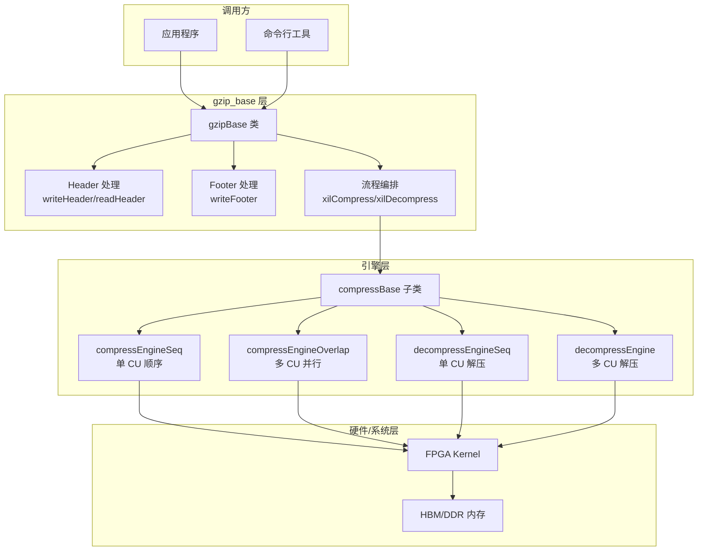

# gzip_base 模块技术深度解析

## 概述：GZIP 压缩的编排中枢

想象你正在运营一家大型物流中心。货物（原始数据）不断涌入，你需要将其高效打包（压缩）以便运输，到达目的地后再拆包（解压缩）。`gzip_base` 就是这个物流中心的调度中枢——它不直接搬运每一件货物，而是负责：决定使用哪种包装格式（GZIP 还是 ZLIB）、贴上正确的标签（Header 元数据）、监督实际的打包作业（调用压缩引擎）、最后贴上封条（Footer 校验）。

这个模块的核心价值在于**抽象与编排**。它将格式细节（GZIP 的 Magic Number、ZLIB 的 CMF/FLG 标志位）与实际的压缩算法（Deflate）解耦，让上层代码无需关心"这是 GZIP 文件还是 ZLIB 流"，只需调用统一的压缩/解压接口。

---

## 架构设计：分层协作模型

### 架构全景图



### 角色与职责

**1. 协议适配层（Header/Footer 处理）**

`gzip_base` 的核心设计洞察是：**压缩数据本身只是字节流，但格式协议赋予了它意义**。GZIP 和 ZLIB 都使用 Deflate 算法，但它们的封装格式截然不同：

- **GZIP**：以 Magic Number `0x1f8b` 开头，包含 OS 标识、时间戳、原始文件大小等信息，Footer 包含 CRC32 和原始大小（模 2^32）
- **ZLIB**：以 CMF/FLG 字节开头，采用 Adler32 校验，结构更紧凑

`writeHeader()` 和 `writeFooter()` 方法就像"协议翻译官"，根据 `m_isZlib` 标志决定生成哪种格式。这种**策略模式**（Strategy Pattern）的设计让同一套压缩引擎可以输出不同格式的数据。

**2. 执行编排层（xilCompress/xilDecompress）**

这是模块的"指挥中枢"。`xilCompress` 方法并不直接操作数据，而是遵循**模板方法模式**（Template Method Pattern）：

1. **前置准备**：写入 Header（除非是"自由运行"模式 `is_freeRunKernel`）
2. **核心委托**：根据 `m_isSeq` 标志选择执行策略：
   - `SEQ`（顺序）：调用 `compressEngineSeq`，适合单 CU（计算单元）场景
   - `PARALLEL`（并行）：调用 `compressEngineOverlap`，支持多 CU 流水线重叠执行
3. **后置处理**：写入 Footer，包含校验和和原始大小

`xilDecompress` 遵循类似的模式，但增加了 Header 校验步骤（`readHeader`），确保输入数据格式合法。

**3. 资源契约层**

从代码中可以看到明确的资源管理约定：

- **缓冲区所有权**：输入/输出缓冲区（`uint8_t* in`, `uint8_t* out`）由调用方分配和释放，`gzip_base` 只进行读写操作
- **大小契约**：`input_size` 必须准确反映输入数据长度，否则可能导致缓冲区溢出
- **文件元数据**：在 GZIP 模式下，`m_inFileName` 必须有效，因为 `writeFooter` 需要查询原始文件的 `stat` 信息来记录文件大小

---

## 组件深度解析

### `gzipBase` 类结构

虽然代码片段中没有展示完整的类定义，但从实现中可以推断出关键成员和方法：

#### 核心属性（推断）

```cpp
class gzipBase : public compressBase {
protected:
    // 格式控制
    bool m_isZlib;           // true = ZLIB格式, false = GZIP格式
    uint8_t m_windowbits;    // 窗口大小参数 (通常为15, 表示32KB窗口)
    
    // 压缩参数
    int m_level;             // 压缩级别 (0-9)
    int m_strategy;          // 压缩策略 (0-2)
    
    // 执行模式
    executionMode m_isSeq;   // SEQ(顺序) 或 OVERLAP(并行重叠)
    uint64_t m_InputSize;    // 当前输入大小
    std::string m_inFileName; // 输入文件名(用于GZIP的footer)
    
    // 性能参数
    uint64_t m_maxCR;        // 最大压缩比估计值(用于解压缓冲区大小)
};
```

#### 公共接口

**`writeHeader(uint8_t* out)`**

- **目的**：根据 `m_isZlib` 标志生成对应的 Header 并写入输出缓冲区
- **ZLIB 模式逻辑**：
  - 构造 CMF (Compression Method and Flags)：CM (Compression Method) = 8 (Deflate)，CINFO (Compression Info) = `m_windowbits - 8`
  - 根据 `m_level` 映射到 ZLIB 的 FLEVEL (Fast, Default, etc.)
  - 计算 FLG 使 CMF + FLG 能被 31 整除（ZLIB 规范要求）
- **GZIP 模式逻辑**：
  - 写入固定 Magic Number `0x1f8b0800` 等字节
  - 设置 OS 标识为 Unix (3)
- **返回值**：写入的字节数（ZLIB 为 2，GZIP 为 12）

**`writeFooter(uint8_t* out, size_t compressSize, uint32_t checksum)`**

- **目的**：在压缩数据后追加 Footer 元数据
- **ZLIB 模式**：追加 4 字节 Adler32 校验和（大端序）
- **GZIP 模式**：
  - 追加 4 字节 CRC32 校验和（小端序）
  - 追加 4 字节原始文件大小（模 2^32，小端序）
  - **关键依赖**：需要 `m_inFileName` 有效，因为会调用 `stat()` 获取原始文件大小
- **返回值**：Footer 结束后的总输出大小

**`xilCompress(uint8_t* in, uint8_t* out, uint64_t input_size)`**

- **核心编排逻辑**：
  1. 保存 `input_size` 到 `m_InputSize`
  2. **条件 Header 写入**：如果不是 "free run" 模式，调用 `writeHeader`
  3. **引擎选择**：
     - `SEQ` 模式 → `compressEngineSeq`（单 CU，阻塞式）
     - 并行模式 → `compressEngineOverlap`（多 CU，流水线重叠）
  4. **条件 Footer 写入**：如果不是 "free run" 模式，调用 `writeFooter`
- **返回值**：最终输出数据的总字节数

**`readHeader(uint8_t* in)`**

- **目的**：验证输入数据是有效的 GZIP 或 ZLIB 格式
- **GZIP 验证逻辑**：
  - 检查 Magic Number `0x1f8b`
  - 验证 Compression Method = 8 (Deflate)
  - 检查 FLG 字节是否支持（只支持 0x00 无文件名，0x08 有文件名）
  - 跳过 4 字节时间戳和 1 字节额外标志
  - 验证 OS 代码在有效范围内（0-13）
- **ZLIB 验证逻辑**：
  - 检查 CMF = 0x78
  - 验证 FLG 是有效值之一（0x01, 0x5E, 0x9C, 0xDA）
- **返回值**：验证成功返回 `true`，失败输出错误信息并返回 `false`

**`xilDecompress(uint8_t* in, uint8_t* out, uint64_t input_size)`**

- **核心编排逻辑**：
  1. 调用 `readHeader` 验证输入格式，失败返回 0
  2. **解压引擎选择**：
     - `SEQ` 模式 → `decompressEngineSeq` 或 `decompressEngineMMSeq`（取决于宏 `DECOMPRESS_MM`）
     - 并行模式 → `decompressEngine`
  3. 所有引擎都需要 `m_maxCR`（最大压缩比）来估计输出缓冲区大小
- **返回值**：解压后的数据大小（字节）

---

## 依赖关系与数据流

### 上游依赖（调用方）

`gzip_base` 是**库层组件**，面向两类调用者：

1. **应用程序层**：如命令行压缩工具，直接实例化 `gzipBase` 并配置参数
2. **更上层的封装**：如 `gzip_ocl_host`（从模块树推断），可能提供更高阶的 API

### 下游依赖（被调用方）

`gzip_base` 依赖**压缩引擎层**（从 `compressBase` 继承）：

| 方法 | 依赖的引擎方法 | 场景 |
|------|---------------|------|
| `xilCompress` (SEQ) | `compressEngineSeq` | 单 CU，顺序执行 |
| `xilCompress` (Parallel) | `compressEngineOverlap` | 多 CU，流水线重叠 |
| `xilDecompress` (SEQ) | `decompressEngineSeq` / `decompressEngineMMSeq` | 单 CU 解压 |
| `xilDecompress` (Parallel) | `decompressEngine` | 多 CU 解压 |

**注意**：这些引擎方法定义在父类 `compressBase` 中，不在当前文件内。

### 数据流追踪：一次完整压缩

```
输入数据 (uint8_t* in)
    │
    ▼
┌─────────────────────────────────────┐
│ xilCompress()                       │
│ 1. writeHeader() → 输出缓冲区        │
│    - 生成 GZIP/ZLIB Header           │
│    - 写入 m_windowbits, m_level 等   │
└──────────────┬──────────────────────┘
               │
               ▼
┌─────────────────────────────────────┐
│ compressEngineSeq /                 │
│ compressEngineOverlap               │
│ - FPGA Kernel 执行实际压缩           │
│ - 返回压缩后数据大小                 │
│ - 输出 checksum (Adler32/CRC32)    │
└──────────────┬──────────────────────┘
               │
               ▼
┌─────────────────────────────────────┐
│ 2. writeFooter()                    │
│    - 写入 checksum                   │
│    - GZIP: 写入原始文件大小          │
│    - 需要 m_inFileName 有效          │
└──────────────┬──────────────────────┘
               │
               ▼
        最终输出大小 (uint64_t)
```

---

## 设计决策与权衡

### 1. 策略模式：GZIP vs ZLIB 的格式抽象

**决策**：通过 `m_isZlib` 布尔标志在同一类中支持两种格式，而非继承两个子类。

**权衡分析**：

| 方案 | 优点 | 缺点 |
|------|------|------|
| **当前方案** (标志位) | 代码集中，Header/Footer 逻辑内聚；无动态分配开销 | 方法内分支较多，违反单一职责原则 |
| 继承方案 (gzipBase/zlibBase) | 职责分离清晰，易扩展新格式 | 虚函数开销；Header/Footer 逻辑分散；需要工厂模式创建实例 |

**设计意图**：在 FPGA 加速场景中，格式差异仅体现在 Header/Footer（几十字节），而压缩引擎（处理 GB 级数据）完全相同。因此，将格式差异内聚为条件分支，避免了虚函数带来的指令缓存污染和分支预测失败。

### 2. 模板方法模式：压缩流程的骨架与变体

**决策**：`xilCompress` 定义固定流程（Header → 引擎 → Footer），但将实际压缩委托给虚函数 `compressEngineSeq`/`compressEngineOverlap`。

**关键洞察**：这体现了**好莱坞原则**（"Don't call us, we'll call you"）。基类控制整体流程，子类（或实现者）填充具体算法。这使得：
- 添加新的压缩策略（如硬件加速 vs 软件回退）无需修改流程代码
- 单元测试可以注入 Mock 引擎，无需实际 FPGA 硬件

### 3. 同步 vs 异步：SEQ vs OVERLAP 模式

**决策**：通过 `m_isSeq` 标志支持两种执行模型。

**执行模型对比**：

| 模式 | 数据流特征 | 硬件利用率 | 延迟 | 适用场景 |
|------|-----------|-----------|------|---------|
| **SEQ** (Sequential) | 单缓冲，阻塞式 | 低（CU 空闲等待 I/O） | 高（需等待完成） | 小文件、低延迟要求、调试 |
| **OVERLAP** (Parallel) | 多缓冲，流水线 | 高（计算与 I/O 重叠） | 吞吐优化 | 大文件、高吞吐场景 |

**设计权衡**：OVERLAP 模式显著增加代码复杂度（需要管理多个缓冲区、同步屏障、流水线阶段）。`gzip_base` 通过简单的标志抽象了这种复杂性，但底层引擎（`compressEngineOverlap`）必须处理乱序完成、缓冲区池管理等棘手问题。

### 4. 错误处理策略：验证与委托

**决策**：`readHeader` 进行严格格式验证并返回布尔状态；`xilDecompress` 在验证失败时返回 0 并输出错误信息；底层引擎错误通过返回值或输出参数传递。

**错误处理层次**：

```
Layer 1: readHeader (格式验证)
    ├── 检查 Magic Number (GZIP/ZLIB)
    ├── 验证 Deflate 方法 (必须为 8)
    ├── 检查 OS 代码范围
    └── 返回: bool (成功/失败)

Layer 2: xilDecompress (流程控制)
    ├── 调用 readHeader
    ├── 失败: cerr << "Header Check Failed", return 0
    └── 成功: 继续执行引擎

Layer 3: decompressEngine* (底层执行)
    ├── FPGA 内核执行
    ├── 返回实际解压大小
    └── 错误处理: 通过返回值或 checksum 验证
```

**设计意图**：在 FPGA 加速场景中，硬件错误（如总线错误、内核崩溃）通常是不可恢复的。因此，错误处理侧重于**前置验证**（确保输入格式正确）和**快速失败**（一旦检测到错误立即返回，避免无效计算）。

### 5. 内存与资源所有权

**决策**：`gzip_base` 采用**借用语义**（Borrowing Semantics）管理缓冲区。

**所有权规则**：

| 资源 | 所有权 | 生命周期要求 | 说明 |
|------|--------|------------|------|
| `in` (输入缓冲区) | 调用方所有 | 必须保证在 `xilCompress`/`xilDecompress` 执行期间有效 | 方法内仅读取，不释放 |
| `out` (输出缓冲区) | 调用方所有 | 必须保证在方法执行期间有效，且大小足够容纳最坏情况输出 | 方法内写入，不管理内存 |
| `m_inFileName` | 类引用/拷贝 | GZIP 模式下必须在 `writeFooter` 前设置有效值 | 用于查询原始文件大小 |
| 内部状态 | 类自身管理 | 对象生命周期内有效 | 如 `m_InputSize`, `checksum` 等 |

**关键风险点**：

1. **输出缓冲区不足**：代码中没有显式检查 `out` 缓冲区大小。调用方必须确保缓冲区足够大（压缩场景：输入大小 + Header + Footer + 可能的膨胀；解压场景：依赖 `m_maxCR` 估计）。

2. **GZIP Footer 的文件依赖**：`writeFooter` 在 GZIP 模式下调用 `stat(m_inFileName.c_str(), &istat)`。如果文件名无效或文件已被删除，行为未定义（实际会返回错误，但代码中没有显式处理 `stat` 失败的情况）。

3. **并发安全**：代码中没有显式同步机制。`gzipBase` 实例不应被多个线程并发访问，除非外部加锁。

---

## 使用模式与最佳实践

### 典型使用流程：压缩

```cpp
// 1. 配置并初始化
auto gzip = std::make_unique<gzipBase>();
gzip->m_isZlib = false;           // 使用 GZIP 格式
gzip->m_windowbits = 15;          // 32KB 窗口
gzip->m_level = 6;                // 默认压缩级别
gzip->m_strategy = 0;             // 默认策略
gzip->m_isSeq = compressBase::SEQ; // 顺序模式（简单场景）
gzip->m_inFileName = "input.dat"; // GZIP footer 需要原始文件名

// 2. 准备缓冲区
uint64_t inputSize = getInputSize();
uint8_t* input = allocateInputBuffer(inputSize);
// 注意：分配足够大的输出缓冲区！最坏情况可能比输入大（添加 Header/Footer）
uint8_t* output = allocateOutputBuffer(inputSize + 1024); 

// 3. 执行压缩
uint64_t compressedSize = gzip->xilCompress(input, output, inputSize);

// 4. 使用结果
writeToFile(output, compressedSize);

// 5. 清理（由调用方管理缓冲区）
free(input);
free(output);
```

### 典型使用流程：解压

```cpp
// 1. 配置（解压需要的信息较少）
auto gzip = std::make_unique<gzipBase>();
gzip->m_isSeq = compressBase::SEQ;
gzip->m_maxCR = 10;  // 告诉引擎最大压缩比，用于分配内部缓冲区

// 2. 准备缓冲区（输出缓冲区必须足够大）
uint64_t compressedSize = getCompressedSize();
uint8_t* compressed = readCompressedData(compressedSize);
// 输出缓冲区大小 = 输入大小 * 最大压缩比（解压后的数据可能比压缩数据大得多）
uint64_t maxOutputSize = compressedSize * gzip->m_maxCR;
uint8_t* output = allocateOutputBuffer(maxOutputSize);

// 3. 执行解压（readHeader 会自动验证格式）
uint64_t decompressedSize = gzip->xilDecompress(compressed, output, compressedSize);

if (decompressedSize == 0) {
    // Header 验证失败或解压错误
    handleError();
}

// 4. 使用解压后的数据
processDecompressedData(output, decompressedSize);
```

### 配置参数指南

| 参数 | 有效范围 | 默认值建议 | 说明 |
|------|---------|-----------|------|
| `m_isZlib` | true/false | false | true=ZLIB格式，false=GZIP格式 |
| `m_windowbits` | 8-15 | 15 | 窗口大小 = 2^(windowbits) 字节 |
| `m_level` | 0-9 | 6 | 压缩级别，0=不压缩，9=最大压缩 |
| `m_strategy` | 0-2 | 0 | 压缩策略（针对特定数据类型优化） |
| `m_isSeq` | SEQ/OVERLAP | SEQ | 执行模式，OVERLAP需要硬件支持多CU |
| `m_maxCR` | >1 | 10 | 解压时估计最大压缩比 |

---

## 边缘情况与陷阱

### 1. GZIP Footer 的文件名依赖陷阱

**问题**：`writeFooter` 在 GZIP 模式下调用 `stat()` 查询原始文件大小。如果：
- `m_inFileName` 为空或无效
- 原始文件在压缩过程中被删除或修改
- 压缩的是内存数据而非文件

**后果**：`stat` 可能返回错误（代码中未显式检查），`istat.st_size` 可能包含垃圾值，导致 Footer 中的文件大小字段损坏。

**缓解措施**：
- 如果压缩内存数据，考虑使用 ZLIB 格式（不需要文件大小）
- 确保 `m_inFileName` 在调用 `xilCompress` 前设置且指向有效文件
- 考虑在子类中重写 `writeFooter` 以支持内存数据的 GZIP 压缩

### 2. 输出缓冲区不足风险

**问题**：`xilCompress` 和 `xilDecompress` 都不检查输出缓冲区大小。对于：
- **压缩**：最坏情况下（已压缩数据或随机数据），Deflate 可能产生略大于输入的输出（加上 Header/Footer）
- **解压**：输出大小 = 输入大小 × 压缩比，可能极大（如果压缩比很高）

**后果**：缓冲区溢出，内存损坏，安全漏洞。

**缓解措施**：
- 压缩时：分配 `input_size + 1024` 字节（足够容纳 Header/Footer 和少量膨胀）
- 解压时：确保 `output_buffer_size >= input_size * m_maxCR`，其中 `m_maxCR` 是保守估计的最大压缩比
- 考虑使用安全版本的包装函数，在调用前验证缓冲区大小

### 3. 并发访问限制

**问题**：`gzipBase` 类没有内置同步机制。其成员变量（`m_InputSize`, `m_isSeq` 等）在压缩/解压过程中会被修改。

**后果**：如果多个线程同时调用同一个 `gzipBase` 实例的方法，会导致：
- 状态竞争（一个线程覆盖另一个线程的配置）
- 内存访问冲突（一个线程在读取 `m_InputSize`，另一个在写入）
- 未定义行为

**缓解措施**：
- 每个线程使用独立的 `gzipBase` 实例（推荐）
- 如果必须共享实例，使用外部互斥锁（`std::mutex`）保护所有方法调用
- 考虑设计线程安全的包装类，将 `gzipBase` 实例与互斥锁封装在一起

### 4. "Free Run" 模式的隐含契约

**问题**：`xilCompress` 和 `writeFooter` 都检查 `is_freeRunKernel()` 标志。如果此标志为 `true`，则跳过 Header/Footer 的写入。

**隐含契约**：
- "Free Run" 模式假设调用方已经处理了 Header/Footer，或者不需要它们（例如，在流式压缩中由外部协议处理）
- 在此模式下，`writeFooter` 不写入校验和或文件大小，调用方必须自己处理完整性验证

**风险**：如果调用方不理解此标志的含义，可能会生成没有 Header 的无效 GZIP 文件，或丢失校验和信息。

**缓解措施**：
- 明确文档化 "Free Run" 模式的用途和契约
- 如果可能，使用类型安全的方式（如策略类）而非布尔标志来区分模式
- 确保调用 `is_freeRunKernel()` 的代码路径有清晰的注释说明

---

## 扩展与定制

### 添加新的压缩格式支持

如果需要支持新的压缩格式（如 Brotli、Zstd），可以考虑以下扩展点：

1. **继承 `gzipBase` 并重写 Header/Footer 方法**：
   ```cpp
   class brotliBase : public gzipBase {
   protected:
       size_t writeHeader(uint8_t* out) override {
           // 写入 Brotli 的 Magic Number 和窗口大小
       }
       size_t writeFooter(uint8_t* out, size_t compressSize, uint32_t checksum) override {
           // Brotli 可能不需要 Footer，或格式不同
       }
   };
   ```

2. **配置新的引擎方法**：如果新格式使用不同的压缩算法，需要在父类 `compressBase` 中添加新的引擎方法，并在 `xilCompress` 中添加分支逻辑。

### 线程安全的包装器

为了支持多线程并发压缩，可以实现一个线程安全的包装类：

```cpp
class ThreadSafeGzip {
public:
    uint64_t compress(uint8_t* in, uint8_t* out, uint64_t size, const GzipConfig& config) {
        // 从池中获取实例或创建新实例
        auto gzip = pool_.acquire();
        
        // 配置参数
        gzip->m_isZlib = config.isZlib;
        gzip->m_level = config.level;
        // ... 其他配置
        
        // 执行压缩
        uint64_t result = gzip->xilCompress(in, out, size);
        
        // 归还实例到池中
        pool_.release(std::move(gzip));
        return result;
    }
    
private:
    ObjectPool<gzipBase> pool_;  // 实例池，避免频繁构造/析构
    std::mutex poolMutex_;       // 保护池的线程安全
};
```

---

## 性能考虑

### 热点路径分析

在典型的压缩工作负载中，CPU 时间的消耗分布大致如下：

1. **压缩引擎（>95%）**：实际的 Deflate 算法执行，包括 LZ77 匹配、Huffman 编码等。这部分在 FPGA 上执行，CPU 仅负责调度和数据传输。

2. **数据拷贝（~3-5%）**：在 `xilCompress` 中，Header 和 Footer 的写入涉及内存拷贝（`memcpy` 或直接数组赋值）。对于小文件，这部分比例可能更高。

3. **Header/Footer 处理（<1%）**：`writeHeader`, `writeFooter`, `readHeader` 的计算逻辑简单，耗时可忽略。

**优化建议**：
- 对于小文件（<1KB），Header/Footer 的开销比例较高，考虑批量处理多个小文件以减少每次调用的固定开销。
- 确保 `out` 缓冲区对齐到缓存行边界（通常 64 字节），以优化 `writeHeader` 和 `writeFooter` 的内存写入性能。

### 内存对齐与 DMA 友好性

虽然 `gzip_base` 本身不直接操作硬件 DMA，但它传递的缓冲区指针最终会传递给 FPGA 内核。因此，调用方应确保：

- **对齐要求**：`in` 和 `out` 缓冲区应至少对齐到 4KB 页边界（对于 XDMA ）或至少 64 字节缓存对齐。
- **连续性**：如果使用 DMA，缓冲区必须是物理连续的（或使用 IOMMU 映射的分散-聚集列表）。`gzip_base` 不关心这一点，但调用方必须确保。
- **HBM 与 DDR**：从模块树看，系统支持 HBM（高带宽内存）和 DDR。`m_maxCR` 等参数可能需要根据内存类型调整。

---

## 总结

`gzip_base` 是 Xilinx FPGA 加速压缩解决方案中的**编排中枢**。它本身不执行繁重的计算任务，而是专注于：

1. **协议适配**：将通用的压缩请求转化为符合 GZIP 或 ZLIB 规范的字节流
2. **资源编排**：根据配置（顺序/并行、单 CU/多 CU）选择合适的执行引擎
3. **契约 enforcement**：确保 Header/Footer 格式正确，校验和计算准确

对于新加入团队的开发者，理解这个模块的关键在于把握其**中介者角色**——它站在"应用意图"与"硬件执行"之间，用清晰的抽象屏蔽了底层 FPGA 编程的复杂性，同时又通过明确的配置参数（`m_isSeq`, `m_windowbits` 等）保留了足够的灵活性以应对不同场景的性能需求。

开发时务必注意**文件名的隐含依赖**（GZIP Footer 需要有效文件名）、**缓冲区大小的调用方责任**（无自动边界检查）以及**线程安全限制**（实例非线程安全）这三个最容易踩坑的地方。