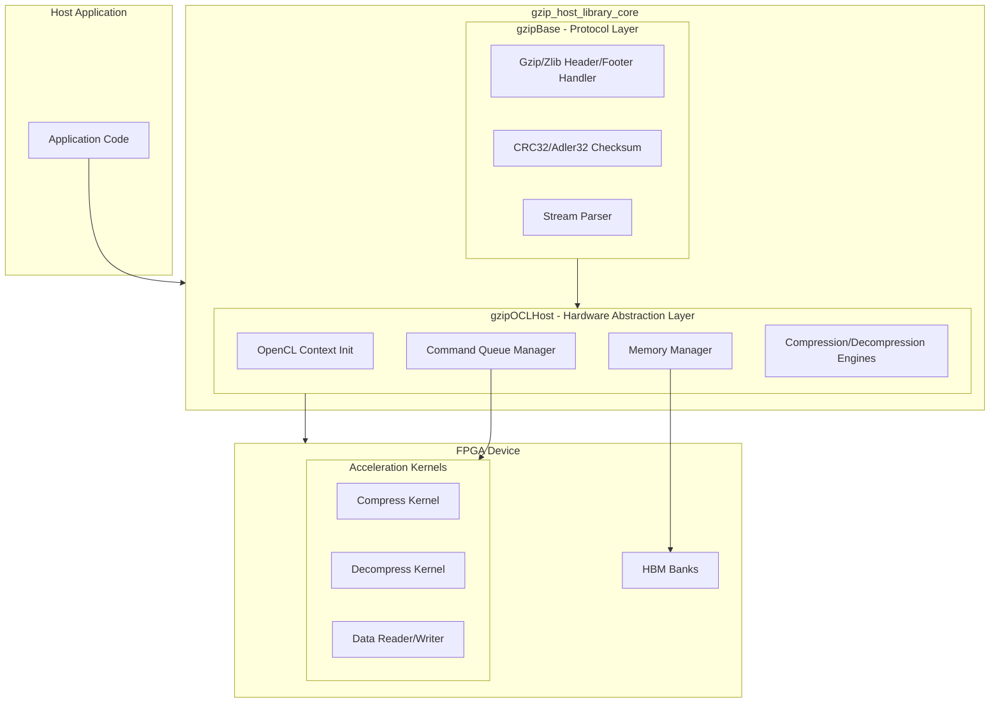
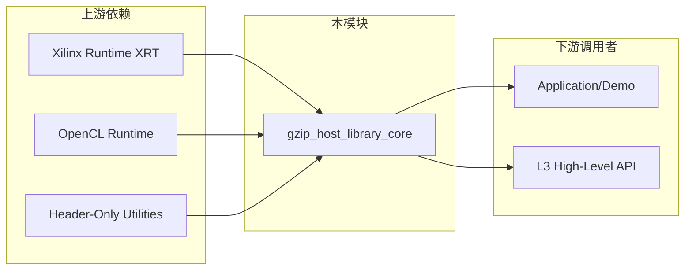

# gzip_host_library_core 模块

## 概述：为什么需要这个模块？

想象你有一个数据中心的存储系统，每天需要处理数百 TB 的日志压缩；或者一个实时数据管道，需要在微秒级延迟内完成压缩和解压缩。传统的 CPU  gzip 库（如 zlib）虽然功能完善，但在吞吐量和延迟上很快成为瓶颈。

`gzip_host_library_core` 是 Xilinx FPGA 加速数据压缩解决方案的**主机端核心库**。它并非简单的 zlib 替代品，而是一个**硬件加速编排器（Hardware Acceleration Orchestrator）**：它管理 FPGA 设备上的专用压缩/解压缩内核，处理主机与设备间的大规模数据传输，并通过精妙的流水线设计隐藏 I/O 延迟。

该模块的核心价值在于**抽象了异构计算的复杂性**。开发者无需理解 OpenCL 内核调度、HBM 内存 Bank 分配或 Xilinx 特定的 Slave-Bridge 零拷贝协议；模块提供类似 zlib 的流式接口，同时在底层实现 FPGA 级并行加速。

## 架构全景：一个协调者的角色



### 架构角色解析

该模块在系统中扮演**异构计算协调者（Heterogeneous Computing Orchestrator）**的角色：

1. **协议翻译官**：上层应用使用标准的 Gzip/Zlib 数据流，但 FPGA 内核处理的是原始数据块。`gzipBase` 层负责头部/尾部解析、校验和计算、流状态管理，将标准格式转换为硬件友好的块格式。

2. **硬件资源管理器**：`gzipOCLHost` 层管理昂贵的 FPGA 资源。它维护 OpenCL 上下文、设备程序（xclbin）、命令队列，并处理多计算单元（CU）的负载均衡。

3. **数据流调度师**：核心的创新在于**流水线重叠（Overlap）模式**。通过 `memoryManager` 实现的缓冲区池，配合独立的读写线程（`_enqueue_reads`、`_enqueue_writes`），实现计算与 I/O 的完全重叠，最大化硬件利用率。

## 关键设计决策与权衡

### 1. 执行模式：Sequential vs Overlap

模块提供两种执行模式，体现了**延迟 vs 吞吐量**的经典权衡：

- **Sequential 模式**：单线程阻塞式执行。主机上传数据 → 等待内核完成 → 下载结果。简单可靠，但 FPGA 在数据传输期间空闲。适用于小数据块或延迟敏感场景。

- **Overlap 模式**：多线程流水线。`_enqueue_writes` 线程持续喂数据，`_enqueue_reads` 线程持续收结果，内核始终处于忙碌状态。吞吐量提升 2-5 倍，但需要 3 倍以上的内存缓冲区（三重缓冲），且代码复杂度显著增加。

**选择策略**：默认使用 Overlap 处理大文件流；Sequential 用于小数据包或资源受限环境。

### 2. 内存模型：Slave Bridge vs 传统迁移

Xilinx FPGA 支持两种主机-设备内存交互模式，模块同时支持：

- **传统缓冲区迁移（Non-Slave-Bridge）**：数据从主机内存复制到 FPGA 的 HBM/BRAM，内核处理后再复制回主机。每次传输需要显式的 `enqueueMigrateMemObjects`，延迟较高（数十微秒），但兼容性好。

- **Slave Bridge（零拷贝）**：FPGA 直接通过 PCIe 访问主机内存，无需显式复制。使用 `CL_MEM_EXT_HOST_ONLY` 标志创建缓冲区，`enqueueMapBuffer` 获取主机指针。延迟降低 5-10 倍，但需要 Alveo U50/U280 等支持 Slave Bridge 的卡，且对内存对齐有严格要求。

**权衡体现**：`gzipOCLHost` 通过 `isSlaveBridge()` 方法在运行时切换两种模式。Slave Bridge 是性能首选，但代码中需要处理 `create_host_buffer` 失败回退到传统模式的逻辑。

### 3. 格式支持：Gzip vs Zlib

模块同时支持 Gzip（文件格式）和 Zlib（流格式），通过 `m_isZlib` 和 `m_zlibFlow` 标志控制：

- **Gzip**：包含文件头（魔术字节、时间戳、文件名）、CRC32 校验和、文件大小。适合磁盘文件压缩。
- **Zlib**：仅包含 CMF/FLG 头部和 Adler32 校验和，无文件元数据。适合网络流传输。

**设计权衡**：校验和算法不同（CRC32 vs Adler32），头部解析逻辑不同（`readHeader` 方法处理两种格式），但核心压缩/解压缩引擎相同。`add_header` 和 `add_footer` 方法根据标志生成对应格式。

### 4. 并发策略：多 CU 与单 CU 的权衡

模块支持单计算单元（CU）顺序执行和多 CU 并行执行：

- **单 CU**：一个压缩/解压缩内核顺序处理所有数据。简单，但无法利用大 FPGA 上的多个物理内核。
- **多 CU（`D_COMPUTE_UNIT`）**：多个独立的解压缩内核（如 `m_q_dec[0..N]`）并行处理不同数据块。需要应用层将数据分片，模块负责负载均衡。

**关键限制**：压缩引擎通常使用单 CU（数据依赖性强），而解压缩可并行化。`decompressEngine` 使用多 CU 设计，`compressEngine` 通常为单 CU。

## 数据流追踪：一个压缩请求的完整生命周期

让我们追踪一个典型的 `compress()` 调用，理解数据如何在各层流动：

### 阶段 1：入口与协议封装（gzipBase）

```
Application Data (raw bytes)
    ↓
gzipOCLHost::compress() 
    ↓
add_header()  // 生成 Gzip/Zlib 头部 (2-10 bytes)
    ↓
compress_buffer()  // 分块处理
```

**关键决策**：`add_header` 根据 `m_zlibFlow` 选择格式。Gzip 头部包含时间戳和文件名，Zlib 头部仅包含 CMF/FLG 字节。

### 阶段 2：块分割与缓冲区获取（gzipOCLHost + memoryManager）

```
Input Data (e.g., 10 MB)
    ↓
compress_buffer()  // 分割为 HOST_BUFFER_SIZE (1MB) 块
    ↓
For each 1MB chunk:
    deflate_buffer()  // 流式处理
        ↓
    memoryManager::createBuffer()  // 从池获取缓冲区
        ↓
    std::memcpy()  // 数据复制到对齐缓冲区
```

**内存所有权模型**：`memoryManager` 维护 `freeBuffers` 和 `busyBuffers` 两个队列。`createBuffer` 优先从空闲队列回收，否则新建（直到 `maxBufCount`）。缓冲区所有权短暂转移给调用者，完成后必须 `getBuffer()` 归还。

### 阶段 3：内核参数设置与命令入队（OpenCL）

```
buffer (h_buf_in, buffer_input, etc.)
    ↓
setKernelArgs()  // 设置 6 个参数：输入/输出/大小/校验和/类型
    ↓
enqueueMigrateMemObjects()  // H2D 数据传输 (非 Slave Bridge)
    ↓
enqueueTask(m_compressFullKernel)  // 启动压缩内核
    ↓
enqueueMigrateMemObjects()  // D2H 读回压缩大小
```

**并发策略**：`deflate_buffer` 在 Overlap 模式下不会等待内核完成。它立即返回，依赖 `memoryManager` 的缓冲区状态跟踪。`waitTaskEvents()` 在缓冲区紧张时阻塞，确保流水线不溢出。

### 阶段 4：数据回传与校验和追加（gzipBase）

```
Kernel Completion
    ↓
event_copydone_cb()  // OpenCL 完成回调
    ↓
buffer->copy_done = true  // 标记可读取
    ↓
getBuffer()  // 归还到 freeBuffers
    ↓
std::memcpy(out, h_buf_zlibout, compSize)  // 复制到输出
    ↓
add_footer()  // 追加 CRC32/Adler32 校验和与文件大小
```

**关键设计**：校验和计算发生在 FPGA 内核内部（`buffer_checksum_data`），而非主机 CPU。这节省了主机 CPU 周期，但需要内核支持。`add_footer` 从 `h_buf_checksum_data` 读取硬件计算的校验和，追加到输出流。

## 子模块摘要

本模块由两个紧密协作的子模块构成：

### [gzip_base](data_compression_gzip_system-gzip_host_library_core-gzip_base.md)：协议与算法基础层

负责 Gzip/Zlib 格式的协议解析、校验和计算、流式数据分块，以及高层压缩/解压缩 API 的入口。它是硬件无关的纯逻辑层，定义了 `gzipBase` 基类。

### [gzip_ocl_host](data_compression_gzip_system-gzip_host_library_core-gzip_ocl_host.md)：OpenCL 硬件抽象层

继承自 `gzipBase`，实现 FPGA 硬件的具体管理。包含 OpenCL 上下文初始化、多命令队列管理、`memoryManager` 缓冲区池、以及重叠/顺序两种执行引擎。它是与 Xilinx 运行时（XRT）直接交互的唯一层。

## 跨模块依赖关系



### 关键依赖说明

**1. Xilinx Runtime (XRT)**

模块通过 `xcl.hpp` 和 XRT 特定的 OpenCL 扩展（如 `CL_MEM_EXT_PTR_XILINX`、`XCL_MEM_EXT_HOST_ONLY`）与 Xilinx 硬件交互。`init()` 方法中的平台检测硬编码查找 `"Xilinx"` 平台，设备类型强制为 `CL_DEVICE_TYPE_ACCELERATOR`。这意味着该模块**无法在非 Xilinx FPGA 平台上运行**。

**2. OpenCL 1.2+ Runtime**

依赖标准 OpenCL API：`cl::Context`、`cl::CommandQueue`、`cl::Kernel`、`cl::Buffer` 等。使用了高级特性如事件回调（`setCallback`）、非阻塞内存迁移（`CL_MIGRATE_MEM_OBJECT_HOST`）和队列分析（`CL_QUEUE_PROFILING_ENABLE`）。

**3. 同层模块（Sibling Dependencies）**

该模块被 `data_compression/gzip_system/gzip_app_kernel_connectivity` 和 `gzip_hbm_kernel_connectivity` 依赖，它们定义了 FPGA 内核的物理连接和内存映射。模块通过预定义的 kernel 名称（如 `xilDecompressStream`、`xilDataMover`）与这些底层连接约定交互。

## 给新贡献者的关键警告

### 1. Slave Bridge 的 "Map Then Use" 陷阱

Slave Bridge 模式（零拷贝）使用 `enqueueMapBuffer` 获取主机指针。常见错误是**在 Map 之前访问指针**。正确的生命周期：

```cpp
// 错误：先写再 Map（数据不会到达设备）
buffer = createBuffer(size);
std::memcpy(buffer->h_buf_in, data, size);  // 错误！

// 正确：Map 获取有效指针
buffer = createBuffer(size);  // 内部调用 enqueueMapBuffer
std::memcpy(buffer->h_buf_in, data, size);  // 正确
```

### 2. 事件回调与对象生命周期

Overlap 模式大量使用 OpenCL 事件回调（`event_compress_cb`、`event_decompress_cb`）。这些回调在**独立的 OpenCL 线程**中执行，访问 `buffers` 结构体。必须确保：

- 回调触发前，`buffers` 对象未被释放（模块通过 `busyBuffers` 队列延长生命周期）
- 回调内仅使用线程安全操作（原子标志、`compress_finish` 标记）
- 主线程通过 `peekBuffer()->is_finish()` 检测完成，而非忙等待

### 3. 校验和状态的隐式传递

CRC32/Adler32 校验和在 FPGA 内核中计算，通过 `buffer_checksum_data` 缓冲区传回。容易忽略的是：**校验和状态在多次调用间是累积的**。对于流式压缩：

```cpp
// 第一次调用后，h_buf_checksum_data[0] 包含中间校验和
// 第二次调用时，内核自动继续计算，无需主机干预
// 但必须在最终 add_footer() 前读取该值
```

如果在多线程环境中共享 `gzipOCLHost` 实例，校验和状态会混乱。**每个并发流必须拥有独立的 `gzipOCLHost` 实例**。

### 4. 4GB 输出限制与 ZIP Bomb 防护

解压缩引擎有硬编码的 4GB 输出限制（`lim_4gb` 变量）。这是为了防止 ZIP Bomb 攻击（压缩比极高的恶意文件耗尽内存）。如果解压缩输出超过 4GB，模块会触发 `ZIP BOMB` 错误并中止。

**调试提示**：如果遇到此错误，检查 `max_outbuf_size` 参数（默认 20 倍压缩比），或确认输入文件是否损坏。

### 5. HBM Bank 随机化与内存对齐

在使用 HBM（高带宽内存）时，`getBuffer` 方法会**随机选择 0-31 号 Bank**（通过 `std::uniform_int_distribution`）。这是为了分散内存访问压力，避免单个 Bank 饱和。

副作用是：缓冲区地址在不同运行间不固定，调试时难以复现。如果观察到**间歇性内存错误**，检查是否满足 4KB 对齐要求（`aligned_allocator` 默认 4096 字节对齐）。

---

*本文档是该模块的主入口。要深入了解特定层，请参阅子模块文档：*
- *[gzip_base](data_compression_gzip_system-gzip_host_library_core-gzip_base.md)*：协议解析与算法基础
- *[gzip_ocl_host](data_compression_gzip_system-gzip_host_library_core-gzip_ocl_host.md)*：OpenCL 硬件抽象与内存管理