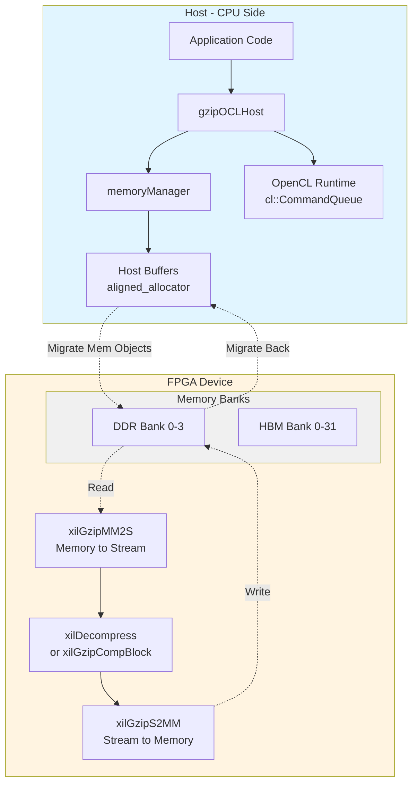

# data_compression_gzip_system 模块深度解析

## 概述：为什么需要硬件加速的 Gzip？

想象你正在处理一个每秒产生数 GB 日志的数据中心，或者一个需要实时压缩/解压海量图像文件的医学影像系统。在 CPU 上执行标准的 Gzip 算法，即使动用所有核心，也很快会成为整个数据管道的瓶颈——就像试图用一个漏斗把消防水带的水流灌入矿泉水瓶。

**`data_compression_gzip_system` 模块正是为了解决这个问题而诞生的。** 它是一个基于 Xilinx FPGA 的硬件加速 Gzip 压缩/解压系统，通过 OpenCL 框架与主机交互。该模块将计算密集型的 DEFLATE 算法（LZ77 + Huffman 编码）卸载到 FPGA 的专用内核上，同时通过精心设计的流水线架构，实现了 CPU 与 FPGA 之间的高效数据搬运。

简单来说，这个模块让你可以把 Gzip 操作看作是一个"黑盒加速器"——你推入原始字节流，它吐出压缩后的数据，而无需关心底层复杂的硬件调度、内存管理或并行计算细节。

---

## 架构全景：数据如何在系统中流动

### 系统拓扑图



### 核心组件解析

这个系统可以被看作是一个**分层的服务栈**，每一层都对下层进行了抽象：

1. **主机运行时层 (`gzipOCLHost`)**：这是你的入口点。它封装了 OpenCL 的复杂性，提供了类似 `compress()` 和 `decompress()` 的高级 API。它管理着命令队列（Command Queues）、内核对象（Kernel Objects）和事件（Events），确保 CPU 与 FPGA 之间的异步协作。

2. **内存管理层 (`memoryManager`)**：这是系统的"内存池"。考虑到 FPGA 加速中内存分配/释放的开销，这个类实现了一个**对象池模式（Object Pool Pattern）**。它预先分配并管理一组 `buffers` 对象，这些对象封装了主机端和设备端的内存指针（`cl::Buffer`），避免了在数据流中频繁的动态内存分配。

3. **算法基类 (`gzipBase`)**：这是软件层面的 Gzip 逻辑。它处理了 Gzip 格式的细节——文件头（Header）和尾（Footer）的生成与解析、CRC32/Adler32 校验和的计算。这确保了硬件只处理核心的 DEFLATE 数据块，而格式层面的细节由软件处理。

4. **FPGA 内核层**：这是实际执行压缩/解压的硬件逻辑。从连接配置（`connectivity.cfg`）可以看出，内核被组织成**流水线结构**：
   - `xilGzipMM2S`：将数据从 DDR/HBM 读取到 AXI Stream 接口。
   - `xilDecompress` / `xilGzipCompBlock`：执行实际的 DEFLATE 解压或压缩。
   - `xilGzipS2MM`：将结果从 AXI Stream 写回到 DDR/HBM。

---

## 核心概念：你应该记住的"心智模型"

### 类比：这是一个"智能快递分拣中心"

想象 FPGA 是一个高度自动化的快递分拣中心：

- **主机 (Host)** 就像是调度中心，负责接收包裹（数据）、记录信息（Header/Footer）、并将包裹送到分拣中心的入口。
- **内存管理器 (memoryManager)** 就像是仓库管理系统，它维护着标准化的集装箱（buffer 池），确保每个包裹都有合适大小的容器，避免了临时找箱子的混乱。
- **MM2S 内核** 就像是自动装卸机器人，把仓库里的集装箱搬上输送带（AXI Stream）。
- **解压/压缩内核** 就像是高速分拣机器人，它们并行工作，识别每个包裹的编码（Huffman 解码）并重组内容。
- **S2MM 内核** 就像是出口处的装箱机器人，把处理完的包裹送回仓库。

**关键洞察**：主机从不直接触碰包裹的内容，它只负责物流调度；真正的"重体力劳动"全在 FPGA 的分拣中心内完成。

### 三种关键抽象

1. **流式处理 (Stream Processing)**：数据以 AXI Stream 的形式在内核间流动，而非通过共享内存。这就像是管道中的水流——一旦开始，就不需要知道整个水管的容量，只需要保证入口不断水、出口不堵塞。

2. **计算单元复用 (Compute Unit Multiplexing)**：通过连接配置文件中的 `nk` 指令，同一个内核逻辑可以实例化为多个独立的计算单元（如 `xilGzipMM2S_1` 到 `xilGzipMM2S_8`）。这就像是同一个型号的机器人，可以通过编号区分，并行处理不同的包裹。

3. **零拷贝与 Slave Bridge**：在传统的 OpenCL 模式下，数据需要从用户空间拷贝到 OpenCL 运行时管理的缓冲区，再拷贝到设备内存。而 Slave Bridge 模式允许 FPGA 直接访问主机内存（通过 PCIe BAR 映射），实现了真正的"零拷贝"——就像机器人可以直接到你办公室的桌上取包裹，而不需要先把包裹送到仓库。

---

## 数据流深度追踪：一次完整的解压操作

让我们跟随一个字节从压缩文件到解压后的输出，看看它经历了怎样的旅程。

### 阶段 1：主机准备（软件层面）

```
应用程序调用 -> gzipBase::xilDecompress(in, out, input_size)
```

1. **格式解析**：`gzipBase` 首先检查输入数据的头部。它读取魔法数字（`0x1F 0x8B` 对于 Gzip，`0x78` 对于 Zlib），验证压缩方法是否为 DEFLATE (`0x08`)，并提取窗口大小、校验和算法等元数据。

2. **策略选择**：根据是否配置了顺序模式（`SEQ`）或重叠模式（`OVERLAP`），决定调用 `decompressEngineSeq` 还是 `decompressEngine`。这就像是决定是派一个机器人专线处理一个包裹，还是让多个机器人流水线作业。

### 阶段 2：内存分配与调度（主机运行时）

```
gzipOCLHost::decompressEngine() / decompressEngineSeq()
```

1. **缓冲区准备**：`memoryManager` 被请求分配输入和输出缓冲区。如果系统配置为 Slave Bridge 模式，它会通过 `create_host_buffer` 分配主机内存并映射到设备地址空间；否则，它使用传统的 `cl::Buffer` 分配设备内存。

2. **命令队列设置**：OpenCL 命令队列（`cl::CommandQueue`）被配置为乱序执行（`CL_QUEUE_OUT_OF_ORDER_EXEC_MODE_ENABLE`）或性能分析模式（`CL_QUEUE_PROFILING_ENABLE`）。这允许运行时系统重叠内存传输和内核执行。

### 阶段 3：FPGA 流水线执行（硬件层面）

这是真正的工作发生的地方。根据连接配置文件（`connectivity.cfg`）中定义的拓扑：

```
stream_connect=xilGzipMM2S_1.outStream:xilDecompress_1.inaxistreamd
stream_connect=xilDecompress_1.outaxistreamd:xilGzipS2MM_1.inStream
```

数据按以下路径流动：

1. **MM2S（Memory Mapped to Stream）**：`xilGzipMM2S` 内核从 DDR 或 HBM 读取压缩数据，转换为 AXI Stream 格式。它就像是仓库的自动装卸机，把箱子搬上输送带。

2. **解压缩内核（Decompress Kernel）**：`xilDecompress` 接收 Stream 数据，执行 DEFLATE 算法的硬件实现。这包括：
   - 查找 LZ77 匹配的并行哈希表
   - Huffman 解码的并行状态机
   - 输出缓冲的乒乓切换
   
   这就像是高速分拣机器人，能够以线速度处理包裹。

3. **S2MM（Stream to Memory Mapped）**：`xilGzipS2MM` 将解压后的 Stream 数据写回到 DDR 或 HBM。这就像是出口处的装箱机器人。

### 阶段 4：结果回收与后处理（主机）

1. **事件同步**：主机通过 OpenCL 事件（`cl::Event`）等待内核完成。`gzipOCLHost` 中的回调函数（如 `event_decompress_cb`）被触发，标记缓冲区为"完成"。

2. **数据回传**：如果是传统模式，解压后的数据通过 `enqueueMigrateMemObjects` 从设备内存拷贝回主机；如果是 Slave Bridge 模式，数据已经在主机内存中，只需解除映射。

3. **校验和验证**：`gzipBase` 读取硬件计算的 CRC32 或 Adler32 校验和，与 Gzip 文件尾中的期望值对比，确保数据完整性。

4. **资源释放**：`memoryManager` 将缓冲区标记为空闲，放回池中供下次使用。

---

## 关键设计决策与权衡

### 1. Slave Bridge vs. 传统 OpenCL 内存模型

**问题**：数据在主机和设备之间搬运的延迟往往是 FPGA 加速的最大瓶颈。

**选择**：模块支持两种模式：

- **传统模式**：使用 `cl::Buffer` 分配设备内存，数据需要显式拷贝（`enqueueMigrateMemObjects`）。优点是兼容性好，可以精确控制数据放置（DDR vs HBM）。

- **Slave Bridge 模式**：通过 `XCL_MEM_EXT_HOST_ONLY` 标志，让 FPGA 通过 PCIe BAR 直接访问主机内存。优点是**零拷贝**——内核可以直接读写主机内存，消除了所有显式数据传输开销。

**权衡**：Slave Bridge 模式下，FPGA 访问主机内存的带宽受限于 PCIe 带宽（通常 ~16 GB/s for Gen3 x16），而访问板载 HBM 可以达到数百 GB/s。因此，Slave Bridge 适合数据量不大但需要极低延迟的场景，而传统模式适合大规模数据批处理。

### 2. 顺序执行 vs. 重叠执行（SEQ vs. OVERLAP）

**问题**：如何最大化 CPU 与 FPGA 的并行度？

**选择**：

- **顺序模式（`SEQ`）**：主机先等待所有输入数据传输完成，然后启动内核，最后等待所有输出数据传输完成。实现简单，但 CPU 和 DMA 引擎在内核执行期间空闲。

- **重叠模式（`OVERLAP`）**：使用多个缓冲区（通常是 3 个或更多，形成"乒乓"结构）和独立的命令队列。当一个内核在处理缓冲区 N 的数据时，DMA 引擎在并行地将缓冲区 N+1 的输入数据传输到设备，同时将缓冲区 N-1 的输出数据传回主机。

**权衡**：重叠模式显著提高了吞吐率（通常能接近 PCIe 带宽上限），但代价是：
- 代码复杂度大幅增加（需要管理多个缓冲区的状态机）
- 延迟增加（数据需要在缓冲区中排队等待）
- 内存占用增加（需要 2-3 倍的缓冲空间）

从代码中可以看到，`gzipOCLHost` 使用了 `std::thread` 来并行运行 `_enqueue_reads` 和 `_enqueue_writes`，这正是为了实现这种重叠 I/O。

### 3. 多计算单元（Multi-CU）扩展策略

**问题**：单内核的性能受限于 FPGA 的时钟频率和资源，如何进一步提升吞吐率？

**选择**：通过连接配置文件中的 `nk`（num kernels）指令，将同一个内核逻辑实例化为多个独立的计算单元（CU），例如 `nk=xilGzipMM2S:8:xilGzipMM2S_1...xilGzipMM2S_8`。

这些 CU 可以并行处理不同的数据块。主机代码（`gzipOCLHost`）通过 `cu` 参数（计算单元索引）来调度任务，实现了负载均衡。

**权衡**：
- **资源消耗**：每个 CU 都需要独立的 FPGA 资源（BRAM、DSP、LUT）。实例化 8 个 CU 可能迅速耗尽资源。
- **内存带宽瓶颈**：多个 CU 同时访问 DDR/HBM 时，会竞争内存带宽。如果总带宽需求超过物理上限，增加 CU 数量反而不会提升性能。
- **调度开销**：主机需要管理多个 CU 的状态，增加了调度复杂度。

从连接配置中可以看到，系统通过将不同的 CU 绑定到不同的 SLR（Super Logic Region）和 DDR Bank 来尽量分散资源压力，例如 `slr=xilGzipS2MM_1:SLR0` 和 `sp=xilGzipS2MM_1.out:DDR[0]`。

### 4. HBM vs DDR 内存选择

**问题**：如何为 FPGA 提供足够的数据带宽？

**选择**：现代高端 FPGA（如 Xilinx Alveo U50/U280）集成了 HBM（High Bandwidth Memory），提供远高于传统 DDR4 的带宽（如 460 GB/s vs 38 GB/s）。

从连接配置中可以看到两种模式的区别：
- `gzip_app`（DDR 模式）：使用 `DDR[0]` 到 `DDR[3]`，通过 `sp=xilGzipCompBlock_1.in:DDR[0]` 绑定。
- `gzip_hbm`（HBM 模式）：使用 `HBM[0:31]`，通过 `sp=xilGzipCompBlock_1.in:HBM[0:31]` 绑定。

**权衡**：
- **容量 vs 带宽**：HBM 容量通常较小（如 8GB），而 DDR 可以达到 16-32GB。如果工作集大小超过 HBM 容量，就必须使用 DDR 或面临频繁的数据交换。
- **成本与复杂性**：HBM 需要更复杂的内存控制器和物理层设计，导致更高的功耗和成本。
- **随机访问性能**：HBM 对随机访问的延迟表现可能不如 DDR，但对于 Gzip 这类流式处理（大量顺序访问），HBM 的带宽优势可以完全发挥。

---

## 危险边缘：新贡献者必须警惕的陷阱

### 1. 内存对齐的地雷

**问题**：FPGA 加速器通常要求内存地址对齐到特定边界（如 4KB 页边界），否则可能引发静默的数据损坏或性能急剧下降。

**代码中的防护**：`gzipOCLHost` 使用了 `aligned_allocator<uint8_t>` 来分配主机缓冲区，确保内存对齐。同时，代码中大量使用了 `CL_MEM_USE_HOST_PTR` 标志，这意味着 OpenCL 直接使用主机分配的内存，而不是在内部分配后再拷贝。

**陷阱**：如果你绕过 `memoryManager` 自己分配内存，必须确保：
- 使用 `posix_memalign` 或 `aligned_alloc` 分配 4KB 对齐的内存
- 缓冲区大小必须是页大小的整数倍
- 不要使用 `malloc` 或 `new[]` 直接分配

### 2. 事件回调的生命周期地狱

**问题**：`gzipOCLHost` 大量使用 OpenCL 事件回调（`setCallback`）来实现异步 I/O。如果回调函数访问了已经被释放的资源，会导致难以调试的段错误。

**代码模式**：
```cpp
OCL_CHECK(err, err = buffer->rd_event.setCallback(
    CL_COMPLETE, event_compress_cb, (void*)buffer));
```

这里 `buffer` 指针被传递给回调函数。回调函数 `event_compress_cb` 会在 OpenCL 运行时认为事件完成时被异步调用。

**陷阱**：
- 如果你在内核还在执行时就调用了 `release()` 或 `~memoryManager()`，而某个事件回调还在排队等待执行，回调函数会访问已释放的内存。
- 解决方案：确保在销毁资源前调用 `clFinish()` 等待所有队列完成，或者在回调函数内部实现引用计数。

### 3. 压缩比炸弹（Zip Bomb）防护

**问题**：恶意构造的压缩文件可以解压缩成极大的数据（如 42KB 压缩文件解压后可达 4.5PB），这会导致内存耗尽或拒绝服务。

**代码中的防护**：`gzipOCLHost::_enqueue_reads` 中有明确的 Zip Bomb 检测逻辑：

```cpp
if ((dcmpSize >= max_outbuf_size) && (max_outbuf_size != 0)) {
    std::cout << "ZIP BOMB: Exceeded output buffer size during decompression\n";
    abort();
}
```

**陷阱**：
- 默认的最大输出缓冲大小可能不适合你的应用场景。如果处理的是高压缩比数据（如基因组数据、日志文件），你需要通过 `-mcr` 参数增加 `max_outbuf_size`。
- 如果完全禁用这个检查（设为 0），你就必须确保输入源可信，否则面临内存耗尽风险。

### 4. SLR 和内存 Bank 的拓扑约束

**问题**：在大型 FPGA（如 Xilinx U200/U250）上，芯片被划分为多个 Super Logic Regions (SLR)。跨 SLR 的信号传输会带来额外的延迟和布线拥塞。

**连接配置中的策略**：`connectivity.cfg` 中明确指定了每个内核实例属于哪个 SLR 和哪个内存 Bank：

```cfg
slr=xilGzipS2MM_1:SLR0
sp=xilGzipS2MM_1.out:DDR[0]

slr=xilGzipS2MM_3:SLR1
sp=xilGzipS2MM_3.out:DDR[1]
```

**陷阱**：
- 如果你手动修改连接配置，必须确保 SLR 和内存 Bank 的分配是均衡的。如果把所有内核都绑定到同一个 SLR，会导致该区域的资源耗尽。
- 跨 SLR 的内存访问（如 SLR0 的内核访问 DDR[3] 而 DDR[3] 物理上靠近 SLR2）会引入额外的延迟。尽量让内核访问"本地"的内存 Bank。

### 5. 主机缓冲区的生命周期与所有权

**问题**：`memoryManager` 使用 `CL_MEM_USE_HOST_PTR` 创建 OpenCL 缓冲区，这意味着 OpenCL 对象只是对主机内存的引用，而非独立的设备内存拷贝。

**代码中的所有权模型**：
```cpp
// memoryManager 分配主机内存
MEM_ALLOC_CHECK(h_dbufstream_in[j].resize(INPUT_BUFFER_SIZE), ...);

// 创建 OpenCL 缓冲区，引用主机内存
buffer_dec_input[i] = new cl::Buffer(*m_context, 
    CL_MEM_USE_HOST_PTR | CL_MEM_READ_ONLY, 
    inBufferSize, h_dbufstream_in[i].data(), &err);
```

**陷阱**：
- **生命周期错配**：如果 `std::vector`（`h_dbufstream_in[j]`）在 `cl::Buffer` 被销毁之前被释放或重新分配（如 `resize` 导致重新分配），`cl::Buffer` 将持有悬空指针。
- **所有权混淆**：谁负责释放内存？`memoryManager` 在 `release()` 中会调用 `delete` 销毁 `cl::Buffer` 对象，但 `std::vector` 的内存是在 `~memoryManager()` 或手动 `resize(0)` 时释放的。两者必须严格配对。
- **并发修改**：如果多个线程共享同一个 `memoryManager` 实例，必须确保对 `busyBuffers` 和 `freeBuffers` 队列的访问是线程安全的。代码中似乎没有显式的锁机制，暗示这个设计是单线程使用的。

---

## 子模块导航

这个复杂的模块被组织成多个子模块，每个负责特定的关注点：

### 内核连接与拓扑配置

- **[gzip_app_kernel_connectivity](data_compression_gzip_system-gzip_app_kernel_connectivity.md)**：针对传统 DDR 内存配置的连接拓扑。适合 U200/U250 等带有大容量 DDR 的加速卡。定义了 8 组 MM2S/Decompress/S2MM 内核流水线，以及 2 个压缩块内核，绑定到 SLR0/SLR2 和 DDR[0]/DDR[3]。

- **[gzip_hbm_kernel_connectivity](data_compression_gzip_system-gzip_hbm_kernel_connectivity.md)**：针对高带宽 HBM 内存优化的连接拓扑。适合 U50/U280 等带有 HBM2 的加速卡。支持 8 组解压流水线和 3 个压缩块内核，所有内存访问绑定到 HBM[0:31] 的伪随机或指定 Bank，以最大化带宽利用率。

### 主机运行时库

- **[gzip_base](data_compression_gzip_system-gzip_base.md)**：Gzip 算法的软件基类。包含 Header/Footer 的解析与生成、CRC32/Adler32 校验和计算、压缩级别和策略管理。这是与硬件无关的纯软件逻辑，确保硬件只处理核心的 DEFLATE 数据块。

- **[gzip_ocl_host](data_compression_gzip_system-gzip_ocl_host.md)**：OpenCL 主机运行时的高级封装。包含 `gzipOCLHost` 类（管理命令队列、内核执行、异步 I/O）和 `memoryManager` 类（主机/设备内存池管理、Slave Bridge 支持、缓冲区生命周期管理）。这是与 FPGA 交互的核心枢纽。

---

## 快速入门：如何与这个模块交互

虽然详细的 API 文档在子模块页面，但这里是一个概念性的使用流程：

```cpp
// 1. 初始化运行时，加载 FPGA 比特流
gzipOCLHost host(binaryFile,     // xclbin 文件路径
                 useSlaveBridge, // 是否使用零拷贝模式
                 flow,           // COMPRESS, DECOMPRESS, 或 BOTH
                 deviceId);

// 2. 准备输入数据（必须是对齐的内存）
std::vector<uint8_t, aligned_allocator<uint8_t>> input(inputSize);
// ... 填充数据 ...

// 3. 准备输出缓冲区（大小需考虑最大压缩比）
std::vector<uint8_t, aligned_allocator<uint8_t>> output(inputSize * maxCompressionRatio);

// 4. 执行压缩（或解压）
size_t outputSize = host.compress(input.data(), output.data(), inputSize, cuIndex);

// 5. 清理（或在析构时自动处理）
host.release();
```

**关键注意事项**：
- 所有主机缓冲区**必须**使用 `aligned_allocator` 分配，确保 4KB 对齐。
- 解压时必须预估最大输出大小，可通过 `-mcr` 参数调整。如果实际解压大小超过预估，会触发 Zip Bomb 保护并终止程序。
- `cuIndex` 用于选择具体的计算单元（0-7），在多线程环境中，不同线程应使用不同的 CU 以避免资源冲突。

---

*文档版本：1.0 | 最后更新：基于 core_component_codes 中的 gzipBase.cpp 和 gzipOCLHost.cpp 分析*
