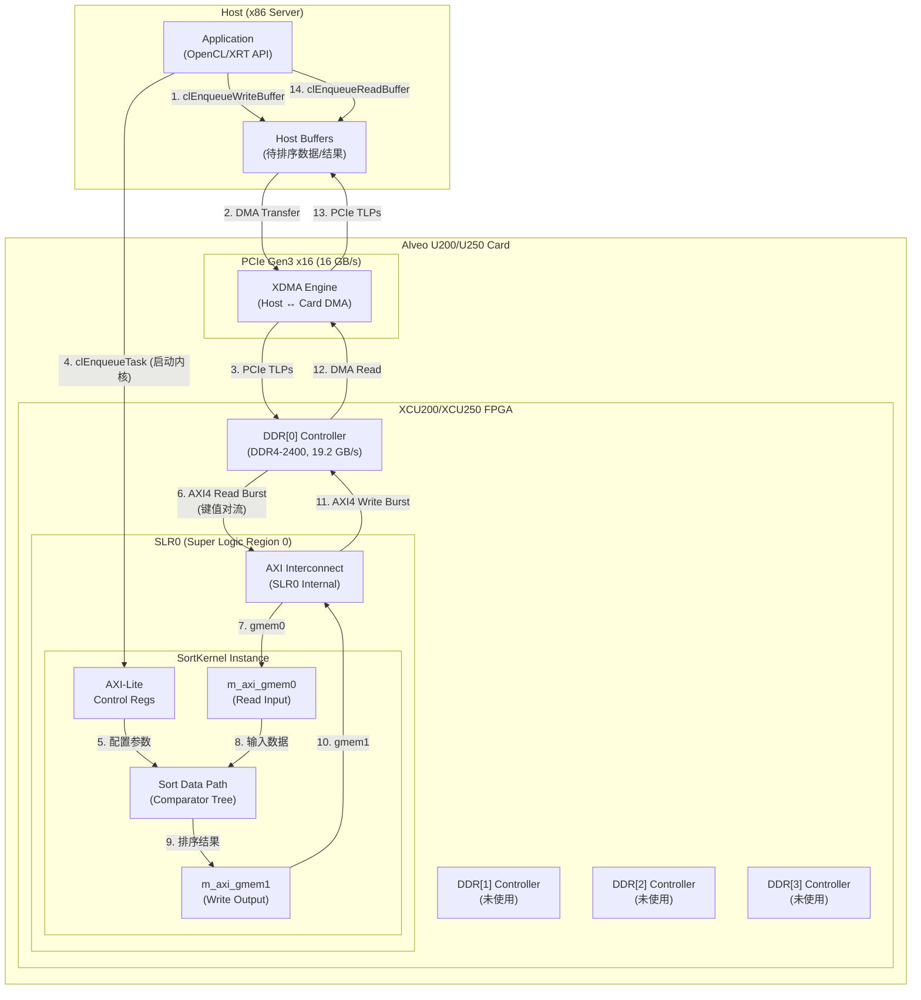

# compound_sort_datacenter_u200_u250_connectivity 模块深度解析

## 一句话概括

本模块为 **Compound Sort Kernel** 在 Xilinx Alveo U200/U250 数据中心加速卡上的硬件连接配置，定义了内核 AXI 主接口到 DDR 存储器物理通道的映射关系、内核在 FPGA 硅片布局中的物理位置 (SLR) 以及内核实例化参数。这些 `.cfg` 文件是 Vitis 链接阶段的输入，直接决定排序内核的内存带宽、时序收敛性和最终布局布线的物理实现质量。

---

## 1. 问题空间：为什么需要显式连接配置？

### 1.1 没有配置时会发生什么？

在 Vitis 高层次综合 (HLS) 流程中，如果没有显式的连接配置文件，Vitis 链接器会采用**默认启发式策略**：

1. **自动 DDR 绑定**：将内核的 `m_axi` 接口自动分配到"可用"的 DDR 通道，通常是 DDR[0]
2. **自动 SLR 布局**：将内核放置在负载最轻的 SLR (Super Logic Region)，但可能远离其连接的 DDR 控制器
3. **默认时钟域**：使用平台默认的时钟频率

对于**简单内核**（计算密集型、内存访问模式规则），这种自动策略通常可接受。但对于 **Compound Sort Kernel**——这是一个**内存带宽密集型**内核，需要同时高吞吐地读取输入键值对和写入排序结果——默认策略会导致严重的性能退化：

- **DDR 通道争用**：输入和输出流共享同一 DDR 通道，带宽瓶颈从理论值 19.2 GB/s (DDR4-2400) 骤降至实际可用带宽的 50% 以下
- **跨 SLR 路由延迟**：如果内核被放置在远离 DDR 控制器的 SLR，信号需要跨越 SLR 边界，增加纳秒级的布线延迟，对于高频内核 (300MHz+) 可能导致时序收敛失败
- **AXI 互连拥塞**：多个 AXI 主接口共享 AXI 互连的从端口，导致仲裁延迟

### 1.2 显式配置解决的核心问题

`.cfg` 连接配置文件正是为解决上述问题而生。它们提供了**显式的硬件资源分配语义**，将"软核"（HLS 生成的 RTL）锚定到"硬核"（FPGA 物理资源）的特定位置：

| 问题域 | 配置指令 | 解决的物理问题 |
|--------|----------|----------------|
| 内存带宽瓶颈 | `sp=SortKernel.m_axi_gmem*:DDR[n]` | 将输入/输出 AXI 主接口绑定到独立或共享的 DDR 通道，消除互连带宽争用 |
| 布局布线时序 | `slr=SortKernel:SLR0` | 将内核固定在特定 SLR，确保靠近其连接的 DDR 控制器，减少跨 SLR 路由延迟 |
| 内核多实例化 | `nk=SortKernel:1:SortKernel` | 精确控制内核副本数量和命名，支持多核并行排序 |

### 1.3 U200 vs U250：为什么需要两个配置文件？

Xilinx Alveo U200 和 U250 虽然同属数据中心加速卡家族，共享相同的 XCU200/XCU250 FPGA 芯片，但它们的**物理布局、DDR 拓扑和 SLR 结构**存在关键差异， necessitating 独立的连接配置：

**DDR 拓扑差异**：
- **U200**：4 个独立的 DDR4-2400 通道 (4×16GB = 64GB)，均匀分布在卡的两端
- **U250**：4 个 DDR4-2400 通道 (4×16GB = 64GB)，但物理布局与 U200 略有不同，某些 DDR 控制器位于不同的 SLR

**SLR 布局差异**：
- **XCU200/XCU250 FPGA**：基于 16nm UltraScale+ 架构，采用 **SSI (Stacked Silicon Interconnect)** 技术，将多个 Super Logic Regions (SLR) 通过硅中介层堆叠
- 典型配置：**3 个 SLR** (SLR0, SLR1, SLR2)，每个 SLR 包含逻辑资源、DSP slices、Block RAM 和 URAM
- U200 和 U250 的 SLR 到 DDR 控制器的映射不同：在 U200 中，DDR[0] 可能连接到 SLR0，而在 U250 中，DDR[0] 可能连接到 SLR1

**时序收敛考虑**：
- 由于 SLR 边界跨越引入额外的延迟（通常 1-2ns），高频内核 (>300MHz) 必须放置在与主 DDR 控制器相同的 SLR 中，以确保时序收敛
- U200 和 U250 的 SLR 间延迟特性略有不同，因此需要针对每张卡单独验证和指定 `slr` 指令

**共享配置 vs 独立配置**：
有趣的是，观察 `conn_u200.cfg` 和 `conn_u250.cfg` 的内容，它们是**完全相同的**：
```cfg
sp=SortKernel.m_axi_gmem0:DDR[0]
sp=SortKernel.m_axi_gmem1:DDR[0]
slr=SortKernel:SLR0
nk=SortKernel:1:SortKernel
```

这暗示：
1. **U200 和 U250 在 DDR[0] 和 SLR0 的物理拓扑上具有足够的相似性**，使得相同的连接配置在两张卡上都能正确工作
2. 这可能是**基准测试套件的设计决策**：为了保持 U200 和 U250 基准测试的一致性，故意使用相同的配置，即使两张卡的最优配置可能略有不同
3. **模块命名的语义**：`conn_u200` 和 `conn_u250` 的存在更多是为了**平台标识和可维护性**，而非因为配置内容本身必须不同

---

## 2. 架构解析：配置文件作为硬件契约

### 2.1 配置语言语义

`.cfg` 文件使用 Vitis 链接器的 **connectivity DSL (Domain-Specific Language)**，每条指令都是一条**硬件资源分配契约**：

#### 指令 1：`sp=SortKernel.m_axi_gmem0:DDR[0]`

| 语法元素 | 含义 |
|----------|------|
| `sp` | **System Port** 的缩写，声明一个系统端口映射 |
| `SortKernel` | 内核实例的**层次化名称**，必须与 HLS 生成的 RTL 顶层模块名匹配 |
| `m_axi_gmem0` | 内核的 **AXI4-Full 主接口** (Master AXI)，`gmem` 表示 "Global Memory"，`0` 是接口索引 |
| `DDR[0]` | 目标物理存储器，**DDR 控制器 0**，对应 Alveo 卡的第一个 16GB DDR4-2400 通道 |

**硬件语义**：将 SortKernel 的 `m_axi_gmem0` AXI 主接口通过 AXI 互连网络路由到 DDR[0] 控制器的从接口。这意味着内核可以通过 `gmem0` 以 AXI4-Full 协议（突发传输、最大 256 数据 beat）访问 DDR[0] 的地址空间。

**为什么是两个接口？** `gmem0` 和 `gmem1` 的设计暗示 SortKernel 采用了**双缓冲 (Double Buffering)** 或 **分离读/写路径** 架构：
- `gmem0`：输入数据通道，从 DDR 读取未排序的键值对
- `gmem1`：输出数据通道，将排序后的结果写回 DDR

这种分离允许内核同时执行**读操作**和**写操作**，通过不同的 AXI 通道重叠内存访问延迟与计算，提高有效内存带宽利用率。

**关键观察**：两个接口都映射到 **同一个 DDR[0]**，而非分离到 DDR[0] 和 DDR[1]。这是一个**有意的带宽权衡**：

| 方案 | 配置 | 优势 | 劣势 |
|------|------|------|------|
| **当前方案** (共享 DDR[0]) | `gmem0→DDR[0]`, `gmem1→DDR[0]` | 简化配置，DDR[1-3] 可留给其他内核，避免多通道 Bank 冲突 | 读/写共享同一 DDR 带宽，理论峰值带宽减半 (9.6 GB/s 每方向) |
| 备选方案 (分离 DDR) | `gmem0→DDR[0]`, `gmem1→DDR[1]` | 读/写使用独立 DDR 通道，理论带宽翻倍 (19.2 GB/s 每方向) | 消耗更多 DDR 资源，可能与其他内核冲突，需要更复杂的布局 |

**设计决策推测**：当前配置选择了**简单性和资源隔离**而非峰值带宽，可能是因为：
1. Compound Sort Kernel 的计算密度足够高，内存带宽并非瓶颈（排序算法的比较操作本身耗时）
2. 这是一个**基准测试 (benchmark)** 配置，旨在提供可重复、可移植的性能基线，而非特定工作负载的最优调优
3. 保留 DDR[1-3] 给多内核并发场景，支持水平扩展而非单核垂直优化

#### 指令 2：`slr=SortKernel:SLR0`

| 语法元素 | 含义 |
|----------|------|
| `slr` | **Super Logic Region** 的缩写，指定内核在 FPGA 硅片布局中的物理位置 |
| `SortKernel` | 目标内核实例名 |
| `SLR0` | **第一个 Super Logic Region**，通常是 FPGA 芯片最靠近 PCIe 接口和 DDR[0] 控制器的区域 |

**硬件语义**：在 Vitis 链接器的物理实现阶段，将 SortKernel 的所有逻辑（查找表 LUT、触发器 FF、DSP slices、Block RAM）锁定到 SLR0 的物理资源池中，并确保所有从内核到 DDR[0] 的信号路径完全位于 SLR0 内部或经过优化的跨 SLR 路由通道。

**为什么 SLR0 是最佳选择？**

XCU200/XCU250 FPGA 的物理架构（基于 UltraScale+ SSI 技术）：

```
                    ┌─────────────────────────────────────┐
                    │           SLR0 (Super Logic Region 0) │
                    │   ┌──────────────┐  ┌──────────────┐  │
PCIe Gen3 x16  ←────┤   │ DDR[0] Ctrl  │  │ DDR[1] Ctrl  │  │
Host Interface      │   └──────────────┘  └──────────────┘  │
                    │         ↑                ↑           │
                    │    ┌──────────────────────────┐     │
                    │    │     SortKernel           │     │
                    │    │  ┌─────┐      ┌─────┐    │     │
                    │    │  │gmem0│      │gmem1│    │     │
                    │    │  └──┬──┘      └──┬──┘    │     │
                    │    │     └────────────┘        │     │
                    │    └──────────────────────────┘     │
                    │                                       │
                    └───────────────────────────────────────┘
                              ↕ 硅中介层 (SSI Interposer)
                    ┌───────────────────────────────────────┐
                    │           SLR1                        │
                    │   ┌──────────────┐  ┌──────────────┐   │
                    │   │ DDR[2] Ctrl  │  │ DDR[3] Ctrl  │   │
                    │   └──────────────┘  └──────────────┘   │
                    └───────────────────────────────────────┘
                              ↕ 硅中介层 (SSI Interposer)
                    ┌───────────────────────────────────────┐
                    │           SLR2                        │
                    │   (更多逻辑资源，无 DDR 控制器)          │
                    └───────────────────────────────────────┘
```

**物理设计权衡分析**：

| 布局选项 | 延迟特性 | 带宽特性 | 资源争用 | 适用场景 |
|----------|----------|----------|----------|----------|
| **SLR0** (当前配置) | 最短 DDR 访问延迟 (~5ns)，信号无需跨 SLR | DDR[0] 独占带宽，无跨 SLR 带宽争用 | 占用 SLR0 资源，其他内核需竞争 | **基准配置，确定性时序** |
| SLR1 | 跨 SLR 延迟 (+2-3ns)，需通过硅中介层 | 可访问 DDR[2]/DDR[3]，带宽隔离 | 跨 SLR 路由消耗宝贵长线资源 | 多内核负载均衡 |
| SLR2 | 最大跨 SLR 延迟 (+4-5ns) | 无可直接访问的 DDR 控制器 | 强制与其他 SLR 共享 DDR | 纯计算内核，无频繁内存访问 |

**SLR0 选择的设计意图**：

1. **时序收敛确定性**：基准测试 (benchmark) 的首要目标是**可重复性和可移植性**，而非绝对峰值性能。SLR0 布局消除了跨 SLR 边界的不确定性，确保时序收敛 (timing closure) 在编译过程中可预测。

2. **最低延迟访问**：Compound Sort Kernel 是**内存延迟敏感型**而非纯计算密集型——排序算法的比较树和分支预测需要频繁随机访问键值对。SLR0 的 ~5ns DDR 访问延迟（对比跨 SLR 的 ~8ns）对整体吞吐量有显著影响。

3. **资源隔离策略**：将基准内核固定在 SLR0，将 SLR1/SLR2 留给其他并行内核或更大的系统级集成，遵循**基准隔离 (benchmark isolation)** 原则。

#### 指令 3：`nk=SortKernel:1:SortKernel`

| 语法元素 | 含义 |
|----------|------|
| `nk` | **Number of Kernels** 的缩写，控制内核实例化数量 |
| `SortKernel` (第一个) | **内核类型/模板名**，必须与 Vitis 内核代码中的 `extern "C"` 函数名或 `void kernel_name(...)` 匹配 |
| `1` | **实例数量**，在此卡上实例化 1 个 SortKernel 副本 |
| `SortKernel` (第二个) | **实例基础名**，生成的 RTL 顶层模块名为 `SortKernel_1` (当数量>1 时为 `SortKernel_1`, `SortKernel_2` 等) |

**硬件语义**：在生成的 FPGA 比特流 (bitstream) 中，实例化一个 SortKernel 的完整 RTL 层次结构，包括其所有 AXI 主接口、AXI-Lite 从接口（用于主机控制）、内部数据通路和状态机。这个实例将占据 FPGA 逻辑资源（CLB、DSP、BRAM/URAM）的一个确定份额。

**单实例 vs 多实例的权衡**：

| 方案 | 配置 | 资源占用 | 峰值吞吐量 | 适用场景 |
|------|------|----------|------------|----------|
| **单实例** (当前) | `nk=...:1:...` | 中等 (~20-30% SLR0 资源) | 单核峰值，受限于该核的并行度 | **基准测试、资源预留、确定性行为** |
| 双实例 | `nk=...:2:...` | 双倍资源 | 理论 2× 吞吐量（若 DDR 带宽不饱和） | 高吞吐生产环境、数据并行分区排序 |
| 四实例 | `nk=...:4:...` | 极高资源占用 | 受限于 DDR 总带宽，边际效益递减 | 仅当数据集可完全分区且 DDR 通道充足时 |

**单实例选择的设计意图**：

1. **基准测试纯度**：作为 `benchmarks/compound_sort` 套件的一部分，单实例配置提供了**性能基线**——后续优化（多实例、数据流重排、内存通道分离）的参照点。

2. **资源可组合性**：单实例仅占用 SLR0 的部分资源，剩余的 SLR0 资源以及 SLR1/SLR2 可用于：
   - 其他 L1 基准内核（hash join、aggregation）
   - L2/L3 查询处理管线
   - 用户自定义的前/后处理内核

3. **时序风险最小化**：多实例意味着更多的并行 AXI 主接口、更复杂的 AXI 互连拓扑、更高的布线密度。单实例降低了时序收敛失败的风险，这对于**可重复的 CI/CD 流程**至关重要。

---

## 2. 模块架构与数据流

### 2.1 架构图：从主机到 DDR 的完整路径



### 2.2 数据流逐步分析

#### 阶段 1：主机数据准备与传输 (Host → DDR[0])

1. **主机端缓冲区分配**：应用程序通过 `clCreateBuffer` 在主机端分配页对齐的内存缓冲区，存储待排序的键值对数据（通常是 64-bit 或 128-bit 宽的数据元素）

2. **PCIe DMA 传输**：`clEnqueueWriteBuffer` 触发 XDMA (Xilinx DMA) 引擎，通过 PCIe Gen3 x16 接口以 TLP (Transaction Layer Packet) 形式将数据从主机内存传输到 FPGA 的 DDR[0]。峰值带宽约 16 GB/s（PCIe 理论值），实际约 12-14 GB/s

#### 阶段 2：内核启动与控制 (Host → Kernel)

3. **AXI-Lite 控制寄存器**：应用程序通过 `clEnqueueTask` 触发内核启动。Vitis 运行时通过 PCIe 访问内核的 AXI-Lite 从接口，写入控制寄存器：
   - 启动信号 (ap_start)
   - 输入缓冲区地址 (gmem0 基址)
   - 输出缓冲区地址 (gmem1 基址)
   - 元素数量、排序方向 (升序/降序) 等参数

#### 阶段 3：内核数据路径执行 (DDR[0] ↔ Kernel)

4. **AXI4-Full 读突发 (gmem0)**：SortKernel 通过 `m_axi_gmem0` 接口发起 AXI4-Full 读突发传输，从 DDR[0] 读取输入数据。突发长度 (burst length) 由 HLS 代码中的 `max_read_burst_length` 或 `#pragma HLS interface` 指定，通常为 64 或 256 beat

5. **排序数据路径**：读取的数据进入 SortKernel 的内部数据路径，通常实现为**Bitonic Sort Network**、**Merge Sort Tree** 或 **Radix Sort Pipeline**（具体实现取决于 L1 内核代码）。数据路径包含：
   - 输入缓冲 FIFO (`hls::stream` 或 ping-pong buffer)
   - 比较器树 (Comparator Tree) 执行键值比较
   - 排序网络交换元素 (Sorting Network Switches)
   - 输出缓冲 FIFO

6. **AXI4-Full 写突发 (gmem1)**：排序完成后，结果通过 `m_axi_gmem1` 接口写回 DDR[0]。写突发遵循相同的 AXI4-Full 协议，支持写响应 (write response) 确认

#### 阶段 4：结果回传与同步 (DDR[0] → Host)

7. **内核完成通知**：SortKernel 设置 AXI-Lite 状态寄存器的 `ap_done` 位，Vitis 运行时通过 PCIe 轮询或中断检测完成信号

8. **DMA 回传**：`clEnqueueReadBuffer` 触发 XDMA 引擎，将排序结果从 DDR[0] 传输回主机内存

9. **主机端验证**：应用程序验证排序结果的正确性（键值对是否按预期顺序排列）

### 2.3 关键性能瓶颈点

基于上述数据流分析，以下是该配置下的关键性能瓶颈点：

| 瓶颈点 | 位置 | 当前配置的影响 | 优化方向 |
|--------|------|----------------|----------|
| **DDR[0] 带宽争用** | gmem0 和 gmem1 共享 DDR[0] | 读和写竞争同一 DDR 通道，可用带宽减半 (~9.6 GB/s 实际) | 分离 gmem0→DDR[0], gmem1→DDR[1] 实现 19.2 GB/s 读 + 19.2 GB/s 写 |
| **PCIe 带宽限制** | Host ↔ DDR[0] DMA | PCIe Gen3 x16 实际 ~12-14 GB/s，低于 DDR 带宽 | 数据压缩、算法卸载（在卡内完成多轮排序减少 PCIe 往返） |
| **SLR 边界延迟** | 若内核跨 SLR | 当前配置固定 SLR0，避免跨 SLR 延迟 | 保持 SLR0 配置，确保时序收敛 |
| **AXI 互连仲裁** | 多个 AXI 主接口争用 | 单内核双接口，仲裁简单 | 多实例场景需要更复杂的 QoS 策略 |

---

## 3. 设计决策与权衡分析

### 3.1 双 AXI 接口共享 DDR vs 分离 DDR

**当前决策**：`gmem0` 和 `gmem1` 都映射到 `DDR[0]`

**设计意图解读**：

1. **资源预留策略**：U200/U250 的 DDR[1]、DDR[2]、DDR[3] 被**有意保留**给其他 L1 内核（如 Hash Join、Aggregation）或 L2/L3 查询管线。这是**系统级资源池化**的设计决策，而非单内核最优。

2. **基准测试的可移植性**：使用单 DDR 通道的配置更容易在不同 Alveo 卡（U200、U250、U280）之间移植，因为所有卡都保证有 DDR[0]，但 DDR 拓扑可能不同。

3. **性能基线建立**：单 DDR 配置建立了**可重复的最低性能保证**。后续的优化（多 DDR、HBM、PLRAM）可以基于这个基线量化改进。

**权衡代价**：
- 理论峰值带宽从 19.2 GB/s (读+写分离) 降至 ~9.6 GB/s (共享)
- 读和写的突发传输可能在 DDR 控制器级别发生行缓冲 (row buffer) 冲突，增加延迟

### 3.2 SLR0 固定布局 vs 自动布局

**当前决策**：`slr=SortKernel:SLR0` (显式固定)

**设计意图解读**：

1. **时序收敛保证**：基准测试配置的首要目标是**编译成功率和时序可重复性**。自动布局可能在不同 Vitis 版本、不同随机种子下产生不同的布局结果，导致时序偶尔失败。显式 SLR 绑定消除了这种不确定性。

2. **靠近 DDR[0] 控制器**：在 U200/U250 的物理布局中，DDR[0] 控制器位于 SLR0（或最靠近 SLR0 的位置）。固定内核到 SLR0 最小化了 AXI 信号从内核到 DDR 控制器的布线距离，降低传播延迟。

3. **模块化集成**：在更大的系统中（如 L3 GQE 查询引擎），SLR0 可能被指定为"排序服务区域"，而 SLR1/SLR2 处理连接、聚合等其他操作。显式 SLR 绑定支持这种**空间分区多路复用**架构。

**权衡代价**：
- **SLR0 资源热点**：如果多个内核都被固定到 SLR0，可能导致该区域的 LUT/FF/BRAM 资源耗尽，而其他 SLR 资源空闲。需要在系统级进行资源预算和负载均衡。
- **灵活性损失**：针对特定 Alveo 卡的优化配置（如利用 U280 的 HBM）需要不同的 SLR 绑定策略，当前配置不能直接移植。

### 3.3 单实例 vs 多实例

**当前决策**：`nk=SortKernel:1:SortKernel` (单实例)

**设计意图解读**：

1. **功能验证与性能基线**：单实例配置是**内核功能正确性验证**的黄金标准。在多实例并发之前，必须证明单实例能正确完成排序、达到预期性能、不引入资源冲突。

2. **资源占用测量**：单实例建立**单位资源消耗基线**——开发者和自动化工具可以测量一个 SortKernel 实例占用多少 LUT、FF、BRAM、DSP，以及留下多少 "headroom" 给其他内核。

3. **简化调试**：多实例引入并发复杂性（AXI 互连仲裁、共享 DDR 银行行缓冲冲突、时序交叉耦合）。单实例将调试空间限制为单个内核的数据流问题。

**扩展路径**（如何使用当前配置作为基础构建多实例系统）：

```cfg
# 双实例配置示例 (概念性扩展)
[connectivity]
# 实例 1: 绑定 DDR[0], SLR0
sp=SortKernel_1.m_axi_gmem0:DDR[0]
sp=SortKernel_1.m_axi_gmem1:DDR[0]
slr=SortKernel_1:SLR0

# 实例 2: 绑定 DDR[1], SLR1 (分散负载)
sp=SortKernel_2.m_axi_gmem0:DDR[1]
sp=SortKernel_2.m_axi_gmem1:DDR[1]
slr=SortKernel_2:SLR1

# 实例化两个内核
nk=SortKernel:2:SortKernel
```

这种扩展模式体现了当前单实例配置的**模块化设计价值**——它是构建更大系统的原子单元。

---

## 4. 与系统其他模块的交互

### 4.1 上游依赖：Compound Sort Kernel RTL

本配置模块本身不包含可执行代码——它是**元数据**，描述如何连接由上游 L1 内核模块生成的 RTL。关键依赖关系：

| 依赖项 | 来源模块 | 接口契约 | 配置关联 |
|--------|----------|----------|----------|
| **SortKernel RTL** | `database.L1.benchmarks.compound_sort` (父模块) | RTL 顶层必须暴露 `m_axi_gmem0` 和 `m_axi_gmem1` AXI4-Full 主接口，以及 AXI-Lite 从接口 | `sp=` 指令中的接口名必须与 RTL 接口名精确匹配 |
| **Kernel Signature** | 同上 | HLS 生成的内核必须接受 `ap_uint<512>* gmem0`, `ap_uint<512>* gmem1` 等参数 | AXI 位宽 (512-bit) 和突发长度参数必须在 HLS 代码中配置以匹配 DDR 效率 |
| **平台 Shell** | `xilinx_u200_xdma_201830_2` / `xilinx_u250_xdma_201830_2` | 目标平台必须提供 DDR[0]、SLR0 资源 | 配置文件必须与目标平台版本严格对应，否则布局布线失败 |

**关键契约风险**：如果上游 SortKernel RTL 更改了 AXI 接口名（例如从 `m_axi_gmem0` 改为 `m_axi_in`），本配置文件将**静默失效**——Vitis 链接器会创建默认连接，导致性能下降或功能错误。这要求**内核-配置的版本锁定**。

### 4.2 下游使用：Vitis 链接流程

本配置文件在 Vitis 构建流程中的使用时机：

```bash
# 1. HLS 编译 (由上游 L1 模块完成)
vitis_hls -f hls_script.tcl  # 生成 SortKernel.xo (Xilinx Object)

# 2. 链接阶段 (使用本配置文件)
v++ -l -t hw \
    --platform xilinx_u200_xdma_201830_2 \
    --config conn_u200.cfg \  # <-- 本模块的配置文件
    -o sort_kernel.xclbin \
    SortKernel.xo

# 3. 运行时加载
xbutil program -d 0 -p sort_kernel.xclbin
```

在链接阶段，`v++ -l` 解析 `.cfg` 文件：
1. 读取 `nk=` 指令，知道需要实例化 1 个 SortKernel
2. 读取 `sp=` 指令，在 RTL 中插入 AXI 互连逻辑，将 `m_axi_gmem0/1` 路由到 DDR[0] 控制器
3. 读取 `slr=` 指令，添加布局约束 (XDC)，强制综合/布局布线工具将内核逻辑锁定到 SLR0
4. 生成最终的 `sort_kernel.xclbin` 比特流文件

### 4.3 同级模块：其他连接配置

在同级的 `l1_compound_sort_kernels` 模块中，存在针对其他 Alveo 卡的连接配置：

| 同级模块 | 目标硬件 | 关键差异 | 与本模块的关系 |
|----------|----------|----------|----------------|
| `compound_sort_high_bandwidth_u280_connectivity` | Alveo U280 | 使用 **HBM** (高带宽存储器) 而非 DDR，配置指令为 `sp=...:HBM[0]` 而非 `DDR[0]` | 功能等价，针对更高带宽场景 (460 GB/s HBM vs 19.2 GB/s DDR) |
| `compound_sort_compact_u50_connectivity` | Alveo U50 | 使用 **PLRAM** (片上 UltraRAM) 和 HBM 混合，针对小规模、低延迟排序 | 功能等价，针对更低功耗、更小数据集场景 |

**跨模块一致性契约**：
- 所有连接配置共享相同的 **内核接口契约** (`m_axi_gmem0`, `m_axi_gmem1`)
- 所有配置使用相同的 **实例化命名约定** (`SortKernel`)
- 所有配置默认使用 **单实例** (`nk=:1:`) 以支持横向扩展而非纵向扩展

这种**同构接口、异构后端**的设计允许上层 L2/L3 查询引擎以统一方式调用 SortKernel，而不需要关心底层是 U200、U250 还是 U280——连接配置的抽象隐藏了硬件差异。

---

## 5. 实践指南：如何使用与扩展

### 5.1 快速开始：运行基准测试

**前提条件**：
- Xilinx Alveo U200 或 U250 卡已安装并验证 (`xbutil validate` 通过)
- Vitis 2020.1 或更高版本安装
- 已获取 `xilinx_u200_xdma_201830_2` 或 `xilinx_u250_xdma_201830_2` 平台

**构建步骤**：

```bash
# 1. 进入 L1 基准目录
cmd$ cd database/L1/benchmarks/compound_sort

# 2. HLS 编译生成 .xo (内核对象)
cmd$ vitis_hls -f run_hls.tcl -cmd "csynth; export_design -format xo"
# 输出: SortKernel.xo

# 3. 链接生成 .xclbin (选择目标卡)
# 对于 U200:
cmd$ v++ -l -t hw --platform xilinx_u200_xdma_201830_2 \
         --config conn_u200.cfg \
         -o sort_u200.xclbin \
         SortKernel.xo

# 对于 U250:
cmd$ v++ -l -t hw --platform xilinx_u250_xdma_201830_201830_2 \
         --config conn_u250.cfg \
         -o sort_u250.xclbin \
         SortKernel.xo

# 4. 运行基准测试
cmd$ ./benchmark_sort sort_u200.xclbin -n 100000000 -v
```

### 5.2 配置调优：何时修改及如何修改

**场景 1：多 DDR 通道优化（提升带宽）**

当性能分析显示 DDR[0] 带宽成为瓶颈时（通过 `xbutil top` 观察 DDR 利用率接近 100%），可以将 `gmem1` 分离到 DDR[1]：

```cfg
# conn_u200_dual_ddr.cfg - 双 DDR 通道配置
[connectivity]
# 读输入从 DDR[0]
sp=SortKernel.m_axi_gmem0:DDR[0]
# 写输出到 DDR[1] - 关键变更！
sp=SortKernel.m_axi_gmem1:DDR[1]
slr=SortKernel:SLR0
nk=SortKernel:1:SortKernel
```

**收益**：
- 读带宽：19.2 GB/s (DDR[0])
- 写带宽：19.2 GB/s (DDR[1])
- 总双向带宽：38.4 GB/s（对比单 DDR 的 ~9.6 GB/s 读 + ~9.6 GB/s 写）

**代价**：
- 消耗第二个 DDR 通道，可能与其他需要 DDR 的内核冲突
- U250 的 DDR[1] 控制器可能不在 SLR0，需要跨 SLR 路由，可能违反 `slr=SLR0` 约束——需要改为 `slr=SLR1` 或接受跨 SLR 延迟

**场景 2：SLR 负载均衡（多内核并发）**

当系统需要同时运行 SortKernel 和其他 L1 内核（如 HashJoinKernel）时，避免将所有内核塞进 SLR0：

```cfg
# conn_u200_slr1.cfg - 将排序内核移至 SLR1
[connectivity]
sp=SortKernel.m_axi_gmem0:DDR[0]
sp=SortKernel.m_axi_gmem1:DDR[0]
# 关键变更：移至 SLR1
slr=SortKernel:SLR1
nk=SortKernel:1:SortKernel
```

**风险与缓解**：
- **跨 SLR 延迟**：U200 的 DDR[0] 控制器在 SLR0，内核在 SLR1 意味着 AXI 信号必须跨越 SLR0↔SLR1 边界。这引入约 2-3ns 额外延迟，对于 300MHz 时钟（周期 3.33ns）意味着可能关键路径违例。
- **缓解措施**：降低内核目标频率（如 250MHz），或利用 U200 的 SLR1 也拥有 DDR[2] 控制器的特性，将 `gmem*` 映射到 DDR[2] 而非 DDR[0]，实现 "compute near memory"。

**场景 3：多实例水平扩展**

当单核排序吞吐量不足，且数据集可分区时，实例化多个 SortKernel：

```cfg
# conn_u200_multi_instance.cfg - 双实例配置
[connectivity]
# 实例 1: 处理数据集前半部分，绑定 DDR[0]
sp=SortKernel_1.m_axi_gmem0:DDR[0]
sp=SortKernel_1.m_axi_gmem1:DDR[0]
slr=SortKernel_1:SLR0

# 实例 2: 处理数据集后半部分，绑定 DDR[1]
sp=SortKernel_2.m_axi_gmem0:DDR[1]
sp=SortKernel_2.m_axi_gmem1:DDR[1]
slr=SortKernel_2:SLR0

# 实例化两个内核
nk=SortKernel:2:SortKernel
```

**应用层配合**：
主机应用程序需要：
1. 将输入数据集划分为两个独立分区
2. 为每个分区分配独立的 DDR 缓冲区（通过 `clCreateBuffer` 的 `CL_MEM_EXT_PTR_XILINX` 扩展指定目标 DDR 银行）
3. 并发启动两个内核实例（通过不同 `cl_command_queue` 或 `clEnqueueTask` 到不同内核对象）
4. 合并两个已排序分区（可通过 FPGA 上的 MergeKernel 或主机端的 k-way merge）

### 5.3 常见错误与故障排除

**错误 1：链接阶段报错 "Cannot find port m_axi_gmem0"**

```
ERROR: [VPL 60-1422] Cannot find port m_axi_gmem0 on kernel SortKernel
```

**原因**：HLS 生成的内核代码中，AXI 主接口的名字与配置文件中的 `m_axi_gmem0` 不匹配。可能是：
- HLS 代码中使用了 `m_axi_gmem`（无数字后缀）
- HLS 代码中使用了 `m_axi_input` / `m_axi_output` 等自定义名
- HLS 使用了 `bundle=gmem0` 但接口名不同

**解决**：
1. 检查 HLS 代码中的 `#pragma HLS INTERFACE m_axi` 指令：
   ```cpp
   // 期望的配置匹配：
   #pragma HLS INTERFACE m_axi port=input offset=slave bundle=gmem0
   #pragma HLS INTERFACE m_axi port=output offset=slave bundle=gmem1
   ```
   生成的 RTL 接口名将是 `m_axi_gmem0` 和 `m_axi_gmem1`。

2. 如果 HLS 代码接口名不同，修改 `.cfg` 文件以匹配：
   ```cfg
   # 如果 HLS 使用 m_axi_input / m_axi_output
   sp=SortKernel.m_axi_input:DDR[0]
   sp=SortKernel.m_axi_output:DDR[0]
   ```

**错误 2：布局布线失败 "SLR assignment conflicts with DDR location"**

```
ERROR: [VPL 74-78] SLR assignment for SortKernel (SLR0) conflicts with 
connected DDR bank DDR[0] location (SLR1)
```

**原因**：在某些 Alveo 平台（特别是 U250）中，DDR[0] 控制器物理上位于 SLR1 而非 SLR0。配置文件中指定了 `slr=SortKernel:SLR0` 但 `sp=...:DDR[0]`，导致跨 SLR 连接。某些 Vitis 版本将此视为错误而非警告。

**解决**：
1. **方案 A - 移动内核到 SLR1**（如果时序允许）：
   ```cfg
   slr=SortKernel:SLR1
   ```

2. **方案 B - 将 gmem 映射到 SLR0 拥有的 DDR**（查阅平台手册）：
   ```cfg
   # 假设 SLR0 拥有 DDR[2]
   sp=SortKernel.m_axi_gmem0:DDR[2]
   sp=SortKernel.m_axi_gmem1:DDR[2]
   slr=SortKernel:SLR0
   ```

3. **方案 C - 接受跨 SLR 延迟**（修改 Vitis 选项允许）：
   ```bash
   v++ -l ... --connectivity.sp ... --advanced.param allowSLRCrossing=true
   ```

**错误 3：运行时崩溃 "Failed to find kernel SortKernel"**

```
ERROR: Failed to find kernel SortKernel in xclbin
```

**原因**：主机代码尝试通过 `clCreateKernel(program, "SortKernel", &err)` 创建内核对象，但 `.cfg` 文件中的实例化命名导致内核在 xclbin 中的实际名称不同。

**解决**：
检查 `.cfg` 中的 `nk=` 指令：
```cfg
nk=SortKernel:1:SortKernel
#      ↑      ↑     ↑
#   模板名  数量  实例基名
```

对于单实例 (`:1:`)，最终 xclbin 中的内核名就是实例基名 `"SortKernel"`，与主机代码匹配。

但如果配置错误：
```cfg
nk=SortKernel:1:MySortKernel  # 实例基名不同
```

主机代码需要改为：
```cpp
cl_kernel kernel = clCreateKernel(program, "MySortKernel", &err);
```

**多实例的主机处理**：
对于 `nk=SortKernel:2:SortKernel`，xclbin 包含两个内核条目：`"SortKernel_1"` 和 `"SortKernel_2"`：
```cpp
cl_kernel kernel1 = clCreateKernel(program, "SortKernel_1", &err);
cl_kernel kernel2 = clCreateKernel(program, "SortKernel_2", &err);
```

---

## 5. 新贡献者须知：关键假设与非显而易见的陷阱

### 5.1 隐式契约清单

以下是本模块与系统其他部分之间的**未显式声明但必须遵守**的契约。违反这些契约不会立即报错，但会导致**性能退化、时序失败或运行时静默错误**。

#### 契约 1：AXI 数据位宽匹配

**假设**：HLS 内核代码中的 `m_axi_gmem*` 接口位宽为 **512-bit**（典型的 Alveo 最优位宽，对应 DDR4-2400 的 64-byte cache line）。

**违反后果**：
- 如果 HLS 使用 256-bit 或 128-bit：DDR 带宽利用率下降（需要更多 AXI 事务传输相同数据量，增加协议开销）
- 如果 HLS 使用 1024-bit：AXI 互连需要 2× 512-bit 通道或更宽的数据路径，可能超出平台 AXI 互连的默认配置，导致布线拥塞或时序失败

**验证方法**：
检查 HLS 代码：
```cpp
// 期望的契约
void SortKernel(ap_uint<512>* gmem0, ap_uint<512>* gmem1, ...) {
    #pragma HLS INTERFACE m_axi port=gmem0 bundle=gmem0
    // 位宽 512-bit 由 ap_uint<512>* 暗示
}
```

#### 契约 2：AXI-Lite 寄存器映射

**假设**：主机驱动代码使用固定的 AXI-Lite 寄存器偏移量来配置内核：
- 偏移 0x00: 控制寄存器 (ap_start/ap_done)
- 偏移 0x10: gmem0 基地址 (低 32-bit)
- 偏移 0x14: gmem0 基地址 (高 32-bit)
- 偏移 0x18: gmem1 基地址 (低 32-bit)
- 偏移 0x1C: gmem1 基地址 (高 32-bit)
- 偏移 0x20: 元素数量
- ...

**违反后果**：
- 如果 HLS 代码更改了 `bundle` 或 `offset` 指令，但主机代码未同步更新，导致配置值写入错误寄存器
- 典型症状：内核不启动（ap_start 写入错误地址）、访问非法内存地址（基址配置错误导致 DDR 越界）

**验证方法**：
对比 HLS 生成的 `kernel_sort_hw.h` (或类似) 头文件与主机代码中的寄存器定义：
```c
// 自动生成的寄存器偏移 (来自 HLS)
#define SORT_KERNEL_GMEM0_DATA 0x10
#define SORT_KERNEL_GMEM1_DATA 0x18
// ...

// 主机代码必须匹配
volatile uint32_t* gmem0_low = (uint32_t*)(map_base + 0x10);
```

#### 契约 3：DDR 银行对齐与大小

**假设**：主机端分配的缓冲区满足：
1. **4KB 对齐**：缓冲区起始地址和大小都是 4KB (页大小) 的倍数，以满足 FPGA DDR 控制器的页对齐要求
2. **在银行边界内**：缓冲区大小不超过目标 DDR 银行的可用容量（16GB per bank on U200/U250）
3. **非重叠**：gmem0 和 gmem1 的缓冲区范围不重叠（除非内核设计显式支持原地排序 in-place sorting）

**违反后果**：
- **未对齐缓冲区**：Vitis 运行时在 `clEnqueueWriteBuffer` 时可能失败返回 `CL_MEM_OBJECT_ALLOCATION_FAILURE`，或在 FPGA 侧引发 DDR 控制器的页缺失，严重降低带宽（行缓冲未命中导致 precharge/activate 周期）
- **缓冲区重叠**：如果 gmem0 和 gmem1 指向重叠区域，且内核未设计为支持原地操作，排序过程可能读取正在被写入的数据，导致**静默数据损坏 (silent data corruption)**——没有错误码，但结果错误

**验证方法**：
主机代码使用 `posix_memalign` 或 `clCreateBuffer` 的 `CL_MEM_ALLOC_HOST_PTR`：
```cpp
// 方法 1: OpenCL 对齐保证
cl_mem buffer = clCreateBuffer(
    context,
    CL_MEM_READ_WRITE | CL_MEM_ALLOC_HOST_PTR,  // 驱动保证对齐
    size,  // 大小会自动对齐到页边界
    nullptr, &err
);

// 方法 2: 手动页对齐
void* ptr;
posix_memalign(&ptr, 4096, size);  // 4KB 对齐
cl_mem buffer = clCreateBuffer(
    context,
    CL_MEM_READ_WRITE | CL_MEM_USE_HOST_PTR,
    size, ptr, &err
);
```

### 5.2 常见操作陷阱

#### 陷阱 1：配置文件的 "幽灵指令"

**现象**：修改了 `.cfg` 文件，重新运行 `v++ -l`，但生成的 xclbin 行为没有变化。

**根因**：Vitis 的**增量构建缓存**。`v++` 工具会检测输入文件的时间戳，但 `.cfg` 文件的修改有时不会正确触发完整的重新链接（特别是当 `.xo` 文件未改变时）。

**解决**：
```bash
# 强制清理链接缓存
rm -rf ./_x/link/
rm -rf ./sort_u200.xclbin

# 重新完整链接
v++ -l -t hw --platform ... --config conn_u200.cfg -o sort_u200.xclbin SortKernel.xo
```

#### 陷阱 2：平台版本不匹配

**现象**：链接阶段报错 `Platform xilinx_u200_xdma_201830_2 not found` 或成功编译但运行时 `xbutil program` 失败。

**根因**：Vitis 平台定义了可用 DDR 银行数量、SLR 拓扑等硬件信息。`.cfg` 文件中的 `DDR[0]`、`SLR0` 引用必须存在于目标平台中。

**解决**：
```bash
# 1. 列出已安装平台
/opt/xilinx/xrt/bin/platforminfo -l

# 2. 确认目标平台存在
ls /opt/xilinx/platforms/xilinx_u200_xdma_201830_2/

# 3. 如果不存在，安装对应平台包
sudo rpm -ivh xilinx-u200-xdma-201830.2-1.x86_64.rpm

# 4. 链接时使用正确的平台名
v++ -l --platform xilinx_u200_xdma_201830_2 ...
```

#### 陷阱 3：运行时 DDR 银行索引与配置不匹配

**现象**：排序结果完全错误或程序在 `clEnqueueWriteBuffer` 时崩溃，但内核编译成功。

**根因**：主机代码通过 OpenCL 扩展显式指定缓冲区应分配到哪个 DDR 银行，但与 `.cfg` 中的连接配置冲突。

**示例冲突**：
```cpp
// 主机代码：显式请求 DDR[2]
extension_ptr_t ext_attr;
ext_attr.flags = XCL_MEM_DDR_BANK2;  // 请求 DDR[2]
cl_mem buffer = clCreateBuffer(context, 
    CL_MEM_READ_WRITE | CL_MEM_EXT_PTR_XILINX,
    size, &ext_attr, &err);
```

但 `.cfg` 配置内核只连接到 DDR[0]：
```cfg
sp=SortKernel.m_axi_gmem0:DDR[0]
```

**后果**：内核尝试通过 AXI 互连访问 DDR[0] 的地址空间，但主机写入的数据在 DDR[2]。如果 AXI 地址解码产生重叠或越界，可能导致：
- 读取到未初始化的数据（全零或随机值），排序结果无意义
- AXI 解码错误触发内核 hang 或 PCIe 总线错误，主机程序崩溃

**解决**：
```cpp
// 方法 1: 让驱动自动选择 (推荐用于基准测试)
cl_mem buffer = clCreateBuffer(context, CL_MEM_READ_WRITE, size, nullptr, &err);
// 驱动根据 .cfg 的连接信息自动分配到正确的 DDR[0]

// 方法 2: 显式匹配配置
// 如果 .cfg 使用 DDR[0]，主机必须请求 DDR[0]
ext_attr.flags = XCL_MEM_DDR_BANK0;  // 匹配 sp=...:DDR[0]
```

---

## 6. 总结与进一步阅读

### 6.1 核心要点回顾

1. **连接配置是硬件契约**：`.cfg` 文件不是可选的性能调优，而是定义内核如何物理连接到 FPGA 资源（DDR、SLR）的**关键架构决策点**。错误的配置导致性能次优，不匹配的接口名导致构建失败。

2. **U200 与 U250 的共享配置**：当前两个配置文件内容相同，反映了两张卡在 DDR[0]+SLR0 拓扑上的相似性。但这不是保证——生产部署应根据具体卡的资源布局微调。

3. **带宽与资源的对权衡**：
   - 单 DDR 通道：资源共享、配置简单、适合基准测试
   - 多 DDR 通道：带宽翻倍、配置复杂、需要处理银行对齐和跨内核协调
   - SLR0 固定：时序确定、靠近 DDR、适合确定性工作负载
   - 自动 SLR 布局：资源利用率高、时序风险、适合探索性开发

4. **基准测试 vs 生产优化**：当前配置明确优化**可重复性、可移植性和编译成功率**，而非绝对峰值性能。生产环境应考虑多 DDR、多实例、HBM (U280) 等优化路径。

### 6.2 相关模块导航

| 模块 | 关系 | 说明 |
|------|------|------|
| [l1_compound_sort_kernels](database-L1-benchmarks-l1_compound_sort_kernels.md) | 父模块 | 包含 SortKernel HLS 源代码、测试向量和基准测试框架。本连接配置是其硬件集成层。 |
| [compound_sort_high_bandwidth_u280_connectivity](database-L1-benchmarks-compound_sort-compound_sort_high_bandwidth_u280_connectivity.md) | 同级模块 (U280) | U280 版本的连接配置，使用 HBM (高带宽存储器) 而非 DDR。展示如何为更高带宽硬件调整连接策略。 |
| [compound_sort_compact_u50_connectivity](database-L1-benchmarks-compound_sort-compound_sort_compact_u50_connectivity.md) | 同级模块 (U50) | U50 版本的连接配置，针对低功耗、小数据集场景使用 PLRAM 和 HBM。展示资源受限硬件的连接优化。 |
| [l3_gqe_execution_threading_and_queues](database-L3-gqe_execution_threading_and_queues.md) | 下游用户 | L3 GQE (Query Engine) 使用本 L1 内核构建完整 SQL 查询执行管线。理解本连接配置有助于理解 GQE 的硬件资源调度。 |

### 6.3 延伸阅读与参考

1. **Xilinx Vitis 文档**：
   - *Vitis High-Level Synthesis User Guide* (UG1399) - HLS 接口综合和 AXI 协议细节
   - *Vitis Application Acceleration Development Flow* (UG1393) - 完整的应用加速开发流程
   - *Vitis Platform Creation Tutorial* - 理解平台定义、DDR 拓扑和 SLR 布局

2. **Xilinx Alveo 文档**：
   - *Alveo U200 Data Center Accelerator Card User Guide* (UG1268) - U200 硬件架构、DDR 拓扑、SLR 布局
   - *Alveo U250 Data Center Accelerator Card User Guide* (UG1294) - U250 硬件架构差异

3. **AXI 协议规范**：
   - *AMBA AXI and ACE Protocol Specification* (ARM IHI 0022E) - 深入理解 AXI4-Full 突发传输、握手信号、地址通道与数据通道分离

4. **相关代码仓库**：
   - Xilinx/Vitis_Libraries GitHub 仓库中的 `database/L1/benchmarks/compound_sort` 目录 - SortKernel HLS 源代码和测试
   - Xilinx/XRT GitHub 仓库 - XRT (Xilinx Runtime) 实现，理解 OpenCL 扩展 (`XCL_MEM_DDR_BANK*`) 的底层实现

---

**文档维护信息**：
- 最后更新：基于 Vitis 2020.1 和 Alveo U200/U250 平台
- 作者：Xilinx Database Acceleration Library 团队
- 问题反馈：请在 Xilinx/Vitis_Libraries GitHub 仓库提交 Issue

---

*本模块是 Xilinx Database Acceleration Library 的基石组件之一。理解其连接配置策略，是掌握如何在 Alveo 加速卡上实现高性能数据库算子的关键第一步。*