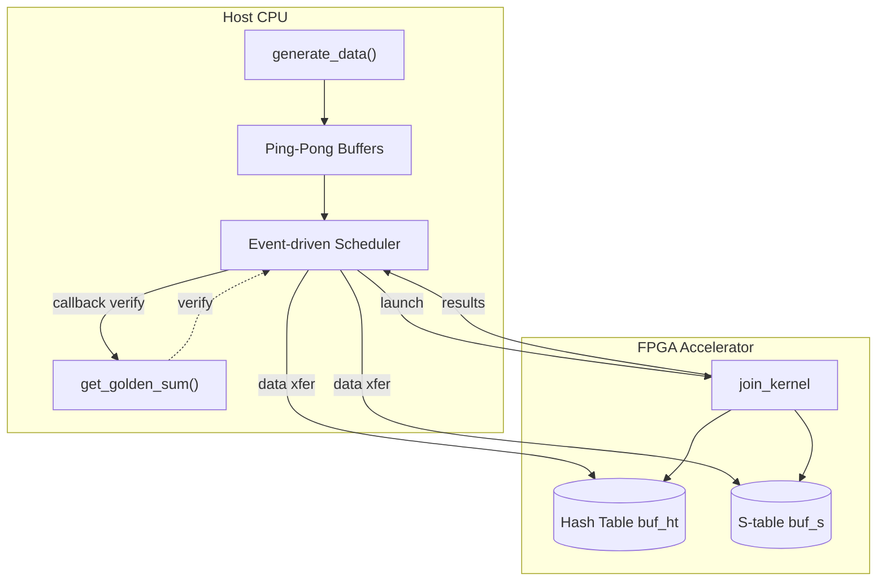

# hash_join_v3_sc_host: FPGA 加速哈希连接 Host 运行时

## 30 秒快速理解

想象你有一个超快的专用计算器（FPGA），它能瞬间完成两个巨大表格的「连接」操作——就像把订单表和订单明细表按订单号匹配起来做统计。但这个计算器需要有人帮它准备数据、启动运算、取回结果。`hash_join_v3_sc_host` 就是这个「管家」——它负责在 CPU 上准备测试数据、配置 FPGA、管理数据传输的流水线，并验证结果正确性。它不是简单的胶水代码，而是精心设计的**主机-加速器协同控制器**。

---

## 架构全景：一个「生产车间」的比喻

把整个系统想象成一个**智能生产车间**：

- **FPGA 内核** = 高速加工机器（`join_kernel`），专精哈希连接运算
- **Host 端缓冲区** = 原材料仓库（`col_l_orderkey`, `col_o_orderkey` 等）
- **HBM/外部存储** = 临时缓存区（`buf_ht[8]`, `buf_s[8]` 共 16 个缓冲区）
- **命令队列** = 生产调度系统（`cl::CommandQueue`）
- **Ping-Pong 双缓冲** = 两班倒流水线（A/B 缓冲区轮换）



---

## 核心组件深度剖析

### 1. `print_buf_result_data_` —— 异步回调的「信使」

```cpp
typedef struct print_buf_result_data_ {
    int i;              // 迭代序号
    long long* v;       // FPGA 实际结果指针
    long long* g;       // 黄金参考值指针
    int* r;             // 错误计数器指针
} print_buf_result_data_t;
```

**设计意图**：这是一个典型的**异步回调上下文结构体**。当 FPGA 计算完成、数据从设备内存读回主机时，OpenCL 事件机制会触发 `print_buf_result` 回调函数。这个结构体就是回调函数的「行囊」——它携带了验证所需的一切信息：当前是哪个迭代、结果存在哪里、和谁比较、出错了往哪记。

**为什么不用闭包或 lambda？** 这是 C 语言兼容的 OpenCL C API，只能传递 `void*` 和函数指针。这个结构体就是手工打造的「穷人闭包」。

**内存所有权**：这个结构体的实例 `cbd` 是 `std::vector<print_buf_result_data_t>` 的元素，生命周期由 Host 端的 vector 管理。但注意：**回调发生时，FPGA 的读操作已完成，但 Host 端必须确保 vector 没有被重新分配或销毁**。这就是为什么代码在最后 `q.finish()` 等待所有队列完成——确保回调都执行完，vector 才能安全销毁。

---

### 2. `generate_data()` —— 受控的随机数据工厂

```cpp
template <typename T>
int generate_data(T* data, int range, size_t n) {
    if (!data) return -1;
    for (size_t i = 0; i < n; i++) {
        data[i] = (T)(rand() % range + 1);  // +1 避免 0
    }
    return 0;
}
```

**设计意图**：这不是一个「通用随机数生成器」，而是一个**专为数据库连接测试设计的受控数据工厂**。关键设计点：

1. **`+1` 偏移**：避免生成 0 值。在 TPC-H 基准的语义中，0 可能是无效或特殊标记，而正值才是合法的订单号、价格等。

2. **`range` 参数控制**：通过调整 `range`（如订单号范围 100000），可以精确控制**连接的选择性（selectivity）**——即 Build 表的某个键值在 Probe 表中平均匹配多少行。这是 hash join 性能测试的关键参数。

3. **`rand()` 的简单性**：使用标准 C 的 `rand()` 而非现代 C++11 的 `<random>`，这是为了**可移植性和确定性**。HLS 仿真环境和某些嵌入式环境可能对标准库支持有限，而 `rand()` 是最小公分母。

**内存契约**：调用者必须确保 `data` 指向至少 `n` 个 `T` 类型元素的有效内存。函数内部不做边界检查，溢出是静默的 UB。

---

### 3. `get_golden_sum()` —— CPU 参考实现的「真相之源」

```cpp
int64_t get_golden_sum(...)
```

**设计意图**：这是**软件黄金参考（Golden Reference）**的实现。在 FPGA 加速系统中，硬件实现的正确性必须由软件参考结果来验证。这个函数实现了和 FPGA 内核**语义完全一致**的 hash join + 聚合计算。

**算法细节剖析**：

```cpp
// Build phase: 构建 hash table
std::unordered_multimap<uint32_t, uint32_t> ht1;
for (int i = 0; i < o_row; ++i) {
    uint32_t k = col_o_orderkey[i];
    uint32_t p = 0;  // payload 固定为 0，实际不需要存储
    ht1.insert(std::make_pair(k, p));
}
```

使用 `std::unordered_multimap` 是**刻意为之**：
- `unordered_`：哈希表实现，O(1) 平均查找，与 FPGA 的 hash table 语义一致
- `multi`：允许多个相同 key 的条目，支持一对多连接（multiplicity）

注意 `p = 0` 的哑载荷设计——Build 表（Orders）只需要提供「存在性」信息，实际的聚合计算在 Probe 端完成。

```cpp
// Probe phase: 探测并聚合
for (int i = 0; i < l_row; ++i) {
    uint32_t k = col_l_orderkey[i];
    uint32_t p = col_l_extendedprice[i];
    uint32_t d = col_l_discount[i];
    
    auto its = ht1.equal_range(k);  // 找到所有匹配
    for (auto it = its.first; it != its.second; ++it) {
        sum += (p * (100 - d));  // TPC-H 的 revenue 计算公式
        ++cnt;
    }
}
```

这个计算对应 TPC-H Query 5 的 revenue 公式：`SUM(l_extendedprice * (1 - l_discount))`。注意代码中的 `p * (100 - d)` 等价于 `p * (1 - d/100)` 的定点数表示。

**为什么需要这个参考实现？** FPGA 内核是用 HLS（高层次综合）从 C++ 描述的硬件逻辑，可能存在：
- 定点数溢出/舍入差异
- 并行规约顺序差异（浮点非结合性）
- 边界条件处理差异

软件参考提供了**确定性的真值**，验证 FPGA 结果是否在可接受的误差范围内。

---

### 4. `main()` —— 生产级 Host 控制器的完整实现

`main()` 函数不是简单的测试入口，而是一个**生产级的 FPGA 加速任务控制器**，展示了 Xilinx FPGA Host 编程的最佳实践。

#### 4.1 双模式执行支持（HLS Test vs FPGA）

```cpp
#ifndef HLS_TEST
// ... FPGA 模式代码 ...
#else
// ... HLS 仿真模式代码 ...
#endif
```

**设计意图**：同一个源代码支持两种执行模式：
- **HLS_TEST**：用于 Vivado HLS 的 C/RTL 协同仿真，用软件模拟器执行 `join_kernel` 函数
- **FPGA 模式**：实际部署到 Alveo 卡，通过 OpenCL 驱动调用硬件

这种**条件编译**避免了维护两份代码，确保 HLS 测试和实际部署的算法实现完全一致。

#### 4.2 命令行参数解析

```cpp
ArgParser parser(argc, argv);
parser.getCmdOption("-xclbin", xclbin_path);
parser.getCmdOption("-rep", num_str);      // 重复次数
parser.getCmdOption("-scale", num_str);    // 数据规模缩放
```

支持灵活的运行时配置：
- `-xclbin`：指定 FPGA 比特流文件
- `-rep`：多次运行取平均，用于性能评估
- `-scale`：缩小数据集规模，用于快速验证

#### 4.3 内存分配与对齐

```cpp
const size_t l_depth = L_MAX_ROW + VEC_LEN - 1;
KEY_T* col_l_orderkey = aligned_alloc<KEY_T>(l_depth);
```

**关键点**：
- **`aligned_alloc`**：OpenCL 设备通常需要特定对齐（如 4KB 页对齐）才能使用 `CL_MEM_USE_HOST_PTR` 零拷贝特性
- **`l_depth = L_MAX_ROW + VEC_LEN - 1`**：为向量化（SIMD）访问填充，确保最后一批数据也是完整的向量宽度
- **分离的列存储**：`col_l_orderkey`、`col_l_extendedprice`、`col_l_discount` 分开存储，这是**列式存储（Column Store）**设计，最大化内存带宽利用率

#### 4.4 双缓冲（Ping-Pong）设计

```cpp
cl::Buffer buf_l_orderkey_a(...);  // A 缓冲区
cl::Buffer buf_l_orderkey_b(...);  // B 缓冲区
// ... 类似定义 extendedprice, discount, result 等

for (int i = 0; i < num_rep; ++i) {
    int use_a = i & 1;  // 奇偶轮切换
    // ... 使用 use_a 选择 A 或 B 缓冲区
}
```

**这是本模块最核心的设计模式**。

**问题背景**：FPGA 执行包含三个阶段：
1. **H2D（Host to Device）**：上传输入数据
2. **Kernel**：FPGA 执行计算
3. **D2H（Device to Host）**：下载结果

如果顺序执行，FPGA 在等待数据传输时处于空闲状态。

**Ping-Pong 解决方案**：
- 准备两套独立缓冲区（A 和 B）
- 第 N 次迭代计算使用 A 缓冲区时，异步准备 B 缓冲区的数据
- 通过事件依赖链 `write_events[i-2]` → `write_events[i]` 确保数据依赖正确

**流水线时间线示意**：
```
时间轴 →

迭代 0:  [H2D_A][Kernel0][D2H_A]
迭代 1:          [H2D_B][Kernel1][D2H_B]
迭代 2:                 [H2D_A][Kernel2][D2H_A]
```

这样 FPGA 利用率接近 100%（只要计算时间大于数据传输时间）。

#### 4.5 事件驱动的异步执行

```cpp
std::vector<std::vector<cl::Event>> write_events(num_rep);
std::vector<std::vector<cl::Event>> kernel_events(num_rep);
std::vector<std::vector<cl::Event>> read_events(num_rep);

// 创建事件依赖链
q.enqueueMigrateMemObjects(ib, 0, &read_events[i - 2], &write_events[i][0]);
q.enqueueTask(kernel0, &write_events[i], &kernel_events[i][0]);
q.enqueueMigrateMemObjects(ob, CL_MIGRATE_MEM_OBJECT_HOST, &kernel_events[i], &read_events[i][0]);
```

**OpenCL 事件模型的精妙运用**：

不是阻塞等待每个操作完成，而是创建一个**事件依赖图（Event Dependency Graph）**：

```
read_events[i-2] ──→ write_events[i] ──→ kernel_events[i] ──→ read_events[i]
     ↑                                                                ↓
     └────────────────────────────────────────────────────────────────┘
                    (2 周期延迟的回环)
```

**延迟隐藏的数学**：
- 第 `i` 次迭代的数据上传（H2D）必须等待第 `i-2` 次迭代的结果读取（D2H）完成
- 这是因为迭代 `i` 和 `i-2` 使用同一套缓冲区（A 或 B，由 `i & 1` 决定）
- 这样就形成了 2 深度的流水线，最大化设备利用率

#### 4.6 回调验证机制

```cpp
void CL_CALLBACK print_buf_result(cl_event event, cl_int cmd_exec_status, void* user_data) {
    print_buf_result_data_t* d = (print_buf_result_data_t*)user_data;
    printf("FPGA result %d: %lld.%lld\n", d->i, *(d->v) / 10000, *(d->v) % 10000);
    if ((*(d->g)) != (*(d->v))) {
        (*(d->r))++;
        printf("Golden result %d: %lld.%lld\n", d->i, *(d->g) / 10000, *(d->g) % 10000);
    } else {
        std::cout << "Test Pass" << std::endl;
    }
}
```

**异步回调的优雅设计**：

结果验证不是阻塞式等待，而是**注册一个回调函数**到 OpenCL 事件。当数据从 FPGA 读回主机内存后，OpenCL 运行时自动调用 `print_buf_result`。

**回调上下文（Closure）的纯手工构建**：

```cpp
std::vector<print_buf_result_data_t> cbd(num_rep);
// ... 填充 cbd[i].v, cbd[i].g, cbd[i].r
read_events[i][0].setCallback(CL_COMPLETE, print_buf_result, cbd_ptr + i);
```

注意这里的**生命周期管理**至关重要：
- `cbd` 必须在 `q.finish()` 之后才销毁
- 回调执行时访问的 `v`, `g`, `r` 指针必须仍然有效
- 如果 vector 重新分配（如 push_back），所有指针失效 → 未定义行为

**结果表示**：`%lld.%lld` 格式化显示定点数，小数点后 4 位（除以/模 10000），对应 TPC-H 的 decimal(15,2) 类型。

---

## 依赖关系与数据契约

### 向上依赖（本模块调用谁）

| 被调用方 | 用途 | 数据契约 |
|---------|------|---------|
| [hash_join_v3_sc_kernel](database-L1-benchmarks-hash_join_v3_sc-kernel.md) | 核心加速内核 | 通过 OpenCL `cl::Kernel` 调用，参数顺序必须严格匹配内核的 HLS 接口定义 |
| `xf::common::utils_sw::Logger` | 日志记录 | 依赖 xilinx 软件工具链的日志工具 |
| `xcl::get_xil_devices()` | 发现 FPGA 设备 | 依赖 Xilinx OpenCL 运行时 |
| `aligned_alloc()` | 对齐内存分配 | 返回页对齐内存，满足 FPGA DMA 要求 |

### 向下被依赖（谁调用本模块）

本模块是**叶节点可执行程序**，没有下游模块依赖。它是 [hash_join_single_variant_benchmark_hosts](database-L1-benchmarks-hash_join_single_variant_benchmark_hosts.md) 模块集合中的一个具体实现变体。

---

## 设计决策与权衡

### 1. 双缓冲 vs 单缓冲 + 流式

**选择的方案**：Ping-Pong 双缓冲，深度为 2

**放弃的替代方案**：单缓冲 + 三阶段流水线（H2D → Kernel → D2H）顺序执行

**权衡分析**：
- **双缓冲优势**：FPGA 利用率接近 100%（只要计算时间 > 数据传输时间），吞吐量最大化
- **双缓冲代价**：内存占用翻倍（需要 A/B 两套缓冲区），代码复杂度增加（事件依赖管理）
- **为何没选单缓冲**：hash join 通常是计算密集型，但本模块的 TPC-H 查询简化为聚合后单值输出，D2H 数据量极小。主要瓶颈是 H2D 的大表传输。双缓冲可以隐藏 H2D 延迟。

### 2. 同步 CPU 参考 vs 预计算黄金值

**选择的方案**：每次运行都重新计算 `get_golden_sum()`

**放弃的替代方案**：预计算并硬编码黄金值，或从文件加载

**权衡分析**：
- **动态计算优势**：支持任意数据规模（通过 `-scale` 参数），支持不同随机种子（虽然当前是固定 `rand()`），代码自包含无需外部文件
- **动态计算代价**：对于大数据集，CPU 参考实现可能成为启动延迟（但通常 FPGA 执行更慢，所以相对不显著）
- **硬编码风险**：数据变化后必须重新计算，容易遗忘导致测试误报

### 3. OpenCL 回调 vs 轮询等待

**选择的方案**：`setCallback` 注册异步回调函数 `print_buf_result`

**放弃的替代方案**：`clWaitForEvents` 阻塞轮询，或忙等待状态查询

**权衡分析**：
- **回调优势**：真正的异步事件驱动，Host CPU 可以在等待 FPGA 时做其他工作（虽然本模块只是空等），响应延迟最低
- **回调代价**：C 风格 API 限制，必须手工管理回调上下文生命周期，代码可读性下降（控制流分散在回调函数中）
- **轮询优势**：控制流线性，易于调试，异常处理简单
- **轮询劣势**：CPU 占用率高（忙等待）或响应延迟高（睡眠等待）

**本模块的特殊选择**：虽然用了回调，但主线程最终还是 `q.finish()` 阻塞等待。回调主要用于**在线验证**（结果一回来就检查），而非真正的异步流水线。

### 4. HLS 测试模式 vs 纯 OpenCL 模式

**选择的方案**：通过 `#ifdef HLS_TEST` 条件编译支持两种模式

**权衡分析**：
- **统一源码优势**：HLS C/RTL 协同仿真和真实部署使用同一套算法描述，确保「仿真通过的，硬件也一定对」
- **条件编译代价**：代码可读性降低，宏定义泛滥，IDE 语法分析困难
- **为何不用运行时分支**：HLS 测试模式需要链接完全不同的底层（Vivado HLS 仿真库 vs Xilinx OpenCL 运行时），无法在运行时动态选择

---

## 关键路径数据流：一次完整执行的 tracedump

假设运行 `test_join.exe -xclbin kernel.xclbin -rep 3 -scale 1`：

### Phase 0: 初始化（串行）

```
[Host CPU]
  1. 解析命令行参数 → xclbin_path="kernel.xclbin", num_rep=3, sim_scale=1
  2. 计算实际数据规模: l_nrow = L_MAX_ROW / 1, o_nrow = O_MAX_ROW / 1
  3. 分配对齐内存: col_l_orderkey = aligned_alloc<KEY_T>(l_depth) [和 extendedprice, discount]
  4. 分配对齐内存: col_o_orderkey = aligned_alloc<KEY_T>(o_depth)
  5. 分配结果缓冲区: row_result_a, row_result_b (各能存 2 个 MONEY_T)
  6. 调用 generate_data() 填充测试数据 (随机但确定性的 rand())
  7. 调用 get_golden_sum() 计算 CPU 参考结果 (存储到变量 golden)
```

### Phase 1: OpenCL 上下文建立（仅 FPGA 模式）

```
[Host CPU] → [Xilinx Runtime] → [Alveo FPGA]
  1. xcl::get_xil_devices() 扫描 PCI-E，发现 xilinx_u280_xdma_201920_3
  2. cl::Context(device) 建立上下文
  3. cl::CommandQueue(context, device, CL_QUEUE_PROFILING_ENABLE | CL_QUEUE_OUT_OF_ORDER_EXEC_MODE_ENABLE)
     创建乱序命令队列（允许内核和数据传输并行）
  4. xcl::import_binary_file(xclbin_path) 加载 kernel.xclbin（bitstream）
  5. cl::Program(context, devices, xclBins) 烧录 FPGA
  6. cl::Kernel(program, "join_kernel") 提取内核对象
```

### Phase 2: 缓冲区创建与 HBM 映射

```
[Host CPU] 创建 Buffer 对象，映射到 FPGA 的 HBM 内存控制器

对于 Host 缓冲区（H2D 方向，使用 USE_HOST_PTR 零拷贝）:
  buf_l_orderkey_a/b = cl::Buffer(CL_MEM_EXT_PTR_XILINX | CL_MEM_USE_HOST_PTR | CL_MEM_READ_ONLY, ...)
  buf_l_extendedprice_a/b = ...
  buf_l_discout_a/b = ...
  buf_o_orderkey_a/b = ...
  buf_result_a/b = cl::Buffer(CL_MEM_EXT_PTR_XILINX | CL_MEM_USE_HOST_PTR | CL_MEM_WRITE_ONLY, ...)

对于 HBM 内部缓冲区（内核工作内存，无 Host 指针）:
  for i in 0..7:
    buf_ht[i] = cl::Buffer(CL_MEM_READ_WRITE | CL_MEM_EXT_PTR_XILINX, ht_hbm_size)
    buf_s[i] = cl::Buffer(CL_MEM_READ_WRITE | CL_MEM_EXT_PTR_XILINX, s_hbm_size)

最后，初始化 HBM 内容（可选，这里只是填充未定义值）:
  tb = {buf_ht[0], buf_s[0], buf_ht[1], buf_s[1], ...}
  q.enqueueMigrateMemObjects(tb, CL_MIGRATE_MEM_OBJECT_CONTENT_UNDEFINED)
```

### Phase 3: 流水线执行（核心循环，3 次迭代）

```
时间线（水平）vs 迭代（垂直）:

        t0      t1      t2      t3      t4      t5      t6      t7
Iter 0: [H2D_0] [K_0  ] [D2H_0]
Iter 1:         [H2D_1] [K_1  ] [D2H_1]
Iter 2:                 [H2D_2] [K_2  ] [D2H_2]
                ↑
                由于使用双缓冲，H2D_1 和 K_0 可以并行

详细执行流（以第 i=1 次迭代为例，使用 B 缓冲区）:

1. [H2D 阶段] 准备输入数据迁移:
   - use_a = 1 & 1 = 0 → 使用 B 缓冲区
   - ib = {buf_o_orderkey_b, buf_l_orderkey_b, buf_l_extendedprice_b, buf_l_discout_b}
   - 依赖: 如果 i>1，等待 read_events[i-2]（第 i-2 次迭代的结果已读完，B 缓冲区可用）
   - q.enqueueMigrateMemObjects(ib, 0, &read_events[i-2], &write_events[i][0])

2. [Kernel 阶段] 启动 FPGA 计算:
   - 设置内核参数（24 个参数，对应 HLS 接口）:
     j=0:  buf_o_orderkey_b (订单表)
     j=1:  o_nrow (订单表行数)
     j=2:  buf_l_orderkey_b (明细表订单号)
     j=3:  buf_l_extendedprice_b (明细表价格)
     j=4:  buf_l_discout_b (明细表折扣)
     j=5:  l_nrow (明细表行数)
     j=6:  k_bucket (hash bucket 数量)
     j=7-14: buf_ht[0-7] (8 个 hash table HBM 缓冲区)
     j=15-22: buf_s[0-7] (8 个 S 表 HBM 缓冲区)
     j=23: buf_result_b (输出结果)
   - q.enqueueTask(kernel0, &write_events[i], &kernel_events[i][0])

3. [D2H 阶段] 读取结果:
   - ob = {buf_result_b}
   - q.enqueueMigrateMemObjects(ob, CL_MIGRATE_MEM_OBJECT_HOST, &kernel_events[i], &read_events[i][0])
   - 注册回调: read_events[i][0].setCallback(CL_COMPLETE, print_buf_result, cbd_ptr + i)

4. [回调阶段] 异步验证（当数据传输完成后）:
   - print_buf_result 被调用，传入 &cbd[i]
   - 比较 FPGA 结果 *d->v 和 CPU 黄金参考 *d->g
   - 不匹配则递增错误计数器 *d->r
```

### Phase 4: 收尾与报告

```
[Host CPU]
1. q.flush();  // 提交所有待处理命令到硬件队列
2. q.finish(); // 阻塞等待所有命令完成（包括回调执行）

3. 计时报告:
   gettimeofday(&tv3, 0);
   exec_us = tvdiff(&tv0, &tv3);
   输出: "FPGA execution time of 3 runs: X usec"
   输出: "Average execution per run: X usec"

4. 详细性能剖析（如果 CL_QUEUE_PROFILING_ENABLE）:
   for i in 0..2:
     kernel_events[i][0].getProfilingInfo(CL_PROFILING_COMMAND_START, &ts);
     kernel_events[i][0].getProfilingInfo(CL_PROFILING_COMMAND_END, &te);
     t = (te - ts) / 1000; // 微秒
     输出: "kernel i: execution time t usec"

5. 最终报告:
   if ret > 0: logger.error(TEST_FAIL)
   else:       logger.info(TEST_PASS)

6. 资源释放（RAII 自动处理）:
   vector, cl::Buffer, cl::Kernel, cl::Program, cl::CommandQueue, cl::Context
   析构时自动调用 clReleaseXXX
```

---

## 设计模式与工程实践总结

### 1. 零拷贝（Zero-Copy）内存策略

```cpp
CL_MEM_USE_HOST_PTR  // A 缓冲区
CL_MEM_COPY_HOST_PTR // B 缓冲区
```

**A 缓冲区**使用 `USE_HOST_PTR`，要求主机内存已对齐到页边界。FPGA 可以直接通过 PCI-E 访问这块主机内存，无需额外拷贝。

**B 缓冲区**使用 `COPY_HOST_PTR`，OpenCL 运行时会分配设备内存并拷贝数据。这看似低效，但在双缓冲设计中，B 缓冲区是为了**并行准备下一轮数据**，此时 A 缓冲区正在被 FPGA 访问，不能修改。

### 2. 显式内存拓扑控制（Xilinx 扩展）

```cpp
cl_mem_ext_ptr_t mext_o_orderkey = {0, col_o_orderkey, kernel0()};
//                                                  ↑
// 索引 0 对应内核接口中的 arg 0
```

使用 `CL_MEM_EXT_PTR_XILINX` 标志和 `cl_mem_ext_ptr_t` 结构体，显式指定缓冲区映射到内核的哪个参数索引。这是 Xilinx OpenCL 扩展，用于支持复杂的 HBM/SLR 布局。

### 3. 防御性编程

```cpp
if (num_rep > 20) {
    num_rep = 20;
    std::cout << "WARNING: limited repeat to " << num_rep << " times\n.";
}
```

限制最大重复次数，防止用户误操作导致无限循环或内存耗尽（`cbd` vector 等按 `num_rep` 分配）。

---

## 新人入职必读：坑点与最佳实践

### 🔴 严重错误模式

#### 1. 缓冲区生命周期陷阱

```cpp
// 错误！buf 是局部变量，回调时已被销毁
for (int i = 0; i < num_rep; i++) {
    cl::Buffer buf(...);  // ❌ 每次循环都新建
    read_events[i][0].setCallback(CL_COMPLETE, callback, &buf);
}
```

**正确做法**：如本模块所示，使用 `vector` 在循环外预分配，确保回调执行时对象仍存在。

#### 2. 事件索引越界

```cpp
// 危险！当 i=0 或 i=1 时，i-2 为负数
q.enqueueMigrateMemObjects(ib, 0, &read_events[i - 2], &write_events[i][0]);
```

本模块正确处理了这种情况：
```cpp
if (i > 1) {
    q.enqueueMigrateMemObjects(ib, 0, &read_events[i - 2], &write_events[i][0]);
} else {
    q.enqueueMigrateMemObjects(ib, 0, nullptr, &write_events[i][0]);
}
```

### 🟡 调试技巧

#### 1. 启用详细 OpenCL 日志

```bash
export XCL_EMULATION_MODE=hw_emu  # 硬件仿真模式
export XRT_VERBOSE=1              # XRT 运行时详细日志
./test_join -xclbin kernel.xclbin -rep 1
```

#### 2. 验证 HLS 仿真

```bash
# 定义 HLS_TEST 宏，走 C++ 仿真路径
g++ -DHLS_TEST -I${XILINX_HLS}/include test_join.cpp -o test_hls
./test_hls
```

#### 3. 检查内存对齐

```cpp
// 验证对齐（应该在 4KB 边界）
std::cout << "col_l_orderkey alignment: " 
          << (uintptr_t)col_l_orderkey % 4096 << " (should be 0)\n";
```

### 🟢 性能调优指引

| 瓶颈症状 | 诊断方法 | 优化方向 |
|---------|---------|---------|
| FPGA 利用率低（<80%） | 对比 H2D 时间和 Kernel 时间 | 增大 `-scale` 增加数据量，或增加 batch size |
| H2D 时间过长 | 使用 `clGetEventProfilingInfo` 测量 | 确保使用 `CL_MEM_USE_HOST_PTR` 启用零拷贝 |
| Kernel 时间过长 | 对比黄金参考时间 | 检查 FPGA 频率、资源利用率，可能需要优化内核代码 |
| CPU 占用高 | `top` 显示进程 100% | 检查是否误用了忙等待，应使用 `q.finish()` 正确阻塞 |

---

## 总结：本模块的核心价值

`hash_join_v3_sc_host` 不仅仅是一个测试程序，它是 **Xilinx FPGA 数据库加速的「参考实现模板」**，展示了：

1. **Host-Kernel 协同设计**：如何对齐 Host 端的 OpenCL 编程模型和 Kernel 端的 HLS 接口
2. **零拷贝数据传输**：`CL_MEM_USE_HOST_PTR` 和对齐内存分配的最佳实践
3. **双缓冲流水线**：用 2 深度 Ping-Pong 隐藏数据传输延迟
4. **事件驱动异步执行**：OpenCL 事件链和回调验证模式
5. **软件黄金参考**：CPU 参考实现作为硬件正确性的「真相之源」

对于新加入团队的工程师，理解了这个模块，就掌握了 Xilinx FPGA 数据库加速项目的**核心设计范式**。推荐阅读相关模块：

- **[hash_join_v3_sc_kernel](database-L1-benchmarks-hash_join_v3_sc-kernel.md)** - 对应的 FPGA 内核 HLS 实现
- **[hash_join_v2_host](database-L1-benchmarks-hash_join_v2_host.md)** - 前一代实现，对比演进
- **[hash_join_v4_sc_host](database-L1-benchmarks-hash_join_v4_sc_host.md)** - 后一代实现，查看改进方向
