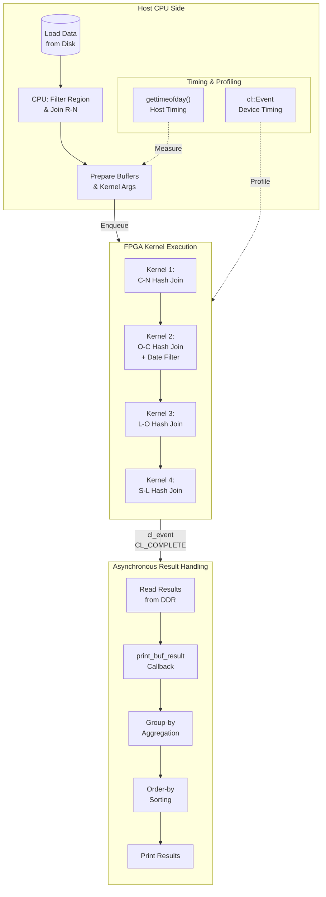

# q5_result_format_and_timing_types 模块深度解析

## 概述

`q5_result_format_and_timing_types` 模块是 **TPC-H Query 5** 的 FPGA 加速查询 demo 的**主机端运行时核心**。它扮演着一个**异构计算协调者**的角色：在 CPU 端准备数据、管理内存、编排内核执行；在 FPGA 端执行高性能的哈希连接（hash join）；并通过回调机制处理异步返回的查询结果。

想象这个模块如同一个**交响乐团的指挥**：它本身不演奏乐器（不做实际的数据过滤或连接），但它精确地协调各个声部（CPU 预处理、FPGA 加速、结果回传）的时机、数据流向和同步点，确保最终呈现完整的乐章（查询结果）。

---

## 问题域与设计动机

### 为什么要这个模块存在？

TPC-H Query 5 是一个涉及**六表连接**的复杂分析查询：

```sql
SELECT n_name, sum(l_extendedprice * (1 - l_discount)) 
FROM region, nation, customer, orders, lineitem, supplier
WHERE ...  -- 多条件连接与过滤
GROUP BY n_name 
ORDER BY revenue DESC;
```

这个查询的计算密度极高，传统 CPU 执行会面临**内存墙**和**分支预测失效**的双重瓶颈。

### 为什么不用纯软件方案？

纯软件方案（如传统数据库或 CPU 哈希连接）在处理 TPC-H Query 5 时会遇到以下问题：

1. **数据局部性差**：六表连接需要随机访问大量分散的内存，CPU cache 命中率极低
2. **分支预测惩罚**：WHERE 子句中的多条件判断导致流水线频繁刷新
3. **SIMD 利用率低**：不规则的数据访问模式使得向量化指令难以发挥作用

### 设计洞察：混合计算架构

本模块采用**CPU-FPGA 协同计算**的分层策略：

- **CPU 负责"轻量级过滤"**：Region 表过滤（仅需 5 行）、Nation-Region 连接（小表连接），这些操作数据量小、逻辑分支多，适合 CPU 的灵活性
- **FPGA 负责"重量级哈希连接"**：Customer-Orders、Orders-Lineitem、Lineitem-Supplier 等大表连接，这些操作数据量大、计算规则明确，适合 FPGA 的并行流水线

这种分工利用了各自的优势：**CPU 的灵活性处理不规则小数据，FPGA 的高吞吐处理规则大数据**。

---

## 核心抽象与心智模型

### 三个核心数据结构

本模块定义了三个关键结构体，分别对应**结果表示**、**时间度量**和**回调上下文**：

#### 1. `rlt_pair` —— 查询结果的原子单元

```cpp
struct rlt_pair {
    std::string name;           // 国家名称 (如 "IRAQ")
    TPCH_INT nationkey;         // 国家键值
    long long group_result;     // 聚合收入 (未缩放的整数表示)
};
```

这个结构体封装了 Query 5 最终输出的**一行结果**。注意 `group_result` 使用了 `long long` 来存储大额的收入累加值（TPC-H 中收入计算涉及 `l_extendedprice * (1 - l_discount)` 的累加，数值范围很大）。

#### 2. `timeval` —— Unix 时间戳标准结构

```cpp
struct timeval {
    time_t tv_sec;      // 秒
    suseconds_t tv_usec; // 微秒
};
```

这是 POSIX 标准的计时结构。模块中使用 `gettimeofday()` 和 `tvdiff()` 来测量**主机端**的代码执行时间（如数据加载、CPU 端连接时间）。

**注意**：`timeval` 与 OpenCL 事件（`cl::Event`）的基于纳秒的设备端计时是**互补**的，两者结合才能完整分析异构执行的性能。

#### 3. `print_buf_result_data_` —— 异步回调的上下文载体

```cpp
typedef struct print_buf_result_data_ {
    int i;                  // 迭代次数标识
    TPCH_INT* v;            // 指向 nation key 数组的指针
    TPCH_INT* price;        // 指向 extendedprice 数组
    TPCH_INT* discount;     // 指向 discount 数组
    rlt_pair* r;            // 指向结果元数据（国家名等）
} print_buf_result_data_t;
```

这个结构体是**异步 OpenCL 回调机制**的关键。由于 FPGA 执行是异步的（`enqueueTask` 立即返回），当结果数据从 FPGA 读回主机内存后，需要通过**回调函数** `print_buf_result` 来处理。

**心智模型**：把这个结构体想象成寄存在 OpenCL 运行时中的"信使包裹"——它包含了回调函数处理结果所需的全部上下文信息，当 `cl_event` 触发 `CL_COMPLETE` 时，这个包裹会被递交给回调函数。

---

## 数据流架构

下面的 Mermaid 图展示了 TPC-H Query 5 在主机-FPGA 之间的数据流动：



### 关键数据流阶段详解

#### 阶段 1：CPU 端预处理（轻量级过滤）

在 `main()` 函数中，数据加载后首先执行 CPU 端的预处理，过滤 Region 表并执行 Nation-Region 连接。Region 表仅 5 行、Nation 表仅 25 行，数据量极小，但涉及字符串比较和分支判断，这些操作在 CPU 上效率很高，而在 FPGA 上会浪费宝贵的逻辑资源，因此固定由 CPU 处理。

#### 阶段 2：OpenCL 内存映射与双缓冲（Ping-Pong）

为了掩盖数据传输延迟，模块实现了双缓冲机制（ping-pong buffering）。当 FPGA 在处理第 i 次迭代的数据时，CPU 可以同时准备第 i+1 次迭代的数据（写入 DDR），从而实现流水线并行（pipeline parallelism）。如果没有双缓冲，CPU 和 FPGA 必须串行执行，整体吞吐率会下降约 50%。

#### 阶段 3：内核链式执行（数据流依赖）

Query 5 的哈希连接在 FPGA 上以四阶段流水线执行，每阶段是一个独立的 `q5_hash_join` 内核调用，阶段间存在数据依赖。这种链式执行利用了 OpenCL 的事件依赖图（event dependency graph）机制。每个 `enqueueTask` 都指定了前一个阶段的 `events` 作为依赖，OpenCL 运行时会自动确保内核 K_i 在 K_{i-1} 完成后才开始执行，数据传输与内核执行尽可能重叠。

#### 阶段 4：异步回调处理与最终聚合

当 FPGA 完成最后一个内核（Supplier 连接）的执行后，结果需要从 DDR 读回主机内存。模块采用异步回调模式处理结果。`print_buf_result` 回调函数执行最终的 GROUP BY 和 ORDER BY，完成查询结果的格式化输出。

---

## 关键实现细节与陷阱

### 1. 双缓冲索引计算陷阱

代码使用 `i & 1` 来决定使用哪一套 buffer（`use_a`），这是一个典型的位运算技巧：

```cpp
for (int i = 0; i < num_rep; ++i) {
    int use_a = i & 1;  // 偶数次用 a，奇数次用 b
    if (use_a) {
        // 使用 _a buffers
    } else {
        // 使用 _b buffers
    }
}
```

**陷阱**：当 `num_rep = 1` 时，只有 `i = 0`，总是使用 `_b` buffers。如果代码逻辑假设两套 buffer 都会使用（如某些资源释放逻辑），可能导致未定义行为。此外，回调函数 `cbd_ptr[i]` 的索引必须与当前迭代匹配，否则回调会访问错误的内存。

### 2. 事件生命周期管理

`cl::Event` 对象的生命周期必须与 OpenCL 命令的执行周期匹配：

```cpp
// 正确：event 对象在回调触发前保持存活
std::vector<std::vector<cl::Event>> read_events(num_rep);
// ... 填充 read_events ...
read_events[i][0].setCallback(CL_COMPLETE, print_buf_result, cbd_ptr + i);

// 危险：如果 read_events 被销毁或重新分配（如 vector resize），
// 但 OpenCL 运行时仍持有指向其内部 cl_event 的指针，会导致崩溃
```

**陷阱**：`std::vector<std::vector<cl::Event>>` 的内存布局可能因 `resize` 或 `push_back` 而重新分配，导致 `cl::Event` 对象移动。虽然 `cl::Event` 的移动语义通常是安全的，但如果此时 OpenCL 运行时正使用该事件对象（如作为依赖等待），可能导致未定义行为。代码中通过预先分配 `resize` 避免了这个问题，但需要保持警惕。

### 3. 回调中的并发聚合问题

`print_buf_result` 回调函数执行最终的 GROUP BY 和 ORDER BY。如果 `num_rep > 1`（多次重复执行），多个回调可能并发执行（取决于 OpenCL 运行时和 CPU 核心数）。虽然代码中每个迭代的 `rlt_pair* r` 指向的是同一个 `result` 数组（共享的 nation 元数据），但 `group_result` 的累加是在回调内部针对该次迭代的数据进行的，不同迭代的 `group_result` 写入的是同一个 `result[j].group_result` 地址。

**这实际上是一个竞争条件（race condition）**：如果 `num_rep > 1` 且回调并发执行，对 `result[j].group_result` 的累加操作可能丢失更新。代码中 `query_result.push_back(rows[i])` 只保存第一次迭代（`i == 0`）的结果，这可能是有意为之的简化，但仍需注意并发安全问题。

---

## 依赖关系

### 上游依赖（谁调用此模块）

此模块是一个**顶层可执行程序**（`main` 函数入口），不由其他库模块调用。它的上游是：

1. **命令行用户**：通过 `./test_q5 -xclbin <path> -work <dir>` 调用
2. **自动化测试框架**：CI/CD 系统通过脚本调用此可执行文件验证 FPGA 功能

### 下游依赖（此模块调用谁）

| 依赖类型 | 模块/库 | 用途 |
|---------|---------|------|
| **内核函数** | `q5_hash_join` (in `q5kernel.hpp`) | FPGA 上执行的哈希连接内核 |
| **数据类型** | `TPCH_INT`, `table_dt.hpp` | TPC-H 表数据类型的定义 |
| **工具函数** | `prepare.hpp`, `utils.hpp` | 数据生成、加载、时间计算工具 |
| **OpenCL Runtime** | `xcl2.hpp`, `CL/cl_ext_xilinx.h` | Xilinx OpenCL 扩展和运行时 API |
| **日志库** | `xf_utils_sw/logger.hpp` | 标准化的日志和错误报告 |

### 数据契约与接口边界

1. **输入数据契约**：
   - TPC-H 数据文件必须位于 `-work` 参数指定的目录下
   - 数据文件命名必须符合 `*.dat` 格式（如 `l_orderkey.dat`）
   - 数据必须按照 TPC-H 规范的二进制格式存储（`TPCH_INT` 通常为 32 位有符号整数）

2. **FPGA 内核接口契约**：
   - `q5_hash_join` 内核参数顺序和类型必须与 `kernel0.setArg()` 的调用严格一致
   - 内存 bank 分配（通过 `XCL_BANK` 宏）必须与内核连接性（`kernel_connectivity_profiles`）匹配
   - 双缓冲的 `_a` 和 `_b` 版本必须完全镜像（参数顺序一致）

3. **输出与校验契约**：
   - 标准输出（`printf`）必须符合 TPC-H 规范格式，用于 golden 对比
   - 当输入数据为 1GB 规模（`sf = 1`）时，结果必须与硬编码的 golden 值匹配（如 IRAQ 的收入为 `582325532776`）

---

## 新贡献者指南

### 如何阅读本模块代码

1. **从 `main` 函数开始**：理解整体流程（数据加载 → CPU 预处理 → FPGA 执行 → 回调处理）
2. **关注三个核心结构体**：`rlt_pair`、`timeval`、`print_buf_result_data_` 定义了模块的核心抽象
3. **跟踪一次完整的执行流**：选择一个迭代 `i`，跟踪数据如何从主机 buffer → FPGA kernel → 回调函数

### 常见调试技巧

1. **HLS_TEST 宏**：在 `g++` 编译时定义 `-DHLS_TEST` 可以切换到纯软件仿真模式，无需 FPGA 硬件即可调试算法逻辑
2. **DEBUG 宏**：定义 `-DDEBUG` 可以打印详细的中间结果（注意数据量很大）
3. **事件剖析**：使用 `cl::Event::getProfilingInfo` 可以获取每个内核的执行时间（纳秒级精度）

### 修改代码时的注意事项

1. **保持双缓冲一致性**：如果修改了 buffer 的 `setArg` 索引，必须同时修改 `_a` 和 `_b` 两套版本
2. **回调数据生命周期**：`print_buf_result_data_t` 的数据必须保证在回调执行前有效（`q.finish()` 可以确保所有回调完成）
3. **Golden 对比值**：如果修改了计算逻辑（如精度、舍入方式），需要同步更新 `main` 函数末尾的 golden 校验值
