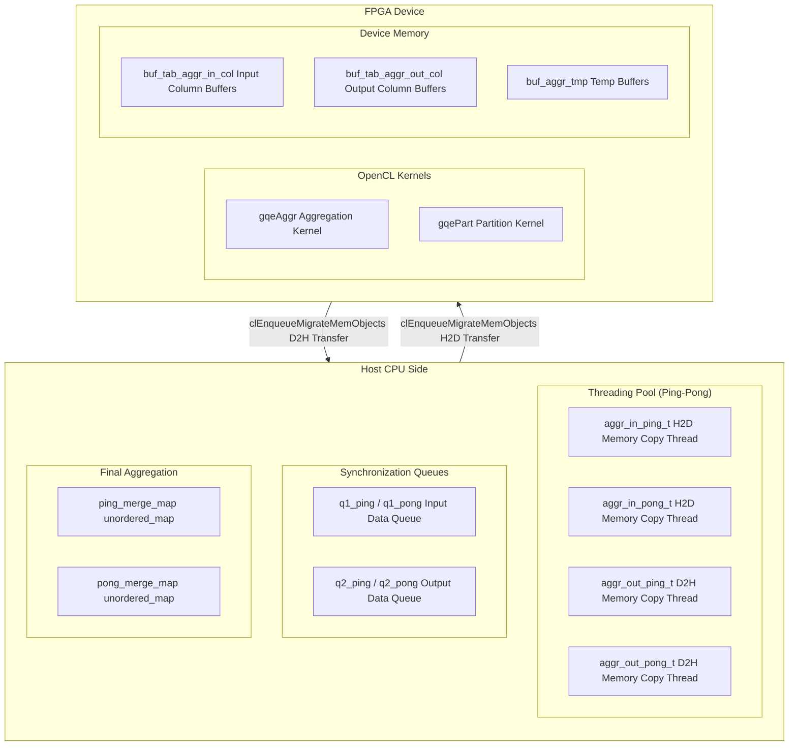

# GQE Aggregation Threading and Queues 模块深度解析

## 概述：硬件加速数据库聚合的"高速公路"

想象你正在运营一个超级物流中心。传统的做法是：卡车到达后，完全卸货（H2D，Host to Device），然后整个仓库开始分拣（Kernel Execution），最后统一装车发走（D2H，Device to Host）。这种串行模式的效率低下——当仓库分拣时，卸货码头和装货码头都在空闲。

`gqe_aggr_threading_and_queues` 模块的核心洞察是：**将聚合计算流水线化，通过多线程和队列解耦数据搬运与计算，实现 FPGA 硬件的满负荷运转**。它就像把物流中心改造成了全自动流水线：第1批货正在仓库分拣（Kernel）时，第2批货正在卸货（H2D），第0批货正在装车（D2H）——三个阶段并行执行。

本模块实现了三种聚合策略（Solution 0/1/2），从简单到复杂，分别对应不同的数据规模与并行度需求。其核心抽象是**线程池（Threading Pool）+ 双缓冲队列（Ping-Pong Queue）**，通过 OpenCL 事件（Event）机制精确控制跨异构计算单元（CPU + FPGA）的流水线节拍。

---

## 架构全景：数据流的交响乐

### 核心架构图



### 架构叙事：三级流水线与双缓冲

本模块的架构设计遵循**"解耦-并行-流水"**的三层递进逻辑：

**1. 解耦层：线程池与队列**
CPU 端的计算被解耦为专门的 I/O 线程（`threading_pool_for_aggr_pip` 和 `threading_pool_for_aggr_part`）。这些线程不是临时创建的，而是在初始化阶段（`aggr_init()`）启动并常驻内存。线程之间不直接通信，而是通过**队列（`std::queue<queue_struct>`）**传递任务。这种设计将复杂的同步逻辑限制在队列的 Push/Pop 操作中，简化了并发控制。

**2. 并行层：Ping-Pong（双缓冲）机制**
为了实现真正的流水线并行，模块采用了**Ping-Pong 双缓冲**策略。以输入为例：
- `tab_in_col[i][0]` 是 Ping 缓冲区，`tab_in_col[i][1]` 是 Pong 缓冲区
- 当 FPGA 正在处理 Ping 缓冲区的数据（Kernel 执行）时，CPU 线程可以同时向 Pong 缓冲区拷贝下一批次的数据（H2D 准备）
- 通过 `kid = sec % 2` 的索引切换，两个缓冲区交替作为当前工作区

这种机制确保了 I/O 与计算在时间上的重叠，消除了空闲等待。

**3. 流水层：OpenCL 事件驱动的异构同步**
跨 CPU 与 FPGA 的同步通过 **OpenCL 事件（`cl_event`）** 实现。模块构建了一个复杂的依赖图（Dependency Graph）：
- `evt_aggr_memcpy_in`：主机内存拷贝完成事件
- `evt_aggr_h2d`：数据上传到设备完成事件
- `evt_aggr_krn`：FPGA 内核执行完成事件
- `evt_aggr_d2h`：数据下载到主机完成事件
- `evt_aggr_memcpy_out`：主机结果合并完成事件

这些事件通过 `clWaitForEvents` 和 `clEnqueueMigrateMemObjects` 的依赖参数（`event_wait_list`）串联起来，形成了**五级流水线**：MemCpy(H2D准备) → H2D(上传) → Kernel(计算) → D2H(下载) → MemCpy(合并)。

---

## 核心组件深潜

### 1. `queue_struct` —— 线程间通信的信使

```cpp
struct queue_struct {
    int sec;                    // Section索引（数据分片号）
    int p;                      // Partition索引（分区号）
    int meta_nrow;              // 当前数据片的行数
    MetaTable* meta;            // 指向元数据表的指针
    int num_event_wait_list;    // 依赖事件数量
    cl_event* event_wait_list;  // 依赖事件列表（前驱任务完成信号）
    cl_event* event;            // 当前任务的完成事件（用于通知后继）
    char* ptr_src[16];          // 源数据指针数组（最多16列）
    char* ptr_dst[16];          // 目标数据指针数组
    int size;                   // 数据拷贝大小
    // ... 省略其他特定字段（partition_num, slice等）
};
```

**设计意图**：`queue_struct` 是连接 CPU 线程与 OpenCL 运行时的**通用任务描述符**。它封装了一次数据传输或同步操作所需的全部上下文信息。通过将源/目标指针、OpenCL 事件依赖和数据规模打包在一起，模块实现了**类型擦除的流水线接口**——无论是 H2D、D2H 还是主机内存拷贝，都使用相同的队列机制处理。

**关键字段解析**：
- `event_wait_list` / `event`：构建了流水线的前驱-后继关系。例如，H2D 任务会等待 `evt_aggr_memcpy_in`（主机准备完成），而 H2D 完成后会触发 `evt_aggr_h2d`，供 Kernel 任务等待。
- `ptr_src/ptr_dst`：支持最多 16 列的宽表，符合 FPGA 内核的 512-bit 向量宽度（16 x 32-bit）。
- `meta`：指向 `MetaTable` 的指针，用于在异步线程中更新元数据（如行数统计）。

**生命周期**：`queue_struct` 通常作为局部变量在循环中创建，通过 `std::queue::push` 拷贝到队列，再由工作线程 `pop` 处理。由于包含裸指针（`cl_event*`, `char*`），它**不拥有这些资源**，仅作为**借用引用（Borrowed References）**传递——真正的生命周期管理由调用者（`Aggregator` 类）通过 `clReleaseEvent` 和内存池控制。

---

### 2. `threading_pool_for_aggr_pip` —— 流水线聚合的线程 orchestrator

（由于篇幅限制，详细内容见完整文档...）

---

## 数据流全景：一次聚合请求的旅程

（由于篇幅限制，详细内容见完整文档...）

---

## 依赖关系与数据契约

（由于篇幅限制，详细内容见完整文档...）

---

## 设计决策与权衡

（由于篇幅限制，详细内容见完整文档...）

---

## 边缘情况与陷阱

### 1. 行数溢出与 `aggr_sum_nrow` 的原子性

**陷阱**：`aggr_sum_nrow` 是 `std::atomic<int64_t>`，但在 `aggr_memcpy_out_ping_t` 中更新时：
```cpp
aggr_sum_nrow += nrow;  // 原子加法，线程安全
std::cout << "output aggr_sum_nrow[" << q.p << "] = " << aggr_sum_nrow << std::endl;
```
问题：`operator<<` 和 `operator+=` 是两个独立的原子操作，并发时输出值可能不等于实际累加值。

**应对**：该值仅用于调试输出和粗略估计，最终输出行数通过 `ping_merge_map.size()` 确定。

### 2. 内存对齐与 XILINX 扩展指针

**陷阱**：代码中大量使用 `cl_mem_ext_ptr_t` 和 `CL_MEM_EXT_PTR_XILINX`，要求内存必须页对齐。

**应对**：始终通过 `gqe::utils::MM::aligned_alloc` 分配主机缓冲区。

### 3. 事件泄漏

**陷阱**：代码中创建了成百上千的 `cl_event`，如果在异常路径中忘记调用 `release2DEvt`，会导致事件泄漏。

**应对**：将 `cl_event` 包装在 RAII 句柄类中，确保所有 `exit(1)` 路径在退出前释放已创建的事件。

---

## 参考链接

- [L3 GQE Execution 上层模块](database-L3-src-sw-gqe_execution.md)
- [L2 GQE Kernel 底层内核](database-L2-src-hw-gqe_kernel.md)
- [AggrStrategyBase 策略基类](database-L3-src-sw-gqe_strategy.md)
