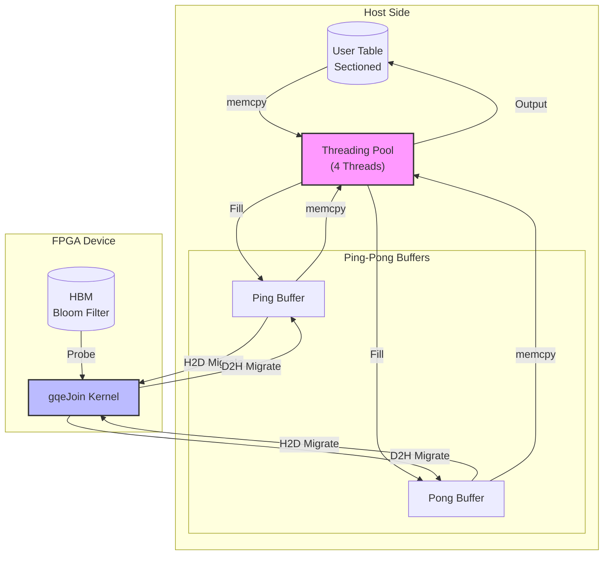

# gqe_filter_threading_and_queues 技术深度解析

## 开篇：这个模块在解决什么问题？

想象你正在处理一张数十亿行的数据表，需要快速过滤出满足特定条件的记录。在 CPU 上逐行扫描太慢，于是你将计算卸载到了 FPGA 加速卡。但新的挑战出现了：**数据量太大，无法一次性装入 FPGA 的片上内存；而 CPU 与 FPGA 之间的数据传输延迟，成为了整个流水线的瓶颈。**

`gqe_filter_threading_and_queues` 模块正是为了解决这个问题而生。它实现了一套**基于 Bloom Filter 的异构计算流水线**，通过精巧的"乒乓缓冲（Ping-Pong Buffering）"策略和四级线程池架构，将数据搬运与 FPGA 计算完全重叠，使得在 FPGA 计算当前数据块的同时，CPU 正在准备下一块数据，并且前一块的结果正在被拷回用户空间。

这不是简单的"多线程加速"，而是一个** choreographed dance（编排好的舞蹈）**——四个专用线程、两组缓冲区、三级 OpenCL 事件链，共同构成了一个无阻塞的数据处理管道。

## 架构全景：数据如何在系统中流动



### 核心组件的角色分工

1. **`queue_struct_filter`** —— 异步操作的"任务单"
   
   这个结构体封装了一次完整的数据搬运任务所需的所有元数据：源地址、目标地址、数据大小、列索引、依赖的事件（`event_wait_list`）以及完成通知事件（`event`）。它是连接主控制流与后台工作线程的"信封"，使得主线程可以简单地"投递任务"，而不必等待操作完成。

2. **`threading_pool`** —— 四级流水线引擎
   
   这是整个模块的心脏。它维护四个独立的 `std::thread`：
   - `probe_in_ping_t` 和 `probe_in_pong_t`：负责将用户数据从主机内存拷贝到 ping/pong 输入缓冲区
   - `probe_out_ping_t` 和 `probe_out_pong_t`：负责将过滤结果从 ping/pong 输出缓冲区拷回用户空间
   
   这四个线程配合 `std::queue<queue_struct_filter>` 和条件变量，构成了一个**生产者-消费者模型**，使得数据搬运与 FPGA 执行完全并行。

3. **`filter_sol` 主流程** —— 编排者
   
   这是实现 Bloom Filter 探测流水线的核心函数。它负责：
   - 将输入表划分为多个 section（段）
   - 配置 ping-pong 缓冲区
   - 建立 OpenCL 事件依赖链（H2D → Kernel → D2H）
   - 投递异步 memcpy 任务到线程池
   - 协调 Bloom Filter 哈希表在 HBM 中的部署

## 核心机制深度解析

### 1. Ping-Pong 缓冲：隐藏延迟的艺术

在异构计算中，PCIe 数据传输的延迟往往是最大的性能杀手。单纯的"计算完再传下一块"方式会导致 FPGA 大量时间处于等待状态。

本模块采用**双缓冲（Double Buffering）**策略：
- 当 FPGA 正在处理 **Ping** 缓冲区的数据时，CPU 线程正在向 **Pong** 缓冲区填充下一块数据
- 当 FPGA 处理完 Ping 后，立即切换到 Pong（无需等待），同时 Ping 的结果被拷回主机，然后 Ping 缓冲区被复用准备第三块数据

代码中通过 `sid = sec % 2` 决定当前使用哪一组缓冲区，配合四个独立线程，实现了**数据搬运与计算的全流水化**。

### 2. OpenCL 事件链：精确的依赖管理

在多阶段流水线中，必须严格控制各阶段的执行顺序：不能在上传完成前启动内核，不能在内核完成前下载结果。

本模块建立了一个三级事件依赖系统：

```
H2D Migration (上传数据)
    ↓ 触发事件: evt_probe_h2d[sec]
    ↓ 依赖: evt_probe_memcpy_in (memcpy完成) + evt_probe_krn[sec-2] (两阶段前的内核完成)

Kernel Execution (FPGA计算)
    ↓ 触发事件: evt_probe_krn[sec]
    ↓ 依赖: evt_probe_h2d (上传完成) + evt_probe_krn[sec-1] (前一阶段内核完成) + evt_probe_d2h[sec-2]

D2H Migration (下载结果)
    ↓ 触发事件: evt_probe_d2h[sec]
    ↓ 依赖: evt_probe_krn (内核完成) + evt_probe_memcpy_out[sec-2] (两阶段前的输出memcpy完成)

Memcpy Out (拷回用户空间)
    ↓ 依赖: evt_probe_d2h
```

这种**重叠式依赖**（sec-2 的完成）允许流水线保持满载，即使某个阶段稍慢，整体吞吐也不会下降。

### 3. 四级线程池：分工协作的并行策略

为什么需要四个线程，而不是两个或一个？

- **输入侧分离（Ping/Pong）**：当数据量很大时，即使 CPU 到 pinned host buffer 的 memcpy 也可能成为瓶颈。将 ping 和 pong 的填充工作分配给两个独立线程，可以充分利用多核 CPU 的带宽。

- **输出侧分离（Ping/Pong）**：同理，结果拷回也需要并行化。

- **输入/输出分离**：防止输出拷贝（写回用户内存）与输入填充（读取用户内存）争夺内存带宽。

代码中通过 `std::atomic<bool>` 控制线程生命周期，通过 `std::queue` 和 `std::condition_variable` 实现任务队列的线程安全访问。

### 4. 输出同步：跨 section 的顺序保证

在过滤操作中，输出行的数量是不确定的（取决于多少行通过 Bloom Filter）。但必须保证**输出顺序与输入顺序一致**。

`probe_out_ping_t` 和 `probe_out_pong_t` 中使用了 `std::mutex` 和 `std::condition_variable` 实现了一个**顺序控制器**：

```cpp
{
    std::unique_lock<std::mutex> lk(m);
    cv.wait(lk, [&] { return cur == q.sec; });  // 等待轮到自己
    
    total_curr_nrow = probe_out_nrow_accu;      // 获取当前累计行数
    probe_out_nrow_accu += probe_out_nrow;      // 更新累计行数
    
    cur++;                                      // 轮到下一个 section
    cv.notify_one();                            // 唤醒等待的线程
}
```

这种机制确保了即使 section 2 的结果先计算完成，它也会阻塞等待 section 0 和 1 先写入，从而**保证输出数据的有序性**。

## 依赖关系与数据契约

### 上游依赖（谁调用我）

该模块位于 L3 层，通常被更上层的查询执行引擎或应用代码调用：

- **调用入口**：`Filter::run()` 方法接收输入表、Bloom Filter 对象、过滤条件和输出表
- **配置依赖**：依赖 `BloomFilterConfig` 提供内核配置、列洗牌（shuffle）映射
- **策略依赖**：依赖 `StrategySet` 提供 section 数量等执行策略参数

### 下游依赖（我调用谁）

- **L2 层元数据管理**：依赖 `xf_database::meta_table` 管理列元信息
- **L3 层基础设施**：依赖 `gqe_table` 进行表数据访问，依赖 `gqe_bloomfilter` 进行哈希表访问
- **OpenCL 运行时**：直接使用 OpenCL API 进行设备管理、内存分配、内核执行
- **线程支持库**：使用 C++11 `std::thread`、`std::mutex`、`std::condition_variable`

### 数据契约与接口边界

**输入契约**：
- 输入表 `tab_in` 必须已正确分区（sectioned），且列数据已对齐到 8 字节边界
- Bloom Filter 哈希表必须已在主机内存中准备好，大小为 `bf_size_in_bits/8` 字节
- `fcfg` 配置对象必须包含有效的扫描和写入洗牌映射

**输出契约**：
- 输出表 `tab_out` 的行数将在执行后被更新为实际过滤后的行数
- 输出数据按 section 顺序写入，保证与输入 section 的顺序一致性
- 所有 OpenCL 事件在函数返回前已完成（`clWaitForEvents`）

**内存管理契约**：
- 主机缓冲区使用 `AllocHostBuf` 分配，必须在函数结束前通过 `clReleaseMemObject` 释放
- 用户事件（`clCreateUserEvent`）必须显式释放
- `threading_pool` 的线程必须在退出前通过原子标志停止并 `join`

## 设计权衡与关键决策

### 1. 四级线程 vs. 两级线程 vs. 线程池库

**选择的方案**：自定义四级线程（in_ping, in_pong, out_ping, out_pong）

**权衡分析**：
- **为什么不使用 std::async 或线程池库？** 需要精确控制线程亲和性和任务调度顺序。通用线程池无法保证 ping-pong 交替的严格时序，可能导致缓冲区争用。
- **为什么不是两个线程（一个输入、一个输出）？** 输入和输出各自需要 ping-pong 双缓冲，如果串行化处理，当数据量极大时，memcpy 带宽无法饱和。四个线程可以同时在四个方向（读入ping、读入pong、写出ping、写出pong）搬运数据。
- **代价**：增加了同步复杂度。需要四个队列、四个原子标志、更复杂的条件变量通知逻辑。

### 2. 同步 memcpy vs. 异步 OpenCL 迁移

**选择的方案**：主机端独立线程执行 `memcpy` + OpenCL `clEnqueueMigrateMemObjects` 分离

**权衡分析**：
- **为什么不直接用 OpenCL 的异步内存迁移完成所有操作？** OpenCL 的迁移命令在驱动层仍有不可忽略的开销，且对主机内存的 `memcpy` 性能不如直接用 CPU 的 `std::memcpy` 饱和内存带宽。通过独立线程做 `memcpy`，可以将 CPU 的 memcpy 引擎与 PCIe DMA 引擎并行。
- **代价**：引入了额外的数据拷贝（User Buffer → Pinned Host Buffer → Device）。如果用户数据已经在 pinned memory 中，会多一次拷贝。但通过 `AllocHostBuf` 分配的 pinned buffer 是中间站，这是为了兼容 OpenCL 的 `CL_MEM_USE_HOST_PTR` 要求。

### 3. 细粒度事件链 vs. 粗粒度栅栏

**选择的方案**：为每个 section 的每个阶段（H2D、Kernel、D2H、MemcpyOut）创建独立的 `cl_event`，并建立精确的依赖图（sec-2 依赖）

**权衡分析**：
- **为什么不用 `clFinish` 或粗粒度栅栏？** `clFinish` 会阻塞主机直到所有之前入队的命令完成，这会破坏流水线的重叠。细粒度事件允许第 N 个 section 的内核在第 N-1 个 section 还在下载结果时就开始执行（通过依赖 sec-2 的事件）。
- **复杂度代价**：事件对象的管理非常繁琐。必须确保每个 `clCreateUserEvent` 最终被 `clReleaseEvent`，每个依赖数组的生命周期要跨越多个函数调用。代码中使用了大量的 `std::vector<std::vector<cl_event>>` 来管理这些对象，增加了内存管理的复杂度。
- **调试代价**：事件链的错误依赖会导致死锁或数据竞争。例如，如果错误地让 section 2 依赖了 section 1 的 H2D 而不是 section 0 的 Kernel，可能导致 section 2 的内核在 section 0 还没算完就开始执行，读取脏数据。

### 4. 顺序保证的轻量级锁 vs. 无锁队列

**选择的方案**：使用 `std::mutex` + `std::condition_variable` 实现 section 输出顺序的强制序列化

**权衡分析**：
- **为什么不用无锁（lock-free）结构？** 需要保证的是跨线程的严格顺序（section 0 必须在 section 1 之前写入最终输出）。无锁队列通常保证的是 FIFO，但这里的问题是：即使 section 1 先计算完成，它也必须等待 section 0 写完才能写。这是一个**同步点（barrier）**问题，而不是队列问题。使用条件变量等待 `cur == q.sec` 是最直观、最可靠的实现。
- **性能影响**：只有当某个 section 的处理时间远快于前一个 section 时，才会在这里阻塞。由于 FPGA 内核的执行时间相对稳定，且 section 大小均匀，这种情况较少发生。互斥锁的持有时间极短（仅更新几个计数器），不会成为瓶颈。

## 使用指南与示例

### 典型调用模式

```cpp
// 1. 准备输入表和 Bloom Filter
xf::database::gqe::Table tab_in(...);
xf::database::gqe::Table tab_out(...);
xf::database::gqe::BloomFilter bf(...);

// 2. 配置过滤条件（列映射）
std::string input_cols = "0,1,2";      // 输入使用第 0,1,2 列
std::string output_cols = "0,2";      // 输出映射到第 0,2 列

// 3. 设置执行策略
xf::database::gqe::StrategySet params;
params.sec_l = 4;  // 将表分为 4 个 section，启用 4 级流水线

// 4. 创建 Filter 对象并执行
xf::database::gqe::Filter filter(program, context, command_queue, device);
filter.run(tab_in, input_cols, bf, "eq", tab_out, output_cols, params);
```

### 关键配置参数

**Bloom Filter 配置**：`BloomFilterConfig` 对象通过构造函数自动解析输入/输出列映射，并生成内核配置位（`getFilterConfigBits`）。确保输入的 `input_str` 和 `output_str` 与表的列索引匹配。

**Section 数量**：`params.sec_l` 决定了流水线的深度。理论上越多 section 越能隐藏延迟，但受限于：
- 主机内存大小（每个 section 需要独立的 pinned buffer）
- OpenCL 事件对象的管理开销
- 推荐值：4-16 个 section，根据输入表大小调整

**内存银行分配**：代码中硬编码使用了 `XCL_BANK0` (DDR0) 和 `XCL_BANK1` (DDR1) 分别用于输出和输入元数据，确保 HBM/DDR 带宽饱和。

## 潜在陷阱与边界情况

### 1. Section 大小不均导致的死锁

**风险**：如果某个 section 的行数远小于其他 section（例如数据分布不均），且该 section 的索引较大，它可能长时间卡在 `cv.wait(lk, [&] { return cur == q.sec; })` 处。

**缓解**：确保输入表在传入前已均匀分区。`tab_in.checkSecNum(sec_l)` 会自动处理，但如果用户手动设置了非均匀的 section，需注意此风险。

### 2. 内存对齐要求

**风险**：`table_l_sec_size_max` 的计算依赖于 `VEC_LEN` (8)。如果输入表的行数不是 8 的倍数，代码中 `pout_size = q.meta_nrow / 8` 会进行整数截断，导致最后几行数据丢失。

**缓解**：模块内部通过 `setCol` 和 `meta()` 调用确保元数据正确，但调用者需要确保输入表的行数对齐，或在创建 `Table` 对象时启用自动填充（padding）。

### 3. OpenCL 事件泄漏

**风险**：代码中创建了大量的 `cl_event` 对象（`evt_probe_h2d`, `evt_probe_krn` 等），虽然末尾有 `clReleaseEvent` 调用，但如果在中途发生异常（如内核编译失败），这些事件可能未被释放。

**缓解**：当前代码使用 C 风格错误处理（`exit(1)`），这在生产环境中可能不够健壮。建议在实际部署中包装 RAII 类管理 `cl_event` 和 `cl_mem` 对象。

### 4. 线程安全的数据竞争

**风险**：`threading_pool` 中的 `probe_out_nrow_accu` 和 `cur` 被多个线程（out_ping 和 out_pong）访问。虽然 `cur` 的更新在互斥锁保护下，但 `probe_out_nrow_accu` 的读取和更新也在锁内，这保证了原子性。然而，`toutrow` 数组的写入（`toutrow[q.sec] = ...`）发生在锁外，但由于每个 section 只被一个线程处理一次，且 `q.sec` 唯一，因此是安全的。

**注意**：如果未来修改代码允许多个线程处理同一个 section（例如为了负载均衡），`toutrow` 的写入将需要同步。

## 总结：设计哲学

`gqe_filter_threading_and_queues` 模块体现了**极致的流水线并行**设计哲学。它不满足于简单的"把计算丢给 FPGA"，而是通过以下手段榨干 heterogeneous system（异构系统）的每一滴性能：

1. **空间换时间**：使用双缓冲（Ping-Pong）将单块内存的串行读写转为并行读写
2. **异步化一切**：从数据拷贝到设备交互，全部异步化，主线程只负责 orchestration（编排）
3. **零等待原则**：通过精确的 event dependency 计算，确保任何阶段都不会因等待前序而空转
4. **硬件感知**：显式指定 XCL_BANK 分配，确保 DDR 带宽饱和；利用 HBM 存储 Bloom Filter 实现高并发探测

对于新加入团队的开发者，理解这个模块的关键不在于记住四个线程的名字，而在于 grasp（领悟）其背后的**流水线思维**：如何将一个大的数据流切分为细粒度的阶段，如何通过缓冲和异步消除依赖等待，以及如何在 CPU-FPGA 边界上进行高效的协同设计。
