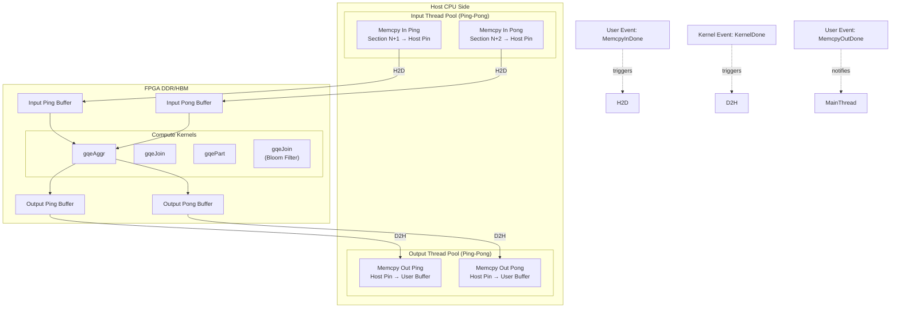
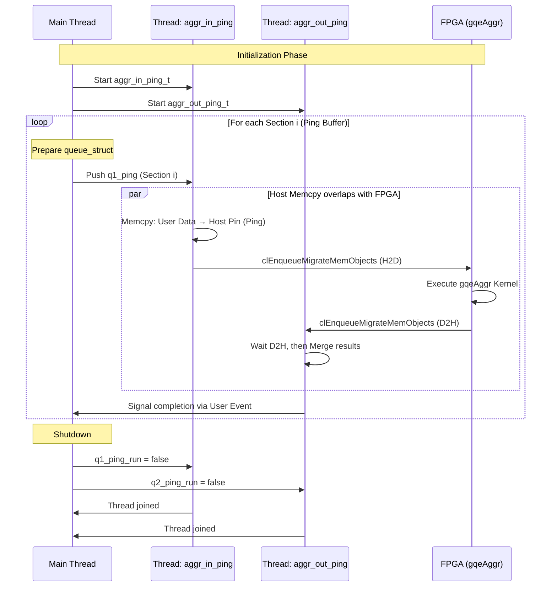

# L3 GQE Execution Threading and Queues

## 一句话概括

这是一个**面向 FPGA 数据库加速的高性能 Host 端执行框架**，通过**多级流水线线程池**和**Ping-Pong 双缓冲机制**，实现 CPU 数据准备与 FPGA 计算的全重叠，解决大数据量场景下"CPU 等 FPGA"或"FPGA 等 CPU"的瓶颈问题。

---

## 问题空间与设计动机

### 我们面对什么挑战？

在 FPGA 加速的数据库查询中（如 Hash Join、Aggregation、Bloom Filter），数据流通常遵循以下模式：

1. **Host 准备数据**：从磁盘/内存读取数据，格式转换，切分 Section
2. **H2D 传输**：通过 PCIe 将数据搬到 FPGA DDR/HBM
3. **FPGA 计算**：Kernel 执行（Build/Probe/Part）
4. **D2H 传输**：结果搬回 Host
5. **Host 后处理**：结果合并、格式转换

**核心矛盾**：如果采用同步串行执行，FPGA 在步骤 1、5 时空闲，CPU 在步骤 3 时空闲。对于大数据量（TB 级），这会导致严重的**流水线气泡**。

### 为什么不是简单的 OpenCL 队列？

标准的 OpenCL `clEnqueueTask` + `clWaitForEvents` 只能解决 FPGA 内部流水，但无法重叠**Host 侧的数据准备**（如内存拷贝、Section 切分、元数据更新）。我们需要**Host 端多线程 + FPGA 异步事件**的混合调度。

### 设计目标

1. **全流水线重叠**：Host 准备 Section N+1 的同时，FPGA 计算 Section N，Host 处理 Section N-1 的结果
2. **双缓冲（Ping-Pong）**：为 FPGA 提供两套输入/输出缓冲区，避免读写冲突
3. **无锁/少锁并发**：使用 OpenCL User Events 作为线程间同步原语，减少互斥锁开销
4. **策略可扩展**：提供多种执行策略（sol0-direct, sol1-pipelined, sol2-partitioned）适应不同数据规模

---

## 架构全景：一个"三层流水线 + 双缓冲"的系统



### 核心抽象层

#### 1. Queue Struct 层（数据描述）

每个异步操作（Memcpy In, H2D, Kernel, D2H, Memcpy Out）都由一个 `queue_struct`（或特定变体如 `queue_struct_filter`, `queue_struct_join`）描述：

- **Metadata**: `sec` (section ID), `p` (partition ID), `meta_nrow` (row count), `meta` (pointer to MetaTable)
- **Dependencies**: `num_event_wait_list`, `event_wait_list` (OpenCL events this operation waits on)
- **Completion Signal**: `event` (OpenCL user event to signal when this op completes)
- **Data Pointers**: `ptr_src[16]`, `ptr_dst[16]` (host buffers), `part_ptr_dst` (for partitioned output)
- **Configuration**: `valid_col_num`, `write_flag`, `merge_info` (for aggregation result merging)

#### 2. Threading Pool 层（执行引擎）

每个 GQE 操作（Aggr, Filter, Join）都有对应的 `threading_pool` 类，管理一组**长期运行的后台线程**：

**核心线程类型（以 Aggr 为例）**:
- `aggr_in_ping_t` / `aggr_in_pong_t`: 处理 "Memcpy In" 阶段（用户数据 → Host Pin Buffer）
- `aggr_out_ping_t` / `aggr_out_pong_t`: 处理 "Memcpy Out" 阶段（Host Pin Buffer → 用户结果缓冲区，含 Merge 逻辑）

**Join/Filter 扩展**:
- `part_l_memcpy_in_ping_t`: 分区操作（Partition）的输入拷贝
- `probe_memcpy_in_ping_t`: Hash Probe 阶段的输入准备
- `build_memcpy_in_t`: Hash Build 阶段的数据准备

**线程间同步机制**:
- **无锁队列**: `std::queue<queue_struct>` 作为任务队列（q1_ping, q1_pong, q2_ping, q2_pong 等）
- **原子标志**: `std::atomic<bool> q1_ping_run` 控制线程生命周期
- **OpenCL Events**: `cl_event` 作为跨线程/跨设备的同步原语（等待 FPGA 完成后再启动下一次 Memcpy）
- **条件变量**: `std::condition_variable` 用于输出阶段的顺序保证（确保 Section N-1 的结果已写回再写 Section N）

#### 3. Strategy 层（执行策略）

每个 GQE 类（`Aggregator`, `Filter`, `Joiner`）实现多种**执行策略（Solution）**，通过 `StrategySet` 参数选择：

**Aggregator**:
- **sol0 (Direct)**: 单批次直接聚合，无流水线。适合小数据量。
- **sol1 (Pipelined)**: 双缓冲 + 多线程流水线，Section 级并行。适合中等数据量。
- **sol2 (Partition + Pipelined)**: 先分区（Partition）再按分区聚合，解决大数据量下 Hash 表过大问题。

**Joiner**:
- **sol0 (Direct Join)**: 单 Build + 单 Probe，无分区。
- **sol1 (Pipelined Join)**: Build 后，Probe 表分 Section 流水线处理。
- **sol2 (Partition + Join)**: 两边表都分区，然后按分区 Join，支持大数据量。

**Filter (Bloom Filter)**:
- 主要为 **Pipelined N x Bloom-filter Probe**，支持多 Section 流水线，利用 Bloom Filter 做预过滤。

---

## 数据流全景：以 Aggregation 为例

让我们追踪一个 `Aggregator::aggr_sol1`（Pipelined Aggregate）的完整生命周期，观察 Host 线程与 FPGA 如何协作：



### 关键数据流阶段详解

#### Stage 1: Memcpy In (Host 侧数据准备)
- **执行者**: `aggr_in_ping_t` / `aggr_in_pong_t` 线程
- **输入**: `queue_struct` 描述的源地址 (`ptr_src`) 和目标 Host Pin Buffer (`ptr_dst`)
- **操作**: 
  1. 调用 `clWaitForEvents` 等待前一次 H2D 完成（依赖管理）
  2. 执行 `memcpy` 将用户数据拷入 Host Pin Buffer
  3. 更新 `MetaTable` 元数据
  4. 调用 `clSetUserEventStatus` 标记 Memcpy In 完成，触发下游 H2D
- **关键约束**: 必须保证 Ping 和 Pong 缓冲区的交替使用，避免数据覆盖

#### Stage 2: H2D (Host to Device)
- **执行者**: Main 线程（通过 OpenCL Command Queue）
- **触发条件**: Memcpy In 的 User Event 完成
- **操作**: `clEnqueueMigrateMemObjects` 将 Host Pin Buffer 迁移到 FPGA DDR
- **优化**: 使用 `CL_MIGRATE_MEM_OBJECT_CONTENT_UNDEFINED` 预分配，减少分配延迟

#### Stage 3: Kernel Execution (FPGA 计算)
- **执行者**: FPGA Kernel (`gqeAggr`, `gqeJoin`, `gqePart`)
- **输入**: 输入缓冲区、配置寄存器 (`cfg_aggr`)、元数据 (`meta_aggr_in`)
- **输出**: 结果缓冲区、元数据 (`meta_aggr_out`)
- **同步**: Kernel 完成后自动触发下游 Event

#### Stage 4: D2H (Device to Host)
- **执行者**: Main 线程
- **操作**: `clEnqueueMigrateMemObjects` 结果迁回 Host Pin Buffer
- **依赖**: 必须等待 Kernel 完成

#### Stage 5: Memcpy Out + Merge (结果处理)
- **执行者**: `aggr_out_ping_t` / `aggr_out_pong_t` 线程
- **关键逻辑** (以 Aggregation 为例):
  1. 等待 D2H 完成 (`clWaitForEvents`)
  2. 从 `meta_aggr_out` 读取实际输出行数
  3. **Hash Merge**: 对于 Aggregation，需要将多个 Section 或 Partition 的结果按 Group Key 合并 (`ping_merge_map`, `pong_merge_map`)
  4. 使用 `std::unordered_map<Key, Payloads>` 进行结果累加（支持 32/64 位混合精度）
  5. 调用 `clSetUserEventStatus` 标记 Section 处理完成
- **顺序保证**: 对于需要按序输出的场景，使用 `std::mutex` + `std::condition_variable` 确保 Section N-1 写回完成后再写 Section N

---

## 设计决策与权衡分析

### 1. 为什么需要三级流水线？

**替代方案**：简单的同步循环（Read → H2D → Kernel → D2H → Write）

**缺点**：
- FPGA 在 Host 读写数据时 100% 空闲
- 对于大数据量，PCIe 带宽和计算时间都很长，串行执行效率 < 50%

**我们的方案**：
- **Level 1 (Input Thread)**: 预读取 Section N+1 到 Host Pin Buffer
- **Level 2 (FPGA Pipeline)**: 执行 Section N 的 H2D → Kernel → D2H
- **Level 3 (Output Thread)**: 处理 Section N-1 的结果合并与写回

**收益**：理论吞吐量提升 3x（实际受限于最慢环节），实现 "FPGA 计算与 Host 数据准备全重叠"。

### 2. Ping-Pong 双缓冲 vs 单缓冲

**权衡**：
- **单缓冲**：省 50% Host Pin Memory，但无法重叠 H2D 和下一块 Memcpy In（必须等 H2D 完成才能覆盖缓冲区）
- **Ping-Pong (双缓冲)**：
  - Ping Buffer 在 H2D 时，Pong Buffer 可同时做 Memcpy In (N+2)
  - 实现真正的全流水线无气泡
  - 代价是 Host 内存占用翻倍（必须同时 Pin 2x 数据量）

**决策**：对于 GQE 面向的大数据分析场景（内存充足，追求极致吞吐），选择 **Ping-Pong**。

### 3. 为什么用 OpenCL User Events 而非 std::mutex？

**背景**：我们需要在 Input Thread (Host Memcpy) 和 Main Thread (OpenCL H2D) 之间同步。

**方案对比**：
- **std::mutex + cv**: 
  - 优点：纯 C++ 标准，易调试
  - 缺点：每次切换需用户态→内核态，延迟 ~μs 级；且无法与 OpenCL Runtime 的事件系统天然集成
- **cl_event / clSetUserEventStatus**:
  - 优点：零拷贝接入 OpenCL 事件链；H2D 命令可直接依赖 User Event，无需线程阻塞等待
  - 缺点：调试困难（事件链断裂难定位）；需小心引用计数防止内存泄漏

**决策**：选择 **OpenCL User Events** 作为线程间同步原语，实现与 OpenCL Command Queue 的零开销集成。

### 4. 三种 Solution (sol0/1/2) 的策略模式

**sol0 (Direct)**:
- **场景**：小数据量（< FPGA DDR 容量，单次可处理完）
- **做法**：无 Section 切分，无多线程，单批次 H2D → Kernel → D2H
- **优势**：代码简单，无线程同步开销

**sol1 (Pipelined)**:
- **场景**：中等数据量（需切分 Section，但无需分区）
- **做法**：Ping-Pong 双缓冲，Input/Output 线程池，Section 级流水线
- **优势**：最大化吞吐，CPU 与 FPGA 全重叠

**sol2 (Partition + Pipelined)**:
- **场景**：大数据量（Hash 表无法一次装入 FPGA 片上存储）
- **做法**：先执行 `gqePart` Kernel 对两边表分区，然后按分区对执行 Join/Agg
- **优势**：突破 FPGA 片上存储限制，处理 TB 级数据

---

## 关键陷阱与防御性编程指南

### 1. OpenCL Event 引用计数泄漏

**陷阱**：`clCreateUserEvent` 创建的 Event 必须配对 `clReleaseEvent`，如果在某个错误分支提前返回，或在异常中未捕获，会导致 Event 泄漏，最终耗尽 OpenCL 资源。

**防御**：
```cpp
// 使用 RAII wrapper 管理 cl_event
struct EventGuard {
    cl_event& e;
    EventGuard(cl_event& ev) : e(ev) {}
    ~EventGuard() { if(e) clReleaseEvent(e); }
};
// 或在代码中确保每个分支都 Release
```

### 2. Ping-Pong 缓冲区数据竞争

**陷阱**：若代码逻辑错误，导致 Ping Buffer 的 H2D 尚未完成，下一次 Memcpy In 就覆盖了 Ping Buffer 的数据，导致 FPGA 读取脏数据。

**防御**：
- **严格的 Event 链**：Memcpy In 线程必须等待 `evt_h2d[section-2]`（前两节的 H2D 完成，确保双缓冲轮转安全）
- **代码审查点**：检查 `aggr_min[p].num_event_wait_list` 是否设置了正确的依赖 Event

### 3. Host Pin Buffer 内存超限 (OOM)

**陷阱**：Ping-Pong 双缓冲意味着同时 Pin 住 2x 数据量的内存。如果用户配置 `sec_num` 过大，或单行数据过宽，可能导致 `AllocHostBuf` 失败或系统换页。

**防御**：
- **策略选择**：大数据量自动切换 sol2 (Partition)，减少单个 Section 大小
- **内存预算**：代码中应检查 `table_l_sec_size_max` 是否超过阈值，提前 Fallback 到 Partition 策略

### 4. Hash Merge 中的 32/64 位精度混淆

**陷阱**：在 `aggr_memcpy_out_ping_t` 中，Aggregation 结果可能需要合并 32 位和 64 位数据（如 `low_bits` 和 `high_bits` 组合成 64-bit sum）。若类型转换错误，会导致结果溢出。

**防御**：
```cpp
// 正确做法：明确使用 ap_uint<64> 和范围赋值
ap_uint<32> low_bits, high_bits;
// ... 从 buffer 读取 ...
ap_uint<64> merge_result = (ap_uint<64>)(high_bits, low_bits); // 拼接
```

### 5. 分区哈希表的并发访问 (Join)

**陷阱**：在 `join_sol2` 中，多个 Partition 的 Build/Probe 可能共享 Host 端的 Hash Table（`hbuf_hbm`）。如果未正确同步，会导致数据竞争。

**防御**：
- **串行 Build**：所有 Partition 的 Build 阶段在 Host 侧是串行的（或通过原子操作保护）
- **并行 Probe**：Probe 阶段可以并行，因为每个 Section 只读 Hash Table
- **代码检查**：确保 `pool.l_new_part_offset` 的原子更新使用 `std::atomic<int64_t>`

---

## 子模块导航

本模块包含三个核心 GQE 算子的执行实现，每个都遵循"Thread Pool + Queue + PingPong"的架构模式：

| 子模块 | 核心类 | 主要职责 |
|--------|--------|----------|
| [gqe_aggr_threading_and_queues](./database_query_and_gqe-l3_gqe_execution_threading_and_queues-gqe_aggr_threading_and_queues.md) | `Aggregator`, `threading_pool_for_aggr_pip`, `threading_pool_for_aggr_part` | 聚合操作（SUM/COUNT/GROUP BY）的三级策略执行（sol0/1/2），含复杂的 Hash Merge 结果合并逻辑 |
| [gqe_filter_threading_and_queues](./database_query_and_gqe-l3_gqe_execution_threading_and_queues-gqe_filter_threading_and_queues.md) | `Filter`, `threading_pool` | Bloom Filter Probe 的流水线实现，用于高速数据过滤 |
| [gqe_join_threading_and_queues](./database_query_and_gqe-l3_gqe_execution_threading_and_queues-gqe_join_threading_and_queues.md) | `Joiner`, `threading_pool` | Hash Join 的实现，支持 Partitioned Hash Join（sol2）以处理超大规模数据 |

**通用基础设施**（跨子模块共用）：
- `queue_struct` / `queue_struct_filter` / `queue_struct_join`: 异步操作描述符
- `MetaTable`:  FPGA 侧元数据管理（行数、列偏移等）
- `gqe::utils::MM`: 对齐内存分配器

---

## 依赖关系与交互边界

### 向上依赖（L3 → L2/L1）
- **L2 API**: `xf_database::gqe::Table`, `MetaTable`（表结构定义）
- **L1 Kernels**: `gqeAggr`, `gqeJoin`, `gqePart` 的 xclbin 二进制
- **OpenCL Runtime**: Xilinx XRT (`clEnqueueTask`, `clCreateBuffer`)

### 向下暴露（供 Application 调用）
- **High-level API**: `Aggregator::aggregate()`, `Joiner::run()`, `Filter::run()`
- **Strategy Configuration**: `AggrStrategyBase`, `JoinStrategyBase`（允许用户自定义 Section 数、Partition 数等）

### 横向交互（GQE 内部）
- **Buffer Sharing**: `threading_pool` 中的线程共享 `cl_command_queue` 和 `cl_context`
- **Event Chaining**: 一个线程的 `clSetUserEventStatus` 触发另一个线程的 `clWaitForEvents`

---

## 性能调优指南（给新贡献者的备忘）

### 1. Section Size 调优
- **太大**：Host Pin 内存占用高，缓存不友好，FPGA 计算延迟大
- **太小**：Section 切换 overhead 高，线程上下文切换频繁
- **经验法则**：每个 Section 应该使得 H2D 传输时间 ≈ FPGA 计算时间，通常 1-10MB 量级

### 2. Thread Pool 线程数
- **当前设计**：固定为 4 线程（Ping/Pong × In/Out）
- **调整场景**：如果 FPGA Kernel 计算时间 >> Host Memcpy 时间，可以减少为 2 线程（去掉 Pong）；反之如果数据准备慢，可增加为 6 线程（多级流水线）

### 3. OpenCL Event 池化
- **问题**：频繁 `clCreateUserEvent` / `clReleaseEvent` 有性能开销
- **优化**：可实现 Event Pool，复用 Event 对象（当前代码未实现，潜在优化点）

### 4. NUMA 亲和性
- **重要性**：Host Pin Buffer 应分配在 FPGA 所在的 NUMA 节点上（通常通过 `XCL_MEM_TOPOLOGY` 指定 Bank）
- **代码位置**：`cl_mem_ext_ptr_t` 的 `flags` 设置 (`XCL_BANK0`, `XCL_BANK1`)

---

## 总结

`l3_gqe_execution_threading_and_queues` 是 Xilinx GQE 数据库加速解决方案的**Host 侧执行引擎核心**。它通过以下技术创新解决了大数据量 FPGA 加速的流水线瓶颈：

1. **Ping-Pong 双缓冲**：实现数据传输与计算的全重叠
2. **多级线程池**：Input/Compute/Output 三级流水线并行
3. **事件驱动架构**：基于 OpenCL User Events 的零拷贝线程同步
4. **策略可扩展**：sol0/1/2 三级策略适应从小到超大规模数据

对于新贡献者，理解**数据在 Host 线程、OpenCL 事件、FPGA Kernel 之间的流动关系**是掌握本模块的关键。建议从 `aggr_sol1` 的代码路径开始阅读，因为它是相对简洁的完整流水线示例。
