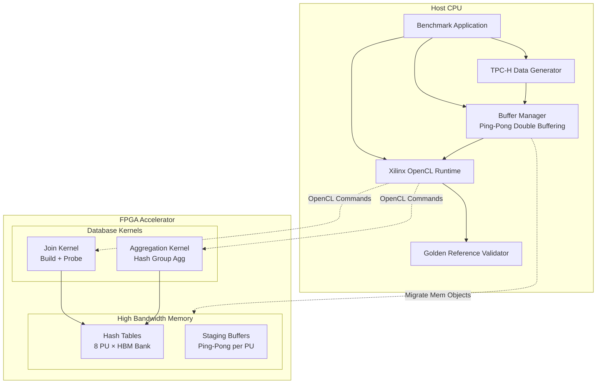

# L1 Hash Join and Aggregation Benchmark Hosts

## 概述

`l1_hash_join_and_aggregation_benchmark_hosts` 模块是 Xilinx FPGA 数据库加速库 L1 层的基准测试主机代码集合。该模块实现了针对 TPC-H 基准测试的**哈希连接（Hash Join）**和**分组聚合（Group Aggregation）**操作的完整主机端测试框架。

可以将这个模块想象为一个**"数据库查询执行编排器"**：它负责在 CPU 主机和 FPGA 加速器之间搭建数据通路，管理内存缓冲区，调度内核执行，并验证计算结果的正确性。就像交响乐团中的指挥家，它不直接演奏乐器（执行计算），但确保所有声部（数据移动、计算、结果回传）在正确的时间精确协调。

该模块支持多种连接变体：
- **内连接（Inner Join）**：标准的等值连接，返回匹配的行对
- **半连接（Semi Join）**：返回左表中存在匹配右表行的记录（去重）
- **反连接（Anti Join）**：返回左表中不存在匹配右表行的记录
- **多路连接（Multi Join）**：支持多表连接或复杂过滤条件

以及多种聚合操作：SUM、COUNT、MAX、MIN、MEAN、COUNTNONZEROS 等。

## 架构设计

### 系统架构图



### 数据流与控制流

#### 典型 Hash Join 执行流程

1. **数据生成阶段**
   ```cpp
   // 生成 TPC-H Lineitem 和 Orders 表数据
   generate_data<TPCH_INT>(col_l_orderkey, 100000, l_nrow);
   generate_data<TPCH_INT>(col_l_extendedprice, 10000000, l_nrow);
   generate_data<TPCH_INT>(col_o_orderkey, 100000, o_nrow);
   ```

2. **黄金参考计算（CPU 侧验证）**
   ```cpp
   // CPU 侧使用 std::unordered_multimap 实现相同算法
   std::unordered_multimap<uint32_t, uint32_t> ht1;
   // Build phase: 插入 Orders 表
   for (int i = 0; i < o_row; ++i) {
       ht1.insert(std::make_pair(col_o_orderkey[i], 0));
   }
   // Probe phase: 扫描 Lineitem 表
   for (int i = 0; i < l_row; ++i) {
       auto its = ht1.equal_range(col_l_orderkey[i]);
       for (auto it = its.first; it != its.second; ++it) {
           sum += (price * (100 - discount));
       }
   }
   ```

3. **FPGA 缓冲区准备**
   ```cpp
   // 创建 OpenCL 缓冲区，使用 Xilinx 扩展指针映射到特定 HBM Bank
   cl_mem_ext_ptr_t mext_o_orderkey = {0, col_o_orderkey, kernel0()};
   cl::Buffer buf_o_orderkey_a(context, 
       CL_MEM_EXT_PTR_XILINX | CL_MEM_USE_HOST_PTR | CL_MEM_READ_ONLY,
       (size_t)(KEY_SZ * o_depth), &mext_o_orderkey);
   ```

4. **Ping-Pong 双缓冲执行流水线**
   ```cpp
   // 使用两个缓冲区集合 (A/B) 实现双缓冲
   // 当 Kernel 处理 Buffer A 时，Host 准备 Buffer B 的数据
   // 当 Kernel 处理 Buffer B 时，Host 读取 Buffer A 的结果
   
   for (int i = 0; i < num_rep; ++i) {
       int use_a = i & 1;  // 交替使用 A/B 缓冲区
       
       // 1. 将输入数据从 Host 迁移到 FPGA（与前两次迭代的结果读取重叠）
       if (i > 1) {
           q.enqueueMigrateMemObjects(ib, 0, &read_events[i - 2], &write_events[i][0]);
       } else {
           q.enqueueMigrateMemObjects(ib, 0, nullptr, &write_events[i][0]);
       }
       
       // 2. 执行 Kernel（等待本次写入完成）
       q.enqueueTask(kernel0, &write_events[i], &kernel_events[i][0]);
       
       // 3. 将结果从 FPGA 迁移回 Host（等待 Kernel 完成）
       q.enqueueMigrateMemObjects(ob, CL_MIGRATE_MEM_OBJECT_HOST, 
           &kernel_events[i], &read_events[i][0]);
       
       // 4. 设置回调函数，在结果读取完成后验证数据
       read_events[i][0].setCallback(CL_COMPLETE, print_buf_result, cbd_ptr + i);
   }
   ```

## 核心设计决策

### 1. Ping-Pong 双缓冲策略

**决策**：使用两组缓冲区（A/B）实现双缓冲，使数据迁移（PCIe 传输）与 Kernel 计算重叠。

**权衡分析**：
- **优点**：通过隐藏数据传输延迟，整体吞吐量接近纯计算带宽，而不是受限于 PCIe 带宽
- **代价**：内存占用翻倍（需要同时维护两套缓冲区）；代码复杂度增加（需要管理事件依赖链）
- **替代方案**：单缓冲顺序执行（简单但慢）或三重缓冲（进一步隐藏延迟但内存占用更大）

**适用场景**：该设计专门针对 TPC-H 这类分析型工作负载，其中数据量大、计算密集、可流水线化。

### 2. 异步事件驱动执行模型

**决策**：使用 OpenCL 事件（`cl::Event`）和回调机制（`setCallback`）实现完全异步的执行流水线。

**权衡分析**：
- **优点**：Host CPU 可以在 FPGA 执行计算时做其他工作（如准备下一批数据、验证上一批结果），实现 Host-Device 并行
- **代价**：异步编程模型复杂，需要仔细处理事件依赖（`wait_events` 向量）和竞态条件；调试困难
- **替代方案**：阻塞式 `clFinish` 调用（简单但 Host 空闲）

**关键实现细节**：
- 使用 `CL_QUEUE_OUT_OF_ORDER_EXEC_MODE_ENABLE` 允许命令队列乱序执行（只要依赖满足）
- 使用 `CL_QUEUE_PROFILING_ENABLE` 支持内核执行时间分析
- 通过 `enqueueMigrateMemObjects` 的依赖事件参数实现与前序操作的重叠

### 3. HBM Bank 分配策略

**决策**：将哈希表（Hash Table）和暂存缓冲区（Staging Buffer）分散分配到多个 HBM Bank（8 个 PU，每个对应独立 Bank）。

**权衡分析**：
- **优点**：最大化 HBM 带宽利用率（并行访问多个 Bank）；避免 Bank 冲突
- **代价**：需要显式管理内存拓扑（`XCL_MEM_TOPOLOGY` 标志）；代码可移植性降低（绑定特定硬件架构）
- **替代方案**：统一内存分配（简单但带宽受限）

**实现机制**：
```cpp
// 使用 Xilinx 扩展指针指定 HBM Bank
cl_mem_ext_ptr_t me_ht = {7 + i, nullptr, kernel0()};  // Bank 7+i
buf_ht[i] = cl::Buffer(context, CL_MEM_READ_WRITE | CL_MEM_EXT_PTR_XILINX, 
                       (size_t)ht_hbm_size, &me_ht);
```

### 4. CPU 黄金参考验证模式

**决策**：每个测试都在 CPU 端使用 `std::unordered_map`/`std::unordered_multimap` 实现相同算法，生成黄金参考结果，并与 FPGA 结果逐字节比对。

**权衡分析**：
- **优点**：确保 FPGA 实现的正确性；便于调试（可以对比中间状态）；作为算法行为的活文档
- **代价**：CPU 实现增加了代码体积；对于大数据集，CPU 计算可能成为测试瓶颈；内存占用翻倍（需要同时维护 FPGA 和 CPU 数据集）
- **替代方案**：离线预计算参考结果（无法动态调整数据规模）；仅校验校验和（无法定位具体错误行）

**关键实现**：
```cpp
// CPU 黄金参考实现
std::unordered_multimap<uint32_t, uint32_t> ht1;
// Build phase
for (int i = 0; i < o_row; ++i) {
    ht1.insert(std::make_pair(col_o_orderkey[i], 0));
}
// Probe phase
for (int i = 0; i < l_row; ++i) {
    auto its = ht1.equal_range(col_l_orderkey[i]);
    for (auto it = its.first; it != its.second; ++it) {
        sum += ...;  // 累加计算
    }
}
```

## 子模块说明

该模块包含多个专门化的基准测试子模块，每个针对特定的连接或聚合变体：

### 核心连接变体

- **hash_join_single_variant_benchmark_hosts**：基础内连接实现（v2/v3_sc/v4_sc 版本）
  - 文档：`database_query_and_gqe-l1_hash_join_and_aggregation_benchmark_hosts-hash_join_single_variant_benchmark_hosts.md`
- **hash_join_membership_variants_benchmark_hosts**：成员测试类连接（半连接与反连接）
  - 文档：`database_query_and_gqe-l1_hash_join_and_aggregation_benchmark_hosts-hash_join_membership_variants_benchmark_hosts.md`
- **hash_multi_join_benchmark_host_support**：多路连接支持（TPC-H Q5 风格复杂连接）
  - 文档：`database_query_and_gqe-l1_hash_join_and_aggregation_benchmark_hosts-hash_multi_join_benchmark_host_support.md`

### 聚合支持

- **hash_group_aggregate_benchmark_host_support**：哈希分组聚合（SUM/COUNT/MAX/MIN/MEAN 等）
  - 文档：`database_query_and_gqe-l1_hash_join_and_aggregation_benchmark_hosts-hash_group_aggregate_benchmark_host_support.md`

## 依赖关系

### 上游依赖

- **OpenCL Runtime**：`cl::Context`, `cl::CommandQueue`, `cl::Buffer`, `cl::Kernel`
- **Xilinx XCL**：`xcl2.hpp`（设备枚举、二进制加载）、`cl_ext_ptr_t`（HBM Bank 映射）
- **xf_utils_sw**：`Logger`, `ArgParser`（通用软件工具库）
- **Database Common**：`table_dt.hpp`（TPCH_INT, KEY_T, MONEY_T 等类型定义）、`utils.hpp`

### 下游依赖

- **L1 Kernel Implementations**：对应的各种 `join_kernel.hpp` 和 `hash_aggr_kernel.hpp`
- **L3 GQE Execution**：上层查询执行引擎（当集成到完整查询计划时）

## 关键风险与注意事项

### 1. 内存对齐与 Bank 分配

**风险**：Xilinx OpenCL 扩展要求缓冲区必须对齐到特定边界（通常 4KB），且 HBM Bank 分配通过 `XCL_MEM_TOPOLOGY` 标志指定。错误的 Bank 分配会导致内核无法访问内存或性能严重下降。

**应对**：
```cpp
// 正确：使用 aligned_alloc 并指定 Bank
cl_mem_ext_ptr_t me_ht = {7 + i, nullptr, kernel0()};
buf_ht[i] = cl::Buffer(context, CL_MEM_READ_WRITE | CL_MEM_EXT_PTR_XILINX, 
                       size, &me_ht);
```

### 2. 事件依赖链的竞态条件

**风险**：双缓冲流水线依赖复杂的事件链（W[i] -> K[i] -> R[i]，且 W[i] 依赖 R[i-2]）。如果事件依赖设置错误或回调函数处理不当，可能导致数据竞争、使用未准备好的缓冲区或死锁。

**应对**：始终使用 `CL_COMPLETE` 状态回调，并在回调中访问用户数据时确保内存有效性（使用 `std::vector` 保证存储稳定性）。

### 3. TPC-H 数据范围与精度

**风险**：测试代码使用固定的随机数范围生成测试数据（如 `col_l_extendedprice` 范围 10000000）。如果内核期望的数据范围与实际生成的不匹配，可能导致溢出或精度损失。此外，`ap_uint<64>` 用于货币计算，需要注意定点数表示（代码中使用 `/10000` 和 `%10000` 提取整数和小数部分）。

**应对**：修改数据生成范围时，必须同步检查内核的位宽和溢出处理逻辑。

### 4. HLS 测试与 OpenCL 测试的行为差异

**风险**：代码通过 `#ifdef HLS_TEST` 支持两种模式：HLS 仿真（直接调用内核函数）和 OpenCL 硬件/仿真（通过 XRT）。两种模式的内存布局、Bank 分配和同步行为可能不同。

**应对**：确保在 HLS 测试模式下不使用 Xilinx 特定的 OpenCL 扩展（如 `CL_MEM_EXT_PTR_XILINX`），而在硬件测试模式下正确初始化 XCL 环境。

## 使用示例

### 编译与运行 Hash Join 测试

```bash
# 编译（典型的 Xilinx Vitis 编译流程）
v++ -c -t hw -k join_kernel --config conn_u280.cfg -o join_kernel.xo join_kernel.cpp
v++ -l -t hw --config conn_u280.cfg -o join_kernel.xclbin join_kernel.xo

# 运行测试
./test_join -xclbin join_kernel.xclbin -rep 10 -scale 1
```

### 关键参数说明

- `-xclbin <path>`: FPGA 二进制文件路径（必须）
- `-rep <n>`: 重复执行次数（默认 1，最大 20），用于测量平均性能
- `-scale <n>`: 数据缩放因子（默认 1），用于模拟不同数据规模（`L_MAX_ROW/scale`）
- `-mode fpga`: 强制使用 FPGA 模式（目前不支持纯 CPU 模式）

### 扩展自定义聚合操作

如需在 `hash_group_aggregate` 中添加新的聚合操作（如 `AOP_VARIANCE`）：

1. 在 `xf::database::enums` 中添加新枚举值
2. 在 `check_result()` 函数中添加新操作的结果提取逻辑（类似现有的 SUM/COUNT 处理）
3. 在主机代码的 `group_*` 参考函数中实现对应的 CPU 验证逻辑
4. 重新编译内核和主机代码

## 总结

`l1_hash_join_and_aggregation_benchmark_hosts` 模块是连接高层 SQL 查询引擎与底层 FPGA 数据库内核的关键桥梁。它通过精心设计的双缓冲流水线、异步事件驱动架构和严格的黄金参考验证机制，确保了 FPGA 加速数据库操作的正确性与高性能。

理解该模块的关键在于掌握**数据编排**（而非计算本身）的复杂性：如何在 PCIe 带宽限制下最大化 FPGA 计算利用率，如何通过事件依赖实现 Host-Device 并行，以及如何构建可验证的测试框架来确保硬件实现的正确性。
