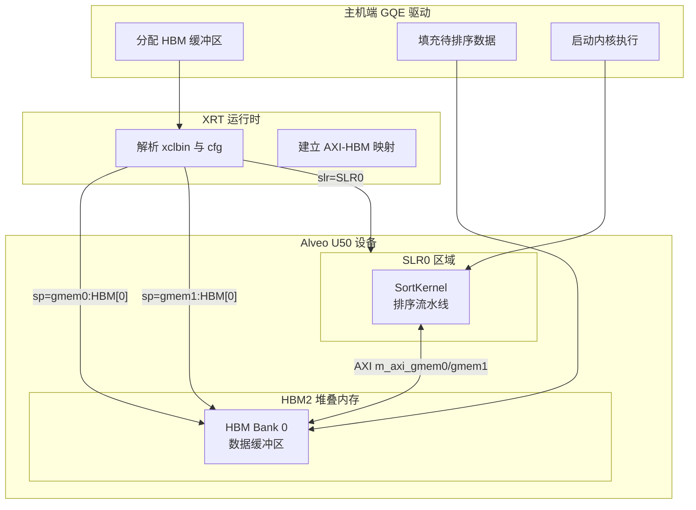

# 深度解析：compound_sort_compact_u50_connectivity —— U50 平台上的 HBM 排序加速核连接配置

## 三十秒快速理解

这个看似简单的 `.cfg` 文件实际上是一个**硬件-软件协同设计的枢纽**——它定义了 FPGA 加速卡（Alveo U50）上的排序内核如何与片外高带宽内存（HBM）物理连接。在数据库查询加速场景中，排序往往是性能瓶颈：当数据量超过片上缓存容量时，内核必须频繁访问外部存储。这个配置文件通过精心规划 AXI 总线到 HBM 物理 Bank 的映射、内核在硅片上的布局位置，以及时钟域的优化参数，确保 300MHz 的排序流水线能够以最高效率持续吞吐数据——它是连接逻辑设计与物理实现的"最后一公里"。

---

## 问题空间：为什么要专门为一个"配置文件"写深度文档？

### 数据库排序的硬件加速困境

在数据库查询执行引擎中，**排序（Sort）** 是最基础也最耗时的操作之一。当面对 TB 级数据时，传统 CPU 排序受限于内存带宽和计算并行度。FPGA 加速的核心价值在于：

1. **大规模数据并行**：单周期内比较数十甚至上百个键值
2. **存储层次优化**：利用片上 BRAM/URAM 缓存中间结果，减少对外部 DRAM 的访问
3. **流水线化执行**：加载、比较、交换、写回形成深度流水线，每个时钟周期输出结果

### U50 平台的特殊挑战

Alveo U50 是一款紧凑型数据中心加速卡，其核心特性包括：

- **HBM2 高带宽内存**：理论带宽高达 460GB/s，远超传统 DDR4
- **紧凑的 SLR 布局**：相比 U200/U250 的多 SLR 结构，U50 的 Super Logic Region（SLR）更加紧凑
- **功耗与散热限制**：作为单槽半高卡，持续高负载下的散热要求更苛刻

**核心问题**：如何将排序内核的内存访问模式映射到 HBM 的物理架构上，以最大化带宽利用率？

### 为什么不是简单的"端口映射"

一个直观的想法是：内核需要内存，HBM 提供内存，把两者连起来就行了。但这种做法会忽视以下关键约束：

1. **HBM Bank 冲突**：HBM 由多个独立 Bank 组成，同时访问同一 Bank 会导致串行化
2. **SLR 边界跨越**：内核布局在 SLR0，但 HBM 控制器可能在不同 SLR，跨 SLR 信号延迟高
3. **AXI 总线宽度与频率**：AXI 数据宽度（如 512bit）与时钟频率共同决定理论带宽
4. **QoS 与仲裁**：多个内核共享 HBM 时需要优先级和带宽分配策略

因此，这个 `.cfg` 文件实际上是在**物理约束空间中进行架构权衡的产物**。

---

## 核心抽象：理解这个模块的"心智模型"

### 类比：机场行李分拣系统

想象一个大型国际机场的行李处理系统：

- **排序内核（SortKernel）** → 高速自动分拣机：每秒能处理数十件行李，决定每件行李该去哪个登机口
- **HBM 内存 Bank** → 行李转盘：有多个并行的转盘，每个转盘独立运转，容量大但单转盘同时只能处理有限流量
- **AXI 总线（m_axi_gmem0/gmem1）** → 传送带：连接分拣机和转盘，宽度和速度决定了理论最大吞吐量
- **SLR 布局** → 航站楼区域划分：分拣机放在哪个区域，决定了到各个转盘的距离和布线复杂度

**核心洞察**：分拣机再快，如果传送带太窄或转盘分配不合理，整体系统就会阻塞。这个配置文件就是在规划"分拣机-传送带-转盘"的最优布局。

### 关键抽象层

| 抽象层 | 概念 | 在本模块中的体现 |
|--------|------|-----------------|
| **应用层** | 数据库排序操作 | 通过 GQE（Generic Query Engine）调用 |
| **内核层** | SortKernel HLS 实现 | `database.L1.benchmarks.compound_sort` 中的 RTL 核 |
| **连接层** | AXI 到 HBM 的物理映射 | `.cfg` 文件中的 `sp=` 和 `slr=` 指令 |
| **物理层** | U50 平台的 HBM 控制器与 SLR 布局 | Vivado 实现时的物理约束 |

### 数据流全景



---

## 组件深度解析

### 配置节：`[connectivity]` —— 硬件连接拓扑

#### 指令：`sp=SortKernel.m_axi_gmem0:HBM[0]`

**技术含义**：
- `sp` = Stream Port（或 Signal/Port），在 Vitis 连接性语法中表示 AXI 主接口到内存资源的映射
- `SortKernel` = 内核实例名（由 `nk=` 指令定义）
- `m_axi_gmem0` = 内核顶层的 AXI4-Full 主接口，通常 512 位宽
- `HBM[0]` = U50 平台 HBM 的第一个 Bank

**设计考量**：

1. **为何选择 Bank 0？**
   - U50 的 HBM 有 16 个 Bank（编号 0-15），Bank 0 通常与 SLR0 物理距离最近
   - 选择最近 Bank 减少信号布线延迟，有助于时序收敛

2. **为何需要两个 AXI 接口（gmem0 和 gmem1）？**
   - 排序算法通常需要**双缓冲**或**输入-输出分离**：一个端口读取输入数据，另一个端口写回排序结果
   - 两个独立 AXI 端口允许并发读写，避免总线争用
   - 映射到同一 HBM Bank 是因为排序通常是"原地"或"双缓冲在同一内存池"，且 Bank 间带宽均衡不如减少跨 Bank 延迟重要

**隐含契约**：
- 调用者必须在 HBM[0] 上分配足够大小的缓冲区
- 主机端代码使用 XRT API（如 `xrt::bo`）创建与 `HBM[0]` 绑定的 buffer object

---

#### 指令：`slr=SortKernel:SLR0`

**技术含义**：
- `slr` = Super Logic Region，Xilinx 大型 FPGA 的顶层物理分区
- `SLR0` = U50 设备的第一个（也是唯一的主要）SLR

**设计考量**：

1. **U50 的 SLR 架构**
   - U50 基于 XCU50 FPGA，相比 U200/U250（多 SLR）结构更紧凑
   - SLR0 包含大部分可编程逻辑和直接连接到 HBM 控制器的硬核

2. **为何固定在 SLR0？**
   - SortKernel 需要高带宽访问 HBM，SLR0 是最靠近 HBM 控制器的位置
   - 跨 SLR 布线会引入显著延迟和时序挑战
   - 单 SLR 布局简化时钟域管理

---

#### 指令：`nk=SortKernel:1:SortKernel`

**技术含义**：
- `nk` = Number of Kernels
- 格式：`nk=<kernel_type>:<count>:<base_name>`
- 这里表示：实例化 1 个 `SortKernel` 类型的内核，实例名为 `SortKernel`

**设计考量**：

1. **单实例 vs 多实例**
   - U50 的紧凑尺寸和散热限制通常支持较少并发内核
   - 单个高吞吐量 SortKernel 比多个竞争 HBM 带宽的实例更有效
   - 单实例简化资源分配和时序收敛

---

### 配置节：`[vivado]` —— 实现时序优化

#### 指令：`param=hd.enableClockTrackSelectionEnhancement=1`

**技术含义**：
- 启用 Vivado 的时钟路径选择增强功能
- `hd` = Hardware Description 层级参数

**设计考量**：

1. **高频率设计的挑战**
   - HLS 综合后的 RTL 通常目标频率为 300MHz 或更高
   - 跨 HBM 接口的时钟域和数据路径是时序关键路径

2. **时钟选择增强的作用**
   - Vivado 在布局布线时会评估多个可能的时钟树拓扑
   - 启用增强模式允许工具更积极地优化时钟偏斜（skew）
   - 对于 HBM 接口这种对时序敏感的高带宽路径尤为重要

---

## 使用指南与最佳实践

### 典型主机端代码模式

```cpp
#include <xrt/xrt.h>
#include <iostream>
#include <vector>

// 对应 cfg 中的配置常量
constexpr size_t HBM_BANK_SIZE = 256ULL * 1024 * 1024; // 256MB per bank
constexpr int TARGET_HBM_BANK = 0;

class U50SortAccelerator {
    xrt::device device_;
    xrt::xclbin xclbin_;
    xrt::kernel sort_kernel_;
    
public:
    explicit U50SortAccelerator(const std::string& xclbin_path) {
        device_ = xrt::device(0);
        xclbin_ = device_.load_xclbin(xclbin_path);
        // cfg 中的 nk=SortKernel:1:SortKernel 定义了内核名
        sort_kernel_ = xrt::kernel(device_, xclbin_, "SortKernel");
    }
    
    void sort_records(void* input_data, size_t num_records, 
                      size_t key_offset, size_t record_size) {
        // 分配 HBM[0] 上的设备内存（对应 cfg 中的 sp=...HBM[0]）
        size_t buffer_size = num_records * record_size;
        
        // group_id(0) 对应 m_axi_gmem0，用于输入
        xrt::bo in_bo(device_, buffer_size, xrt::bo::flags::device_only, 
                      sort_kernel_.group_id(0));
        // group_id(1) 对应 m_axi_gmem1，用于输出
        xrt::bo out_bo(device_, buffer_size, xrt::bo::flags::device_only,
                       sort_kernel_.group_id(1));
        
        // 写入输入数据
        in_bo.write(input_data);
        in_bo.sync(xrt::bo::direction::to_device);
        
        // 启动内核执行
        // 参数顺序需与 SortKernel 的接口定义一致
        auto run = sort_kernel_(in_bo, out_bo, 
                                static_cast<uint32_t>(num_records),
                                static_cast<uint32_t>(key_offset));
        run.wait();
        
        // 读回结果
        out_bo.sync(xrt::bo::direction::from_device);
        // out_bo.read(...) 到主机缓冲区
    }
};
```

---

## 边缘情况与陷阱

### 1. HBM Bank 地址越界

**问题**：主机端分配的缓冲区如果跨越 HBM Bank 边界，会导致访问错误。

**解决**：确保分配的缓冲区完全位于单一 Bank 内：

```cpp
// 正确：确保 buffer_offset + buffer_size <= HBM_BANK_SIZE
assert(buffer_offset + buffer_size <= HBM_BANK_SIZE);
xrt::bo buffer(device_, buffer_size, buffer_offset, kernel.group_id(0));
```

### 2. 内核与缓冲区 Bank 不匹配

**问题**：如果主机端分配的缓冲区在 HBM[1]，但内核配置连接 HBM[0]，会导致 XRT 错误。

**解决**：使用 XRT 的扩展标志显式指定目标 Bank：

```cpp
// 创建与 HBM[0] 绑定的缓冲区（对应 cfg 中的 sp=...HBM[0]）
xrt::bo buffer(device_, size, xrt::bo::flags::device_only, 
               kernel.group_id(0), /*bank=*/0);
```

### 3. SLR 资源超配

**问题**：如果 SortKernel 规模过大，加上其他并发内核，可能超出 SLR0 的资源容量。

**解决**：
- 使用 Vivado 报告检查 SLR0 的资源利用率（LUT、FF、BRAM、DSP）
- 考虑将非关键内核移到其他 SLR（如果可用）
- 优化 SortKernel HLS 代码以减少资源占用

### 4. 时钟时序违规

**问题**：即使启用了 `enableClockTrackSelectionEnhancement`，高频设计仍可能出现时序违规。

**解决**：
- 检查 Vivado 时序报告，确定关键路径
- 考虑降低目标频率（如从 300MHz 降至 280MHz）
- 优化 HLS 代码以减少关键路径上的逻辑级数
- 增加流水线级数以提高最大频率

---

## 总结：新贡献者需要记住的关键点

1. **这个文件是物理与逻辑的桥梁**：它不只是"配置"，而是定义了算法逻辑（排序）如何在物理硅片（U50 FPGA）上运行的关键契约。

2. **每一个配置项都有物理含义**：
   - `sp=...HBM[0]` → 决定数据走哪条物理通路，延迟多少
   - `slr=SLR0` → 决定在芯片的哪个区域放置逻辑，影响时序收敛
   - `enableClockTrackSelectionEnhancement` → 决定时钟质量，影响能否稳定运行

3. **与相邻模块的关系**：
   - **上游**：GQE 查询引擎调用 Sort 操作 → 驱动程序加载 xclbin
   - **下游**：XRT 运行时解析此配置 → Vivado 实现物理布局
   - **平行**：[database-l1-compound-sort-datacenter-u200-u250-connectivity](database-l1-compound-sort-datacenter-u200-u250-connectivity.md) 和 [database-l1-compound-sort-high-bandwidth-u280-connectivity](database-l1-compound-sort-high-bandwidth-u280-connectivity.md) 是其他平台的等价配置

4. **修改前必查**：
   - 确保 HBM Bank 与 SLR 的物理距离匹配
   - 确保 AXI 端口宽度与 HBM 控制器兼容
   - 确保时钟增强参数与 Vivado 版本匹配
   - 在修改前与平台团队确认物理约束
