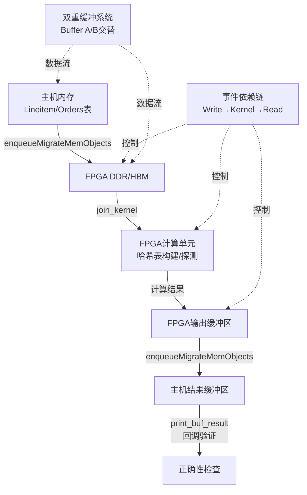

# l1_hash_join_and_aggregation_benchmark_hosts 模块技术深度解析

## 概述：这个模块解决什么问题？

想象你正在运行一个数据仓库查询：`SELECT SUM(l_extendedprice) FROM lineitem JOIN orders ON l_orderkey = o_orderkey`。在CPU上，这需要遍历数百万行数据，构建哈希表，然后探测匹配。当数据量达到TB级别时，这种操作会成为整个分析管道的瓶颈。

**l1_hash_join_and_aggregation_benchmark_hosts** 是一套针对Xilinx FPGA的基准测试主机端实现，用于验证和测量硬件加速的哈希连接（Hash Join）和分组聚合（Group Aggregation）操作的性能。它不是生产级的查询执行引擎，而是一个**验证和性能表征平台**——用于确认FPGA内核实现是否正确，并测量其在各种数据规模和访问模式下的吞吐量。

核心挑战在于：哈希连接是内存密集型的随机访问模式，对FPGA的HBM/DDR带宽和延迟极度敏感。主机端代码必须精心编排数据传输、内核启动和结果回传，以隐藏延迟并最大化吞吐量。

## 心智模型：如何理解这个模块的抽象？

把这套基准测试想象成一个**高度自动化的工厂流水线**，其中有几个关键角色：

1. **双重缓冲系统（Double Buffering）**：想象两条并行的传送带——A带和B带。当A带上的数据正在加工（FPGA计算）时，B带正在装载下一批原料（主机上传数据）。完成后角色互换。这消除了装卸货的死时间。

2. **事件链（Event Chaining）**：现代FPGA通过PCIe与主机通信，每次数据传输和内核执行都是异步的。代码使用OpenCL事件（`cl::Event`）建立依赖图："只有当上传完成（Write Event）后，才能启动内核（Kernel Event）"。这就像工厂的生产指令单，明确标注了前后工序的依赖关系。

3. **Ping-Pong缓冲区（HBM/DDR上的数据驻留）**：FPGA上的高带宽存储器（HBM）被划分为多个分区（PU_NM个处理单元）。数据被分片散列到这些分区中以实现并行处理。主机代码负责分配这些设备端缓冲区，但不需要在每次迭代中来回搬运——数据一旦上传，就在多次内核调用中复用，直到被新数据覆盖。

## 架构与数据流



### 关键执行阶段

1. **初始化阶段**：
   - 解析命令行参数（`ArgParser`）：`-xclbin`指定FPGA比特流，`-rep`设置重复次数，`-scale`调整数据规模
   - 分配主机端页对齐内存（`aligned_alloc`）用于输入表（Lineitem/Orders）和结果缓冲区
   - 生成合成测试数据（`generate_data`），模拟TPC-H数据分布

2. **设备初始化**：
   - 通过Xilinx XRT（`xcl2.hpp`）加载`.xclbin`比特流，创建OpenCL上下文、命令队列和内核对象
   - 分配设备端缓冲区（`cl::Buffer`），配置内存拓扑（HBM/DDR Bank选择）
   - 使用`cl_mem_ext_ptr_t`扩展指针机制，将主机缓冲区与设备端内存扩展关联

3. **执行流水线（核心循环）**：
   - 对于每次重复迭代（`num_rep`）：
     - **双重缓冲选择**：根据迭代序号奇偶性选择Buffer A或B（`use_a = i & 1`）
     - **数据迁移**：`enqueueMigrateMemObjects`将输入表从主机内存异步传输到FPGA DDR/HBM
     - **事件链建立**：当前写操作依赖前两次迭代的读操作完成（`&read_events[i - 2]`），实现流水线重叠
     - **内核启动**：`enqueueTask`提交哈希连接内核执行，依赖写事件完成
     - **结果回传**：`enqueueMigrateMemObjects`将计算结果从设备传回主机，依赖内核事件完成
     - **回调注册**：`setCallback`在数据传输完成事件上注册验证回调函数`print_buf_result`，异步执行结果正确性检查

4. **同步与结果汇总**：
   - `q.flush()`和`q.finish()`确保所有队列中的命令完成执行
   - 收集OpenCL性能分析数据（`getProfilingInfo`），输出每次内核执行的精确时间（微秒级）
   - 汇总多次重复执行的统计信息，计算平均吞吐量

## 核心组件深度解析

### `print_buf_result_data_` 结构体族

在多个测试文件中（`hash_anti_join`、`hash_join_v2`、`hash_semi_join`等）定义了相同的结构体模式：

```cpp
typedef struct print_buf_result_data_ {
    int i;              // 迭代序号
    long long* v;       // FPGA结果值指针
    long long* g;       // 黄金参考值指针
    int* r;             // 错误计数器指针
} print_buf_result_data_t;
```

**设计意图**：
- 这是一个**异步回调上下文容器**。OpenCL的事件回调机制要求传递`void*`用户数据，这个结构体打包了验证所需的所有上下文信息。
- 采用**指针而非值拷贝**，确保回调执行时看到的是最新的计算结果和参考值，同时避免了大结构的拷贝开销。
- `i`字段用于标识当前是哪个迭代的结果，在多轮重复测试中至关重要。

**生命周期管理**：
- 结构体实例存储在`std::vector<print_buf_result_data_t> cbd(num_rep)`中，向量化分配确保内存连续性。
- 通过`cbd_ptr = &(*it)`获取指向vector内部数据的裸指针，传递给OpenCL回调。
- **关键风险**：回调函数`print_buf_result`在CL事件完成时异步执行，可能在主机代码的`q.finish()`之后才被调用。必须确保vector`cbd`在回调执行期间仍然存活（即在`q.finish()`之后才离开作用域）。代码中`cbd`在main函数的尾部离开作用域，符合要求。

### `timeval` 结构体与计时机制

```cpp
struct timeval tv0;
gettimeofday(&tv0, 0);
// ... 执行阶段 ...
struct timeval tv3;
gettimeofday(&tv3, 0);
exec_us = tvdiff(&tv0, &tv3);
```

**设计意图**：
- `gettimeofday`提供**微秒级的主机端挂钟时间**，用于测量端到端的用户感知延迟（包括PCIe数据传输、内核执行、结果回传）。
- 与OpenCL的`CL_PROFILING_COMMAND_START/END`不同，后者测量的是**设备端纯内核执行时间**（不包括数据传输）。两者结合可以分析数据搬运开销占比。

**精度与限制**：
- `gettimeofday`受系统调度影响，在负载重的系统上可能不准确。代码通过多次重复（`num_rep`）取平均来缓解抖动。
- `tvdiff`函数（在`utils.hpp`中定义，未显示）计算两个timeval的差值，返回微秒数。

### 数据生成函数 `generate_data`

```cpp
template <typename T>
int generate_data(T* data, int range, size_t n) {
    if (!data) return -1;
    for (size_t i = 0; i < n; i++) {
        data[i] = (T)(rand() % range + 1);
    }
    return 0;
}
```

**设计意图**：
- 这是一个**合成数据生成器**，用于在没有真实TPC-H数据文件的情况下快速生成分布可控的测试数据。
- `rand() % range + 1`生成**均匀分布**的伪随机整数，范围在`[1, range]`。`+1`确保不会出现0值（这在某些TPC-H语义中可能表示NULL或特殊值）。
- 模板化设计允许生成不同位宽的数据类型（`uint32_t`, `uint64_t`, `ap_uint<256>`等）。

**局限性与风险**：
- `rand()`是**全局状态函数**，非线程安全。虽然这些基准测试通常是单线程的，但在并行化数据生成时需要注意。
- 伪随机序列的可重复性依赖于`srand()`的调用（代码中未显示，可能在`main`的初始化阶段）。
- 均匀分布可能无法完全模拟真实TPC-H数据的倾斜分布（Zipfian分布），这可能掩盖FPGA在处理数据倾斜时的性能瓶颈。

## 依赖关系与调用链

### 模块层级与依赖图

```
database_query_and_gqe
├── l1_compound_sort_kernels
├── l1_hash_join_and_aggregation_benchmark_hosts  <-- 当前模块
│   ├── hash_join_single_variant_benchmark_hosts
│   │   ├── hash_join_v2_host
│   │   ├── hash_join_v3_sc_host
│   │   └── hash_join_v4_sc_host
│   ├── hash_join_membership_variants_benchmark_hosts
│   │   ├── hash_semi_join
│   │   └── hash_anti_join
│   ├── hash_multi_join_benchmark_host_support
│   └── hash_group_aggregate_benchmark_host_support
├── l1_l2_query_and_sort_demos
└── ...
```

### 核心依赖项

**Xilinx 运行时库（XRT）**：
- `xcl2.hpp` - Xilinx OpenCL扩展工具库，提供`xcl::get_xil_devices()`、`xcl::import_binary_file()`等便捷函数
- `CL/cl2.hpp` - Khronos OpenCL C++绑定（代码中使用`cl::Device`, `cl::Context`, `cl::CommandQueue`, `cl::Buffer`, `cl::Kernel`等）
- `CL/cl_ext_xilinx.h` - Xilinx特定的OpenCL扩展，支持`cl_mem_ext_ptr_t`用于HBM/DDR内存拓扑指定

**Xilinx 实用工具库**：
- `xf_utils_sw/logger.hpp` - 提供`Logger`类用于标准化的信息/错误/警告输出
- `xf_database/enums.hpp` - 定义数据库操作枚举，如`AOP_SUM`, `AOP_MAX`, `AOP_MIN`, `AOP_COUNT`等聚合操作码

**本地头文件（未在代码片段中显示）**：
- `table_dt.hpp` - 定义TPC-H数据类型（`KEY_T`, `MONEY_T`, `DATE_T`, `TPCH_INT`等）和常量（`L_MAX_ROW`, `O_MAX_ROW`, `VEC_LEN`, `PU_HT_DEPTH`, `BUFF_DEPTH`等）
- `join_kernel.hpp` / `hash_aggr_kernel.hpp` / `hashjoinkernel.hpp` - 声明FPGA内核函数原型（`join_kernel`, `hash_aggr_kernel`等）
- `utils.hpp` - 提供实用函数如`tvdiff`（时间差计算）、`aligned_alloc`（页对齐内存分配）、`ArgParser`（命令行参数解析）

### 被谁调用（调用者）

这是一个**叶节点模块**（leaf module），没有上游模块直接调用它。相反，它是：
- 由**开发者/测试工程师**直接编译和执行的手动基准测试程序
- 由**CI/CD系统**调用，作为回归测试套件的一部分，验证新的FPGA比特流构建
- 由**性能工程师**调用，表征不同FPGA平台（U50/U200/U280）上的性能特征

### 调用谁（被调用者）

- **FPGA内核**（`join_kernel`, `hash_aggr_kernel`等） - 通过OpenCL `cl::Kernel`和`enqueueTask`异步调用
- **Xilinx XRT运行时** - 用于设备管理、比特流加载、内存分配
- **OpenCL运行时** - 用于命令队列管理、事件同步、性能分析
- **标准C库** - `sys/time.h`（`gettimeofday`）, `cstdlib`（`rand`, `aligned_alloc`）, `iostream`（日志输出）

## 设计决策与权衡

### 1. 双重缓冲（Double Buffering）vs. 单缓冲

**选择**：使用A/B两套输入/输出缓冲区，通过`use_a = i & 1`交替使用。

**权衡分析**：
- **优势**：允许数据传输（PCIe）与计算（FPGA内核执行）重叠。当FPGA处理Buffer A时，主机可以并行准备Buffer B的下一次数据，隐藏传输延迟。
- **代价**：内存占用翻倍。对于大表（如TPC-H的Lineitem表），这可能意味着几百MB甚至GB级的主机内存和FPGA HBM内存占用。
- **替代方案**：单缓冲+阻塞同步更简单，但吞吐量受限于PCIe传输时间（FPGA计算单元空闲等待）。

**设计理由**：对于网络绑定型（network-bound）或PCIe带宽受限的场景，计算重叠至关重要。额外内存占用是合理的性能投资。

### 2. 事件链流水线（Event Chaining）vs. 批量同步

**选择**：使用`std::vector<std::vector<cl::Event>>`建立三维事件数组（write/kernel/read），并显式设置依赖（`&write_events[i]`, `&kernel_events[i]`）。

**权衡分析**：
- **优势**：
  - 细粒度控制允许跨多次迭代的流水线重叠（例如，迭代i的读取可以与迭代i+1的内核执行和迭代i+2的写入并行）。
  - 依赖图清晰表达，易于调试和可视化（代码中的ASCII艺术注释展示了流水线结构）。
- **代价**：
  - 复杂性高。需要管理事件生命周期（避免提前释放）、处理OpenCL错误码、确保事件数组大小正确。
  - 调试困难。异步执行中的时序问题（race conditions）难以复现和诊断。
- **替代方案**：批量同步（每次迭代完全阻塞等待完成）更简单但吞吐量低。

**设计理由**：这是高性能异构计算的标准模式。复杂性是获得接近硬件极限吞吐量的必要代价。

### 3. 回调验证（Callback-Based Verification）vs. 同步轮询

**选择**：使用`read_events[i][0].setCallback(CL_COMPLETE, print_buf_result, cbd_ptr + i)`注册异步回调，在数据传输完成事件触发时自动执行结果验证。

**权衡分析**：
- **优势**：
  - 主机线程可以在等待FPGA执行的同时执行其他工作（虽然在这个简单基准测试中主机主要是空闲等待，但在更复杂的场景中很重要）。
  - 验证逻辑与执行控制流解耦，代码结构更清晰。
- **代价**：
  - 回调函数必须是线程安全的（OpenCL回调可能在工作线程中执行），限制了可以安全访问的全局状态。
  - 错误处理复杂。回调中的错误需要通过指针参数传回，不能像同步代码那样简单地抛出异常或返回错误码。
- **替代方案**：同步轮询（`clWaitForEvents`后手动验证）更简单直接，但阻塞主机线程。

**设计理由**：这展示了现代异构编程的异步最佳实践。虽然对于简单基准测试可能显得过度设计，但它为构建更复杂的流水线验证奠定了基础。

### 4. HLS_TEST 条件编译 vs. 运行时选择

**选择**：使用`#ifdef HLS_TEST`和`#ifndef HLS_TEST`条件编译，在同一套源代码中支持两种完全不同的执行路径：纯C++仿真（HLS C-Simulation）和真实FPGA执行（OpenCL/XRT）。

**权衡分析**：
- **优势**：
  - **代码复用**：相同的测试逻辑、数据生成、结果验证代码可以在仿真和硬件上共用，减少维护两份代码的成本。
  - **开发效率**：开发者可以先在快速仿真环境中调试算法逻辑，再部署到慢速的FPGA硬件上，缩短迭代周期。
- **代价**：
  - **代码可读性**：大量`#ifdef`分支使代码难以阅读，条件编译块内的缩进和逻辑流不直观。
  - **测试覆盖率风险**：仿真路径和硬件路径的分支逻辑可能不完全一致（例如`HLS_TEST`中直接调用`join_kernel`函数，而硬件路径使用`cl::Kernel`），导致仿真通过的代码在硬件上失败。
- **替代方案**：
  - 完全分离的仿真代码库和硬件代码库：维护成本高但逻辑清晰。
  - 运行时动态选择（通过函数指针或虚函数）：避免条件编译，但C++ HLS工具链可能不支持复杂的运行时多态。

**设计理由**：这是HLS（高层次综合）工作流的行业惯例。虽然牺牲了一定的代码美观性，但获得了开发和验证效率的显著提升，在FPGA开发领域是可接受的权衡。

## 使用指南与注意事项

### 编译与运行

```bash
# 1. 设置Xilinx环境
source /opt/xilinx/xrt/setup.sh

# 2. 编译（典型命令，实际Makefile可能不同）
g++ -std=c++11 -I$XILINX_XRT/include -I/path/to/xf_database \
    -L$XILINX_XRT/lib -lOpenCL -lpthread -o test_join test_join.cpp \
    /path/to/xf_database/L1/benchmarks/common/xcl2.cpp

# 3. 运行（FPGA模式，需要已烧录的xclbin）
./test_join -xclbin /path/to/join_kernel.xclbin -rep 10 -scale 1

# 4. 运行HLS仿真模式（需要在Vivado HLS环境中编译，定义HLS_TEST宏）
./test_join_hls  # 纯软件仿真，不需要FPGA硬件
```

### 关键命令行参数

| 参数 | 说明 | 示例 |
|------|------|------|
| `-xclbin <path>` | **必需**。指定FPGA比特流文件路径 | `-xclbin ./build/join.xclbin` |
| `-rep <n>` | 重复执行次数（1-20）。用于性能统计和稳定性测试 | `-rep 10` |
| `-scale <n>` | 数据规模缩放因子。将TPC-H表行数除以n | `-scale 10`（使用1/10数据量）|
| `-mode <cpu/fpga>` | 执行模式（当前仅支持fpga） | `-mode fpga` |

### 扩展与定制

#### 添加新的聚合操作测试

在`hash_group_aggregate`的`test_aggr.cpp`中，修改以下部分：

```cpp
// 1. 选择聚合操作类型
ap_uint<4> op = xf::database::enums::AOP_SUM;  // 改为 AOP_MAX, AOP_MIN 等

// 2. 在group_*函数调用链中添加对应的分支
if (op == xf::database::enums::AOP_SUM)
    result_cnt = group_sum(col_l_orderkey, col_l_extendedprice, l_nrow, map0);
else if (op == xf::database::enums::AOP_YOUR_NEW_OP)
    result_cnt = group_your_new_op(...);
```

#### 修改数据分布

`generate_data`函数使用均匀分布。要模拟真实世界的倾斜数据（Zipfian分布），替换为：

```cpp
#include <random>

// 使用Zipf分布替代rand()
std::mt19937 gen(42);  // 固定种子保证可重复
std::zipf_distribution<> zipf(range, 1.5);  // 范围+倾斜参数

for (size_t i = 0; i < n; i++) {
    data[i] = (T)zipf(gen);
}
```

### 常见陷阱与调试技巧

#### 1. PCIe带宽瓶颈误判

**现象**：FPGA执行时间随数据量线性增长，但内核分析显示计算单元利用率低。

**诊断**：对比`exec_us`（端到端时间）与OpenCL内核时间。如果前者远大于后者，瓶颈在PCIe传输。

**解决**：启用更大的`num_rep`以摊平首次传输的固定开销；确认使用`CL_MEM_EXT_PTR_XILINX`和`USE_HOST_PTR`减少拷贝。

#### 2. 事件依赖死锁

**现象**：程序挂起在`q.finish()`，不报错也不退出。

**诊断**：检查事件链依赖是否正确建立。常见错误：
- 引用已释放的`cl::Event`对象（vector重新分配后指针失效）
- 循环依赖（事件A依赖B，B依赖C，C又依赖A）

**解决**：使用`std::vector<std::vector<cl::Event>>`确保事件对象生命周期覆盖整个执行过程。添加超时机制和调试日志打印事件状态。

#### 3. HLS_TEST与硬件行为不一致

**现象**：HLS仿真通过，但FPGA运行结果错误或内核崩溃。

**诊断**：检查条件编译分支差异：
- `HLS_TEST`路径使用裸指针直接调用内核函数
- 硬件路径使用`cl::Buffer`和`enqueueTask`

**解决**：确保两种路径下的数据类型、对齐方式、内存布局完全一致。特别注意`ap_uint<256>`等HLS专用类型在主机端的内存布局（通常需要16字节对齐）。

#### 4. 内存对齐错误

**现象**：`enqueueMigrateMemObjects`返回CL_INVALID_VALUE或程序崩溃。

**诊断**：检查`aligned_alloc`的使用。FPGA XRT通常要求主机内存页对齐（4KB或64KB）。

**解决**：确保使用`aligned_alloc(4096, size)`而非裸`malloc`。检查`table_dt.hpp`中定义的`KEY_T`, `MONEY_T`等类型的大小是否与FPGA内核期望的位宽匹配（如`ap_uint<64>`对应8字节）。

## 总结

`l1_hash_join_and_aggregation_benchmark_hosts`是一套精心设计的FPGA基准测试框架，它不仅仅是简单的"Hello World"示例，而是体现了异构计算领域的工程最佳实践：

- **流水线化**：通过双重缓冲和事件链实现计算与通信重叠
- **可移植性**：单一源码通过条件编译支持HLS仿真和硬件执行
- **可观测性**：细粒度的计时机制区分主机端、设备端、端到端性能
- **可扩展性**：模块化结构允许快速添加新的连接变体或聚合操作

对于新加入团队的开发者，理解这个模块的关键在于把握**异步流水线**的心智模型：不要把FPGA看作一个即时返回的计算函数，而要把它看作一条需要精心编排生产指令的工厂流水线。所有的复杂性——双重缓冲、事件依赖、回调验证——都源于对这个异步特性的适应。
