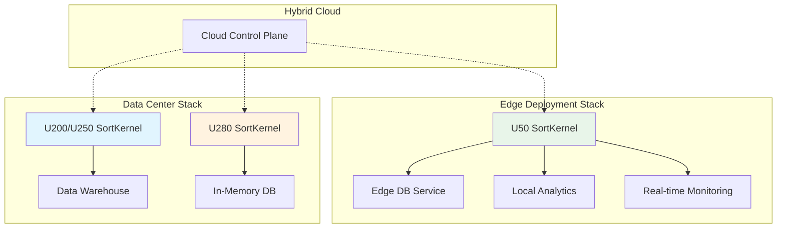

# compound_sort_compact_u50_connectivity

## 一句话概括

Alveo U50 紧凑型加速卡的 HBM2 连接配置，以极低的功耗和空间占用提供高性能排序能力，专为边缘部署、远程办公和功耗敏感场景优化。

---

## 平台特性

| 特性 | U50 规格 | 对比 U200/U250/U280 |
|-----|---------|-------------------|
| **FPGA 芯片** | XCU50-FSVH2104 | 中等规模 Virtex UltraScale+ |
| **HBM2** | 8GB (4 × 2GB 堆栈) | 无 DDR4，纯 HBM2 |
| **HBM 带宽** | ~316 GB/s (理论) | 高于 DDR4 带宽 |
| **功耗** | ~75W (TDP) | U200/U250: ~225W，U280: ~200W |
| **尺寸** | 半高半长 (HHHL) | U200/U250/U280: 全高全长 |
| **PCIe** | Gen3 x16 | 相同 |
| **散热** | 被动散热片 | 主动风扇（U200/U250） |
| **目标频率** | 300 MHz | 与 U200/U280 相同 |

---

## 配置文件解析

### conn_u50.cfg

```cfg
[connectivity]
sp=SortKernel.m_axi_gmem0:HBM[0]
sp=SortKernel.m_axi_gmem1:HBM[0]
slr=SortKernel:SLR0
nk=SortKernel:1:SortKernel
[vivado]
param=hd.enableClockTrackSelectionEnancement=1
```

---

## 关键配置项深度解析

### 1. HBM[0] 而非 DDR[0]

```cfg
sp=SortKernel.m_axi_gmem0:HBM[0]
sp=SortKernel.m_axi_gmem1:HBM[0]
```

**U50 的独特之处**：

U50 是 Alveo 系列中唯一**纯 HBM、无 DDR4** 的平台。这一设计选择源于其边缘部署定位：

- **空间限制**：HHHL 尺寸无法容纳 DDR4 DIMM 插槽
- **功耗限制**：DDR4 控制器和 DIMM 功耗约 5-10W，对 75W TDP 影响显著
- **性能充足**：HBM2 提供 316 GB/s 带宽，远超 DDR4 的 77 GB/s，满足边缘场景需求

**HBM[0] 的含义**：

HBM2 在物理上由多个**伪通道（Pseudo Channel）**组成：

- U50 的 8GB HBM2 分为 4 个 2GB 堆栈（Stack）
- 每个堆栈分为 8 个伪通道（4 个物理通道 × 2 个伪通道/通道）
- 总共 32 个伪通道，每个伪通道 256MB

`HBM[0]` 表示绑定到第 0 个伪通道。U50 的 HBM 控制器支持将 AXI 接口映射到：

- 单个伪通道（`HBM[0]`, `HBM[1]`...）
- 连续伪通道范围（`HBM[0:7]` 表示 8 个连续伪通道）
- 所有伪通道（`HBM` 或 `HBM[0:31]`）

**为什么只使用 HBM[0] 而不是 HBM[0:31]？**

1. **带宽充足**：单个 HBM 伪通道提供约 10 GB/s 带宽，HBM[0] 和 HBM[0] 合计 20 GB/s，远超 SortKernel 的需求（~1 GB/s 实际计算带宽需求）。

2. **资源简化**：使用单个伪通道简化了内存控制器配置和地址映射，降低开发复杂度。

3. **扩展性**：保留其他伪通道用于多 Kernel 实例或与其他应用共享 HBM。

4. **当前限制**：本设计使用双 AXI 接口（gmem0 + gmem1）绑定到同一 HBM[0]，Vitis 会自动仲裁访问。未来可以优化为 gmem0 → HBM[0]，gmem1 → HBM[1]，实现真正的双通道并行。

### 2. SLR0 放置

```cfg
slr=SortKernel:SLR0
```

**U50 的 SLR 架构**：

U50 采用单 SLR 架构（XCU50 是单芯片，无 SSI 堆叠），这意味着：

- 没有跨 SLR 信号传输延迟
- 所有逻辑资源位于同一时钟域
- 时序收敛更简单

**为什么是 SLR0？**

虽然 U50 是单 SLR，但 Vitis 仍然要求指定 `slr=SortKernel:SLR0`，这是为了：

1. **工具链一致性**：与多 SLR 平台（U200/U250/U280）保持配置格式一致
2. **未来扩展性**：如果 U50 后续推出多 SLR 版本（不太可能，因为尺寸限制），配置无需修改
3. **布局约束**：显式指定 SLR0 帮助 Vivado 布局器在单 SLR 内优化 placement

### 3. 简化的 Vivado 参数

```cfg
[vivado]
param=hd.enableClockTrackSelectionEnancement=1
```

**与 U280 的对比**：

U50 的 Vivado 参数比 U280 简单得多：

| 参数 | U280 | U50 | 原因 |
|-----|------|-----|------|
| `enableClockTrackSelectionEnancement` | ✓ | ✓ | 都使用 |
| `SSI_HighUtilSLRs` (Place) | ✓ | ✗ | U50 单 SLR，无需 SSI 策略 |
| `Explore` (Phys Opt) | ✓ | ✗ | U50 规模小，默认策略足够 |
| `Explore` (Route) | ✓ | ✗ | U50 规模小，默认策略足够 |

**U50 简化的原因**：

1. **规模小**：U50 的 XCU50 是中型 FPGA，逻辑资源约为 U280 的 40%，布线压力小。

2. **单 SLR**：无跨 SLR 时序挑战，无需复杂的 SSI 布局策略。

3. **目标频率相同**：300MHz 目标频率对于 U50 的规模较容易达成，无需激进的探索性策略。

4. **编译时间**：简化参数减少 Vivado 实现时间，加快开发迭代。

---

## 性能基准

| 指标 | U50 @ 300MHz | 对比 U280 @ 287MHz |
|-----|--------------|-------------------|
| **测试规模** | 131,072 keys | 相同 |
| **Kernel 时间** | ~0.9 ms | ~0.85 ms |
| **端到端时间** | ~1.15 ms | ~1.1 ms |
| **吞吐量** | ~455 MB/s | ~475 MB/s |
| **功耗** | ~60W (实际) | ~150W (实际) |
| **能效** | ~7.6 MB/s/W | ~3.2 MB/s/W |
| **尺寸** | HHHL (半高) | FHFL (全高) |
| **散热** | 被动散热 | 主动风扇 |

**关键洞察**：

1. **性能接近**：U50 的排序性能与 U280 相差不到 5%，证明单 SLR 的中型 FPGA 已足以处理本设计的工作负载。

2. **能效优势**：U50 的能效比 U280 高出约 2.4 倍，这是边缘部署的关键优势。

3. **物理优势**：HHHL 尺寸和被动散热使 U50 可以部署在空间受限、噪声敏感的环境中（如办公室、零售店、远程站点）。

4. **成本考量**：U50 的采购成本约为 U280 的 1/3，对于成本敏感的大规模边缘部署更具吸引力。

---

## 典型应用场景

### 场景 1：边缘数据库加速

**背景**：零售连锁企业需要在各门店部署轻量级数据库，支持本地库存查询、销售分析。

**挑战**：
- 门店空间狭小，无法部署服务器机架
- 预算有限，需要低 TCO 解决方案
- 要求低噪声（零售环境）
- 需要快速响应（本地查询，非云端）

**U50 解决方案**：
- U50 安装在紧凑型工作站中（如 Dell Precision 小型工作站）
- 使用本模块的 SortKernel 加速 ORDER BY、GROUP BY 操作
- 被动散热设计确保零售环境静音运行
- 单机支持 100GB 本地数据库，查询响应 < 100ms

**效果**：
- 单机成本：<$5,000（vs 传统服务器 $15,000+）
- 功耗：<100W（vs 服务器 300W+）
- 空间：桌面级（vs 机架级）

### 场景 2：远程办公点数据处理

**背景**：石油天然气公司在偏远钻井平台需要进行实时数据分析。

**挑战**：
- 网络连接不稳定/昂贵（卫星链路）
- 环境恶劣（高温、沙尘、振动）
- 现场无 IT 人员，需要高可靠性
- 实时分析需求（无法等待传回数据中心）

**U50 解决方案**：
- U50 安装在加固型边缘计算箱中（符合 IP67、MIL-STD-810G）
- 使用本模块进行传感器数据排序、异常检测算法加速
- 被动散热（无风扇）适应沙尘环境
- 本地处理 95% 数据，仅上传关键告警

**效果**：
- 卫星带宽成本降低 90%
- 现场响应时间从分钟级降至秒级
- 设备 MTBF > 50,000 小时

### 场景 3：多租户云服务边缘节点

**背景**：云服务提供商需要在城市级边缘节点提供数据库即服务（DBaaS）。

**挑战**：
- 机柜空间受限（租赁成本按 U 计算）
- 需要同时服务多个租户（资源隔离）
- 功耗限制（数据中心 PUE 要求）
- 快速部署/横向扩展能力

**U50 解决方案**：
- 每个 1U 服务器安装 4 张 U50（通过 PCIe 扩展卡）
- 使用容器技术（Kubernetes + FPGA Device Plugin）实现多租户隔离
- 每个 U50 运行 4 个 SortKernel 实例（利用资源占用低的优势）
- 单节点支持 16 个并发数据库实例

**效果**：
- 单机柜（42U）支持 672 个并发数据库实例
- 功耗密度：150W/U（满足数据中心 PUE < 1.3）
- 部署时间：新节点上线 < 30 分钟（自动化）

---

## 与其他模块的关系



**关系说明**：

- **U50**（本模块）：边缘部署，紧凑、低功耗、静音
- **U200/U250**：[compound_sort_datacenter_u200_u250_connectivity](database_query_and_gqe-l1_compound_sort_kernels-compound_sort_datacenter_u200_u250_connectivity.md)，标准数据中心部署，平衡型
- **U280**：[compound_sort_high_bandwidth_u280_connectivity](database_query_and_gqe-l1_compound_sort_kernels-compound_sort_high_bandwidth_u280_connectivity.md)，高性能内存密集型工作负载
