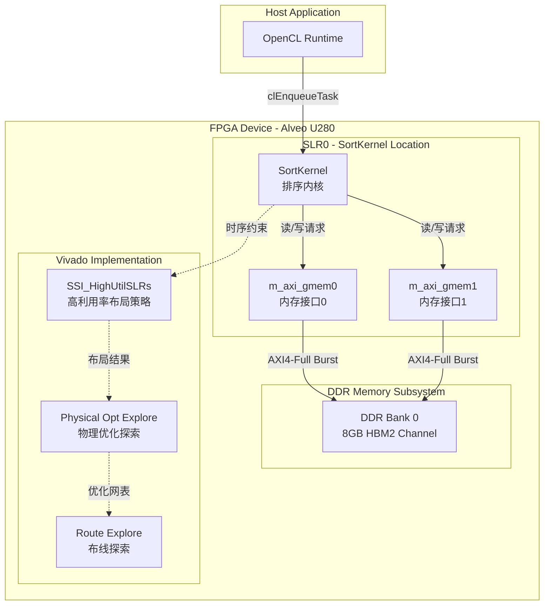

# compound_sort_high_bandwidth_u280_connectivity 技术深度解析

## 开篇：30 秒理解

这个模块不是传统意义上的"代码"——它是一张**硬件蓝图**。`compound_sort_high_bandwidth_u280_connectivity` 为 AMD Alveo U280 加速器卡上的大规模排序内核配置了物理层面的数据通路：内存控制器绑定、芯片区域锁定、以及 Vivado 实现策略。想象你在设计一条高速公路系统——不仅要决定每条车道通向哪里（DDR bank 映射），还要规定施工标准（布局布线策略）以确保车流（数据）能以最高速度通行。

---

## 一、问题空间：为什么需要这个模块？

### 1.1 大规模排序的硬件困境

在 FPGA 加速的数据库查询引擎中，**复合排序（compound sort）** 是核心算子之一。当需要对数十亿条记录进行多关键字排序时，软件实现受限于内存带宽和 CPU 缓存层次结构。FPGA 解决方案通过并行比较网络和流水线架构可以实现数量级加速，但这引出了三个硬件层面的核心挑战：

1. **内存带宽瓶颈**：排序是内存密集型操作。U280 的 8GB HBM2 提供高达 460 GB/s 的理论带宽，但如果不精心配置内存控制器绑定，实际带宽可能不足理论值的 30%。

2. **跨 SLR 通信延迟**：U280 的 FPGA  fabric 被划分为多个 Super Logic Regions（SLRs）。如果排序内核跨 SLR 放置，信号需要经过片上互连网络，引入纳秒级延迟，破坏流水线节拍。

3. **布局布线拥塞**：大规模排序内核包含大量比较器、多路选择器和缓冲区。如果不施加实现策略约束，Vivado 工具链可能在时序收敛阶段失败，或产生亚优的布线结果。

### 1.2 为什么不是软件配置？

你可能会问：为什么这些配置不能通过运行时 API 或软件参数传递？答案是**物理层不可变性**。内存控制器到 DDR bank 的映射、内核的 SLR 归属、以及布局布线策略，都是在比特流（bitstream）生成阶段固定的。一旦 FPGA 被编程，这些物理通路就无法在不重新生成比特流的情况下改变。因此，它们必须被编码在静态配置文件中，作为 Vitis 链接阶段的输入。

---

## 二、架构解析：硬件蓝图的组件

### 2.1 架构概览



### 2.2 核心组件深度解析

#### 2.2.1 `[connectivity]` 段：物理数据通路定义

这是配置文件的"神经系统"，定义了内核端口到物理资源的绑定。

**`sp=SortKernel.m_axi_gmem0:DDR[0]` 与 `sp=SortKernel.m_axi_gmem1:DDR[0]`**

这两条指令执行了**内存控制器绑定（memory controller binding）**。`sp` 代表 "single port"，表示将一个内核的 AXI4-Full 主接口映射到特定的 DDR bank。

- **为什么是两个端口？** 排序操作通常需要**双缓冲（double buffering）**或**输入/输出分离**。`gmem0` 可能用于读取输入数据，而 `gmem1` 用于写入排序结果。这种分离允许内核在写入上一轮结果的同时读取下一轮输入，实现流水线重叠。

- **为什么都绑定到 DDR[0]？** U280 拥有多个 HBM2 逻辑通道。将这些端口绑定到同一个 bank 是出于**内存容量规划**或**Bank 专用性**考虑。如果排序数据集小于单个 bank 的容量（8GB），将所有数据驻留在同一 bank 可以简化地址管理。但这也意味着这两个端口**共享该 bank 的带宽**，如果同时发起大量请求，可能产生争用。

**`slr=SortKernel:SLR0`**

这是**芯片区域锁定（die region locking）**。U280 的 FPGA fabric 被划分为多个 Super Logic Regions（SLRs），通常是 SLR0、SLR1、SLR2（具体数量取决于器件）。

- **为什么要锁定到 SLR0？** 这与**内存物理邻近性**有关。DDR 控制器通常物理上位于特定的 SLR。通过将内核锁定到同一个 SLR，可以最小化跨 SLR 信号传输的延迟。对于排序这种延迟敏感型流水线操作，每一纳秒都至关重要。

- **时序收敛保障**：跨 SLR 布线是时序收敛的主要挑战之一。通过 `slr` 约束，工具链被强制在单个 SLR 内完成布局，避免了跨 SLR 的长线延迟，显著提高了时序收敛的概率。

**`nk=SortKernel:1:SortKernel`**

这是**内核实例化（kernel instantiation）**。`nk` 代表 "num kernel"，定义了生成多少个内核实例。

- **参数解析**：`SortKernel:1:SortKernel` 表示创建一个 `SortKernel` 类型的实例，实例数量为 1，实例名称为 `SortKernel`。这个单实例配置表明当前的复合排序方案采用**单内核大规模并行**策略，而非多内核分布式排序。

- **资源与并发的权衡**：选择单实例意味着在单个内核内部通过深度流水线和大规模数据并行来实现高吞吐。这与另一种设计（多个轻量级内核实例，每个处理数据的一个分区）形成对比。单实例设计简化了全局排序的合并阶段，但要求内核本身具备极高的内部并行度。

#### 2.2.2 `[vivado]` 段：实现策略约束

这是配置文件的"工艺标准"，指导 Vivado 工具链如何在物理层面实现设计。

**`param=hd.enableClockTrackSelectionEnhancement=1`**

这是一条**时钟优化参数**。它启用了 Vivado 的增强型时钟路径选择算法。

- **技术背景**：在大型 FPGA 设计中，时钟信号从全局缓冲器（BUFG）分发到成千上万的触发器。时钟路径的选择直接影响时钟偏斜（clock skew）和时钟插入延迟。传统的启发式算法可能在复杂拓扑中产生次优结果。

- **启用此参数的影响**：该参数激活了更积极的时钟路径分析，工具链会探索更多的时钟树配置，寻找最小化时钟偏斜和最大化时序余量（timing slack）的方案。对于排序内核这种包含大量触发器和复杂流水线的设计，这种增强可以显著提升时序收敛的成功率。

**`prop=run.impl_1.STEPS.PLACE_DESIGN.ARGS.DIRECTIVE=SSI_HighUtilSLRs`**

这是**布局阶段（Place Design）的策略指令**，专门针对高利用率的 SSI（Stacked Silicon Interconnect）器件。

- **SSI 器件背景**：U280 基于 Xilinx 的 SSI 技术，多个 FPGA die 通过硅中介层（interposer）堆叠在一起，形成 SLR。SLR 之间的通信通过超级长距离（SLR）互连实现，这比单个 die 内部的布线延迟更高。

- **SSI_HighUtilSLRs 策略**：当 SLR 的利用率很高时，传统的布局算法可能陷入局部最优，导致跨 SLR 的连线拥塞。该策略启用了专门针对 SSI 的高利用率优化算法，它会：
  - 优先在 SLR 内部完成逻辑聚集，最小化跨 SLR 信号
  - 为高扇出网络（如控制信号）预留 SLR 间布线资源
  - 对时序关键路径进行 SLR 感知的路径优化

- **为什么需要这个策略**：排序内核通常有极高的 LUT 和 FF 利用率，且控制逻辑复杂。没有这个策略，布局工具可能产生大量跨 SLR 的连线，导致时序失败。

**`prop=run.impl_1.STEPS.PHYS_OPT_DESIGN.IS_ENABLED=true`**

启用**物理优化阶段（Physical Optimization）**。

- **阶段作用**：物理优化是在布局之后、布线之前（或穿插进行）的一个可选阶段。它基于布局后的物理信息（实际连线延迟估计、时钟偏斜数据）进行优化，而不仅仅是基于逻辑连接关系。

- **启用此阶段的意义**：对于高性能内核，物理优化可以：
  - 重定时（Retiming）：在不改变逻辑功能的前提下，移动触发器位置，平衡流水线级间延迟
  - 复制高扇出驱动：减少单个驱动的负载，改善信号完整性
  - 优化时钟门控：基于实际活动因子调整时钟网络

- **与排序内核的相关性**：排序内核的流水线深度通常很大，重定时可以显著提升整体时钟频率。

**`prop=run.impl_1.STEPS.PHYS_OPT_DESIGN.ARGS.DIRECTIVE=Explore`**

指定物理优化阶段的**探索型策略**。

- **策略差异**：Vivado 的物理优化有多种策略，从快速（运行时间短，优化保守）到探索型（运行时间长，优化激进）。`Explore` 策略启用了最大范围的优化搜索空间。

- **探索型策略的行为**：
  - 尝试多种重定时方案，选择最优的寄存器位置
  - 对关键路径进行多次迭代优化
  - 探索不同的逻辑复制因子

- **代价与收益**：该策略会显著增加实现时间（可能增加 50-100%），但对于追求最高性能的设计，这种时间投资是必要的。对于需要运行在 300MHz 以上的排序内核，保守的优化策略几乎不可能满足时序要求。

**`prop=run.impl_1.STEPS.ROUTE_DESIGN.ARGS.DIRECTIVE=Explore`**

指定布线阶段（Route Design）的**探索型策略**。

- **布线策略的重要性**：布线是决定最终时序质量的最后一步。即使布局和物理优化完美，糟糕的布线也可能引入过多延迟，导致时序失败。

- **探索型布线策略的特点**：
  - 启用多轮布线迭代，每轮基于上一轮的拥塞和时序分析调整策略
  - 对时序关键网络使用更激进的布线资源分配
  - 探索不同的布线拓扑，不仅仅是最短路径，而是考虑信号完整性和串扰

- **与排序内核的相关性**：排序内核通常有复杂的控制网络和大量的数据路径。探索型布线可以确保这些网络以最优方式布线，避免拥塞热点。

---

## 三、数据流与依赖关系

### 3.1 上游依赖（谁调用此模块）

此配置模块被 Vitis 链接流程（`v++ -l`）消耗，属于 **L1 基准测试基础设施** 的一部分。上游依赖包括：

- **[database_query_and_gqe](database_query_and_gqe.md)**：父模块，定义了 GQE（General Query Engine）的基础架构
- **[l1_compound_sort_kernels](database_query_and_gqe-l1_compound_sort_kernels.md)**：同级模块集合，包含针对不同 Alveo 卡（U200/U250、U50）的变体配置
- **Vitis Build System**：`v++` 编译器读取此 `.cfg` 文件，将其中的连接性和实现策略转换为 Vivado 约束（XDC）和 Tcl 脚本

### 3.2 下游依赖（此模块依赖谁）

此配置本身是一个"终端"模块，不直接调用其他代码模块，但它**隐式依赖**以下内核源代码：

- **SortKernel HLS 源码**：配置中引用的 `SortKernel` 必须在链接时可用，通常位于 `database/L1/benchmarks/compound_sort/` 目录下，包含 `sort_kernel.cpp` 或类似 HLS 源文件
- **Xilinx Runtime (XRT)**：配置生成的比特流最终通过 XRT API（`xclbin` 加载、缓冲区分配、内核启动）被主机程序调用

### 3.3 数据流端到端追踪

让我们追踪一次完整的排序操作，展示此配置如何影响物理数据流：

```
┌─────────────────────────────────────────────────────────────────────────────────┐
│ Stage 1: Host Setup (Software)                                                  │
├─────────────────────────────────────────────────────────────────────────────────┤
│ 1. Host allocates input buffer (unsorted records) in host memory                 │
│ 2. Host allocates output buffer (sorted records) in host memory                  │
│ 3. Host migrates buffers to FPGA-attached DDR (Bank 0) via PCIe DMA              │
└─────────────────────────────────────────────────────────────────────────────────┘
                                          │
                                          ▼
┌─────────────────────────────────────────────────────────────────────────────────┐
│ Stage 2: Kernel Launch (XRT + Configuration)                                      │
├─────────────────────────────────────────────────────────────────────────────────┤
│ 1. XRT loads xclbin (compiled with this .cfg) into FPGA                         │
│ 2. cfg constraints are "baked into" the bitstream:                               │
│    - SortKernel is physically placed in SLR0                                     │
│    - m_axi_gmem0/1 are routed to DDR[0] memory controllers                       │
│ 3. Host sets kernel arguments: input buffer address, output buffer address, count│
│ 4. clEnqueueTask launches SortKernel                                            │
└─────────────────────────────────────────────────────────────────────────────────┘
                                          │
                                          ▼
┌─────────────────────────────────────────────────────────────────────────────────┐
│ Stage 3: Hardware Execution (FPGA Kernel)                                         │
├─────────────────────────────────────────────────────────────────────────────────┤
│ [SortKernel Internal Dataflow - Conceptual]                                        │
│                                                                                  │
│  ┌──────────────┐      ┌──────────────────┐      ┌──────────────┐               │
│  │ Load Unit    │──────▶  Sorting Engine   │──────▶ Store Unit   │               │
│  │ (gmem0 read) │      │ (Bitonic/ Merge)  │      │ (gmem1 write)│               │
│  └──────────────┘      └──────────────────┘      └──────────────┘               │
│          │                       │                        │                      │
│          │                       ▼                        │                      │
│          │              ┌──────────────────┐             │                      │
│          │              │   Compare-Swap   │             │                      │
│          │              │   Network        │             │                      │
│          │              └──────────────────┘             │                      │
│          │                                              │                      │
│          ▼                                              ▼                      │
│  ┌──────────────────────────────────────────────────────────────┐              │
│  │ AXI4-Full Interface (m_axi_gmem0 / m_axi_gmem1)              │              │
│  │ • 突发长度：最大 256 拍 (AXI4 spec)                           │              │
│  │ • 数据宽度：通常为 512-bit (64 bytes)                         │              │
│  │ • 理论峰值：64B × 300MHz = 19.2 GB/s per port                │              │
│  └──────────────────────────────────────────────────────────────┘              │
│                              │                                                 │
│                              ▼                                                 │
│  ┌──────────────────────────────────────────────────────────────┐              │
│  │ DDR[0] Memory Controller (Physical)                            │              │
│  │ • U280 HBM2 伪通道映射                                         │              │
│  │ • 本配置将两个 AXI 端口映射到同一 bank                          │              │
│  └──────────────────────────────────────────────────────────────┘              │
└─────────────────────────────────────────────────────────────────────────────────┘
                                          │
                                          ▼
┌─────────────────────────────────────────────────────────────────────────────────┐
│ Stage 4: Result Retrieval (Software)                                              │
├─────────────────────────────────────────────────────────────────────────────────┤
│ 1. Host polls kernel completion (clFinish or event callback)                     │
│ 2. Host migrates output buffer from FPGA DDR back to host memory                 │
│ 3. Host reads sorted records from output buffer                                   │
└─────────────────────────────────────────────────────────────────────────────────┘
```

---

## 四、设计决策与权衡分析

### 4.1 双 AXI 端口 vs 单宽端口

**决策**：配置中定义了两个独立的 AXI4-Full 端口 (`m_axi_gmem0` 和 `m_axi_gmem1`)，都连接到同一个 DDR bank，而不是使用一个加宽的端口。

**权衡分析**：

| 方案 | 优势 | 劣势 | 本模块选择 |
|------|------|------|-----------|
| 双独立端口 (当前) | • 天然支持双缓冲流水线<br>• 读/写可并行发起<br>• 代码可读性好 | • 需要两个 AXI 协议栈<br>• 稍增 LUT 消耗 | ✅ 采用 |
| 单宽端口 (512→1024-bit) | • 一个 AXI 接口<br>• 聚合带宽相同 | • 需要复杂地址解复用<br>• 读写难以真并行 | ❌ 未采用 |

**选择理由**：对于排序内核，**读输入流**和**写输出流**在时间上天然重叠（加载下一批次 vs 存储上一批次）。双端口允许这两个操作在物理上并行执行，最大化内存控制器利用率。如果使用单端口，即使加宽数据宽度，AXI 协议的读/写切换开销也会降低效率。

### 4.2 同一 DDR Bank 绑定 vs 多 Bank 分散

**决策**：两个 AXI 端口都绑定到 `DDR[0]`，而不是分散到不同 bank。

**权衡分析**：

**多 Bank 方案的优势**：
- **带宽叠加**：如果 `gmem0` 绑定到 `DDR[0]`，`gmem1` 绑定到 `DDR[1]`，理论上总带宽是单 bank 的两倍（假设 HBM2 控制器独立）。

**单 Bank 方案的优势（当前选择）**：
- **地址空间简化**：所有数据位于连续地址空间，主机端内存管理更简单
- **数据局部性**：排序操作通常需要多次遍历数据，驻留同一 bank 避免 bank 间迁移
- **HBM2 伪通道特性**：U280 的 HBM2 实际上由多个伪通道组成，绑定到 `DDR[0]` 可能已经利用了多个物理伪通道的聚合带宽

**关键洞察**：当前选择暗示该排序内核的**瓶颈不在于原始内存带宽，而在于内核内部的处理速率**，或者数据集大小适合单 bank 容量。如果内核处理速度跟不上内存带宽，增加 bank 数量只会造成内存控制器空闲。

### 4.3 SLR0 锁定 vs 自动布局

**决策**：显式锁定 `SortKernel` 到 `SLR0`。

**权衡分析**：

**自动布局的风险**：
- **时序不可预测**：工具链可能将内核分散到多个 SLR，导致跨 SLR 路径时序紧张
- **增量编译困难**：如果布局每次运行都不同，调试和回归测试变得困难

**显式锁定的成本**：
- **资源碎片**：如果 SLR0 资源紧张，强制锁定可能导致布局失败或资源浪费
- **灵活性丧失**：无法根据实际资源利用情况动态调整

**选择理由**：对于数据库查询引擎这种**生产级部署**，确定性和可预测性比理论最优更重要。锁定到 SLR0 确保了每次编译产生时序等效（timing-equivalent）的结果，便于性能基准测试和故障排查。

### 4.4 激进实现策略 vs 快速编译

**决策**：启用 `Explore` 级别的物理优化和布线策略，以及 `SSI_HighUtilSLRs` 布局策略。

**权衡分析**：

**保守策略（快速编译）**：
- **优势**：编译时间可能缩短 50-70%，适合迭代开发
- **劣势**：时序余量紧张，可能在高温或电压波动下失效

**激进策略（当前选择）**：
- **优势**：最大化时序余量，提高生产环境的可靠性
- **劣势**：编译时间可能增加 2-3 倍，需要更多计算资源

**选择理由**：作为**基准测试和演示（benchmarks and demos）** 模块的一部分，该配置优先考虑**性能可重复性和极限性能**，而非开发效率。这是 L1 基准测试的典型策略——编译一次，运行多次，追求最高性能。

---

## 五、关键使用场景与操作指南

### 5.1 典型编译流程

```bash
# 1. 编译 HLS 内核（C++/OpenCL）
v++ -c -t hw --platform xilinx_u280_gen3x16_xdma_1_202211_1 \
    -k SortKernel -o sort_kernel.xo sort_kernel.cpp

# 2. 链接阶段 - 关键！此 .cfg 文件在此处生效
v++ -l -t hw --platform xilinx_u280_gen3x16_xdma_1_202211_1 \
    --config conn_u280.cfg \
    -o sort_kernel.xclbin sort_kernel.xo

# 3. 编译主机程序
g++ -o host_app host.cpp -I$XILINX_XRT/include -L$XILINX_XRT/lib -lxrt_coreutil

# 4. 运行
./host_app sort_kernel.xclbin
```

**关键要点**：`conn_u280.cfg` 在链接阶段（`-l`）被传入。此时，Vitis 调用 Vivado 进行综合、布局和布线，配置文件的约束被转换为具体的物理约束（如 XDC 文件中的 `set_property LOC` 约束）。

### 5.2 修改配置的常见场景

**场景 1：扩展双 Bank 以提升带宽**

如果你的性能分析显示内存带宽是瓶颈，可以修改：

```cfg
[connectivity]
# 修改前：两个端口共享 DDR[0]
# sp=SortKernel.m_axi_gmem0:DDR[0]
# sp=SortKernel.m_axi_gmem1:DDR[0]

# 修改后：分散到两个 bank，带宽翻倍
sp=SortKernel.m_axi_gmem0:DDR[0]
sp=SortKernel.m_axi_gmem1:DDR[1]
```

**注意**：这需要主机端代码相应修改，确保 `gmem1` 访问的缓冲区确实分配在 `DDR[1]` 上。

**场景 2：资源冲突时更换 SLR**

如果编译报错显示 SLR0 资源不足（LUT/FF/BRAM 利用率超过 100%）：

```cfg
[connectivity]
# 将内核迁移到 SLR1
slr=SortKernel:SLR1
```

**警告**：这会改变内存访问延迟，如果 DDR 控制器仍在 SLR0，跨 SLR 访问会引入额外延迟。

**场景 3：快速编译用于调试**

在开发阶段，可以临时放宽实现策略以减少编译时间：

```cfg
[vivado]
# 临时禁用激进优化
# 注释掉 Explore 策略
# prop=run.impl_1.STEPS.PLACE_DESIGN.ARGS.DIRECTIVE=SSI_HighUtilSLRs
# prop=run.impl_1.STEPS.PHYS_OPT_DESIGN.ARGS.DIRECTIVE=Explore
# prop=run.impl_1.STEPS.ROUTE_DESIGN.ARGS.DIRECTIVE=Explore

# 使用默认策略（更快但性能较低）
```

---

## 六、陷阱与边缘情况

### 6.1 内存带宽争用（同一 Bank 双端口）

**问题描述**：当前配置将两个 AXI 端口绑定到同一 DDR bank。如果内核设计不当，两个端口同时发起大量突发传输，会导致内存控制器仲裁争用，实测带宽可能远低于理论值。

**检测方法**：使用 Xilinx 的 `xprof` 或 `sdx` 性能分析工具，查看内存控制器的利用率（MC 利用率）和读/写延迟。

**缓解策略**：
- 在内核中实现**请求调度**：让 `gmem0` 和 `gmem1` 的访问在时间上错开，而非完全并行
- 或者采用场景 1 的方案，分散到多个 bank

### 6.2 跨时钟域（CDC）风险

**问题描述**：如果 `SortKernel` 内部的某些逻辑运行在衍生时钟（由 MMCM/PLL 生成）上，而其他部分运行在内核的主时钟上，且配置未正确处理跨时钟域，可能导致亚稳态。

**当前配置的风险**：配置未显式声明时钟约束，依赖于 HLS 生成的默认时钟。如果内核使用 `hls::stream` 进行跨时钟域通信而未使用 `hls::stream<hls::axis>` 或显式同步逻辑，可能失败。

**建议**：在 `.cfg` 中添加时钟约束（如果 HLS 未自动处理）：

```cfg
[vivado]
# 添加自定义 XDC 约束（如果需要）
# param=constraints.add=xdc/custom_timing.xdc
```

### 6.3 编译时间爆炸

**问题描述**：当前的 `Explore` 策略组合（布局 Explore + 物理优化 Explore + 布线 Explore）在大型设计上可能导致编译时间超过 12-24 小时。

**影响**：迭代开发周期极长，调试困难。

**建议的分层策略**：

```bash
# 开发阶段：快速验证功能，使用软件仿真或快速硬件编译
v++ -l -t hw_emu  # 硬件仿真模式，不运行 Vivado 实现

# 集成阶段：使用默认策略，追求编译速度
# 注释掉所有 Explore 指令

# 最终发布：启用完整 Explore，追求极限性能
# 使用当前配置文件
```

### 6.4 SLR 资源碎片化

**问题描述**：U280 的 SLR0 通常靠近 PCIe 接口和 DDR 控制器，是"黄金地段"，许多示例和 IP 核都想占据此处。如果系统包含多个内核（如排序 + 哈希连接），SLR0 可能出现资源竞争。

**当前配置的风险**：`slr=SortKernel:SLR0` 强制锁定，如果其他内核也锁定 SLR0，链接阶段会报错。

**解决策略**：
- **显式分区**：在系统级配置中，为每个内核明确分配 SLR。例如，排序在 SLR0，哈希连接在 SLR1。
- **松弛约束**：移除 `slr` 指令，让工具链自动分配。但这会丧失确定性。

### 6.5 HBM2 伪通道与 DDR 映射混淆

**问题描述**：U280 使用 HBM2 内存，物理组织为 32 个伪通道（pseudo-channels），每通道 256MB。Vitis 的 `DDR[x]` 语法是逻辑抽象，映射到 HBM2 的特定伪通道。

**潜在问题**：如果 `DDR[0]` 在物理上映射到 HBM2 的通道 0，而内核实际上访问的是另一个伪通道的地址范围，可能导致：
- 访问未初始化的内存（返回垃圾数据）
- 如果地址跨越多个伪通道，可能触发 HBM2 控制器的错误处理逻辑

**验证方法**：查阅 U280 平台的 XSA（Xilinx Support Archive）文档，确认 `DDR[x]` 到 HBM2 伪通道的具体映射关系。在运行时，使用 `xbutil` 工具检查内存拓扑。

---

## 七、与相关模块的关系

### 7.1 同级模块：针对不同 Alveo 卡的变体

本模块是 `l1_compound_sort_kernels` 家族的一员，针对 U280 的高带宽特性进行了优化。相关变体包括：

- **[compound_sort_datacenter_u200_u250_connectivity](database_query_and_gqe-l1_compound_sort_kernels-compound_sort_datacenter_u200_u250_connectivity.md)**：针对 U200/U250 数据中心卡的配置。这些卡使用传统 DDR4 而非 HBM2，配置中可能使用不同的内存语法（如 `DDR[0..3]`）。

- **[compound_sort_compact_u50_connectivity](database_query_and_gqe-l1_compound_sort_kernels-compound_sort_compact_u50_connectivity.md)**：针对 U50 紧凑卡的配置。U50 也使用 HBM2，但容量和带宽不同于 U280，配置可能有不同的端口绑定策略。

### 7.2 父模块：基准测试基础设施

- **[l1_compound_sort_kernels](database_query_and_gqe-l1_compound_sort_kernels.md)**：父模块，定义了复合排序内核家族的通用构建流程和测试框架。

### 7.3 依赖的硬件平台

- **Xilinx Alveo U280 Data Center Accelerator Card**：目标硬件平台，配备：
  - Virtex UltraScale+ VU37P FPGA
  - 8GB HBM2（460 GB/s 理论带宽）
  - PCIe Gen3 x16 接口

---

## 八、总结：设计哲学与最佳实践

### 8.1 核心设计洞察

`compound_sort_high_bandwidth_u280_connectivity` 体现了 FPGA 加速数据库查询的**物理感知设计哲学**：

1. **内存亲和性（Memory Affinity）**：通过将内核锁定到靠近内存控制器的 SLR，并显式绑定到特定 DDR bank，最大化利用 U280 的 HBM2 带宽。

2. **确定性时序（Timing Determinism）**：通过激进的实现策略（Explore 级别）和显式 SLR 锁定，确保在极限频率下（通常 300MHz 以上）的时序收敛，这对于数据库查询的 SLA 至关重要。

3. **双缓冲流水线（Double-Buffered Pipeline）**：通过分离的 `gmem0` 和 `gmem1` 端口，支持加载-计算-存储的重叠执行，隐藏内存延迟。

### 8.2 何时修改此配置

| 场景 | 建议修改 |
|------|----------|
| 性能分析显示带宽瓶颈 | 将 `gmem1` 绑定到 `DDR[1]`，分散负载 |
| 编译报错 SLR0 资源不足 | 改为 `slr=SortKernel:SLR1`，或移除约束 |
| 需要支持多并发内核 | 增加 `nk=SortKernel:4:SortKernel_`（需调整端口绑定避免冲突） |
| 快速迭代开发 | 注释掉所有 `Explore` 策略，缩短编译时间 |

### 8.3 新手检查清单

- [ ] 确认目标平台是 Alveo U280（而非 U200/U250/U50），因为 HBM2 配置语法不同
- [ ] 确认 `SortKernel` 源码中的 AXI 端口名与配置匹配（`m_axi_gmem0`, `m_axi_gmem1`）
- [ ] 在修改 `slr` 或 `sp` 约束前，先用 `v++ --connectivity.sp` 检查有效选项
- [ ] 启用 Explore 策略后，确认服务器有足够的 Vivado 许可证和计算资源（编译可能耗时 12 小时以上）
- [ ] 验证运行时内存分配：主机代码必须将缓冲区分配到 `DDR[0]`（通过 XRT 的 `xrt::bo` 标志），否则内核访问未初始化的内存

---

**文档版本**：1.0  
**目标硬件**：Xilinx Alveo U280 Data Center Accelerator Card  
**相关内核**：SortKernel（复合排序内核）  
**工具链版本**：Vitis 2022.2 或更高版本（建议配合 Vivado 2022.2）
