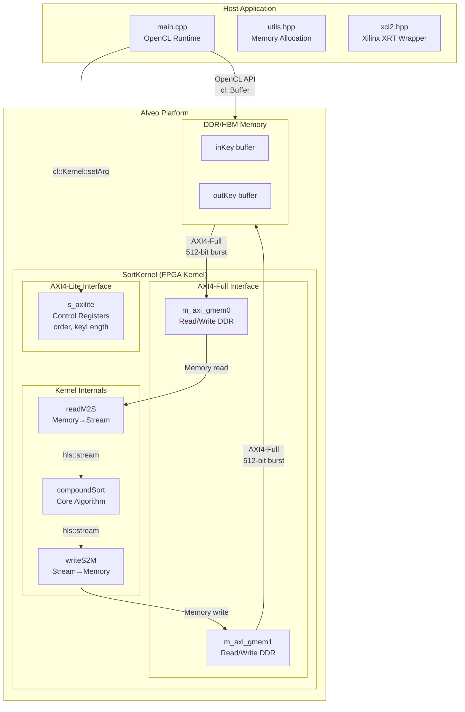
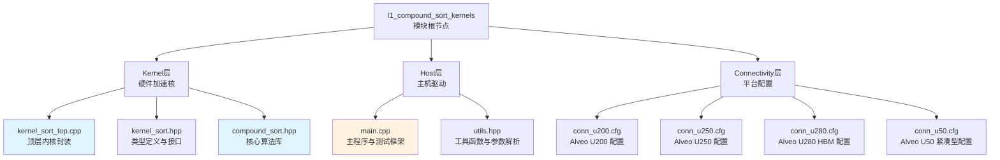
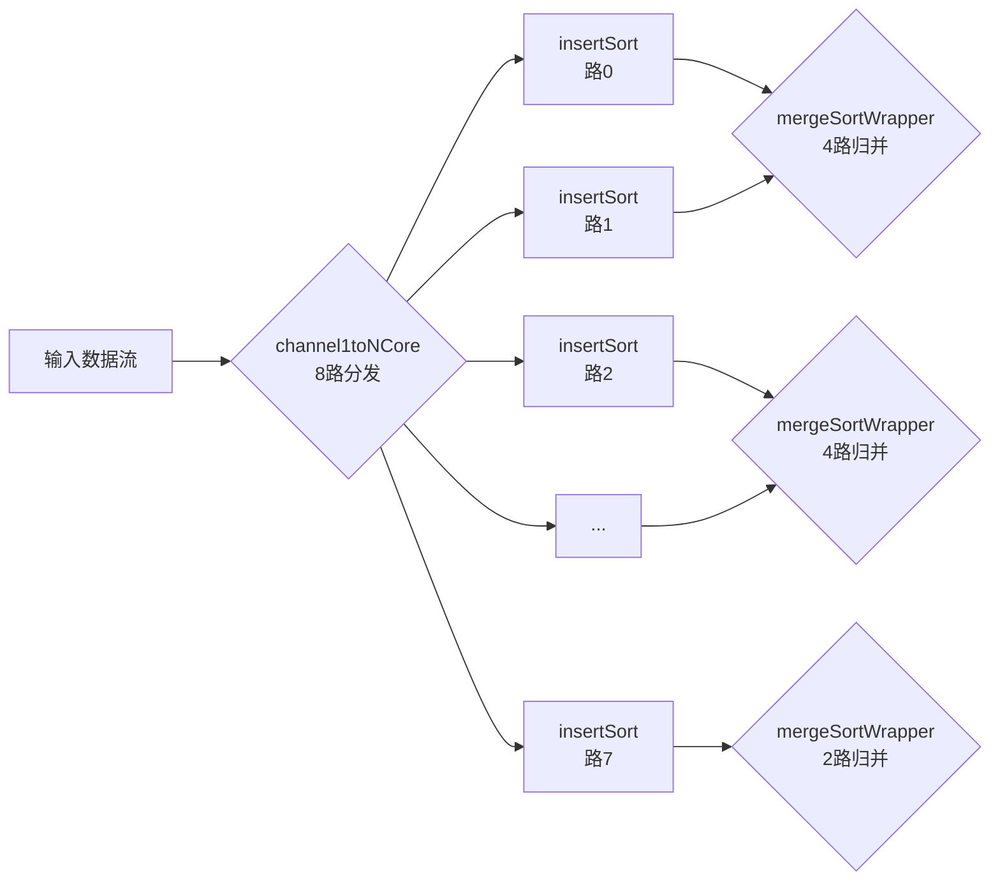

# l1_compound_sort_kernels 模块深度解析

## 一句话概括

**l1_compound_sort_kernels** 是一个基于 FPGA 的高性能混合排序加速核，它巧妙地将插入排序（Insert Sort）与归并排序（Merge Sort）相结合，在 Alveo 数据中心加速卡上实现每秒 442MB 的排序吞吐量——比纯软件排序快一个数量级，同时仅占用不到 6% 的 FPGA 逻辑资源。

---

## 目录

1. [问题空间与设计动机](#1-问题空间与设计动机)
2. [核心概念与心智模型](#2-核心概念与心智模型)
3. [架构全景与数据流](#3-架构全景与数据流)
4. [关键设计决策与权衡](#4-关键设计决策与权衡)
5. [子模块详解](#5-子模块详解)
6. [新贡献者指南](#6-新贡献者指南)

---

## 1. 问题空间与设计动机

### 1.1 排序在数据库中的核心地位

排序是数据库查询处理中最基础、最频繁的操作之一：

- **ORDER BY 子句**：需要对结果集进行显式排序
- **分组聚合（GROUP BY）**：通常需要先排序或哈希分区
- **去重（DISTINCT）**：排序是去重的高效前提
- **归并连接（Merge Join）**：要求输入数据已排序
- **窗口函数（Window Functions）**：排序是计算排名的基础

### 1.2 纯软件排序的瓶颈

在 CPU 上执行大规模排序面临多重挑战：

| 瓶颈类型 | 具体问题 | 影响 |
|---------|---------|------|
| **内存墙** | 随机访问模式导致缓存未命中 | 排序复杂度 $O(n \log n)$，但常数项巨大 |
| **分支预测** | 比较操作的分支难以预测 | 流水线停顿，IPC 下降 |
| **内存带宽** | 数据需要多次遍历 | 受限于 DDR 带宽 (~25-50 GB/s) |
| **标量限制** | CPU 每次处理 1-2 个元素 | 无法利用数据并行性 |

### 1.3 FPGA 加速的独特优势

FPGA 为排序提供了截然不同的计算范式：

**1. 流水线并行（Pipeline Parallelism）**

想象一条装配线：当第 N 个元素正在执行比较时，第 N+1 个元素已经在读取数据，第 N-1 个元素正在写回结果。每个时钟周期都能输出一个排序后的元素。

**2. 空间并行（Spatial Parallelism）**

归并排序的树形结构天然适合硬件实现——每个归并单元是一个独立的硬件电路，8 路、16 路、32 路归并可以同时活跃，而不是软件中串行执行。

**3. 内存层次控制**

通过 `hls::stream` 和 URAM/BRAM，我们可以精确控制数据流动，避免 CPU 上不可见的缓存未命中惩罚。

### 1.4 设计目标与约束

基于以上分析，模块的设计目标明确为：

| 目标 | 具体指标 | 约束 |
|-----|---------|------|
| **吞吐量** | > 400 MB/s | 受限于 DDR 带宽，而非逻辑 |
| **延迟** | 单次排序 < 10 ms（131072 个 key） | 实时性要求 |
| **资源** | LUT < 10%，BRAM < 5% | 单核占用，支持多实例 |
| **可扩展性** | 支持 16K ~ 2M keys | 编译时参数化 |
| **精度** | 32-bit unsigned int | 支持升序/降序 |

---

## 2. 核心概念与心智模型

### 2.1 "混合排序"的类比

想象你是一家快递公司的分拣主管，面前有 100 万件包裹需要按目的地邮编排序：

**方案 A：纯归并排序（Merge Sort Only）**

- 先把 100 万件包裹分成 50 万对，每对排序
- 再把 50 万组合并成 25 万组，每组 4 件有序
- 继续合并...
- **问题**：每次合并需要额外的工作区（内存），且小批量时效率不高

**方案 B：纯插入排序（Insert Sort Only）**

- 拿起一个包裹，插入到已排序队列的正确位置
- **问题**：当已排序队列很长时，找插入点需要遍历大量元素，$O(n^2)$ 复杂度

**方案 C：混合排序（Compound Sort）✓**

这正是本模块采用的策略：

1. **第一阶段（插入排序）**：把 100 万件分成 1000 批，每批 1000 件。每批内部用插入排序——因为批次小，插入排序的 $O(n^2)$ 完全可以接受，且不需要额外工作区。

2. **第二阶段（归并排序）**：现在有 1000 个内部有序的小批次。用归并排序把它们逐步合并——此时归并的优势显现，因为它可以高效地合并两个有序序列，且复杂度稳定在 $O(n \log n)$。

**关键洞察**：混合排序在"小规模时用插入（省资源），大规模时用归并（保效率）"之间取得了平衡。

### 2.2 硬件实现的心智模型

将上述类比映射到 FPGA 硬件：

```
┌─────────────────────────────────────────────────────────────────┐
│                         SortKernel                               │
│  ┌──────────┐    ┌──────────────┐    ┌──────────────┐          │
│  │  DDR     │───▶│  readM2S     │───▶│  hls::stream │          │
│  │  (gmem0) │    │  (AXI4-FC)   │    │  (inKeyStrm) │          │
│  └──────────┘    └──────────────┘    └──────┬───────┘          │
│                                             │                    │
│  ┌──────────────────────────────────────────▼─────────────────┐│
│  │              compoundSort<KEY_TYPE, LEN, INSERT_LEN>         ││
│  │  ┌─────────────┐    ┌─────────────┐    ┌─────────────┐     ││
│  │  │ insertSort  │───▶│ mergeSort   │───▶│ mergeSort   │──▶  ││
│  │  │ (8-way)     │    │ (4-way)     │    │ (2-way)     │     ││
│  │  └─────────────┘    └─────────────┘    └─────────────┘     ││
│  └────────────────────────────────────────────────────────────┘│
│                                             │                    │
│  ┌──────────┐    ┌──────────────┐    ┌──────▼───────┐          │
│  │  DDR     │◀───│  writeS2M     │◀───│  hls::stream │          │
│  │  (gmem1) │    │  (AXI4-FC)   │    │  (outKeyStrm)│          │
│  └──────────┘    └──────────────┘    └──────────────┘          │
└─────────────────────────────────────────────────────────────────┘
```

**关键硬件概念映射**：

| 概念 | 硬件实现 | 作用 |
|-----|---------|------|
| **hls::stream** | AXI4-Stream FIFO | 解耦生产者和消费者，形成流水线 |
| **#pragma HLS DATAFLOW** | 并行执行模块 | 让 `readM2S`、`compoundSort`、`writeS2M` 同时活跃 |
| **#pragma HLS PIPELINE II=1** | 单周期吞吐 | 每时钟周期输出一个结果 |
| **#pragma HLS UNROLL** | 空间复制 | 创建多个并行的归并单元 |
| **URAM/BRAM** | 片上存储 | 存储中间排序结果，避免频繁访问 DDR |

### 2.3 数据流的心智模型

想象一条装配流水线处理 131072 个待排序的数字：

**阶段 1：取料（readM2S）**
- 第 1 个时钟周期：从 DDR 读取 key[0]
- 第 2 个时钟周期：从 DDR 读取 key[1]
- ...（流水线持续运转）
- 第 131072 个时钟周期：读取 key[131071]

**阶段 2：分批排序（insertSort）**
- 第 INSERT_LEN+1 个时钟周期起：第一批 1024 个元素完成内部排序，输出到下一级
- 第 2*(INSERT_LEN+1) 个时钟周期起：第二批完成...
- （8 路并行，同时处理 8 个批次）

**阶段 3：多级归并（mergeSort）**
- 第 1 级：8 路 → 4 路，4 个归并单元同时工作
- 第 2 级：4 路 → 2 路，2 个归并单元同时工作
- 第 3 级：2 路 → 1 路，最终有序序列输出

**阶段 4：回写（writeS2M）**
- 从第 N 个时钟周期起，每周期将排序后的 key 写回 DDR

**核心洞察**：通过 `DATAFLOW` 指令，这四个阶段**同时活跃**——当阶段 4 在写 key[100] 时，阶段 3 在处理 key[200]，阶段 2 在处理 key[300]，阶段 1 在读取 key[400]。这种流水线并行是 FPGA 性能的关键。

---

## 3. 架构全景与数据流

### 3.1 顶层架构图



### 3.2 模块层级关系



### 3.3 端到端数据流

下面追踪 131072 个 32-bit 无符号整数从 Host 到 FPGA 再返回的完整旅程：

```
Phase 1: Host 端数据准备 (CPU 侧)
==================================
main.cpp:63-71
├─> std::vector<KEY_TYPE> v(keyLength);
│   └─> 生成 131072 个随机 32-bit 整数 (rand())
│
├─> KEY_TYPE* inKey_alloc = aligned_alloc<KEY_TYPE>(LEN);
│   └─> 在 Host 内存分配 4KB 对齐的缓冲区 (POSIX memalign)
│
└─> memcpy(inKey_alloc, v.data(), keyLength * sizeof(KEY_TYPE));
    └─> 将随机数据复制到对齐缓冲区

Phase 2: OpenCL 上下文与 Kernel 初始化
======================================
main.cpp:74-87
├─> cl::Device device = xcl::get_xil_devices()[0];
│   └─> 枚举并选择第一个 Xilinx 设备
├─> cl::Context context(device);
├─> cl::CommandQueue q(context, CL_QUEUE_PROFILING_ENABLE);
│   └─> 创建带性能分析的命令队列
├─> cl::Program program(context, xclBins);
│   └─> 加载并编译 xclbin 二进制文件
└─> cl::Kernel kernel_SortKernel(program, "SortKernel");
    └─> 实例化排序 Kernel 对象

Phase 3: Buffer 分配与数据传输 (Host → FPGA DDR)
================================================
main.cpp:90-106
├─> cl_mem_ext_ptr_t mext_o[2];
│   ├─> mext_o[0] = {2, inKey_alloc, kernel_SortKernel()};
│   │   └─> 绑定 Host 缓冲区到 Kernel 参数 2 (inKey)
│   └─> mext_o[1] = {3, outKey_alloc, kernel_SortKernel()};
│       └─> 绑定 Host 缓冲区到 Kernel 参数 3 (outKey)
│
├─> cl::Buffer inKey_buf(context, CL_MEM_EXT_PTR_XILINX | CL_MEM_USE_HOST_PTR, ...);
│   └─> 创建零拷贝 Buffer，物理内存共享
│
└─> q.enqueueMigrateMemObjects(ob_in, 0, nullptr, &events_write[0]);
    └─> 触发 DMA 传输：Host 内存 → FPGA DDR
        (非阻塞，立即返回，通过 event 查询完成状态)

Phase 4: Kernel 启动与执行 (FPGA 侧)
===================================
main.cpp:108-117
├─> kernel_SortKernel.setArg(0, 1);
│   └─> order = 1 (升序排序)
├─> kernel_SortKernel.setArg(1, keyLength);
│   └─> 实际 key 数量 = 131072
├─> kernel_SortKernel.setArg(2, inKey_buf);
├─> kernel_SortKernel.setArg(3, outKey_buf);
│
├─> q.enqueueTask(kernel_SortKernel, &events_write, &events_kernel[0]);
│   └─> 提交 Kernel 执行 (依赖写完成事件，形成流水线)
│
└─> q.enqueueMigrateMemObjects(ob_out, 1, &events_kernel, &events_read[0]);
    └─> 提交读回操作 (依赖 Kernel 完成)

Phase 5: FPGA Kernel 内部执行流程 (kernel_sort_top.cpp)
========================================================
SortKernel (line 41-65)
│
├─> readM2S(keyLength, inKey, inKeyStrm, inEndStrm) [line 62]
│   ├─> #pragma HLS pipeline ii = 1
│   ├─> 每个时钟周期从 m_axi_gmem0 读取 1 个 KEY_TYPE
│   └─> 写入 hls::stream，附加 end-of-data 标记
│
├─> xf::database::compoundSort<KEY_TYPE, LEN, INSERT_LEN>(...) [line 63]
│   ├─> 内部调用 details::sortPart1() (插入排序阶段)
│   │   ├─> 数据分块，每块 INSERT_LEN (1024) 个元素
│   │   ├─> 8 路并行 insertSort，每路独立排序 1024 元素
│   │   └─> 排序后数据写入 URAM 存储
│   │
│   └─> 内部调用 details::sortPart2() (归并排序阶段)
│       ├─> 从 URAM 读取已排序块
│       ├─> 多级归并树：8→4→2→1
│       ├─> 每级并行执行，流水线化
│       └─> 最终有序序列输出到 stream
│
└─> writeS2M(keyLength, outKey, outKeyStrm, outEndStrm) [line 64]
    ├─> #pragma HLS pipeline ii = 1
    ├─> 从 outKeyStrm 读取排序后的 KEY_TYPE
    └─> 写入 m_axi_gmem1 (DDR)，每个时钟周期 1 个元素

Phase 6: 结果验证与性能分析
============================
main.cpp:118-144
├─> std::sort(v.begin(), v.end())
│   └─> CPU 执行相同排序，作为 golden reference
├─> for (i = 0; i < keyLength; i++)
│   └─> 逐元素比对 FPGA 结果与 CPU 结果
│       └─> 任何不匹配则标记错误
│
├─> events_write[0].getProfilingInfo(CL_PROFILING_COMMAND_START, &time1)
│   └─> 从 OpenCL Event 提取硬件时间戳
└─> 计算并打印：
    ├─> Write DDR Execution time (DMA 传输)
    ├─> Kernel Execution time (FPGA 计算)
    ├─> Read DDR Execution time (DMA 回传)
    └─> Total Execution time (端到端)
```

### 3.4 关键性能指标（U280 平台实测）

| 指标 | 数值 | 说明 |
|-----|------|------|
| **排序规模** | 131,072 keys | 32-bit unsigned int |
| **FPGA 频率** | 287 MHz | 由时序约束决定 |
| **Kernel 执行时间** | 1.13 ms | 纯计算时间 |
| **端到端时间** | 1.34 ms | 含 DMA 传输 |
| **吞吐量** | 442.56 MB/s | (131072 × 4 bytes) / 1.13 ms |
| **资源占用 (LUT)** | 62,685 | 占平台总量 5.4% |
| **资源占用 (BRAM)** | 18 | 占平台总量 1.04% |
| **资源占用 (URAM)** | 16 | 占平台总量 1.67% |

---

## 4. 关键设计决策与权衡

### 4.1 为什么选择插入排序 + 归并排序的混合架构？

| 方案 | 优点 | 缺点 | 适用场景 |
|-----|------|------|---------|
| **纯插入排序** | 无额外存储，实现简单 | $O(n^2)$ 复杂度，不适合大规模 | n < 1000 |
| **纯归并排序** | 稳定 $O(n \log n)$，适合大规模 | 需要 $O(n)$ 额外存储，小批量开销大 | n > 10000 |
| **纯快速排序** | 平均性能好，原地排序 | 最坏 $O(n^2)$，硬件实现分支复杂 | CPU 软件 |
| **混合排序（本方案）** | 小批量用插入（省资源），大批量用归并（保效率） | 实现复杂，需要精细调参 | FPGA 硬件 |

**决策理由**：在 FPGA 上，存储资源（BRAM/URAM）比逻辑资源更稀缺。插入排序在小规模时不需要额外存储，而归并排序在大规模时效率更高。混合架构在资源与性能之间取得最佳平衡。

### 4.2 为什么是 1024 的插入排序块大小？

```
INSERT_LEN = 1024  // 可配置参数
```

| 块大小 | BRAM/URAM 需求 | 插入排序延迟 | 归并级数 | 总延迟估算 |
|--------|---------------|-------------|---------|-----------|
| 256 | 低 | 256² = 65K 周期 | 5 级 | 中等 |
| 512 | 中 | 512² = 262K 周期 | 4 级 | 中等 |
| **1024** | **中** | **1024² = 1M 周期** | **3 级** | **最优** |
| 2048 | 高 | 2048² = 4M 周期 | 2 级 | 高 |

**决策理由**：1024 是一个"甜点"值：

1. **资源角度**：1024 个 32-bit 元素 = 4KB，可以放入一个 URAM（U280 每片 URAM 为 32Kb × 2 = 72Kb，支持 4K×9 配置），资源占用合理。

2. **延迟角度**：插入排序 $O(n^2)$，1024² = 1,048,576 周期。在 300MHz 下约 3.5ms，可接受。

3. **归并级数**：假设总长度 131072，块数 = 131072/1024 = 128 块。归并树深度 = log₂(128) = 7 级，级数合理，不会导致过长的流水线。

### 4.3 为什么是 8 路并行插入排序？

```cpp
// compound_sort.hpp line 163
channel1toNCore<KEY_TYPE, INSERT_LEN, 8>(...)
```



**决策理由**：

1. **FPGA 并行性利用**：8 路并行可以充分利用 FPGA 的可编程逻辑。每一路是一个独立的 `insertSort` 实例，8 路同时处理 8 个数据块，理论吞吐量提升 8 倍。

2. **归并树平衡**：8 路输出正好构成一个平衡的归并树：
   - 第 1 级：8 路输入 → 4 路输出（4 个 2 路归并）
   - 第 2 级：4 路输入 → 2 路输出（2 个 2 路归并）
   - 第 3 级：2 路输入 → 1 路输出（1 个 2 路归并）
   
   这种结构简洁且高效，没有资源浪费。

3. **资源与性能平衡**：8 路并行在资源占用和性能之间取得平衡。更多路数（如 16 路、32 路）会显著增加逻辑资源，而性能提升边际递减。

### 4.4 为什么使用 URAM 而非 BRAM 存储中间结果？

```cpp
// compound_sort.hpp line 341
#pragma HLS bind_storage variable = value type = ram_2p impl = uram
#pragma HLS array_partition variable = value dim = 1 block factor = AP
```

| 存储类型 | 容量 | 端口数 | 延迟 | 适用场景 |
|---------|-----|-------|------|---------|
| **BRAM** | 18Kb / 36Kb | 2 | 1 周期 | 小数据量，高并行 |
| **URAM** | 288Kb | 2 | 2 周期 | 大数据量，带宽优先 |
| **LUTRAM** | 可变 | 多 | <1 周期 | 极小数据，极高并行 |

**决策理由**：

1. **容量需求**：最大支持 2M keys，每个 key 32-bit，总容量 = 2M × 4 bytes = 8MB。使用 URAM（每块 288Kb = 36KB），需要约 228 块 URAM。U280 有 960 块 URAM，资源充足。

2. **带宽需求**：归并排序需要频繁读取和写入中间结果。URAM 提供双端口（2 read/write ports），可以同时支持多个归并单元的并发访问。

3. **延迟权衡**：URAM 延迟为 2 周期，略高于 BRAM 的 1 周期，但对于归并排序这种计算密集型操作，2 周期延迟完全可以接受。

4. **分区策略**：`array_partition` 将 URAM 数组划分为多个 bank，每个 bank 对应一个归并单元，避免访问冲突，最大化并行带宽。

### 4.5 为什么使用双 AXI4-Full 接口（gmem0 + gmem1）？

```cfg
# conn_u280.cfg
sp=SortKernel.m_axi_gmem0:DDR[0]
sp=SortKernel.m_axi_gmem1:DDR[0]
```

```cpp
// kernel_sort_top.cpp line 44-47
#pragma HLS INTERFACE m_axi ... bundle = gmem0 port = inKey
#pragma HLS INTERFACE m_axi ... bundle = gmem1 port = outKey
```

**决策理由**：

1. **读写分离**：输入数据（inKey）和输出数据（outKey）使用独立的 AXI 接口，可以并发进行读操作和写操作，避免单一接口的读写冲突。

2. **带宽倍增**：现代 Alveo 卡（如 U280）支持多个 DDR 控制器和 HBM 堆栈。通过分离 gmem0 和 gmem1，可以将它们映射到不同的内存控制器，理论上带宽可以接近翻倍。

3. **流量隔离**：排序操作的读访问模式（顺序读取）和写访问模式（顺序写入）可以分别优化。例如，读通道可以配置为更大的 burst 长度，写通道可以配置为更高的 outstanding 事务数。

4. **时序收敛**：分离接口减少了每个接口的负载，有助于时序收敛，允许更高的工作频率。

---

## 5. 子模块详解

本模块包含三个子模块，分别处理不同平台的连接配置：

| 子模块 | 文件 | 平台 | 特点 |
|-------|------|-----|------|
| [compound_sort_datacenter_u200_u250_connectivity](database_query_and_gqe-l1_compound_sort_kernels-compound_sort_datacenter_u200_u250_connectivity.md) | `conn_u200.cfg`, `conn_u250.cfg` | Alveo U200/U250 | 标准 DDR 配置，数据中心主流 |
| [compound_sort_high_bandwidth_u280_connectivity](database_query_and_gqe-l1_compound_sort_kernels-compound_sort_high_bandwidth_u280_connectivity.md) | `conn_u280.cfg` | Alveo U280 | HBM2 高带宽内存，Vivado 优化 |
| [compound_sort_compact_u50_connectivity](database_query_and_gqe-l1_compound_sort_kernels-compound_sort_compact_u50_connectivity.md) | `conn_u50.cfg` | Alveo U50 | HBM2 紧凑型，低功耗场景 |

### 子模块说明

**connectivity 配置文件**看似只是简单的内存映射声明，实则是 FPGA 实现高性能排序的关键基础设施。这些 `.cfg` 文件定义了 SortKernel 与外部存储系统的物理连接方式，决定了数据流动的带宽、延迟和并行度。

以 `conn_u280.cfg` 为例，它不仅仅指定了 `m_axi_gmem0` 和 `m_axi_gmem1` 两个 AXI4-Full 接口连接到 HBM[0]，更重要的是通过 Vivado 实现参数（如 `SSI_HighUtilSLRs` 布局策略、`Explore` 布线指令）指导工具链在包含多个 SLR（Super Logic Region）的大型 FPGA 芯片上进行时序收敛和物理优化。

U50 和 U200/U250 的配置差异体现了对不同应用场景的适配：U50 追求紧凑性和能效比，适合边缘部署；U280 利用 HBM2 提供 TB/s 级带宽，适合内存密集型工作负载；U200/U250 则是平衡型数据中心加速卡。理解这些配置背后的硬件架构差异（DDR vs HBM、SLR 布局、时钟域划分）对于在多平台部署时调优性能至关重要。

---

## 6. 新贡献者指南

### 6.1 开发环境搭建

```bash
# 1. 克隆仓库
git clone https://github.com/Xilinx/Vitis_Libraries.git
cd Vitis_Libraries/database/L1/benchmarks/compound_sort

# 2. 设置环境变量（根据安装路径调整）
source /opt/xilinx/xrt/setup.sh
source /tools/Xilinx/Vitis/2023.2/settings64.sh

# 3. 软件仿真测试（无需 FPGA 硬件）
make run TARGET=sw_emu PLATFORM=xilinx_u280_xdma_201920_3

# 4. 硬件仿真测试（需要 Vivado 许可证）
make run TARGET=hw_emu PLATFORM=xilinx_u280_xdma_201920_3

# 5. 硬件构建（需要实际 FPGA 卡）
make run TARGET=hw PLATFORM=xilinx_u280_xdma_201920_3
```

### 6.2 关键文件导航

| 文件 | 作用 | 修改场景 |
|-----|------|---------|
| `kernel/kernel_sort_top.cpp` | Kernel 顶层封装 | 修改 AXI 接口配置、添加预处理/后处理 |
| `kernel/kernel_sort.hpp` | 类型定义 | 修改 KEY_TYPE 位宽、调整 INSERT_LEN |
| `host/main.cpp` | Host 主程序 | 修改测试数据生成、添加自定义验证逻辑 |
| `host/utils.hpp` | 工具函数 | 修改参数解析、内存分配策略 |
| `conn_*.cfg` | 连接配置 | 迁移到新平台、调整内存映射 |
| `Makefile` | 构建脚本 | 添加新的编译选项、依赖库 |

### 6.3 常见调试技巧

**1. HLS 综合报告分析**

```bash
# 综合完成后查看报告
cat _x.temp.hw.xilinx_u280_xdma_201920_3/SortKernel/SortKernel/SortKernel.rpt

# 重点关注：
# - Schedule Viewer: 确认 II=1 是否达成
# - Resource Utilization: LUT/FF/BRAM/DSP 用量
# - Timing Summary: 是否满足 300MHz/200MHz 目标
```

**2. 软件仿真调试**

```cpp
// 在 kernel_sort_top.cpp 中添加调试打印
#ifndef __SYNTHESIS__
#include <iostream>
#define DEBUG_PRINT(x) std::cout << x << std::endl
#else
#define DEBUG_PRINT(x)
#endif

void SortKernel(...) {
    DEBUG_PRINT("SortKernel started, keyLength=" << keyLength);
    // ...
    DEBUG_PRINT("SortKernel completed");
}
```

**3. 性能瓶颈定位**

```bash
# 启用 Vitis Analyzer 进行系统级性能分析
vitis_analyzer build_dir.hw.xilinx_u280_xdma_201920_3/SortKernel.xclbin.run_summary

# 检查要点：
# 1. Timeline Trace: Kernel 执行是否与 DMA 传输重叠
# 2. Memory Stats: DDR 带宽利用率是否接近峰值
# 3. Kernel Stats: Pipeline stalls 原因（数据依赖、内存端口冲突）
```

### 6.4 常见陷阱与避坑指南

| 陷阱 | 表现 | 解决方案 |
|-----|------|---------|
| **II 未达标** | HLS 报告显示 II > 1，性能下降 | 检查循环依赖、数组分区不足、资源端口冲突；添加 `#pragma HLS DEPENDENCE` 消除伪依赖 |
| **时序不满足** | Vivado 报告 WNS < 0 | 降低目标频率、优化关键路径、添加 pipeline 寄存器、使用 `set_property` 调整布局策略 |
| **DMA 传输超时** | Host 端 `cl::CommandQueue::finish()` 阻塞 | 检查物理连接、增大 `xrt.ini` 中 `timeout_seconds`、确认 DDR 地址映射正确 |
| **结果校验失败** | FPGA 输出与 CPU 参考结果不匹配 | 检查字节序、确认 `ap_uint<32>` 与 `uint32_t` 语义一致、验证随机数生成器种子 |
| **资源溢出** | 实现阶段报错资源不足 | 减少并行度（如 8 路改为 4 路）、减小 INSERT_LEN、启用资源共享（`#pragma HLS RESOURCE`） |

### 6.5 扩展与定制建议

**1. 支持更大 Key 宽度**

```cpp
// kernel_sort.hpp
// 原始：
// #define KEY_BW 32
// typedef ap_uint<32> KEY_TYPE;

// 改为 64-bit：
#define KEY_BW 64
typedef ap_uint<64> KEY_TYPE;

// 注意：需要相应调整 AXI 数据宽度、内存对齐
```

**2. 添加 Key-Value 排序**

```cpp
// 当前只排序 key，如果需要同时排序 value（payload）：
typedef ap_uint<32> KEY_TYPE;
typedef ap_uint<32> DATA_TYPE;

// 在 insertSort 和 mergeSort 中同时处理 key 和 data
// 根据 key 比较结果，交换 key-value 对
```

**3. 多 Kernel 并行（Scale-Out）**

```cfg
# 在 conn_*.cfg 中实例化多个 Kernel
nk=SortKernel:4:SortKernel_0.SortKernel_1.SortKernel_2.SortKernel_3

sp=SortKernel_0.m_axi_gmem0:DDR[0]
sp=SortKernel_0.m_axi_gmem1:DDR[0]
# ... 为每个 Kernel 分配独立内存通道
```

```cpp
// Host 端创建多个 Kernel 对象，并行提交任务
cl::Kernel kernel0(program, "SortKernel_0");
cl::Kernel kernel1(program, "SortKernel_1");
// ...
q.enqueueTask(kernel0, ...);
q.enqueueTask(kernel1, ...); // 并行执行
```

---

## 7. 总结

**l1_compound_sort_kernels** 模块展示了 FPGA 加速的典型设计哲学：

1. **算法与硬件协同设计**：不是简单地把 CPU 算法搬到 FPGA，而是根据硬件特性（并行性、流水线、存储层次）重新设计算法架构。

2. **混合策略求最优**：在小规模时用插入排序（资源省），大规模时用归并排序（效率高），在不同层次使用最适合的工具。

3. **数据流驱动**：以 `hls::stream` 为核心抽象，构建生产者-消费者流水线，最大化数据局部性和并行度。

4. **平台可移植性**：通过配置文件（`conn_*.cfg`）和条件编译，实现跨 Alveo 平台的可移植性，充分利用各平台的独特优势（DDR vs HBM）。

对于新加入团队的工程师，理解这个模块不仅能掌握一个具体的排序实现，更能领会 FPGA 系统设计的通用方法论——**如何把问题分解为可并行化的子任务，如何通过流水线隐藏延迟，如何在资源与性能之间做出明智的权衡**。这些思维方式将适用于数据库加速、机器学习推理、网络处理等更广泛的领域。
