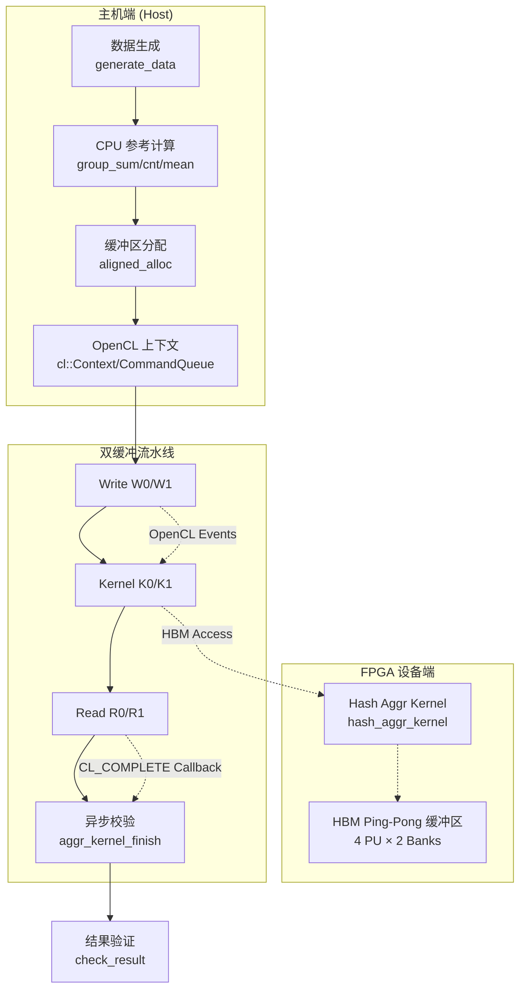

# hash_group_aggregate_benchmark_host_support 模块深度解析

本模块是 FPGA 加速数据库 Hash Group Aggregation 的**主机端基准测试框架**。想象你正在指挥一支 FPGA "管弦乐队"：你需要准备乐谱（测试数据）、 cue 演奏者在恰当时机开始（OpenCL 核函数启动）、并实时检验他们的演奏是否准确（结果校验）。这个模块正是扮演这一"指挥"角色——它不仅仅是一个测试程序，而是连接 CPU 参考实现与 FPGA 加速内核之间的**验证桥梁**和**性能评估基础设施**。

---

## 架构全景：流水线指挥系统



### 核心角色与数据流向

本模块采用**双缓冲（Ping-Pong）流水线架构**，旨在最大化 FPGA 计算与数据传输的重叠。想象机场安检流程：当一条通道正在检查旅客时，另一条通道正在准备下一批旅客。数据流向如下：

1. **准备阶段**：主机生成 TPC-H 格式的测试数据（`l_orderkey` 和 `l_extendedprice`），同时在 CPU 上计算**黄金参考值**（Golden Reference）——使用 `std::unordered_map` 实现的标准 Hash Aggregation。

2. **缓冲区编排**：通过 `aligned_alloc` 分配页对齐主机内存，创建 OpenCL 缓冲对象（`cl::Buffer`）。关键设计在于**双缓冲策略**：分配 A/B 两套输入/输出缓冲区，使得第 N 次迭代的结果回传可以与第 N+1 次迭代的数据写入并行。

3. **流水线执行**：利用 OpenCL 的 **Out-of-Order 命令队列** 和 **事件依赖（Event Dependency）** 构建三级流水线：
   - **Write Stage** (`W_i`)：将主机数据传输至 FPGA HBM
   - **Kernel Stage** (`K_i`)：执行 `hash_aggr_kernel` 进行硬件加速聚合
   - **Read Stage** (`R_i`)：将聚合结果从 FPGA 读回主机
   
   通过 `enqueueMigrateMemObjects` 和 `enqueueTask` 的显式事件依赖（`write_events[i]` → `kernel_events[i]` → `read_events[i]`），确保流水线按序推进，同时利用双缓冲使相邻迭代的 Stage 重叠。

4. **异步验证**：结果校验通过 **OpenCL 完成回调（Completion Callback）** 异步执行。`read_events[i]` 注册 `aggr_kernel_finish` 回调，当数据回传完成后，自动调用 `check_result` 对比 FPGA 结果与 CPU 黄金参考值。这种设计将校验开销与下一次迭代的流水线执行重叠，最大化吞吐。

---

## 核心组件深度解析

### `check_result` —— 硬件结果的"质检员"

```cpp
int check_result(ap_uint<1024>* data, int num, ap_uint<4> op, 
                 ap_uint<32> key_col, ap_uint<32> pld_col,
                 std::unordered_map<TPCH_INT, TPCH_INT>& ref_map);
```

这是模块的**正确性守门人**。FPGA 返回的聚合结果是宽位向量（`ap_uint<1024>`），需要根据聚合操作类型（`op`）解析出关键字段（Key）和载荷（Payload）。其核心逻辑是**按操作类型分发解析策略**：

- **SUM/MEAN**：从宽向量的高 192 位中提取（跳过最低 64 位的 MIN 值和中间 64 位的 MAX 值）
- **MIN**：提取最低 64 位
- **COUNT**：复用 MIN 字段的存储位置
- **COUNTNONZEROS**：提取最高 64 位

设计洞察：这种宽位打包策略源于 FPGA 内核的数据布局设计——单次 1024 位读取可携带多种聚合结果（MIN/MAX/SUM/COUNT），减少内存访问次数。主机端必须精确镜像这一布局才能正确解码。

**内存契约**：`data` 指针由调用者（回调函数 `aggr_kernel_finish`）提供，指向通过 `aligned_alloc` 分配的主机内存。该内存由 `main` 函数在程序结束时统一释放，校验函数仅持有**借用引用**（Borrowed Reference）。

### `aggr_kernel_finish` —— 异步完成的"信号员"

```cpp
void CL_CALLBACK aggr_kernel_finish(cl_event event, cl_int cmd_exec_status, void* ptr);
```

这是 OpenCL 异步编程模型的**回调锚点**。当 FPGA 内核执行完成且结果数据已回传至主机内存后，OpenCL 运行时调用此函数。其设计关键在于**类型擦除与恢复**：`ptr` 参数被强制转换为 `print_buf_result_data_t*`，这是一个包含回调所需全部上下文的结构体。

**生命周期陷阱**：这是本模块最危险的内存契约之一。`print_buf_result_data_t` 必须在回调执行前保持有效。代码中这些结构体存储在 `std::vector<print_buf_result_data_t> cbd(num_rep)` 中，由 `main` 函数栈分配并在整个 `q.finish()` 等待期间保持存活。绝不可将栈局部变量的指针传递给此回调，否则将触发**使用后释放（Use-After-Free）**崩溃。

**并发模型**：此回调在 OpenCL 内部线程池上下文中执行，与主机主线程并发。它通过原子操作（`(*(d->r)) += ...`）累积错误计数，并通过标准输出打印结果。这种设计将结果校验卸载到后台线程，使主机主线程可立即启动下一轮流水线迭代。

### `group_*` 函数族 —— CPU 黄金参考的"计算基准"

```cpp
TPCH_INT group_sum(TPCH_INT* key, TPCH_INT* pay, int num, std::unordered_map<TPCH_INT, TPCH_INT>& ref_map);
TPCH_INT group_cnt(TPCH_INT* key, TPCH_INT* pay, int num, std::unordered_map<TPCH_INT, TPCH_INT>& ref_map);
// ... group_mean, group_max, group_min, group_cnt_nz
```

这些函数构成了**黄金参考（Golden Reference）**实现，使用标准 C++ 库（`std::unordered_map`）计算 Hash Group Aggregation 的期望结果。它们遵循**简单即正确**的哲学：优先保证逻辑清晰和绝对正确性，而非性能。

**算法复杂度**：所有实现均为 $O(n)$ 时间复杂度，$O(k)$ 空间复杂度（$k$ 为唯一键数）。`group_mean` 特殊处理：需要同时维护 SUM 和 COUNT 两张哈希表，再计算平均值。

**内存契约**：`key` 和 `pay` 数组由调用者（`main`）分配并通过 `aligned_alloc` 确保页对齐。`ref_map` 是输出参数，函数通过 `insert` 和 `operator[]` 修改其内容。调用者负责在多次运行间 `clear()` 哈希表，否则将累积历史结果。

### `print_buf_result_data_t` —— 异步上下文的"信使"

```cpp
typedef struct print_buf_result_data_ {
    int i;                                    // 迭代索引
    ap_uint<1024>* aggr_result_buf;          // 结果缓冲区指针
    ap_uint<32>* pu_end_status;              // 状态寄存器指针
    ap_uint<4> op;                           // 聚合操作类型
    ap_uint<32> key_column;                  // 键列配置
    ap_uint<32> pld_column;                  // 载荷列配置
    std::unordered_map<TPCH_INT, TPCH_INT>* map0;  // 黄金参考指针
    int* r;                                  // 错误计数累积器
} print_buf_result_data_t;
```

这是模块的**异步数据传递契约**。它将回调函数 `aggr_kernel_finish` 需要的所有上下文打包成一个结构体，通过 OpenCL 的 `void*` 用户数据参数传递。设计遵循**值语义聚合**原则：包含指针但不拥有所指向资源的所有权（除了结构体自身的生命周期）。

**关键字段解析**：
- `aggr_result_buf`：指向通过 `aligned_alloc` 分配的主机内存，存储 FPGA 返回的 1024 位宽原始结果。生命周期由 `main` 函数管理，回调期间必须保持有效。
- `map0`：指向 CPU 黄金参考哈希表。回调函数通过它验证 FPGA 结果的正确性。
- `r`：指向全局错误计数器。回调通过 `(*(d->r)) += ...` 原子地累积错误数。

**内存安全警告**：此结构体包含裸指针（`ap_uint<1024>*` 等），是典型的**非拥有指针（Non-owning Pointer）**模式。结构体的析构不会释放这些指针指向的内存。必须确保在回调执行前，所有指针指向的内存保持有效。实践中，这些结构体存储在 `std::vector` 中，由 `main` 函数在栈上分配，直到 `q.finish()` 完成才销毁。

---

## 依赖关系与数据契约

### 上游调用者

本模块是**叶节点可执行程序**，不被其他库模块调用。其入口点 `main` 函数由系统加载器直接调用。命令行参数定义了与用户的契约：

- `-xclbin`: FPGA 二进制文件路径（必需）
- `-rep`: 重复执行次数（默认由 `NUM_REP_HOST` 宏定义）
- `-key_column`, `-pld_column`: 列配置参数
- `-scale`: 数据缩放因子（影响 `L_MAX_ROW`）

### 下游依赖模块

本模块依赖以下外部组件，形成**分层架构**：

**1. FPGA 内核层** ([hash_aggr_kernel](database_query_and_gqe-l1_hash_join_and_aggregation_benchmark_hosts-hash_group_aggregate_benchmark_host_support.md#hash_aggr_kernel))
- 位于 `hash_aggr_kernel.hpp`，是实际执行 Hash Aggregation 的 FPGA 内核
- 通过 OpenCL `cl::Kernel` 对象 `kernel0` 调用
- 数据契约：期望特定位宽（`ap_uint<8 * KEY_SZ * VEC_LEN>`）的打包数据

**2. 数据库类型系统** ([enums.hpp](database_query_and_gqe-l3_gqe_configuration_and_table_metadata.md#enums))
- `xf::database::enums::AOP_SUM`, `AOP_COUNT` 等聚合操作枚举
- 定义了操作编码与硬件行为的映射

**3. 平台抽象层** ([xcl2.hpp](database_query_and_gqe-l3_gqe_execution_threading_and_queues.md#xcl2))
- Xilinx OpenCL 封装工具库
- 提供 `xcl::get_xil_devices()`, `xcl::import_binary_file()` 等设备管理功能

**4. 日志与工具** ([logger.hpp](database_query_and_gqe-l3_gqe_execution_threading_and_queues.md#logger))
- `xf::common::utils_sw::Logger` 用于标准化日志输出
- `ArgParser` 用于命令行参数解析

**5. 硬件定义** ([table_dt.hpp](database_query_and_gqe-l3_gqe_configuration_and_table_metadata.md#table_dt))
- `TPCH_INT`, `KEY_T`, `MONEY_T` 等类型定义
- `L_MAX_ROW`, `PU_STATUS_DEPTH` 等硬件规模常量

### 数据契约与接口边界

**主机-设备内存契约**：
- **输入缓冲区**：`col_l_orderkey` 和 `col_l_extendedprice` 必须页对齐（通过 `aligned_alloc`），以满足 Xilinx OpenCL 实现的 DMA 要求。
- **HBM 缓冲区**：Ping/Pong 缓冲区（`buf_ping[4]`, `buf_pong[4]`）显式绑定到 HBM 银行（`XCL_BANK(i * 4)`），利用 U280/U50 等卡的高带宽内存架构。
- **状态寄存器**：`pu_begin_status` 和 `pu_end_status` 是控制/状态接口（CSR），用于传递操作类型（`opt_type`）、列配置（`key_column`, `pld_column`）和返回结果行数。

**回调数据生命周期契约**：
`print_buf_result_data_t` 结构体通过 `cl::Event::setCallback` 传递给 OpenCL 运行时。这是一个**异步跨线程边界**的内存契约：
- 结构体必须在回调执行前保持有效（通常存储在 `std::vector` 中，由 `main` 函数栈帧保障）
- 结构体内的指针（`aggr_result_buf`, `map0` 等）必须指向仍然有效的内存
- 回调通过 `(*(d->r)) += ...` 修改共享状态，依赖 `int` 的算术原子性（在 x86_64 上对齐的 `int` 读写是原子的，但严格来说这是未定义行为，实际依赖平台保证）

---

## 设计决策与权衡

### 1. HLS_TEST 条件编译：仿真 vs 真实硬件的抽象分层

**决策**：通过 `#ifdef HLS_TEST` 宏隔离 HLS 仿真与 OpenCL 运行时代码路径。

**权衡分析**：
- **优势**：
  - **开发效率**：允许算法工程师在 Vivado HLS 中快速迭代内核逻辑，无需实际 FPGA 硬件
  - **调试便利**：HLS 仿真可单步调试，而 OpenCL 运行时是黑盒
  - **代码复用**：测试数据生成和参考计算逻辑在两条路径中完全复用
  
- **代价**：
  - **维护负担**：条件编译增加了代码复杂度，修改时需要同步两条路径
  - **行为差异**：HLS 仿真不测试真实的 PCIe 数据传输、HBM 延迟、OpenCL 调度开销，可能掩盖真实性能瓶颈

**选择理由**：在数据库内核开发中，算法正确性验证与硬件集成验证是不同阶段的任务。此设计允许团队并行工作：内核工程师专注 HLS 优化，应用工程师专注主机端集成。

### 2. 双缓冲（Ping-Pong）vs 单缓冲：流水线并行度的权衡

**决策**：分配两套独立缓冲区（A/B Set），通过 `use_a = i & 1` 交替使用。

**权衡分析**：
- **优势**：
  - **吞吐量最大化**：第 $i$ 次迭代的内核执行可与第 $i+1$ 次迭代的数据写入、第 $i-1$ 次迭代的结果回传并行，接近理想的三级流水线
  - **隐藏延迟**：PCIe 传输延迟（~10-100μs）和 HBM 访问延迟被计算重叠
  
- **代价**：
  - **内存翻倍**：主机内存和 FPGA HBM 占用增加一倍，限制了可处理的数据集大小
  - **复杂度增加**：需要管理两套缓冲区的生命周期，确保 OpenCL 事件依赖正确连接（`write_events[i-2]` 触发 `write_events[i]`）
  - **回调生命周期管理**：两套缓冲区意味着两套回调数据结构，增加了异步验证的复杂度

**选择理由**：在数据库基准测试场景中，**吞吐量优先于内存效率**。此模块目标是评估 FPGA 最大性能，而非处理超大数据集。双缓冲是实现近 100% 设备利用率的标准模式。

### 3. 异步回调 vs 同步轮询：响应性与复杂度的权衡

**决策**：使用 `cl::Event::setCallback(CL_COMPLETE, ...)` 注册异步回调，而非 `clWaitForEvents` 同步等待。

**权衡分析**：
- **优势**：
  - **CPU 效率**：主机线程可在 FPGA 执行期间执行其他工作（如准备下一批数据、记录日志），而非忙等待
  - **自然并行**：结果校验（涉及哈希表查找）在独立线程执行，利用多核 CPU
  - **延迟隐藏**：校验延迟与下一次迭代的数据传输重叠
  
- **代价**：
  - **生命周期地狱**：回调执行时，其捕获的上下文（`print_buf_result_data_t`）必须仍然有效。这是 C++ 异步编程中最易出错的模式之一
  - **调试困难**：异步回调的堆栈跟踪和断点调试比同步代码困难得多
  - **线程安全**：回调可能并发访问共享状态（如错误计数器 `*r`），需要同步机制（代码中依赖平台原子性，但无显式锁）

**选择理由**：基准测试需要最大化**端到端吞吐**。同步等待会浪费 CPU 周期，而回调模型允许主机端校验与 FPGA 计算流水化。这是异构计算（CPU+FPGA）的标准模式，尽管增加了代码复杂度。

### 4. HBM 显式银行绑定 vs 自动内存管理：控制性与可移植性的权衡

**决策**：通过 `cl_mem_ext_ptr_t` 和 `XCL_BANK(n)` 宏显式将缓冲区绑定到特定 HBM 银行。

**权衡分析**：
- **优势**：
  - **带宽最大化**：显式分散数据到 4 个 HBM 银行（0, 4, 8, 12 等），避免银行冲突，实现接近理论峰值的聚合带宽
  - **物理对齐**：确保 FPGA 内核的 HBM 控制器端口与主机端缓冲区一一对应，避免跨银行访问惩罚
  
- **代价**：
  - **平台锁定**：`XCL_BANK` 是 Xilinx 特定扩展，代码无法直接移植到其他 FPGA 厂商（如 Intel FPGA）或纯 CPU 实现
  - **硬编码拓扑**：假设特定硬件有至少 16 个 HBM 银行（U280/U50 特性），若移植到 DDR-only 的卡（如 U200）需要重写内存分配逻辑
  - **复杂性**：开发者必须理解 HBM 银行拓扑（哪些银行相邻、哪些共享控制器），增加了认知负担

**选择理由**：这是**领域特定优化（Domain-Specific Optimization）**的典型例子。作为数据库内核基准测试代码，其首要目标是榨取 Xilinx Alveo 卡的极致性能，而非追求跨平台可移植性。HBM 显式管理是实现 100+ GB/s 聚合带宽的必要条件。

---

## 关键实现细节与陷阱

### 内存所有权与生命周期图谱

```
[main 函数栈帧]
├── col_l_orderkey (aligned_alloc) ──────┐
├── col_l_extendedprice (aligned_alloc) ──┤ 主机端页对齐内存
├── aggr_result_buf_a/b (aligned_alloc) ──┤ (由 main 拥有，程序结束 free)
├── pu_begin/end_status_a/b (aligned_alloc)┤
│
├── map0, map1, map2 (std::unordered_map)─┤ 黄金参考哈希表
│
├── cbd (std::vector<print_buf_result_data_t>)─┐
│   ├── cbd[0] ──────┐                          │
│   ├── cbd[1] ──────┼── 异步回调数据          │ 必须存活到 q.finish()
│   └── ...          │   (指向上述缓冲区的指针) │
│
└── [OpenCL 对象]                           │
    ├── context, q (cl::Context/Queue)      │ 管理设备内存
    └── kernel0 (cl::Kernel)                │ 代表 FPGA 内核
```

**所有权规则**：
1. **主机缓冲区**：`aligned_alloc` 分配的内存由 `main` 函数**独占所有**，通过 `free()` 在程序结束时释放。
2. **OpenCL 缓冲区**：`cl::Buffer` 对象**拥有**设备内存的引用，当对象销毁时自动释放设备内存。
3. **回调上下文**：`print_buf_result_data_t` **不拥有**其指针成员指向的内存，仅持有**非拥有借用（Non-owning Borrow）**。

### 并发安全与线程边界

本模块涉及**三个并发活动实体**：
1. **主机主线程**：执行 `main` 函数，提交 OpenCL 命令
2. **OpenCL 运行时线程池**：执行数据传输和回调
3. **FPGA 设备**：异步执行内核

**同步机制**：
- **显式事件依赖**：通过 `cl::Event` 对象和 `enqueue*()` 的依赖列表建立 happens-before 关系
- **隐式完成点**：`q.finish()` 阻塞直到所有命令完成
- **无显式锁**：错误计数器 `ret` 的 `+=` 操作依赖平台原子性，无 mutex（潜在竞态条件，但在单错误计数器累加场景可接受）

**危险模式**：回调函数访问 `std::unordered_map`（非线程安全），但代码中每个迭代使用独立的回调实例，且 `map0` 在所有回调完成后才被访问，因此无竞态。

### 错误处理策略

本模块采用**多级错误处理**：

1. **资源分配失败**：`aligned_alloc` 返回 `nullptr`（未显式检查，依赖下游访问触发段错误）
2. **OpenCL API 错误**：通过 `logger.logCreateContext(err)` 等封装函数记录，但通常继续执行（弱错误处理）
3. **结果不匹配**：`check_result` 返回错误计数，累积到 `ret`，最终输出 TEST_PASS/TEST_FAIL

**设计取舍**：作为基准测试代码，优先考虑**容错性**而非**严格失败**。即使部分迭代失败，也尝试完成所有重复运行以收集统计信息。

---

## 新贡献者指南：避坑与最佳实践

### 必须知道的 5 个陷阱

1. **回调生命周期陷阱**
   ```cpp
   // 致命错误示例：栈变量在回调时已被销毁
   for (int i = 0; i < num_rep; ++i) {
       print_buf_result_data_t data;  // 栈变量！
       data.aggr_result_buf = ...;
       read_events[i][0].setCallback(CL_COMPLETE, callback, &data);
   }  // data 在此处销毁，但 FPGA 可能还未完成！
   
   // 正确做法：使用持久化存储
   std::vector<print_buf_result_data_t> cbd(num_rep);
   for (int i = 0; i < num_rep; ++i) {
       cbd[i].aggr_result_buf = ...;
       read_events[i][0].setCallback(CL_COMPLETE, callback, &cbd[i]);
   }
   q.finish();  // 确保所有回调完成后再销毁 cbd
   ```

2. **HBM 银行索引错误**
   - U280 卡有 32 个 HBM 银行（0-31），但内核可能只使用部分
   - `XCL_BANK(n)` 宏要求 `n` 是有效的银行索引，越界会导致运行时错误
   - 不同 Alveo 卡（U50, U280, U55C）的 HBM 拓扑不同，硬编码索引可能不兼容

3. **双缓冲索引混淆**
   ```cpp
   int use_a = i & 1;  // 偶数迭代用 A 缓冲区，奇数用 B
   ```
   - 注意 `i` 从 0 开始，所以第 0 次迭代用 A，第 1 次用 B
   - 事件依赖使用 `i-2` 索引，确保第 $i$ 次写入等待第 $i-2$ 次读取完成（避免覆盖正在使用的缓冲区）

4. **聚合操作类型与位解析不匹配**
   - FPGA 返回的 1024 位结果布局随 `op` 变化
   - `check_result` 中的解析逻辑必须与内核的打包逻辑严格一致
   - 添加新的聚合操作时，必须同步修改主机端解析代码和 FPGA 内核代码

5. **内存对齐要求**
   ```cpp
   // 必须使用 aligned_alloc，而非 malloc
   KEY_T* col_l_orderkey = aligned_alloc<KEY_T>(l_depth);
   ```
   - Xilinx OpenCL 实现要求主机缓冲区必须页对齐（通常 4KB 对齐）
   - 使用 `malloc` 可能导致 `enqueueMigrateMemObjects` 失败或性能下降
   - `aligned_alloc` 需要 C11 或 C++17 支持

### 扩展与修改指南

**添加新的聚合操作类型**：
1. 在 `group_*` 函数族中实现 CPU 参考版本
2. 在 `main` 的 `if-else` 链中添加操作选择逻辑
3. 更新 `check_result` 中的位解析逻辑以匹配 FPGA 输出格式
4. 确保 `xf::database::enums` 中有对应的操作编码

**移植到不同 FPGA 平台**：
1. 检查目标卡的 HBM 银行数量和拓扑，调整 `XCL_BANK(n)` 参数
2. 修改 `hbm_size` 和缓冲区深度常量以匹配目标卡内存容量
3. 如目标卡无 HBM（如 U200），需将 HBM 分配改为 DDR 分配，移除 `cl_mem_ext_ptr_t` 扩展

**调试流水线死锁**：
- 若程序挂起在 `q.finish()`，通常是事件依赖循环或缓冲区冲突
- 检查 `write_events[i]` 是否正确依赖 `read_events[i-2]`
- 确认双缓冲索引 `use_a` 与缓冲区选择逻辑一致
- 使用 `XILINX_OPENCL_DEBUG` 环境变量启用 OpenCL 运行时调试日志

---

## 总结：模块的架构角色

`hash_group_aggregate_benchmark_host_support` 在 Xilinx FPGA 数据库加速生态中扮演**系统集成测试与性能基准**的关键角色。它不仅仅是一个测试程序，更是连接以下层面的**粘合剂**：

1. **算法层**：`group_*` 函数提供了 Hash Aggregation 的语义黄金标准，定义了"正确"的含义
2. **内核层**：通过 OpenCL 接口驱动 `hash_aggr_kernel`，验证硬件实现的正确性
3. **系统层**：利用双缓冲、HBM 显式管理、异步回调等技术，演示了异构计算系统的最佳实践

对于新加入团队的开发者，理解本模块的关键在于把握**异步流水线的生命周期管理**——这是异构计算中最易出错也最核心的部分。通过深入理解 `print_buf_result_data_t` 的内存契约、OpenCL 事件依赖链的构建逻辑，以及双缓冲索引的计算方法，你将能够自信地修改、扩展和维护这套复杂的 FPGA 数据库加速系统。
