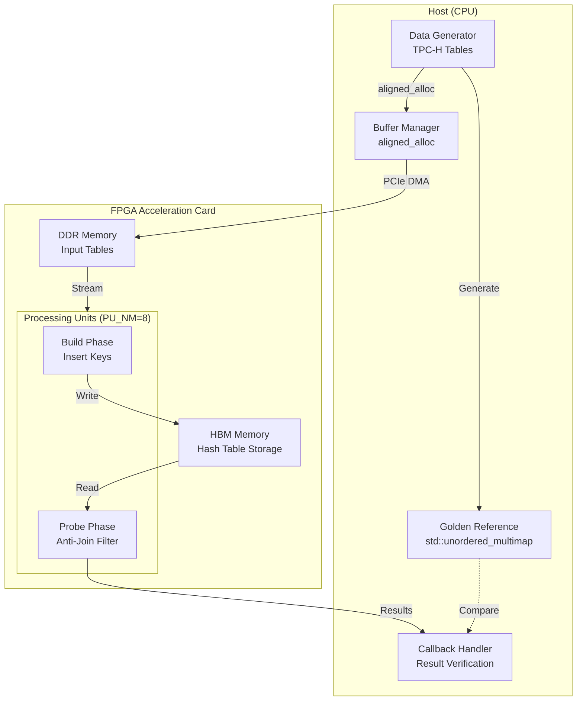

# hash_anti_join 模块深度解析

## 概述：寻找"不存在"的艺术

想象你正在管理一个电商平台的订单系统。你需要回答这样一个业务问题："哪些订单在发货表中没有对应的物流记录？"或者反过来："哪些物流单号对应的订单ID在系统中根本不存在？"这类问题在数据库领域被称为**反连接（Anti-Join）**——它寻找的不是匹配项，而是**缺失项**。

`hash_anti_join` 模块正是为 FPGA 加速的反连接操作提供的一个 Layer 1（L1）级基准测试实现。它位于数据库查询加速层的最底层，直接对接 FPGA 内核，用于验证硬件实现的哈希反连接逻辑的正确性与性能。该模块不仅是一个测试程序，更是连接软件查询规划器与硬件执行引擎的桥梁，展示了如何将复杂的关系代数操作映射到异构计算架构上。


## 架构全景：数据流与控制流

在深入代码之前，我们需要建立对系统架构的直觉。想象这个系统是一个**高精度流水线工厂**：

- **原料仓库（Host Memory）**：存放着两张表——"订单表"（Orders，作为构建表 Build Table）和"明细表"（Lineitem，作为探测表 Probe Table）。
- **高速传送带（PCIe + DDR/HBM）**：将原料从仓库运送到加工车间的缓冲区域。
- **智能加工车间（FPGA Kernel）**：内部有多个并行处理单元（PU, Processing Unit），每个单元包含一个哈希表（存储在 HBM 中）。车间的工作流程分为两个阶段：
  1. **构建阶段（Build Phase）**：将订单表的所有键值插入到哈希表中，建立一个"存在性索引"。
  2. **探测阶段（Probe Phase）**：扫描明细表，对每个记录检查其键是否存在于哈希表中。**关键逻辑**：如果**不存在**（即哈希表查找失败），则将该记录的价格信息累加到结果中。
- **质检与回传系统（Callback Mechanism）**：加工完成的结果通过另一条传送带送回仓库，并通过回调函数机制异步验证结果的正确性。



### 核心抽象层

1. **表抽象（Table）**：逻辑上的关系表被映射为连续的内存块（`col_l_orderkey`, `col_o_orderkey` 等），采用**列式存储**（Columnar Storage）以优化扫描性能。

2. **哈希表抽象（Hash Table）**：在 FPGA 侧，哈希表被实现为分区的、存储于 HBM 的链式结构。主机端使用 `std::unordered_multimap` 作为黄金参考模型，确保语义等价性。

3. **执行上下文（Execution Context）**：OpenCL 的 `cl::Context`、`cl::CommandQueue` 和 `cl::Kernel` 构成了执行的环境。通过 `CL_QUEUE_OUT_OF_ORDER_EXEC_MODE_ENABLE` 和显式的事件依赖（`cl::Event`），实现了**异步流水线执行**。


## 组件深度剖析

### 1. 数据结构定义

#### `timeval` (通过 `gettimeofday` 使用)
虽然代码中没有直接定义 `timeval` 结构体，但它通过 `<sys/time.h>` 引入，用于高精度性能计时。这是主机端性能分析的基础工具。

#### `print_buf_result_data_t` (回调数据封装)
```cpp
typedef struct print_buf_result_data_ {
    int i;              // 迭代序号
    long long* v;       // 指向 FPGA 计算结果的指针
    long long* g;       // 指向黄金参考值的指针
    int* r;             // 错误计数器指针
} print_buf_result_data_t;
```
**设计意图**：这个结构体是**异步回调机制**的核心。由于 OpenCL 的数据回传是非阻塞的，我们需要一种方式在数据传输完成后验证结果。该结构体打包了验证所需的所有上下文，作为 `user_data` 传递给回调函数 `print_buf_result`。

**生命周期警告**：`cbd` 向量必须存活到所有回调执行完毕。如果 `main` 函数在回调触发前退出，将导致 use-after-free。

### 2. 核心函数解析

#### `generate_data<T>` - 确定性测试数据生成
```cpp
template <typename T>
int generate_data(T* data, int range, size_t n);
```
**功能**：使用 `rand()` 生成模运算后的随机数，填充指定的内存区域。

**设计考量**：
- **模板化**：支持不同位宽的整数类型（`TPCH_INT`），与数据库类型的抽象对应。
- **范围控制**：通过 `range` 参数控制值的分布，模拟不同的数据倾斜（data skew）场景。
- **确定性**：虽然使用 `rand()`，但种子可由调用者控制，确保测试可重复。

**内存契约**：调用者必须确保 `data` 指向已分配且大小至少为 `n * sizeof(T)` 的内存。

#### `get_golden_sum` - CPU 参考实现
```cpp
ap_uint<64> get_golden_sum(int l_row, KEY_T* col_l_orderkey, ...);
```
这是模块的**语义锚点**。它使用 C++ 标准库的 `std::unordered_multimap` 实现了一个两阶段哈希反连接：

1. **构建阶段**：将 `Orders` 表（`col_o_orderkey`）的所有键插入到 `ht1` 中。
2. **探测阶段**：扫描 `Lineitem` 表，对每个键 `k` 执行 `ht1.equal_range(k)`。
   - 如果返回范围为空（`its.first == its.second`），说明该订单键在 Orders 表中**不存在**（对于反连接，这其实是匹配条件），累加 `extendedprice * (100 - discount)`。

**关键细节**：
- 使用 `unordered_multimap` 而非 `unordered_map` 是为了处理**重复键**（一个订单可能有多个行项目，但这里 Orders 是构建表，应该唯一，不过代码中允许重复以测试鲁棒性）。
- `ap_uint<64>` 用于匹配 FPGA 侧的位精确类型，防止溢出。
- 输出同时打印匹配行数 `cnt` 和累加和 `sum`，用于调试。

#### `main` - 完整的 FPGA 基准测试框架
这是整个模块的入口点，展示了一个生产级的 FPGA 异构计算工作流：

**阶段 1：命令行解析与配置**
- 使用 `ArgParser` 处理 `-xclbin`（内核二进制）、`-rep`（重复次数）、`-scale`（数据缩放）等参数。
- **关键约束**：`num_rep > 20` 被硬限制为 20，防止过长的测试时间或内存耗尽。
- **缩放逻辑**：`sim_scale` 线性减少输入行数，用于快速功能验证。

**阶段 2：内存分配与数据生成**
- **对齐分配**：使用 `aligned_alloc<KEY_T>(l_depth)` 确保内存地址对齐到 FPGA DMA 的要求（通常 4KB 边界）。
- **填充策略**：`l_depth = L_MAX_ROW + VEC_LEN - 1` 确保即使最后一行不足一个向量长度，也不会越界。
- **确定性生成**：调用 `generate_data` 填充 `col_l_orderkey` 等列，模拟 TPC-H 数据分布。

**阶段 3：黄金参考计算**
- 在 FPGA 执行前，先调用 `get_golden_sum` 计算 CPU 参考值，存储在 `golden` 变量中。

**阶段 4：OpenCL 初始化（非 HLS_TEST 模式）**
- **设备发现**：`xcl::get_xil_devices()` 枚举 Xilinx FPGA 设备。
- **上下文与队列**：创建 `cl::Context` 和 `cl::CommandQueue`，启用 `CL_QUEUE_OUT_OF_ORDER_EXEC_MODE_ENABLE` 和 `CL_QUEUE_PROFILING_ENABLE`，支持乱序执行和性能分析。
- **程序加载**：`xcl::import_binary_file` 加载编译好的 `.xclbin` 文件，创建 `cl::Program` 和 `cl::Kernel`。

**阶段 5：内存映射与缓冲区创建**
- **扩展指针**：使用 `cl_mem_ext_ptr_t` 结构将主机内存映射到 FPGA 的特定内存银行（bank）。例如 `{0, col_o_orderkey, kernel0()}` 表示将 `col_o_orderkey` 映射到索引 0 的内存银行。
- **缓冲区类型**：
  - `CL_MEM_USE_HOST_PTR`：零拷贝，直接使用主机内存（需物理连续或对齐）。
  - `CL_MEM_COPY_HOST_PTR`：显式拷贝到设备内存。
  - `CL_MEM_EXT_PTR_XILINX`：Xilinx 扩展，指定内存银行位置。
- **HBM 缓冲区**：`buf_ht` 和 `buf_s` 是 FPGA 内部处理单元使用的临时存储，映射到 HBM（High Bandwidth Memory）的特定银行（索引 7-22）。

**阶段 6：流水线执行（核心逻辑）**
这是整个模块最精妙的部分，展示了异构计算的**双缓冲（Double Buffering）**技术：

```
时间轴: ---------------------------------------------------------->

迭代 0:  [W0: 写数据A]----->[K0: 内核执行A]----->[R0: 读结果A]
迭代 1:              [W1: 写数据B]----->[K1: 内核执行B]----->[R1: 读结果B]
迭代 2:                       [W2: 写数据A]----->[K2: 内核执行A]----->[R2: 读结果A]
```

- **W (Write)**: `enqueueMigrateMemObjects` 将输入数据从主机内存迁移到 FPGA DDR。
- **K (Kernel)**: `enqueueTask` 启动 `join_kernel` 执行实际的哈希反连接计算。
- **R (Read)**: 将结果从 FPGA 读回主机内存。

**关键设计点**：
- **事件链**：每个操作依赖前一个操作的事件。例如 `kernel_events[i]` 依赖 `write_events[i]`，确保数据到达后才执行内核。
- **双缓冲交替**：`use_a = i & 1` 决定当前迭代使用缓冲区集合 A 还是 B。当内核在 A 上计算时，主机可以并行准备 B 的数据。
- **读-写重叠**：`write_events[i]` 明确依赖 `read_events[i-2]`（而非 `i-1`），允许读取操作 N-2 与写入操作 N 重叠，进一步隐藏延迟。

**阶段 7：异步回调验证**
不同于传统的阻塞式 `clEnqueueReadBuffer`，此模块使用**回调机制**进行结果验证：
- `read_events[i][0].setCallback(CL_COMPLETE, print_buf_result, cbd_ptr + i)` 注册了一个回调函数。
- 当 FPGA 完成数据回传（`CL_COMPLETE` 状态），OpenCL 运行时自动调用 `print_buf_result`。
- 回调函数比较 FPGA 结果 (`d->v`) 与 CPU 黄金参考 (`d->g`)，更新错误计数器 (`d->r`)。

**生命周期管理**：`cbd` 向量在堆上分配，且 `main` 函数通过 `q.finish()` 确保所有回调完成前不会退出，避免悬垂指针。

**阶段 8：性能分析与清理**
- 使用 `gettimeofday` 测量端到端主机时间。
- 使用 `clGetEventProfilingInfo` 获取内核实际执行时间（纳秒级精度）。
- 打印每次迭代的执行时间，便于分析流水线效率。


## 依赖关系与数据契约

### 上游依赖（谁调用我）

此模块是一个**终端基准测试程序**（executable），通常不由其他库调用，而是通过命令行直接执行。但在 CI/CD 或自动化测试框架中，它可能被以下调用：
- 自动化回归测试脚本（调用特定 `-xclbin` 和 `-rep` 参数）
- 性能基准套件（遍历不同 `-scale` 参数）

### 下游依赖（我调用谁）

| 依赖项 | 类型 | 契约描述 |
|--------|------|----------|
| `join_kernel` (FPGA) | 内核二进制 | 通过 `xclbin` 加载，期望特定的参数签名：8个 HBM 哈希表缓冲区、8个 HBM 临时缓冲区、输入列指针等。参数顺序和类型必须严格匹配，否则导致未定义行为。 |
| `xf::common::utils_sw::Logger` | 库 | 用于标准化日志输出，期望特定消息枚举（`TEST_PASS`, `TEST_FAIL`）。 |
| `xcl2` | 工具库 | Xilinx OpenCL 封装库，提供 `get_xil_devices`, `import_binary_file` 等便利函数。要求特定的环境变量（如 `XCL_EMULATION_MODE`）在仿真模式下正常工作。 |
| `ArgParser` | 工具类 | 命令行参数解析器，期望特定格式的参数（`-xclbin`, `-rep`, `-scale`）。 |

### 数据契约与隐式假设

1. **内存对齐要求**：所有主机缓冲区必须通过 `aligned_alloc` 分配，对齐要求通常为 4KB（Xilinx FPGA DMA 要求）。未对齐的缓冲区将导致 `CL_INVALID_VALUE` 或数据损坏。

2. **行数约束**：`L_MAX_ROW` 和 `O_MAX_ROW` 定义了编译时常量。运行时通过 `sim_scale` 缩放，但必须保证 `l_nrow` 和 `o_nrow` 为正整数，否则内核会空转或死锁。

3. **向量长度对齐**：内核处理数据是以 `VEC_LEN`（通常为 4 或 8）为单位的向量。主机分配的缓冲区大小必须是 `(ROW_COUNT + VEC_LEN - 1) * ELEMENT_SIZE`，确保最后一向量不会越界。

4. **内存银行映射**：`cl_mem_ext_ptr_t` 中的索引（0, 2, 3, 4, 7-15, 23）对应 FPGA 内存拓扑中的特定 DDR/HBM 银行。这些索引必须与内核连接配置文件（`connectivity.cfg`）中的 SP 映射一致。更改索引而不更新内核配置将导致运行时错误或数据竞争。

5. **回调数据生命周期**：`print_buf_result_data_t` 结构体通过指针传递给 OpenCL 回调函数。OpenCL 规范保证回调在事件完成时触发，但不保证在 `clFinish` 返回前完成。因此，`cbd` 向量必须在 `q.finish()` 之后才能销毁。


## 设计决策与权衡分析

### 1. 双缓冲（Ping-Pong）vs. 单缓冲

**决策**：实现完整的双缓冲机制，维护两套独立的输入/输出缓冲区（A/B 集合）。

**理由**：
- **延迟隐藏**：PCIe 数据传输（~10-20 GB/s）远慢于 FPGA 计算（数百 GB/s 内存带宽）。双缓冲允许在计算迭代 N 的同时，传输迭代 N+1 的数据，理论上可将 PCIe 延迟完全隐藏。
- **吞吐量提升**：在重复执行基准测试（`-rep > 1`）时，双缓冲使得内核执行可以流水线化，整体吞吐量接近理论峰值。

**权衡与代价**：
- **内存占用翻倍**：需要分配两倍的主机内存（两套缓冲区）和 FPGA DDR 内存。对于大表（TPC-H 100G+），这可能超出可用内存。
- **代码复杂度**：需要管理两套缓冲区的事件依赖关系，容易在事件链（`write_events[i]` 依赖 `read_events[i-2]`）中引入死锁或竞争条件。
- **启动/排空延迟**：流水线填充和排空阶段仍有空闲时间，对于少量重复（`-rep=2`），双缓冲的收益有限。

**替代方案**：单缓冲（阻塞式）实现更简单，适用于一次性执行或内存受限场景，但会暴露 PCIe 延迟。


### 2. 回调验证 vs. 同步轮询

**决策**：使用 OpenCL 事件回调（`clSetEventCallback`）进行异步结果验证。

**理由**：
- **非阻塞主机**：回调机制允许主机在提交所有读写请求后立即继续（或进入休眠），无需为每次迭代调用 `clWaitForEvents` 或 `clFinish`，提高了主机线程的利用率。
- **流水线友好**：回调在数据传输完成时触发，与内核执行重叠，不会阻塞后续内核启动。

**权衡与代价**：
- **生命周期复杂性**：回调可能在 `main` 函数退出后执行（如果 `q.finish()` 未正确调用），导致访问已释放的栈内存。必须仔细管理 `cbd` 向量的堆生命周期。
- **调试困难**：异步回调中的断言失败或段错误难以追踪，因为堆栈回溯指向 OpenCL 运行时线程而非主线程。
- **回调开销**：虽然单次回调开销低，但在高频小数据传输场景下，回调注册和触发的开销可能超过同步等待。

**替代方案**：同步 `clEnqueueReadBuffer` 配合阻塞标志（`CL_TRUE`）实现简单，但会阻塞主机线程直到数据传输完成，无法重叠计算。


### 3. 内存分配策略：对齐与分离

**决策**：
1. 使用 `aligned_alloc` 分配主机内存，确保 4KB（或更高）对齐。
2. 输入表（Orders, Lineitem）存储在 DDR，哈希表存储在 HBM。

**理由**：
- **DMA 效率**：Xilinx FPGA 的 DMA 引擎要求源/目的地址对齐到数据宽度（通常为 64 字节或 4KB）。未对齐的内存需要额外的复制操作（bounce buffer），严重降低 PCIe 带宽。
- **内存层次利用**：DDR 容量大但带宽相对较低，适合顺序扫描的大表（Lineitem）。HBM 带宽极高但容量有限，适合随机访问的哈希表结构。这种分离最大化了硬件利用率。

**权衡与代价**：
- **分配器依赖**：`aligned_alloc` 是 C11 标准，在某些旧编译器或嵌入式环境中可能不可用，需要回退到 `posix_memalign`。
- **内存碎片**：严格的对齐要求可能导致内存碎片，特别是在分配大量小缓冲区时。
- **复杂性**：管理两套内存（DDR + HBM）需要维护两套缓冲区对象（`buf_l_orderkey_a` vs `buf_ht[i]`），增加了代码复杂度。

**替代方案**：使用标准 `malloc` 配合运行时复制到对齐缓冲区（由 OpenCL 运行时管理），但这会引入不可控的延迟和额外的内存拷贝。


### 4. 模块化与条件编译

**决策**：使用 `#ifdef HLS_TEST` 宏区分 HLS 仿真模式与硬件执行模式。

**理由**：
- **开发效率**：允许在没有 FPGA 硬件的情况下使用 Vitis HLS 进行算法验证和调试，加速迭代。
- **代码复用**：核心业务逻辑（数据生成、结果验证）在两种模式下共享，避免维护两份代码。

**权衡与代价**：
- **代码混乱**：大量的 `#ifdef` 块使代码难以阅读，破坏了控制流的连续性。
- **行为差异风险**：HLS 仿真通常使用 C++ 原生指针和数组，而硬件模式使用 OpenCL 缓冲区抽象。如果内存访问模式在两种模式下不一致（例如，HLS 模式未模拟 HBM 延迟），可能导致仿真通过但硬件失败。
- **测试覆盖盲区**：通常只测试硬件模式或只测试 HLS 模式，难以保证两者完全等价。

**替代方案**：将硬件相关代码抽象到一个独立的 HAL（硬件抽象层）类中，在 HLS 模式下使用模拟实现，但这会增加类的设计复杂度。


## 关键实现细节与陷阱

### 1. 双缓冲索引逻辑

代码使用 `int use_a = i & 1;` 来决定使用 A 缓冲区（偶数迭代）还是 B 缓冲区（奇数迭代）。

**陷阱**：如果 `num_rep` 是奇数，最后一次迭代使用的是 A 缓冲区，而主机可能在清理阶段错误地释放 B 缓冲区，导致在回调中访问已释放内存。确保 `cbd` 向量包含所有迭代的数据，无论奇偶。

### 2. 事件依赖链的死锁风险

写入事件 `write_events[i]` 明确依赖 `read_events[i-2]`（当 `i > 1` 时）：
```cpp
if (i > 1) {
    q.enqueueMigrateMemObjects(ib, 0, &read_events[i - 2], &write_events[i][0]);
}
```

**意图**：确保在重用缓冲区 A/B 之前，前两次迭代的结果已经从该缓冲区读取完毕（避免读写竞争）。

**陷阱**：如果 `num_rep < 3`，`i > 1` 的条件确保不会访问负索引。但如果事件数组初始化错误（如 `read_events` 的大小不等于 `num_rep`），将导致越界访问。

### 3. 内存银行索引的硬编码

`cl_mem_ext_ptr_t` 中的索引（0, 2, 3, 4, 7-15, 23）对应 FPGA 内存拓扑中的特定物理位置：
- 0, 2, 3, 4: 通常映射到 DDR 银行
- 7-14: 映射到 HBM 银行（PU 0-7 的哈希表）
- 15: 可能用于其他临时存储
- 23: 结果缓冲区

**陷阱**：这些索引必须与内核连接配置文件（`connectivity.ini` 或 Vitis 链接阶段的 `--sp` 选项）严格一致。如果修改了索引但未更新内核的 `.cfg` 文件，OpenCL 运行时将无法找到对应的物理内存，导致 `CL_INVALID_VALUE` 或静默的数据错误。

### 4. 缩放因子的整数除法陷阱

```cpp
int sim_scale = 1;
// ... 解析参数 ...
int l_nrow = L_MAX_ROW / sim_scale;
int o_nrow = O_MAX_ROW / sim_scale;
```

**陷阱**：如果用户传入 `-scale 0`（虽然代码中有 `try-catch`，但 `stoi` 可能成功解析 "0"），或者 `sim_scale` 大于 `L_MAX_ROW`，整数除法将产生 0。向 FPGA 传递 0 行数据可能导致内核挂起（如果内核未处理空输入）或返回未初始化的垃圾数据。

**缓解**：代码中没有显式检查 `l_nrow > 0`，这是潜在的风险点。生产代码应添加 `if (l_nrow == 0) return error;`。

### 5. 回调中的浮点/定点转换

```cpp
printf("FPGA result %d: %lld.%lld\n", d->i, *(d->v) / 10000, *(d->v) % 10000);
```

**细节**：数据库中的货币类型（`MONEY_T`）通常以定点数（fixed-point）形式存储，例如将金额乘以 10000 转为整数，避免浮点精度问题。回调函数中的除法和取模操作将定点数转换回十进制表示（元.分）。

**陷阱**：如果 `golden` 计算也使用定点数，必须确保两者的定点精度一致（都是 4 位小数）。如果一方使用浮点 `double` 累加，由于浮点精度损失，比较可能失败（`(*(d->g)) != (*(d->v))`）。


## 使用指南与扩展建议

### 基本用法

编译并运行基准测试：
```bash
# 编译（示例，实际依赖 Xilinx Vitis 环境）
g++ -std=c++11 -I$XILINX_XRT/include -L$XILINX_XRT/lib -o test_join test_join.cpp -lOpenCL -lpthread

# 运行硬件测试
./test_join -xclbin ./join_kernel.hw.xclbin -rep 10 -scale 10

# 运行 HLS 仿真（需定义 HLS_TEST 宏）
./test_join_hls -scale 100
```

**参数说明**：
- `-xclbin <path>`: FPGA 内核二进制文件路径（硬件模式必需）。
- `-rep <n>`: 重复执行次数（1-20），用于统计平均性能。
- `-scale <n>`: 数据缩放因子，将默认行数除以 n。用于快速测试或小规模验证。

### 修改与扩展

#### 1. 添加新的数据类型支持
当前实现硬编码了 `TPCH_INT` 和 `MONEY_T`。要支持新的数据类型（如 `DATE_T`）：
1. 在 `table_dt.hpp`（通过 `include` 引入）中定义新的类型别名。
2. 修改 `generate_data` 模板调用的类型参数。
3. 确保 FPGA 内核的 `join_kernel` 签名与新的缓冲区类型兼容（位宽匹配）。

#### 2. 集成到更大的查询处理流程
当前模块是独立的基准测试。要将其集成到 SQL 引擎中作为算子实现：
1. **抽象缓冲区管理**：将 `aligned_alloc` 和 `cl::Buffer` 封装为 `DeviceBuffer` 类，支持引用计数或 RAII 释放。
2. **参数化内核接口**：将硬编码的列指针（`col_l_orderkey` 等）改为动态传递的 `void*` 或模板参数，支持任意列绑定。
3. **结果集处理**：当前结果是一个标量累加值（`sum`）。扩展为返回匹配行的 ID 列表（需要增加输出缓冲区并处理变长结果）。

#### 3. 支持多卡或多节点扩展
当前实现针对单 FPGA 卡。扩展到多卡：
1. **设备枚举**：遍历 `devices` 向量，为每个设备创建独立的 `context`、`queue` 和 `kernel` 对象。
2. **数据分区**：将 `Lineitem` 表按行范围分区（如卡 0 处理 0-N/2，卡 1 处理 N/2-N），每个卡拥有完整的 `Orders` 表（广播）或子集（需分区哈希）。
3. **结果聚合**：收集各卡的局部和，在主机端累加为最终全局和。


## 性能调优与故障排查

### 性能优化建议

1. **最大化 PCIe 带宽**：
   - 确保使用 `CL_MEM_USE_HOST_PTR` 而非 `CL_MEM_ALLOC_HOST_PTR`，避免额外的内存拷贝。
   - 验证主机内存是否位于 CPU 的 NUMA 节点上，且与 FPGA 所在 NUMA 节点通过 QPI/UPI 连接最优。

2. **内核流水线优化**：
   - 调整 `-rep` 参数观察吞吐量变化。如果 `-rep=10` 的平均时间远小于单次执行时间，说明双缓冲有效。
   - 如果增加 `-rep` 没有提升吞吐量，检查 `write_events[i-2]` 依赖是否过于保守，或内核是否已受限于计算而非内存带宽。

3. **数据缩放与局部性**：
   - 使用 `-scale` 测试不同数据规模。观察执行时间是否随数据量线性增长，以判断算法复杂度是否符合预期（O(N+M)）。
   - 如果小数据（`-scale 100`）性能极差（相对于大数据），可能是内核启动开销主导，适合批处理小查询。

### 常见故障排查

| 症状 | 可能原因 | 排查步骤 |
|------|----------|----------|
| `CL_INVALID_VALUE` 在创建缓冲区 | 内存未对齐或指针为 NULL | 检查 `aligned_alloc` 返回值；验证 `cl_mem_ext_ptr_t` 的 `flags` 设置 |
| `CL_OUT_OF_RESOURCES` | FPGA 内存不足或银行冲突 | 检查 `xclbin` 的内存拓扑；确认 `ht_hbm_size` 和 `s_hbm_size` 计算正确；减少 `PU_HT_DEPTH` |
| 结果验证失败（`Result Error`）但偶尔通过 | 数据竞争或事件依赖错误 | 检查 `write_events[i]` 是否正确依赖 `read_events[i-2]`；验证 `use_a` 切换逻辑；检查回调函数是否线程安全 |
| 内核挂起（无输出，需强制终止） | 死锁在 OpenCL 队列或内核内部死循环 | 检查 `o_nrow` 或 `l_nrow` 是否为 0（可能导致内核空转）；验证 `k_bucket` 参数非零；检查 HBM 访问是否越界（地址计算错误） |
| 性能远低于预期 | PCIe 带宽瓶颈或内核未流水线化 | 检查是否使用 `USE_HOST_PTR`；确认 NUMA 亲和性；检查 `num_rep` 是否足够大以摊销启动开销；使用 `nvidia-smi` 类似工具（`xbutil`）检查 FPGA 温度和功耗 |


## 总结

`hash_anti_join` 模块是一个**生产级的 FPGA 异构计算基准测试**，它超越了简单的功能验证，深入展示了如何在高性能数据库加速中管理内存、调度和数据流。其核心设计——双缓冲流水线、异步回调验证、严格的对齐和内存银行管理——代表了 FPGA 加速计算的最佳实践。

对于新加入团队的开发者，理解此模块的关键在于把握**延迟隐藏**与**资源占用**之间的张力：双缓冲用内存换时间，HBM 用容量换带宽，回调用复杂度换取主机并发。这些权衡在数据库查询优化和硬件协同设计中反复出现，构成了异构计算架构设计的核心思维模型。

通过深入理解此模块，开发者不仅掌握了一个具体的反连接实现，更获得了一套可复用的 FPGA 应用开发范式：从内存对齐的底层细节，到流水线调度的中层逻辑，再到异步验证的高层架构。
