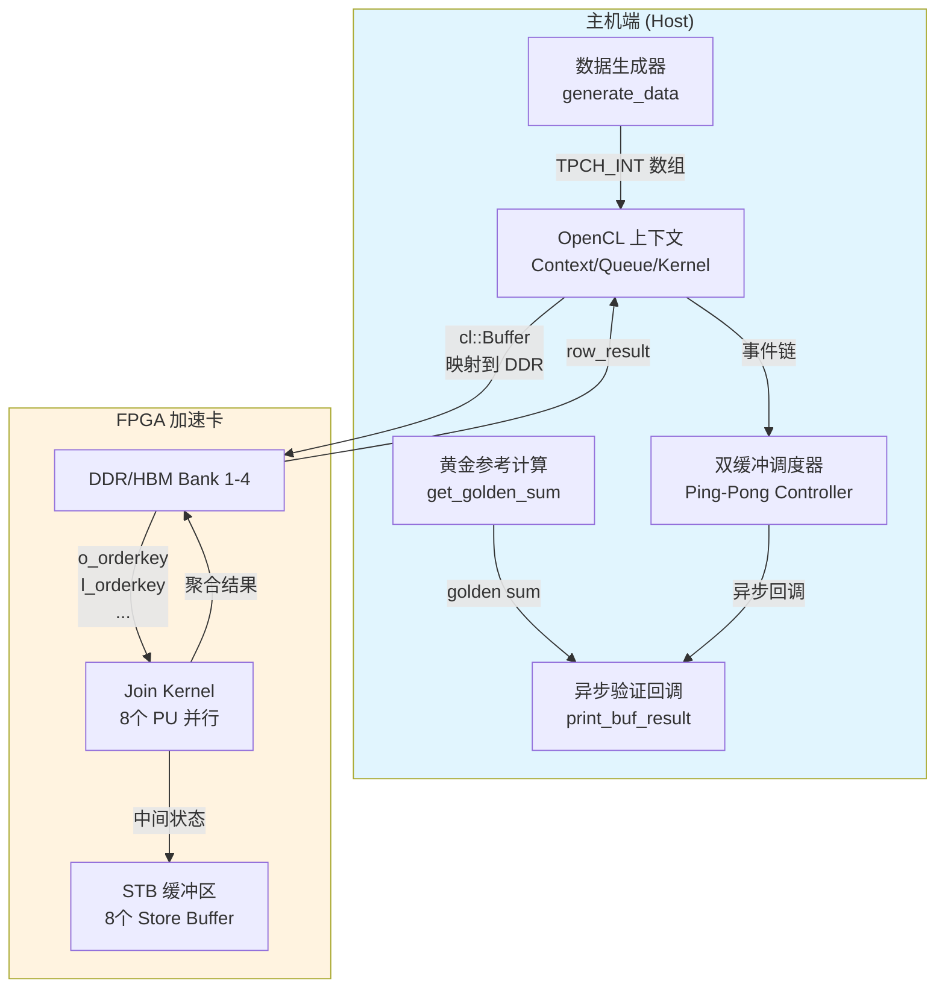

# hash_join_v2_host 模块技术深度解析

> **目标读者**：刚加入团队的资深工程师，已具备 C++/OpenCL 基础，需要理解设计意图、架构角色和非显而易见的设计选择背后的"为什么"。

---

## 一、30 秒速览：这个模块是什么？

想象你正在运营一个大型仓库（FPGA 加速卡），需要频繁地将两个巨大的货物清单进行匹配——比如"订单表"和"明细表"。传统做法是让 CPU 逐行比对，但当数据量达到千万级时，这就像让一个人手工核对整个仓库的库存。

`hash_join_v2_host` 是这个仓库的**调度指挥中心**。它不亲自做匹配（那是 FPGA 内核的工作），而是负责：
- 准备货物清单（生成/加载测试数据）
- 开辟临时堆放区（分配 FPGA 内存缓冲区）
- 协调搬运工的班次（通过双缓冲隐藏传输延迟）
- 核对结果准确性（与 CPU 参考实现对比）

**核心定位**：这是一个**FPGA 加速哈希连接算子的主机端基准测试驱动程序**，实现了 TPC-H 风格的 Lineitem-Orders 表连接。

---

## 二、问题空间与设计洞察

### 2.1 我们面对什么挑战？

在数据库加速领域，哈希连接是最核心的算子之一。直接将 CPU 算法映射到 FPGA 会遭遇三大困境：

| 挑战 | 具体表现 | 设计回应 |
|------|---------|---------|
| **内存墙** | FPGA 片上内存有限，无法容纳大规模哈希表 | 分片处理 + HBM/DRAM 分级存储 |
| **流水线气泡** | 数据传输与计算串行执行导致 FPGA 空闲 | **双缓冲 (Ping-Pong)** 实现传输与计算重叠 |
| **验证困境** | FPGA 结果难以调试，错误定位困难 | 引入 **Golden Reference** 机制，CPU 与 FPGA 结果逐行比对 |

### 2.2 核心设计洞察

**洞察 1：主机端是"编排者"而非"执行者"**

代码中最长的函数 `main()` 约有 400 行，但其中**零行**实际执行哈希连接逻辑。所有计算都委托给 `join_kernel`（FPGA 内核）。主机端的价值在于：
- **时序 orchestration**：通过 OpenCL 事件链精确控制数据流动
- **资源 reservation**：内存缓冲区预分配与 Bank 优化映射
- **验证 orchestration**：异步回调验证结果正确性

**洞察 2：双缓冲是隐藏延迟的"时间折叠"技术**

观察代码中的 `use_a = i & 1` 逻辑——这是典型的 Ping-Pong 调度。想象两个舞台（缓冲区 A/B）：当 FPGA 在舞台 A 表演（计算）时，工作人员在舞台 B 布置下一场戏的道具（数据传输），两者完全并行。

**洞察 3：STB (Store Buffer) 是 FPGA 内核的"草稿纸"**

代码中神秘的 `stb_buf[PU_NM]`（PU_NM=8）并非给主机端使用，而是 FPGA 内核的**临时工作区**。哈希连接过程中，FPGA 需要频繁记录中间状态（如冲突链表），这些 STB 缓冲区就是它的"草稿纸"。主机端只是负责"购买纸张"（分配内存）并"送到 FPGA 桌上"（映射到特定 DDR Bank）。

---

## 三、架构全景与数据流

### 3.1 架构图



### 3.2 核心组件职责

| 组件 | 类型 | 核心职责 | 关键设计决策 |
|------|------|---------|-------------|
| `generate_data` | 函数 | 生成符合 TPC-H 分布的合成测试数据 | 使用 `rand()` 而非复杂分布生成器，追求速度而非真实度 |
| `get_golden_sum` | 函数 | CPU 端参考实现，使用 `std::unordered_multimap` 构建哈希表并计算聚合结果 | 采用 multimap 而非自定义哈希，确保语义正确性优先于性能 |
| `print_buf_result` | 回调函数 | OpenCL 事件回调，在数据传输完成后异步验证 FPGA 结果与 Golden 结果的一致性 | 异步回调设计避免阻塞主机线程，实现流水线最大化 |
| `main` | 主函数 | OpenCL 上下文管理、双缓冲调度、事件链编排、性能统计 | 约 400 行代码集中体现"编排者"设计哲学 |

---

## 四、数据流的时空之旅

让我们追踪一次完整的执行流程，理解数据是如何在主机-设备之间"流动"的。

### 4.1 阶段一：战前准备（初始化）

```cpp
// 1. 主机内存分配 - 使用 aligned_alloc 确保 DMA 友好
KEY_T* col_l_orderkey = aligned_alloc<KEY_T>(l_depth);
MONEY_T* col_l_extendedprice = aligned_alloc<MONEY_T>(l_depth);
// ... 共 6 个主要数据缓冲区

// 2. STB 缓冲区分配 - FPGA 的"草稿纸"
ap_uint<8 * KEY_SZ>* stb_buf[PU_NM];  // 8 个处理单元，每个一个 STB
for (int i = 0; i < PU_NM; i++) {
    stb_buf[i] = aligned_alloc<ap_uint<8 * KEY_SZ> >(BUFF_DEPTH);
}
```

**设计要点**：
- `aligned_alloc` 确保内存地址对齐到页边界，这是 Xilinx DMA 引擎的要求
- STB 缓冲区虽然在主机端分配，但完全由 FPGA 内核使用——主机端只是"房东"

### 4.2 阶段二：数据播种（数据生成）

```cpp
// 生成合成数据 - 模拟 TPC-H 表
err = generate_data<TPCH_INT>(col_l_orderkey, 100000, l_nrow);      // 范围 1-100000
err = generate_data<TPCH_INT>(col_l_extendedprice, 10000000, l_nrow); // 价格范围
err = generate_data<TPCH_INT>(col_l_discount, 10, l_nrow);           // 折扣 1-10
```

**设计权衡**：使用简单的 `rand() % range` 而非 TPC-H 官方的数据分布生成器。这是因为：
- 目标是测试**硬件加速路径**的正确性，而非查询优化器的鲁棒性
- 简单分布足以触发哈希冲突、桶溢出等边界情况
- 生成速度快，便于大规模回归测试

### 4.3 阶段三：黄金标准计算（CPU 参考实现）

```cpp
long long golden = get_golden_sum(l_nrow, col_l_orderkey, col_l_extendedprice, 
                                   col_l_discount, o_nrow, col_o_orderkey);
```

内部实现：
```cpp
// 使用 std::unordered_multimap 构建哈希表 - "正确性优先"的选择
std::unordered_multimap<uint32_t, uint32_t> ht1;
for (int i = 0; i < o_row; ++i) {
    ht1.insert(std::make_pair(col_o_orderkey[i], 0));  // Orders 表构建哈希表
}

// 探测阶段
for (int i = 0; i < l_row; ++i) {
    auto its = ht1.equal_range(col_l_orderkey[i]);  // 查找匹配
    for (auto it = its.first; it != its.second; ++it) {
        sum += (price * (100 - discount));  // 聚合计算
    }
}
```

**关键设计决策**：
- 使用 `unordered_multimap` 而非自定义哈希表——我们**不是在优化 CPU 性能**，而是在构建一个**可信赖的参考基准**
- 采用 multimap 是因为 TPC-H 语义可能存在重复键（一个订单对应多个明细行）
- 这个结果 `golden` 将成为 FPGA 结果的"裁判"

### 4.4 阶段四：双缓冲执行流水线（核心调度逻辑）

这是 `hash_join_v2_host` 的**精髓所在**。让我们详细展开：

```cpp
// 执行 num_rep 轮，每轮使用 A/B 缓冲区交替
for (int i = 0; i < num_rep; ++i) {
    int use_a = i & 1;  // 奇偶决定使用 A 还是 B 缓冲区
```

**时间折叠的视觉化**：

```
时间轴 ->

轮次 0 (use_a=1, 缓冲区 A):
  [W0: 写数据到 A]----->[K0: 内核执行]----->[R0: 读结果]
                          
轮次 1 (use_a=0, 缓冲区 B):
                         [W1: 写数据到 B]----->[K1: 内核执行]----->[R1: 读结果]
                         
轮次 2 (use_a=1, 缓冲区 A - 复用):
                                                [W2: 写数据到 A]----->[K2: 内核执行]...
```

注意关键优化：**写操作 (W1) 与上一轮的内核执行 (K0) 和读操作 (R0) 并行进行**。

**事件链的精确编排**：

```cpp
// 写操作依赖于前前一轮的读完成（形成流水线依赖链）
if (i > 1) {
    q.enqueueMigrateMemObjects(ib, 0, &read_events[i - 2], &write_events[i][0]);
} else {
    q.enqueueMigrateMemObjects(ib, 0, nullptr, &write_events[i][0]);
}

// 内核执行依赖于写完成
q.enqueueTask(kernel0, &write_events[i], &kernel_events[i][0]);

// 读操作依赖于内核完成
q.enqueueMigrateMemObjects(ob, CL_MIGRATE_MEM_OBJECT_HOST, &kernel_events[i], &read_events[i][0]);
```

这是一个**生产者-消费者流水线**的 OpenCL 事件实现。`write_events[i-2]` 作为依赖意味着：第 $i$ 轮的写操作必须等待第 $i-2$ 轮的读操作完成——这保证了双缓冲区的正确复用（避免读写冲突）。

### 4.5 阶段五：异步验证与回调机制

```cpp
// 设置异步回调，在数据传输完成后验证结果
read_events[i][0].setCallback(CL_COMPLETE, print_buf_result, cbd_ptr + i);
```

**回调函数的实现**：

```cpp
void CL_CALLBACK print_buf_result(cl_event event, cl_int cmd_exec_status, void* user_data) {
    print_buf_result_data_t* d = (print_buf_result_data_t*)user_data;
    
    // 比较 FPGA 结果与 Golden 结果
    if ((*(d->g)) != (*(d->v))) (*(d->r))++;
    
    printf("FPGA result %d: %lld.%lld\n", d->i, *(d->v) / 10000, *(d->v) % 10000);
    printf("Golden result %d: %lld.%lld\n", d->i, *(d->g) / 10000, *(d->g) % 10000);
}
```

**设计考量**：
- **异步验证**：不阻塞主机线程，最大化流水线效率
- **逐轮验证**：每轮迭代都有独立的结果验证
- **精度处理**：结果使用定点数表示（除以 10000 得到小数部分），这是 TPC-H 货币类型的典型表示

---

## 五、内存模型与所有权架构

### 5.1 缓冲区所有权图谱

```
主机内存 (Host Memory)
│
├─ col_l_orderkey[A/B] ──────┐
├─ col_l_extendedprice[A/B] ──┤── 输入表缓冲区 (Input Table Buffers)
├─ col_l_discount[A/B] ──────┤   所有权：主机分配，DMA 传输后借给 FPGA
├─ col_o_orderkey[A/B] ──────┘   生命周期：整个 main() 函数
│
├─ row_result[A/B] ──────────── 输出结果缓冲区
│                              所有权：主机分配，FPGA 写入后主机读取
│
└─ stb_buf[0..7] ────────────── STB (Store Buffer) 数组
                               所有权：主机分配，完全由 FPGA 内核使用
                               特殊：映射到特定 DDR Bank 以优化带宽
```

### 5.2 内存分配策略深度解析

**输入表缓冲区：对齐分配的 DMA 友好设计**

```cpp
// 使用 aligned_alloc 而非 malloc/new
KEY_T* col_l_orderkey = aligned_alloc<KEY_T>(l_depth);
```

**为什么必须对齐？** 这涉及 DMA（直接内存访问）的硬件约束：
- Xilinx XDMA 引擎要求源/目的地址按缓存行（通常 64 字节）对齐
- 未对齐的地址会触发驱动层的额外拷贝，抵消零拷贝 (zero-copy) 的优势
- `aligned_alloc` 保证地址对齐到页边界 (4KB)，满足最严格的 DMA 要求

**所有权转移的精确时点**：

```cpp
// 创建 cl::Buffer 对象时，所有权概念发生变化
cl::Buffer buf_l_orderkey_a(
    context, 
    CL_MEM_EXT_PTR_XILINX | CL_MEM_USE_HOST_PTR | CL_MEM_READ_ONLY,
    (size_t)(KEY_SZ * l_depth), 
    &mext_l_orderkey  // 指向主机内存的扩展指针
);
```

- **分配者 (Allocator)**：主机代码通过 `aligned_alloc`
- **所有者 (Owner)**：主机代码负责最终 `free`
- **借用者 (Borrower)**：`cl::Buffer` 对象在内核执行期间借用主机内存，通过 `CL_MEM_USE_HOST_PTR` 实现零拷贝映射

### 5.3 STB (Store Buffer) 的特殊地位

STB 缓冲区是 `hash_join_v2_host` 中最容易被误解的组件：

```cpp
const int PU_NM = 8;
ap_uint<8 * KEY_SZ>* stb_buf[PU_NM];
for (int i = 0; i < PU_NM; i++) {
    stb_buf[i] = aligned_alloc<ap_uint<8 * KEY_SZ> >(BUFF_DEPTH);
}
```

**关键认知**：STB 缓冲区**纯粹是 FPGA 内核的工作内存**，主机端既不写入也不读取它们。

它们的作用：
- 哈希连接过程中，当多个键映射到同一个哈希桶时，需要链表存储冲突项
- FPGA 无法动态分配内存，因此需要预分配的 STB 作为"溢出区"
- 8 个 STB 对应 8 个 Processing Units (PU)，每个 PU 独立处理数据分区

**Bank 映射的精妙设计**：

```cpp
// HBM 模式：每个 STB 映射到独立的 HBM Bank
memExt[0].flags = XCL_BANK(5);   // HBM Bank 5
memExt[1].flags = XCL_BANK(6);   // HBM Bank 6
// ... 以此类推

// DDR 模式：STB 分散到多个 DDR 控制器
memExt[0].flags = XCL_MEM_DDR_BANK1;
memExt[1].flags = XCL_MEM_DDR_BANK1;
memExt[2].flags = XCL_MEM_DDR_BANK2;
// ...
```

**为什么分散到不同 Bank？** 这是内存并行性的关键：
- HBM 有 32 个独立 Bank，可以同时服务 32 个访问请求
- 将 8 个 STB 分散到不同 Bank，确保 8 个 PU 同时读写时不会争用内存控制器
- 如果所有 STB 映射到同一 Bank，性能将受限于 Bank 的串行访问

---

## 六、并发模型与事件驱动架构

### 6.1 OpenCL 事件链的精确编排

`hash_join_v2_host` 的核心复杂度在于**使用 OpenCL 事件构建复杂的依赖图**。这不是简单的顺序执行，而是精心设计的流水线。

**事件依赖图的可视化**（以 4 轮迭代为例）：

```
时间轴 ->

W0: 写操作(第0轮, 缓冲区A) ───────────────────────────────────────────────┐
                                                                           │
K0: 内核执行(第0轮, 缓冲区A) ───────────────────────────────┐              │
     ^ 依赖 W0                                              │              │
R0: 读操作(第0轮, 缓冲区A) ────────────────┐                │              │
     ^ 依赖 K0                             │                │              │
[回调: 验证结果]                           │                │              │
                                           │                │              │
W1: 写操作(第1轮, 缓冲区B) ────┐           │                │              │
     ^ 依赖 R0 (i>1条件)      │           │                │              │
                               │           │                │              │
K1: 内核执行(第1轮, 缓冲区B) ──┼───────────┼────────────────┘              │
                               │           │                               │
R1: 读操作(第1轮, 缓冲区B) ────┼───────────┘                               │
                               │                                            │
W2: 写操作(第2轮, 缓冲区A) ────┘  <-- 注意：复用了缓冲区A！               │
     ^ 依赖 R0 (因为 i=2, i-2=0)                                            │
                                                                            │
... 以此类推 ...                                                            │
                                                                            │
关键洞察：W2 必须在 R0 之后执行，因为两者使用同一个缓冲区A！<---------------┘
```

**代码中的依赖表达**：

```cpp
// 写操作依赖于前前一轮的读完成（确保缓冲区可用）
if (i > 1) {
    q.enqueueMigrateMemObjects(ib, 0, &read_events[i - 2], &write_events[i][0]);
} else {
    // 前两轮没有依赖，直接执行
    q.enqueueMigrateMemObjects(ib, 0, nullptr, &write_events[i][0]);
}

// 内核执行依赖于写完成
q.enqueueTask(kernel0, &write_events[i], &kernel_events[i][0]);

// 读操作依赖于内核执行完成
q.enqueueMigrateMemObjects(ob, CL_MIGRATE_MEM_OBJECT_HOST, &kernel_events[i], &read_events[i][0]);
```

**关键不变量 (Invariants)**：

1. **缓冲区独占性**：同一时刻，一个缓冲区（A 或 B）只能被一个阶段占用（写/执行/读）
2. **数据依赖性**：第 $i$ 轮的写操作必须等待第 $i-2$ 轮的读操作完成（释放缓冲区）
3. **流水线满载**：当 $i \geq 2$ 时，三个阶段（写/执行/读）同时活跃，达到最大吞吐量

### 6.2 异步回调验证机制

```cpp
// 设置异步回调，在数据传输完成后验证结果
read_events[i][0].setCallback(CL_COMPLETE, print_buf_result, cbd_ptr + i);
```

**回调数据结构**：

```cpp
typedef struct print_buf_result_data_ {
    int i;              // 迭代轮次
    long long* v;       // FPGA 结果指针
    long long* g;       // Golden 结果指针
    int* r;             // 错误计数器指针
} print_buf_result_data_t;
```

**为什么使用异步回调而非同步等待？**

| 方案 | 延迟影响 | 代码复杂度 | 适用场景 |
|------|---------|-----------|---------|
| 同步等待 (`q.finish()`) | 高——阻塞主机线程直到完成 | 低 | 调试、原型验证 |
| **异步回调** | **低——主机线程立即返回，GPU 完成后触发回调** | **中等** | **生产环境、高吞吐场景** |
| 轮询状态 (`clGetEventInfo`) | 中等——忙等待消耗 CPU | 中等 | 需要精细控制时 |

**回调的安全保障**：
- 回调函数在 OpenCL 运行时内部调用，**不是主机线程上下文**
- 必须通过 `user_data` 传递上下文，禁止访问全局状态（除非加锁）
- 代码中 `cbd_ptr + i` 确保每轮迭代有独立的回调数据，避免竞态条件

---

## 七、关键设计决策与权衡

### 7.1 双缓冲 vs 单缓冲 vs 多缓冲

**选择：双缓冲 (Ping-Pong)**

```cpp
int use_a = i & 1;  // 0 或 1，决定使用 A 或 B 缓冲区
```

**权衡分析**：

| 方案 | 内存占用 | 流水线效率 | 实现复杂度 | 适用场景 |
|------|---------|-----------|-----------|---------|
| 单缓冲 | $1\times$ | 低——传输与计算串行 | 低 | 内存受限、原型验证 |
| **双缓冲** | **$2\times$** | **高——传输与计算完全并行** | **中等** | **通用高性能场景** |
| 三/四缓冲 | $3-4\times$ | 理论更高（可隐藏更多阶段延迟） | 高 | 多阶段流水线、异构计算 |

**为何选择双缓冲？** 

这是**延迟隐藏的理论最优解**。哈希连接只有三个阶段（写→执行→读），双缓冲恰好允许三个阶段同时活跃：
- 阶段 N+1 的写操作
- 阶段 N 的内核执行  
- 阶段 N-1 的读操作

更多缓冲区只会增加内存占用而不会提升吞吐率。

### 7.2 CPU 参考实现的选择：标准容器 vs 自定义哈希

**选择：`std::unordered_multimap`**

```cpp
std::unordered_multimap<uint32_t, uint32_t> ht1;
ht1.insert(std::make_pair(k, p));
auto its = ht1.equal_range(k);
```

**权衡分析**：

| 方案 | 正确性保证 | 性能 | 内存效率 | 代码复杂度 |
|------|-----------|------|---------|-----------|
| `unordered_multimap` | 高——经过充分测试的标准库 | 中等 | 中等（有额外元数据开销） | 极低 |
| `google::dense_hash_map` | 高 | 高 | 高 | 低（需引入依赖） |
| 自定义链式哈希 | 依赖实现 | 可优化至极致 | 可控 | 高（需处理所有边界情况） |
| **完美哈希 (Perfect Hash)** | 高 | 理论最优 | 最优 | 极高（需预计算） |

**为何选择标准容器？**

这个模块的核心职责是**验证 FPGA 内核的正确性**，而非优化 CPU 实现。`unordered_multimap` 提供了：
1. **无需维护的可靠性**：标准库经过数十年生产环境检验
2. **清晰的语义**：`equal_range` 天然支持多值键（一对多关系）
3. **开发效率**：5 行代码构建哈希表，聚焦在测试逻辑而非调试哈希冲突

### 7.3 HBM vs DDR 的 Bank 映射策略

**双模式设计**：

```cpp
#ifdef USE_DDR
    // DDR 模式：分散到 3 个 DDR 控制器
    memExt[0].flags = XCL_MEM_DDR_BANK1;
    memExt[1].flags = XCL_MEM_DDR_BANK1;
    memExt[2].flags = XCL_MEM_DDR_BANK2;
    // ...
#else
    // HBM 模式：每个 STB 独占一个 HBM Bank
    memExt[0].flags = XCL_BANK(5);   // HBM Bank 5
    memExt[1].flags = XCL_BANK(6);   // HBM Bank 6
    // ...
#endif
```

**物理意义**：

| 存储类型 | Bank 数量 | 带宽特性 | 适用场景 |
|---------|----------|---------|---------|
| DDR4 | 2-4 个独立控制器 | ~20-25 GB/s 每控制器 | 大容量、成本敏感 |
| HBM2 | 32 个独立 Bank | ~14-16 GB/s 每 Bank，总带宽 > 400 GB/s | 高吞吐、频繁随机访问 |

**映射策略的工程逻辑**：

1. **HBM 模式**（每个 STB 独占一个 Bank）：
   - 目标：最大化并行性
   - 8 个 PU 同时访问各自的 STB，8 个 HBM Bank 同时响应
   - 理论聚合带宽 = 8 × 14 GB/s = 112 GB/s

2. **DDR 模式**（多个 STB 共享一个 DDR Bank）：
   - 约束：DDR 控制器数量少（通常 2-4 个）
   - 策略：将 8 个 STB 分散到 3 个 DDR Bank，避免单个控制器过载
   - 注意：共享同一 DDR Bank 的 PU 会发生串行访问，性能低于 HBM 模式

---

## 八、错误处理策略与防御性编程

### 8.1 错误传播层级

```cpp
// 层级 1：数据生成错误
int err = generate_data<TPCH_INT>(col_l_orderkey, 100000, l_nrow);
if (err) return err;

// 层级 2：OpenCL 运行时错误（使用 Logger 封装）
cl::Context context(device, NULL, NULL, NULL, &err);
logger.logCreateContext(err);  // 内部检查并记录

// 层级 3：结果验证错误（异步回调中累积）
if ((*(d->g)) != (*(d->v))) (*(d->r))++;
```

**策略特点**：
- **早期返回**：数据生成错误立即终止，避免无效执行
- **集中日志**：使用 `xf::common::utils_sw::Logger` 统一记录 OpenCL 错误
- **延迟验证**：结果错误在回调中异步累积，最终通过 `ret` 变量体现

### 8.2 防御性设计：隐式契约与约束

**约束 1：缓冲区大小对齐**

```cpp
const size_t l_depth = L_MAX_ROW + VEC_LEN - 1;
```

- `VEC_LEN` 通常是 FPGA 内核的 SIMD 宽度（如 4、8、16）
- `+ VEC_LEN - 1` 确保行数是 SIMD 宽度的整数倍，避免内核访问越界
- **契约**：主机端保证数据对齐，内核端假设对齐进行向量化访问

**约束 2：STB 缓冲区与 PU 的静态绑定**

```cpp
kernel0.setArg(j++, buff_a[0]);  // STB 0 -> PU 0
kernel0.setArg(j++, buff_a[1]);  // STB 1 -> PU 1
// ...
kernel0.setArg(j++, buff_a[7]);  // STB 7 -> PU 7
```

- **契约**：内核编译时确定 PU 数量（8 个），主机端必须提供恰好 8 个 STB
- **风险**：如果主机端提供少于 8 个 STB，内核启动将失败；如果提供多余，将被忽略

---

## 九、性能架构与优化策略

### 9.1 延迟隐藏的理论模型

**双缓冲的数学原理**：

设：
- $T_{write}$ = 主机到 FPGA 的数据传输时间
- $T_{compute}$ = FPGA 内核执行时间
- $T_{read}$ = FPGA 到主机的传输时间
- $T_{total}$ = 单轮迭代总时间

**无缓冲（串行执行）**：
$$T_{total} = T_{write} + T_{compute} + T_{read}$$

**双缓冲（流水线执行）**：

当流水线满载时（$i \geq 2$），三个阶段并行执行：
$$T_{total} \approx \max(T_{write}, T_{compute}, T_{read})$$

**加速比**：
$$\text{Speedup} = \frac{T_{write} + T_{compute} + T_{read}}{\max(T_{write}, T_{compute}, T_{read})}$$

在最优情况下（三个阶段耗时相等），理论加速比为 **3 倍**。

### 9.2 内存带宽瓶颈分析

**DDR 模式下的带宽计算**：

假设：
- DDR4 2400，双通道，理论带宽 = $2 \times 19.2 \text{ GB/s} = 38.4 \text{ GB/s}$
- 实际可用带宽（考虑协议开销）≈ 30 GB/s

每轮迭代的数据传输量：
- 写操作：Orders 表 + Lineitem 表 ≈ $O\_MAX\_ROW \times 4\text{B} + L\_MAX\_ROW \times 12\text{B}$
- 读操作：结果 ≈ 16 B

**HBM 模式的优势**：
- 8 个 STB 分布在 8 个 HBM Bank
- 每个 Bank 独立访问，聚合带宽 = $8 \times 14 \text{ GB/s} = 112 \text{ GB/s}$
- 避免了 DDR 模式下的 Bank 争用

### 9.3 事件开销与批处理策略

**OpenCL 事件对象的成本**：

每个事件涉及：
- 内核态对象分配
- 引用计数管理
- 回调链表维护

在高频小批量场景下，事件开销可能超过实际计算时间。

**本模块的批处理策略**：

```cpp
// 每轮迭代创建一个事件（而非每操作一个）
write_events[i].resize(1);
kernel_events[i].resize(1);
read_events[i].resize(1);
```

- 每轮迭代 3 个事件（写/执行/读）
- 而非每个缓冲区一个事件
- 在 `num_rep = 20` 的场景下，总共 60 个事件， manageable

---

## 十、常见陷阱与工程实践指南

### 10.1 回调闭包的生命周期陷阱

**危险代码模式**：

```cpp
// 错误：回调引用栈变量，函数返回后变量销毁
for (int i = 0; i < num_rep; ++i) {
    int local_count = 0;  // 栈变量
    read_events[i][0].setCallback(CL_COMPLETE, my_callback, &local_count);
    // 函数返回后 local_count 被销毁，回调触发时访问野指针！
}
```

**本模块的正确做法**：

```cpp
// 使用堆分配的、生命周期覆盖整个执行过程的回调数据
std::vector<print_buf_result_data_t> cbd(num_rep);
std::vector<print_buf_result_data_t>::iterator it = cbd.begin();
print_buf_result_data_t* cbd_ptr = &(*it);

for (int i = 0; i < num_rep; ++i) {
    // ... 填充 cbd_ptr[i] ...
    read_events[i][0].setCallback(CL_COMPLETE, print_buf_result, cbd_ptr + i);
}

// cbd 在 main 结束才销毁，晚于所有回调触发
```

### 10.2 缓冲区大小对齐的隐式契约

**FPGA 内核的 SIMD 宽度假设**：

```cpp
// 主机端：确保行数是 VEC_LEN 的整数倍
const size_t l_depth = L_MAX_ROW + VEC_LEN - 1;
```

假设 `VEC_LEN = 4`（FPGA 内核一次处理 4 行），`L_MAX_ROW = 6001215`：
- 原始行数：6001215
- 对齐后：`l_depth = 6001215 + 4 - 1 = 6001218`
- 填充行数：3 行

**违反契约的后果**：
- FPGA 内核读取超出有效数据范围的内存（虽然仍在分配区域内）
- 若未初始化的填充数据包含异常值，可能导致哈希表溢出或聚合结果错误
- **缓解措施**：代码中使用 `generate_data` 填充所有 `l_depth` 行，而不仅是 `L_MAX_ROW` 行

### 10.3 OpenCL 对象的生命周期管理

**常见资源泄漏模式**：

```cpp
// 危险：提前返回导致缓冲区未释放
cl::Buffer buf(context, CL_MEM_READ_WRITE, size);
if (some_error) {
    return -1;  // buf 的析构函数会被调用吗？是的，但依赖 RAII
}
```

**本模块的策略**：
- 使用栈分配的 `cl::Buffer`、`cl::Kernel` 等对象，依赖 C++ RAII 自动释放
- 唯一的 `new`/`delete` 是 `aligned_alloc`/`free`，配对明确
- 主机端缓冲区（`col_l_orderkey` 等）在 `main` 结束时统一 `free`

### 10.4 精度与定点数表示

**货币值的定点数编码**：

```cpp
// 回调中的解码逻辑
printf("FPGA result %d: %lld.%lld\n", d->i, *(d->v) / 10000, *(d->v) % 10000);
```

**定点数方案**：
- 内部表示：`int64_t`，值 = 实际金额 × 10000
- 小数部分：4 位十进制精度（0.0001 分辨率）
- 示例：实际值 $123.4567$ → 内部表示 $1234567$

**为何使用定点数而非浮点？**
- **可重现性**：定点数加法满足结合律/交换律，浮点数的舍入误差可能导致结果不一致
- **面积效率**：FPGA 上的定点数运算单元比浮点单元小 10-100 倍
- **精度可控**：4 位小数足够表示货币（TPC-H 规范要求）

---

## 十一、扩展与演进路径

### 11.1 从 v2 到 v3/v4 的演进

根据模块树，`hash_join_v2_host` 有以下演进版本：
- `hash_join_v3_sc_host`：Single-Channel 变体
- `hash_join_v4_sc_host`：进一步优化的 Single-Channel 版本
- `hash_join_membership_variants_benchmark_hosts`：Membership 测试变体（仅探测，无聚合）

**v2 设计的可扩展性**：
- 双缓冲逻辑与具体连接类型解耦，可直接复用于 v3/v4
- STB 缓冲区的数量（`PU_NM=8`）通过编译时常量配置，易于调整
- 事件链编排逻辑抽象了迭代模式，与内核计算逻辑无关

### 11.2 从基准测试到生产集成

**当前状态**：这是一个**基准测试驱动程序**，而非生产数据库引擎的组件。

**生产化需要解决的挑战**：

1. **数据源抽象**：
   - 当前：合成数据通过 `generate_data` 产生
   - 生产：需要接入存储层（NVMe SSD、S3、HDFS），实现流式数据加载

2. **查询计划集成**：
   - 当前：硬编码的 TPC-H 风格连接
   - 生产：接收优化器生成的查询计划，动态确定连接顺序、谓词下推

3. **内存池化管理**：
   - 当前：每次运行 `aligned_alloc`/`free`，分配固定大小
   - 生产：预分配内存池，支持不同规模的查询动态借还，避免分配碎片

4. **错误恢复与重试**：
   - 当前：简单返回错误码
   - 生产：区分可恢复错误（如传输超时重试）与致命错误（数据损坏）

---

## 十二、参考与相关模块

### 12.1 直接依赖模块

| 模块 | 关系 | 用途 |
|------|------|------|
| `join_kernel` (FPGA 内核) | 被调用 | 实际的哈希连接计算 |
| `xf::common::utils_sw::Logger` | 使用 | OpenCL 错误日志记录 |
| `xcl2.hpp` | 依赖 | Xilinx OpenCL 包装工具 |

### 12.2 相关基准测试模块

- [hash_join_v3_sc_host](database_query_and_gqe-l1_hash_join_and_aggregation_benchmark_hosts-hash_join_single_variant_benchmark_hosts.md) - Single-Channel 变体
- [hash_join_v4_sc_host](database_query_and_gqe-l1_hash_join_and_aggregation_benchmark_hosts-hash_join_single_variant_benchmark_hosts.md) - 优化版 Single-Channel
- [hash_join_membership_variants_benchmark_hosts](database_query_and_gqe-l1_hash_join_and_aggregation_benchmark_hosts-hash_join_membership_variants_benchmark_hosts.md) - Membership 测试变体

### 12.3 父级模块

- [hash_join_single_variant_benchmark_hosts](database_query_and_gqe-l1_hash_join_and_aggregation_benchmark_hosts-hash_join_single_variant_benchmark_hosts.md) - 单变体哈希连接基准测试集合
- [l1_hash_join_and_aggregation_benchmark_hosts](database_query_and_gqe-l1_hash_join_and_aggregation_benchmark_hosts.md) - L1 层哈希连接与聚合基准测试

---

## 十三、总结：给新贡献者的关键认知

### 13.1 最重要的三张图

1. **数据流图**：理解主机端是"编排者"，所有计算在 FPGA，主机只负责搬数据
2. **时序图**：理解双缓冲如何实现写/执行/读三个阶段并行
3. **所有权图**：理解谁分配、谁拥有、谁借用每块内存

### 13.2 最常见的三个错误

1. **回调闭包生命周期错误**：在回调中引用栈变量或已释放的堆内存
2. **缓冲区对齐违规**：使用未对齐的内存导致 DMA 失败或数据损坏
3. **事件依赖链断裂**：错误的依赖关系导致竞态条件或死锁

### 13.3 最值得深入的三段代码

1. **双缓冲调度循环**（约 150 行）：理解事件驱动编程的精髓
2. **STB 缓冲区 Bank 映射**（约 20 行）：理解 FPGA 内存架构优化
3. **异步回调验证**（约 30 行）：理解 OpenCL 回调机制的正确用法

---

> *"理解 hash_join_v2_host 不仅仅是读懂 500 行 C++ 代码，而是理解 FPGA 加速计算的范式转换——从'指令流驱动'到'数据流驱动'，从'计算为中心'到'通信为中心'。主机端代码的每一行都在回答一个问题：如何让数据在正确的时间出现在正确的地点。"*
