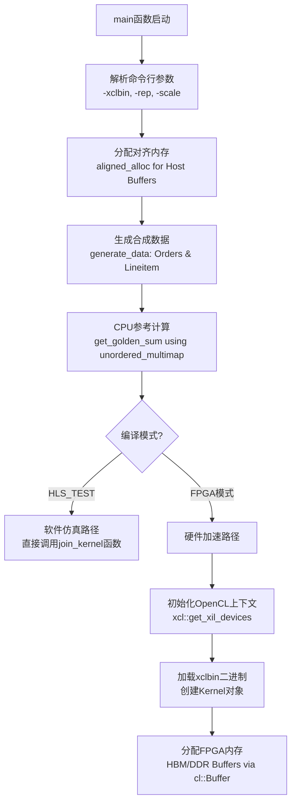
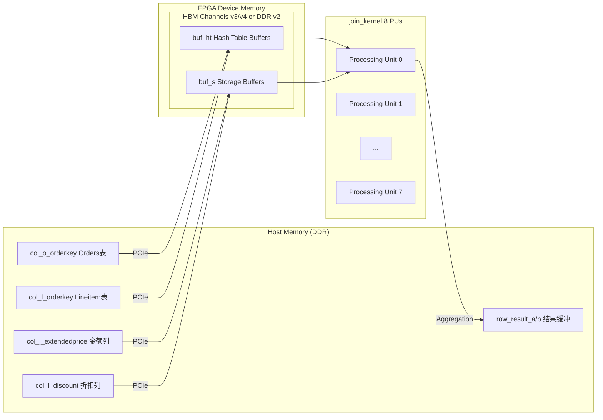

# Hash Join Single Variant Benchmark Hosts 技术深度解析

## 概述：这个模块解决什么问题？

想象你在运营一个大型电商平台的实时报表系统。当用户查询"过去一个月内订单金额超过1万元的客户总消费额"时，数据库需要连接两张表：订单表（Orders）和明细表（Lineitem）。这种**哈希连接（Hash Join）**操作涉及数亿行数据，在传统 CPU 上可能需要数秒甚至数分钟。

**`hash_join_single_variant_benchmark_hosts`** 模块正是为解决这一性能瓶颈而生。它是一组 FPGA 加速器的主机端（Host-side）基准测试驱动程序，负责：

1. **桥接 CPU 与 FPGA**：通过 OpenCL 接口将数据库表传输到 FPGA 的高带宽内存（HBM/DDR），并启动哈希连接内核
2. **隐藏传输延迟**：使用**乒乓缓冲（Ping-Pong Buffering）**技术，在 FPGA 处理当前批次数据时，CPU 并行准备下一批数据
3. **性能基准测试**：精确测量内核执行时间、数据传输带宽、端到端延迟，支持多次运行取平均值
4. **结果验证**：在 CPU 端使用标准库（`std::unordered_multimap`）实现参考算法，对比 FPGA 结果的正确性

该模块包含三个子变体：**v2**、**v3_sc** 和 **v4_sc**，分别对应不同版本的哈希连接内核架构，从基础 DDR 内存访问到优化的 HBM（高带宽内存）利用。

## 架构思维模型：如何理解这个模块？

### 类比：现代化工厂的流水线

想象一个高度自动化的汽车装配厂：

- **零部件入库区（数据生成）**：供应商（`generate_data`）按照规格（TPC-H 标准）生产零件（合成数据），并手动计算总成本（`get_golden_sum` 参考实现）
- **双轨装卸平台（乒乓缓冲）**：工厂有两个完全相同的装卸台 A 和 B。当机器人（FPGA）在 A 台加工零件时，工人（CPU）在 B 台卸载成品并装载新原料。完成后角色互换，实现**零停机切换**
- **中央控制塔（OpenCL 命令队列）**：调度员（`cl::CommandQueue`）使用非阻塞指令（Out-of-Order Execution），确保机器人焊接（Kernel Execution）、叉车运输（Data Migration）、质检（Result Callback）尽可能并行，仅通过信号灯（`cl::Event` 依赖）控制关键路径顺序
- **质检部门（结果验证）**：每辆车出厂前，系统自动对比 FPGA 计算的总成本与之前手工计算的标准值（Golden Reference），误差超过阈值立即报警

### 核心抽象概念

1. **构建-探测哈希连接（Build-Probe Hash Join）**：
   - **构建阶段**：将小表（Orders，通常是维度表）加载到哈希表中
   - **探测阶段**：遍历大表（Lineitem，事实表），在哈希表中查找匹配项，执行聚合（SUM）

2. **多处理单元并行（PU_NM = 8）**：
   - 数据被分区到 8 个并行处理单元（Processing Units），每个拥有独立的本地存储（Hash Table Buffer 和 Storage Buffer）

3. **事件驱动流水线（Event-Driven Pipeline）**：
   - 使用 OpenCL 事件对象建立跨迭代的依赖链：第 $i$ 次迭代的写操作依赖第 $i-2$ 次迭代的读操作完成（确保乒乓缓冲的时序正确性）

## 数据流与依赖链：端到端流程追踪

### 初始化阶段（One-time Setup）



### 运行时流水线（核心循环）

采用**三级乒乓流水线**架构，重叠数据传输与计算：

```
迭代 i:   写(Wi) → 计算(Ki) → 读(Ri)
时间轴:   |--------|----------|--------|
          W0       K0         R0
          |--------|----------|--------|
                   W1         K1         R1
                   |--------|----------|--------|
                            W2         K2         R2
                            |--------|----------|--------|
                                     W3         K3         R3
```

关键依赖关系（确保缓冲区间不冲突）：
- $W_i$ 依赖于 $R_{i-2}$（使用不同缓冲区，可并行，但需确保 i-2 的读已启动以避免竞争）
- $K_i$ 依赖于 $W_i$（必须在数据到达后才能计算）
- $R_i$ 依赖于 $K_i$（必须在计算完成后才能读取结果）

代码实现中的事件链：
```cpp
// 迭代 i 的写操作依赖迭代 i-2 的读事件（如果 i > 1）
if (i > 1) {
    q.enqueueMigrateMemObjects(ib, 0, &read_events[i - 2], &write_events[i][0]);
} else {
    q.enqueueMigrateMemObjects(ib, 0, nullptr, &write_events[i][0]);
}

// 计算内核依赖写事件
q.enqueueTask(kernel0, &write_events[i], &kernel_events[i][0]);

// 读操作依赖计算事件
q.enqueueMigrateMemObjects(ob, CL_MIGRATE_MEM_OBJECT_HOST, &kernel_events[i], &read_events[i][0]);
```

### 数据路径与缓冲管理

内存层级与数据流向：



缓冲策略差异：
- **v2**: 使用 `stb_buf[8]` 作为简单的本地暂存缓冲区，数据通过 PCIe 从 Host 内存流式传输
- **v3_sc/v4_sc**: 明确分离 Hash Table Buffer (`buf_ht`) 和 Storage Buffer (`buf_s`)，充分利用 HBM 的高带宽特性，支持更复杂的分区策略（`k_bucket` 参数）

## 关键设计决策与权衡

### 1. 乒乓缓冲 vs. 单缓冲：以内存换时间

**决策**: 所有变体均采用**双缓冲（Ping-Pong）**策略，维护两套完整的输入/输出缓冲区（A/B 组）。

**权衡分析**:
- **收益**: 完全隐藏 Host-to-FPGA 的数据传输延迟。当 FPGA 处理缓冲区 A 的数据时，CPU 可以并行地将上一轮结果从缓冲区 B 读回，并写入下一轮的新数据到缓冲区 B。理论加速比接近 2x（当计算与传输时间相当时）。
- **代价**: 内存占用翻倍。对于大表（Lineitem 可能数千万行），这需要显著的 Host 内存和 FPGA 片上存储（若使用本地缓存）。代码中通过 `-scale` 参数控制数据规模，正是为了在不同内存容量的系统上运行。

**替代方案（未选择）**:
- **单缓冲顺序执行**: 内存占用减半，但 Host 与 FPGA 必须串行工作，总时间 = 传输时间 + 计算时间，对于计算密集型任务效率低下。
- **三缓冲（Triple Buffering）**: 可进一步解耦 CPU 和 FPGA 的时序，但增加内存开销和同步复杂度，对于确定性流水线收益有限。

### 2. 软件参考实现 vs. 硬件加速：正确性验证优先

**决策**: 在 Host 端使用 `std::unordered_multimap` 实现 `get_golden_sum()` 函数，作为 FPGA 结果的**黄金标准（Golden Reference）**进行逐位比对。

**权衡分析**:
- **收益**: 
  - **正确性保证**: FPGA 硬件逻辑复杂（涉及定点数、流水线、并发冲突），软件参考实现使用标准库容器，逻辑简单直接，可作为可信基准。
  - **调试便利**: 当 `print_buf_result` 回调检测到 FPGA 结果与 Golden 值不符时，立即打印详细对比信息（第几次迭代、FPGA 值、期望值），加速问题定位。
- **代价**: 
  - **启动开销**: 在 FPGA 执行前，CPU 必须先生成所有数据并运行参考算法。对于大规模数据（如 TPC-H Scale Factor 100），这可能消耗数秒至数十秒，使得本模块不适合作为生产环境的轻量级启动器，而更适合作为**开发验证和性能调优工具**。
  - **内存冗余**: 需要同时保存输入数据和参考结果，增加 Host 内存压力。

**设计意图**: 该模块被明确设计为**L1 层基准测试主机（L1 Benchmark Host）**，而非生产级查询执行引擎。因此，牺牲启动速度换取绝对正确性验证是可接受的权衡。

### 3. OpenCL 事件链 vs. 阻塞同步：最大化流水线并行

**决策**: 使用 **非阻塞命令队列（Out-of-Order Queue）** 配合精细的 **OpenCL 事件（Event）依赖链**，而非简单的阻塞调用（`clFinish` 等待每一步完成）。

**权衡分析**:
- **收益**: 
  - **指令级并行**: Host 代码提交写命令、内核执行命令、读命令后，立即返回继续准备下一批数据，无需等待 GPU/FPGA 实际完成。这允许 CPU 与 FPGA 形成**宏流水线（Macro-Pipeline）**。
  - **精确依赖管理**: 通过 `write_events`, `kernel_events`, `read_events` 数组，显式表达跨迭代依赖（$W_i$ 依赖 $R_{i-2}$），允许运行时系统尽可能并行调度独立操作，仅在必要时同步（如读写同一缓冲区时必须串行）。
  - **延迟隐藏**: 对于大规模连接，传输时间可能占主导。事件链允许传输与计算深度重叠，使得**有效吞吐量**接近理论峰值，而非受限于传输瓶颈。
- **代价**: 
  - **代码复杂度**: 相比阻塞式 `enqueueWriteBuffer` + `enqueueTask` + `enqueueReadBuffer` + `finish` 的简单序列，事件管理需要维护三个并行的 Event 向量，并正确设置依赖索引（如 `i-2` 的边界检查），容易引入竞态条件或死锁（如循环依赖）。
  - **调试困难**: 当流水线停滞或结果错误时，难以判断是哪个事件未触发、依赖设置错误，还是内核本身逻辑错误。需要依赖 OpenCL Profiler 和详细的日志（如本代码中的 `logger` 和 `print_buf_result` 回调）来追踪执行轨迹。

**关键实现细节**: 
代码中明确使用 `CL_QUEUE_OUT_OF_ORDER_EXEC_MODE_ENABLE` 创建队列，并通过 `&write_events[i]` 和 `&read_events[i-2]` 建立显式依赖图。这要求开发者对 OpenCL 执行模型有深入理解，但能榨取硬件的最大性能。

## 子模块架构

本模块包含三个具体的 FPGA 哈希连接实现变体，分别针对不同内存架构和内核版本进行优化：

### [hash_join_v2_host](database_query_and_gqe-l1_hash_join_and_aggregation_benchmark_hosts-hash_join_single_variant_benchmark_hosts-hash_join_v2_host.md)
**基础版哈希连接主机驱动**，面向传统 DDR 内存架构。

- **核心特征**: 使用本地暂存缓冲区（`stb_buf[8]`）进行数据交换，适合 PCIe 传输带宽受限的场景
- **内存模型**: 数据通过标准 PCIe-DDR 路径传输，8 个处理单元（PU）共享内核计算资源
- **适用场景**: 作为基线实现，用于验证算法正确性和基础性能评估

### [hash_join_v3_sc_host](database_query_and_gqe-l1_hash_join_and_aggregation_benchmark_hosts-hash_join_single_variant_benchmark_hosts-hash_join_v3_sc_host.md)
**HBM 优化版哈希连接主机驱动**，引入高带宽内存（HBM）支持。

- **核心特征**: 显式分离 Hash Table Buffer (`buf_ht`) 和 Storage Buffer (`buf_s`)，利用 HBM 的 16 个独立通道
- **并行增强**: 支持 `k_bucket` 参数实现哈希桶分区，减少 PU 间的内存争用
- **内存模型**: Hash 表和中间结果直接存储于 FPGA 片上的 HBM，避免频繁回写 DDR
- **适用场景**: 大规模数据连接（数千万行以上），需要高吞吐量的分析型查询

### [hash_join_v4_sc_host](database_query_and_gqe-l1_hash_join_and_aggregation_benchmark_hosts-hash_join_single_variant_benchmark_hosts-hash_join_v4_sc_host.md)
**散射-聚集优化版哈希连接主机驱动**，v3 的增强版，优化了内存访问模式。

- **核心特征**: 改进了散射（Scatter）和聚集（Gather）阶段的数据布局，减少 HBM 访问冲突
- **接口优化**: 内核参数列表调整，更高效地传递 HBM 缓冲区指针（`me_ht`, `me_s` 结构体）
- **性能微调**: 针对特定 FPGA 平台（如 Alveo U50/U280）的 HBM 特性优化了缓冲区对齐和 bank 分配
- **适用场景**: 对延迟敏感的实时分析，或需要最大化 HBM 带宽利用率的生产部署

## 新贡献者注意事项：潜在陷阱与最佳实践

### 1. 内存对齐要求

**陷阱**: 所有通过 PCIe 传输到 FPGA 的 Host 内存必须使用 `aligned_alloc` 分配，且通常需要 4KB（页大小）或更高对齐。使用标准 `malloc` 或栈数组可能导致 OpenCL 驱动程序报错或静默数据损坏。

**最佳实践**: 
```cpp
// 正确
KEY_T* col_l_orderkey = aligned_alloc<KEY_T>(l_depth);

// 错误 - 可能导致未定义行为
KEY_T* col_l_orderkey = new KEY_T[l_depth];
```

### 2. 事件依赖链的边界条件

**陷阱**: 代码中 `if (i > 1) { q.enqueueMigrateMemObjects(ib, 0, &read_events[i - 2], ...); }` 的边界条件对于迭代 0 和 1 必须正确处理。如果错误地将 `i > 0` 或 `i > 2` 作为条件，会导致事件链断裂或死锁。

**最佳实践**: 始终确保第 0、1 次迭代不依赖不存在的 `read_events[-1]` 或 `read_events[-2]`，从第 2 次迭代开始才建立跨迭代的依赖。

### 3. 缓冲区大小与溢出风险

**陷阱**: `L_MAX_ROW` 和 `O_MAX_ROW` 定义了最大行数，但实际分配的深度是 `l_depth = L_MAX_ROW + VEC_LEN - 1`（考虑向量化对齐）。如果通过 `-scale` 参数缩小的数据规模仍然超过这些宏定义，会导致缓冲区溢出。

**最佳实践**: 修改宏定义后必须重新编译内核和主机代码。使用 `-scale` 时确保 `L_MAX_ROW / scale` 和 `O_MAX_ROW / scale` 仍然在安全范围内。

### 4. HLS_TEST 与 FPGA 模式的代码路径分歧

**陷阱**: 代码中大量 `#ifdef HLS_TEST` 条件编译导致两个完全不同的执行路径。HLS_TEST 模式下直接调用 `join_kernel` 函数，而 FPGA 模式使用 OpenCL API。修改一处代码时很容易忘记同步另一处，导致仿真通过但硬件失败（或反之）。

**最佳实践**: 尽可能将公共逻辑（如数据生成、结果验证）提取到 `#else` 块之外的函数中。在提交代码前，必须同时在 Vivado HLS 仿真环境和实际 FPGA 硬件上运行完整测试。

### 5. PU_NM 与内核参数的硬编码耦合

**陷阱**: `const int PU_NM = 8;` 定义了处理单元数量，但 `kernel0.setArg()` 调用是逐个硬编码的（`buff_a[0]` 到 `buff_a[7]`）。如果修改 `PU_NM` 为 4 或 16，必须同步修改所有 `setArg` 调用，否则会导致参数错位或运行时错误。

**最佳实践**: 考虑使用循环动态设置参数：
```cpp
for (int i = 0; i < PU_NM; i++) {
    kernel0.setArg(7 + i, use_a ? buff_a[i] : buff_b[i]);
}
```

### 6. xclbin 路径与设备选择的验证

**陷阱**: `parser.getCmdOption("-xclbin", xclbin_path)` 在找不到参数时返回 false，但 `xcl::get_xil_devices()` 在没有可用设备时会抛出异常或返回空向量，导致后续 `devices[0]` 访问越界。

**最佳实践**: 始终检查设备列表非空：
```cpp
std::vector<cl::Device> devices = xcl::get_xil_devices();
if (devices.empty()) {
    logger.error("No Xilinx devices found");
    return 1;
}
```

## 跨模块依赖与交互

本模块作为 L1 层（底层内核级）基准测试主机，向上层模块提供 FPGA 加速的哈希连接能力，同时依赖下层运行时库：

### 依赖的上游模块（被本模块使用）

1. **[data_mover_runtime](../data_mover_runtime/data_mover_runtime.md)** (隐含依赖)
   - **交互方式**: 通过 `xf::common::utils_sw::Logger` 和 `xcl2.hpp` 间接使用数据搬运运行时
   - **关键依赖**: `xcl2.hpp` 提供了 Xilinx 设备发现 (`get_xil_devices`)、二进制导入 (`import_binary_file`) 等封装，简化了 OpenCL 样板代码

2. **database.L1.utils** (通过头文件包含)
   - **交互方式**: 包含 `table_dt.hpp`, `join_kernel.hpp`, `utils.hpp` 等内核定义头文件
   - **关键依赖**: 这些头文件定义了 `KEY_T`, `MONEY_T`, `L_MAX_ROW`, `O_MAX_ROW` 等类型和常量，必须与内核代码严格一致

### 下游依赖（使用本模块）

1. **[l3_gqe_execution_threading_and_queues](../l3_gqe_execution_threading_and_queues/l3_gqe_execution_threading_and_queues.md)** (潜在使用)
   - **交互方式**: L3 层查询执行引擎可以调用本模块的变体来执行实际的哈希连接操作
   - **集成点**: L3 层的优化器选择连接算法后，通过统一的接口调用 v2/v3/v4 变体

2. **[hash_group_aggregate_benchmark_host_support](../hash_group_aggregate_benchmark_host_support/hash_group_aggregate_benchmark_host_support.md)** (同级模块)
   - **交互方式**: 共享类似的 OpenCL 主机端基础设施（乒乓缓冲、事件管理、性能计时）
   - **代码复用**: 可能共享 `generate_data`, `ArgParser` 等通用工具函数

## 总结

`hash_join_single_variant_benchmark_hosts` 模块是 AMD/Xilinx 数据库加速库（GQE - Generic Query Engine）的基石组件。它通过精心设计的**乒乓缓冲**、**事件驱动流水线**和**黄金标准验证**机制，实现了 FPGA 哈希连接内核的高性能基准测试。

三个变体（v2/v3_sc/v4_sc）的演进反映了硬件能力的进步：从基础 DDR 内存访问，到利用 HBM 高带宽特性的优化实现。每个变体都保持相同的核心架构原则（模块化、可验证性、性能可测量性），但在内存层级利用和并行策略上有所差异。

对于新加入团队的工程师，理解本模块的关键在于把握**数据流的时间-空间关系**：数据何时在 Host 与 FPGA 之间移动、在哪个缓冲区驻留、如何确保计算与传输的最大重叠。一旦掌握这些原则，无论是调试性能瓶颈还是扩展新的连接变体，都将有章可循。
**权衡分析**:
- **收益**: 
  - **指令级并行**: Host 代码提交写命令、内核执行命令、读命令后，立即返回继续准备下一批数据，无需等待 GPU/FPGA 实际完成。这允许 CPU 与 FPGA 形成**宏流水线（Macro-Pipeline）**。\n  - **精确依赖管理**: 通过 `write_events`, `kernel_events`, `read_events` 数组，显式表达跨迭代依赖（$W_i$ 依赖 $R_{i-2}$），允许运行时系统尽可能并行调度独立操作，仅在必要时同步（如读写同一缓冲区时必须串行）。\n  - **延迟隐藏**: 对于大规模连接，传输时间可能占主导。事件链允许传输与计算深度重叠，使得**有效吞吐量**接近理论峰值，而非受限于传输瓶颈。\n- **代价**: \n  - **代码复杂度**: 相比阻塞式 `enqueueWriteBuffer` + `enqueueTask` + `enqueueReadBuffer` + `finish` 的简单序列，事件管理需要维护三个并行的 Event 向量，并正确设置依赖索引（如 `i-2` 的边界检查），容易引入竞态条件或死锁（如循环依赖）。\n  - **调试困难**: 当流水线停滞或结果错误时，难以判断是哪个事件未触发、依赖设置错误，还是内核本身逻辑错误。需要依赖 OpenCL Profiler 和详细的日志（如本代码中的 `logger` 和 `print_buf_result` 回调）来追踪执行轨迹。\n\n**关键实现细节**: \n代码中明确使用 `CL_QUEUE_OUT_OF_ORDER_EXEC_MODE_ENABLE` 创建队列，并通过 `&write_events[i]` 和 `&read_events[i-2]` 建立显式依赖图。这要求开发者对 OpenCL 执行模型有深入理解，但能榨取硬件的最大性能。\n