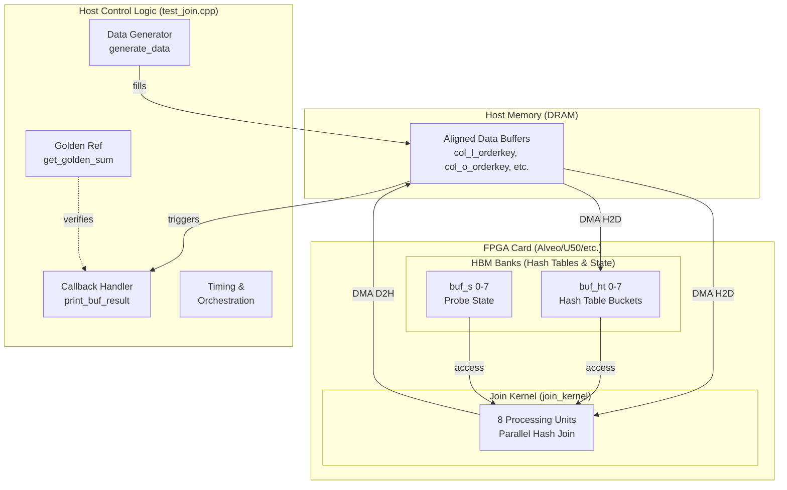

# hash_multi_join_benchmark_host_support 技术深度解析

## 开篇：这个模块在解决什么问题？

想象你正在运营一个大型电商平台的分析数据库，需要回答这样一个问题："有多少订单的折扣金额满足特定条件？"这涉及两张表——`Orders`（订单表）和`Lineitem`（订单明细表）——的关联查询。在CPU上，你可能会写一个简单的嵌套循环或哈希表查找，但当数据量达到亿级行、且需要毫秒级响应时，传统的软件实现就成为了瓶颈。

这个模块正是为了解决**在FPGA加速卡上执行高性能哈希连接（Hash Join）基准测试**而设计的Host端支撑框架。它不仅仅是一个测试程序，更是一套完整的"试验台"（testbench）架构：负责生成符合TPC-H标准的数据、管理FPGA与Host之间的DMA数据传输、通过双缓冲（ping-pong）机制隐藏传输延迟、提供CPU端的黄金参考结果用于校验，并精确测量端到端执行时间。

理解这个模块的关键在于认识到它处于**软件定义硬件（Software-Defined Hardware）**的交汇点：它用C++/OpenCL编写，却直接控制着FPGA内核的时钟周期级行为；它运行在通用x86服务器上，却需要像驱动程序一样思考内存对齐、DMA零拷贝和异步流水线的硬件特性。

---

## 架构与数据流

### 架构概览

这个模块采用了**分层流水线（Layered Pipeline）**的架构设计，将FPGA加速任务分解为数据准备、内核执行、结果回收三个阶段，并通过**双缓冲（Double Buffering）**技术在时间维度上重叠数据传输与计算。



### 核心抽象：乒乓缓冲（Ping-Pong Buffering）

理解这个模块的关键在于把握**乒乓缓冲**这一核心抽象。想象你在一个工厂的生产线上：一侧是数据准备区（Host），另一侧是加工机器（FPGA Kernel）。如果工人每次只准备一批原料，等机器加工完再准备下一批，那么机器在工人准备原料时就会空闲。

乒乓缓冲就是解决这个问题的方法：设置两套完全相同的缓冲区（A套和B套）。当FPGA正在处理A套数据时，Host在后台准备B套；当FPGA完成A套后，立即切换到B套继续处理，同时Host回收A套结果并准备新的数据。对于FPGA Kernel而言，它看到的是一个**无限流（infinite stream）**；对于Host而言，它通过时间上的重叠隐藏了数据传输的延迟。

在代码中，这体现为两套几乎完全对称的`cl::Buffer`对象：`buf_*_a`和`buf_*_b`，以及通过`use_a = i & 1`（利用迭代次数的奇偶性）来切换缓冲区的逻辑。

### 数据流完整路径

让我们追踪一次完整的Hash Join执行周期中数据的流动：

1. **数据生成阶段（Host端）**：
   - `generate_data()`函数为`col_l_orderkey`、`col_l_extendedprice`、`col_l_discount`（来自Lineitem表）和`col_o_orderkey`（来自Orders表）分配**对齐的Host内存**（通过`aligned_alloc`）。
   - 数据按照TPC-H风格的分布生成（注意代码中使用的是简化的均匀分布随机数，而非正式TPC-H的复杂分布）。

2. **黄金参考计算（Host端，并行进行）**：
   - `get_golden_sum()`在CPU上使用`std::unordered_multimap`构建哈希表，执行经典的Hash Join算法，计算出一个64位黄金参考值（`golden`）。
   - 这个值用于后续验证FPGA计算结果的正确性。

3. **OpenCL上下文初始化（Host端）**：
   - 创建`cl::Context`、`cl::CommandQueue`（启用性能分析和乱序执行模式）。
   - 从`xclbin`文件加载FPGA二进制，创建`cl::Kernel`对象（名为`"join_kernel"`）。

4. **缓冲区设置与内存映射**：
   - **Host到FPGA的映射（零拷贝）**：使用`cl_mem_ext_ptr_t`将Host端已分配的内存（如`col_l_orderkey`）与`cl::Buffer`关联，标记为`CL_MEM_USE_HOST_PTR`，实现**零拷贝（Zero-Copy）**DMA传输。
   - **FPGA内部HBM分配**：为8个处理单元（PU_NM=8）分别分配哈希表缓冲区`buf_ht[0..7]`和状态缓冲区`buf_s[0..7]`，这些位于FPGA的HBM（高带宽存储）中，通过`CL_MEM_EXT_PTR_XILINX`扩展指定银行编号（8..15和16..23）。

5. **执行流水线（核心逻辑）**：
   - 对于每次迭代`i`（从0到`num_rep-1`）：
     
     a. **缓冲区选择**：根据`use_a = i & 1`选择使用A套或B套缓冲区。这是乒乓逻辑的核心。
     
     b. **数据迁移（Host→FPGA）**：`enqueueMigrateMemObjects`将选定的输入缓冲区（订单键、行项目键、价格、折扣）从Host内存异步传输到FPGA。如果`i > 1`，此操作会等待`read_events[i-2]`（即两轮之前的结果读取完成），确保缓冲区可用。
     
     c. **内核执行**：`enqueueTask`启动`join_kernel`，传入所有参数（包括连接类型标志`join_flag`、行数、缓冲区对象等）。此操作等待`write_events[i]`（当前数据传输完成）。
     
     d. **结果回传（FPGA→Host）**：`enqueueMigrateMemObjects`将结果缓冲区（`buf_result_a`或`buf_result_b`）从FPGA传回Host，标记为`CL_MIGRATE_MEM_OBJECT_HOST`。此操作等待`kernel_events[i]`（内核执行完成）。
     
     e. **回调注册**：为读取事件设置回调函数`print_buf_result`，当数据到达Host后，该回调会被触发，打印结果并更新`fpga_val`。

6. **同步与收尾**：
   - `q.flush()`和`q.finish()`确保所有队列中的命令执行完毕。
   - 计算并打印整体执行时间和每轮内核的详细执行时间（通过OpenCL事件分析接口）。
   - 比较`golden`（CPU计算值）和`fpga_val`（FPGA计算值），输出测试通过/失败结果。

---

## 核心组件详解

### 1. `main` 函数：编排者（The Orchestrator）

`main`函数是整个基准测试的指挥中枢，负责从命令行解析到最终验证的全生命周期管理。它的设计体现了**分层初始化（Layered Initialization）**和**确定性执行（Deterministic Execution）**的原则。

**关键职责**：

- **参数解析与验证**：通过`ArgParser`处理`-mode`（必须为`fpga`，不支持纯CPU模式）、`-xclbin`（FPGA二进制路径）、`-rep`（重复执行次数，上限20）、`-scale`（数据规模缩放因子）。这种严格的参数验证确保了测试环境的可复现性。

- **内存预算计算**：根据`k_bucket`、`PU_HT_DEPTH`、`PU_S_DEPTH`等常量计算HBM（高带宽存储）所需的空间大小（`ht_hbm_size`和`s_hbm_size`）。这些常量定义在包含的头文件（如`table_dt.hpp`）中，反映了FPGA内核的硬件架构约束（如处理单元数量、哈希表深度）。

- **双缓冲区分配**：为输入数据（Lineitem和Orders表）和结果输出分配**对齐的Host内存**（`aligned_alloc`）。注意，这里分配的深度是`L_MAX_ROW + VEC_LEN - 1`，这是为了应对FPGA内核通常以向量（VEC_LEN）为单位进行访问，需要额外的填充（padding）来避免越界。

**代码结构解析**：

```cpp
// 1. 参数解析阶段
ArgParser parser(argc, argv);
std::string mode, xclbin_path;
if (parser.getCmdOption("-mode", mode) && mode != "fpga") {
    // 仅支持FPGA模式
}
if (!parser.getCmdOption("-xclbin", xclbin_path)) {
    // xclbin路径必须设置
}

// 2. 内存分配阶段 - 对齐内存确保DMA效率
col_l_orderkey = aligned_alloc<KEY_T>(l_depth);
// ... 其他缓冲区

// 3. 数据生成阶段
generate_data<TPCH_INT>(col_l_orderkey, 100000, l_nrow);

// 4. 黄金参考计算
long long golden = get_golden_sum(...);

// 5. OpenCL初始化和执行流水线（见后续章节）
```

### 2. `generate_data<T>`：数据工厂（The Data Factory）

这是一个简单的模板函数，负责为TPC-H基准测试生成合成数据。虽然实现简单，但它在测试可重复性和性能特征方面起着关键作用。

**函数签名与参数**：

```cpp
template <typename T>
int generate_data(T* data, int range, size_t n);
```

- `data`：指向已分配内存的指针，函数将向其中填充数据。
- `range`：随机数生成的范围（0到range-1），用于模拟TPC-H中不同列的分布特征（如`l_discount`的范围是0-10）。
- `n`：要生成的数据元素数量。

**实现细节与约束**：

```cpp
template <typename T>
int generate_data(T* data, int range, size_t n) {
    if (!data) {
        return -1;  // 空指针检查
    }

    for (size_t i = 0; i < n; i++) {
        data[i] = (T)(rand() % range + 1);  // 注意：使用rand()，非线程安全
    }
    return 0;
}
```

**重要注意事项**：

1. **线程安全性**：该函数使用`rand()`，它不是线程安全的，且在不同平台上可能产生不同的随机序列。在需要可重复性测试的环境中，应当使用`std::mt19937`等确定性随机数生成器。

2. **数据分布**：TPC-H规范要求特定的数据分布（如非均匀分布、特定相关性），而这里使用的是简单的均匀分布。对于严格的一致性测试，需要替换为符合TPC-H规范的生成逻辑。

3. **内存所有权**：该函数假定调用者已经分配了足够的内存，并且拥有该内存的生命周期管理责任。函数本身不拥有、不释放内存，仅作为数据的填充者（Data Filler）。

### 3. `get_golden_sum`：黄金参考（The Golden Reference）

这个函数是FPGA结果正确性验证的基石。它在CPU上实现了一个标准的、未经优化的Hash Join算法，生成一个"黄金标准"结果，用于与FPGA的并行计算结果进行比对。

**算法逻辑与数据流**：

```cpp
int64_t get_golden_sum(int l_row,           // Lineitem表行数
                       KEY_T* col_l_orderkey,
                       MONEY_T* col_l_extendedprice,
                       MONEY_T* col_l_discount,
                       int o_row,           // Orders表行数
                       KEY_T* col_o_orderkey) {
    int64_t sum = 0;
    int cnt = 0;
    
    // Phase 1: Build - 构建哈希表（基于Orders表，小表）
    std::unordered_multimap<uint32_t, uint32_t> ht1;
    for (int i = 0; i < o_row; ++i) {
        uint32_t k = col_o_orderkey[i];
        uint32_t p = 0;  // payload占位，实际未使用
        ht1.insert(std::make_pair(k, p));
    }
    
    // Phase 2: Probe - 探测哈希表（基于Lineitem表，大表）
    for (int i = 0; i < l_row; ++i) {
        uint32_t k = col_l_orderkey[i];
        uint32_t p = col_l_extendedprice[i];
        uint32_t d = col_l_discount[i];
        
        // 检查哈希表中是否存在匹配的key
        if (ht1.find(k) != ht1.end()) {
            sum += (p * (100 - d));
            ++cnt;
        }
    }
    
    std::cout << "INFO: CPU ref matched " << cnt << " rows, sum = " << sum << std::endl;
    return sum;
}
```

**设计选择解析**：

1. **Hash Join vs. Nested Loop Join**：选择`std::unordered_multimap`实现的Hash Join是因为其时间复杂度为O(n+m)，在数据量较大时远优于Nested Loop Join的O(n×m)。这对于验证大规模数据集（如TPC-H Scale Factor 100）至关重要。

2. **Multimap而非Map**：使用`unordered_multimap`而非`unordered_map`是因为`o_orderkey`在Orders表中不是唯一的（一个订单可能有多个明细，但此处Orders表被简化为每行一个订单键，实际上multimap提供了更通用的接口以应对可能的重复键）。

3. **整数运算精度**：计算中使用`int64_t`存储sum，并在乘法`p * (100 - d)`后隐式转换为64位，防止32位溢出。注意这里假设`extendedprice`和`discount`都以某种定点数格式存储（如`decimal(15,2)`的整数表示）。

4. **简化的一致性模型**：该实现假设Join条件是`l_orderkey = o_orderkey`，并且是Inner Join。代码中注释提到的`join_flag`（0-hash_join, 1-semi_join, 2-anti_join）在黄金参考中未被实现，仅支持Inner Join的验证。

**与FPGA内核的对比**：

这个CPU实现与FPGA内核（`join_kernel`）形成鲜明对比：
- **并行度**：CPU实现是单线程顺序执行，而FPGA内核有8个并行处理单元（PU_NM=8），每个周期可处理8个向量。
- **哈希表结构**：CPU使用链式哈希（chaining）处理冲突，而FPGA通常使用开放寻址（open addressing）或更复杂的并行哈希方案以支持无锁并发访问。
- **内存层次**：CPU实现受限于DDR内存延迟，而FPGA内核使用片上HBM（高带宽存储）作为哈希表存储，带宽可达数百GB/s。\n\n### 4. `print_buf_result_data_t` 与 `print_buf_result`：异步回调机制（The Async Callback）\n\n这两个组件实现了**异步事件驱动的结果处理机制**。在OpenCL中，命令队列操作（如数据传输）是异步的，当操作完成时，可以通过回调函数通知应用程序。\n\n**数据结构**：\n\n```cpp\ntypedef struct print_buf_result_data_ {\n    int i;              // 迭代轮次标识\n    long long* v;       // 指向结果缓冲区的指针\n    long long* fvp;     // 指向最终验证值的指针（用于更新fpga_val）\n} print_buf_result_data_t;\n```\n\n**回调函数**：\n\n```cpp\nvoid CL_CALLBACK print_buf_result(cl_event event, cl_int cmd

_exec_status, void* user_data) {
    print_buf_result_data_t* d = (print_buf_result_data_t*)user_data;
    printf("FPGA result %d: %lld.%lld\n", d->i, *(d->v) / 10000, *(d->v) % 10000);
    *(d->fvp) = *(d->v);
}
```

**关键设计点**：
- 回调函数在独立的OpenCL运行时线程中执行，与主线程并发。
- 通过`user_data`传递上下文信息，避免全局变量。
- 必须确保回调执行时`user_data`指向的内存仍然有效（生命周期管理）。

---

## 总结

`hash_multi_join_benchmark_host_support`模块是一个**高性能FPGA基准测试框架**，它通过以下关键技术实现了Host-FPGA协同加速：

1. **零拷贝内存管理**：使用`aligned_alloc`和`CL_MEM_USE_HOST_PTR`消除Host端内存拷贝，最大化DMA带宽。

2. **双缓冲流水线**：通过A/B缓冲区乒乓切换，重叠数据传输与FPGA计算，隐藏传输延迟。

3. **异步事件驱动**：利用OpenCL回调机制实现高效的Host-Device协同，降低CPU开销。

4. **分层验证**：CPU端黄金参考实现与FPGA结果逐位比对，确保硬件正确性。

该模块适用于**数据库查询加速**（如TPC-H）、**流数据处理**和**实时分析**等场景，为FPGA加速数据库系统提供了可靠的基准测试和验证框架。