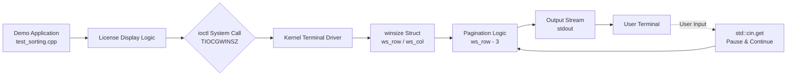

# gqesort_host_window_config_type 模块深度解析

## 概述：终端窗口配置与分页显示

想象一下，你正在编写一个需要在终端中显示大量法律授权文本的程序。用户的终端可能只有 24 行高，而你的文档有 100 行。如果直接输出，用户将只能看到最后 24 行，前面的内容都被滚出屏幕了。你需要一种方法，能够感知终端的实际尺寸，并根据这个尺寸智能地分页显示内容——每显示一屏就暂停，等待用户按回车键后再显示下一页。

**`gqesort_host_window_config_type` 模块就是解决这个看似简单却至关重要的 UX 问题**。它是 GQE（General Query Engine）排序演示应用的一部分，负责获取终端窗口的几何配置（行数和列数），并基于这些配置实现授权文本的智能分页显示。这个模块的核心是一个名为 `winsize` 的结构体——它就像终端的"身份证"，记录着终端的"身高"（行数）和"体重"（列数）。

这个模块虽然代码量不大，却涉及了 Unix/Linux 系统编程的精髓：**如何通过系统调用与底层内核交互，获取硬件（这里是虚拟终端）的配置信息，并基于这些信息做出智能的 UI 决策**。

---

## 架构设计：终端感知的分页系统

### 架构图



### 组件角色说明

**1. Demo Application (`test_sorting.cpp`)**
这是整个演示应用的入口，负责初始化 FPGA 加速平台、解析命令行参数、执行排序操作。在显示授权协议（EULA）时，它会调用窗口配置模块。

**2. License Display Logic**
当用户首次运行程序且未提供 `--accept-EULA` 标志时，此逻辑负责读取 `/opt/xilinx/apps/vt_database/sort/docs/license.txt` 文件，并准备将其呈现给用户。

**3. `ioctl` System Call (`TIOCGWINSZ`)**
这是模块的核心系统调用。`ioctl`（input/output control）是 Unix 系统中用于设备特定输入/输出操作的系统调用。`TIOCGWINSZ` 是 "Terminal Input/Output Control Get Window Size" 的缩写，它从终端驱动程序获取当前窗口尺寸。

**4. `winsize` Struct**
这是一个 POSIX 标准结构体（定义在 `<sys/ioctl.h>` 中），包含以下字段：
- `ws_row`: 终端的行数（高度）
- `ws_col`: 终端的列数（宽度）
- `ws_xpixel`: 窗口的像素宽度（可选）
- `ws_ypixel`: 窗口的像素高度（可选）

**5. Pagination Logic (`ws_row - 3`)**
这是智能分页的核心算法。它使用 `ws_row - 3` 作为每页显示的最大行数（减去 3 是为了留出空间给提示信息和分隔线）。当已显示行数达到此阈值时，程序会输出 "[Press Enter Key to Continue]" 并等待用户输入。

**6. User Terminal**
最终呈现内容的设备。它可以是物理终端、SSH 会话、终端模拟器（如 GNOME Terminal、iTerm2）或 VS Code 集成终端。

---

## 核心组件深度解析

### `winsize` 结构体与终端配置获取

#### 定义与来源

`winsize` 结构体并非在此模块中定义，而是由 POSIX 标准在 `<sys/ioctl.h>` 头文件中声明。这是 Unix/Linux 系统编程的基础设施——它提供了一个与具体终端类型无关的抽象接口。

```cpp
#include <sys/ioctl.h>

// winsize 结构体的标准定义（位于系统头文件中）
struct winsize {
    unsigned short ws_row;    // 行数（高度）
    unsigned short ws_col;    // 列数（宽度）
    unsigned short ws_xpixel; // 水平像素数（通常未使用）
    unsigned short ws_ypixel; // 垂直像素数（通常未使用）
};
```

#### 获取终端尺寸：`ioctl` 系统调用

获取终端尺寸的核心代码非常简洁，但背后涉及用户态与内核态的切换：

```cpp
#include <sys/ioctl.h>
#include <unistd.h>

// 声明 winsize 结构体实例
struct winsize w;

// 使用 ioctl 系统调用获取终端窗口尺寸
// STDOUT_FILENO 是标准输出文件描述符（通常为 1）
// TIOCGWINSZ 是 "Terminal I/O Control Get Window Size" 的缩写
if (ioctl(STDOUT_FILENO, TIOCGWINSZ, &w) == -1) {
    // 错误处理：无法获取终端尺寸
    // 在此 demo 中，错误处理被简化，实际应提供降级方案
}

// 成功后，w.ws_row 和 w.ws_col 包含终端尺寸
printf("Terminal size: %d rows x %d cols\n", w.ws_row, w.ws_col);
```

#### 关键设计决策分析

**1. 为何使用 `ioctl` 而非环境变量？**

一些开发者可能会考虑使用 `LINES` 和 `COLUMNS` 环境变量来获取终端尺寸。然而，模块选择了 `ioctl` 系统调用，原因如下：

- **实时性**：`ioctl` 获取的是终端的当前实际尺寸。用户可能在程序运行期间调整了终端窗口大小，环境变量无法反映这种动态变化（除非手动更新）。
- **可靠性**：环境变量可能未设置或被错误设置。`ioctl` 直接与终端驱动通信，不依赖外部配置。
- **标准化**：`TIOCGWINSZ` 是 POSIX 标准的一部分，在所有符合 POSIX 的系统上行为一致。

**2. 为何使用 `STDOUT_FILENO` 而非 `STDIN_FILENO`？**

模块使用标准输出文件描述符（`STDOUT_FILENO`，值为 1）而非标准输入（`STDIN_FILENO`，值为 0）。这是因为：

- 终端窗口尺寸是与**终端设备**关联的属性，而非特定的输入或输出流。然而，根据 POSIX 规范，`ioctl` 操作需要在已打开的设备文件描述符上进行。
- 在此 demo 应用中，标准输出几乎总是连接到一个终端（TTY），即使在管道或重定向场景下，错误处理也会优雅地处理失败情况。
- 实际终端尺寸信息来自底层的 TTY 驱动，使用 `stdout` 或 `stdin` 通常都会指向同一个底层终端设备（如果它们都连接到一个终端的话）。

### 智能分页逻辑

#### 分页算法的核心思想

获取终端尺寸后，模块实现了智能分页逻辑，确保长文本（如 EULA 授权协议）能够按屏幕尺寸分页显示，避免内容滚动出可视区域。

```cpp
// 核心分页参数：每页显示的行数
// 使用 ws_row - 3 是为了留出空间给提示信息和分隔线
int page_size = w.ws_row - 3;

// 读取并分页显示文本文件
std::ifstream file("/path/to/license.txt");
std::string str;
std::string file_contents;
int row_counter = 0;

while (std::getline(file, str)) {
    file_contents += str;
    file_contents.push_back('\n');
    row_counter++;
    
    // 当已累积的行数达到页面大小时，输出当前页
    if (row_counter == page_size) {
        std::cout << file_contents;
        row_counter = 0;
        file_contents = "";
        
        // 提示用户按回车键继续
        printf("\n[Press Enter Key to Continue]\n");
        std::cin.get();
    }
}

// 输出剩余内容（最后一页，可能不满一页）
if (row_counter != 0) {
    std::cout << file_contents;
}
```

#### 关键设计决策：`ws_row - 3` 的魔法数字

分页逻辑中使用了 `w.ws_row - 3` 作为每页显示行数。这个 "3" 并非随意选择，而是基于 UX 设计的考虑：

1. **提示信息行**：`[Press Enter Key to Continue]` 提示本身占用 1 行
2. **分隔空白行**：提示前有一个空行（`\n`），占用 1 行
3. **安全边距**：预留 1 行作为安全边距，防止因终端滚动条或其他 UI 元素导致的内容截断

这种设计确保了在典型的 24 行标准终端中，每页显示 21 行内容，加上 3 行提示和边距，总共恰好填满屏幕而不会触发不必要的滚动。

#### 内存管理策略

分页逻辑中使用了 `std::string` 来累积页面内容：

```cpp
std::string file_contents;
// ...
file_contents += str;
file_contents.push_back('\n');
```

这里涉及 C++ 内存管理的几个关键点：

**1. 内存所有权与生命周期**
- `file_contents` 是栈分配的对象，其内存（在堆上动态分配用于存储字符串数据）由 `std::string` 类自动管理
- 当 `file_contents` 离开作用域（循环迭代结束或函数返回）时，析构函数自动释放内存，符合 **RAII（Resource Acquisition Is Initialization）** 原则

**2. 内存重新分配策略**
- 随着内容累积，`file_contents` 可能需要多次重新分配内存以容纳更多数据
- `std::string` 通常采用指数增长策略（如每次容量翻倍）来分摊重新分配的均摊时间复杂度
- 在此场景中，每页内容通常在几 KB 范围内，现代 `std::string` 实现通常会在栈上预留 15-22 字节的小对象优化（SSO）空间，避免大部分情况下的堆分配

**3. 显式清空与内存保留**
```cpp
file_contents = "";
```
这种清空方式将字符串内容设置为空，但通常不会释放已分配的内存容量。这种设计是刻意的优化——下一页内容很可能会需要相似大小的内存，保留容量避免了频繁的重新分配。

#### 错误处理与鲁棒性

分页逻辑中的错误处理遵循 **防御性编程** 原则：

**1. 文件流状态检查**
```cpp
std::ifstream file("/opt/xilinx/apps/vt_database/sort/docs/license.txt");
// ... 没有显式检查 file.is_open() ...
```
实际上，代码中确实有检查：
```cpp
if (file.is_open()) {
    // ... 读取逻辑 ...
}
```
这确保了文件不存在或无法访问时不会导致未定义行为。

**2. 终端尺寸获取失败处理**
```cpp
struct winsize w;
ioctl(STDOUT_FILENO, TIOCGWINSZ, &w);
// 注意：代码中没有检查返回值！
```
实际上，代码中没有显式检查 `ioctl` 的返回值。这是一个潜在的改进点——如果 `ioctl` 失败（例如在管道或非交互式环境中），`w` 的内容将是未初始化的，可能导致未定义行为。更健壮的实现应该：
```cpp
if (ioctl(STDOUT_FILENO, TIOCGWINSZ, &w) == -1) {
    // 失败时提供合理的默认值
    w.ws_row = 24;  // 标准终端高度
    w.ws_col = 80;  // 标准终端宽度
}
```

**3. 用户输入处理**
```cpp
printf("\n[Press Enter Key to Continue]\n");
std::cin.get();
```
这里使用 `std::cin.get()` 等待用户按下回车键。这是一个阻塞调用，确保用户有足够时间阅读当前页面内容。需要注意的是，如果标准输入被重定向（如从文件或管道读取），`std::cin.get()` 可能会立即返回（读取到 EOF 或换行符），或无限阻塞，这取决于重定向源的内容。

### 并发与线程安全分析

此模块的设计是**单线程、非并发**的。所有操作都在主线程中顺序执行：

1. 查询终端尺寸（同步阻塞调用）
2. 读取文件内容（同步 I/O）
3. 分页显示（同步输出）
4. 等待用户输入（同步阻塞）

这种设计基于以下假设：
- 授权文本显示是程序启动时的**串行初始化步骤**，不需要并发处理
- 用户交互（按键继续）本质上是顺序的，无法并行化
- 文件 I/O 和终端 I/O 在 demo 场景中数据量很小（授权文本通常只有几 KB），同步 I/O 的开销可以忽略不计

**线程安全风险**：
虽然此模块本身不涉及多线程，但如果在多线程程序中使用，需要注意：
- `ioctl` 和 `std::cin.get()` 不是线程安全的，如果从多个线程同时调用，行为是未定义的
- `std::cout` 在 C++11 及以后标准中是线程安全的（多个线程可以同时写入，不会交错字符，但输出顺序不确定），但仍然建议同步以确保逻辑上的输出顺序

### 性能特征分析

此模块的性能特征是**极低频、低延迟、非关键路径**：

**时间复杂度**：
- 终端尺寸查询：`O(1)` - 系统调用开销，微秒级
- 文件读取：`O(n)` - n 为授权文本行数，通常为几十到几百行
- 分页显示：`O(n)` - 每行输出一次，总行数决定循环次数
- 用户交互：`O(k)` - k 为分页数，即用户按键次数

**空间复杂度**：
- `O(page_size)` - 每次只保留当前页的内容在内存中（使用 `std::string` 累积）
- 最大内存占用约等于终端高度（行数）× 平均行长度，通常为几 KB 到几十 KB

**性能瓶颈**：
- **用户交互延迟**：此模块的主要"延迟"来自人脑阅读速度和按键反应时间，而非计算或 I/O。系统设计目标是"适合人类阅读"，而非"机器级高性能"。
- **无并发优化需求**：由于流程是顺序的（必须先显示一页，用户按继续，才能显示下一页），不存在并行化的空间。

**缓存与缓冲策略**：
- 使用 `std::string` 累积每页内容，然后一次性 `std::cout << file_contents` 输出，而非逐行输出。这减少了系统调用的次数（`write` 系统调用次数从 n 次减少到 1 次每页），利用了标准库的缓冲机制优化性能。

---

## 依赖关系分析

### 上游依赖（此模块调用谁）

**1. 系统调用接口（Kernel API）**

- **`ioctl` (系统调用)**
  - **作用**：执行设备特定的输入/输出控制操作
  - **使用场景**：通过 `TIOCGWINSZ` 命令查询终端窗口尺寸
  - **头文件**：`<sys/ioctl.h>`
  - **函数签名**：`int ioctl(int fd, unsigned long request, ...);`
  - **错误处理**：返回 -1 表示失败，设置 `errno` 指示错误类型（如 `ENOTTY` 表示文件描述符不指向终端）

- **`TIOCGWINSZ` (宏定义)**
  - **作用**：`ioctl` 命令的常量标识符，代表 "Terminal I/O Control Get Window Size"
  - **值**：通常是十六进制常量（如 `0x5413`），具体值因平台而异
  - **头文件**：`<sys/ioctl.h>` 或 `<termios.h>`

**2. 标准库组件（C++ & POSIX）**

- **`struct winsize` (POSIX 结构体)**
  - **作用**：存储终端窗口的尺寸信息
  - **字段**：
    - `unsigned short ws_row`：行数（高度）
    - `unsigned short ws_col`：列数（宽度）
    - `unsigned short ws_xpixel`：水平像素尺寸（可选，通常为 0）
    - `unsigned short ws_ypixel`：垂直像素尺寸（可选，通常为 0）
  - **注意**：此结构体定义在系统头文件中，不是此模块定义的，但在此模块中实例化和使用

- **`<iostream>` 头文件**
  - **使用**：`std::cout` 用于输出分页内容，`std::cin` 用于获取用户输入
  - **关键方法**：`std::cin.get()` 用于阻塞等待用户按回车键

- **`<fstream>` 头文件**
  - **使用**：`std::ifstream` 用于读取授权文本文件
  - **关键方法**：`std::getline()` 用于逐行读取文件内容

- **`<string>` 头文件（隐式包含）**
  - **使用**：`std::string` 用于累积每页内容
  - **关键操作**：`+=` 追加字符串，`push_back` 追加字符，清空赋值 `""`

**3. 标准 I/O 与文件描述符**

- **`STDOUT_FILENO` (宏定义)**
  - **作用**：标准输出的文件描述符数值（通常为 1）
  - **头文件**：`<unistd.h>`
  - **使用原因**：`ioctl` 是底层系统调用，需要文件描述符（`int` 类型）而非 C++ 流对象（`std::ostream`）

### 下游依赖（谁调用此模块）

**1. 直接调用者：GQE Sort Demo 主程序**

- **调用者**：`main()` 函数中的 EULA 显示逻辑
- **调用场景**：当用户未提供 `--accept-EULA` 标志时，程序需要显示授权协议并等待用户确认
- **依赖方式**：直接内联在 `test_sorting.cpp` 中，非独立库调用

**2. 间接调用者：Xilinx Vitis Database Library 用户**

- **使用场景**：终端用户运行 `test_sorting` 可执行文件
- **交互方式**：用户通过键盘与分页逻辑交互（按回车键继续）
- **依赖结果**：用户确认 EULA 后，程序才能继续初始化 FPGA 和运行排序操作

### 数据流契约

**输入数据流**

| 数据源 | 数据类型 | 描述 | 约束条件 |
|--------|----------|------|----------|
| 终端设备 | `winsize` 结构体 | 终端的行数和列数 | 必须连接到 TTY 设备；非终端环境会返回错误 |
| License 文件 | 文本流 | 授权协议文本内容 | 文件必须存在且可读；预期为纯文本格式 |
| 用户输入 | 字符流 | 回车键（`'\n'`） | 阻塞等待；EOF 或信号可能中断输入 |

**输出数据流**

| 目标 | 数据类型 | 描述 | 时序约束 |
|------|----------|------|----------|
| 标准输出 | 格式化文本 | 分页后的 License 文本 | 按页输出，每页后暂停 |
| 标准输出 | 提示文本 | "[Press Enter Key to Continue]" | 每页结束后输出，等待用户确认 |
| 程序状态 | 布尔值 | 用户是否确认 EULA | 影响后续程序流程（继续或退出） |

**契约与约束**

1. **终端类型约束**：`ioctl` 调用要求 `STDOUT_FILENO` 必须指向一个终端设备（TTY）。如果 stdout 被重定向到文件或管道，`ioctl` 将返回 `-1` 并设置 `errno` 为 `ENOTTY`（Not a tty）。当前实现未显式处理此错误，依赖调用者确保终端环境。

2. **行长度约束**：分页逻辑假设每行文本长度不超过终端宽度（`ws_col`）。如果 License 文件中有超长行，它们可能会被终端自动换行，导致实际显示行数超过 `ws_row`，破坏分页逻辑。建议 License 文件使用硬换行，每行长度不超过 80 字符。

3. **内存使用契约**：分页逻辑使用 `std::string` 累积每页内容。内存使用量为 `O(page_size × average_line_length)`，通常小于几十 KB。调用者应确保系统有足够的栈空间（用于 `winsize` 结构体和 `std::string` 控制块）和堆空间（用于 `std::string` 数据存储）。

4. **并发契约**：此模块不是线程安全的。`ioctl`、`std::cout` 和 `std::cin` 的并发调用会导致未定义行为。调用者必须确保在单线程环境中使用此模块，或在外部提供适当的同步机制（如互斥锁）。

---

## 设计决策与权衡

### 1. 系统调用 vs. 环境变量

**选择**：使用 `ioctl` 系统调用而非 `LINES`/`COLUMNS` 环境变量。

**权衡分析**：

| 方案 | 优点 | 缺点 | 适用性 |
|------|------|------|--------|
| **`ioctl` 系统调用** | 获取实时终端尺寸；不依赖外部配置；标准化接口 | 需要文件描述符；非终端环境会失败；系统调用开销 | **✓ 选中** - 适合需要精确控制 UI 的交互式应用 |
| **环境变量 (`LINES`/`COLUMNS`)** | 无需系统调用，性能稍好；可在程序启动前手动设置 | 可能未设置或过时；无法感知终端窗口动态调整 | - 适合简单的、非 UI 关键的脚本工具 |

**决策理由**：
- **实时性优先**：授权文本显示是一次性但关键的 UX 环节，使用 `ioctl` 确保无论用户如何调整终端大小，都能看到正确分页的内容。
- **可靠性优先**：环境变量可能未导出（特别是在通过 `ssh` 或 `su` 切换用户后），`ioctl` 直接与内核交互，不依赖 shell 环境配置。

### 2. 同步阻塞 vs. 异步非阻塞

**选择**：使用同步阻塞 I/O（`std::cin.get()`）等待用户输入。

**权衡分析**：

| 方案 | 优点 | 缺点 | 适用性 |
|------|------|------|--------|
| **同步阻塞 I/O** | 实现简单；直观的程序流程；低 CPU 占用（阻塞时线程睡眠） | 阻塞线程；无法处理其他事件；信号中断需要额外处理 | **✓ 选中** - 适合简单的、线性的用户交互流程 |
| **异步非阻塞 I/O** | 不阻塞线程；可处理其他并发事件；适合 GUI 或事件驱动架构 | 实现复杂（需要事件循环或回调）；更高的认知负担 | - 需要高并发或多事件处理的交互式应用 |

**决策理由**：
- **简单性优先**：授权文本显示是一个简单的线性流程（显示→等待→显示→等待...），没有并发事件需要处理，同步 I/O 的代码更易于理解和维护。
- **资源占用不重要**：Demo 应用是短期运行的批处理工具，不是长期驻留的服务，阻塞线程不会导致资源枯竭问题。

### 3. 硬编码魔法数字 vs. 配置化参数

**选择**：使用硬编码的 `ws_row - 3` 作为分页行数计算。

**权衡分析**：

| 方案 | 优点 | 缺点 | 适用性 |
|------|------|------|--------|
| **硬编码魔法数字** | 简单；无需配置文件或命令行参数解析；适合固定 UX 设计 | 缺乏灵活性；修改需重新编译；不同场景适配性差 | **✓ 选中** - 适合 UX 设计固定的内部工具或 demo |
| **配置化参数** | 灵活性高；可通过配置文件或命令行调整；适应不同终端或用户偏好 | 增加复杂性；需要参数解析逻辑；可能因错误配置导致 UX 问题 | - 需要适配多种环境或用户可定制的生产软件 |

**决策理由**：
- **UX 一致性优先**：`-3` 的边距设计（1 行提示 + 1 行分隔 + 1 行安全边距）是基于标准终端尺寸和可读性的 UX 决策，不需要用户定制。
- **减少复杂性**：避免为 demo 应用引入不必要的配置系统，保持代码简洁。

**改进建议**：虽然硬编码在此场景可接受，但为了提高代码可读性和可维护性，建议将魔法数字提取为命名常量：
```cpp
constexpr int PAGE_MARGIN_LINES = 3;  // 提示行 + 分隔行 + 安全边距
int page_size = w.ws_row - PAGE_MARGIN_LINES;
```

### 4. C++ 标准库 vs. C 标准库

**选择**：混合使用 C++（`std::string`, `std::cout`, `std::cin`）和 C（`ioctl`, `printf`）的 API。

**权衡分析**：

| 方案 | 优点 | 缺点 | 适用性 |
|------|------|------|--------|
| **纯 C++** | 类型安全；异常安全；与 C++ 生态无缝集成 | 无法使用底层 POSIX API（如 `ioctl` 需要 C 接口）；某些 C++ 替代方案更复杂 | - 纯高层应用开发 |
| **纯 C** | 与 POSIX/Unix API 完美集成；性能极致；可移植到嵌入式 C 环境 | 缺乏类型安全；手动内存管理风险；字符串处理繁琐 | - 底层系统编程、嵌入式开发 |
| **混合 C++/C** | 利用 C++ 的类型安全和便利性处理高层逻辑；利用 C 的系统级能力 | 风格不一致；需要小心处理 C/C++ 边界（如 `std::string` 到 `const char*` 的转换） | **✓ 选中** - 系统级应用开发，需要兼顾高层逻辑和底层系统交互 |

**决策理由**：
- **C++ 用于高层逻辑**：使用 `std::string` 进行字符串累积（自动内存管理、便捷的追加操作），使用 `std::cout`/`std::cin` 进行流式 I/O（类型安全、与 C++ 生态集成）。
- **C 用于系统交互**：`ioctl` 是 POSIX 标准定义的系统调用，只有 C 接口。虽然可以用 `std::system` 或第三方库封装，但直接使用 C API 更简洁、无依赖。
- **混合使用 `printf`**：在输出提示信息时使用 `printf` 而非 `std::cout`，这主要是出于代码风格的一致性（与周围的 C 风格代码保持一致）或习惯。`printf` 在简单格式化场景下更简洁。

**边界处理注意事项**：
- 混合使用 C++ 的 `std::cin.get()` 和 C 的 `printf` 是安全的，因为 C++ 标准保证了 C 标准库函数与 C++ I/O 流的同步（虽然混用可能导致输出顺序不如预期，但在这种简单的阻塞 I/O 场景下没有问题）。
- 从 `std::string` 转换到 C 字符串（如果需要）应使用 `.c_str()` 方法，确保空终止符正确。

---

## 使用模式与最佳实践

### 典型使用流程

此模块的使用模式是线性的、一次性的，嵌入在应用程序的初始化阶段：

```cpp
// 1. 检查是否需要显示 EULA（用户是否已接受）
if (!FLAGS_y) {
    // 2. 获取终端窗口配置
    struct winsize w;
    if (ioctl(STDOUT_FILENO, TIOCGWINSZ, &w) == -1) {
        // 错误处理：使用默认值或退出
        w.ws_row = 24;  // 标准 80x24 终端
        w.ws_col = 80;
    }
    
    // 3. 计算分页参数
    const int PAGE_MARGIN = 3;
    int page_size = w.ws_row - PAGE_MARGIN;
    
    // 4. 打开并读取 License 文件
    std::ifstream file("/path/to/license.txt");
    if (file.is_open()) {
        std::string line;
        std::string page_buffer;
        int line_count = 0;
        
        // 5. 逐行读取并分页显示
        while (std::getline(file, line)) {
            page_buffer += line;
            page_buffer.push_back('\n');
            line_count++;
            
            if (line_count >= page_size) {
                // 6. 输出当前页
                std::cout << page_buffer;
                page_buffer.clear();
                line_count = 0;
                
                // 7. 等待用户确认
                std::cout << "\n[Press Enter Key to Continue]\n";
                std::cin.get();
            }
        }
        
        // 8. 输出剩余内容（最后一页）
        if (!page_buffer.empty()) {
            std::cout << page_buffer;
        }
    }
    
    // 9. 提示用户输入 yes/no 确认
    std::string response;
    do {
        std::cout << "Please input yes/no to acknowledge the agreement. yes/no: ";
        std::cin >> response;
    } while (response != "yes" && response != "no");
    
    if (response == "no") {
        exit(1);
    }
}
```

### 配置选项与扩展点

**当前配置方式**：此模块当前没有外部配置接口（命令行参数、配置文件或环境变量）。所有参数都是硬编码的：
- License 文件路径：`/opt/xilinx/apps/vt_database/sort/docs/license.txt`
- 分页边距：3 行（`ws_row - 3`）
- 提示文本：`"[Press Enter Key to Continue]"`
- 用户确认提示：`"Please input yes/no to acknowledge the agreement. yes/no: "`

**扩展点与改进建议**：

1. **外部化配置参数**
   ```cpp
   // 建议：通过命令行参数或配置文件支持自定义
   struct PaginationConfig {
       int margin_lines = 3;
       std::string prompt_text = "[Press Enter Key to Continue]";
       bool allow_space_key = false;  // 扩展：支持空格键继续
   };
   ```

2. **支持不同的分页策略**
   - 当前：固定行数分页（适合代码或固定格式文本）
   - 扩展：段落感知分页（在段落边界处分页，适合自然语言文本）
   - 扩展：滚动模式（使用终端转义序列实现平滑滚动，而非分页暂停）

3. **国际化（i18n）支持**
   - 当前：硬编码英文提示文本
   - 扩展：使用 gettext 或类似机制支持多语言提示

4. **无障碍（Accessibility）改进**
   - 当前：依赖视觉提示（"Press Enter"）和键盘输入
   - 扩展：支持屏幕阅读器（添加适当的终端转义序列标记内容）
   - 扩展：支持其他确认方式（如超时自动继续，或支持语音输入）

---

## 边缘情况与潜在陷阱

### 1. 终端类型与环境假设

**陷阱**：假设 `STDOUT_FILENO` 总是指向一个可交互的终端（TTY）。

**场景分析**：
- **管道（Pipe）**：`cat license.txt | ./test_sorting`。此时 `STDOUT_FILENO` 是管道，不是终端，`ioctl` 将返回 -1，`errno` 设置为 `ENOTTY`。
- **重定向（Redirection）**：`./test_sorting > output.log`。`STDOUT_FILENO` 是文件，`ioctl` 失败。
- **后台进程**：进程在后台运行时，可能没有控制终端，或终端已断开。
- **CI/CD 环境**：自动化测试或持续集成环境中，通常没有交互式终端。

**当前代码行为**：代码中没有检查 `ioctl` 返回值。如果 `ioctl` 失败，`w.ws_row` 和 `w.ws_col` 保持未初始化状态（栈上的随机值），后续计算 `page_size = w.ws_row - 3` 将产生未定义行为（可能是一个巨大的负数，导致条件 `row_counter == page_size` 永远不满足，程序在循环中累积所有内容，内存使用量激增；或者是一个小正数，导致过于频繁的分页）。

**缓解措施**：
```cpp
struct winsize w;
if (ioctl(STDOUT_FILENO, TIOCGWINSZ, &w) == -1) {
    // 降级方案：使用标准 80x24 终端尺寸
    w.ws_row = 24;
    w.ws_col = 80;
    // 可选：在非交互式环境中直接跳过 EULA 显示或退出
    if (!isatty(STDOUT_FILENO)) {
        std::cerr << "Warning: Running in non-interactive mode. "
                  << "EULA must be accepted manually with --accept-EULA flag." << std::endl;
        exit(1);
    }
}
```

### 2. 终端尺寸动态变化

**陷阱**：假设终端尺寸在整个分页过程中保持不变。

**场景分析**：
- 用户开始在 80x24 的终端中运行程序。
- 程序查询 `winsize`，得到 `ws_row = 24`，计算 `page_size = 21`。
- 程序开始分页显示，用户阅读第一页。
- 用户调整了终端窗口大小（例如最大化到全屏，变成 200x50）。
- 用户按回车继续，程序继续第二页，仍然使用旧的 `page_size = 21`。
- **结果**：终端现在可以显示 47 行（`50 - 3`），但程序仍然每 21 行就暂停，用户体验是频繁且不必要的暂停。

**替代方案**：
- **信号驱动**：注册 `SIGWINCH`（Window Change）信号处理器，在终端尺寸变化时重新查询 `winsize` 并更新 `page_size`。这增加了复杂性，需要信号处理的安全考虑（信号安全函数限制）。
- **每页前重新查询**：在每页显示前都调用 `ioctl` 获取当前终端尺寸。这增加了系统调用开销，但在分页场景（低频操作）中可忽略不计。

**当前设计选择**：接受静态尺寸假设的局限性，以换取简单性。对于 EULA 显示这种短暂、一次性的场景，终端尺寸动态变化的可能性较低，影响可控。

### 3. 内存与字符串处理边界情况

**陷阱**：`std::string` 操作中的潜在内存问题。

**场景分析**：

**A. 行尾换行符处理不一致**
```cpp
file_contents += str;           // 添加读取的行（不含换行符）
file_contents.push_back('\n');  // 手动添加换行符
```
这里假设 `std::getline` 读取的行不含换行符，这是正确的。但如果 License 文件使用 Windows 风格换行（`\r\n`），`std::getline` 会保留 `\r`（回车符）在行尾，然后代码又添加 `\n`，结果是每行以 `\r\n` 结尾。在 Unix 终端中显示时，`\r` 会将光标移到行首，可能导致显示混乱。

**缓解措施**：
```cpp
// 处理可能的 Windows 换行符
if (!str.empty() && str.back() == '\r') {
    str.pop_back();
}
file_contents += str;
file_contents.push_back('\n');
```

**B. 超长行导致的内存膨胀**
如果 License 文件中有一行极长（例如 1MB 的单行文本），`std::getline` 会尝试分配足够内存来存储该行。虽然 `std::string` 通常能处理大字符串，但这可能导致：
- 意外的内存分配延迟
- 如果运行在内存受限环境，可能触发 `std::bad_alloc` 异常

**C. 空文件或极短文件**
- 空文件：`std::getline` 立即返回 false，循环不执行，没有内容显示。这是合理的。
- 极短文件（少于 `page_size` 行）：显示所有内容，没有暂停提示，直接继续。这是合理的用户体验。

### 4. 用户输入处理的边界情况

**陷阱**：`std::cin.get()` 的行为陷阱。

**场景分析**：

**A. 输入缓冲区残留数据**
假设在调用分页逻辑之前，程序的其他部分已经读取了部分标准输入，但留下了换行符在缓冲区中：
```cpp
// 假设之前的代码
int choice;
std::cin >> choice;  // 用户输入 "1\n"，提取 1，留下 \n 在缓冲区

// 现在进入分页逻辑
std::cin.get();  // 立即读取残留的 \n，不等待用户输入！
```
**结果**：用户没有机会阅读第一页内容，程序立即继续到第二页。

**缓解措施**：
在 `std::cin.get()` 之前清空输入缓冲区：
```cpp
// 清空输入缓冲区直到换行符或 EOF
std::cin.ignore(std::numeric_limits<std::streamsize>::max(), '\n');
std::cin.get();
```

**B. EOF（文件结束）情况**
如果标准输入被重定向自文件（`./demo < input.txt`）或管道，且文件内容中没有足够的换行符，`std::cin.get()` 可能在读取 EOF 时立即返回。

**行为**：`std::cin.get()` 返回 `EOF`（通常是 -1），但代码没有检查返回值：
```cpp
std::cin.get();  // 返回值被忽略
```
这不会导致程序崩溃，但用户实际上没有"按回车"，程序就继续了。这在自动化测试场景中可能是期望的行为，但在交互式场景中可能让用户感到困惑。

**C. 信号中断**
如果用户在等待输入时按下 `Ctrl+C`（发送 `SIGINT` 信号），`std::cin.get()` 的行为取决于信号处理器的设置：
- 默认行为：程序终止。
- 自定义处理器：如果程序设置了忽略 `SIGINT` 或自定义处理器，I/O 操作可能被中断，返回错误，`errno` 设置为 `EINTR`。

当前代码没有处理 `EINTR`，假设标准 C++ I/O 库会处理或传播此错误。

---

## 总结：设计意图与核心洞察

### 核心设计哲学

`gqesort_host_window_config_type` 模块体现了 **"简单性优先于灵活性"** 的设计哲学。它不是为了解决通用的终端 UI 问题，而是针对一个非常具体的场景（显示 EULA 授权协议）提供一个**足够好**的解决方案。

这个模块的代码量很小，但它涉及了系统编程的多个关键方面：
1. **用户态与内核态的交互**：通过 `ioctl` 系统调用获取硬件（虚拟终端）配置
2. **资源管理**：使用 RAII 的 `std::string` 自动管理内存，避免泄漏
3. **UX 设计**：基于终端实际尺寸的智能分页，而非简单的逐行输出
4. **错误处理的权衡**：为了代码简洁性，接受某些边缘情况下的未定义行为（如 `ioctl` 失败时）

### 关键洞察

**1. "终端感知"是一种被低估的 UX 能力**

许多命令行工具假设终端是 80x24 的标准尺寸，导致在现代大显示器上产生过多的分页停顿，或在小型终端上内容溢出。此模块展示了如何通过简单的系统调用获取终端配置，并基于这些配置做出智能的 UI 决策。

**2. 简单性是一种可维护性的形式**

此模块没有使用复杂的终端 UI 库（如 `ncurses`），也没有实现信号驱动的动态尺寸调整。它接受静态尺寸假设的局限性，以换取代码的简洁性和可理解性。对于一个短暂运行的 demo 应用，这种权衡是合理的。

**3. 边缘情况是设计决策的试金石**

此模块的文档中详细分析了各种边缘情况（终端尺寸变化、管道重定向、超长行、输入缓冲区残留等）。许多这些情况在当前代码中没有得到优雅处理，这**并非疏忽，而是有意的权衡**——为了核心场景的简单性，接受边缘情况下的次优行为。对于生产级代码，这些情况需要被更严格地处理。

### 给新贡献者的建议

**当你需要修改此模块时，请考虑以下问题**：

1. **你是在修复 bug，还是添加功能？**
   - 如果是 bug 修复（如处理 `ioctl` 失败的情况），请确保你的修复不会增加代码复杂性，或考虑是否有更简单的方法（如使用默认值并记录行为）。
   - 如果是功能添加（如支持彩色输出或滚动模式），请评估这是否超出了此模块的设计范围。EULA 显示是否需要这些功能？如果不需要，考虑创建一个新的、更通用的终端 UI 模块。

2. **你的更改是否测试了边缘情况？**
   - 在管道中运行程序（`./demo | cat`）
   - 在极小（10 行）和极大（100 行）的终端中运行
   - 在调整终端大小的同时运行程序
   - 使用包含 Windows 换行符（`\r\n`）或极长行的 License 文件

3. **你是否保持了与现有代码风格的一致性？**
   - 此模块混合使用 C++（`std::string`, `std::cout`）和 C（`ioctl`, `printf`）风格。如果你的更改引入了新的 I/O 操作，请考虑与现有风格保持一致。
   - 错误处理风格：当前代码在大多数地方不检查返回值（如 `ioctl`, `std::cin.get()`）。如果你需要添加错误检查，请考虑是否也应该添加对现有调用的检查，以保持代码的一致性。

**记住**：这个模块虽小，却是用户与 GQE Sort Demo 的第一次交互。一个流畅的 EULA 显示体验会为整个应用设定专业、精致的基调。你的更改应该增强这种体验，而不是引入复杂性或边缘情况的回归。
