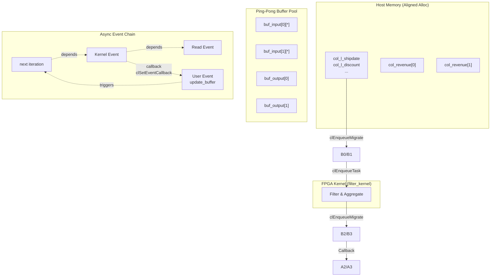

# TPC-H Q6 Modified: 基于 Ping-Pong 缓冲的异步 FPGA 查询加速 Host 程序

## 开篇概述

这是一个用于 **TPC-H Query 6 Modified**（简称为 Q6 Mod）的 FPGA 加速查询 Host 端实现。它并非简单的"发送数据-等待结果"式程序，而是一个精心设计的**异步流水线控制器**，其核心使命是在 CPU 与 FPGA 之间建立一条零拷贝、双缓冲、事件驱动的高吞吐数据通道。

想象一个现代化的机场行李处理系统：行李（数据）从值机柜台（Host 内存）出发，经过安检（FPGA 计算），最终到达转盘（结果输出）。这个程序设计的巧妙之处在于——它使用了**两条并行的传送带（Ping-Pong 双缓冲）**。当 FPGA 处理第一批行李时，CPU 已经在准备第二批；当第一批结果出炉时，第二批又刚好送达。两条传送带交替工作，消除了 FPGA 等待 CPU 准备数据的空闲时间。

这个模块位于 `database_query_and_gqe` 树中的演示层（`l1_l2_query_and_sort_demos`），直接面向 TPC-H 基准测试场景，是连接底层 FPGA Kernel 与上层数据库运行时之间的关键桥梁。

---

## 架构设计

### 数据流架构图



### 核心抽象

**1. 时间片轮转（Ping-Pong）抽象**
程序维护两组逻辑缓冲区（`step = 2`），通过模运算 `i % step` 决定当前时间片使用哪组物理资源。这种抽象使得 CPU 的数据准备阶段（Produce）与 FPGA 的计算阶段（Consume）在时间维度上重叠。

**2. 事件依赖图（Event DAG）**
不同于传统的同步屏障（barrier），程序使用 OpenCL 事件构建了一个有向无环图。每个异步操作（数据传输、Kernel 执行）生成一个事件句柄，后续操作声明对前置事件的依赖。这允许运行时以最高并行度调度任务，同时保证执行顺序的语义正确性。

**3. 延迟执行与回调（Deferred Execution）**
程序大量使用了回调机制（`clSetEventCallback`）来处理完成后逻辑。这不是简单的"函数指针"——它构成了一个**延续（Continuation）传递风格**的编程模型。当 FPGA 完成计算后，运行时系统调用 `print_buffer` 回调来消费结果；当主机侧需要准备下一批数据时，`update_buffer` 回调被触发来释放前置依赖。

---

## 核心组件详解

### 1. main 函数：编排主循环

`main` 函数是整个程序的交响乐乐手，它并不直接处理数据，而是**编排**三个并发阶段的生命周期：

**阶段一：基础设施初始化**
- 使用 `xclhost::init_hardware` 建立 OpenCL 上下文、设备连接和命令队列（启用性能分析和无序执行模式）
- 加载 `.xclbin` 比特流并实例化 `filter_kernel` Kernel 对象
- 分配主机侧页对齐内存（`aligned_alloc`），这是实现零拷贝（zero-copy）数据传输的前提

**阶段二：数据准备与配置编码**
- 从二进制文件加载 TPC-H Lineitem 表的五列数据（shipdate, discount, quantity, commitdate, extendedprice）
- **硬编码过滤条件**：程序手动构造了一个 64 深度的 `config_bits` 数组，将 SQL 谓词（如 `19940101 <= l_shipdate < 19950101`）编码为特定的位域格式，包括操作码（FOP_GEU, FOP_LTU 等）、操作数以及跨列比较规则

**阶段三：异步流水线主循环**
这是程序的核心逻辑。循环迭代 `num_rep` 次，每次迭代执行：
1. **选择 Ping-Pong 槽位**：`int pingpong = i % step;`
2. **数据入队（Host→Device）**：`clEnqueueMigrateMemObjects` 将输入缓冲区迁移到 FPGA 设备内存。注意：只有当 `i > (step - 1)` 时，才需要等待前一个迭代的主机侧更新事件 `update_events[i - step]`，这形成了跨迭代的依赖链
3. **Kernel 执行**：`clEnqueueTask` 提交 `filter_kernel`，依赖写事件完成
4. **回调注册（延续传递）**：如果当前迭代不是最后几个，注册 `update_buffer` 回调到 Kernel 完成事件。这个回调会触发 `update_events[i]`，允许 `i+step` 迭代的数据迁移开始
5. **数据回传（Device→Host）**：`clEnqueueMigrateMemObjects` 将结果（revenue）迁回主机，依赖 Kernel 事件
6. **结果回调**：注册 `print_buffer` 回调到读完成事件，负责验证结果并打印

最后，`clFinish(cq)` 确保所有队列操作完成，进行资源清理。

### 2. create_buffers：缓冲区创建与内存布局

这是一个纯 C 风格的资源分配函数，体现了 FPGA Host 编程中**显式内存管理**的哲学。

**内存扩展指针（Extended Pointer）机制**：
程序使用 `cl_mem_ext_ptr_t` 结构将主机已分配的内存（通过 `aligned_alloc`）与特定的 FPGA 内存库（Memory Bank）关联。每个 `mext_*` 结构包含：
- `flags`: 内存库索引（如 0, 1, 2...），对应 FPGA 上的不同 DDR/HBM 通道
- `obj`: 指向主机内存的指针
- `param`: 关联的 Kernel 对象

**零拷贝（Zero-Copy）策略**：
通过 `CL_MEM_USE_HOST_PTR` 标志，OpenCL 运行时直接使用主机页对齐内存，避免在 PCIe 上传输时额外的拷贝。结合 `CL_MEM_EXT_PTR_XILINX`，确保缓冲区分配到 FPGA 设备上指定的物理内存库，优化 Kernel 侧的内存访问带宽。

**深度对齐（Alignment）**：
缓冲区深度计算使用了位掩码技巧：`((L_MAX_ROW + 1023) & (-1UL ^ 0x3ffUL))`。这实际上是将行数向上取整到 1024 的倍数（1KB 对齐），满足 FPGA Kernel 对突发传输（burst transfer）长度的对齐要求。

### 3. 回调机制：update_buffer 与 print_buffer

这两个函数构成了**异步完成通知**的核心，体现了 OpenCL 中"Continuation-Passing Style"的编程范式。

**update_buffer**：
这是一个轻量级的信号传递回调。当 FPGA Kernel 完成第 `i` 次迭代的计算后，此回调被触发。它不处理数据，而是调用 `clSetUserEventStatus(t->update_event, CL_COMPLETE)`，将一个用户事件标记为完成。

这个设计的关键在于**解耦**：Kernel 完成事件不能直接触发下一次数据迁移（因为那需要特定的命令队列上下文），而是通过一个中介的用户事件 `update_events[i]` 来实现。第 `i+step` 次迭代的数据迁移命令（`clEnqueueMigrateMemObjects`）被配置为等待 `update_events[i]`，从而形成了**跨迭代的流水线依赖链**。

**print_buffer**：
这是结果处理回调，负责消费 FPGA 计算结果。当设备到主机的数据传输完成后，此回调读取 `col_revenue` 缓冲区的聚合结果（以固定点整数表示的金额），转换为十进制打印，并与预计算的参考值（golden data）进行比对。

**生命周期管理陷阱**：
回调函数接收的 `void* d` 指向 `update_buffer_data_t` 或 `print_revenue_data_t` 结构体实例。这些结构体数组（`ucbd`, `pcbd`）在堆上分配，并在 `clFinish` 之后、程序退出前才释放。这是安全的，因为 `clFinish` 会阻塞直到所有回调执行完毕。如果错误地在循环内部分配这些结构并让它们离开作用域，将导致**释放后使用（Use-After-Free）**的未定义行为。

### 4. 配置位编码：filter 条件硬编码

`config_bits` 数组的构造是 FPGA 数据库加速中**领域特定语言（DSL）到硬件配置**转换的典型案例。由于 FPGA Kernel 是固定的硬件流水线，它无法解析 SQL，只能通过预定义的位宽编码来理解过滤条件。

**编码结构（基于代码分析）**：
- **三元组格式**：每 3 个 `uint32_t` 构成一个谓词配置（Predicate Config）：`[min_val, max_val, op_code]`
- **操作码（OpCode）**：使用 `FOP_GEU` (Greater-Equal-Unsigned), `FOP_LTU` (Less-Than-Unsigned), `FOP_DC` (Don't Care) 等宏，通过位域拼接（`(op1 << FilterOpWidth) | op2`）形成复合操作

**代码中编码的 SQL 谓词**：
1. `19940101 <= l_shipdate < 19950101`：日期范围过滤（GEU + LTU）
2. `5 <= l_discount <= 7`：折扣范围过滤（GE + LE）
3. `l_quantity < 24`：数量小于（DC + LT，min 值忽略）
4. `l_commitdate`：不参与比较（DC + DC）

**跨列比较（Var-to-Var）**：
在基础三元组之后，代码使用位掩码 `r` 编码跨列比较（如 `l_shipdate > l_commitdate`）。每个比较对占用 `FilterOpWidth` 位，编码操作码（如 `FOP_GTU`）。这允许 Kernel 执行行内的列间比较，是实现复杂 SQL 条件（如日期比较）的关键。

**最后配置字**：
`config_bits[n++] = (uint32_t)(1UL << 31);` 设置了最高位，这通常作为配置流的**结束标记（End-of-Config）**或**有效位（Valid Bit）**，通知硬件配置加载完成并开始执行。

### 5. 辅助数据结构

**update_buffer_data_**：
```cpp
typedef struct update_buffer_data_ {
    cl_event update_event;
    int i;
} update_buffer_data_t;
```
这是回调延续的**信标（Beacon）**。`update_event` 是一个用户事件（User Event），初始状态为 `CL_SUBMITTED`。回调函数通过将其置为 `CL_COMPLETE`，向等待该事件的下一次数据迁移发出"可以继续"的信号。`i` 用于调试和日志记录，标识当前完成的迭代序号。

**print_revenue_data_**：
```cpp
typedef struct print_revenue_data_ {
    MONEY_T* col_revenue;
    int row;
    int i;
} print_revenue_data_t;
```
这是结果验证的**上下文（Context）**。它携带了指向结果缓冲区的指针（`col_revenue`）、测试数据行数（`row`，用于选择正确的参考值）和迭代序号。回调函数通过 `row` 判断当前是 1000 行小规模测试还是全量 1GB 数据测试，并与硬编码的参考值（`165752594` 或 `621028192435`）进行比对。

---

## 依赖关系分析

### 上游依赖（本模块调用谁）

**1. Xilinx Runtime (XRT) / OpenCL 扩展**
- **`<CL/cl_ext_xilinx.h>`**: 提供 Xilinx 特定的扩展，特别是 `cl_mem_ext_ptr_t` 结构体和 `CL_MEM_EXT_PTR_XILINX` 标志，用于显式控制 FPGA 内存库（DDR/HBM Bank）分配。
- **`xclhost.hpp`**: 封装了 FPGA 设备初始化、比特流加载和命令队列创建的辅助函数（`xclhost::init_hardware`, `xclhost::load_binary`）。
- **标准 OpenCL API**: `clCreateBuffer`, `clEnqueueMigrateMemObjects`, `clEnqueueTask`, `clCreateUserEvent`, `clSetEventCallback`, `clFinish` 等，构成异步执行的基础。

**2. 数据库专用类型与工具**
- **`table_dt.hpp`**: 定义 TPC-H 特定的数据类型（`DATE_T`, `MONEY_T`, `TPCH_INT`, `KEY_SZ`, `MONEY_SZ` 等），这些是数据库语义在 C++ 类型系统的映射。
- **`prepare.hpp` / `utils.hpp`**: 提供数据生成/加载工具（`prepare` 函数）和时间差计算（`tvdiff`）。
- **`filter_test.hpp` / `filter_kernel.hpp`**: 声明 FPGA Kernel 的函数签名（`filter_kernel`）和配置相关的宏（`FOP_GEU`, `FilterOpWidth` 等）。

**3. 日志与参数解析**
- **`xf_utils_sw/logger.hpp`**: 提供 `Logger` 类，统一封装测试通过/失败的日志输出。
- **`ArgParser`**: 简单的命令行参数解析器（`-xclbin`, `-data`, `-rep`, `-mini` 等）。

### 下游调用（谁调用本模块）

本模块是**顶层可执行程序**（Top-level Executable），在模块树中处于演示应用层（`l1_l2_query_and_sort_demos`）。它直接调用 FPGA Kernel (`filter_kernel`)，但不会被其他 Host 代码模块调用。

在系统架构中，它的下游是：
- **FPGA 比特流 (xclbin)**: 包含编译后的 `filter_kernel` 硬件逻辑。
- **物理硬件 (Alveo/U50/U200 等)**: 通过 PCIe 和 XRT 驱动交互。

### 同层模块关系

与兄弟模块共享相同的设计模式（Ping-Pong 缓冲、异步事件链）：
- **[q5_result_format_and_timing_types](database_query_and_gqe-l1_l2_query_and_sort_demos-q5_result_format_and_timing_types.md)**: TPC-H Q5 的实现，涉及更复杂的 Join 操作。
- **[q5_simplified_100g_buffer_and_timing_types](database_query_and_gqe-l1_l2_query_and_sort_demos-q5_simplified_100g_buffer_and_timing_types.md)**: Q5 的简化版，针对 100G 网络优化。
- **[gqesort_host_window_config_type](database_query_and_gqe-l1_l2_query_and_sort_demos-gqesort_host_window_config_types.md)**: GQE Sort 算子的 Host 配置。

---

## 设计决策与权衡

### 1. Ping-Pong 双缓冲 vs 单缓冲流水线

**选择的方案**：严格的 Ping-Pong 双缓冲（`step = 2`），通过 `i % 2` 轮询选择缓冲区。

**权衡分析**：
- **优势**：
  - **计算与传输重叠**：当 FPGA 处理 Buffer 0 时，Host 可以并发地通过 PCIe 将下一批数据写入 Buffer 1 的设备内存（通过 `update_buffer` 回调触发）。这隐藏了数据传输延迟。
  - **吞吐量最大化**：在理想情况下，整个系统的吞吐量由最慢的环节（FPGA 计算或 PCIe 传输）决定，双缓冲使得另一个环节可以并行工作。
- **代价**：
  - **内存占用翻倍**：需要分配两倍的设备内存和主机内存来存储输入/输出缓冲区。对于大规模数据（如 1GB TPC-H 数据），这可能成为瓶颈。
  - **复杂度增加**：需要管理两组缓冲区句柄，以及跨迭代的事件依赖（`update_events[i-step]`），调试难度高于单缓冲。

**替代方案（未采用）**：单缓冲+阻塞同步。每次传输数据、启动 Kernel、等待完成、读取结果，然后才能开始下一次。实现简单，但 FPGA 在 Host 准备数据时完全空闲，PCIe 带宽利用率极低。

### 2. 异步事件回调 vs 主动轮询

**选择的方案**：基于 OpenCL 事件回调（`clSetEventCallback`）的**被动通知**机制。

**权衡分析**：
- **优势**：
  - **CPU 效率**：在等待 FPGA 完成期间，Host 线程不需要忙等待（busy-waiting），可以处于睡眠状态或处理其他任务（虽然本程序中主循环是串行的，但架构上支持扩展）。
  - **细粒度流水线**：`update_buffer` 回调允许在 Kernel 刚完成（数据还在设备内存）时就触发下一批数据的传输，而不必等到结果读回主机，进一步重叠了设备到主机的回传与下一批的主机到设备传输。
- **代价**：
  - **编程复杂度**：回调函数必须是全局或静态函数，且需要仔细管理 `void* user_data` 的生命周期。错误地传递栈地址会导致回调时崩溃。
  - **调试困难**：异步执行的回调使得调用栈难以追踪，错误可能延迟到事件触发时才显现。

**替代方案（未采用）**：主动轮询（`clGetEventInfo` 查询状态）或阻塞等待（`clWaitForEvents`）。轮询浪费 CPU 周期；阻塞等待虽然简单，但无法实现上述的细粒度流水线重叠（例如在结果回传期间准备下一批数据）。

### 3. 零拷贝内存映射 vs 显式设备内存拷贝

**选择的方案**：**零拷贝（Zero-Copy）** 策略，通过 `CL_MEM_USE_HOST_PTR` 和 Xilinx 扩展 `CL_MEM_EXT_PTR_XILINX` 实现。

**权衡分析**：
- **优势**：
  - **消除冗余拷贝**：传统 OpenCL 流程需要 `malloc` 主机内存 -> `clCreateBuffer` 分配设备内存 -> `clEnqueueWriteBuffer` 拷贝数据。零拷贝让 FPGA DMA 直接读写主机页对齐内存，省去了中间的显式拷贝步骤和对应的内存占用。
  - **Bank 控制**：通过 `XBANK` 宏和 `cl_mem_ext_ptr_t` 的 `flags` 字段，可以显式指定缓冲区分配到 FPGA 的哪个 DDR/HBM Bank，这对于满足 Kernel 的带宽需求（如 lineitem 表的多列并发访问）至关重要。
- **代价**：
  - **页对齐约束**：必须使用 `aligned_alloc`（通常是 4KB 对齐）而非普通 `malloc`，否则 `CL_MEM_USE_HOST_PTR` 可能失败或内部退化为拷贝。
  - **缓存一致性**：CPU 和 FPGA 访问同一块物理内存，需要显式的缓存刷新/无效化（由 `clEnqueueMigrateMemObjects` 的 `CL_MIGRATE_MEM_OBJECT_HOST` 和 `0` 标志隐式管理），编程模型比显式设备内存更复杂。

**替代方案（未采用）**：显式设备缓冲区（`CL_MEM_ALLOC_HOST_PTR` 或纯设备内存）。这会分配独立于主机内存的设备侧缓冲区，需要显式的 `clEnqueueWriteBuffer` 和 `clEnqueueReadBuffer` 进行数据传输，增加了延迟和代码复杂度，但编程模型更简单（无需关心页对齐）。

### 4. 硬编码配置 vs 运行时 SQL 解析

**选择的方案**：**硬编码（Hard-coded）** 的位域配置，直接在 C++ 代码中手动构造 `config_bits` 数组。

**权衡分析**：
- **优势**：
  - **零运行时开销**：无需在 Host 端解析 SQL、构建抽象语法树（AST）或进行表达式优化，配置数据直接以 FPGA 可消费的位格式存在，初始化时间极短。
  - **确定性**：硬件行为完全由编译期决定的常量控制，避免了运行时动态配置可能引入的错误和不确定性，便于硬件调试和性能回归测试。
- **代价**：
  - **僵化（Rigidity）**：修改查询条件（如改变日期范围或折扣率）需要修改源代码、重新编译 Host 程序，无法支持即席查询（Ad-hoc Query）。
  - **可维护性差**：位域编码逻辑（如 `FOP_GEU << FilterOpWidth`）是底层硬件接口的直接映射，阅读性差，容易出错，且与上层 SQL 语义脱节。

**替代方案（未采用）**：运行时查询编译。在 Host 端集成一个轻量级 SQL 解析器或表达式编译器，将 SQL 谓词动态翻译为相同的 `config_bits` 格式。这会增加 Host 代码体积和初始化延迟，但提供了灵活性，更接近生产级数据库系统的行为。

---

## 依赖关系分析

### 上游依赖（本模块调用谁）

| 依赖模块/库 | 用途 | 关键接口 |
|------------|------|----------|
| **Xilinx XRT / OpenCL** | FPGA 设备管理、内存分配、任务调度 | `clCreateBuffer`, `clEnqueueTask`, `clSetEventCallback`, `cl_mem_ext_ptr_t` |
| **xclhost** (XRT 封装) | 简化设备初始化和比特流加载 | `xclhost::init_hardware`, `xclhost::load_binary` |
| **xf::common::utils_sw** | 日志记录和命令行解析 | `Logger`, `ArgParser` |
| **database/L1/demos/q6_mod** | 本地头文件：数据类型、Kernel 声明、工具函数 | `table_dt.hpp`, `filter_kernel.hpp`, `prepare.hpp` |

### 下游调用（谁调用本模块）

本模块是**顶层可执行程序**（`main` 函数所在），在模块树中处于演示层（`l1_l2_query_and_sort_demos`）。它直接调用 FPGA Kernel，但不会被其他 Host 代码模块调用。

其下游接口是**FPGA 比特流 (xclbin)** 中实现的 `filter_kernel`：
```cpp
void filter_kernel(
    ap_uint<32>* config_bits,
    ap_uint<8 * KEY_SZ * VEC_LEN>* col_l_shipdate,
    ap_uint<8 * MONEY_SZ * VEC_LEN>* col_l_discount,
    ap_uint<8 * TPCH_INT_SZ * VEC_LEN>* col_l_quantity,
    ap_uint<8 * KEY_SZ * VEC_LEN>* col_l_commitdate,
    ap_uint<8 * MONEY_SZ * VEC_LEN>* col_l_extendedprice,
    int l_nrow,
    ap_uint<8 * MONEY_SZ * 2>* col_revenue
);
```
该 Kernel 接收打包的列数据（向量化宽度 `VEC_LEN`），执行过滤和聚合（计算 revenue），输出两个值（可能是部分和与校验和）。

### 同层模块关系

与兄弟模块共享相同的设计模式（Ping-Pong 缓冲、异步事件链）：
- **[q5_result_format_and_timing_types](database_query_and_gqe-l1_l2_query_and_sort_demos-q5_result_format_and_timing_types.md)**: TPC-H Q5 的实现，涉及更复杂的 Join 操作。
- **[q5_simplified_100g_buffer_and_timing_types](database_query_and_gqe-l1_l2_query_and_sort_demos-q5_simplified_100g_buffer_and_timing_types.md)**: Q5 的简化版，针对 100G 网络优化。
- **[gqesort_host_window_config_type](database_query_and_gqe-l1_l2_query_and_sort_demos-gqesort_host_window_config_type.md)**: GQE Sort 算子的 Host 配置。

---

## 使用指南

### 命令行参数

编译生成的可执行文件支持以下命令行参数：

```bash
./filter_test -xclbin <path_to_xclbin> -data <data_directory> [options]
```

| 参数 | 长/短形式 | 描述 | 是否必需 |
|------|----------|------|----------|
| xclbin 路径 | `-xclbin FILE` | FPGA 比特流文件路径 | 是 |
| 数据目录 | `-data DATADIR` | TPC-H Lineitem 表数据目录 | 是 |
| 重复次数 | `-rep N` | 连续运行 N 次（默认 1，最大 20） | 否 |
| 迷你模式 | `-mini M` | 仅加载前 M 行数据（默认加载全部） | 否 |
| 帮助 | `-h` | 显示帮助信息 | 否 |

### 执行流程示例

**1. 准备数据**
确保数据目录包含 Lineitem 表的二进制列文件（`l_shipdate.dat`, `l_discount.dat`, `l_quantity.dat`, `l_commitdate.dat`, `l_extendedprice.dat`）。

**2. 运行测试（完整数据集）**
```bash
./filter_test -xclbin /path/to/q6_mod.xclbin -data /tpch/sf1/ -rep 5
```
输出示例：
```
------------ TPC-H Query 6 Modified (1G) -------------
Lineitem 6000000 rows
Host input buffers have been allocated.
Lineitem table has been read from disk
FPGA result 0: 16575.2594
PASS!
...
Total wall time of 5 runs: 123456 usec
```

**3. 运行测试（迷你模式，快速验证）**
```bash
./filter_test -xclbin /path/to/q6_mod.xclbin -data /tpch/sf1/ -mini 1000
```
这将只加载 1000 行数据，并与预定义的参考值 `16575.2594` 进行比对。

---

## 陷阱与边界情况

### 1. 回调数据生命周期（Use-After-Free 风险）

**危险模式**：在循环内部分配回调数据并传递指针。
```cpp
// 错误示例！
for (int i = 0; i < num_rep; ++i) {
    update_buffer_data_t local_data;  // 栈变量
    local_data.i = i;
    clSetEventCallback(kernel_events[i], CL_COMPLETE, update_buffer, &local_data);
    // local_data 在循环迭代结束时销毁，但回调可能稍后异步执行！
}
```

**正确做法**：如本模块所示，使用堆分配并确保生命周期覆盖所有异步操作：
```cpp
update_buffer_data_t* ucbd = (update_buffer_data_t*)malloc(sizeof(update_buffer_data_t) * num_rep);
// ... 循环中设置 ucbd[i] ...
clFinish(cq);  // 确保所有回调执行完毕
free(ucbd);    // 现在可以安全释放
```

### 2. 缓冲区大小对齐约束

**危险**：`l_depth` 计算不正确导致 FPGA 访问越界或性能下降。
```cpp
// 原始代码中的对齐逻辑
#define BUF_L_DEPTH ((L_MAX_ROW + 1023) & (-1UL ^ 0x3ffUL))
```
这实际上等价于 `((L_MAX_ROW + 1023) / 1024) * 1024`，即向上取整到 1024 的倍数。

**必须遵守的规则**：
- 主机缓冲区必须使用 `aligned_alloc(4096, size)`（4KB 页对齐）
- 设备缓冲区深度必须是 FPGA Kernel 突发传输长度（通常为 64 或 256 个数据字）的整数倍
- 违反这些约束不会导致编译错误，但会在运行时产生 `CL_INVALID_BUFFER_SIZE`、段错误，或更隐蔽的静默数据损坏。

### 3. HLS_TEST 模式差异

代码中通过 `#ifdef HLS_TEST` 区分两种执行模式：
- **HLS_TEST**: 直接调用 C++ 函数 `filter_kernel(...)`，用于纯软件仿真（如 Vivado HLS Co-Simulation）。此时没有 OpenCL 上下文，数据直接传递指针。
- **XRT 模式**（默认）：使用 OpenCL API 调度 FPGA。

**陷阱**：在 HLS_TEST 模式下，`aligned_alloc` 的指针可以直接传给 `filter_kernel`，但在 XRT 模式下，必须通过 `clCreateBuffer` 包装。混合两种模式的代码（如错误地在 HLS_TEST 分支中调用 `clEnqueueTask`）会导致编译或链接错误。

### 4. 事件依赖死锁风险

**危险模式**：错误的事件依赖链可能导致循环等待。
```cpp
// 错误示例：循环依赖
clEnqueueMigrateMemObjects(cq, ..., 1, &write_events[i], &kernel_events[i]);
// 错误地让下一次写等待当前 Kernel，而当前 Kernel 又依赖本次写
clEnqueueMigrateMemObjects(cq, ..., 1, &kernel_events[i], &write_events[i+1]); 
```

**本模块的安全设计**：
- **单向依赖**：写事件 -> Kernel 事件 -> 读事件，形成有向无环图（DAG）。
- **跨迭代解耦**：第 `i` 次迭代的数据迁移（写）仅依赖第 `i-step` 次迭代的 `update_events`（用户事件），而非直接的 OpenCL 事件。这避免了跨迭代的复杂引用计数问题。

**调试建议**：如果程序挂起在 `clFinish`，使用 `xbtop` 或 `xbutil examine` 查看 FPGA 卡状态，并打印 OpenCL 事件状态（`CL_QUEUED`, `CL_SUBMITTED`, `CL_RUNNING`, `CL_COMPLETE`）以定位死锁点。

### 5. 配置位版本兼容性

**隐患**：`config_bits` 的位域编码是 Host 代码与 FPGA Kernel 之间的**二进制契约（Binary Contract）**。如果 FPGA 端的 `filter_kernel` 重新综合，改变了配置寄存器的位宽或操作码定义（如 `FilterOpWidth` 从 4 改为 5），而 Host 代码没有同步更新，将导致：
- **静默错误**：FPGA 解析出错误的谓词条件（如把 "大于" 解析成 "小于"），产生错误的查询结果而不崩溃。
- **硬件挂起**：配置位被解析为非法操作码，导致 FPGA 控制逻辑进入死锁。

**缓解措施**：
- 在 `filter_test.hpp` 中定义固定的操作码宏（`FOP_GEU`, `FOP_LTU` 等），确保 Host 和 Kernel 引用同一头文件。
- 在 Host 代码中加入 `config_bits` 的校验和或版本号检查（通过最后的 `(1UL << 31)` 标记验证）。
- 持续集成（CI）中必须将 Host 代码与 Kernel 比特流作为原子单元进行版本锁定和联合测试。
