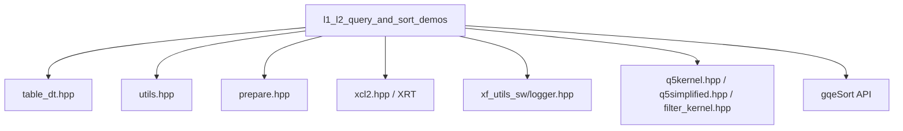

# l1_l2_query_and_sort_demos 模块深度解析

## 一句话概括

这是一个**FPGA 数据库查询加速演示展厅**，将复杂的 TPC-H SQL 查询（多表 Join、过滤、排序）映射到 FPGA 硬件加速内核，展示从 1GB 到 100GB 规模的数据库查询硬件加速能力。

---

## 1. 问题空间：为什么需要这个模块？

### 1.1 传统数据库查询的痛点

想象一个典型的数据仓库查询场景：需要关联 6 张表（Region → Nation → Customer → Orders → Lineitem → Supplier），过滤特定地区（如"MIDDLE EAST"），并按收入排序。在 CPU 上执行时：

- **内存带宽瓶颈**：顺序扫描大表时，CPU 缓存失效严重
- **分支预测失败**：复杂的 WHERE 条件导致流水线气泡
- **Join 复杂度**：多表 Hash Join 的中间结果物化开销巨大

### 1.2 FPGA 加速的机会

这个模块展示的核心理念是**"查询卸载"（Query Offloading）**：

```
┌─────────────────────────────────────────────────────────────┐
│  Host CPU (Control Plane)                                   │
│  - SQL 解析与优化                                           │
│  - 数据分区与调度                                           │
│  - 结果聚合与排序                                           │
└──────────────────────┬──────────────────────────────────────┘
                       │ PCIe / XRT
┌──────────────────────▼──────────────────────────────────────┐
│  FPGA Data Plane (Kernel)                                   │
│  - 流式 Hash Join (8 个 PU 并行)                            │
│  - 谓词过滤下推                                             │
│  - 硬件流水线并行                                           │
└─────────────────────────────────────────────────────────────┘
```

### 1.3 模块的演示范围

本模块包含四个主要演示场景，覆盖不同复杂度：

| 演示 | 复杂度 | 核心特性 | 数据规模 |
|------|--------|----------|----------|
| **Q5 Full** | 高 | 6 表 Join + 聚合排序 | 1GB (SF1) |
| **Q5 Simplified** | 中 | 2 表 Join + 水平分区 | 1-100GB |
| **Q6 Filter** | 低 | 单列过滤 + 聚合 | 1GB |
| **Sorting** | 中 | 键值对排序 | 可变 |

---

## 2. 心智模型：如何理解这个模块？

### 2.1 类比：餐厅厨房流水线

想象这个模块是一个**高端餐厅的中央厨房系统**：

- **Host 端（前台经理）**：接收订单（SQL 查询），准备食材（加载数据到 DDR），协调上菜节奏（事件调度）。
- **FPGA 端（厨房流水线）**：
  - **Q5 Full** 像处理一道复杂的多层次主菜：需要先处理配菜（Region/Nation 过滤），再层层叠加（Customer→Orders→Lineitem→Supplier）。
  - **Q5 Simplified** 像快餐流水线：将大订单分成多个小批次（水平分区），每个厨师（PU）处理一批。
  - **Q6 Filter** 像专用沙拉吧：只负责筛选新鲜食材（过滤），计算总重量（聚合）。
  - **Sorting** 像自动装盘机：将做好的菜品按大小顺序排列。

### 2.2 核心抽象层次

```
┌────────────────────────────────────────────────────────────────┐
│  Layer 4: Application (Test Host)                              │
│  - test_q5.cpp, test_q5s.cpp, filter_test.cpp                  │
│  - 负责：命令行解析、数据加载、结果验证、性能计时              │
├────────────────────────────────────────────────────────────────┤
│  Layer 3: FPGA Runtime (XRT/OpenCL)                              │
│  - Buffer 管理 (cl::Buffer, cl_mem_ext_ptr_t)                  │
│  - Kernel 参数绑定 (setArg, enqueueTask)                         │
│  - 事件依赖图 (enqueueMigrateMemObjects, event callbacks)      │
├────────────────────────────────────────────────────────────────┤
│  Layer 2: Data Movement (Ping-Pong / Double Buffering)         │
│  - 输入缓冲区对 (buf_input[0/1], buf_a/b)                       │
│  - 水平分区 (HORIZ_PART, horizontal partitioning)               │
│  - 异步回调更新 (update_buffer callback)                        │
├────────────────────────────────────────────────────────────────┤
│  Layer 1: Kernel Interface (Hardware ABI)                      │
│  - q5_hash_join, q5simplified, filter_kernel                   │
│  - 参数编码 (key 列, payload 列, 配置字)                        │
│  - Hash 表存储 (stb_buf[PU_NM])                                 │
└────────────────────────────────────────────────────────────────┘
```

### 2.3 关键数据结构速查

| 结构/类 | 所在文件 | 作用 | 关键字段 |
|---------|----------|------|----------|
| `rlt_pair` | test_q5.cpp | Q5 结果对 | `name`, `nationkey`, `group_result` |
| `print_buf_result_data_` | test_q5.cpp | 回调数据 | `i`, `v`, `price`, `discount`, `r` |
| `update_buffer_data_` | test_q5s.cpp | 分区更新 | 双缓冲指针对, `event_update` |
| `print_revenue_data_` | filter_test.cpp | 收入打印 | `col_revenue`, `row`, `i` |
| `winsize` | test_sorting.cpp | 终端窗口 | `ws_row`, `ws_col` |

---

## 3. 架构详解：数据流与控制流

### 3.1 TPC-H Q5 Full 的数据流（最复杂场景）

Q5 查询涉及 6 张表的星型/雪花模型 Join：

```
SQL 逻辑：
SELECT n_name, sum(l_extendedprice * (1 - l_discount)) as revenue
FROM Region, Nation, Customer, Orders, Lineitem, Supplier
WHERE r_regionkey = n_regionkey 
  AND n_nationkey = c_nationkey
  AND c_custkey = o_custkey
  AND o_orderkey = l_orderkey
  AND l_suppkey = s_suppkey
  AND s_nationkey = n_nationkey  -- 回到 Nation
  AND r_name = 'MIDDLE EAST'
  AND o_orderdate >= 1994-01-01
  AND o_orderdate < 1995-01-01
GROUP BY n_name
ORDER BY revenue DESC;
```

在 FPGA 中的流水线实现：

```
Stage 1: CPU Pre-processing (Region-Nation Join)
├─ Filter Region where r_name = 'MIDDLE EAST'
├─ Hash Join with Nation on regionkey
└─ Output: n_nationkey (5 keys) → n_out_k[]

Stage 2: FPGA Kernel 1 - Customer Join (q5_hash_join, cfg=228)
├─ Input: n_out_k[] (probe side), Customer table (build side)
├─ Hash Join on c_nationkey
├─ Output: c_custkey, c_nationkey → out1_k/p1
└─ Uses 8 PU hash tables (stb_buf[0..7])

Stage 3: FPGA Kernel 2 - Orders Join (q5_hash_join, cfg=156)
├─ Input: out1_k/p1 (probe), Orders (build)
├─ Hash Join on o_custkey
├─ Filter: o_orderdate in [19940101, 19950101)
├─ Output: o_orderkey, c_nationkey → out2_k/p1
└─ Uses 8 PU hash tables

Stage 4: FPGA Kernel 3 - Lineitem Join (q5_hash_join, cfg=228)
├─ Input: out2_k/p1 (probe), Lineitem (build)
├─ Hash Join on l_orderkey
├─ Output: l_suppkey, price, discount, c_nationkey → out1_* (reuse buffers)
└─ 8 PU hash tables

Stage 5: FPGA Kernel 4 - Supplier Join (q5_hash_join, cfg=210)
├─ Input: out1_* (probe), Supplier (build)
├─ Hash Join on l_suppkey = s_suppkey
├─ Final aggregation by nation
└─ Output: result pairs

Stage 6: CPU Post-processing
├─ Callback print_buf_result() triggered by read_events
├─ Group-by aggregation on c_nationkey
├─ Order-by revenue DESC
└─ Compare with golden results
```

### 3.2 Ping-Pong 双缓冲机制

这是 Q5 Full 和 Q5 Simplified 的核心优化技术：

```cpp
// Q5 Full 中的双缓冲实现
for (int i = 0; i < num_rep; ++i) {
    int use_a = i & 1;  // 交替选择 A/B 缓冲区
    
    // 1. 迁移输入数据到 FPGA DDR (使用上一轮计算)
    if (i > 1) {
        q.enqueueMigrateMemObjects(ib, 0, &read_events[i - 2], &write_events[i][0]);
    }
    
    // 2. 启动 Kernel (依赖数据迁移完成)
    q.enqueueTask(kernel0, &write_events[i], &kernel_events_c[i][0]);
    
    // 3. 读回结果 (依赖 Kernel 完成)
    q.enqueueMigrateMemObjects(ob, CL_MIGRATE_MEM_OBJECT_HOST, &kernel_events_s[i], &read_events[i][0]);
    
    // 4. 设置回调处理结果
    read_events[i][0].setCallback(CL_COMPLETE, print_buf_result, cbd_ptr + i);
}
```

**关键设计决策**：
- **为什么用双缓冲？** 隐藏数据传输延迟。当 Kernel 处理 Buffer A 时，CPU 可以准备 Buffer B 的数据；当 Kernel 处理 Buffer B 时，可以读取 Buffer A 的结果。
- **事件链依赖**：write_events[i] → kernel_events[i] → read_events[i] → callback，形成完整的流水线。

### 3.3 Q5 Simplified 的水平分区策略

对于 100GB 数据集，单 FPGA 内存无法容纳，采用水平分区：

```cpp
#define ORDERKEY_RAGNE (6000000)
#define HORIZ_PART ((ORDERKEY_MAX + ORDERKEY_RAGNE - 1) / ORDERKEY_RAGNE)

// 数据按 orderkey 范围分区
for (int i = 0; i < HORIZ_PART; ++i) {
    KEY_T okey_max = ORDERKEY_RAGNE * (i + 1) + 1;
    // 读取属于该分区的 Lineitem 和 Orders 数据
    // 分配 col_l_orderkey[i], col_o_orderkey[i] 等分区缓冲区
}
```

**流水线执行**：
```
Partition 0: [Write] → [Kernel] → [Read] → [Callback Update Buffer for Partition 2]
Partition 1:          [Write] → [Kernel] → [Read] → [Callback Update Buffer for Partition 3]
Partition 2:                   [Write] → [Kernel] → [Read]
```

---

## 4. 关键设计决策与权衡

### 4.1 HLS_TEST vs 硬件模式

代码中大量使用条件编译：
```cpp
#ifdef HLS_TEST
    // 纯 C++ 仿真，直接调用 kernel 函数
    q5_hash_join(...);
#else
    // OpenCL/XRT 硬件调用
    q.enqueueTask(kernel0, ...);
#endif
```

**权衡**：
- **HLS_TEST**：快速迭代，无需硬件，适合算法验证。但无法测试真实 PCIe 带宽、内存 Bank 冲突。
- **硬件模式**：真实性能，但编译周期长（小时级），调试困难。

**设计选择**：保持两套代码路径，通过宏切换。代价是代码冗余（如重复设置 kernel 参数），但确保了可测试性。

### 4.2 内存 Bank 分配策略

在 Q5 中，显式指定了 DDR Bank 分配：
```cpp
#define XCL_BANK0 XCL_BANK(0)
// ...
cl_mem_ext_ptr_t mext_n_out_k = {0, n_out_k, kernel0()};  // Bank 0
cl_mem_ext_ptr_t mext_c_nationkey = {2, col_c_nationkey, kernel0()};  // Bank 2
```

**权衡**：
- **自动分配**：简单，但可能导致 Bank 冲突，带宽受限。
- **显式分配**：最大化并行带宽（Q5 使用了 Bank 0-15），但代码硬编码，可移植性差（不同板卡 Bank 数不同）。

### 4.3 回调 vs 轮询

结果获取采用 OpenCL 事件回调：
```cpp
read_events[i][0].setCallback(CL_COMPLETE, print_buf_result, cbd_ptr + i);
```

而非：
```cpp
clWaitForEvents(1, &read_events[i]);
```

**权衡**：
- **回调**：CPU 可在等待时做其他工作（如准备下一批数据），但代码复杂（需管理回调数据生命周期）。
- **轮询**：简单直观，但 CPU 空转浪费。

**选择**：在 Q5 Full 中使用回调，因为 Host 需要在做 Group-by 和 Order-by 时 overlap 数据传输。

---

## 5. 新贡献者必读：陷阱与契约

### 5.1 隐含的内存对齐契约

代码中大量使用 `aligned_alloc`：
```cpp
TPCH_INT* col_l_orderkey = aligned_alloc<TPCH_INT>(l_depth);
```

**陷阱**：如果改用普通 `malloc`，FPGA DMA 可能失败或性能骤降。Xilinx XRT 要求主机缓冲区 4KB 对齐。

### 5.2 VEC_LEN 偏移陷阱

数组访问常有 `+ VEC_LEN` 偏移：
```cpp
col_l_orderkey[0] = l_nrow;  // 第 0 个元素存行数
err = load_dat<TPCH_INT>(col_l_orderkey + VEC_LEN, "l_orderkey", in_dir, l_nrow);
```

**陷阱**：`col_l_orderkey[0]` 被用作元数据存储行数，实际数据从索引 `VEC_LEN`（通常是 16）开始。这是为了 FPGA 内核的 512-bit 对齐（16 x 32-bit）。

### 5.3 事件回调的生命周期

在 Q5 Full 中：
```cpp
std::vector<print_buf_result_data_t> cbd(num_rep);
// ...
read_events[i][0].setCallback(CL_COMPLETE, print_buf_result, cbd_ptr + i);
```

**陷阱**：`cbd` 必须在 `clFinish` 之后才能销毁。如果提前出作用域，回调访问野指针。

### 5.4 配置字的魔法数字

Q5 的 `q5_hash_join` 调用有神秘参数：
```cpp
q5_hash_join(..., 228, // 0+1*4+2*16+3*64
             0, 3);
```

**契约**：`228` 是列配置编码（`0+1*4+2*16+3*64`），表示 4 个 payload 列的排列方式。最后一个参数 `3` 表示使用 3 个 key 列（Nation 过滤）。这些数字必须与 Kernel 头文件 `q5kernel.hpp` 中的定义严格一致。

### 5.5 HLS_TEST 模式下的内存限制

在 HLS_TEST 模式下：
```cpp
ap_uint<8 * KEY_SZ * 4>* stb_buf[PU_NM];
for (int i = 0; i < PU_NM; i++) {
    stb_buf[i] = aligned_alloc<ap_uint<8 * KEY_SZ * 4> >(BUFF_DEPTH);
}
```

**陷阱**：`ap_uint` 是 Xilinx HLS 专用类型。在纯 C++ 编译（HLS_TEST）时，需要包含 `ap_int.h`，且分配的大数组可能导致栈溢出（应使用 `aligned_alloc` 堆分配）。

---

## 6. 子模块导航

本模块包含以下子模块，详细文档见对应文件：

| 子模块 | 文档链接 | 核心内容 |
|--------|----------|----------|
| **q5_result_format_and_timing_types** | [q5_result_format_and_timing_types](database_query_and_gqe-l1_l2_query_and_sort_demos-q5_result_format_and_timing_types.md) | TPC-H Q5 完整版的结果结构 `rlt_pair`、时间测量 `timeval`、回调数据 `print_buf_result_data_` |
| **q5_simplified_100g_buffer_and_timing_types** | [q5_simplified_100g_buffer_and_timing_types](database_query_and_gqe-l1_l2_query_and_sort_demos-q5_simplified_100g_buffer_and_timing_types.md) | 100GB 简化版的水平分区缓冲区、`update_buffer_data_` 回调、ping-pong 管理 |
| **q6_mod_filter_output_buffer_and_timing_types** | [q6_mod_filter_output_buffer_and_timing_types](database_query_and_gqe-l1_l2_query_and_sort_demos-q6_mod_filter_output_buffer_and_timing_types.md) | Q6 过滤操作的收入计算 `print_revenue_data_`、配置字编码、回调机制 |
| **gqesort_host_window_config_type** | [gqesort_host_window_config_type](database_query_and_gqe-l1_l2_query_and_sort_demos-gqesort_host_window_config_type.md) | GQE Sort 的窗口配置 `winsize`、单/批处理模式、排序 API 使用 |

---

## 7. 依赖关系与集成点

### 7.1 上游依赖（本模块依赖谁）



- **Database Core** (`table_dt.hpp`, `utils.hpp`): TPCH 数据类型定义（`TPCH_INT`, `MONEY_T`）、工具函数（`tvdiff`, `aligned_alloc`）。
- **Data Generator** (`prepare.hpp`): 生成测试数据集的接口。
- **Xilinx Runtime** (`xcl2.hpp`, `CL/cl_ext_xilinx.h`): OpenCL 封装和 Xilinx 扩展（Bank 分配 `XCL_MEM_TOPOLOGY`）。
- **HLS Kernels** (`q5kernel.hpp`): FPGA Kernel 的 C++ 仿真模型，HLS_TEST 模式下链接。

### 7.2 下游依赖（谁依赖本模块）

本模块是**叶节点演示模块**，通常不被其他模块直接依赖。但在完整的 GQE（Query Engine）系统中：

- **l3_gqe_execution_threading_and_queues** 可能复用这里的**事件调度模式**。
- **l1_compound_sort_kernels** 可能参考 **gqesort** 的接口设计。

### 7.3 构建与运行契约

**必须提供的运行时参数**：
```bash
# Q5 Full
./test_q5 -xclbin q5kernel.xclbin -work ./data

# Q5 Simplified (100G)
./test_q5s -xclbin q5simplified.xclbin -work ./data -sf 100

# Q6 Filter
./filter_test -xclbin filter.xclbin -data ./data

# Sorting
./test_sorting --xclbin sort.xclbin --in input.dat --out output.dat
```

**数据准备**：依赖 `prepare(work_dir, sf)` 生成 `.dat` 文件（二进制格式，非 CSV）。

---

## 8. 性能调优指南

### 8.1 关键性能指标（KPI）

| 指标 | 目标值 (U50/U280) | 调优手段 |
|------|------------------|----------|
| **Kernel 频率** | 250-300 MHz | HLS pragma 优化 |
| **PCIe 带宽利用率** | >80% | 增大传输块大小 |
| **DDR Bank 并行** | 16 Banks 全用 | 显式分配 mext 到不同 Bank |
| **PU 利用率** | 8 PUs 满载 | 确保数据倾斜度 <20% |

### 8.2 常见性能瓶颈

**瓶颈 1：CPU 端数据加载（prepare 阶段）**
- **症状**：FPGA 等待，利用率低。
- **解决**：使用 SSD + 异步 IO，或预先将数据驻留 DDR（保留内存映射）。

**瓶颈 2：Hash 表溢出（Q5 Full）**
- **症状**：结果错误或不匹配。
- **解决**：增大 `BUFF_DEPTH`（需重新编译 Kernel），或调整分区策略减少倾斜。

**瓶颈 3：PCIe 传输小数据**
- **症状**：传输时间占比 >50%。
- **解决**：启用双缓冲（本模块已实现），增大 `num_rep` 摊销启动开销。

---

## 9. 总结：什么时候用这个模块？

### 9.1 适用场景

✅ **教育/概念验证**：理解 FPGA 如何加速数据库查询，特别是 Hash Join 流水线。

✅ **性能基准测试**：对比 CPU vs FPGA 的 TPC-H 查询延迟，用于采购决策。

✅ **算法预研**：在 HLS_TEST 模式下快速验证新的 Join 算法或过滤策略，无需硬件。

✅ **系统集成模板**：作为起点，将 GQE Kernel 集成到更大的数据库系统中（如对接 PostgreSQL FDW）。

### 9.2 不适用场景

❌ **生产级直接部署**：缺乏完整的 SQL 解析器、优化器、事务管理、错误恢复。

❌ **通用数据分析**：仅支持特定的 TPC-H 查询模式，不支持任意 SQL。

❌ **云原生部署**：缺乏 Kubernetes Operator、资源调度、多租户隔离机制。

---

## 附录：关键代码片段索引

| 功能 | 文件 | 行号范围 | 说明 |
|------|------|----------|------|
| Ping-Pong 双缓冲 | test_q5.cpp | ~1150-1250 | use_a = i & 1 切换逻辑 |
| 水平分区读取 | test_q5s.cpp | ~350-450 | HORIZ_PART 循环读取 |
| 配置字生成 | filter_test.cpp | ~450-550 | config_bits 位域编码 |
| 回调注册 | test_q5.cpp | ~1200 | setCallback 与 userdata |
| Bank 分配 | test_q5.cpp | ~600-700 | XCL_BANK 宏使用 |

---

**文档版本**: 1.0  
**最后更新**: 2024  
**维护者**: Database Acceleration Team
