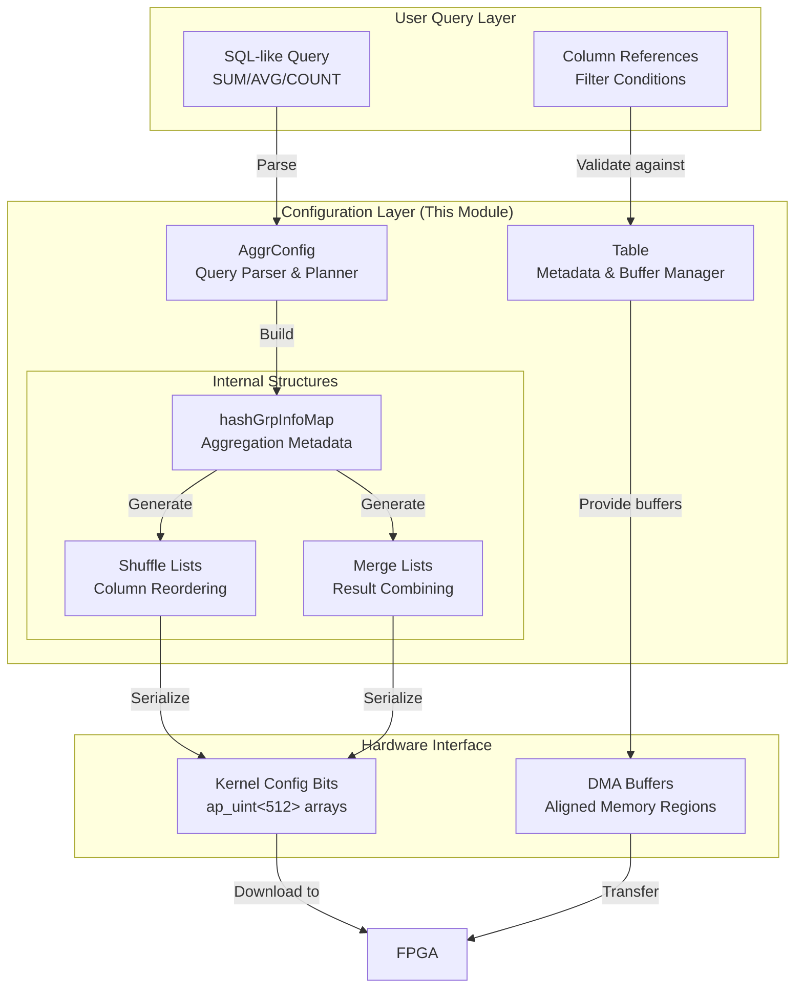

# L3 GQE Configuration and Table Metadata

## 开篇：这个模块在解决什么问题？

想象你正在设计一个数据库查询加速器，它需要把 SQL 查询翻译成 FPGA 能理解的硬件指令。你面临的第一个挑战是：**如何在软件层面描述一张表的结构，并把聚合查询（如 `SUM(amount)`, `AVG(price)`）映射到硬件的并行计算单元？**

这就是 `l3_gqe_configuration_and_table_metadata` 模块的核心职责。它是 Xilinx FPGA 数据库加速库（GQE, General Query Engine）的"元数据管理层"，负责：

1. **Table 抽象**：管理列式数据的内存布局、对齐要求、分片策略，以及验证缓冲区的生命周期
2. **AggrConfig 编排**：将高级 SQL 聚合表达式（如 `AVG(x)` 分解为 `SUM(x)/COUNT(x)`）翻译成 FPGA 配置位，包括列重排（shuffle）、合并（merge）和算子映射

可以把这两个核心类想象成机场的值机柜台和航线规划系统：`Table` 负责行李（数据）的称重、贴标签和分区存放；`AggrConfig` 则负责根据乘客目的地（查询需求）规划中转路线（shuffle/merge），并生成登机牌（FPGA 配置位）。

---

## 架构全景

### 数据流与组件关系



### 核心组件职责

**AggrConfig**：作为查询优化器和配置生成器，它承担了三个关键角色：
1. **语法解析**：将字符串形式的聚合表达式（如 `"sum(price)"`）解析为内部 `hashGrpInfo` 结构，识别算子类型（AOP_SUM, AOP_MEAN 等）
2. **逻辑规划**：确定列的重排策略（shuffle），以最小化硬件资源使用；规划部分结果的合并（merge）策略，处理多阶段聚合
3. **位流生成**：将高级配置序列化为 FPGA 可直接消费的位数组（`ap_uint<512>`），包括扫描参数、shuffle 索引、聚合算子映射等

**Table**：作为数据管理层，它处理：
1. **内存布局**：管理列式存储的指针对 (`ColPtr`)，确保 4KB 对齐以满足 FPGA DMA 要求；支持数据分片（section/slicing）以实现并行处理
2. **元数据追踪**：维护列名到索引的映射、数据类型大小、行数统计；管理特殊的系统列（RowID、Validation buffer）
3. **生命周期管理**：通过 `posix_memalign` 分配对齐内存，通过文件 I/O 加载数据，确保在表销毁时正确释放资源

---

## 组件深度解析

### AggrConfig：从 SQL 到硬件配置的翻译官

#### 核心数据结构：hashGrpInfo

在聚合配置的内部，`hashGrpInfo` 结构扮演着"元数据原子"的角色，每个实例描述一个输出列的完整生命周期：

```cpp
struct hashGrpInfo {
    std::string key_name;     // 列的唯一标识名（如 "priceAOP_SUM"）
    int windex;               // 在输出序列中的写入位置
    int merge_ind;            // 在合并阶段的源列索引
    int key_info;             // 是否为分组键（1=是，-1=否/聚合列）
    ap_uint<4> aggr_info;     // 聚合算子类型（AOP_SUM, AOP_MEAN等）
    int route;                // 路由标记（用于AVG分解等复杂场景）
};
```

想象一下，FPGA 的聚合单元就像一系列专门的车间，每个车间只能做一种特定的加工（SUM、COUNT、MIN、MAX）。`hashGrpInfo` 就是贴在每个零件上的工艺卡，告诉流水线：这个零件应该送到哪个车间、加工完后送到哪里、最终组装到哪里。

#### 查询解析流程：以 AVG 分解为例

`AggrConfig` 的构造函数展示了它如何处理复杂查询。以 `AVG(price)` 为例，这不能直接用硬件的 AVG 单元（因为硬件通常只支持基础算子），所以需要分解：

1. **解析阶段**：`checkIsAggr` 识别出 `avg(` 前缀，设置 `aggr_info = AOP_MEAN`，同时标记需要进行 "avg_to_sum" 转换
2. **列扩展阶段**：在 `extractWcols` 中，AVG 列被扩展为两个内部列：一个用于 SUM（`priceAOP_SUM`），一个用于 COUNT（`priceAOP_COUNT`）
3. **映射构建阶段**：`avg_to_sum_map` 记录了 `priceAOP_MEAN -> priceAOP_SUM` 的依赖关系，以便后续结果合并
4. **硬件配置阶段**：生成的 `hashGrpInfo` 中，原 AVG 列的 `route=1` 标记，表示需要在软件层进行最终除法计算

这种设计体现了**分层计算**的思想：FPGA 负责高吞吐量的基础聚合（SUM/COUNT），而 CPU 负责低频率的最终归约（除法）。这是典型的异构计算分工——把最适合硬件的留给硬件，把需要灵活性的留给软件。

#### 列重排（Shuffle）与合并（Merge）策略

`shuffle` 方法是理解硬件数据流的关键。FPGA 的聚合单元通常有固定的输入端口（比如 8 个），但查询可能涉及任意组合的列。`shuffle` 就像是机场的值机排序算法：

```cpp
// 伪代码示意 shuffle 逻辑
for each column in query:
    if column is referenced in expression:
        // 放到前排（低索引），因为FPGA前端端口有限
        shuffle_list.push_front(column_index)
    else:
        // 放到后排或丢弃
        shuffle_list.push_back(column_index)
```

`compressCol` 进一步优化：如果某列在后续阶段完全不被引用（比如仅在过滤条件中使用，在聚合阶段不需要），它会被从 `col_names` 和 `shuffle` 列表中删除。这就像是把已经通过安检的行李从传送带上撤下来，给后面的行李腾出空间。

`Merge` 策略处理多阶段聚合。当数据量太大，单轮聚合无法完成时，需要 partial aggregation + final merge。`merge2` 和 `merge3` 分别控制：
- **Merge2**：分组键（keys）的合并——决定哪些列作为哈希表的键进行去重
- **Merge3**：计数值（count）的合并——处理 COUNT DISTINCT 等需要特殊合并逻辑的场景

---

### Table：列式数据的内存管家

#### ColPtr 与内存对齐策略

`ColPtr` 是一个极简但关键的结构，代表了"指向列分片的指针 + 长度":

```cpp
struct ColPtr {
    void* ptr;  // 指向对齐内存块的指针
    int len;    // 该分片包含的行数（不是字节数！）
};
```

注意 `len` 的单位是**行数**而不是字节数，这暗示了 Table 的设计假设：同一列的所有行具有相同的数据类型大小。`Table::addCol` 展示了内存分配的关键模式：

```cpp
// 来自 addCol 方法的关键片段
void* _ptr = NULL;
if (posix_memalign(&(_ptr), 4096, n)) throw std::bad_alloc();
char* ptr = reinterpret_cast<char*>(_ptr);
```

这里使用了 `posix_memalign` 而不是 `malloc`，强制 4KB 对齐。这是**FPGA DMA 传输的硬性要求**——Xilinx Alveo/Versal 平台的 DMA 引擎通常要求缓冲区至少 4KB 对齐，且大小是 4KB 的倍数，才能实现零拷贝（zero-copy）直接内存访问。如果这里用普通的 `malloc`，后续 DMA 传输可能会失败或触发额外的内存拷贝，严重损害性能。

#### 分片（Section/Slicing）策略

`Table` 支持将大数据集水平切分为多个"片"（sections），这是实现**多线程并行处理**的基础：

```cpp
// 来自 checkSecNum 方法
void Table::checkSecNum(int sec_l) {
    // 限制最大256个分片（受限于gqeFilter的threading_pool硬编码）
    if (sec_l > 256) { exit(1); }
    
    // 计算每片的行数，强制8字节对齐（FPGA处理单元通常以8行为一个batch）
    int64_t _nrow_align8 = (_nrow + 7) / 8;
    int64_t _nrow_avg = (nrow_align8 + _sec_num - 1) / _sec_num * 8;
}
```

这里有两个关键的设计约束：
1. **最大 256 分片**：这是下游 `gqeFilter` 模块的线程池硬限制。分片过多会导致线程调度开销超过并行收益。
2. **8 行对齐**：FPGA 的向量化处理单元通常以 8 行为一个 SIMD batch。如果分片边界不对齐，最后一个分片需要特殊的填充（padding）逻辑，增加复杂度。

`getColPointer` 方法展示了如何根据分片 ID 计算内存偏移：

```cpp
// 简化的偏移计算逻辑
int64_t offset = (int64_t)j * (int64_t)_nrow_avg * (int64_t)_col_type_size[i];
return (_col_ptr[i][0] + offset);
```

注意这里使用 64 位整数计算偏移量，防止大数据集（>2GB 每列）时的整数溢出。这是一个容易被忽视但至关重要的防御性编程实践。

#### RowID 与 Validation Buffer 机制

`genRowIDWithValidation` 方法引入了两个特殊的系统列，用于支持**可见性检查**和**去重**：

1. **RowID**：每行的唯一标识符（通常是 64 位整数），在 FPGA 内核中生成，用于追踪行的来源
2. **Validation Buffer**：每行一个比特（bit），标记该行是否通过过滤条件（用于部分匹配场景）

这两个机制使得 GQE 能够支持复杂的事务语义，例如：
- **并发控制**：通过 RowID 追踪行的版本历史
- **部分聚合**：仅对 validation bit 为 1 的行进行聚合
- **去重**：利用 RowID 识别和消除重复行

从内存管理角度，`genRowIDWithValidation` 接受外部传入的指针（`void* _ptr` 或 `std::vector<char*>`），而不是自己分配内存。这是一种**借用语义**——Table 对象只是借用这些缓冲区进行 DMA 传输，不拥有其生命周期。这允许上层应用复用缓冲区池，避免频繁的内存分配/释放开销。

---

## 依赖关系与数据流

### 上游依赖（谁调用这个模块）

根据模块树，`l3_gqe_configuration_and_table_metadata` 位于 `database_query_and_gqe` 的 L3 层。典型的上游调用者是：

- **[l3_gqe_execution_threading_and_queues](database_query_and_gqe-l3_gqe_execution_threading_and_queues.md)**：线程池和任务调度器，它会创建 `AggrConfig` 对象来配置聚合内核，使用 `Table` 对象作为输入/输出缓冲区。
- **[l1_l2_query_and_sort_demos](database_query_and_gqe-l1_l2_query_and_sort_demos.md)**：示例应用层，展示如何构建 Table 并配置聚合查询。

调用模式通常是：
```cpp
// 1. 构建输入表
Table tab_a("input_table");
tab_a.addCol("col_a", TypeEnum::TypeInt64, data_ptrs);

// 2. 配置聚合
AggrConfig cfg(tab_a, evals, filter_str, group_keys_str, output_str, avg_to_sum);

// 3. 提取配置给 FPGA
ap_uint<512>* part_cfg = cfg.getPartConfigBits();
ap_uint<32>* aggr_cfg = cfg.getAggrConfigBits();
```

### 下游依赖（这个模块调用谁）

- **[database.L3.src.sw.gqe_aggr_config.hashGrpInfo](database_query_and_gqe-l3_gqe_configuration_and_table_metadata.md)**：内部使用的聚合元数据结构
- **xf::database::gqe::AggrCommand**：通过 `acmd` 对象（`AggrCommand` 类）生成最终的配置位流，这来自 `database/L3/include/xf_database/gqe_aggr_config.hpp`
- **xf::database::aggr_command**：内部命令枚举（`AOP_SUM`, `AOP_MEAN` 等）
- **xf::database::internals::filter_config**：用于字符串修剪（`trim`）的工具函数

### 数据契约与接口边界

**Table 的内存契约**：
- 输入：用户提供的 `ColPtr` 或文件路径，必须保证在 FPGA 处理期间有效（不被释放）
- 对齐：所有列数据必须 4KB 对齐，大小为 8 的倍数行
- 一致性：多列之间必须具有相同的分片数（`_sec_num`）和行数分布

**AggrConfig 的查询契约**：
- 输入：有效的 Table 引用（生命周期必须超过 AggrConfig 构造过程）
- 语法：聚合表达式必须符合 `sum(col)`, `avg(col)`, `count(col)` 等格式
- 约束：最多 8 个输入列、2 个 evaluation 表达式、8 个输出列

---

## 设计决策与权衡

### 1. 字符串解析 vs. 结构化 API

**观察**：`AggrConfig` 接受字符串形式的查询（`group_keys_str`, `output_str`），并在构造函数中进行大量字符串解析（`extractWcols`, `checkIsAggr` 等）。

**权衡**：
- **选择的方案**：运行时字符串解析
- **代价**：构造 AggrConfig 时有较高的 CPU 开销（字符串分割、查找、正则匹配）
- **收益**：用户可以使用接近 SQL 的声明式语法，无需构建复杂的 C++ 对象图
- **替代方案**：提供一个类型安全的 Fluent API（如 `config.addSum("price")`），这会在编译期捕获更多错误，但会增加 API 的冗长性

**设计意图**：这个模块面向的是**查询执行引擎的开发者**，而不是最终用户。字符串解析的灵活性使得上层可以轻松地映射 SQL front-end 生成的查询计划，而不需要为每种聚合函数定义 C++ 类。

### 2. AVG 的分解策略（AvgToSum）

**观察**：代码中有一个专门的 `avg_to_sum` 标志和复杂的 `avg_to_sum_map` 逻辑，用于将 `AVG(col)` 转换为 `SUM(col)/COUNT(col)`。

**权衡**：
- **选择的方案**：在软件层将 AVG 分解为 SUM + COUNT，让 FPGA 分别计算，最后由 CPU 做除法
- **代价**：需要维护列之间的映射关系（`avg_to_sum_map`），增加了代码复杂度；需要额外的输出行来存储 COUNT
- **收益**：FPGA 聚合单元只需要实现 SUM 和 COUNT（基础算子），无需实现浮点除法器（节省 LUT/FF 资源，降低时序压力）
- **替代方案**：在 FPGA 内实现完整的 AVG 算子，这需要浮点除法 IP，会增加资源消耗和延迟

**设计意图**：这是**资源优化与功能完整性**之间的经典权衡。FPGA 上的除法器（尤其是浮点）非常昂贵。通过将除法移到 CPU（频率更高，有专用 FPU/DSP），可以用极小的性能损失换取显著的资源节省。这种策略在 FPGA 加速器设计中非常常见：FPGA 做它擅长的（并行聚合、内存扫描），CPU 做它擅长的（控制流、复杂算术）。

### 3. 列压缩（compressCol）与 Shuffle 优化

**观察**：`shuffle` 方法和 `compressCol` 方法会删除查询中未实际引用的列，重新排列列顺序。

**权衡**：
- **选择的方案**：在配置阶段移除未使用的列，重新排序以最大化硬件利用率
- **代价**：需要维护复杂的列名到索引的映射关系；如果后续阶段需要被移除的列，会出错（但代码通过前置检查避免了这一点）
- **收益**：FPGA 的输入缓冲区有限（通常 8 列），压缩确保只加载必要数据，减少 DMA 带宽和 FPGA 内存占用
- **替代方案**：始终传输所有列，由 FPGA 内部选择。这会增加带宽压力，降低有效吞吐量。

**设计意图**：这是**数据局部性优化**。FPGA 加速器通常受限于内存带宽（roofline 模型）。通过在前端（软件层）就过滤掉不需要的列，可以显著减少 DMA 传输量。这种优化对于宽表（很多列）但查询只选少数列的场景尤其重要（OLAP 典型场景）。

### 4. 内存所有权模型：Table 的 RAII 与借用

**观察**：`Table` 类有多种 `addCol` 重载：有的自己分配内存（`posix_memalign`），有的接受外部指针，有的接受文件路径。`genRowIDWithValidation` 也有重载接受外部指针。

**权衡**：
- **选择的方案**：混合所有权模型——Table 既可以是所有者（自己分配释放），也可以是借用者（使用外部指针但不释放）
- **代价**：需要仔细记录每个列的内存来源，避免双重释放或内存泄漏；API 使用方需要清楚自己使用的是哪个重载
- **收益**：灵活性——对于从文件加载的数据，Table 可以拥有缓冲区；对于与 GPU/其他库共享的缓冲区，Table 可以零拷贝借用
- **替代方案**：统一使用智能指针（`std::shared_ptr` 或 `unique_ptr`）。这会增加 ABI 复杂性（特别是跨库边界），且对于 FPGA DMA 常用的裸指针场景需要额外的 `.get()` 转换。

**设计意图**：这是 C++ 底层系统编程的常见模式。**零拷贝（zero-copy）** 是高性能加速器的关键。如果 Table 总是拷贝数据，那么对于已经在内存中的大数据集（如从 Spark/Arrow 传来的数据），会造成 2 倍内存占用和拷贝延迟。通过提供 `addCol(name, type, ptr)` 重载，Table 可以包装已有的对齐内存，实现真正的零拷贝数据传递。

然而，RAII 对于简单用例（从文件加载数据做测试）很重要，所以保留了自分配的重载。这是一个**实用主义**的设计，优先考虑性能关键路径（零拷贝）的便利性，同时不放弃简单用例的易用性。

---

## 使用指南与示例

### 基础用法：构建 Table 并执行聚合查询

```cpp
#include "xf_database/gqe_table.hpp"
#include "xf_database/gqe_aggr_config.hpp"

using namespace xf::database::gqe;

// 1. 准备输入数据（假设已有对齐的内存）
std::vector<char*> col_ptrs = loadAlignedData("input_data.bin");

// 2. 构建 Table 元数据
Table input_tab("lineitem");
input_tab.addCol("l_quantity", TypeEnum::TypeInt64, col_ptrs);
input_tab.addCol("l_extendedprice", TypeEnum::TypeInt64, {ptr1, ptr2}); // 多片数据
input_tab.addCol("l_discount", TypeEnum::TypeInt64, ptr_discount);

// 3. 定义聚合查询
std::vector<EvaluationInfo> evals;
// eval0: 计算折扣后的价格
EvaluationInfo eval0;
eval0.eval_str = "l_extendedprice * (1 - l_discount)";
eval0.eval_const = {}; // 无常量参数
evals.push_back(eval0);

// 4. 配置 AggrConfig
// 等效于 SQL: 
// SELECT sum(eval0) as revenue 
// FROM lineitem 
// WHERE l_quantity < 24
// GROUP BY l_returnflag, l_linestatus
AggrConfig cfg(
    input_tab,                                      // 输入表
    evals,                                          // 计算表达式
    "l_quantity<24",                              // 过滤条件
    "l_returnflag,l_linestatus",                  // 分组键
    "revenue=sum(eval0)" ,                          // 输出列
    false                                           // 不需要 avg_to_sum
);

// 5. 提取 FPGA 配置位
ap_uint<512>* part_cfg = cfg.getPartConfigBits();
ap_uint<32>* aggr_cfg = cfg.getAggrConfigBits();
std::vector<int8_t> part_list = cfg.getPartList();

// 6. 将配置下载到 FPGA（伪代码）
fpga_kernel.downloadConfig(part_cfg, aggr_cfg);
fpga_kernel.run(input_tab.getColPointer(0), output_buffer);
```

### 高级用法：AVG 分解与自定义分区

```cpp
// 场景：需要精确计算平均值，且数据需要自定义分区

// 1. 启用 avg_to_sum 转换
AggrConfig cfg(
    input_tab,
    evals,
    "l_quantity<24",
    "l_returnflag,l_linestatus",
    "avg_price=avg(l_extendedprice)",  // AVG 表达式
    true  // <-- 启用 avg_to_sum
);

// 2. 查询结果的最终位置（软件层需要执行除法）
std::vector<int> locs = cfg.getResults(0); 
// 返回 {sum_loc, sum_loc+8, count_loc} 表示需要 sum/count 相除

// 3. 自定义分区策略（影响数据在多个 FPGA 卡上的分布）
Table partitioned_tab("partitioned_lineitem");
// 添加列数据...

// 设置分区键顺序（影响 part_list 生成）
std::vector<std::string> part_keys = {"l_shipdate", "l_orderkey"};
// 注意：实际分区逻辑在调用者层，Table 只提供元数据支持
```

---

## 边缘情况与潜在陷阱

### 1. 列名别名与内部扩展名冲突

**陷阱**：`AggrConfig` 会在内部为聚合列添加后缀（如 `"priceAOP_SUM"`）。如果你的原始列名恰好以 `"AOP_"` 结尾，可能导致命名冲突或解析错误。

**防御**：避免在列名中使用 `"AOP_"`、 `"eval"` 等保留前缀。检查 `extractWcols` 中的字符串处理逻辑，确保输入列名符合 `[a-zA-Z_][a-zA-Z0-9_]*` 模式。

### 2. AVG 分解的精度与溢出

**陷阱**：当 `avg_to_sum=true` 时，`AVG(bigint_column)` 会先计算 `SUM` 再除以 `COUNT`。如果列值很大且行数很多，`SUM` 可能溢出 64 位整数。

**防御**：
- 确保输入数据范围不会导致溢出（例如，如果每行最大 1e9，行数 1e12，则 SUM 需要 80 位）
- 考虑在 EvaluationInfo 中使用浮点转换（`cast(col as float)`），但这会带来精度损失
- 检查 `getResults` 返回的位置，确保软件层的除法使用 128 位中间结果（`__int128`）

### 3. Shuffle 索引的硬件约束

**陷阱**：`shuffle` 方法生成的索引列表必须满足 FPGA 内核的硬约束：
- Shuffle0/1/2/3 列表长度必须是 8 或 16（取决于具体内核版本）
- 索引值必须在有效列范围内（-1 表示空槽）

**防御**：
- 如果查询涉及的列数超过 8 个，必须确保在 `compressCol` 阶段将未引用列移除，使有效列数 <= 8
- 检查 `CHECK_0` 调用的返回值，确保列数不超过限制（当前代码在遇到超限时会调用 `exit(1)`，这在生产环境中需要替换为异常处理）

### 4. Table 分片的不一致性

**陷阱**：`checkSecNum` 后，如果各列的分片数 `_sec_num` 不一致，或某列的某一分片行数为 0，可能导致 DMA 传输错误或 FPGA 内核死锁。

**防御**：
- 确保所有列通过相同的 `checkSecNum` 参数调用，或在调用前手动同步 `_sec_num`
- 在添加列数据时，验证每列的分片指针向量大小一致（`ptr_pairs.size()` 相同）
- 如果某分片确实没有数据（行数=0），确保仍然分配一个最小缓冲区（如 4KB），而不是传递 NULL 指针

### 5. 内存所有权混淆（谁释放？）

**陷阱**：`Table` 有多种添加列的方式，内存所有权容易混淆：
- `addCol(name, type, row_num)`：Table 分配，Table 释放（析构函数中应释放，但当前代码未显示析构实现，这是潜在内存泄漏点）
- `addCol(name, type, ptr_pairs)`：Table 借用，调用者负责释放
- `addCol(name, type, dat_list)`：Table 分配（通过 `posix_memalign`），从文件加载数据

**防御**：
- 明确文档化每个 `addCol` 重载的内存语义。目前代码中 `~Table()` 的实现被省略（文件末尾 `Table::~Table(){}` 是空的），这意味着从文件加载或自分配的列内存会泄漏！
- **修复建议**：在 `~Table()` 中，遍历 `_col_ptr`，检查是否需要在 Table 内部释放。可能需要添加一个标志位 `_owns_memory` 来区分借用和拥有。

---

## 参考与延伸阅读

- **[l3_gqe_execution_threading_and_queues](database_query_and_gqe-l3_gqe_execution_threading_and_queues.md)**：了解 `AggrConfig` 和 `Table` 如何在实际执行中被线程池消费
- **[l1_l2_query_and_sort_demos](database_query_and_gqe-l1_l2_query_and_sort_demos.md)**：查看使用本模块的完整示例程序
- **Xilinx Vitis Database Library 文档**：了解 GQE 内核的硬件约束（shuffle 限制、聚合单元数量、DMA 对齐要求）

---

**维护者注**：当前代码中 `Table` 的析构函数为空实现，存在内存泄漏风险（对于通过 `posix_memalign` 分配的列内存）。后续重构应考虑使用 `std::unique_ptr` 与自定义删除器（`posix_memalign` 需要 `free` 释放）来管理内存所有权，或显式在析构函数中遍历释放。
