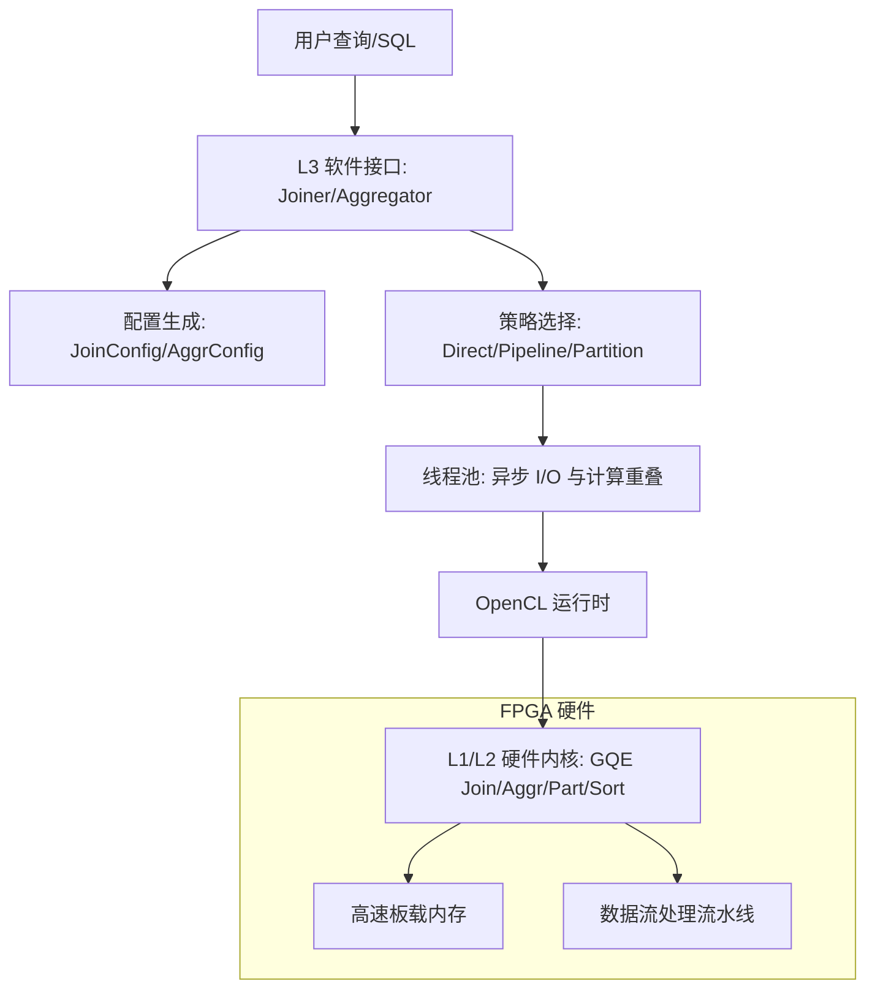

# database_query_and_gqe 模块深度解析

`database_query_and_gqe` 模块是高性能数据库查询加速的核心，它利用 FPGA 的并行处理能力，为大规模数据集上的 Join、Aggregation、Filter 和 Sort 等操作提供硬件级加速。该模块不仅包含底层的硬件内核（L1），还提供了一套完整的软件运行时框架（L3），旨在将 FPGA 的原始算力转化为易于集成的数据库算子。

## 1. 为什么需要这个模块？

在传统 CPU 架构中，处理 TB 级数据的数据库查询面临着严重的 I/O 瓶颈和计算压力。特别是 Join 和 Group By 操作，往往涉及大量的随机内存访问和复杂的逻辑判断。

`database_query_and_gqe` 模块通过以下方式解决这些问题：
- **硬件流水线化**：将复杂的查询逻辑映射为 FPGA 上的流水线，实现数据在流动中完成过滤、转换和聚合。
- **通用查询引擎 (GQE)**：不同于为每个 SQL 查询生成特定的硬件电路，GQE 提供了一组**可运行时配置**的通用内核。这意味着你不需要重新烧录 FPGA 镜像，只需通过软件发送不同的配置位（Config Bits），即可改变硬件的行为。
- **海量数据处理**：通过分区（Partitioning）和切片（Slicing）技术，该模块能够处理远超 FPGA 板载内存容量的数据集（如 100G+）。

## 2. 核心心智模型

理解该模块的关键在于把握以下三个核心抽象：

### 2.1 通用内核 (Generic Kernels)
想象 GQE 内核是一个功能极其复杂的“多功能加工机”。它有很多旋钮和开关（即配置位）。软件层通过 `JoinConfig` 或 `AggrConfig` 生成这些配置，告诉硬件：“这次你要把第 0 列和第 1 列做 Hash Join，过滤条件是第 2 列大于 100”。

### 2.2 表抽象 (Table & MetaTable)
`Table` 是数据的逻辑容器，采用列式存储（Columnar Storage）。`MetaTable` 则是硬件能理解的“说明书”，它描述了每一列在内存中的位置、长度以及数据的分区信息。

### 2.3 策略与执行 (Strategy & Threading Pool)
由于 FPGA 资源有限，而数据量可能无限，模块引入了执行策略：
- **Direct (Solution 0)**：数据量小，一次性搬运并执行。
- **Pipelined (Solution 1)**：利用双缓冲（Ping-Pong）技术，在 FPGA 计算当前块的同时，软件预先搬运下一块数据。
- **Partitioned (Solution 2)**：数据量极大时，先通过 `PartKernel` 将数据打散成小块，确保每一块都能放入 FPGA 的高速缓存（如 HBM/DDR）中进行处理。

## 3. 架构概览

### 数据流转路径
以一个典型的 `Join` 操作为例：
1. **准备阶段**：软件将原始数据封装进 `Table` 对象，并根据查询条件生成 `JoinConfig`。
2. **搬运阶段 (H2D)**：线程池启动，将 `Table` 的列数据和 `MetaTable` 描述符通过 PCIe 搬运到 FPGA 的 DDR/HBM。
3. **执行阶段**：软件触发 `gqeJoin` 内核。内核读取配置位，从内存中流式读入数据，在硬件内部构建 Hash Table 或进行 Probe 操作。
4. **回收阶段 (D2H)**：计算结果（通常是匹配的行 ID 或聚合后的值）被写回设备内存，随后由线程池异步搬运回主机内存。
5. **合并阶段**：如果是多分区执行，软件层最后负责将各个分区的中间结果进行最终合并。

## 4. 设计权衡与决策

### 4.1 通用性 vs. 性能
**决策**：选择了“运行时可配置的通用内核”而非“特定查询的专用电路”。
- **权衡**：专用电路在极致性能上可能略优，但 GQE 极大地降低了部署成本。用户无需等待漫长的硬件编译过程，即可实现秒级的查询切换。

### 4.2 异步并发 vs. 简单同步
**决策**：在 L3 层实现了复杂的 `threading_pool`。
- **权衡**：虽然增加了代码维护难度（涉及大量的 `std::thread`、`std::atomic` 和 OpenCL 事件管理），但这是隐藏 PCIe 延迟、实现吞吐量最大化的唯一途径。通过计算与传输的重叠，实际吞吐量可以接近硬件物理极限。

### 4.3 分区处理
**决策**：引入显式的分区内核（`gqePart`）。
- **权衡**：分区增加了额外的内存读写开销，但它解决了 FPGA 无法处理超大 Hash Table 的硬伤，使得系统具备了处理 100G 甚至更高量级数据的扩展性。

## 5. 子模块解析

该模块由以下核心子模块组成：

- [L1 复合排序内核](database_query_and_gqe-l1_compound_sort_kernels.md): 提供针对不同硬件平台（U200/U250/U280/U50）优化的排序硬件配置与连接定义。
- [L1 Hash Join 与聚合基准测试](database_query_and_gqe-l1_hash_join_and_aggregation_benchmark_hosts.md): 包含 Hash Join 各个变体（如 Semi-Join, Anti-Join）以及 Group Aggregation 的主机端测试框架。
- [L1/L2 查询与排序演示](database_query_and_gqe-l1_l2_query_and_sort_demos.md): 展示了如何将 GQE 内核应用于 TPC-H 复杂的业务查询（如 Q5, Q6）。
- [L3 GQE 执行线程与队列](database_query_and_gqe-l3_gqe_execution_threading_and_queues.md): 深入解析了 L3 层如何通过复杂的线程池和队列结构实现高性能的异步流水线执行。
- [L3 GQE 配置与表元数据](database_query_and_gqe-l3_gqe_configuration_and_table_metadata.md): 解释了软件如何抽象表结构（`Table`），以及如何将业务逻辑映射为硬件配置。

## 6. 开发者避坑指南
- **内存对齐**：所有传递给 `Table` 的原始指针必须是 4KB 对齐的（使用 `posix_memalign`），否则 PCIe DMA 传输性能会大幅下降甚至失败。
- **事件依赖链**：在修改 L3 的线程池逻辑时，务必仔细检查 `cl_event` 的依赖链。一个错误的依赖会导致死锁或读取到未完成的脏数据。
- **分区溢出**：在使用 Solution 2 时，如果数据分布极度不均（数据倾斜），某个分区可能会超过预设的 `part_max_nrow`。目前代码中通常有 `assert` 或错误检查，但在生产环境中需要预先评估数据分布。

---
*相关模块参考：*
- [数据搬运运行时](data_mover_runtime.md): 负责底层的 DMA 传输支持。
- [BLAS Python API](blas_python_api.md): 类似的加速器封装模式。
