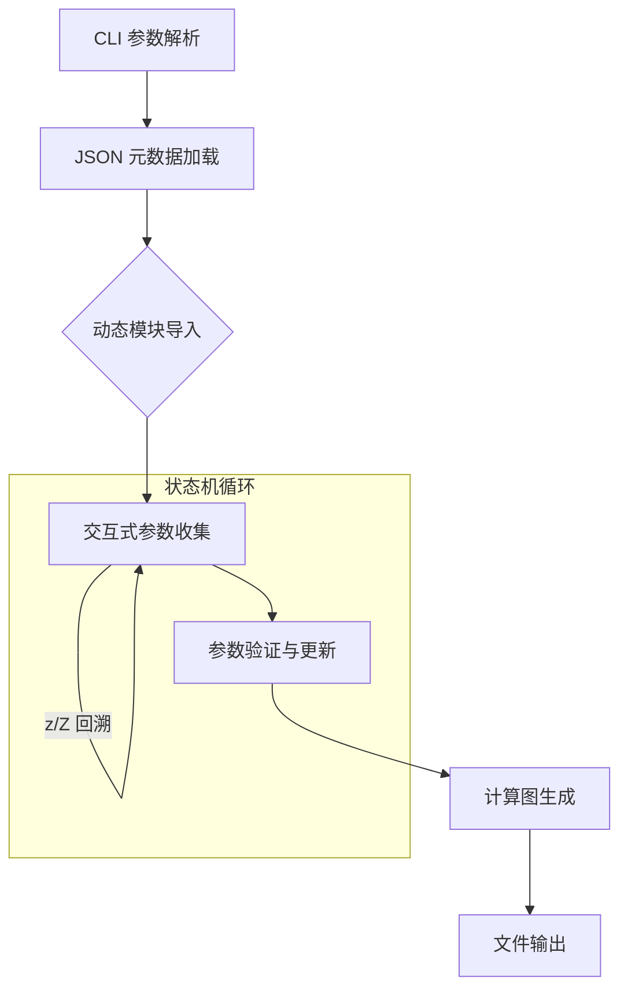
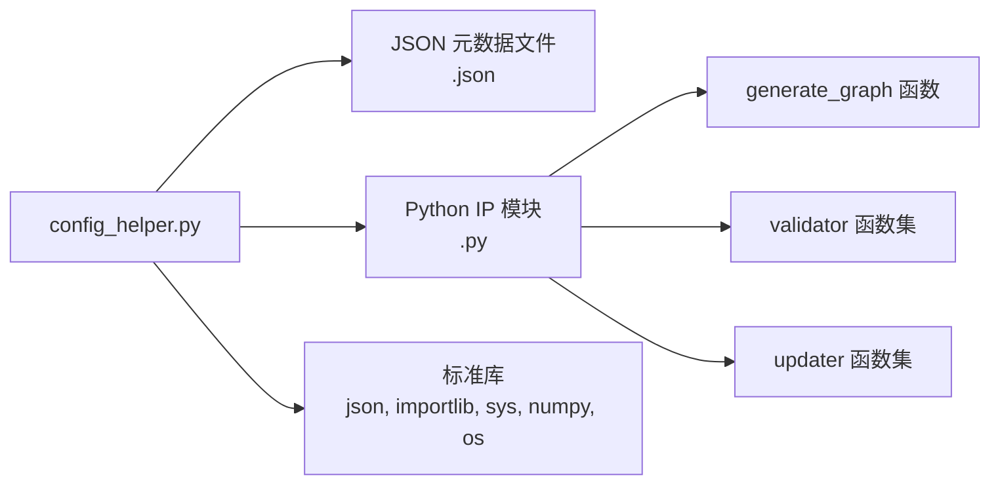

# dsp_meta_configuration 模块深度解析

想象你正在配置一台复杂的工业数控机床——这台机床有数十个可调的物理参数：主轴转速、进给速率、刀具补偿值、冷却液流量等等。每个参数都有严格的合法取值范围，而且某些参数之间还存在着微妙的联动关系：当你选择某种刀具材质时，主轴转速的上限会自动变化；当你提高进给速率时，冷却液流量必须相应增加。更糟糕的是，这里没有图形界面，只有一台老式的终端机，需要一步一步回答系统的提问。

**`dsp_meta_configuration`** 正是这样一个系统——它是 Xilinx/AMD DSPLIB 的配置向导核心，负责将 DSP IP 核的复杂元数据 schema 转化为可交互的 CLI 配置会话，并最终生成可执行的计算图实例。它不是简单的参数解析器，而是一个具备状态感知、动态约束求解和回溯能力的交互式配置引擎。

---

## 架构全景：三阶段配置流水线



### 核心抽象：`ip_parameter` 状态机

整个架构的核心是一个精巧的状态机设计——`ip_parameter` 类将每个 DSP IP 参数封装为一个具备完整生命周期管理能力的自治实体。不要把这看作是一个简单的数据容器，它更像是一个微型的交互式代理：

- **元数据层**：记录参数的名称、类型（`string`/`typename`/`vector`/数值）、默认值、合法取值范围（枚举或区间约束）、帮助信息
- **验证层**：通过外部注册的 `validator` 函数进行语义校验——这个设计的关键在于将领域特定的验证逻辑（如"FFT 点数必须是 2 的幂"）与配置框架本身解耦
- **动态约束层**：`updater` 函数是整个系统最具巧思的设计——它实现了跨参数的依赖求解。当一个参数被修改时，系统会重新计算所有依赖它的参数的合法取值范围。这正是为什么当你调整 FFT 点数时，某些相关参数的默认值会自动变化
- **交互层**：`get_input` 方法实现了用户输入的处理逻辑——包括默认值回退、数值类型校验、以及关键的 `z/Z` 回溯指令（允许用户在配置过程中返回修改之前的参数）

想象一下工厂的生产线：每个 `ip_parameter` 是线上的一个工作站，物料（用户输入）进入后，经过验证、约束求解、状态更新，然后流向下一个工作站。但与物理生产线不同的是，这里的"物料"可以向后回流——这就是 `z/Z` 回溯机制提供的"时间旅行"能力。

---

## 数据流：一次完整配置会话的生命周期

让我们追踪一次典型的 `conv_corr`（卷积/相关）IP 配置会话，从用户敲击回车键到最终生成计算图文件：

### 阶段 1：启动与引导（Bootstrapping）

```python
# CLI 参数解析：支持非交互式启动
--ip conv_corr          # 指定目标 IP
--mdir ./meta           # JSON 元数据目录
--outdir ./output       # 输出目录
LIST_PARAMS             # 只列出参数，不进入交互模式
```

系统首先解析命令行参数。注意到这里的命令解析器并非使用 `argparse` 这类标准库，而是手写的 `sys.argv` 扫描——这种设计源于项目需要支持一些特殊的标志位（如 `PRINT_GRAPH`、`NO_INSTANCE`），以及处理位置参数（`LIST_PARAMS` 这种不需要值的标志）。

**关键决策点**：为什么不用 `argparse`？

这看起来像是技术债务，但背后可能有一个务实的理由：这个脚本可能被嵌入到各种构建系统（Makefile、CMake）和 CI/CD 流水线中，保持最小的依赖可以降低环境配置的复杂度。此外，某些嵌入式或受限环境可能不提供完整的 Python 标准库。

### 阶段 2：元数据加载与动态模块绑定

```python
# 定位并加载 JSON 元数据
json_loc = f"{meta_dir}/{IP_in_use}.json"
with open(json_loc) as f:
    json_load = json.load(f)
    params_json = json_load["parameters"]
```

这里的关键设计是**元数据驱动架构**：IP 核的配置约束（合法取值范围、参数间依赖关系）不是硬编码在 Python 脚本中，而是存储在外部的 JSON 文件里。这使得添加新 IP 核支持时，通常只需要提供新的 JSON 元数据文件和相应的验证/更新函数模块，而无需修改配置框架本身。

**动态模块导入**是整个系统最精妙的设计之一：

```python
module_name = IP_in_use
module = importlib.import_module(module_name)
generate_graph = getattr(module, "generate_graph")
```

这里没有使用静态的 `import` 语句，而是通过 `importlib` 在运行时根据用户指定的 IP 名称动态加载对应的 Python 模块。这个设计实现了**延迟绑定**（late binding）：配置框架本身不依赖于任何特定的 IP 实现，而是在运行时才建立联系。

想象一下乐高积木：框架是标准的基座，而每个 IP 模块是一个可以插拔的积木块。只要积木块遵循标准接口（提供 `generate_graph` 函数），基座就能与之协同工作。

### 阶段 3：交互式参数收集状态机

这是整个系统的核心循环，实现了向导式的用户交互：

```python
idx = 0
while idx < len(param_list):
    # 创建参数对象
    new_helper_param = ip_parameter()
    ip_parameter_objects_dict.update({param_list[idx]: new_helper_param})
    
    # 绑定元数据...
    
    # 动态更新约束（关键！）
    ip_parameter_objects_dict[param_list[idx]].param_update(param_vals)
    
    # 输入-验证循环
    while ip_parameter_objects_dict[param_list[idx]].valid == "False":
        ip_parameter_objects_dict[param_list[idx]].get_input(param_vals)
        if ip_parameter_objects_dict[param_list[idx]].idx_inc == 1:  # 回溯信号
            break
        param_vals[param_list[idx]] = ip_parameter_objects_dict[param_list[idx]].value
        ip_parameter_objects_dict[param_list[idx]].param_validate(param_vals)
        
        # 如果验证失败，重新运行更新器获取建议值
        if ip_parameter_objects_dict[param_list[idx]].valid == "False":
            ip_parameter_objects_dict[param_list[idx]].param_update(param_vals)
```

这个循环体现了几个关键设计原则：

**1. 动态约束求解**

注意 `param_update` 在每个参数处理前都会被调用。这个函数通过调用外部注册的 `updater` 函数，根据当前已确定的参数值重新计算当前参数的合法取值范围。这实现了一个**前向链式的约束传播**系统：当你调整 FFT 点数时，所有依赖于此参数的其他参数（如缓冲区大小、精度模式等）的合法范围会自动更新。

可以把这想象成电子表格中的公式：改变一个单元格的值，所有依赖它的公式会自动重新计算。

**2. 双向导航（回溯）**

`z/Z` 输入检查是整个交互流程的安全网。当用户意识到之前输入的值有误时，不需要中断会话重新开始，而是可以向后导航到之前的参数进行修改。这通过 `idx_inc` 标志和索引的递减来实现。

**3. 验证失败时的智能建议**

当验证失败时，系统不仅报告错误，还会重新运行 `updater` 函数获取"最接近的合法值"建议。这体现在代码中的 `actual` 字段处理：如果更新器返回了 `actual` 字段，系统会打印一条友好消息，告诉用户虽然你请求的值不可行，但系统建议了一个最接近的合法值。

### 阶段 4：计算图生成与输出

当所有参数都通过验证后，系统进入最后阶段：

```python
# 获取实例名称
valid_instance_name = False
while not valid_instance_name:
    instanceName = input('\nPlease enter a name for your instance: ')
    valid_instance_name = validName(instanceName)

# 调用动态加载的模块生成计算图
instance_out = module.generate_graph(instanceName, param_vals)

# 写入文件
file = open(f"{out_dir}/graph_{IP_in_use}_{instanceName}.txt", "w")
file.write(instance_out["graph"])
file.close()
```

这里的关键是 `generate_graph` 函数的外部化：框架本身不知道如何将参数转换为计算图，而是将这个领域特定的逻辑委托给每个 IP 模块。这种**策略模式**（Strategy Pattern）的应用使得框架保持通用，而具体的图生成逻辑可以随 IP 的复杂性而变化。

---

## 设计决策与权衡

### 1. 动态导入 vs 静态依赖

**决策**：使用 `importlib.import_module` 在运行时动态加载 IP 模块。

**权衡分析**：

| 方案 | 优点 | 缺点 |
|------|------|------|
| 动态导入（当前） | 框架与 IP 实现解耦；新增 IP 无需修改框架；启动时间只加载需要的模块 | 运行时错误难以静态检查；IDE 无法提供自动补全；模块不存在时错误延迟到运行时 |
| 静态导入 | 编译期错误检查；IDE 友好；明确的依赖关系 | 框架必须导入所有可能的 IP 模块；新增 IP 需要修改框架代码；启动时间随 IP 数量增长 |

**为什么选择动态导入**：这个系统服务于 FPGA DSP IP 库，IP 数量众多且频繁新增。框架本身应该稳定，而 IP 的实现可以独立演进。动态导入实现了"开放-封闭原则"：对扩展开放（新增 IP），对修改封闭（框架无需改动）。

### 2. 交互式 CLI vs 配置文件

**决策**：使用交互式命令行向导作为主要接口。

**权衡分析**：

这个选择反映了一个深刻的领域洞察：DSP IP 的配置空间通常是**高维且强约束**的。简单的配置文件难以表达参数间的复杂依赖关系。交互式向导可以：

1. **渐进式揭示**：只在需要时询问参数，根据之前的选择动态调整后续问题
2. **即时验证**：每次输入后立即验证，避免积累大量错误后才发现
3. **智能建议**：当输入非法时，基于约束求解提供最接近的合法值

但这也带来局限性：难以自动化批量配置、无法纳入版本控制、难以与 CI/CD 流水线集成。

**设计缓解措施**：注意到系统支持 `LIST_PARAMS` 等非交互式标志，这表明设计者意识到了纯交互式的局限，提供了程序化接口的逃生舱。

### 3. 外部验证函数 vs 内部验证逻辑

**决策**：将验证逻辑和动态默认值计算委托给外部 Python 模块，通过函数名字符串在运行时绑定。

**权衡分析**：

JSON 元数据中存储的是验证/更新函数的**名称**（如 `"validator": "validate_fft_params"`），而非函数本身。这种"延迟绑定"策略的优点：

1. **声明式与命令式的分离**：JSON 描述"是什么"（参数结构），Python 模块描述"怎么做"（验证逻辑）
2. **领域特定语言的避免**：不需要在 JSON 中发明复杂的约束表达语法，直接用 Python 的表达能力
3. **可测试性**：验证逻辑是独立的 Python 函数，可以单独单元测试

风险在于：JSON 中引用的函数名与 Python 模块中的实际定义之间的**不同步**会导致运行时错误。这是一种"脆弱的外部接口"。

### 4. 可变状态与全局变量

**观察**：代码中大量使用全局可变状态（`param_vals` 字典、`ip_parameter_objects_dict` 等）。

**设计解读**：

这在现代软件工程中通常被视为反模式，但在这个特定上下文中，它反映了一个**务实的约束**：这是一个单次运行的 CLI 工具，而非长期运行的服务。程序的生命周期就是一次配置会话的生命周期，全局状态不会带来并发或内存泄漏问题。

更深层的观察是状态的组织方式：`param_vals` 字典作为"单一事实来源"（single source of truth），存储当前已确定的参数值；而 `ip_parameter_objects_dict` 存储的是与参数相关的**元操作**（验证、更新、输入处理）。这种分离使得约束传播可以基于简单的字典查找，而无需遍历复杂的对象图。

---

## 使用方式与扩展指南

### 命令行接口

```bash
# 基础交互式会话
python config_helper.py --ip fft_ifft_dit_1ch

# 指定元数据和输出目录
python config_helper.py --ip fir_decimate_asym --mdir ./custom_meta --outdir ./output

# 仅列出参数，不进入交互模式
python config_helper.py --ip matrix_mult LIST_PARAMS

# 打印生成的图到控制台
python config_helper.py --ip dds_mixer PRINT_GRAPH

# 生成但不实例化（用于验证参数组合）
python config_helper.py --ip fft_window NO_INSTANCE
```

### 交互式会话中的导航

在配置过程中，系统会逐个询问参数。特殊输入：

- **直接回车**：接受当前参数的默认值
- **`z` 或 `Z` 后回车**：回退到上一个参数（允许修改已输入的值）
- **数值/字符串**：输入自定义值，系统会立即验证合法性

如果输入值非法，系统会：
1. 显示错误信息
2. 如果存在接近的合法值，会建议该值
3. 重新询问同一参数

### 添加新 IP 支持

要为新的 DSP IP 核添加配置支持，需要创建三个文件：

**1. 元数据 JSON (`<ip_name>.json`)**

```json
{
  "parameters": [
    {
      "name": "FFT_N",
      "type": "int",
      "updater": {
        "function": "update_fft_n"
      },
      "validator": {
        "function": "validate_fft_n"
      }
    },
    {
      "name": "twiddle_type",
      "type": "typename",
      "updater": {
        "function": "update_twiddle_type"
      },
      "validator": {
        "function": "validate_twiddle_type"
      }
    }
  ]
}
```

**2. Python 逻辑模块 (`<ip_name>.py`)**

```python
def update_fft_n(param_vals):
    """
    根据其他参数动态计算 FFT_N 的合法范围。
    返回符合 JSON Schema 格式的约束描述。
    """
    # 示例：FFT 点数必须是 2 的幂，且受限于其他参数
    return {
        "enum": [16, 32, 64, 128, 256, 512, 1024]
    }

def validate_fft_n(param_vals):
    """
    验证用户输入的 FFT_N 是否合法。
    返回验证结果和错误信息。
    """
    n = param_vals.get("FFT_N")
    is_valid = (n in [16, 32, 64, 128, 256, 512, 1024])
    return {
        "is_valid": is_valid,
        "err_message": f"FFT_N must be power of 2, got {n}" if not is_valid else ""
    }

def generate_graph(instance_name, param_vals):
    """
    根据最终确定的参数生成计算图。
    返回包含图描述字符串的字典。
    """
    graph = f"""
    // Instance: {instance_name}
    // FFT_N: {param_vals['FFT_N']}
    // ... graph definition
    """
    return {"graph": graph}
```

**3. 将 JSON 和 Python 文件放置到正确位置**

- JSON 文件：`xf_dsp/L2/meta/<ip_name>.json`
- Python 模块：需要在 Python 路径中，确保 `import <ip_name>` 能成功

---

## 边缘情况与陷阱

### 1. 回溯的边界条件

当用户在第一个参数处尝试输入 `z` 回溯时，系统没有前置参数可以回退。代码中的处理逻辑：

```python
if ip_parameter_objects_dict[param_list[idx]].idx_inc == 1:
    if idx != 0: 
        idx -= 1  # 正常回溯
    # 注意：如果 idx == 0，不做任何操作，相当于忽略回溯请求
```

这意味着在第一个参数处按 `z` 会被静默忽略。这不是 bug，而是一种防御性设计：防止索引变为负数导致数组越界。

### 2. 向量类型的特殊处理

向量类型（`vector`）的处理与其他类型有显著差异：

```python
elif self.type=="vector":
    if param_vals[self.element_type] in ["int16", "int32", "cint16", "cint32"]:
        self.value=np.zeros(self.length).astype(int)
    else:
        self.value=np.zeros(self.length)
    break  # 注意：直接 break，不等待用户输入！
```

**关键洞察**：向量类型不接受交互式输入具体的元素值。系统只是根据 `element_type` 创建适当类型的 NumPy 零数组，然后让用户后续手动编辑生成的图文件。这背后的设计权衡：

- 向量可能包含数百甚至数千个元素，交互式逐个输入不现实
- 向量的内容通常依赖于具体的应用场景，很难在配置阶段预设
- 这是一种"延迟绑定"策略：配置阶段确定向量的"形状"（长度、类型），具体内容留给后续编辑

### 3. 动态导入的失败模式

如果用户指定的 IP 名称存在 JSON 元数据，但对应的 Python 模块无法导入：

```python
module_name = IP_in_use
module = importlib.import_module(module_name)  # 可能抛出 ImportError
generate_graph = getattr(module, "generate_graph")  # 可能抛出 AttributeError
```

代码中没有显式的 try-except 块来捕获这些异常。这意味着如果模块不存在或缺少 `generate_graph` 函数，程序会以 Python 的默认方式崩溃并打印堆栈跟踪。

**为什么这是可以接受的**：这是一个面向开发者/专业用户的工具，不是面向终端消费者的产品。崩溃时的堆栈跟踪提供了足够的信息来诊断问题（模块名拼写错误、文件路径问题等）。添加过度的错误处理反而会掩盖问题的根本原因。

### 4. 数值溢出的静默风险

在验证数值输入时：

```python
if ((user_input.isnumeric()) or (user_input== "")):
    self.value  = user_input or self.default
    self.value  = int(self.value)
    break
```

这里使用了 Python 的 `int()` 进行类型转换。在 Python 3 中，`int` 可以表示任意精度的整数（受限于可用内存），所以不存在 C 语言那样的整数溢出问题。但需要注意，如果后续的 `generate_graph` 或外部 C/C++ 代码期望的是特定宽度的整数（如 32 位有符号整数），过大的 Python `int` 可能导致下游溢出。

### 5. `param_vals` 的状态污染

`param_vals` 字典在全局作用域中被维护，并在迭代过程中被就地修改：

```python
param_vals.update({pj["name"] : ""})  # 初始化
# ...
param_vals[param_list[idx]] = ip_parameter_objects_dict[param_list[idx]].value  # 更新
```

这种设计的一个微妙风险是：当用户在某个参数处触发回溯（`z/Z`）时，当前参数的临时值可能已经被写入 `param_vals`，但在下一次迭代中会被覆盖或需要清理。当前的代码逻辑依赖于 Python 字典的就地更新语义，但在更复杂的状态管理场景下（如支持多层回溯或分支探索），这种简单的状态机可能需要重构为显式的状态栈。

### 6. 文件编码与字符集假设

代码中使用了 Unicode 上标数字的转换：

```python
def map_power(num):
    superscript_mapping = str.maketrans("0123456789", "⁰¹²³⁴⁵⁶⁷⁸⁹")  
    formatted_num = str(num).translate(superscript_mapping)
    return formatted_num
```

这个函数用于将 `2^31` 格式化为 `2³¹` 以增强可读性。这隐含假设了：

- 输出终端支持 Unicode 字符集（特别是上标数字 U+2070 到 U+2079）
- 如果终端使用 ASCII 或某些遗留编码，这些字符可能显示为乱码或问号

这是一个可接受的小风险，因为现代开发环境几乎普遍支持 Unicode。但如果需要兼容非常受限的嵌入式终端，可能需要添加 `--ascii` 标志来回退到 ASCII 表示（如 `2^31`）。

---

## 模块依赖关系

### 上游调用者

这个模块作为**入口点（entry point）**独立运行，不暴露 API 给其他模块调用。典型的调用方式是命令行直接执行：

```bash
python dsp/L2/meta/config_helper.py --ip fft_ifft_dit_1ch
```

或者通过构建系统的封装：

```makefile
# Makefile 中的典型用法
configure_fft:
    python $(DSP_META_DIR)/config_helper.py --ip fft_ifft_dit_1ch --outdir $(BUILD_DIR)
```

### 下游依赖



#### 外部数据契约：JSON Schema

JSON 元数据文件必须遵循以下隐式 schema：

```json
{
  "parameters": [
    {
      "name": "参数名，必须是有效的 Python 标识符",
      "type": "string|typename|vector|int|float",
      "updater": {
        "function": "函数名，必须在动态加载的模块中定义"
      },
      "validator": {
        "function": "函数名，必须在动态加载的模块中定义"
      },
      "element_type": "当 type 为 vector 时，指定元素类型"
    }
  ]
}
```

**关键契约**：`updater` 和 `validator` 引用的函数必须在动态加载的模块中定义，且遵循特定的签名约定：

- `updater(param_vals: dict) -> dict`：返回约束描述字典（包含 `enum`、`len`、`minimum`、`maximum` 等字段）
- `validator(param_vals: dict) -> dict`：返回验证结果字典（包含 `is_valid` 布尔值和可选的 `err_message`）

#### 外部代码契约：IP 模块接口

动态加载的 IP 模块必须提供以下接口：

```python
def generate_graph(instance_name: str, param_vals: dict) -> dict:
    """
    根据确定的参数生成计算图。
    
    Args:
        instance_name: 用户指定的实例名称
        param_vals: 包含所有参数最终取值的字典
        
    Returns:
        包含 "graph" 键的字典，值为计算图的字符串表示
    """
    pass
```

### 同级依赖（数据层面）

虽然模块之间没有直接的代码调用关系，但 `dsp_meta_configuration` 依赖于整个 DSPLIB 生态的元数据约定。特别是：

- `meta_dir` 目录下的 JSON 文件通常由 [graph_analytics_and_partitioning](graph_analytics_and_partitioning.md) 等上游模块在 IP 开发阶段生成
- 输出的计算图文件会被下游的 [hpc_iterative_solver_pipeline](hpc_iterative_solver_pipeline.md) 等模块消费，用于生成最终的 FPGA bitstream

---

## 扩展与定制指南

### 添加自定义参数类型

当前系统支持的参数类型包括：

| 类型 | 说明 | 输入处理方式 |
|------|------|-------------|
| `string` | 普通字符串 | 直接接受任何输入 |
| `typename` | C++ 类型名（如 `cint16`） | 同 `string` |
| `int`/`float` | 数值类型 | 强制转换为整数 |
| `vector` | 向量/数组 | 创建 NumPy 零数组，不接受元素级输入 |

如果需要添加新的参数类型（如枚举类型的特化处理），需要修改 `ip_parameter.get_input` 方法。

### 集成到 CI/CD 流水线

对于非交互式的自动化配置，可以创建一个包装脚本：

```python
#!/usr/bin/env python3
"""非交互式 DSPLIB IP 配置脚本，用于 CI/CD 集成。"""

import subprocess
import json
import sys

def configure_ip_non_interactive(ip_name, param_values, out_dir="./output"):
    """
    通过模拟输入流实现非交互式配置。
    
    Args:
        ip_name: IP 核名称
        param_values: 参数名称到取值的字典
        out_dir: 输出目录
    """
    # 构造模拟的输入序列
    # 注意：这需要深入了解参数的顺序和提示信息格式
    inputs = []
    for param_name, value in param_values.items():
        # 每个参数输入后需要换行符
        inputs.append(str(value))
    
    # 最后输入实例名称
    inputs.append(f"{ip_name}_inst")
    
    input_str = "\n".join(inputs) + "\n"
    
    # 运行配置助手
    cmd = [
        "python", "dsp/L2/meta/config_helper.py",
        "--ip", ip_name,
        "--outdir", out_dir
    ]
    
    result = subprocess.run(
        cmd,
        input=input_str,
        capture_output=True,
        text=True
    )
    
    if result.returncode != 0:
        raise RuntimeError(f"Configuration failed: {result.stderr}")
    
    return f"{out_dir}/graph_{ip_name}_{ip_name}_inst.txt"

if __name__ == "__main__":
    # 示例：非交互式配置 FFT IP
    result = configure_ip_non_interactive(
        "fft_ifft_dit_1ch",
        {"FFT_N": 1024, "DATA_TYPE": "cint16"}
    )
    print(f"Generated: {result}")
```

---

## 故障排查指南

### 常见问题 1：`ModuleNotFoundError: No module named 'fft_ifft_dit_1ch'`

**症状**：指定了 IP 名称后，程序崩溃并报告无法找到模块。

**根本原因**：动态导入失败，通常是因为：
1. IP 名称拼写错误
2. 对应的 Python 模块文件不存在于 Python 路径中
3. Python 模块存在但缺少 `generate_graph` 函数

**排查步骤**：
1. 确认 IP 名称在 `dsplib_ip_list` 中（运行 `LIST_PARAMS` 查看可用列表）
2. 检查 `meta_dir` 目录下是否存在 `{ip_name}.json` 文件
3. 确认 Python 可以导入该模块：
   ```python
   import importlib
   mod = importlib.import_module("fft_ifft_dit_1ch")
   print(dir(mod))  # 检查是否存在 generate_graph
   ```

### 常见问题 2：回溯后参数约束未正确更新

**症状**：用户输入 `z` 回溯到之前的参数并修改后，后续参数的合法范围没有相应更新。

**根本原因**：可能是 `updater` 函数实现不正确，没有正确读取 `param_vals` 中的当前值。

**排查步骤**：
1. 检查 `updater` 函数是否正确从 `param_vals` 字典读取依赖参数
2. 确认 `updater` 返回的字典格式正确（包含 `enum`、`minimum`、`maximum` 或 `len` 等字段）
3. 添加调试输出：
   ```python
   def update_fft_n(param_vals):
       print(f"DEBUG: current param_vals = {param_vals}")  # 添加
       # ... 原有逻辑
   ```

### 常见问题 3：向量类型参数行为异常

**症状**：配置向量类型参数时，系统不接受元素输入，或者生成的数组类型不正确。

**根本原因**：向量类型的处理逻辑与普通参数完全不同，可能存在 `element_type` 映射错误或 NumPy 类型推断问题。

**排查步骤**：
1. 检查 JSON 元数据中是否正确定义了 `element_type` 字段
2. 确认 `element_type` 的值在 `ip_parameter.get_input` 的映射逻辑中被正确处理：
   ```python
   if param_vals[self.element_type] in ["int16", "int32", "cint16", "cint32"]:
       self.value = np.zeros(self.length).astype(int)
   ```
3. 如果使用了自定义的 `element_type` 值，需要修改 `get_input` 方法添加对应的类型映射

### 常见问题 4：`generate_graph` 返回格式错误

**症状**：配置完成后，程序崩溃或生成的输出文件内容不正确。

**根本原因**：`generate_graph` 函数返回的数据结构不符合框架预期。

**排查步骤**：
1. 确认 `generate_graph` 返回的是字典，且包含 `"graph"` 键
2. 确认 `"graph"` 对应的值是字符串类型
3. 添加单元测试验证：
   ```python
   import fft_ifft_dit_1ch
   
   result = fft_ifft_dit_1ch.generate_graph("test_inst", {"FFT_N": 1024})
   assert "graph" in result
   assert isinstance(result["graph"], str)
   assert len(result["graph"]) > 0
   ```

---

## 与其他模块的关系

### 数据生产方

- **[graph_analytics_and_partitioning](graph_analytics_and_partitioning.md)**：生成 IP 核的初始元数据 schema，定义参数结构和基础约束
- **[codec_acceleration_and_demos](codec_acceleration_and_demos.md)**：某些 DSP IP 核的实现参考了编解码加速模块的算法优化

### 数据消费方

- **[hpc_iterative_solver_pipeline](hpc_iterative_solver_pipeline.md)**：消费本模块生成的计算图配置，进行求解器流水线编排
- **[data_mover_runtime](data_mover_runtime.md)**：根据配置生成的图文件调度数据搬运操作

### 平行协作

- **[database_query_and_gqe](database_query_and_gqe.md)**：在查询编译流程中使用了类似的元数据驱动配置模式，可相互参考实现

---

## 总结：`dsp_meta_configuration` 的设计智慧

这个模块体现了**务实的软件工程哲学**：它不追求理论上的完美解，而是在给定约束（硬件工程师的 CLI 环境、FPGA IP 的复杂约束、快速迭代的需求）下找到了一个优雅的平衡点。

其核心设计智慧可总结为四点：

1. **元数据驱动 + 延迟绑定**：将易变的 IP 特定知识与稳定的配置框架分离，通过 JSON 和动态导入实现"插件化"扩展，无需修改框架即可添加新 IP 支持。

2. 前向链式约束传播**：通过 `updater` 函数实现参数间动态依赖的实时求解，用户能立即看到修改某个参数对其他参数的连锁影响，避免了配置完成后才发现冲突的尴尬。

3. **容错与引导并重**：验证失败时不只是报错，而是通过 `actual` 机制提供最接近的合法值建议；`z/Z` 回溯机制允许在配置过程中"撤销"操作，降低了试错成本。

4. **领域特定语义的 Python 化**：不试图在 JSON 中发明复杂的约束表达 DSL，而是直接利用 Python 的表达能力，让验证和更新逻辑可以用完整的 Python 代码编写，既保持了声明式配置的简洁，又获得了命令式编程的灵活性。

理解这个模块的关键不在于记住它的类结构或函数签名，而在于把握其背后的**设计意图**：它是一个在工程师的交互式探索（尝试不同参数组合，观察约束如何变化）与机器需要的确定性配置（生成可被下游工具消费的精确图描述）之间架起的桥梁。每一次 `param_update` 的调用，都是这座桥上一块砖石的铺设。
