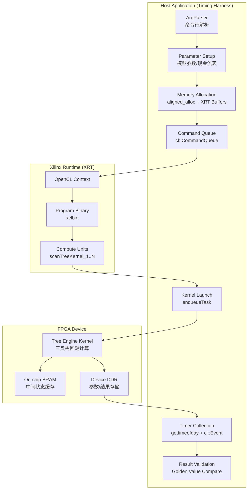

# Gaussian Short Rate Swaption Host Timing 模块深度解析

## 一句话概括

本模块是**基于 FPGA 加速的高斯短期利率模型（Hull-White / Vasicek）百慕大式互换期权（Bermudan Swaption）定价引擎的主机端基准测试框架**。它不仅是简单的 "测试程序"，而是连接金融数学模型、硬件加速内核与生产级性能评估的**关键桥梁**。

---

## 问题空间：我们到底在解决什么？

### 核心痛点

在金融衍生品定价领域，**百慕大式互换期权（Bermudan Swaption）** 的定价是计算密集型任务的典型代表：

1. **模型复杂度**：需要使用单因素短期利率模型（如 Hull-White 或 Vasicek）构建三叉树（Trinomial Tree），在每个时间步进行回溯计算（Backward Induction）。

2. **路径爆炸**：百慕大期权允许在多个预设日期提前行权，需要在树结构上对每个行权日进行最优停止时间（Optimal Exercise Boundary）的计算。

3. **实时性要求**：交易场景下需要毫秒级甚至微秒级的定价延迟，传统 CPU 实现难以满足。

### 为什么选择 FPGA？

- **并行度**：树结构的每一层计算具有天然的并行性，FPGA 可以实现大规模流水线并行。
- **确定性延迟**：相比 GPU 的线程调度开销，FPGA 提供确定的硬件级延迟保证。
- **功耗效率**：对于持续运行的定价服务，FPGA 的能效比显著优于 CPU/GPU。

### 本模块的特定角色

在 FPGA 加速方案中，我们需要回答一个关键问题：**"硬件加速到底快了多少？"** 这就是 `host_timing` 模块存在的意义——它不仅是功能验证工具，更是**性能计量（Metrology）基础设施**。

---

## 心智模型：如何理解这个系统？

### 类比：赛车测功机（Dynamometer）

想象你正在设计一款新的赛车引擎（FPGA 内核）。在比赛之前，你需要在测功机上测试它：

- **引擎控制单元参数**（Model Parameters）：空燃比、点火提前角 → Hull-White 模型的均值回归速度 $a$ 和波动率 $\sigma$
- **测功机负载设定**（Swaption Terms）：模拟的行驶阻力曲线 → 互换期权的行权时间表、固定/浮动端现金流
- **数据采集系统**（Timing Infrastructure）：扭矩传感器、转速计、温度探针 → OpenCL 事件分析（`CL_PROFILING_COMMAND_START/END`）、主机壁钟时间（`gettimeofday`）
- **标准测试循环**（Golden Reference）：EPA 城市/高速循环 → 预设的基准定价结果（Golden NPV）

**关键洞察**：测功机本身不是赛车，但没有它，你就无法知道引擎是否真的更快。`host_timing` 模块就是这个"测功机"。

### 核心抽象层次

```
┌─────────────────────────────────────────────────────────────┐
│  Layer 4: Validation & Metrology                            │
│  - Golden value comparison (NPV accuracy check)               │
│  - Statistical error analysis (fabs(out - golden) > minErr)  │
│  - Pass/Fail reporting via xf::common::utils_sw::Logger      │
├─────────────────────────────────────────────────────────────┤
│  Layer 3: Timing & Profiling Infrastructure                 │
│  - Host-side wall clock: struct timeval (gettimeofday)        │
│  - Device-side event tracing: cl::Event + CL_PROFILING_*      │
│  - Multi-CU (Compute Unit) orchestration & load balancing    │
├─────────────────────────────────────────────────────────────┤
│  Layer 2: FPGA Runtime & Data Movement                      │
│  - OpenCL Context/Queue management (xcl2.hpp)                │
│  - Buffer allocation: aligned_alloc + CL_MEM_EXT_PTR_XILINX │
│  - Memory migration: enqueueMigrateMemObjects (H2D/D2H)       │
├─────────────────────────────────────────────────────────────┤
│  Layer 1: Financial Model Parameterization                   │
│  - Model-specific calibration: a (mean reversion), σ        │
│  - Instrument terms: fixedRate, initTime[], exerciseCnt[]     │
│  - Market data: flatRate (yield curve), x0 (initial state)    │
└─────────────────────────────────────────────────────────────┘
```

---

## 架构设计与数据流

### 系统架构图



### 端到端数据流详解

#### Phase 1: 参数准备与内存分配 (主机端)

**关键操作路径**：
```cpp
// 1. 对齐内存分配（主机侧可缓存区域）
ScanInputParam0* inputParam0_alloc = aligned_alloc<ScanInputParam0>(1);
ScanInputParam1* inputParam1_alloc = aligned_alloc<ScanInputParam1>(1);

// 2. 硬编码的金融模型参数（HW vs V 模型的核心差异）
inputParam1_alloc[i].a = 0.055228873373796609;      // 均值回归速度
inputParam1_alloc[i].sigma = 0.0061062754654949824;  // 波动率
inputParam1_alloc[i].flatRate = 0.04875825;          // 平坦收益率曲线
```

**设计要点**：
- 使用 `aligned_alloc` 确保内存地址对齐（通常 4KB 边界），这是 FPGA DMA 传输的硬件要求
- 参数分为 `ScanInputParam0`（实例级参数，如名义本金）和 `ScanInputParam1`（模型参数，如均值回归系数），这种分离允许批处理时复用模型参数

#### Phase 2: XRT 运行时初始化

**关键操作路径**：
```cpp
// 1. 设备发现与上下文创建
std::vector<cl::Device> devices = xcl::get_xil_devices();
cl::Context context(device, NULL, NULL, NULL, &cl_err);

// 2. 命令队列配置（性能关键）
#ifdef SW_EMU_TEST
cl::CommandQueue q(context, device, CL_QUEUE_PROFILING_ENABLE, &cl_err);
#else
cl::CommandQueue q(context, device, CL_QUEUE_PROFILING_ENABLE | CL_QUEUE_OUT_OF_ORDER_EXEC_MODE_ENABLE, &cl_err);
#endif
```

**设计要点**：
- **设备发现**：使用 Xilinx 专用的 `xcl::get_xil_devices()` 而非标准 OpenCL 设备查询，确保加载 XRT 驱动
- **队列模式**：硬件模式下启用 `CL_QUEUE_OUT_OF_ORDER_EXEC_MODE_ENABLE`，允许内核执行与内存传输重叠（双缓冲/流水线），而软件仿真模式禁用乱序执行以保证确定性调试

#### Phase 3: 内核实例化与内存映射

**关键操作路径**：
```cpp
// 1. 动态 CU（计算单元）数量检测
cl::Kernel k(program, krnl_name.c_str());
k.getInfo(CL_KERNEL_COMPUTE_UNIT_COUNT, &cu_number);

// 2. 为每个 CU 创建独立内核实例
std::vector<cl::Kernel> krnl_TreeEngine(cu_number);
for (cl_uint i = 0; i < cu_number; ++i) {
    std::string krnl_full_name = krnl_name + ":{" + krnl_name + "_" + std::to_string(i + 1) + "}";
    krnl_TreeEngine[i] = cl::Kernel(program, krnl_full_name.c_str(), &cl_err);
}

// 3. 扩展内存指针（Xilinx 特定）
cl_mem_ext_ptr_t mext_in0 = {1, inputParam0_alloc, krnl_TreeEngine[c]()}; // Bank 1
cl_mem_ext_ptr_t mext_in1 = {2, inputParam1_alloc, krnl_TreeEngine[c]()}; // Bank 2
cl_mem_ext_ptr_t mext_out = {3, output[c], krnl_TreeEngine[c]()};          // Bank 3
```

**设计要点**：
- **CU 动态检测**：硬件比特流（xclbin）可能包含 1-N 个相同的计算单元，主机代码通过 `CL_KERNEL_COMPUTE_UNIT_COUNT` 在运行时检测并并行驱动所有 CU，实现水平扩展
- **内存银行分配**：通过 `cl_mem_ext_ptr_t` 的 `flags` 字段（1, 2, 3）显式指定 DDR 存储器银行（Bank），确保输入参数、模型参数和输出结果分布在不同物理内存通道，最大化带宽利用
- **物理地址连续性**：`CL_MEM_USE_HOST_PTR` 要求主机内存页锁定且物理连续，配合 `aligned_alloc` 满足 FPGA DMA 控制器的 scatter-gather 限制

#### Phase 4: 执行流水线与计时

**关键操作路径**：
```cpp
// 1. H2D (Host to Device) 内存迁移
q.enqueueMigrateMemObjects(ob_in, 0, nullptr, nullptr); // 0 = 写到设备

// 2. 内核启动（乱序队列允许与数据传输重叠）
gettimeofday(&start_time, 0); // 主机壁钟计时开始
for (int i = 0; i < cu_number; ++i) {
    q.enqueueTask(krnl_TreeEngine[i], nullptr, &events_kernel[i]);
}

// 3. 等待完成
q.finish();
gettimeofday(&end_time, 0); // 主机壁钟计时结束

// 4. 精确设备端计时（纳秒级）
events_kernel[c].getProfilingInfo(CL_PROFILING_COMMAND_START, &time1);
events_kernel[c].getProfilingInfo(CL_PROFILING_COMMAND_END, &time2);

// 5. D2H (Device to Host) 结果回传
q.enqueueMigrateMemObjects(ob_out, 1, nullptr, nullptr); // 1 = 读回主机
```

**设计要点**：
- **双计时策略**：
  - **主机壁钟** (`gettimeofday`)：测量端到端延迟（包含 XRT 开销、内存迁移、内核执行），反映生产环境的真实用户体验
  - **设备事件** (`CL_PROFILING_COMMAND_*`)：纯内核执行时间（纳秒精度），用于评估算法效率与硬件利用率，排除主机软件栈开销
- **流水线优化**：乱序队列 (`CL_QUEUE_OUT_OF_ORDER_EXEC_MODE_ENABLE`) 允许 `enqueueMigrateMemObjects`（下一批数据）与 `enqueueTask`（当前计算）重叠执行，隐藏传输延迟

#### Phase 5: 结果验证

**关键操作路径**：
```cpp
// 基于时间步的预设 Golden Value（来自 CPU 基准模型）
if (timestep == 10) golden = 13.668140761267875;  // HW Model
if (timestep == 50) golden = 13.19031464334458;
// ...

// 逐元素误差检查
for (int j = 0; j < len; j++) {
    DT out = output[i][j];
    if (std::fabs(out - golden) > minErr) {  // minErr = 10e-10
        err++;
        std::cout << "[ERROR] diff/NPV= " << (out - golden) / golden << std::endl;
    }
}
```

**设计要点**：
- **双精度验证**：`minErr` 设为 $10^{-10}$（相对于 NPV 约 $10^1$，相对误差约 $10^{-11}$），确保 FPGA 的定点/浮点实现与 CPU 双精度参考实现数值一致
- **多时间步覆盖**：提供 10、50、1000 等时间步的 Golden Value，验证树模型在不同离散化精度下的收敛性
- **相对误差报告**：输出 `(out - golden) / golden` 便于量化分析师评估模型风险（Model Risk）

---

## 设计决策与权衡

### 1. 为什么选择 OpenCL/XRT 而非 HLS 直接集成？

**权衡**：主机代码选择基于 OpenCL 标准的 XRT（Xilinx Runtime）API，而非直接调用 HLS 生成的 C++ 函数。

**理由**：
- **硬件抽象**：允许同一套主机代码在不重新编译的情况下，加载不同的 xclbin（如针对不同 FPGA 器件优化的比特流）
- **内存管理标准化**：通过 `cl_mem_ext_ptr_t` 和 `CL_MEM_EXT_PTR_XILINX` 扩展，显式控制物理内存布局，这是纯 HLS 难以实现的
- **生态兼容**：与 Vitis 统一软件平台集成，支持从软件仿真（sw_emu）到硬件仿真（hw_emu）再到实际硬件的平滑迁移

**代价**：引入了 XRT 依赖和 OpenCL 运行时开销，对于超低延迟场景（如高频交易），可能需要进一步使用 XRT Native API 或绕过 OpenCL 封装。

### 2. 双计时策略：壁钟 vs 设备事件

**权衡**：同时采集主机壁钟时间（`gettimeofday`）和设备端 OpenCL 事件时间戳（`CL_PROFILING_COMMAND_*`）。

**理由**：
- **端到端视角**：壁钟时间包含内存拷贝、内核启动开销和同步等待，反映真实业务延迟（P99/P999 指标）
- **硬件效率视角**：设备事件时间戳（纳秒级）排除主机软件抖动，用于计算 FPGA 实际利用率（内核执行时间 / 总时间）

**权衡细节**：
- 启用 `CL_QUEUE_PROFILING_ENABLE` 会在 XRT 驱动层增加时间戳记录开销（约几微秒），对于纳秒级敏感场景可禁用，但本模块作为基准测试工具，精度优先于开销。

### 3. 内存分配策略：页锁定与银行分配

**权衡**：使用 `aligned_alloc` 分配页锁定（Page-locked）内存，并通过 `cl_mem_ext_ptr_t` 显式指定 DDR Bank。

**理由**：
- **DMA 兼容性**：FPGA DMA 引擎通常要求物理连续的内存地址（Scatter-Gather 列表开销过高），页锁定内存防止操作系统交换页，确保物理地址不变。
- **带宽最大化**：通过将输入参数、模型参数和输出缓冲区映射到不同 DDR Bank（Bank 1/2/3），利用 FPGA 板卡的多通道内存架构（如 Alveo U280 的 4 通道 DDR4），实现并行读写。

**风险与契约**：
- **对齐要求**：`aligned_alloc` 的对齐参数必须与 XRT 的 `getpagesize()`（通常 4KB）对齐，否则 `cl::Buffer` 创建失败。
- **所有权生命周期**：`inputParam0_alloc` 等主机指针必须在 `cl::Buffer` 销毁后（或至少在 `enqueueMigrateMemObjects` 完成读回后）才能释放，否则导致 DMA 访问已释放内存。

### 4. 模型变体设计：HW vs Vasicek 的代码复用

**权衡**：HW（Hull-White）和 Vasicek 模型在数学上密切相关（HW 是 Vasicek 的扩展，允许时间依赖的漂移项），但在 FPGA 实现中采用了**独立的主机测试文件**（`TreeSwaptionEngineHWModel/host/main.cpp` vs `TreeSwaptionEngineVModel/host/main.cpp`）。

**理由**：
- **参数语义差异**：虽然都是高斯模型，但 HW 模型的参数 $a$（均值回归速度）和 $\sigma$（波动率）的校准值与 Vasicek 模型在数值上完全不同（如 HW 示例中 $a=0.055$, Vasicek 示例中 $a=0.160$），且 Golden Value 基准完全不同。
- **模型风险隔离**：在基准测试阶段，严格分离两种模型的测试逻辑，防止参数误用（如将 HW 的校准参数传入 Vasicek 内核），这种隔离是模型风险管理（Model Risk Management）的要求。

**代价与变通**：
- **代码重复**：两个文件约有 90% 的代码重复（XRT 初始化、内存管理、计时逻辑）。如果未来需要修改通用基础设施（如支持新的 XRT API），需要同步修改两处。
- **缓解策略**：可以通过重构提取公共基类（`TreeSwaptionHostBase`）来复用 XRT 逻辑，但当前设计优先考虑**显式性和可审计性**（Auditability），这在金融监管场景（如 SR 11-7 模型风险管理指南）中比代码 DRY 原则更重要。

---

## 跨模块依赖与集成

### 上游依赖（本模块依赖谁）

1. **[quantitative_finance_engines/l2_tree_based_interest_rate_engines](quantitative_finance_engines-l2_tree_based_interest_rate_engines.md)**
   - 父级模块，定义树模型引擎的通用架构和接口契约。

2. **Xilinx Runtime (XRT) / OpenCL**
   - `xcl2.hpp`：Xilinx 提供的 OpenCL 封装工具类
   - `cl::Context`, `cl::CommandQueue`, `cl::Kernel`：标准 OpenCL 对象

3. **Vitis 库**
   - `xf_utils_sw/logger.hpp`：标准化日志和测试通过/失败报告

### 下游依赖（谁依赖本模块）

本模块作为**叶子节点（Leaf Module）**，是基准测试的终端工具，通常不被其他生产代码直接依赖。但其生成的**时序性能数据**和**数值精度报告**会被上游的 CI/CD 流水线消费，用于：

- 回归测试（防止内核优化引入数值误差）
- 性能基准（确保新比特流版本未引入性能退化）

### 关键数据契约

#### 内核接口契约（Kernel Interface Contract）

主机代码与 FPGA 内核 `scanTreeKernel` 之间的 ABI 契约：

```cpp
// 内核签名（概念性）
__kernel void scanTreeKernel(
    int len,                                    // 标量：计算长度
    __global ScanInputParam0* inputParam0,    // Bank 1：实例参数
    __global ScanInputParam1* inputParam1,      // Bank 2：模型参数
    __global DT* output                         // Bank 3：输出 NPV 数组
);
```

**契约保证**：
- `inputParam0` 和 `inputParam1` 的生命周期必须覆盖内核执行期间（从 `enqueueTask` 到 `enqueueMigrateMemObjects` 完成读回）
- `output` 缓冲区必须预先分配 `N * K * sizeof(DT)` 字节，且主机侧已页锁定

#### 精度契约（Precision Contract）

- **数值类型**：`DT` 通常定义为 `double`（64 位浮点），确保与 CPU 参考实现的位级一致性
- **误差阈值**：`minErr = 10e-10`（$10^{-9}$），相对误差容忍度约 $10^{-10}$ 量级
- **Golden Value 来源**：通过独立的高精度 CPU 实现（如 QuantLib 或内部参考模型）离线计算，硬编码于源代码中

---

## 使用指南与操作注意事项

### 构建与运行流程

#### 1. 环境准备

```bash
# 设置 XRT 环境
source /opt/xilinx/xrt/setup.sh

# 对于软件仿真（sw_emu）
export XCL_EMULATION_MODE=sw_emu

# 对于硬件仿真（hw_emu）
export XCL_EMULATION_MODE=hw_emu

# 对于实际硬件运行（hw）
unset XCL_EMULATION_MODE
```

#### 2. 运行命令

```bash
# 基本运行（硬件模式）
./TreeSwaptionEngineHWModel -xclbin <path>/scanTreeKernel.xclbin

# 硬件仿真模式（自动检测 XCL_EMULATION_MODE 环境变量）
XCL_EMULATION_MODE=hw_emu ./TreeSwaptionEngineHWModel -xclbin <path>/scanTreeKernel_hw_emu.xclbin
```

### 关键配置参数说明

| 参数/变量 | 位置 | 说明 | 调优建议 |
|-----------|------|------|----------|
| `timestep` | `main.cpp` | 树模型的时间步数（离散化精度） | 生产环境建议 ≥100，验证时可降至 10 以加速仿真 |
| `cu_number` | 运行时检测 | FPGA 比特流中的计算单元数量 | 自动检测，无需手动设置，但需确保 xclbin 与 Alveo 卡匹配（U50/U200/U280） |
| `minErr` | 硬编码 | 数值验证的误差阈值 | 若频繁出现 `ERROR: diff/NPV` 超过阈值，检查是否使用了错误时间步的 Golden Value |
| `run_mode` | 环境变量推断 | 执行模式（hw/sw_emu/hw_emu） | `hw_emu` 模式下强制设置 `timestep=10` 以加速 Vivado 仿真，但数值结果可能与 Golden Value 不完全匹配 |

### 常见陷阱与调试技巧

#### 陷阱 1：XCL_EMULATION_MODE 与 xclbin 不匹配

**症状**：程序启动时报错 `Error: Failed to find kernel "scanTreeKernel"` 或 `CL_INVALID_BINARY`。

**根因**：在 `hw_emu` 模式下加载了为真实硬件 (`hw`) 编译的 xclbin，或反之。

**解决**：
```bash
# 检查环境变量
echo $XCL_EMULATION_MODE

# 确保 xclbin 后缀或路径匹配模式
# hw_emu 模式使用：scanTreeKernel_hw_emu.xclbin
# hw 模式使用：scanTreeKernel.xclbin
```

#### 陷阱 2：内存对齐失败导致的 DMA 错误

**症状**：`enqueueMigrateMemObjects` 时崩溃或返回 `CL_INVALID_VALUE`，或得到完全错误的 NPV 结果（随机数）。

**根因**：使用标准 `malloc` 而非 `aligned_alloc`，导致缓冲区未对齐到 XRT 要求的页边界（通常为 4KB）。

**代码检查点**：
```cpp
// 正确做法
ScanInputParam0* inputParam0_alloc = aligned_alloc<ScanInputParam0>(1);

// 错误做法（可能导致 DMA 故障）
ScanInputParam0* inputParam0_alloc = (ScanInputParam0*)malloc(sizeof(ScanInputParam0));
```

#### 陷阱 3：Golden Value 与时间步设置不匹配

**症状**：验证阶段报告大量 `[ERROR] Kernel-X: NPV diff` 超过阈值。

**根因**：代码根据 `timestep` 变量选择不同的 `golden` 值（如 `timestep=10` vs `timestep=50`）。如果在 `hw_emu` 模式下强制修改了时间步但未更新 Golden Value，或使用了错误模型的 Golden Value（HW vs V 模型），则验证失败。

**调试步骤**：
1. 确认当前运行的模型（HW 或 V），检查 `golden` 变量赋值逻辑
2. 检查 `timestep` 实际值（打印 `std::cout << "timestep=" << timestep`）
3. 确认 `minErr` 阈值适合当前模型规模（高时间步下数值误差可能略微增大）

---

## 扩展与维护指南

### 添加新的模型变体（如 BK 模型）

若需为 Black-Karasinski (BK) 模型添加主机计时支持：

1. **创建目录结构**：复制 `TreeSwaptionEngineHWModel` 为 `TreeSwaptionEngineBKModel`

2. **修改模型参数**：在 `main.cpp` 中更新参数结构体初始化：
   ```cpp
   // BK 模型使用对数正态分布，参数含义不同
   inputParam1_alloc[i].a = 0.1;      // 均值回归速度（对数空间）
   inputParam1_alloc[i].sigma = 0.01; // 波动率（对数空间）
   // BK 模型通常需要不同的 x0 初始化（对数短期利率）
   inputParam0_alloc[i].x0 = std::log(0.05); // 假设初始利率 5%
   ```

3. **更新 Golden Value**：使用 QuantLib 或其他参考实现预先计算 BK 模型在设定时间步下的 NPV，替换代码中的 `golden` 变量赋值。

4. **内核名称适配**：如果 BK 模型的 FPGA 内核名称不同（如 `scanTreeKernelBK`），更新 `krnl_name` 变量。

### 支持新的 FPGA 平台（如 U55C）

若需移植到新的 Alveo 卡（如从 U200 迁移到 U55C）：

1. **内存银行调整**：U55C 具有 HBM（高带宽存储器）而非 DDR，需要修改 `cl_mem_ext_ptr_t` 的 bank 分配逻辑：
   ```cpp
   // 对于 HBM，使用不同的扩展指针标志
   cl_mem_ext_ptr_t mext_in0 = {XCL_MEM_TOPOLOGY | 0, inputParam0_alloc, krnl_TreeEngine[c]()}; 
   ```

2. **CU 数量适配**：U55C 可支持更多计算单元，确保 xclbin 编译时配置了目标平台的 CU 数量，主机代码会自动检测 `cu_number`。

3. **连接配置文件**：确保 `connectivity.cfg`（决定内核端口到 DDR Bank 的映射）针对新平台的内存拓扑进行了优化。

---

## 总结

`gaussian_short_rate_swaption_host_timing` 模块是 **Xilinx 金融加速库中量化金融引擎的基准测试基石**。它不仅仅是 "一个测试程序"，而是：**连接金融数学理论与硬件加速实现的计量学基础设施**。

理解本模块的关键在于把握三个维度的复杂性：

1. **金融维度**：精确处理 Hull-White 与 Vasicek 模型的参数化差异，理解百慕大互换期权定价中的行权边界计算。

2. **系统架构维度**：精通 XRT/OpenCL 内存模型（页锁定、Bank 分配、H2D/D2H 传输），理解 CU（计算单元）水平扩展机制。

3. **计量学维度**：严格区分设备执行时间（算法效率）与端到端延迟（系统性能），建立从软件仿真到硬件部署的可重复性能评估流程。

对于新加入团队的开发者，建议从 **修改时间步（timestep）并观察 Golden Value 验证流程** 开始，逐步深入到内存对齐（alignment）和 XRT 事件分析（event profiling）的高级用法。

---

## 子模块详细文档

本模块包含两个具体的模型实现子模块，分别针对 Hull-White 模型和 Vasicek 模型：

- **[HW Model (TreeSwaptionEngineHWModel)](quantitative_finance_engines-l2_tree_based_interest_rate_engines-swaption_tree_engines_single_factor_short_rate_models-gaussian_short_rate_swaption_host_timing-hw_model.md)**：Hull-White  Trinomial Tree 实现，适用于对数正态分布假设下的均值回归利率模型。
  
- **[V Model (TreeSwaptionEngineVModel)](quantitative_finance_engines-l2_tree_based_interest_rate_engines-swaption_tree_engines_single_factor_short_rate_models-gaussian_short_rate_swaption_host_timing-v_model.md)**：Vasicek 模型实现，经典的单因素仿射期限结构模型，支持负利率场景。

这两个子模块共享相同的主机端基础设施（XRT 运行时、计时框架、验证逻辑），但在**模型参数校准值、Golden Value 基准和初始状态设定**上存在本质差异，详见各子模块文档。
